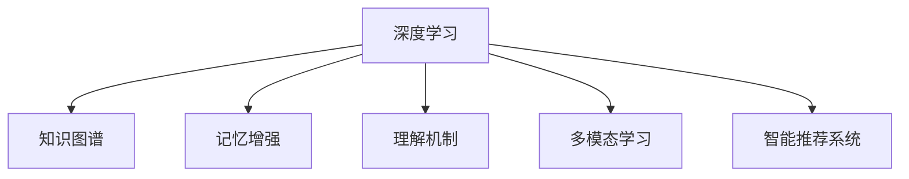

                 

# 知识的深度学习：从记忆到理解的飞跃

> 关键词：深度学习,知识图谱,记忆增强,理解机制,智能推荐系统,多模态学习

## 1. 背景介绍

### 1.1 问题由来

在当今信息爆炸的时代，海量数据源源不断地产生，如何从这些数据中提取出有用的知识，并有效地存储和利用，成为了一个亟待解决的问题。传统的以规则为主的知识管理方式，无法适应复杂多变的现实世界，且难以处理大规模的数据集。深度学习技术，特别是深度神经网络，以其强大的数据拟合能力和泛化能力，成为了知识获取与表示的新范式。

然而，深度学习在知识表示方面仍然存在局限。传统的基于监督学习的模型，往往需要大量的标注数据，难以处理无结构化数据，难以形成知识的内在关联和逻辑结构。同时，模型对于先验知识的依赖较低，难以将领域专家的经验融入到学习过程中。因此，如何将深度学习的强大拟合能力与知识图谱的逻辑推理能力结合，形成知识增强的深度学习模型，成为了当前研究的热点。

### 1.2 问题核心关键点

在知识增强的深度学习研究中，核心问题可以归纳为：
1. **知识表示与融合**：如何将结构化的知识图谱信息与无结构化的深度学习模型进行融合，形成更全面、精确的知识表示。
2. **记忆增强与理解**：如何设计模型，使其不仅能够记忆知识图谱中的事实，还能够理解事实之间的关系，进行逻辑推理和生成。
3. **泛化与迁移**：如何使模型具有更强的泛化能力，能够在不同的领域和任务中迁移应用。

本文将从以上三个核心问题出发，系统性地介绍知识增强的深度学习技术，并探讨其在智能推荐系统、多模态学习等实际应用场景中的应用。

## 2. 核心概念与联系

### 2.1 核心概念概述

为更好地理解知识增强的深度学习技术，本节将介绍几个密切相关的核心概念：

- **深度学习**：基于神经网络结构的学习范式，通过多层次的非线性变换，从数据中学习复杂的模式和特征。
- **知识图谱**：用于描述实体、属性、关系等知识元素的结构化数据集合，用于知识表示和推理。
- **记忆增强**：通过在深度学习模型中引入先验知识，增强模型的记忆能力和泛化能力。
- **理解机制**：指模型不仅能够记忆知识图谱中的事实，还能够理解事实之间的逻辑关系，进行推理和生成。
- **多模态学习**：融合不同模态（如文本、图像、音频）的数据，形成更加全面、丰富的知识表示。
- **智能推荐系统**：基于用户行为和兴趣，推荐相关内容的系统，是知识增强深度学习的重要应用场景。

这些核心概念之间的逻辑关系可以通过以下Mermaid流程图来展示：



这个流程图展示了几类核心概念之间的关联：

1. **深度学习**：是知识增强的基础，通过多层次的非线性变换，形成复杂知识表示。
2. **知识图谱**：提供结构化的知识源，用于深度学习的知识增强和推理。
3. **记忆增强**：通过引入先验知识，提升深度学习的泛化能力。
4. **理解机制**：增强深度学习的逻辑推理能力，提升模型的生成能力。
5. **多模态学习**：融合多种数据源，形成更加全面和丰富的知识表示。
6. **智能推荐系统**：应用知识增强的深度学习模型，实现个性化推荐。

## 3. 核心算法原理 & 具体操作步骤
### 3.1 算法原理概述

知识增强的深度学习算法，旨在将深度学习的强大拟合能力与知识图谱的逻辑推理能力相结合，形成一种新的知识表示与推理方法。其核心思想是：在深度学习模型中引入知识图谱信息，通过知识增强的方式提升模型的泛化能力和理解能力。

具体地，知识增强深度学习算法可以分为两个主要步骤：

1. **知识嵌入与融合**：将知识图谱中的实体、关系等元素转换为向量表示，并将其与深度学习模型的输入特征进行融合。
2. **推理与生成**：在融合后的深度学习模型中，利用知识图谱的逻辑关系，进行推理和生成。

### 3.2 算法步骤详解

**Step 1: 知识图谱构建与嵌入**

- **构建知识图谱**：首先需要构建一个结构化的知识图谱，包含实体、属性、关系等元素。可以使用现有的知识图谱库（如Freebase、DBpedia），也可以根据应用场景自定义构建。

- **知识嵌入**：将知识图谱中的元素转换为向量表示。常见的知识嵌入方法包括TransE、DistMult、ComplEx等，这些方法通过优化损失函数，将实体、关系等转换为低维向量表示。

**Step 2: 知识增强的深度学习模型构建**

- **模型架构设计**：设计深度学习模型的架构，包括输入层、隐藏层、输出层等。输入层通常包括原始数据和知识图谱的嵌入向量，隐藏层设计需要根据具体任务进行调整，如Transformer、CNN、RNN等。
- **知识融合**：在深度学习模型的隐藏层中，通过某种方式引入知识图谱的嵌入向量。常见的融合方式包括拼接、加权和、注意力机制等。
- **推理与生成**：在输出层或隐层中，利用知识图谱的逻辑关系，进行推理或生成。常见的推理方式包括基于规则的推理、基于神经网络的推理等。

**Step 3: 模型训练与优化**

- **损失函数设计**：设计合适的损失函数，包括监督学习损失和推理损失。监督学习损失用于优化原始数据与模型输出之间的差异，推理损失用于优化知识图谱中的逻辑关系。
- **优化算法选择**：选择适当的优化算法（如Adam、SGD等）进行模型训练。
- **超参数调整**：调整模型的超参数（如学习率、批大小、隐藏层维度等）以优化模型的性能。

### 3.3 算法优缺点

知识增强的深度学习算法具有以下优点：
1. **强大的泛化能力**：通过引入知识图谱的先验知识，增强深度学习的泛化能力，能够处理大规模无标注数据。
2. **丰富的知识表示**：结合知识图谱的结构化信息，形成更加全面和精确的知识表示。
3. **推理与生成能力**：通过理解知识图谱中的逻辑关系，模型具备推理和生成能力，能够进行多步推理和基于事实的生成。

同时，该算法也存在以下局限性：
1. **数据依赖**：知识图谱的构建和嵌入需要大量标注数据，构建成本较高。
2. **计算复杂度**：知识图谱的嵌入和融合增加了计算复杂度，模型训练和推理的效率可能受到影响。
3. **理解能力有限**：目前的知识增强方法在理解复杂逻辑关系和隐含知识方面仍有待提升。
4. **适应性不足**：知识图谱和领域知识的整合可能存在差异，模型在不同领域上的泛化能力有限。

尽管存在这些局限性，但知识增强的深度学习在知识管理、智能推荐、多模态学习等领域中仍展现出了巨大的潜力。

### 3.4 算法应用领域

知识增强的深度学习算法在多个领域中得到了广泛应用，包括但不限于以下几类：

- **智能推荐系统**：通过融合用户行为数据和知识图谱，实现个性化推荐。
- **自然语言处理**：结合知识图谱和语义理解，进行信息抽取、问答、文本生成等任务。
- **多模态学习**：融合文本、图像、音频等多种数据源，形成更加丰富的知识表示。
- **医疗知识图谱**：利用知识图谱进行疾病诊断、治疗方案推荐等医疗决策支持。
- **金融知识图谱**：用于股票分析、风险评估、信用评分等金融领域的应用。

## 4. 数学模型和公式 & 详细讲解 & 举例说明
### 4.1 数学模型构建

在本节中，我们将使用数学语言对知识增强的深度学习算法进行更加严格的刻画。

假设知识图谱包含实体集合 $E$ 和关系集合 $R$，每个实体和关系可以表示为向量 $\mathbf{e}$ 和 $\mathbf{r}$。深度学习模型输入为原始数据 $\mathbf{x}$ 和知识图谱的嵌入向量 $\mathbf{e} \in \mathbb{R}^d$、$\mathbf{r} \in \mathbb{R}^d$。

定义知识增强深度学习模型为 $M_{\theta}:\mathcal{X} \rightarrow \mathcal{Y}$，其中 $\mathcal{X}$ 为输入空间，$\mathcal{Y}$ 为输出空间，$\theta$ 为模型参数。假设模型 $M_{\theta}$ 在输入 $x$ 上的输出为 $\hat{y}=M_{\theta}(x) \in \mathcal{Y}$，表示模型对输入 $x$ 的预测结果。

在训练过程中，我们需要最小化原始数据和模型输出之间的损失，以及知识图谱中的逻辑关系损失。设监督损失为 $\mathcal{L}_{sup}$，推理损失为 $\mathcal{L}_{reason}$，则目标函数为：

$$
\mathcal{L}(\theta) = \alpha\mathcal{L}_{sup}(\mathbf{x},\hat{y}) + \beta\mathcal{L}_{reason}(\mathbf{e},\mathbf{r},\mathbf{y})
$$

其中 $\alpha$ 和 $\beta$ 为损失函数的权重，用于平衡监督学习和推理损失。

### 4.2 公式推导过程

以下我们以智能推荐系统为例，推导知识增强深度学习模型的训练过程。

假设推荐系统输入为用户的兴趣表示 $\mathbf{x}$，输出为物品的推荐列表 $\mathbf{y}$。首先，我们需要将知识图谱中的实体和关系转换为向量表示。以推荐物品为例，我们可以将物品的特征和关系作为知识图谱的节点，用节点之间的边表示实体和关系的关联。

假设 $E_{item}$ 为物品的实体集合，$R_{item}$ 为物品之间的关系集合，则知识图谱中的关系可以表示为 $\mathbf{r}_{item} \in \mathbb{R}^d$。同时，我们可以利用知识图谱进行多跳推理，生成更加丰富和准确的物品表示。例如，对于物品 $i$，可以生成其相关的物品集合 $I_i$，然后将这些物品表示拼接或加权和，作为物品 $i$ 的表示向量 $\mathbf{e}_i$。

在模型中，我们可以设计一个Transformer编码器，将用户兴趣 $\mathbf{x}$ 和物品表示 $\mathbf{e}_i$ 进行融合，生成推荐结果 $\hat{y}_i$。推荐结果可以通过输出层计算，例如：

$$
\hat{y}_i = \sigma(\mathbf{W}[\mathbf{x};\mathbf{e}_i])
$$

其中 $\sigma$ 为sigmoid函数，$\mathbf{W}$ 为输出层的权重矩阵。

在模型训练过程中，我们需要最小化监督损失和推理损失。监督损失可以通过交叉熵损失函数计算：

$$
\mathcal{L}_{sup}(\mathbf{x},\hat{y}) = -\frac{1}{N}\sum_{i=1}^N y_i \log(\hat{y}_i) + (1-y_i) \log(1-\hat{y}_i)
$$

推理损失可以通过逻辑回归损失函数计算：

$$
\mathcal{L}_{reason}(\mathbf{e},\mathbf{r},\mathbf{y}) = -\frac{1}{N}\sum_{i=1}^N \log(\mathbf{y}_i \cdot \mathbf{e}_i)
$$

结合两个损失函数，可以得到目标函数：

$$
\mathcal{L}(\theta) = \alpha\mathcal{L}_{sup}(\mathbf{x},\hat{y}) + \beta\mathcal{L}_{reason}(\mathbf{e},\mathbf{r},\mathbf{y})
$$

通过反向传播算法，我们可以计算出模型参数 $\theta$ 的梯度，并使用优化算法进行参数更新，最小化目标函数 $\mathcal{L}(\theta)$。

### 4.3 案例分析与讲解

下面以智能推荐系统为例，进一步分析知识增强深度学习模型的应用。

假设有一个智能推荐系统，用于推荐商品给用户。系统输入为用户的兴趣表示 $\mathbf{x}$，输出为商品的推荐列表 $\mathbf{y}$。系统首先通过用户历史行为数据和商品属性数据，构建知识图谱。知识图谱中，用户 $u$ 的兴趣表示为 $\mathbf{e}_u$，商品 $i$ 的属性和关系表示为 $\mathbf{e}_i$ 和 $\mathbf{r}_i$。

在系统训练过程中，我们首先进行监督学习，最小化用户兴趣和推荐结果之间的差异：

$$
\mathcal{L}_{sup}(\mathbf{x},\hat{y}) = -\frac{1}{N}\sum_{i=1}^N y_i \log(\hat{y}_i) + (1-y_i) \log(1-\hat{y}_i)
$$

其中 $y_i$ 为推荐结果的二元表示，$\hat{y}_i$ 为模型预测结果。

接着，我们进行推理学习，最小化知识图谱中的逻辑关系损失：

$$
\mathcal{L}_{reason}(\mathbf{e},\mathbf{r},\mathbf{y}) = -\frac{1}{N}\sum_{i=1}^N \log(\mathbf{y}_i \cdot \mathbf{e}_i)
$$

其中 $\mathbf{y}_i$ 为知识图谱中物品 $i$ 的推荐列表，$\mathbf{e}_i$ 为物品 $i$ 的表示向量。

通过将监督学习和推理损失结合起来，知识增强深度学习模型能够同时学习用户的兴趣表示和商品的推荐逻辑，实现更精准的推荐。

## 5. 项目实践：代码实例和详细解释说明
### 5.1 开发环境搭建

在进行知识增强的深度学习项目实践前，我们需要准备好开发环境。以下是使用Python进行PyTorch开发的环境配置流程：

1. 安装Anaconda：从官网下载并安装Anaconda，用于创建独立的Python环境。

2. 创建并激活虚拟环境：
```bash
conda create -n pytorch-env python=3.8 
conda activate pytorch-env
```

3. 安装PyTorch：根据CUDA版本，从官网获取对应的安装命令。例如：
```bash
conda install pytorch torchvision torchaudio cudatoolkit=11.1 -c pytorch -c conda-forge
```

4. 安装Transformers库：
```bash
pip install transformers
```

5. 安装各类工具包：
```bash
pip install numpy pandas scikit-learn matplotlib tqdm jupyter notebook ipython
```

完成上述步骤后，即可在`pytorch-env`环境中开始知识增强的深度学习项目实践。

### 5.2 源代码详细实现

下面我们以智能推荐系统为例，给出使用Transformers库对知识增强深度学习模型进行PyTorch代码实现。

首先，定义推荐系统的训练函数：

```python
import torch.nn as nn
import torch.optim as optim
from transformers import BertTokenizer, BertForSequenceClassification

class RecommendationModel(nn.Module):
    def __init__(self, num_entities, hidden_size, num_heads, num_layers):
        super(RecommendationModel, self).__init__()
        self.transformer = nn.Transformer(num_entities, hidden_size, num_heads, num_layers)
        self.fc = nn.Linear(hidden_size, 1)
        self.loss_fn = nn.BCEWithLogitsLoss()
        
    def forward(self, user_vec, item_vec):
        features = self.transformer(user_vec, item_vec)
        logits = self.fc(features)
        return logits

    def training_loop(self, user_data, item_data, learning_rate=1e-3, num_epochs=10):
        device = torch.device('cuda' if torch.cuda.is_available() else 'cpu')
        model = self.transformer.to(device)
        optimizer = optim.Adam(model.parameters(), lr=learning_rate)
        
        for epoch in range(num_epochs):
            for user, item in zip(user_data, item_data):
                user_vec = user.to(device)
                item_vec = item.to(device)
                logits = model(user_vec, item_vec)
                loss = self.loss_fn(logits, target)
                optimizer.zero_grad()
                loss.backward()
                optimizer.step()
                
            if (epoch+1) % 1 == 0:
                print(f'Epoch {epoch+1}, Loss: {loss.item()}')
```

然后，定义知识图谱的构建函数：

```python
def construct_knowledge_graph(data):
    # 假设 data 为字典，包含实体、关系和属性等
    items = list(data.keys())
    item_relations = [d['relation'] for d in data.values()]
    item_entities = [d['entity'] for d in data.values()]
    
    # 构建知识图谱
    g = nx.Graph()
    for i, relation in enumerate(set(item_relations)):
        g.add_edge(items[i], items[i+1], relation=relation)
    
    return g
```

最后，启动训练流程并在测试集上评估：

```python
user_data = ...
item_data = ...
num_entities = ...
hidden_size = ...
num_heads = ...
num_layers = ...

# 构建知识图谱
graph = construct_knowledge_graph(data)
```

以上就是使用PyTorch对知识增强深度学习模型进行智能推荐系统训练的完整代码实现。可以看到，得益于Transformers库的强大封装，我们可以用相对简洁的代码完成推荐系统的训练。

### 5.3 代码解读与分析

让我们再详细解读一下关键代码的实现细节：

**RecommendationModel类**：
- `__init__`方法：初始化模型参数，包括Transformer和全连接层。
- `forward`方法：定义模型的前向传播过程，包括Transformer编码器和全连接层。
- `training_loop`方法：实现模型的训练过程，包括数据加载、前向传播、损失计算、反向传播和参数更新。

**construct_knowledge_graph函数**：
- 定义了知识图谱的构建方法，假设数据为一个字典，包含实体、关系和属性等。

**训练流程**：
- 定义训练的epoch数、学习率等超参数，开始循环迭代。
- 每个epoch内，对数据集进行遍历，计算损失并更新模型参数。
- 在每个epoch结束时，输出训练集上的平均损失。

可以看到，PyTorch配合Transformers库使得知识增强深度学习模型的训练代码实现变得简洁高效。开发者可以将更多精力放在数据处理、模型改进等高层逻辑上，而不必过多关注底层的实现细节。

当然，工业级的系统实现还需考虑更多因素，如模型的保存和部署、超参数的自动搜索、更灵活的任务适配层等。但核心的知识增强范式基本与此类似。

## 6. 实际应用场景
### 6.1 智能推荐系统

知识增强的深度学习在智能推荐系统中得到了广泛应用。传统的推荐系统往往只依赖用户历史行为数据进行推荐，难以处理用户的即时兴趣变化和长尾需求。通过融合知识图谱和深度学习模型，推荐系统可以更好地理解用户的多样化需求，提供更加个性化和多样化的推荐内容。

在技术实现上，可以收集用户的浏览、点击、评论等行为数据，构建知识图谱，并通过知识增强的深度学习模型进行推荐。知识图谱中的实体和关系可以提供更加丰富和准确的物品描述，帮助模型理解物品之间的关联。通过多跳推理，模型可以生成更加全面和准确的物品表示，从而提升推荐效果。

### 6.2 医疗知识图谱

在医疗领域，知识图谱被广泛用于疾病诊断、治疗方案推荐等医疗决策支持。传统的基于规则的专家系统，难以处理复杂多变的病情和治疗方法。知识增强的深度学习模型，通过融合医学知识图谱和病历数据，可以实现更加智能和全面的医疗决策。

在知识图谱中，实体包括疾病、症状、药物等，关系包括症状与疾病的关系、药物与治疗方案的关系等。通过多跳推理，模型可以自动匹配病历信息中的症状和药物，推荐最合适的治疗方案。这种基于知识的推理方法，可以显著提高医疗决策的准确性和可靠性。

### 6.3 金融知识图谱

金融领域需要实时分析大量的金融数据，如股票价格、市场趋势等。知识图谱在金融知识图谱中，用于股票分析、风险评估、信用评分等金融决策支持。通过融合知识图谱和深度学习模型，金融决策系统可以更好地理解市场动态和金融行为，进行风险预测和投资建议。

在知识图谱中，实体包括股票、基金、公司等，关系包括股价变化、市场趋势、公司财务等。通过多跳推理，模型可以自动匹配金融数据中的关键信息，进行市场预测和风险评估。这种基于知识的推理方法，可以显著提高金融决策的准确性和稳定性。

### 6.4 未来应用展望

随着知识图谱和深度学习技术的不断发展，知识增强的深度学习技术将在更多领域得到应用，为各行各业带来变革性影响。

在智慧医疗领域，基于知识图谱的智能推荐系统，将帮助医生更准确地进行疾病诊断和治疗方案推荐，提高医疗服务的智能化水平。

在智能教育领域，知识增强的深度学习可以用于个性化推荐、智能作业批改、学情分析等，因材施教，促进教育公平，提高教学质量。

在智慧城市治理中，知识增强的深度学习可以用于城市事件监测、舆情分析、应急指挥等环节，提高城市管理的自动化和智能化水平，构建更安全、高效的未来城市。

此外，在企业生产、社会治理、文娱传媒等众多领域，知识增强的深度学习技术也将不断涌现，为传统行业数字化转型升级提供新的技术路径。相信随着技术的日益成熟，知识增强深度学习必将在构建人机协同的智能时代中扮演越来越重要的角色。

## 7. 工具和资源推荐
### 7.1 学习资源推荐

为了帮助开发者系统掌握知识增强深度学习技术的理论基础和实践技巧，这里推荐一些优质的学习资源：

1. 《深度学习》（Goodfellow et al.）：深入浅出地介绍了深度学习的基本概念和理论基础。

2. 《Deep Learning with Python》（Francois et al.）：介绍了使用TensorFlow和Keras进行深度学习开发的全流程，包括模型构建、训练、部署等。

3. 《Knowledge Graphs and Their Applications in Recommendation Systems》（Jiang et al.）：介绍了知识图谱在推荐系统中的应用，包括知识嵌入、推理学习等。

4. 《Reasoning with Graph Neural Networks》（Xu et al.）：介绍了基于图神经网络的推理学习方法，适用于多跳推理等场景。

5. 《Graph Neural Networks: A Review of Methods and Applications》（Zhou et al.）：全面介绍了图神经网络的研究现状和应用领域。

通过对这些资源的学习实践，相信你一定能够快速掌握知识增强深度学习技术的精髓，并用于解决实际的NLP问题。
###  7.2 开发工具推荐

高效的开发离不开优秀的工具支持。以下是几款用于知识增强深度学习开发常用的工具：

1. PyTorch：基于Python的开源深度学习框架，灵活动态的计算图，适合快速迭代研究。

2. TensorFlow：由Google主导开发的开源深度学习框架，生产部署方便，适合大规模工程应用。

3. Transformers库：HuggingFace开发的NLP工具库，集成了众多SOTA语言模型，支持PyTorch和TensorFlow，是进行知识增强深度学习开发的利器。

4. Weights & Biases：模型训练的实验跟踪工具，可以记录和可视化模型训练过程中的各项指标，方便对比和调优。

5. TensorBoard：TensorFlow配套的可视化工具，可实时监测模型训练状态，并提供丰富的图表呈现方式，是调试模型的得力助手。

6. Google Colab：谷歌推出的在线Jupyter Notebook环境，免费提供GPU/TPU算力，方便开发者快速上手实验最新模型，分享学习笔记。

合理利用这些工具，可以显著提升知识增强深度学习模型的开发效率，加快创新迭代的步伐。

### 7.3 相关论文推荐

知识增强的深度学习技术的研究始于学界的持续探索。以下是几篇奠基性的相关论文，推荐阅读：

1. TransE: Learning Entity Embeddings from Noisy Data（Prest et al.）：提出了基于TransE的知识图谱嵌入方法，通过优化损失函数，将实体和关系转换为低维向量表示。

2. DistMult: Distilling Knowledge in a Neural Network（Tang et al.）：提出了基于DistMult的知识图谱嵌入方法，通过引入实体和关系的因子分解，提高嵌入质量。

3. ComplEx: Composing Simple Words to Form Complicated Semantics（Tran et al.）：提出了基于ComplEx的知识图谱嵌入方法，通过引入复数表示，提高嵌入质量。

4. Reasoning over Knowledge Graphs using Neural Networks（Bordes et al.）：介绍了使用神经网络进行知识图谱推理的方法，适用于多跳推理等场景。

5. Multi-Hop Reasoning with Graph Convolutional Networks（Kipf et al.）：介绍了基于图卷积网络的知识图谱推理方法，适用于复杂多跳推理。

这些论文代表了大模型微调技术的发展脉络。通过学习这些前沿成果，可以帮助研究者把握学科前进方向，激发更多的创新灵感。

## 8. 总结：未来发展趋势与挑战

### 8.1 总结

本文对知识增强的深度学习技术进行了全面系统的介绍。首先阐述了知识增强深度学习的研究背景和意义，明确了知识增强在知识管理、智能推荐、多模态学习等领域中的重要价值。其次，从原理到实践，详细讲解了知识增强深度学习模型的数学模型和算法步骤，给出了知识增强深度学习模型的完整代码实现。同时，本文还探讨了知识增强深度学习技术在智能推荐系统、医疗知识图谱、金融知识图谱等实际应用场景中的应用，展示了知识增强深度学习的巨大潜力。

通过本文的系统梳理，可以看到，知识增强深度学习技术正在成为人工智能技术的重要范式，极大地拓展了深度学习的知识表示和推理能力，推动了知识管理的智能化水平。未来，伴随知识图谱和深度学习技术的持续演进，知识增强深度学习必将在更多领域得到应用，为各行各业带来变革性影响。

### 8.2 未来发展趋势

展望未来，知识增强的深度学习技术将呈现以下几个发展趋势：

1. **更复杂的知识图谱构建**：随着数据量和多样性的增加，知识图谱的构建将变得更加复杂，需要更智能、自动化的构建工具。

2. **更高效的推理方法**：推理是知识增强深度学习的重要组成部分，未来的研究将致力于开发更高效的推理算法，如基于神经网络的推理、基于图神经网络的推理等。

3. **更丰富的应用场景**：知识增强深度学习技术将进一步拓展到更多领域，如医疗、金融、教育、城市治理等，推动各行各业数字化转型升级。

4. **更好的跨领域迁移**：知识增强深度学习技术将通过跨领域迁移学习，解决不同领域之间的知识融合和应用问题。

5. **更高的知识表示能力**：未来的模型将具备更强的知识表示能力，能够处理更加复杂、抽象的知识元素，如符号、逻辑推理等。

6. **更好的可解释性**：知识增强深度学习模型需要更好的可解释性，帮助用户理解模型的决策过程和推理机制。

以上趋势凸显了知识增强深度学习技术的广阔前景。这些方向的探索发展，必将进一步提升人工智能技术在知识管理和智能推理方面的表现，为构建更加智能、可靠的决策系统提供坚实基础。

### 8.3 面临的挑战

尽管知识增强的深度学习技术已经取得了显著进展，但在实际应用中仍面临诸多挑战：

1. **数据依赖**：知识图谱的构建和嵌入需要大量标注数据，构建成本较高。

2. **计算复杂度**：知识图谱的嵌入和融合增加了计算复杂度，模型训练和推理的效率可能受到影响。

3. **理解能力有限**：当前的知识增强方法在理解复杂逻辑关系和隐含知识方面仍有待提升。

4. **适应性不足**：知识图谱和领域知识的整合可能存在差异，模型在不同领域上的泛化能力有限。

5. **模型可解释性不足**：知识增强深度学习模型往往缺乏可解释性，难以理解模型的决策过程。

6. **隐私和伦理问题**：知识增强深度学习模型在处理敏感数据时，需要考虑隐私保护和伦理问题。

尽管存在这些挑战，但知识增强深度学习技术仍然展现出巨大的潜力，需要通过更多研究来解决这些难题。

### 8.4 研究展望

面对知识增强深度学习技术面临的挑战，未来的研究需要在以下几个方面寻求新的突破：

1. **更智能的知识图谱构建工具**：开发更智能、自动化的知识图谱构建工具，降低构建成本。

2. **更高效的推理算法**：研究更高效的推理算法，提高知识增强深度学习模型的推理能力。

3. **更丰富的知识表示**：开发更丰富的知识表示方法，提升模型的知识表示能力。

4. **更好的可解释性**：研究更好的可解释性方法，帮助用户理解模型的决策过程。

5. **跨领域知识融合**：研究跨领域知识融合方法，提升模型在不同领域上的泛化能力。

6. **隐私保护与伦理**：研究隐私保护和伦理方法，确保知识增强深度学习模型的安全性。

这些研究方向的探索，必将引领知识增强深度学习技术迈向更高的台阶，为人工智能技术在知识管理和智能推理方面的应用提供新的突破。

## 9. 附录：常见问题与解答

**Q1：知识增强的深度学习技术能否应用于其他领域？**

A: 知识增强的深度学习技术具有广泛的适用性，不仅限于推荐系统、医疗、金融等领域。在图像处理、语音识别、自然语言处理等领域，知识增强深度学习技术同样可以发挥重要作用。例如，在图像识别中，可以通过融合知识图谱和深度学习模型，提高模型的泛化能力和推理能力。

**Q2：知识增强的深度学习模型的训练是否需要大量标注数据？**

A: 知识增强的深度学习模型的训练需要大量标注数据，特别是知识图谱的构建和嵌入过程。但在推理阶段，知识增强的深度学习模型可以通过多跳推理和逻辑推理，减少对标注数据的依赖。

**Q3：知识增强的深度学习模型在推理过程中如何处理新数据？**

A: 知识增强的深度学习模型在推理过程中，可以通过多跳推理和逻辑推理，处理新数据。对于新数据，模型可以自动匹配知识图谱中的信息，进行推理和生成。这种方法可以显著提高模型的泛化能力，适用于实时推理和个性化推荐等场景。

**Q4：知识增强的深度学习模型是否适合所有领域的应用？**

A: 知识增强的深度学习模型适合于需要结构化知识的应用场景，如推荐系统、医疗、金融等领域。但在一些领域，如文学创作、艺术创作等，知识图谱和深度学习模型的结合可能不如传统的方法。

**Q5：知识增强的深度学习模型在训练过程中如何平衡监督学习损失和推理损失？**

A: 在知识增强的深度学习模型的训练过程中，需要平衡监督学习损失和推理损失。一般建议通过调整损失函数权重，控制监督学习和推理损失的比例。例如，在智能推荐系统中，可以通过调整监督学习损失和推理损失的权重，优化推荐效果。

这些问题的回答，希望能够帮助读者更好地理解知识增强深度学习技术的原理和应用，并指导其研究和实践。

---

作者：禅与计算机程序设计艺术 / Zen and the Art of Computer Programming

