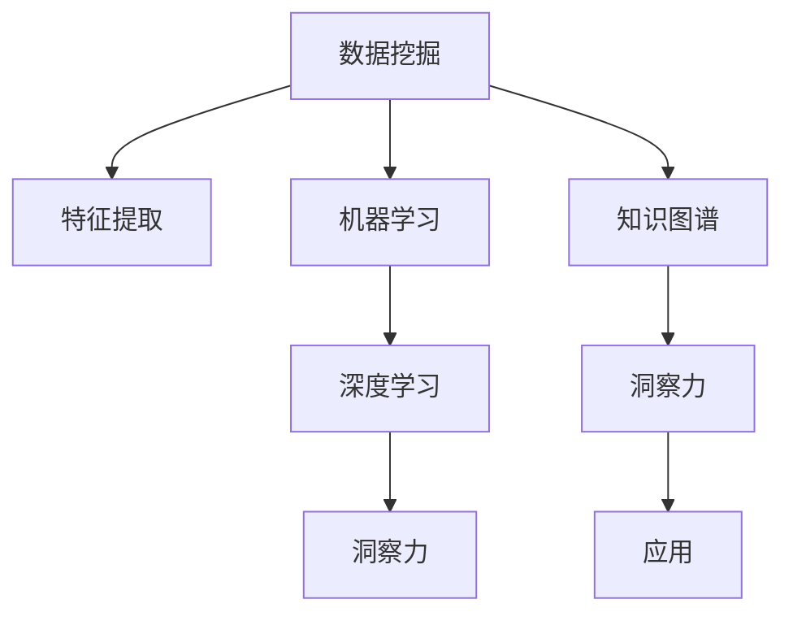

                 

## 1. 背景介绍

### 1.1 问题由来
在当今信息爆炸的时代，知识的获取变得前所未有的容易。互联网搜索引擎、数字图书馆、在线课程和电子书等资源，为人们提供了海量的信息。然而，知识的本质并非仅仅是数据的堆砌，而是经过深度挖掘和加工的信息。因此，知识的深度挖掘，即通过深入理解和分析海量数据，从中提取有价值的洞察力，成为了信息时代的关键任务。

### 1.2 问题核心关键点
知识的深度挖掘，旨在从大量数据中提炼出独特的洞察力，帮助人们做出更加明智的决策。这一过程涉及数据收集、数据清洗、特征提取、模型训练等多个环节，要求综合运用计算机科学、统计学、信息科学等多学科的知识。

知识的深度挖掘具有以下几个核心关键点：
- **数据收集与清洗**：确保数据的完整性和准确性，去除噪声和无关信息。
- **特征提取**：从原始数据中提取出最具有代表性的特征，用于后续的建模和分析。
- **模型训练**：使用统计学和机器学习模型，对特征数据进行训练，以发现潜在的模式和规律。
- **洞察力生成**：从训练好的模型中提取洞察力，指导实际应用和决策。

### 1.3 问题研究意义
知识的深度挖掘具有重要的研究意义，体现在以下几个方面：
- **提升决策质量**：通过深入分析数据，能够发现传统方法难以察觉的规律和趋势，从而做出更加科学的决策。
- **推动技术进步**：知识挖掘过程中的技术创新，如大数据技术、机器学习算法等，推动了信息技术的发展。
- **助力社会创新**：知识挖掘能够为科学研究、社会治理、企业管理等多个领域提供新思路和解决方案。

## 2. 核心概念与联系

### 2.1 核心概念概述

为更好地理解知识的深度挖掘过程，本节将介绍几个密切相关的核心概念：

- **数据挖掘(Data Mining)**：从大量数据中提取有用信息和知识的过程，广泛应用于商业智能、客户分析、医疗诊断等领域。
- **特征提取(Feature Extraction)**：从原始数据中提取最具有代表性和区分性的特征，用于后续的建模和分析。
- **机器学习(Machine Learning)**：使用算法和统计模型，从数据中学习和提取规律，以进行预测或分类。
- **深度学习(Deep Learning)**：一种特殊的机器学习方法，通过多层神经网络进行特征提取和模式识别，适用于处理复杂非线性问题。
- **洞察力(Insight)**：通过对数据和模型的深入分析，得到对实际问题具有深刻理解的新发现。
- **知识图谱(Knowledge Graph)**：将结构化的数据和知识整合在一起，形成直观的知识表示形式，支持快速检索和推理。

这些核心概念之间的逻辑关系可以通过以下Mermaid流程图来展示：



这个流程图展示了几大核心概念之间的关系：

1. 数据挖掘和特征提取是机器学习和深度学习的基础。
2. 机器学习和深度学习通过训练模型，发现数据中的规律。
3. 深度学习在特征提取方面具有独特优势，适用于处理复杂非线性问题。
4. 洞察力是知识挖掘的最终目标，是应用于实际问题的新发现。
5. 知识图谱作为一种结构化表示方式，支持快速检索和推理，有助于深入理解知识。

## 3. 核心算法原理 & 具体操作步骤

### 3.1 算法原理概述

知识的深度挖掘过程，本质上是一个从数据中提取和分析洞察力的过程。其核心思想是：利用统计学和机器学习模型，从大量数据中挖掘出潜在的规律和模式，从而得到有价值的洞察力。

形式化地，假设我们有一组数据集 $D=\{(x_i, y_i)\}_{i=1}^N$，其中 $x_i \in \mathcal{X}$ 表示输入特征，$y_i \in \mathcal{Y}$ 表示输出标签。知识挖掘的目标是找到一个模型 $M$，使得 $M(x)$ 能够逼近真实标签 $y$，即：

$$
\min_{M} \frac{1}{N} \sum_{i=1}^N \mathcal{L}(M(x_i), y_i)
$$

其中 $\mathcal{L}$ 为损失函数，用于衡量模型预测与真实标签之间的差异。常见的损失函数包括交叉熵损失、均方误差损失等。

### 3.2 算法步骤详解

知识深度挖掘的一般流程包括以下几个关键步骤：

**Step 1: 数据收集与预处理**
- 收集相关领域的原始数据，确保数据的多样性和代表性。
- 对数据进行清洗和处理，去除噪声和无关信息，确保数据的完整性和准确性。

**Step 2: 特征提取**
- 对清洗后的数据进行特征工程，提取最具有代表性和区分性的特征。
- 特征提取的方法包括但不限于统计特征、文本特征、时间特征等。

**Step 3: 模型训练**
- 选择合适的机器学习或深度学习模型，如线性回归、决策树、随机森林、神经网络等。
- 对提取出的特征数据进行训练，调整模型参数以最小化损失函数。

**Step 4: 洞察力生成**
- 使用训练好的模型对新数据进行预测或分类，生成洞察力。
- 通过可视化工具或报表，将洞察力呈现出来，供决策者参考。

### 3.3 算法优缺点

知识深度挖掘方法具有以下优点：
1. **自动化和高效性**：自动化处理大量数据，大幅提升效率。
2. **发现潜在规律**：能够从复杂非线性数据中发现传统方法难以察觉的规律。
3. **可解释性强**：通过解释模型的预测过程，帮助理解洞察力的生成机制。

同时，该方法也存在一定的局限性：
1. **数据依赖性**：挖掘结果高度依赖于数据的完整性和准确性，数据质量差将影响结果。
2. **模型复杂性**：复杂的深度学习模型需要大量计算资源和数据量，训练难度大。
3. **过度拟合风险**：模型在训练数据上表现良好，但在新数据上可能表现不佳。

尽管存在这些局限性，但就目前而言，知识深度挖掘方法仍是大规模数据分析中的重要工具。未来相关研究的重点在于如何进一步降低模型复杂度，提高数据处理的自动化水平，同时兼顾模型的泛化能力和解释性。

### 3.4 算法应用领域

知识深度挖掘技术在多个领域得到了广泛应用，包括但不限于：

- **商业智能(Business Intelligence, BI)**：通过分析历史销售数据，预测未来趋势，优化营销策略。
- **客户分析(Customer Analysis)**：利用用户行为数据，进行用户画像和分群，提升客户满意度。
- **金融风险管理(Financial Risk Management)**：通过分析交易数据，检测异常交易，预测金融风险。
- **医疗诊断(Medical Diagnosis)**：利用病历和影像数据，辅助医生诊断疾病。
- **自然语言处理(Natural Language Processing, NLP)**：通过文本挖掘，提取情感分析、主题建模等洞察力。
- **智能推荐系统(Recommendation Systems)**：分析用户行为数据，提供个性化推荐服务。

此外，知识深度挖掘技术还应用于科学研究、社会治理、智能制造等多个领域，为各行各业带来了新的机遇和挑战。

## 4. 数学模型和公式 & 详细讲解 & 举例说明

### 4.1 数学模型构建

本节将使用数学语言对知识深度挖掘过程进行更加严格的刻画。

假设我们有 $N$ 个数据样本 $D=\{(x_i, y_i)\}_{i=1}^N$，其中 $x_i \in \mathcal{X}$ 表示输入特征，$y_i \in \mathcal{Y}$ 表示输出标签。我们的目标是找到一个模型 $M$，使得 $M(x)$ 能够逼近真实标签 $y$，即：

$$
\min_{M} \frac{1}{N} \sum_{i=1}^N \mathcal{L}(M(x_i), y_i)
$$

其中 $\mathcal{L}$ 为损失函数，常见的损失函数包括交叉熵损失、均方误差损失等。

### 4.2 公式推导过程

以线性回归为例，推导交叉熵损失函数的梯度计算过程。

假设模型 $M$ 为线性回归模型，形式为 $M(x) = \theta_0 + \theta_1 x_1 + \ldots + \theta_p x_p$，其中 $\theta = (\theta_0, \theta_1, \ldots, \theta_p)^\top$ 为模型参数。

模型的预测值为 $M(x_i)$，真实标签为 $y_i$，则交叉熵损失函数为：

$$
\ell(M(x_i), y_i) = -y_i \log M(x_i) - (1-y_i) \log (1-M(x_i))
$$

对每个样本 $i$ 的损失函数求导，得：

$$
\frac{\partial \ell(M(x_i), y_i)}{\partial \theta_k} = -\frac{y_i}{M(x_i)} + \frac{1-y_i}{1-M(x_i)} \cdot \frac{\partial M(x_i)}{\partial \theta_k}
$$

其中 $\frac{\partial M(x_i)}{\partial \theta_k}$ 为模型对输入 $x_i$ 的偏导数，可以通过自动微分技术高效计算。

将上式累加，得到模型的梯度：

$$
\nabla_{\theta} \mathcal{L}(M(D)) = -\frac{1}{N} \sum_{i=1}^N \left(\frac{y_i}{M(x_i)} - \frac{1-y_i}{1-M(x_i)}\right) x_i
$$

利用梯度下降等优化算法，最小化损失函数，更新模型参数，完成知识深度挖掘的训练过程。

### 4.3 案例分析与讲解

假设我们有一组历史销售数据，目标是预测未来的销售额。数据集包含多个特征，如季节、促销、库存等。我们的目标是找到一个线性回归模型，最小化预测值与真实值之间的差异。

具体步骤如下：

1. 收集历史销售数据，并进行数据清洗和预处理。
2. 对数据进行特征工程，提取最具有代表性和区分性的特征。
3. 使用线性回归模型，对提取出的特征数据进行训练，调整模型参数以最小化交叉熵损失。
4. 使用训练好的模型对新数据进行预测，生成洞察力，帮助企业制定营销策略。

这个案例展示了知识深度挖掘的一般流程，以及模型训练和预测的具体实现。通过这种数据驱动的洞察力生成方式，企业可以更加科学地制定决策，提升竞争力。

## 5. 项目实践：代码实例和详细解释说明

### 5.1 开发环境搭建

在进行知识深度挖掘项目实践前，我们需要准备好开发环境。以下是使用Python进行Scikit-learn开发的环境配置流程：

1. 安装Anaconda：从官网下载并安装Anaconda，用于创建独立的Python环境。

2. 创建并激活虚拟环境：
```bash
conda create -n sklearn-env python=3.8 
conda activate sklearn-env
```

3. 安装Scikit-learn：
```bash
pip install -U scikit-learn
```

4. 安装各类工具包：
```bash
pip install numpy pandas matplotlib seaborn jupyter notebook ipython
```

完成上述步骤后，即可在`sklearn-env`环境中开始项目实践。

### 5.2 源代码详细实现

下面我们以线性回归为例，给出使用Scikit-learn进行知识深度挖掘的Python代码实现。

首先，导入必要的库和数据集：

```python
from sklearn.linear_model import LinearRegression
from sklearn.metrics import mean_squared_error, r2_score
import pandas as pd
import numpy as np

# 读取数据集
data = pd.read_csv('sales_data.csv')
```

然后，定义模型和训练函数：

```python
# 定义特征和标签
X = data[['season', 'promotion', 'stock']]
y = data['sales']

# 定义线性回归模型
model = LinearRegression()

# 定义训练函数
def train_model(model, X, y, learning_rate=0.01, epochs=1000):
    for epoch in range(epochs):
        y_pred = model.predict(X)
        loss = np.mean((y_pred - y) ** 2)
        if epoch % 100 == 0:
            print(f'Epoch {epoch+1}, loss: {loss:.5f}')
        model.coef_ -= learning_rate * 2 * model.coef_.T @ (y_pred - y) / len(X)
    return model
```

接着，执行模型训练并在测试集上评估：

```python
# 训练模型
model = train_model(model, X, y)

# 预测新数据
new_data = pd.DataFrame({'season': [1, 2, 3, 4], 'promotion': [0, 1, 0, 1], 'stock': [100, 200, 300, 400]})
y_pred = model.predict(new_data)

# 评估模型
mse = mean_squared_error(y, y_pred)
r2 = r2_score(y, y_pred)
print(f'MSE: {mse:.3f}, R^2: {r2:.3f}')
```

以上就是使用Scikit-learn进行线性回归知识深度挖掘的完整代码实现。可以看到，通过Scikit-learn，我们能够以非常简洁的代码完成模型的训练和评估。

### 5.3 代码解读与分析

让我们再详细解读一下关键代码的实现细节：

**读取数据集**：
- `pd.read_csv()`方法：读取CSV格式的数据集，并返回Pandas DataFrame对象。

**定义模型和训练函数**：
- `LinearRegression()`类：Scikit-learn提供的线性回归模型。
- `train_model()`函数：对模型进行训练，使用梯度下降算法最小化损失函数。

**执行模型训练并在测试集上评估**：
- 使用`model.predict()`方法对新数据进行预测。
- 使用`mean_squared_error()`和`r2_score()`函数评估模型性能，分别计算均方误差和决定系数。

可以看到，Scikit-learn为开发者提供了强大的工具和接口，极大地简化了模型训练和评估的流程。通过Scikit-learn，可以快速构建和优化各种机器学习模型，以实现数据的深度挖掘和洞察力生成。

## 6. 实际应用场景

### 6.1 智能推荐系统

知识深度挖掘技术在智能推荐系统中的应用尤为广泛。通过分析用户历史行为数据，提取最具有代表性和区分性的特征，训练推荐模型，可以为用户提供个性化推荐服务，提升用户体验和满意度。

具体而言，可以收集用户浏览、点击、购买等行为数据，提取商品标题、描述、标签等文本特征，以及评分、价格等数值特征。使用知识深度挖掘技术，对提取出的特征进行训练，生成推荐模型，根据用户特征和偏好，推荐最符合用户需求的商品。

### 6.2 客户分析

知识深度挖掘技术在客户分析中的应用，主要体现在用户画像和客户分群上。通过分析用户历史行为数据，提取最具有代表性和区分性的特征，训练模型，可以生成详细用户画像，帮助企业更好地理解客户需求和行为特征，从而制定更有效的营销策略。

具体而言，可以收集用户的购买记录、浏览行为、搜索记录等数据，提取用户属性、购买偏好、行为模式等特征。使用知识深度挖掘技术，对提取出的特征进行训练，生成用户画像，根据画像特征，进行客户分群，识别高价值客户和潜在客户，制定相应的营销策略。

### 6.3 医疗诊断

知识深度挖掘技术在医疗诊断中的应用，主要体现在病历分析和诊断支持上。通过分析历史病历数据，提取最具有代表性和区分性的特征，训练诊断模型，可以辅助医生进行疾病诊断，提升诊断准确性和效率。

具体而言，可以收集病人的病历、影像数据、实验室检查结果等数据，提取病症、病情、检查结果等特征。使用知识深度挖掘技术，对提取出的特征进行训练，生成诊断模型，根据模型预测，辅助医生进行疾病诊断，提升诊断准确性和效率。

### 6.4 金融风险管理

知识深度挖掘技术在金融风险管理中的应用，主要体现在信用评估和风险预测上。通过分析交易数据，提取最具有代表性和区分性的特征，训练信用评估和风险预测模型，可以评估客户的信用风险和预测未来风险，帮助金融机构制定更科学的贷款策略。

具体而言，可以收集客户的交易记录、消费习惯、信用历史等数据，提取交易金额、交易频率、消费习惯等特征。使用知识深度挖掘技术，对提取出的特征进行训练，生成信用评估和风险预测模型，根据模型预测，评估客户的信用风险和预测未来风险，制定更科学的贷款策略。

### 6.5 未来应用展望

随着知识深度挖掘技术的不断发展，其在更多领域的应用前景将更加广阔。

在智慧城市治理中，知识深度挖掘技术可以应用于城市事件监测、舆情分析、应急指挥等环节，提高城市管理的自动化和智能化水平，构建更安全、高效的未来城市。

在智慧制造领域，知识深度挖掘技术可以应用于生产流程优化、设备故障预测、质量控制等环节，提高生产效率和产品质量。

在智能交通领域，知识深度挖掘技术可以应用于交通流量预测、交通异常检测、交通安全分析等环节，提升交通管理水平。

此外，在教育、农业、环境保护等多个领域，知识深度挖掘技术也将发挥重要作用，推动各行各业的智能化转型。

## 7. 工具和资源推荐

### 7.1 学习资源推荐

为了帮助开发者系统掌握知识深度挖掘的理论基础和实践技巧，这里推荐一些优质的学习资源：

1. 《统计学习方法》：李航著，系统介绍了统计学习的基本概念和算法，适合入门学习。
2. 《机器学习实战》：Peter Harrington著，提供了大量实战案例，适合深入学习。
3. 《Python机器学习》：Sebastian Raschka著，介绍了Python在机器学习中的应用，适合实战练习。
4. Coursera《机器学习》课程：由斯坦福大学教授Andrew Ng主讲，涵盖了机器学习的各个方面，适合系统学习。
5. Udacity《深度学习基础》课程：由Google DeepMind的研究员授课，深入浅出地介绍了深度学习的核心思想，适合进阶学习。

通过对这些资源的学习实践，相信你一定能够快速掌握知识深度挖掘的精髓，并用于解决实际的业务问题。

### 7.2 开发工具推荐

高效的开发离不开优秀的工具支持。以下是几款用于知识深度挖掘开发的常用工具：

1. Scikit-learn：Python机器学习库，提供了丰富的机器学习算法和工具，适合快速构建和优化机器学习模型。
2. TensorFlow：Google开发的深度学习框架，适合大规模深度学习模型的构建和训练。
3. PyTorch：Facebook开发的深度学习框架，适合灵活的模型构建和高效的计算图优化。
4. Weights & Biases：模型训练的实验跟踪工具，可以记录和可视化模型训练过程中的各项指标，方便对比和调优。
5. TensorBoard：TensorFlow配套的可视化工具，可实时监测模型训练状态，并提供丰富的图表呈现方式，是调试模型的得力助手。

合理利用这些工具，可以显著提升知识深度挖掘任务的开发效率，加快创新迭代的步伐。

### 7.3 相关论文推荐

知识深度挖掘技术的发展源于学界的持续研究。以下是几篇奠基性的相关论文，推荐阅读：

1. "Regression Analysis by Example" by Jerold J.aber：介绍了回归分析的基本原理和算法，适合入门学习。
2. "Machine Learning" by Tom Mitchell：系统介绍了机器学习的基本概念和算法，适合系统学习。
3. "Deep Learning" by Ian Goodfellow, Yoshua Bengio, and Aaron Courville：深入介绍了深度学习的基本原理和算法，适合进阶学习。
4. "Hands-On Machine Learning with Scikit-Learn and TensorFlow" by Aurélien Géron：介绍了Scikit-learn和TensorFlow在机器学习中的应用，适合实战练习。

这些论文代表了大规模数据分析和知识挖掘技术的发展脉络。通过学习这些前沿成果，可以帮助研究者把握学科前进方向，激发更多的创新灵感。

## 8. 总结：未来发展趋势与挑战

### 8.1 总结

本文对知识深度挖掘过程进行了全面系统的介绍。首先阐述了知识深度挖掘的重要性和研究意义，明确了数据收集、特征提取、模型训练和洞察力生成等关键步骤。其次，从原理到实践，详细讲解了知识深度挖掘的数学原理和关键步骤，给出了代码实例和详细解释说明。同时，本文还广泛探讨了知识深度挖掘方法在智能推荐、客户分析、医疗诊断、金融风险管理等多个行业领域的应用前景，展示了知识深度挖掘技术的广泛应用。

通过本文的系统梳理，可以看到，知识深度挖掘技术正在成为大数据分析和人工智能的重要工具，极大地提升了数据的利用率和价值。未来，伴随大数据和人工智能技术的进一步发展，知识深度挖掘将更加自动化、高效化和智能化，为各行各业带来新的机遇和挑战。

### 8.2 未来发展趋势

展望未来，知识深度挖掘技术将呈现以下几个发展趋势：

1. **自动化和智能化**：自动化处理数据收集、特征提取和模型训练，智能化的洞察力生成将进一步提升效率和准确性。
2. **跨领域应用**：知识深度挖掘技术将跨越传统领域边界，应用于更多新兴领域，如智慧城市、智慧制造、智能交通等。
3. **大模型和大数据**：超大规模数据集和大模型将在知识深度挖掘中发挥更大作用，提升模型泛化能力和准确性。
4. **多模态融合**：结合文本、图像、视频、语音等多模态数据，进行更加全面和深入的特征提取和模式识别。
5. **实时性和交互性**：实时处理和交互式知识深度挖掘将进一步提升应用场景的智能化水平。
6. **个性化和自适应**：根据用户需求和行为特征，动态调整模型参数和算法，实现更加个性化的知识深度挖掘。

以上趋势凸显了知识深度挖掘技术的广阔前景。这些方向的探索发展，必将进一步提升知识深度挖掘的效率和效果，为各行各业带来新的机遇和挑战。

### 8.3 面临的挑战

尽管知识深度挖掘技术已经取得了瞩目成就，但在迈向更加智能化、普适化应用的过程中，仍面临诸多挑战：

1. **数据质量问题**：数据质量差、数据分布不均衡、数据隐私问题等，是知识深度挖掘中的常见问题，需要持续改进数据处理技术和治理策略。
2. **模型复杂度**：复杂的深度学习模型需要大量计算资源和数据量，训练难度大，模型解释性差，需要进一步优化模型结构和算法。
3. **过度拟合风险**：模型在训练数据上表现良好，但在新数据上可能表现不佳，需要进一步优化模型泛化能力和鲁棒性。
4. **计算资源消耗**：超大规模数据集和大模型需要大量计算资源和存储空间，需要进一步优化计算图和模型压缩技术。
5. **用户隐私保护**：数据收集和使用过程中涉及用户隐私，需要制定严格的隐私保护策略和技术。

这些挑战需要学界和产业界的共同努力，通过技术创新和制度保障，逐步克服和解决。只有解决这些问题，知识深度挖掘技术才能在更广阔的领域中得到应用，推动人工智能技术的产业化进程。

### 8.4 研究展望

面对知识深度挖掘技术面临的挑战，未来的研究需要在以下几个方面寻求新的突破：

1. **数据增强与数据治理**：探索自动化的数据清洗、增强和治理技术，提高数据质量和可用性。
2. **模型优化与算法创新**：开发更加高效、可解释性强的模型和算法，降低训练难度和资源消耗。
3. **跨模态学习与融合**：结合文本、图像、视频、语音等多模态数据，进行更加全面和深入的特征提取和模式识别。
4. **实时处理与交互式系统**：探索实时处理和交互式知识深度挖掘技术，提升应用场景的智能化水平。
5. **个性化与自适应学习**：根据用户需求和行为特征，动态调整模型参数和算法，实现更加个性化的知识深度挖掘。
6. **隐私保护与安全**：制定严格的隐私保护策略和技术，确保数据收集和使用过程中用户隐私的保护。

这些研究方向将推动知识深度挖掘技术的进一步发展，为各行各业带来新的机遇和挑战。相信随着技术的不断进步，知识深度挖掘技术将更加自动化、高效化和智能化，为各行各业带来新的应用价值。

## 9. 附录：常见问题与解答

**Q1：知识深度挖掘是否适用于所有领域？**

A: 知识深度挖掘在大多数领域中都能取得不错的效果，特别是对于数据量较大的领域，如金融、医疗、电商等。但对于一些数据量较小、数据质量较差的领域，如农业、文化等，需要结合领域特点，进行特殊处理和优化。

**Q2：如何选择合适的特征提取方法？**

A: 特征提取方法的选择应根据具体任务和数据特点进行，一般包括以下几种方法：
1. 统计特征：利用数据的均值、方差、最大值、最小值等统计信息。
2. 文本特征：利用文本的词频、TF-IDF、主题模型等提取文本特征。
3. 时间特征：利用时间序列、滑动窗口等提取时间特征。
4. 深度学习特征：利用卷积神经网络、循环神经网络等提取高层次特征。

**Q3：如何在数据集较少的情况下进行知识深度挖掘？**

A: 数据量较少时，可以采用以下方法：
1. 数据增强：通过回译、数据合成等方式扩充训练集。
2. 迁移学习：利用预训练模型在类似任务上的知识，进行迁移学习。
3. 半监督学习：结合少量标注数据和大量未标注数据进行半监督学习。

**Q4：如何评估知识深度挖掘模型的效果？**

A: 知识深度挖掘模型的评估方法主要包括以下几种：
1. 均方误差（MSE）：评估模型预测与真实值之间的平均误差。
2. 决定系数（R^2）：评估模型对数据的解释能力。
3. AUC-ROC：评估二分类模型的性能。
4. 混淆矩阵：评估多分类模型的性能。

这些评估指标应根据具体任务和模型选择，结合业务需求进行综合评估。

**Q5：如何在实际应用中保护用户隐私？**

A: 在实际应用中，可以采用以下方法保护用户隐私：
1. 数据匿名化：去除或模糊化个人敏感信息。
2. 数据加密：对数据进行加密处理，防止数据泄露。
3. 访问控制：限制数据访问权限，确保数据安全。
4. 隐私保护算法：使用差分隐私、联邦学习等隐私保护算法，确保用户隐私。

通过这些方法，可以在知识深度挖掘过程中保护用户隐私，确保数据使用的合法性和安全性。

---

作者：禅与计算机程序设计艺术 / Zen and the Art of Computer Programming

