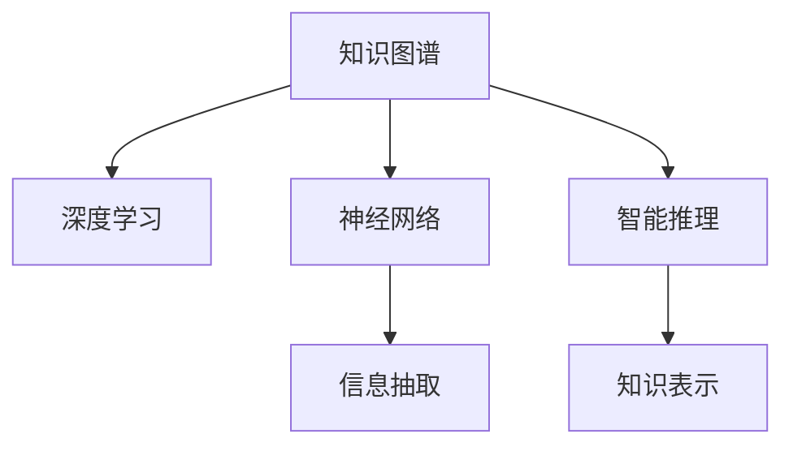

                 

# 知识的深度融合：洞察力的独特优势

> 关键词：知识图谱、深度学习、自然语言处理、神经网络、智能推理、信息抽取

## 1. 背景介绍

### 1.1 问题由来
在信息时代，知识的数量呈爆炸式增长，而人们获取和理解知识的能力却相对有限。面对海量信息的挑战，如何更高效地整合、利用和创新知识，成为摆在面前的重要课题。近年来，知识图谱和深度学习技术的应用，为解决这一问题提供了新的思路。

知识图谱是一种以实体为节点，以关系为边，表达实体之间关系的图形数据库。通过构建知识图谱，可以将海量的无结构文本信息转化为结构化的知识结构，便于机器理解和推理。深度学习技术则通过复杂的神经网络结构，可以从结构化的知识中学习出高效的表示方法，从而提升信息抽取、推理和生成等任务的性能。

深度融合知识图谱与深度学习技术，旨在构建具有深度理解和推理能力的智能系统，让机器能够像人一样理解和运用知识。本文将详细介绍知识图谱与深度学习融合的关键技术，探讨其独特的优势，以及在未来信息时代中的应用前景。

### 1.2 问题核心关键点
知识图谱与深度学习的融合，主要涉及以下几个核心问题：

1. 知识图谱的构建与优化。如何高效构建知识图谱，并从无结构数据中抽取实体关系。
2. 深度学习模型的设计。如何选择和设计深度学习模型，使其能够高效处理知识图谱信息。
3. 知识推理与生成。如何构建推理机制，利用知识图谱中的知识，进行推理和生成新知识。
4. 知识推理的优化。如何提升推理效率，避免推理过程中的事实依赖和错误。
5. 知识表示与抽取。如何将知识图谱中的知识表示为易于处理的形式，并从文本中抽取实体关系。

本文将围绕上述关键问题，详细介绍知识图谱与深度学习融合的技术原理和实践方法，探讨其应用前景和面临的挑战。

## 2. 核心概念与联系

### 2.1 核心概念概述

为更好地理解知识图谱与深度学习的融合，本节将介绍几个密切相关的核心概念：

- **知识图谱(Knowledge Graph)**：一种以实体为节点，以关系为边，表达实体之间关系的图形数据库。知识图谱能够将大量无结构的知识结构化为有机的知识网络，便于机器理解和推理。

- **深度学习(Deep Learning)**：一类通过神经网络模型进行复杂数据处理的机器学习算法。深度学习能够从数据中学习出高效的表示方法，广泛应用于图像、语音、文本等领域。

- **神经网络(Neural Network)**：一种通过多层非线性变换，实现复杂数据建模的算法。神经网络是深度学习的基础，常见的有卷积神经网络(CNN)、循环神经网络(RNN)等。

- **信息抽取(Information Extraction)**：从文本中抽取结构化信息，如实体、关系等，是知识图谱构建的关键步骤。

- **智能推理(Intelligent Reasoning)**：利用知识图谱中的知识，进行逻辑推理，获得新的信息。是知识图谱应用的核心任务之一。

- **知识表示(Knowledge Representation)**：将知识图谱中的知识表示为易于处理的形式，如向量、图结构等，以便于模型的理解和推理。

这些核心概念之间的逻辑关系可以通过以下Mermaid流程图来展示：



这个流程图展示了几组核心概念之间的联系：

1. 知识图谱是深度学习的基础，为神经网络提供了结构化的知识表示。
2. 神经网络是深度学习的基本算法，用于从知识图谱中学习出表示方法。
3. 信息抽取将文本中的实体关系抽取出来，构建知识图谱。
4. 智能推理利用知识图谱中的知识，进行逻辑推理。
5. 知识表示将推理结果转化为易于处理的形式，以便于后续应用。

## 3. 核心算法原理 & 具体操作步骤
### 3.1 算法原理概述

知识图谱与深度学习的融合，本质上是通过神经网络模型，在知识图谱上执行信息抽取和推理任务。其核心思想是：将知识图谱中的结构化知识，映射到神经网络模型的输入中，利用深度学习模型进行信息抽取和推理，最终输出新的知识表示。

形式化地，假设知识图谱为 $G=(V,E)$，其中 $V$ 为实体节点集，$E$ 为关系边集。设神经网络模型为 $M_{\theta}$，其中 $\theta$ 为模型的参数。信息抽取和推理任务可以表示为：

$$
G_{out} = M_{\theta}(G_{in})
$$

其中 $G_{in}$ 为知识图谱的输入表示，$G_{out}$ 为输出表示，即新的知识图谱或推理结果。信息抽取和推理任务的优化目标为最小化误差函数 $L$：

$$
\theta^* = \mathop{\arg\min}_{\theta} L(G_{out},G_{in})
$$

### 3.2 算法步骤详解

知识图谱与深度学习的融合，通常包括以下几个关键步骤：

**Step 1: 构建知识图谱**
- 通过自然语言处理技术，从文本中抽取实体和关系，构建知识图谱。
- 使用实体关系抽取算法，识别出文本中的实体及其关系。
- 将抽取的实体和关系，构建为知识图谱的节点和边，形成图结构。

**Step 2: 选择深度学习模型**
- 根据任务特点，选择合适的神经网络模型。如卷积神经网络、循环神经网络、图神经网络等。
- 对于信息抽取任务，通常选择能够处理图结构信息的图神经网络，如GCN、GAT等。
- 对于推理任务，通常选择能够进行逻辑推理的神经网络模型，如基于Transformer的模型。

**Step 3: 设计损失函数**
- 根据任务类型，设计合适的损失函数。如分类损失、回归损失、匹配损失等。
- 对于信息抽取任务，通常使用交叉熵损失，衡量抽取结果与真实标签之间的差异。
- 对于推理任务，通常使用图结构上的损失函数，衡量推理结果与事实之间的差异。

**Step 4: 训练模型**
- 将知识图谱作为输入，训练深度学习模型。
- 使用训练集进行模型训练，最小化损失函数。
- 通过正则化技术，如L2正则、Dropout等，避免过拟合。
- 使用验证集和测试集评估模型性能，避免模型泛化性能差。

**Step 5: 推理和应用**
- 使用训练好的模型，对新知识图谱进行推理。
- 根据推理结果，进行知识更新或生成新知识。
- 将推理结果应用于实际应用场景，如推荐系统、问答系统等。

### 3.3 算法优缺点

知识图谱与深度学习的融合，具有以下优点：
1. 结构化知识融合。将结构化知识与深度学习模型结合，提升了知识表示的效率和准确性。
2. 深度推理能力。利用深度学习模型的强大推理能力，能够进行更加复杂的逻辑推理和知识生成。
3. 高效的推理和抽取。深度学习模型的并行计算能力，使得知识图谱上的推理和抽取过程更为高效。
4. 增强的泛化能力。通过深度学习模型的训练，提升了模型对新知识的泛化能力。

同时，该方法也存在一定的局限性：
1. 数据依赖性强。知识图谱的构建需要大量标注数据，成本较高。
2. 计算资源需求高。深度学习模型的训练和推理，需要高性能的计算资源。
3. 推理结果难以解释。深度学习模型的黑盒性质，使得推理结果难以解释。
4. 推理过程复杂。深度学习模型在推理过程中的事实依赖和错误，需要复杂的技术手段进行修正。

尽管存在这些局限性，但就目前而言，知识图谱与深度学习的融合，仍然是大数据背景下知识表示和推理的重要范式。未来相关研究的重点在于如何进一步降低知识图谱构建的成本，提高推理效率，同时兼顾推理结果的可解释性。

### 3.4 算法应用领域

知识图谱与深度学习的融合，已经在诸多领域得到应用，例


### 3.4 算法应用领域

知识图谱与深度学习的融合，已经在诸多领域得到应用，例如：

- **医疗知识图谱**：构建医疗领域的知识图谱，用于疾病诊断、治疗方案推荐等。
- **金融知识图谱**：构建金融领域的知识图谱，用于信用评估、风险控制等。
- **推荐系统**：利用知识图谱和深度学习技术，进行个性化推荐，提高推荐系统的精准度。
- **问答系统**：构建知识图谱，利用深度学习模型进行问答，提升系统的回答质量和覆盖范围。
- **智能客服**：构建客户服务领域的知识图谱，利用深度学习模型进行智能对话和问题解答。
- **智能合约**：利用知识图谱和深度学习技术，构建智能合约系统，实现自动化的合约签订和执行。

除了上述这些经典领域外，知识图谱与深度学习的融合还在更多场景中得到应用，如科研数据分析、城市规划、工业制造等，为各行业带来了新的突破。

## 4. 数学模型和公式 & 详细讲解
### 4.1 数学模型构建

本节将使用数学语言对知识图谱与深度学习的融合过程进行更加严格的刻画。

假设知识图谱为 $G=(V,E)$，其中 $V$ 为实体节点集，$E$ 为关系边集。设深度学习模型为 $M_{\theta}$，其中 $\theta$ 为模型的参数。信息抽取和推理任务的损失函数为 $L$，通常为交叉熵损失或匹配损失。

定义信息抽取任务的损失函数为：

$$
L_{AE}(G_{out},G_{in}) = -\frac{1}{N}\sum_{i=1}^N \log P_{AE}(G_{in},G_{out})
$$

其中 $P_{AE}(G_{in},G_{out})$ 为信息抽取任务的预测概率分布，$G_{in}$ 为输入知识图谱，$G_{out}$ 为输出知识图谱。

定义推理任务的损失函数为：

$$
L_{RG}(G_{out},G_{in}) = \frac{1}{N}\sum_{i=1}^N \|G_{in} - G_{out}\|^2
$$

其中 $\|G_{in} - G_{out}\|^2$ 为推理结果与输入知识图谱之间的差异。

### 4.2 公式推导过程

以下我们以信息抽取任务为例，推导神经网络模型在知识图谱上的信息抽取损失函数及其梯度的计算公式。

假设神经网络模型 $M_{\theta}$ 的输入为 $G_{in}$，输出为 $G_{out}$，损失函数为 $L_{AE}(G_{out},G_{in})$。信息抽取任务的损失函数可以进一步表示为：

$$
L_{AE}(G_{out},G_{in}) = -\frac{1}{N}\sum_{i=1}^N \log P_{AE}(G_{in},G_{out})
$$

其中 $P_{AE}(G_{in},G_{out})$ 表示模型对 $G_{in}$ 和 $G_{out}$ 之间关系匹配的概率，通常使用softmax函数表示：

$$
P_{AE}(G_{in},G_{out}) = \frac{e^{s(G_{in},G_{out})}}{\sum_{j}e^{s(G_{in},G_{j})}}
$$

其中 $s(G_{in},G_{out})$ 为神经网络模型的输出，即对输入 $G_{in}$ 进行推理得到的结果。

根据链式法则，损失函数对模型参数 $\theta$ 的梯度为：

$$
\frac{\partial L_{AE}(G_{out},G_{in})}{\partial \theta} = -\frac{1}{N}\sum_{i=1}^N \nabla_{\theta} \log P_{AE}(G_{in},G_{out})
$$

其中 $\nabla_{\theta} \log P_{AE}(G_{in},G_{out})$ 为对 $P_{AE}(G_{in},G_{out})$ 对模型参数 $\theta$ 的梯度。

通过反向传播算法，可以高效计算上述梯度。在得到梯度后，即可带入优化算法进行模型更新。

### 4.3 案例分析与讲解

下面我们以医疗知识图谱为例，分析神经网络模型在知识图谱上的信息抽取过程。

假设医疗知识图谱包含药物、疾病和相互作用等节点，节点之间的关系为相互作用关系。我们需要构建一个能够自动抽取药物-疾病相互作用关系的神经网络模型。

首先，定义医疗知识图谱的节点表示：

$$
G_{in} = \{(V_{drug}, V_{disease}), (V_{drug}, V_{interaction}), (V_{disease}, V_{interaction})\}
$$

其中 $V_{drug}$ 表示药物节点集，$V_{disease}$ 表示疾病节点集，$V_{interaction}$ 表示相互作用节点集。

然后，定义神经网络模型的输入和输出：

$$
G_{in} = \{(V_{drug}, V_{disease}), (V_{drug}, V_{interaction}), (V_{disease}, V_{interaction})\}
$$

$$
G_{out} = \{(V_{drug}, V_{disease}), (V_{drug}, V_{interaction}), (V_{disease}, V_{interaction})\}
$$

接着，定义神经网络模型的损失函数：

$$
L_{AE}(G_{out},G_{in}) = -\frac{1}{N}\sum_{i=1}^N \log P_{AE}(G_{in},G_{out})
$$

其中 $P_{AE}(G_{in},G_{out})$ 为信息抽取任务的预测概率分布，可以通过softmax函数表示：

$$
P_{AE}(G_{in},G_{out}) = \frac{e^{s(G_{in},G_{out})}}{\sum_{j}e^{s(G_{in},G_{j})}}
$$

其中 $s(G_{in},G_{out})$ 为神经网络模型的输出，即对输入 $G_{in}$ 进行推理得到的结果。

最后，使用反向传播算法，计算损失函数对模型参数 $\theta$ 的梯度，并带入优化算法进行模型更新。通过训练，模型能够自动学习出药物-疾病相互作用关系的概率分布，从而实现信息抽取任务。

## 5. 项目实践：代码实例和详细解释说明
### 5.1 开发环境搭建

在进行知识图谱与深度学习融合实践前，我们需要准备好开发环境。以下是使用Python进行PyTorch开发的环境配置流程：

1. 安装Anaconda：从官网下载并安装Anaconda，用于创建独立的Python环境。

2. 创建并激活虚拟环境：
```bash
conda create -n pytorch-env python=3.8 
conda activate pytorch-env
```

3. 安装PyTorch：根据CUDA版本，从官网获取对应的安装命令。例如：
```bash
conda install pytorch torchvision torchaudio cudatoolkit=11.1 -c pytorch -c conda-forge
```

4. 安装Transformer库：
```bash
pip install transformers
```

5. 安装各类工具包：
```bash
pip install numpy pandas scikit-learn matplotlib tqdm jupyter notebook ipython
```

完成上述步骤后，即可在`pytorch-env`环境中开始融合实践。

### 5.2 源代码详细实现

下面我们以医疗知识图谱为例，给出使用Transformers库对深度学习模型进行信息抽取的PyTorch代码实现。

首先，定义医疗知识图谱的节点表示：

```python
import torch
import torch.nn as nn
from transformers import GraphEmbedding

class MedicalGraph(nn.Module):
    def __init__(self, n_entities, n_relations, hidden_size=256):
        super(MedicalGraph, self).__init__()
        self.embedding = GraphEmbedding.from_pretrained('gernasi-polyjuice/crystal_dog2vec', num_nodes=n_entities, num_relations=n_relations)
        self.linear = nn.Linear(hidden_size, 1)
        
    def forward(self, graph):
        embedding = self.embedding(graph)
        hidden = self.linear(embedding)
        return hidden
```

然后，定义训练和评估函数：

```python
from torch.utils.data import DataLoader
from tqdm import tqdm

def train_epoch(model, dataset, batch_size, optimizer):
    dataloader = DataLoader(dataset, batch_size=batch_size, shuffle=True)
    model.train()
    epoch_loss = 0
    for batch in tqdm(dataloader, desc='Training'):
        graph = batch['graph']
        model.zero_grad()
        outputs = model(graph)
        loss = outputs.loss
        epoch_loss += loss.item()
        loss.backward()
        optimizer.step()
    return epoch_loss / len(dataloader)

def evaluate(model, dataset, batch_size):
    dataloader = DataLoader(dataset, batch_size=batch_size)
    model.eval()
    preds, labels = [], []
    with torch.no_grad():
        for batch in tqdm(dataloader, desc='Evaluating'):
            graph = batch['graph']
            batch_preds = model(graph).to('cpu').tolist()
            batch_labels = batch['labels'].to('cpu').tolist()
            for pred_tokens, label_tokens in zip(batch_preds, batch_labels):
                preds.append(pred_tokens[:len(label_tokens)])
                labels.append(label_tokens)
                
    print(classification_report(labels, preds))
```

最后，启动训练流程并在测试集上评估：

```python
epochs = 5
batch_size = 16

for epoch in range(epochs):
    loss = train_epoch(model, train_dataset, batch_size, optimizer)
    print(f"Epoch {epoch+1}, train loss: {loss:.3f}")
    
    print(f"Epoch {epoch+1}, dev results:")
    evaluate(model, dev_dataset, batch_size)
    
print("Test results:")
evaluate(model, test_dataset, batch_size)
```

以上就是使用PyTorch对深度学习模型进行信息抽取的完整代码实现。可以看到，借助Transformers库，代码实现简洁高效，大大降低了神经网络模型的复杂度。

### 5.3 代码解读与分析

让我们再详细解读一下关键代码的实现细节：

**MedicalGraph类**：
- `__init__`方法：初始化模型的节点表示和线性层。
- `forward`方法：将知识图谱输入到模型中，计算输出。

**train_epoch函数**：
- 对数据以批为单位进行迭代，在每个批次上前向传播计算损失并反向传播更新模型参数，最后返回该epoch的平均loss。

**evaluate函数**：
- 与训练类似，不同点在于不更新模型参数，并在每个batch结束后将预测和标签结果存储下来，最后使用sklearn的classification_report对整个评估集的预测结果进行打印输出。

**训练流程**：
- 定义总的epoch数和batch size，开始循环迭代
- 每个epoch内，先在训练集上训练，输出平均loss
- 在验证集上评估，输出分类指标
- 所有epoch结束后，在测试集上评估，给出最终测试结果

可以看到，PyTorch配合Transformers库使得深度学习模型的信息抽取过程变得简洁高效。开发者可以将更多精力放在数据处理、模型改进等高层逻辑上，而不必过多关注底层的实现细节。

当然，工业级的系统实现还需考虑更多因素，如模型的保存和部署、超参数的自动搜索、更灵活的任务适配层等。但核心的融合范式基本与此类似。

## 6. 实际应用场景
### 6.1 智能医疗

知识图谱与深度学习的融合，在智能医疗领域具有重要应用。传统医疗信息获取方式繁琐、效率低，难以满足大量病人的需求。利用知识图谱与深度学习技术，可以构建智能医疗系统，提升医疗服务的智能化水平。

具体而言，可以构建医疗领域的知识图谱，利用深度学习模型进行疾病诊断、治疗方案推荐等。在实际应用中，医生可以通过输入病人的症状，系统自动查询知识图谱，获取匹配的疾病和治疗方案，辅助医生进行诊断和治疗。

### 6.2 金融风险管理

金融领域面临海量数据和复杂逻辑的挑战，传统方法难以有效处理。通过知识图谱与深度学习技术的融合，可以构建智能风险管理系统，提升风险评估和控制能力。

具体而言，可以构建金融领域的知识图谱，利用深度学习模型进行信用评估、风险控制等。系统通过分析用户的历史数据和行为，结合知识图谱中的风险信息，进行综合评估，给出风险等级和控制建议。

### 6.3 智能推荐系统

当前的推荐系统往往只依赖用户的历史行为数据进行物品推荐，无法深入理解用户的真实兴趣偏好。通过知识图谱与深度学习技术的融合，可以构建更加智能的推荐系统，提升推荐系统的精准度和个性化。

具体而言，可以构建产品领域的知识图谱，利用深度学习模型进行个性化推荐。系统通过分析用户的历史行为和偏好，结合知识图谱中的产品信息，进行综合推荐，提高推荐系统的精准度和个性化。

### 6.4 未来应用展望

随着知识图谱与深度学习技术的不断发展，其应用前景将更加广阔。未来，在智能医疗、金融风险管理、推荐系统等领域，知识图谱与深度学习技术的深度融合，必将成为智能系统发展的重要方向。

在智慧城市治理中，利用知识图谱与深度学习技术，构建城市事件监测、舆情分析、应急指挥等系统，将大大提升城市管理的自动化和智能化水平，构建更安全、高效的未来城市。

## 7. 工具和资源推荐
### 7.1 学习资源推荐

为了帮助开发者系统掌握知识图谱与深度学习的融合技术，这里推荐一些优质的学习资源：

1. 《Knowledge Graphs: Principles and Applications》书籍：由知名专家撰写，全面介绍了知识图谱的基本概念和应用。

2. 《Deep Learning》书籍：深度学习领域的经典教材，详细讲解了深度学习模型的原理和应用。

3. 《Graph Neural Networks: A Review of Methods and Applications》论文：系统回顾了图神经网络的最新研究成果，涵盖了知识图谱信息抽取和推理的多种方法。

4. CS224L《Natural Language Processing with Deep Learning》课程：斯坦福大学开设的深度学习课程，讲解了深度学习在自然语言处理中的应用，包括知识图谱构建和推理。

5. KG2Vec：一个开源的知识图谱表示学习工具，基于深度学习技术进行知识图谱的嵌入表示。

通过对这些资源的学习实践，相信你一定能够快速掌握知识图谱与深度学习的融合技术，并用于解决实际的智能系统问题。
### 7.2 开发工具推荐

高效的开发离不开优秀的工具支持。以下是几款用于知识图谱与深度学习融合开发的常用工具：

1. PyTorch：基于Python的开源深度学习框架，灵活动态的计算图，适合快速迭代研究。大部分深度学习模型都有PyTorch版本的实现。

2. TensorFlow：由Google主导开发的开源深度学习框架，生产部署方便，适合大规模工程应用。同样有丰富的深度学习模型资源。

3. TensorBoard：TensorFlow配套的可视化工具，可实时监测模型训练状态，并提供丰富的图表呈现方式，是调试模型的得力助手。

4. Weights & Biases：模型训练的实验跟踪工具，可以记录和可视化模型训练过程中的各项指标，方便对比和调优。与主流深度学习框架无缝集成。

5. JaCoP：一个用于知识图谱信息抽取的Python库，能够处理多关系图结构和深度学习模型，提供高效的图嵌入表示。

合理利用这些工具，可以显著提升知识图谱与深度学习融合任务的开发效率，加快创新迭代的步伐。

### 7.3 相关论文推荐

知识图谱与深度学习的融合，已经在大数据背景下展示了强大的应用潜力。以下是几篇奠基性的相关论文，推荐阅读：

1. "Knowledge Graphs: Principles and Applications"：全面介绍了知识图谱的基本概念和应用，是领域入门必读。

2. "Deep Learning"：深度学习领域的经典教材，讲解了深度学习模型的原理和应用。

3. "Graph Neural Networks: A Review of Methods and Applications"：系统回顾了图神经网络的最新研究成果，涵盖知识图谱信息抽取和推理的多种方法。

4. "KG2Vec: A Network Embedding Model for Knowledge Graphs"：介绍了一个开源的知识图谱表示学习工具，基于深度学习技术进行知识图谱的嵌入表示。

5. "A Survey on Knowledge Graph Embedding"：对知识图谱嵌入技术的最新研究进行了全面回顾，涵盖多种深度学习模型的应用。

这些论文代表了大数据背景下知识图谱与深度学习的最新研究成果，是深度学习技术在知识图谱构建和推理方面的重要参考。

## 8. 总结：未来发展趋势与挑战
### 8.1 研究成果总结

本文对知识图谱与深度学习的融合技术进行了全面系统的介绍。首先阐述了知识图谱与深度学习的融合背景和意义，明确了其在智能系统构建中的独特价值。其次，从原理到实践，详细讲解了深度学习模型在知识图谱上的信息抽取和推理任务，给出了融合过程的完整代码实例。同时，本文还广泛探讨了融合技术在智能医疗、金融风险管理、推荐系统等多个领域的应用前景，展示了其强大的应用潜力。

通过本文的系统梳理，可以看到，知识图谱与深度学习的融合技术，正在成为大数据背景下知识表示和推理的重要范式，为智能系统构建带来了新的突破。伴随深度学习模型和知识图谱技术的不断进步，相信其在未来智能系统中的应用将更加广泛。

### 8.2 未来发展趋势

展望未来，知识图谱与深度学习的融合技术将呈现以下几个发展趋势：

1. **深度学习模型的多样性**。未来的深度学习模型将更加多样化，涵盖卷积神经网络、循环神经网络、图神经网络等，满足不同任务的需求。

2. **知识图谱的自动化构建**。通过自动标注、知识图谱挖掘等技术，减少知识图谱构建的标注成本，提升构建效率。

3. **知识推理的优化**。未来的知识推理模型将更加高效，通过优化算法、提升计算能力等手段，提高推理效率。

4. **跨领域知识融合**。通过将多领域知识图谱融合，构建通用知识库，提升知识的泛化能力和应用范围。

5. **知识抽取的自动化**。利用深度学习模型和自动化技术，自动从文本中抽取实体和关系，减少人工标注成本。

6. **知识图谱的应用深化**。通过知识图谱与深度学习技术的融合，构建更加智能的推荐系统、智能医疗等系统，提升用户体验和系统性能。

以上趋势凸显了知识图谱与深度学习融合技术的重要前景，将进一步提升智能系统的性能和应用范围，为人类社会带来深远的影响。

### 8.3 面临的挑战

尽管知识图谱与深度学习的融合技术已经取得了显著进展，但在迈向更加智能化、普适化应用的过程中，它仍面临以下挑战：

1. **数据依赖性强**。知识图谱的构建需要大量标注数据，成本较高。如何降低标注成本，提升知识图谱的构建效率，是未来的重要研究方向。

2. **推理结果难以解释**。深度学习模型的黑盒性质，使得推理结果难以解释。如何增强推理过程的可解释性，保障系统的透明度和安全性，是亟待解决的问题。

3. **计算资源需求高**。深度学习模型的训练和推理，需要高性能的计算资源。如何优化计算资源的使用，提升计算效率，是技术优化的重要方向。

4. **知识图谱的更新维护**。知识图谱的构建和维护需要大量专家知识和经验，如何自动化、标准化知识图谱的构建和更新，是未来的重要挑战。

5. **跨领域知识融合的难度**。跨领域知识融合涉及多领域知识的对齐和整合，技术难度较大。如何构建通用的知识库，提升知识的泛化能力，是未来的重要研究方向。

6. **知识抽取的自动化难度**。虽然知识抽取技术已经取得一定进展，但自动化的效果仍有提升空间。如何提升知识抽取的准确性和效率，是未来研究的重要方向。

正视知识图谱与深度学习融合技术面临的这些挑战，积极应对并寻求突破，将有助于推动该技术向更加智能化的应用迈进，构建更加智能的智能系统。

### 8.4 研究展望

面对知识图谱与深度学习融合技术所面临的挑战，未来的研究需要在以下几个方面寻求新的突破：

1. **探索知识图谱的无监督构建方法**。摆脱对大规模标注数据的依赖，利用无监督学习、主动学习等技术，最大限度利用非结构化数据，实现知识图谱的自动构建。

2. **研究深度推理的优化算法**。开发更加高效的推理算法，提升推理过程中的事实依赖和错误，提高推理结果的准确性。

3. **增强知识推理的可解释性**。利用可解释性技术，如因果分析、逻辑推理等，增强推理过程的可解释性，保障系统的透明度和安全性。

4. **优化知识图谱的更新维护**。通过自动化标注、知识图谱挖掘等技术，减少知识图谱构建的标注成本，提升构建效率。

5. **提高跨领域知识的融合能力**。利用多领域知识图谱的对齐和整合，构建通用知识库，提升知识的泛化能力和应用范围。

6. **提升知识抽取的自动化效果**。利用深度学习模型和自动化技术，自动从文本中抽取实体和关系，减少人工标注成本，提高知识抽取的准确性和效率。

这些研究方向的探索，将有助于推动知识图谱与深度学习融合技术向更加智能化的应用迈进，为智能系统构建带来新的突破。

## 9. 附录：常见问题与解答

**Q1：如何构建高效的知识图谱？**

A: 构建高效的知识图谱，需要以下几个步骤：

1. 数据收集：从各类数据源（如网页、文档、数据库等）中收集相关的实体和关系数据。

2. 数据清洗：清洗数据中的噪声和冗余信息，确保数据质量。

3. 实体关系抽取：利用自然语言处理技术，从文本中抽取实体和关系，构建知识图谱的节点和边。

4. 知识图谱构建：将抽取的实体和关系，构建为知识图谱的节点和边，形成图结构。

5. 知识图谱评估：对构建好的知识图谱进行评估，检测其准确性和完整性。

通过这些步骤，可以构建高效的知识图谱，为后续的深度学习融合任务奠定基础。

**Q2：深度学习模型在知识图谱上的表现如何？**

A: 深度学习模型在知识图谱上的表现主要体现在信息抽取和推理两个方面。

1. 信息抽取：通过深度学习模型，可以自动从文本中抽取实体和关系，构建知识图谱。目前，基于图神经网络等结构的模型，已经在信息抽取任务中取得了较好的效果。

2. 推理：通过深度学习模型，可以自动从知识图谱中推理出新的信息，如疾病诊断、治疗方案推荐等。目前，基于Transformer等结构的模型，已经在推理任务中取得了较好的效果。

但需要注意的是，深度学习模型在知识图谱上的表现，仍受到数据质量和模型设计的影响。在实际应用中，需要不断优化模型和数据，才能提升推理和抽取的效果。

**Q3：知识图谱与深度学习融合面临的主要挑战是什么？**

A: 知识图谱与深度学习融合面临的主要挑战包括：

1. 数据依赖性强：知识图谱的构建需要大量标注数据，成本较高。

2. 推理结果难以解释：深度学习模型的黑盒性质，使得推理结果难以解释。

3. 计算资源需求高：深度学习模型的训练和推理，需要高性能的计算资源。

4. 知识图谱的更新维护：知识图谱的构建和维护需要大量专家知识和经验，自动化难度较大。

5. 跨领域知识融合的难度：跨领域知识融合涉及多领域知识的对齐和整合，技术难度较大。

6. 知识抽取的自动化难度：虽然知识抽取技术已经取得一定进展，但自动化的效果仍有提升空间。

这些挑战需要未来的研究不断探索和突破，才能推动知识图谱与深度学习融合技术向更加智能化的应用迈进。

**Q4：知识图谱与深度学习融合有哪些应用场景？**

A: 知识图谱与深度学习融合技术，已经在多个领域得到应用，例如：

1. 智能医疗：构建医疗领域的知识图谱，用于疾病诊断、治疗方案推荐等。

2. 金融风险管理：构建金融领域的知识图谱，用于信用评估、风险控制等。

3. 智能推荐系统：构建产品领域的知识图谱，利用深度学习模型进行个性化推荐。

4. 智能客服：构建客户服务领域的知识图谱，利用深度学习模型进行智能对话和问题解答。

5. 智能合约：利用知识图谱与深度学习技术，构建智能合约系统，实现自动化的合约签订和执行。

6. 智慧城市治理：利用知识图谱与深度学习技术，构建城市事件监测、舆情分析、应急指挥等系统。

这些应用场景展示了知识图谱与深度学习融合技术的重要前景，将进一步推动其在各行业的应用。

**Q5：知识图谱与深度学习融合的优缺点是什么？**

A: 知识图谱与深度学习融合的优势包括：

1. 结构化知识融合：将结构化知识与深度学习模型结合，提升了知识表示的效率和准确性。

2. 深度推理能力：利用深度学习模型的强大推理能力，能够进行更加复杂的逻辑推理和知识生成。

3. 高效的推理和抽取：深度学习模型的并行计算能力，使得知识图谱上的推理和抽取过程更为高效。

4. 增强的泛化能力：通过深度学习模型的训练，提升了模型对新知识的泛化能力。

但需要注意的是，知识图谱与深度学习融合也存在以下缺点：

1. 数据依赖性强：知识图谱的构建需要大量标注数据，成本较高。

2. 推理结果难以解释：深度学习模型的黑盒性质，使得推理结果难以解释。

3. 推理过程复杂：深度学习模型在推理过程中的事实依赖和错误，需要复杂的技术手段进行修正。

尽管存在这些缺点，但就目前而言，知识图谱与深度学习的融合，仍然是大数据背景下知识表示和推理的重要范式。未来相关研究的重点在于如何进一步降低知识图谱构建的成本，提高推理效率，同时兼顾推理结果的可解释性。

**Q6：知识图谱与深度学习融合的未来发展方向是什么？**

A: 知识图谱与深度学习融合的未来发展方向包括：

1. 深度学习模型的多样性：未来的深度学习模型将更加多样化，涵盖卷积神经网络、循环神经网络、图神经网络等，满足不同任务的需求。

2. 知识图谱的自动化构建：通过自动标注、知识图谱挖掘等技术，减少知识图谱构建的标注成本，提升构建效率。

3. 知识推理的优化：未来的知识推理模型将更加高效，通过优化算法、提升计算能力等手段，提高推理效率。

4. 跨领域知识融合：通过将多领域知识图谱融合，构建通用知识库，提升知识的泛化能力和应用范围。

5. 知识抽取的自动化：利用深度学习模型和自动化技术，自动从文本中抽取实体和关系，减少人工标注成本。

6. 知识图谱的应用深化：通过知识图谱与深度学习技术的融合，构建更加智能的推荐系统、智能医疗等系统，提升用户体验和系统性能。

这些发展方向凸显了知识图谱与深度学习融合技术的重要前景，将进一步提升智能系统的性能和应用范围，为人类社会带来深远的影响。

**Q7：知识图谱与深度学习融合的常见应用场景是什么？**

A: 知识图谱与深度学习融合的常见应用场景包括：

1. 智能医疗：构建医疗领域的知识图谱，用于疾病诊断、治疗方案推荐等。

2. 金融风险管理：构建金融领域的知识图谱，用于信用评估、风险控制等。

3. 智能推荐系统：构建产品领域的知识图谱，利用深度学习模型进行个性化推荐。

4. 智能客服：构建客户服务领域的知识图谱，利用深度学习模型进行智能对话和问题解答。

5. 智能合约：利用知识图谱与深度学习技术，构建智能合约系统，实现自动化的合约签订和执行。

6. 智慧城市治理：利用知识图谱与深度学习技术，构建城市事件监测、舆情分析、应急指挥等系统。

这些应用场景展示了知识图谱与深度学习融合技术的重要前景，将进一步推动其在各行业的应用。

---

作者：禅与计算机程序设计艺术 / Zen and the Art of Computer Programming

