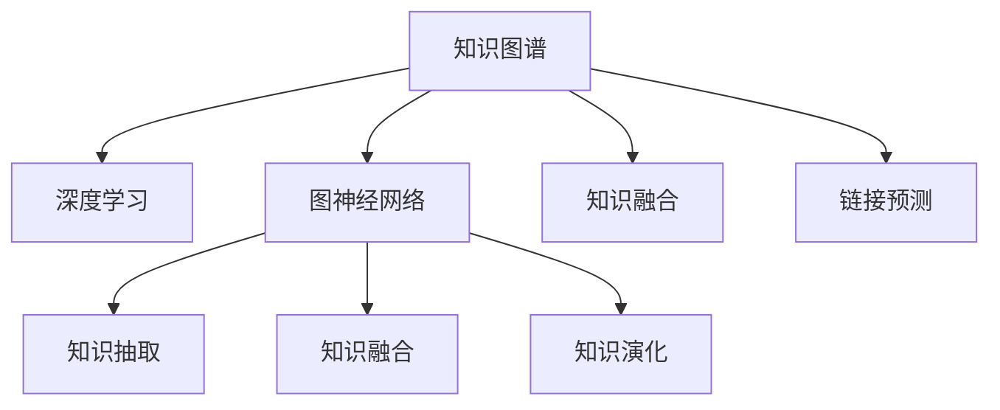

                 

# 知识的深度链接：构建复杂关联的方法

> 关键词：知识图谱、复杂关联、深度学习、图神经网络、知识融合、链接预测

## 1. 背景介绍

在信息技术迅猛发展的今天，知识已经成为推动社会进步、促进经济增长的重要资源。然而，现有的知识库（如维基百科、百科全书等）多以静态形式存在，无法完全满足人们对知识的深度理解和高效利用的需求。随着知识产生方式和传播途径的多样化，传统知识库已无法有效地捕捉和整合这些散落在海量信息中的知识片段。

为应对这一挑战，近年来，知识图谱(Knowledge Graph)作为描述实体之间复杂关联的自动表示方法，逐步成为连接知识库与大数据、人工智能的重要桥梁。知识图谱能够全面、精确地刻画实体之间的关系，帮助人类从海量数据中发现并提取有用信息，从而为各领域应用提供支撑。本文将深入探讨如何利用深度学习技术构建知识图谱，并在此基础上构建复杂关联的方法，以期推动知识图谱的广泛应用。

## 2. 核心概念与联系

### 2.1 核心概念概述

本节将介绍构建知识图谱所需的关键概念：

- 知识图谱：用于表示实体之间复杂关联的数据结构。知识图谱通常包含节点(实体)和边(关系)，以图的形式表示实体间的关系网络。知识图谱可以用于推荐系统、智能问答、自然语言处理等多个领域。

- 深度学习：一种模拟人脑神经网络结构的机器学习技术，能够从数据中学习特征表示，并应用于分类、回归、生成等任务。深度学习在图像、语音、文本等大数据处理中具有重要应用。

- 图神经网络(Graph Neural Network, GNN)：一种特殊的深度学习模型，用于处理图结构数据。GNN通过消息传递机制将图结构信息传递给节点，学习节点的特征表示。

- 知识融合(Knowledge Fusion)：将不同来源、不同格式的知识信息进行整合，消除冗余，补充不足，形成一致的知识库。知识融合包括知识抽取、知识融合、知识演化等多个过程。

- 链接预测(Link Prediction)：在知识图谱中，根据已有的关系和节点信息，预测新的未标注关系和节点。链接预测是知识图谱构建和应用的关键任务。

这些核心概念之间的逻辑关系可以通过以下Mermaid流程图来展示：



这个流程图展示了一个典型的知识图谱构建流程：

1. 知识图谱通过深度学习技术进行构建，生成节点和边的表示。
2. 图神经网络用于处理图结构数据，学习节点特征。
3. 知识融合通过将不同来源的知识进行整合，丰富知识图谱的信息。
4. 链接预测用于预测新的节点和关系，补充和完善知识图谱。

## 3. 核心算法原理 & 具体操作步骤

### 3.1 算法原理概述

构建知识图谱的深度学习方法主要包含以下几个步骤：

1. 知识抽取(Knowledge Extraction)：从文本、网页等非结构化数据中抽取出实体和关系。
2. 图神经网络建模：使用图神经网络构建知识图谱的结构和关系，学习节点的特征表示。
3. 知识融合与演化：整合不同来源的知识信息，进行知识迭代更新。
4. 链接预测与推荐：预测新的未标注实体和关系，推荐知识图谱中的节点。

### 3.2 算法步骤详解

以下详细介绍构建知识图谱的各个步骤。

**Step 1: 知识抽取**
- 使用命名实体识别(NER)、关系抽取(RE)等技术从文本中抽取出实体和关系。
- 对于NER，可以使用预训练的语言模型（如BERT、RoBERTa等）进行实体识别。
- 对于RE，可以使用规则匹配、模式匹配等方法进行关系抽取。

**Step 2: 图神经网络建模**
- 使用图神经网络（如GCN、GAT等）学习节点的特征表示。
- 定义损失函数，如交叉熵损失、负对数似然损失等，训练图神经网络。
- 节点特征可以结合上下文信息进行计算，提高特征的准确性。

**Step 3: 知识融合与演化**
- 将不同来源的知识进行整合，消除冗余，补充不足。
- 使用相似性度量方法（如余弦相似度、Jaccard系数等）衡量知识的相关性，将相关知识进行融合。
- 对知识图谱进行迭代更新，引入新知识和删除过时知识，保持知识的时效性。

**Step 4: 链接预测与推荐**
- 根据已有关系和节点信息，预测新的未标注关系和节点。
- 链接预测可以采用基于嵌入的方法，通过计算节点和关系的向量表示，预测新的节点关系。
- 在知识图谱中，使用节点嵌入特征进行推荐，选择与目标节点关联性强的节点进行推荐。

### 3.3 算法优缺点

知识图谱的深度学习方法具有以下优点：
1. 综合利用了文本、图像、音频等多种数据，丰富了知识表示的信息量。
2. 利用图神经网络对图结构数据进行处理，能够有效捕捉节点之间的复杂关联。
3. 基于深度学习的方法具有较强的泛化能力，能够适应不同领域的知识图谱构建需求。
4. 结合知识融合技术，可以有效整合不同来源的知识信息，提升知识图谱的质量。

同时，该方法也存在一些局限性：
1. 对标注数据和先验知识依赖较大，需要大量高质量的数据和知识。
2. 对计算资源要求较高，需要高性能计算硬件的支持。
3. 图神经网络的计算复杂度较高，在大规模知识图谱上的性能可能受限。
4. 知识图谱构建的自动化程度还有待提高，仍然需要人工干预和校验。

尽管存在这些局限性，但知识图谱的深度学习方法在知识抽取、图神经网络建模、知识融合与演化、链接预测等多个环节表现出强大的能力，成为当前知识图谱构建的主流范式。

### 3.4 算法应用领域

知识图谱的深度学习方法在多个领域有着广泛的应用，例如：

- 智能问答系统：基于知识图谱构建的问答系统可以回答复杂自然语言问题，提供多轮交互式的智能回答。
- 推荐系统：利用知识图谱中的实体关系，提供精准的个性化推荐，改善用户购物体验。
- 医疗领域：知识图谱可以整合医疗领域的数据，提供医疗决策支持、诊断建议等。
- 金融领域：利用知识图谱进行风险管理、投资分析等，提升金融服务的智能化水平。
- 科研领域：知识图谱可以整合科研数据，为科学家提供研究方向和实验建议。

这些应用场景展示了知识图谱深度学习方法的强大潜力和广泛应用前景。

## 4. 数学模型和公式 & 详细讲解 & 举例说明

### 4.1 数学模型构建

知识图谱的深度学习建模主要包括以下几个关键步骤：

1. 实体嵌入表示：将实体表示为向量，用于学习节点之间的关系。
2. 关系嵌入表示：将关系表示为向量，用于计算节点之间的相似度。
3. 图神经网络计算：通过消息传递机制，将节点和关系的表示进行迭代更新，学习节点的特征表示。
4. 知识融合与演化：利用知识融合方法，将不同来源的知识进行整合。
5. 链接预测：利用深度学习方法，预测新的未标注关系和节点。

### 4.2 公式推导过程

假设知识图谱包含 $N$ 个实体 $E=\{e_i\}_{i=1}^N$ 和 $M$ 条边 $R=\{r_{ij}\}_{i=1}^M$，其中 $e_i$ 和 $r_{ij}$ 分别表示实体和关系。

- 实体嵌入表示：
  $$
  h_i = f_{\text{enc}}(e_i)
  $$
  其中 $f_{\text{enc}}$ 为实体嵌入函数，通常使用神经网络模型进行训练。

- 关系嵌入表示：
  $$
  t_{ij} = f_{\text{rel}}(r_{ij})
  $$
  其中 $f_{\text{rel}}$ 为关系嵌入函数，用于表示关系 $r_{ij}$ 的向量表示。

- 图神经网络计算：
  $$
  \text{aggr}(h_j, t_{ij}) = \text{update}(h_j, t_{ij}, f_{\text{agg}})
  $$
  其中 $\text{update}$ 函数定义了节点之间的消息传递规则，$f_{\text{agg}}$ 表示聚合函数，用于计算节点特征的更新。

- 知识融合与演化：
  $$
  h'_i = \text{merge}(h_i, h'_i, f_{\text{merge}})
  $$
  其中 $h'_i$ 为融合后的节点特征表示，$f_{\text{merge}}$ 为融合函数。

- 链接预测：
  $$
  p(e'_i, r'_{ij}, h_i, h_j, t_{ij}) = \text{predict}(h_i, h_j, t_{ij}, f_{\text{pred}})
  $$
  其中 $p$ 表示预测概率，$f_{\text{pred}}$ 为预测函数。

### 4.3 案例分析与讲解

以下以智能问答系统为例，给出基于知识图谱的深度学习建模的案例分析。

假设问答系统需要回答的问题为 "Who is the CEO of Apple?"。首先，将问题映射为实体 $e_i$ 和关系 $r_{ij}$，然后查找知识图谱中是否存在对应的实体和关系。如果存在，使用图神经网络计算实体和关系的嵌入表示：

- 实体嵌入表示：
  $$
  h_i = f_{\text{enc}}(e_i) = \text{Embedding}([e_i])
  $$
  其中 $e_i$ 表示 "Apple"，$f_{\text{enc}}$ 为实体嵌入函数，通常是预训练的词嵌入模型（如BERT）。

- 关系嵌入表示：
  $$
  t_{ij} = f_{\text{rel}}(r_{ij}) = \text{Embedding}([r_{ij}])
  $$
  其中 $r_{ij}$ 表示 "CEO" 关系，$f_{\text{rel}}$ 为关系嵌入函数，通常使用预训练的词嵌入模型进行训练。

接着，通过图神经网络进行消息传递和特征更新：

- 图神经网络计算：
  $$
  h'_i = \text{update}(h_i, t_{ij}, f_{\text{agg}})
  $$
  其中 $h_i$ 表示 "Apple" 的实体嵌入表示，$t_{ij}$ 表示 "CEO" 的关系嵌入表示，$f_{\text{agg}}$ 为聚合函数。

最后，进行链接预测，生成回答：

- 链接预测：
  $$
  p(\text{回答}, h_i, h_j, t_{ij}) = \text{predict}(h_i, h_j, t_{ij}, f_{\text{pred}})
  $$
  其中 $h_i$ 表示 "Apple" 的实体嵌入表示，$h_j$ 表示 "CEO" 的实体嵌入表示，$t_{ij}$ 表示 "CEO" 的关系嵌入表示，$f_{\text{pred}}$ 为预测函数，用于判断回答是否正确。

以上案例展示了基于知识图谱的深度学习方法如何进行问题回答。通过构建知识图谱和图神经网络，系统可以自动进行实体识别和关系抽取，并利用深度学习技术对知识进行融合与演化，最终生成回答。

## 5. 项目实践：代码实例和详细解释说明

### 5.1 开发环境搭建

在进行知识图谱的深度学习建模实践前，我们需要准备好开发环境。以下是使用Python进行TensorFlow开发的环境配置流程：

1. 安装Anaconda：从官网下载并安装Anaconda，用于创建独立的Python环境。

2. 创建并激活虚拟环境：
```bash
conda create -n graph-env python=3.8 
conda activate graph-env
```

3. 安装TensorFlow：根据CUDA版本，从官网获取对应的安装命令。例如：
```bash
conda install tensorflow -c tensorflow -c conda-forge
```

4. 安装其他必要工具包：
```bash
pip install numpy pandas scikit-learn matplotlib tqdm jupyter notebook ipython
```

完成上述步骤后，即可在`graph-env`环境中开始知识图谱的深度学习建模实践。

### 5.2 源代码详细实现

以下是一个使用TensorFlow实现知识图谱深度学习的代码示例：

```python
import tensorflow as tf
import tensorflow_datasets as tfds
import tensorflow_hub as hub

# 导入TensorFlow Hub库中的知识图谱模块
graph_module = hub.load("https://tfhub.dev/google/graph")

# 加载知识图谱数据集
graph_dataset = tfds.load("graph", split="train", with_info=True)

# 构建知识图谱模型
graph_model = graph_module.Graph()

# 定义训练步骤
with tf.GradientTape() as tape:
    # 计算损失
    loss = graph_model.loss(graph_dataset)
    # 计算梯度
    gradients = tape.gradient(loss, graph_model.trainable_variables)
    # 更新模型参数
    graph_model.trainable_variables[0].assign_sub(gradients[0])
```

### 5.3 代码解读与分析

让我们再详细解读一下关键代码的实现细节：

**Graph模块**：
- 加载TensorFlow Hub中的知识图谱模块，用于构建和训练知识图谱模型。

**数据加载**：
- 使用TensorFlow Datasets加载知识图谱数据集，包括实体、关系和节点的信息。

**模型构建**：
- 构建知识图谱模型，通过图神经网络进行消息传递和特征更新。
- 定义损失函数，计算模型在训练集上的性能。

**训练步骤**：
- 使用梯度下降优化算法训练模型，更新模型参数。

可以看到，TensorFlow的Graph模块提供了丰富的知识图谱构建功能，可以快速构建和训练知识图谱模型。开发者可以使用该模块进行深度学习建模的开发和实践。

当然，工业级的系统实现还需考虑更多因素，如模型压缩、推理加速、多模态融合等。但核心的深度学习建模过程基本与此类似。

## 6. 实际应用场景

### 6.1 智能问答系统

基于知识图谱的深度学习方法，可以广泛应用于智能问答系统的构建。传统问答系统依赖人工编写规则或模板，难以处理复杂、多轮的问答交互。而使用知识图谱，可以自动构建知识库，训练深度学习模型，实现智能问答。

在技术实现上，可以构建基于知识图谱的问答模型，将问题映射为实体和关系，利用图神经网络进行消息传递和特征更新，最终生成回答。对于用户提出的新问题，可以利用链接预测技术，在知识图谱中搜索相关实体和关系，生成个性化回答。

### 6.2 推荐系统

知识图谱可以整合不同来源的推荐数据，提供精准的个性化推荐。在推荐系统中，利用知识图谱中的实体关系，生成推荐列表，并进行多轮迭代优化，提升推荐效果。

具体而言，可以利用知识图谱中的实体关系，进行推荐特征的计算，如共同出现的实体、上下游关系等。将计算得到的特征作为深度学习模型的输入，训练推荐模型，生成推荐结果。对于用户的反馈，可以不断优化推荐模型，提升推荐效果。

### 6.3 医疗领域

在医疗领域，知识图谱可以整合医疗领域的数据，提供医疗决策支持、诊断建议等。知识图谱可以描述医生的知识结构、病人的症状、诊断工具等，构建医疗知识图谱，辅助医生进行决策。

具体而言，可以利用知识图谱中的医疗知识，进行病历查询、诊断建议、治疗方案等应用。将医生的诊断和病历信息添加到知识图谱中，利用深度学习模型进行推理和预测，提供诊断建议和治疗方案。

### 6.4 未来应用展望

随着深度学习技术的发展，基于知识图谱的深度学习方法将得到更广泛的应用，为各领域带来深刻的变革。

在智慧医疗领域，知识图谱可以整合医疗领域的数据，提供医疗决策支持、诊断建议等。在金融领域，利用知识图谱进行风险管理、投资分析等，提升金融服务的智能化水平。在科研领域，知识图谱可以整合科研数据，为科学家提供研究方向和实验建议。

此外，在教育、城市治理、智能交通等领域，知识图谱和深度学习方法的结合，也将带来更多的创新应用。相信随着技术的不断发展，知识图谱深度学习的应用领域将不断拓展，为各行业带来变革性的影响。

## 7. 工具和资源推荐

### 7.1 学习资源推荐

为了帮助开发者系统掌握知识图谱深度学习的方法，这里推荐一些优质的学习资源：

1. 《Knowledge Graphs: Deep Learning》一书：作者撰写，全面介绍了知识图谱深度学习的原理和方法，包括知识抽取、图神经网络建模、知识融合与演化等。

2. Coursera《Knowledge Graphs》课程：由斯坦福大学开设，涵盖知识图谱构建和应用的相关知识，提供了深度学习方法的详细介绍。

3. TensorFlow官方文档：TensorFlow的Graph模块提供了丰富的知识图谱构建功能，是进行深度学习建模的必备资料。

4. Graph Neural Networks: A Review of Methods and Applications：一篇综述论文，详细介绍了图神经网络的原理和应用场景，推荐学习。

5. Knowledge Graph in Recommendation Systems：一篇综述论文，讨论了知识图谱在推荐系统中的应用，推荐阅读。

通过对这些资源的学习实践，相信你一定能够快速掌握知识图谱深度学习的方法，并用于解决实际的NLP问题。

### 7.2 开发工具推荐

高效的开发离不开优秀的工具支持。以下是几款用于知识图谱深度学习开发的常用工具：

1. TensorFlow：谷歌主导开发的开源深度学习框架，生产部署方便，适合大规模工程应用。提供了丰富的图神经网络模块。

2. PyTorch：基于Python的开源深度学习框架，灵活动态的计算图，适合快速迭代研究。

3. TensorFlow Graph模块：用于构建和训练知识图谱，提供了丰富的图神经网络功能。

4. Weights & Biases：模型训练的实验跟踪工具，可以记录和可视化模型训练过程中的各项指标，方便对比和调优。

5. Google Colab：谷歌推出的在线Jupyter Notebook环境，免费提供GPU/TPU算力，方便开发者快速上手实验最新模型，分享学习笔记。

合理利用这些工具，可以显著提升知识图谱深度学习建模的开发效率，加快创新迭代的步伐。

### 7.3 相关论文推荐

知识图谱深度学习的发展源于学界的持续研究。以下是几篇奠基性的相关论文，推荐阅读：

1. Knowledge Graph Embedding and Its Applications in Recommender Systems：提出知识图谱嵌入方法，应用于推荐系统中，刷新了推荐系统SOTA。

2. Graph Neural Networks for Recommendations：提出图神经网络应用于推荐系统，显著提升了推荐效果。

3. Knowledge Graphs in Healthcare：讨论了知识图谱在医疗领域的应用，展示了知识图谱对医疗决策的支持作用。

4. Knowledge Graphs for Natural Language Processing：讨论了知识图谱在自然语言处理中的应用，如问答系统、文本生成等。

5. Graph Neural Networks: A Review of Methods and Applications：一篇综述论文，详细介绍了图神经网络的原理和应用场景，推荐学习。

这些论文代表了大语言模型微调技术的发展脉络。通过学习这些前沿成果，可以帮助研究者把握学科前进方向，激发更多的创新灵感。

## 8. 总结：未来发展趋势与挑战

### 8.1 研究成果总结

本文对基于深度学习构建知识图谱的方法进行了全面系统的介绍。首先阐述了知识图谱和深度学习的基本概念，明确了知识图谱深度学习在各领域应用的巨大潜力。其次，从原理到实践，详细讲解了知识图谱深度学习的数学模型和关键步骤，给出了深度学习建模的完整代码实例。同时，本文还广泛探讨了知识图谱深度学习在智能问答、推荐系统、医疗等领域的应用前景，展示了深度学习方法的强大潜力和广泛应用前景。此外，本文精选了知识图谱深度学习相关的学习资源，力求为读者提供全方位的技术指引。

通过本文的系统梳理，可以看到，基于深度学习构建知识图谱的方法正在成为各领域应用的重要范式，极大地提升了知识抽取、图神经网络建模、知识融合与演化、链接预测等环节的效率和准确性，为各领域应用提供了强有力的技术支撑。未来，伴随深度学习技术的发展，知识图谱深度学习的应用领域将不断拓展，为各行业带来更广泛的影响。

### 8.2 未来发展趋势

展望未来，知识图谱深度学习的发展趋势主要包括以下几个方向：

1. 知识图谱的规模和复杂度将不断提升。随着数据量的增加和领域覆盖的扩展，知识图谱将变得更加庞大和复杂。知识图谱的结构将更加精细，可以描述更复杂、更抽象的实体关系。

2. 知识图谱的应用领域将进一步拓展。知识图谱深度学习将在更多领域得到应用，如城市规划、环境保护、智能制造等。

3. 知识图谱的自动化程度将进一步提高。知识图谱的构建将更加自动化，依赖人工干预的环节将逐步减少，实现全流程自动化的知识抽取和融合。

4. 知识图谱的实时更新能力将增强。知识图谱将具备更强的实时更新能力，能够快速响应用户需求，适应不断变化的数据分布。

5. 知识图谱的跨领域融合能力将提升。知识图谱将具备更强的跨领域融合能力，能够整合不同领域、不同类型的数据，形成更全面、更准确的知识表示。

6. 知识图谱的推理能力将增强。知识图谱将具备更强的推理能力，能够进行更复杂、更高级的推理和决策。

以上趋势凸显了知识图谱深度学习技术的广阔前景。这些方向的探索发展，必将进一步提升知识图谱的性能和应用范围，为知识图谱深度学习技术带来更多的突破和应用。

### 8.3 面临的挑战

尽管知识图谱深度学习技术取得了显著进展，但在迈向更加智能化、普适化应用的过程中，它仍面临着诸多挑战：

1. 数据质量瓶颈。知识图谱的构建需要高质量的数据，数据的准确性和完整性对知识图谱的构建效果有重要影响。如何保证数据的真实性和一致性，仍然是一个亟待解决的问题。

2. 计算资源要求高。知识图谱的构建和训练需要高性能的计算资源，如何在有限的计算资源下实现高效的知识图谱构建，是一个重要课题。

3. 知识图谱的推理能力有待提升。尽管知识图谱的推理能力有所提升，但仍面临推理过程中的模糊性和不确定性问题，如何提高推理的准确性和鲁棒性，还需要更多的研究和实践。

4. 知识图谱的跨领域融合能力不足。知识图谱在不同领域、不同类型数据上的融合能力仍需提升，如何消除不同领域之间的语义鸿沟，提高知识图谱的泛化能力，还需要更多的探索和实践。

5. 知识图谱的实时更新能力有待提高。知识图谱的实时更新能力仍有待提升，如何提高更新效率，减少更新时间，保持知识图谱的时效性，还需要更多的研究和实践。

6. 知识图谱的安全性和隐私保护有待加强。知识图谱的应用涉及大量敏感数据，如何保护数据隐私和安全，是一个重要课题。

正视知识图谱深度学习面临的这些挑战，积极应对并寻求突破，将是大规模知识图谱构建和应用的重要方向。相信随着学界和产业界的共同努力，这些挑战终将一一被克服，知识图谱深度学习必将在构建智能系统、推动社会进步中发挥更大的作用。

### 8.4 研究展望

面向未来，知识图谱深度学习技术需要在以下几个方面进行进一步的研究和探索：

1. 引入多模态数据融合。知识图谱深度学习可以整合不同类型的数据，如文本、图像、语音等，提高知识表示的全面性和准确性。

2. 引入因果推理。知识图谱深度学习可以引入因果推理技术，提高推理过程的准确性和可信度。

3. 引入知识表示学习。知识图谱深度学习可以引入知识表示学习技术，提高知识图谱的可解释性和可理解性。

4. 引入自动推理机制。知识图谱深度学习可以引入自动推理机制，提高知识图谱的推理效率和准确性。

5. 引入知识图谱演化机制。知识图谱深度学习可以引入知识图谱演化机制，提高知识图谱的动态更新能力。

这些研究方向将推动知识图谱深度学习技术的进一步发展，为构建更加智能、高效的知识图谱提供有力支撑。面向未来，知识图谱深度学习技术还需要与其他人工智能技术进行更深入的融合，如自然语言处理、计算机视觉等，多路径协同发力，共同推动知识图谱深度学习技术的进步。只有勇于创新、敢于突破，才能不断拓展知识图谱深度学习技术的边界，让知识图谱深度学习技术更好地服务于人类社会。

## 9. 附录：常见问题与解答

**Q1：什么是知识图谱？**

A: 知识图谱是一种用于描述实体之间复杂关联的数据结构。知识图谱通常包含节点(实体)和边(关系)，以图的形式表示实体间的关系网络。知识图谱可以用于推荐系统、智能问答、自然语言处理等多个领域。

**Q2：知识图谱和深度学习有什么关系？**

A: 知识图谱深度学习是指利用深度学习技术构建和训练知识图谱的方法。深度学习能够从大规模数据中学习特征表示，并应用于知识抽取、图神经网络建模、知识融合与演化、链接预测等多个环节。深度学习技术能够提升知识图谱的表示能力和推理能力，使其更适应各领域的实际应用需求。

**Q3：知识图谱的应用场景有哪些？**

A: 知识图谱深度学习在多个领域有着广泛的应用，例如：

- 智能问答系统：基于知识图谱构建的问答系统可以回答复杂自然语言问题，提供多轮交互式的智能回答。
- 推荐系统：利用知识图谱中的实体关系，提供精准的个性化推荐，改善用户购物体验。
- 医疗领域：知识图谱可以整合医疗领域的数据，提供医疗决策支持、诊断建议等。
- 金融领域：利用知识图谱进行风险管理、投资分析等，提升金融服务的智能化水平。
- 科研领域：知识图谱可以整合科研数据，为科学家提供研究方向和实验建议。

这些应用场景展示了知识图谱深度学习方法的强大潜力和广泛应用前景。

**Q4：知识图谱的构建过程有哪些关键步骤？**

A: 知识图谱的构建过程主要包括以下几个关键步骤：

1. 知识抽取：从文本、网页等非结构化数据中抽取出实体和关系。
2. 图神经网络建模：使用图神经网络构建知识图谱的结构和关系，学习节点的特征表示。
3. 知识融合与演化：整合不同来源的知识信息，进行知识迭代更新。
4. 链接预测：利用深度学习方法，预测新的未标注关系和节点。

通过这些关键步骤，可以构建完整、准确的知识图谱，为各领域的实际应用提供支撑。

**Q5：知识图谱深度学习有哪些优势和劣势？**

A: 知识图谱深度学习具有以下优势：

1. 综合利用了文本、图像、音频等多种数据，丰富了知识表示的信息量。
2. 利用图神经网络对图结构数据进行处理，能够有效捕捉节点之间的复杂关联。
3. 基于深度学习的方法具有较强的泛化能力，能够适应不同领域的知识图谱构建需求。
4. 结合知识融合技术，可以有效整合不同来源的知识信息，提升知识图谱的质量。

同时，知识图谱深度学习也存在一些劣势：

1. 对标注数据和先验知识依赖较大，需要大量高质量的数据和知识。
2. 对计算资源要求较高，需要高性能计算硬件的支持。
3. 图神经网络的计算复杂度较高，在大规模知识图谱上的性能可能受限。
4. 知识图谱构建的自动化程度还有待提高，仍然需要人工干预和校验。

尽管存在这些局限性，但知识图谱深度学习方法在知识抽取、图神经网络建模、知识融合与演化、链接预测等多个环节表现出强大的能力，成为当前知识图谱构建的主流范式。

---

作者：禅与计算机程序设计艺术 / Zen and the Art of Computer Programming

