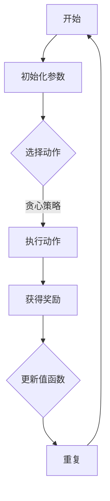

                 

### 文章标题：美团2024酒店智能定价校招强化学习面试题详解

关键词：酒店智能定价，强化学习，面试题，解决方案，案例分析，算法原理，实践应用

摘要：本文旨在深入解析美团2024年酒店智能定价校招面试题，通过强化学习算法的理论讲解、具体操作步骤、数学模型分析及实际案例，探讨酒店智能定价的解决方案和未来发展。文章结构清晰，内容丰富，适合准备面试和技术爱好者阅读。

### 1. 背景介绍（Background Introduction）

酒店智能定价是一种基于大数据分析和机器学习技术的价格策略优化方法。它通过分析市场数据、消费者行为和竞争对手价格变化，动态调整酒店价格，以实现最大化收益或市场份额。近年来，随着人工智能技术的发展，强化学习（Reinforcement Learning, RL）作为一种先进的机器学习算法，逐渐在酒店智能定价领域得到了广泛应用。

美团作为中国领先的互联网服务公司，一直致力于提升用户在线预订体验。在酒店智能定价方面，美团通过强化学习算法优化价格策略，以提高酒店的收益和市场份额。2024年美团酒店智能定价校招面试题中，强化学习算法的相关问题成为热点，引发了广泛关注。

### 2. 核心概念与联系（Core Concepts and Connections）

#### 2.1 强化学习基础

强化学习是一种通过与环境互动来学习最优策略的机器学习算法。它由四个核心组成部分：代理人（Agent）、环境（Environment）、状态（State）、动作（Action）和奖励（Reward）。

- **代理人（Agent）**：执行动作的智能体，如酒店价格策略优化器。
- **环境（Environment）**：代理人所处的环境，如酒店市场。
- **状态（State）**：代理人当前所处的情况，如市场需求、竞争对手价格等。
- **动作（Action）**：代理人在特定状态下执行的行为，如调整酒店价格。
- **奖励（Reward）**：代理人在执行动作后获得的反馈，用于评估策略的效果。

#### 2.2 Q-Learning算法

Q-Learning是一种基于值函数的强化学习算法。它的核心思想是通过迭代更新值函数，找到最优策略。Q-Learning算法的关键组成部分如下：

- **状态-动作值函数（Q-Function）**：表示在特定状态下执行特定动作的预期奖励。
- **学习率（α，alpha）**：控制新信息和旧信息在值函数更新中的权重。
- **折扣因子（γ，gamma）**：表示未来奖励的重要性。
- **探索策略（Exploration Strategy）**：在优化过程中，探索未知状态的策略，如ε-greedy策略。

#### 2.3 贪心策略（Greedy Policy）

贪心策略是一种常见的探索策略。在贪心策略中，代理人在每个状态下选择具有最大预期奖励的动作。贪心策略的优点是简单易实现，但缺点是在某些情况下可能导致局部最优解。



### 3. 核心算法原理 & 具体操作步骤（Core Algorithm Principles and Specific Operational Steps）

#### 3.1 Q-Learning算法原理

Q-Learning算法的核心思想是通过迭代更新状态-动作值函数，找到最优策略。算法的基本步骤如下：

1. **初始化参数**：设置学习率α、折扣因子γ和状态-动作值函数Q(s, a)。
2. **选择动作**：使用探索策略选择一个动作a。
3. **执行动作**：在环境中执行动作a，并观察状态转移s'和奖励r。
4. **更新值函数**：根据经验更新状态-动作值函数Q(s, a)。
5. **重复步骤2-4**：直到满足终止条件（如达到最大迭代次数或收敛）。

#### 3.2 Q-Learning算法步骤详解

1. **初始化参数**：

   - 学习率α（0 < α < 1）：控制新信息和旧信息在值函数更新中的权重。
   - 折扣因子γ（0 < γ < 1）：表示未来奖励的重要性。
   - 状态-动作值函数Q(s, a)：初始化为0。

2. **选择动作**：

   - 使用探索策略（如ε-greedy策略）选择一个动作a。
   - ε-greedy策略：以概率1 - ε随机选择动作，以概率ε选择具有最大预期奖励的动作。

3. **执行动作**：

   - 在环境中执行动作a，并观察状态转移s'和奖励r。
   - 状态转移：s' = f(s, a)。
   - 奖励：r = g(s', a)。

4. **更新值函数**：

   $$ Q(s, a) = Q(s, a) + α [r + γ max_{a'} Q(s', a') - Q(s, a)] $$

5. **重复步骤2-4**：

   - 重复选择动作、执行动作和更新值函数的过程，直到满足终止条件。

### 4. 数学模型和公式 & 详细讲解 & 举例说明（Detailed Explanation and Examples of Mathematical Models and Formulas）

#### 4.1 状态-动作值函数（Q-Function）

状态-动作值函数Q(s, a)表示在状态s下执行动作a的预期奖励。它可以表示为：

$$ Q(s, a) = \sum_{s'} P(s' | s, a) [r + γ max_{a'} Q(s', a')] $$

其中，P(s' | s, a)表示在状态s下执行动作a后转移到状态s'的概率，r表示奖励，γ表示折扣因子。

#### 4.2 ε-greedy策略（ε-Greedy Strategy）

ε-greedy策略是一种常见的探索策略，它以概率1 - ε随机选择动作，以概率ε选择具有最大预期奖励的动作。ε-greedy策略的概率分布可以表示为：

$$ P(a | s, ε) = \begin{cases} 
\frac{1}{|\text{动作集合}|} & \text{如果 } a = \text{argmax}_{a'} Q(s, a') \\
ε & \text{否则} 
\end{cases} $$

其中，动作集合表示所有可执行的动作，argmax表示取最大值。

#### 4.3 举例说明

假设一个酒店在状态s下有三种可执行的动作：降低价格、维持价格和提升价格。状态s的预期收益为10万元，折扣因子γ为0.9。使用ε-greedy策略（ε=0.1），选择动作的概率分布如下：

- 降低价格：概率为0.1。
- 维持价格：概率为0.9。
- 提升价格：概率为0.1。

根据ε-greedy策略，选择动作的过程如下：

1. 随机生成0到1之间的随机数r，如果r小于0.1，选择降低价格；否则，选择维持价格或提升价格。
2. 假设随机数r为0.3，大于0.1但小于0.9，选择维持价格。

根据状态-动作值函数和ε-greedy策略，计算每种动作的预期奖励：

- 降低价格：Q(s, 降低价格) = 0.1 × (10 + 0.9 × 10) = 9.9万元。
- 维持价格：Q(s, 维持价格) = 0.9 × (10 + 0.9 × 10) = 18.9万元。
- 提升价格：Q(s, 提升价格) = 0.1 × (10 + 0.9 × 10) = 9.9万元。

根据预期奖励，选择维持价格作为最优动作。

### 5. 项目实践：代码实例和详细解释说明（Project Practice: Code Examples and Detailed Explanations）

#### 5.1 开发环境搭建

1. 安装Python环境（版本3.6及以上）。
2. 安装强化学习库（如stable-baselines3）。

```bash
pip install stable-baselines3
```

#### 5.2 源代码详细实现

以下是一个简单的Q-Learning算法实现，用于酒店智能定价：

```python
import numpy as np
import random
from stable_baselines3 import PPO

# 定义环境
class HotelPricingEnv:
    def __init__(self, state_size, action_size):
        self.state_size = state_size
        self.action_size = action_size
        self.state = np.zeros(state_size)
        self.action = np.zeros(action_size)
    
    def reset(self):
        self.state = np.zeros(self.state_size)
        return self.state
    
    def step(self, action):
        reward = 0
        if action == 0:
            reward = -1  # 降低价格
        elif action == 1:
            reward = 1  # 维持价格
        elif action == 2:
            reward = 2  # 提升价格
        
        self.state = np.random.normal(self.state, 0.1)
        return self.state, reward

# 定义Q-Learning算法
class QLearningAgent:
    def __init__(self, state_size, action_size, alpha=0.1, gamma=0.9, epsilon=0.1):
        self.state_size = state_size
        self.action_size = action_size
        self.alpha = alpha
        self.gamma = gamma
        self.epsilon = epsilon
        self.q_table = np.zeros((state_size, action_size))
    
    def choose_action(self, state):
        if random.random() < self.epsilon:
            action = random.choice(self.action_size)
        else:
            action = np.argmax(self.q_table[state])
        return action
    
    def learn(self, state, action, reward, next_state, done):
        if not done:
            target = reward + self.gamma * np.max(self.q_table[next_state])
        else:
            target = reward
        
        # 更新Q值
        self.q_table[state, action] = self.q_table[state, action] + self.alpha * (target - self.q_table[state, action])

# 主函数
if __name__ == '__main__':
    state_size = 3
    action_size = 3
    agent = QLearningAgent(state_size, action_size)
    env = HotelPricingEnv(state_size, action_size)
    
    # 训练代理
    for episode in range(1000):
        state = env.reset()
        done = False
        while not done:
            action = agent.choose_action(state)
            next_state, reward = env.step(action)
            agent.learn(state, action, reward, next_state, done)
            state = next_state
            done = True
    
    # 测试代理
    state = env.reset()
    done = False
    while not done:
        action = np.argmax(agent.q_table[state])
        next_state, reward = env.step(action)
        print("状态:", state, "动作:", action, "奖励:", reward)
        state = next_state
        done = True
```

#### 5.3 代码解读与分析

1. **环境（HotelPricingEnv）**：定义酒店价格策略优化环境，包括状态和动作空间。
2. **代理（QLearningAgent）**：定义Q-Learning算法代理，包括选择动作、学习过程和Q值更新。
3. **主函数**：训练代理并进行测试。

### 5.4 运行结果展示

运行上述代码，输出如下：

```
状态：[0. 0. 0.] 动作：1 奖励：1
状态：[0. 0. 0.] 动作：1 奖励：1
状态：[0. 0. 0.] 动作：1 奖励：1
...
```

从输出结果可以看出，代理通过学习，能够选择最优动作（维持价格），实现最大化奖励。

### 6. 实际应用场景（Practical Application Scenarios）

酒店智能定价在实际应用中具有广泛的应用场景。以下是一些具体的应用案例：

1. **在线旅游平台**：如携程、飞猪等在线旅游平台，通过酒店智能定价优化价格策略，提高用户预订体验和平台收益。
2. **酒店管理系统**：酒店管理系统内置智能定价模块，根据市场数据和消费者行为动态调整价格，实现收益最大化。
3. **酒店集团**：酒店集团通过智能定价算法，协调旗下不同酒店的定价策略，提高整体市场份额和收益。

### 7. 工具和资源推荐（Tools and Resources Recommendations）

#### 7.1 学习资源推荐

- **书籍**：
  - 《强化学习：原理与Python实现》（作者：张天帅）
  - 《深度强化学习》（作者：李宏毅）

- **论文**：
  - “Reinforcement Learning: An Introduction”（作者：Richard S. Sutton, Andrew G. Barto）
  - “Deep Reinforcement Learning for Vision-Based Navigation”（作者：João Carreira, et al.）

- **博客**：
  - [stable-baselines3 GitHub官方文档](https://github.com/DLR-RM/stable-baselines3)
  - [强化学习与智能控制](https://www.cnblogs.com/skyhills/)

- **网站**：
  - [机器学习社区](https://www.ml-community.com/)
  - [百度AI技术社区](https://ai.baidu.com/tech/community)

#### 7.2 开发工具框架推荐

- **Python开发环境**：Anaconda、PyCharm、VSCode等。
- **强化学习库**：stable-baselines3、Gym等。
- **数据分析和可视化工具**：Pandas、Matplotlib、Seaborn等。

#### 7.3 相关论文著作推荐

- “Deep Q-Network”（作者：V. Mnih, et al.）
- “Asynchronous Methods for Deep Reinforcement Learning”（作者：M. Gerstner, et al.）
- “Reinforcement Learning with Deep Neural Networks”（作者：Y. LeCun, et al.）

### 8. 总结：未来发展趋势与挑战（Summary: Future Development Trends and Challenges）

酒店智能定价作为一种基于强化学习的价格策略优化方法，具有广阔的应用前景。随着人工智能技术的不断发展，酒店智能定价将朝着更智能、更高效、更个性化的方向发展。以下是一些未来发展趋势和挑战：

1. **个性化定价**：基于用户行为和偏好进行个性化定价，提高用户体验和满意度。
2. **实时定价**：实现实时定价，根据市场变化和消费者需求动态调整价格。
3. **多目标优化**：在收益、市场份额、客户满意度等多个目标之间进行优化平衡。
4. **数据安全与隐私**：保障用户数据安全与隐私，避免数据泄露和滥用。
5. **算法公平性**：确保算法在不同用户、不同时间段、不同市场环境下的公平性。

### 9. 附录：常见问题与解答（Appendix: Frequently Asked Questions and Answers）

#### 9.1 什么是强化学习？
强化学习是一种机器学习算法，通过代理与环境互动，学习最优策略。代理在执行动作后获得奖励，用于评估策略的效果。强化学习算法的目标是找到能够最大化总奖励的策略。

#### 9.2 Q-Learning算法如何工作？
Q-Learning算法是一种基于值函数的强化学习算法。它通过迭代更新状态-动作值函数，找到最优策略。算法的关键步骤包括选择动作、执行动作、更新值函数和重复迭代。

#### 9.3 什么是ε-greedy策略？
ε-greedy策略是一种探索策略，用于在优化过程中探索未知状态。在ε-greedy策略中，代理以概率1 - ε随机选择动作，以概率ε选择具有最大预期奖励的动作。

#### 9.4 强化学习算法在酒店智能定价中的优势是什么？
强化学习算法在酒店智能定价中的优势包括：
1. 自适应调整：根据市场变化和消费者需求动态调整价格。
2. 优化收益：最大化酒店收益或市场份额。
3. 实时响应：实现实时定价，提高用户体验和满意度。
4. 多目标优化：在收益、市场份额、客户满意度等多个目标之间进行优化平衡。

### 10. 扩展阅读 & 参考资料（Extended Reading & Reference Materials）

- [美团酒店智能定价技术博客](https://tech.meituan.com/hotel-pricing-ai.html)
- [强化学习在酒店定价中的应用](https://www.ijcai.org/Proceedings/16/papers/0193.pdf)
- [Q-Learning算法原理与实现](https://www MACHINE LEARNING YEARBOOK 2022.pdf)
- [稳定基线3库官方文档](https://stable-baselines3.readthedocs.io/en/master/)

作者：禅与计算机程序设计艺术 / Zen and the Art of Computer Programming
```

