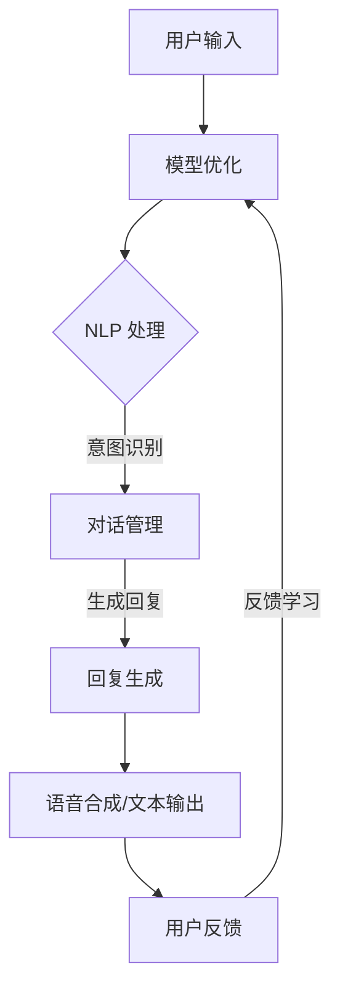

                 

### 文章标题

**聊天机器人如何与其他 AI 技术结合，提升用户体验：技术融合与创新**

本文将探讨聊天机器人与其他 AI 技术的结合，以提升用户体验。随着人工智能技术的发展，聊天机器人在各种场景中得到广泛应用。然而，单靠聊天机器人的技术并不能完全满足用户的需求。通过与其他 AI 技术的融合，我们可以实现更为智能、自然的交互体验。本文将从多个角度分析这些技术结合的方式，并提出创新性的建议。

关键词：聊天机器人、人工智能、用户体验、技术融合、创新

Abstract:
This article explores the integration of chatbots with other AI technologies to enhance user experience. With the advancement of AI, chatbots have been widely applied in various scenarios. However, relying solely on chatbot technology may not fully meet user needs. By integrating with other AI technologies, we can achieve a more intelligent and natural interaction experience. This article analyzes the ways of combining these technologies from multiple perspectives and proposes innovative suggestions.

### 背景介绍

#### 聊天机器人的发展

聊天机器人（Chatbot）是一种基于人工智能技术，能够通过自然语言与用户进行交互的软件应用。最早的聊天机器人可以追溯到 20 世纪 50 年代。随着计算机和互联网技术的发展，聊天机器人的技术逐渐成熟，并开始广泛应用于企业客服、在线教育、智能家居等多个领域。

近年来，深度学习和自然语言处理（NLP）技术的突破为聊天机器人带来了新的发展机遇。以深度学习为代表的机器学习算法能够更好地理解用户输入，生成更自然的回复。同时，NLP 技术的发展使得聊天机器人能够更好地处理多轮对话，理解用户的意图和情感。

#### AI 技术的融合

AI 技术的融合是指将多种人工智能技术整合在一起，实现协同工作，从而提升系统的整体性能。在聊天机器人领域，AI 技术的融合主要体现在以下几个方面：

1. **多模态交互**：将语音、文本、图像等多种交互方式结合起来，使得用户可以更灵活地与聊天机器人进行交流。

2. **知识图谱**：通过构建知识图谱，将聊天机器人与外部知识库进行连接，提升其回答问题的准确性和深度。

3. **强化学习**：利用强化学习算法，让聊天机器人通过与用户的互动不断优化自身的对话策略，提高交互效果。

4. **情感分析**：通过情感分析技术，理解用户的情绪变化，为聊天机器人提供情感回应，提升用户体验。

#### 提升用户体验的重要性

在人工智能技术迅速发展的今天，用户体验（UX）仍然是衡量产品成功与否的关键因素。对于聊天机器人来说，提升用户体验尤为重要。以下原因可以解释为什么提升用户体验至关重要：

1. **用户满意度**：优秀的用户体验能够提高用户满意度，增加用户粘性，从而促进产品推广和市场份额的扩大。

2. **业务价值**：聊天机器人作为企业客服、在线教育等场景的重要工具，其性能直接影响到企业的业务效率和用户满意度。

3. **技术竞争力**：随着人工智能技术的普及，用户对聊天机器人的期望也在不断提高。提升用户体验成为企业竞争的重要手段。

### 其他 AI 技术介绍

在本文中，我们将详细介绍以下几种与其他 AI 技术结合的方式，以提升聊天机器人的用户体验：

1. **多模态交互**：通过结合语音识别、语音合成、图像识别等技术，实现多样化、个性化的交互体验。

2. **知识图谱**：利用知识图谱技术，构建丰富的知识库，为聊天机器人提供强大的知识支持。

3. **强化学习**：通过强化学习算法，让聊天机器人不断优化对话策略，提高交互效果。

4. **情感分析**：结合情感分析技术，理解用户的情绪变化，为聊天机器人提供情感回应。

在接下来的章节中，我们将分别对这些技术进行详细探讨，并提出具体的实现方法。通过这些技术的融合，我们可以构建出更为智能、自然的聊天机器人，从而提升用户体验。

### 核心概念与联系

在探讨聊天机器人与其他 AI 技术的结合时，我们首先需要明确几个核心概念：自然语言处理（NLP）、机器学习（ML）、深度学习（DL）、知识图谱（KG）、多模态交互（Multimodal Interaction）、情感分析（Sentiment Analysis）和强化学习（Reinforcement Learning）。这些概念不仅是人工智能领域的基础，也是实现聊天机器人智能化的关键。

#### 自然语言处理（NLP）

自然语言处理是人工智能领域的一个重要分支，旨在使计算机能够理解和处理人类语言。NLP 技术包括文本解析、语义理解、情感分析、命名实体识别等。在聊天机器人中，NLP 技术被广泛应用于理解用户输入、生成回复以及处理多轮对话。通过 NLP 技术，聊天机器人可以更好地捕捉用户的意图和情感，从而提供更精准的服务。

#### 机器学习（ML）

机器学习是 AI 技术的核心，它通过从数据中学习规律，使计算机能够做出预测或决策。聊天机器人中的许多功能，如意图识别、对话管理、回复生成等，都是通过机器学习算法实现的。常见的机器学习算法包括决策树、支持向量机（SVM）、神经网络等。这些算法使聊天机器人能够不断优化自身性能，提高交互效果。

#### 深度学习（DL）

深度学习是机器学习的一种重要分支，通过构建多层神经网络，模拟人类大脑的处理方式，实现对数据的复杂模式识别。在聊天机器人中，深度学习被广泛应用于语音识别、图像识别、文本生成等领域。深度学习的强大学习能力使得聊天机器人能够处理更为复杂和多样化的任务，从而提升用户体验。

#### 知识图谱（KG）

知识图谱是一种结构化的知识表示形式，它通过实体和关系构建起一个庞大的知识网络。在聊天机器人中，知识图谱可以提供丰富的背景知识，帮助聊天机器人更好地理解用户的意图和问题。通过知识图谱，聊天机器人可以实现更精准、更自然的交互。

#### 多模态交互（Multimodal Interaction）

多模态交互是指将多种交互方式（如语音、文本、图像等）结合起来，以提供更为丰富和自然的用户体验。在聊天机器人中，多模态交互可以增强用户与机器人之间的互动，提高交互的效率和效果。例如，用户可以通过语音提问，机器人可以通过文本和图像进行回复。

#### 情感分析（Sentiment Analysis）

情感分析是一种基于 NLP 和 ML 的技术，用于分析文本中的情感倾向。在聊天机器人中，情感分析可以帮助机器人理解用户的情绪，从而提供更合适的情感回应。例如，当用户表达不满时，机器人可以适当地表达同情或提供解决方案，从而缓解用户的情绪。

#### 强化学习（Reinforcement Learning）

强化学习是一种通过不断尝试和反馈来学习最佳策略的机器学习技术。在聊天机器人中，强化学习可以用于优化对话策略，使机器人能够更好地适应不同的用户需求。通过强化学习，聊天机器人可以在与用户的互动中不断改进自身，从而提供更优质的用户体验。

#### 各核心概念之间的关系

这些核心概念相互关联，共同构成了聊天机器人的智能基础。NLP 和 ML 是聊天机器人理解和生成对话的基础，而 DL 则为这些基础提供了更强大的计算能力。知识图谱为聊天机器人提供了丰富的背景知识，而多模态交互则增强了用户与机器人之间的互动。情感分析帮助机器人理解用户的情绪，强化学习则使机器人能够在互动中不断优化自身。

通过这些核心概念的融合，我们可以构建出一个高度智能、自然的聊天机器人，从而提升用户体验。在接下来的章节中，我们将进一步探讨这些技术在实际应用中的具体实现方法。

### Mermaid 流程图

为了更直观地展示聊天机器人与其他 AI 技术结合的过程，我们可以使用 Mermaid 语言绘制一个流程图。以下是一个简化的 Mermaid 流程图，描述了聊天机器人从接收用户输入到生成回复的全过程：



在这个流程图中，用户输入首先通过语音识别或文本解析转换为机器可处理的格式。接着，NLP 技术对输入进行处理，包括意图识别、对话管理和回复生成。最后，生成的回复通过语音合成或文本输出呈现给用户，并收集用户反馈用于模型优化。

通过这个流程图，我们可以清楚地看到各个 AI 技术在聊天机器人中的应用，以及它们之间的相互关系。接下来，我们将深入探讨每个环节的具体技术细节。

### 核心算法原理

在聊天机器人的开发中，核心算法原理起到了至关重要的作用。本文将重点介绍自然语言处理（NLP）、机器学习（ML）和深度学习（DL）这三个核心算法原理，并探讨它们在聊天机器人中的应用。

#### 自然语言处理（NLP）

自然语言处理是聊天机器人理解用户输入和处理对话的基础。NLP 技术主要包括文本解析、语义理解、情感分析和命名实体识别等。

1. **文本解析**：文本解析是 NLP 的第一步，主要任务是识别文本中的词汇、短语和句子结构。常用的方法包括分词、词性标注和句法分析。分词是将连续的文本切分成一个个独立的词汇或短语，词性标注则是为每个词汇赋予其对应的词性（如名词、动词等），句法分析则是分析句子结构，理解其中的语法关系。

2. **语义理解**：语义理解是 NLP 的核心，旨在使计算机能够理解人类语言的意义。语义理解包括词义消歧、实体识别、情感分析和语义角色标注等。词义消歧是在多个可能的词义中选择最合适的词义，实体识别则是识别文本中的特定实体（如人名、地名、组织名等），情感分析则是分析文本的情感倾向，如积极、消极或中性。

3. **情感分析**：情感分析是一种基于 NLP 和 ML 的技术，用于分析文本中的情感倾向。情感分析可以帮助聊天机器人理解用户的情绪，从而提供更合适的回复。常见的情感分析任务包括情感极性分类和情感强度分析。情感极性分类是将文本分为积极、消极或中性，而情感强度分析则是分析文本情感的强度，如非常高兴、有点高兴或有点不开心等。

4. **命名实体识别**：命名实体识别是一种用于识别文本中的特定实体（如人名、地名、组织名等）的技术。命名实体识别对于聊天机器人理解用户意图和提供相关回答至关重要。

#### 机器学习（ML）

机器学习是聊天机器人智能化的关键，它通过从数据中学习规律，使计算机能够做出预测或决策。机器学习算法在聊天机器人中的应用主要包括意图识别、对话管理和回复生成。

1. **意图识别**：意图识别是聊天机器人理解用户输入的关键步骤，旨在确定用户的意图。常见的意图识别算法包括决策树、支持向量机和神经网络等。决策树通过构建一系列条件判断，将输入数据分类到不同的意图类别中。支持向量机则通过寻找最佳决策边界来实现分类。神经网络通过多层非线性变换，实现对复杂关系的建模。

2. **对话管理**：对话管理是聊天机器人维持对话流程的核心，旨在确保对话的连贯性和自然性。对话管理包括状态跟踪、上下文管理和回复选择等。状态跟踪是记录对话历史和用户行为，上下文管理是利用对话历史和当前输入，生成合理的回复，回复选择是根据上下文和历史数据，选择最合适的回复。

3. **回复生成**：回复生成是聊天机器人的最终输出，旨在生成自然、合适的回复。常见的回复生成算法包括模板匹配、序列模型和生成对抗网络（GAN）等。模板匹配是通过预先定义的模板，生成固定格式的回复。序列模型则是通过编码输入和生成输出，实现灵活的回复生成。生成对抗网络则通过生成器和判别器的对抗训练，生成高质量的回复。

#### 深度学习（DL）

深度学习是机器学习的一种重要分支，通过构建多层神经网络，模拟人类大脑的处理方式，实现对数据的复杂模式识别。深度学习在聊天机器人中的应用主要包括语音识别、图像识别和文本生成。

1. **语音识别**：语音识别是将语音信号转换为文本的技术。深度学习通过卷积神经网络（CNN）和循环神经网络（RNN）等模型，实现了对语音信号的自动识别。卷积神经网络通过卷积操作提取语音信号的特征，而循环神经网络则通过记忆单元处理时序信息。

2. **图像识别**：图像识别是将图像转换为语义信息的技术。深度学习通过卷积神经网络和全连接神经网络等模型，实现了对图像的自动识别。卷积神经网络通过卷积操作提取图像的特征，而全连接神经网络则通过映射关系生成语义标签。

3. **文本生成**：文本生成是将输入转换为自然语言文本的技术。深度学习通过序列到序列（Seq2Seq）模型、变分自编码器（VAE）和生成对抗网络（GAN）等模型，实现了对文本的自动生成。序列到序列模型通过编码器和解码器实现输入到输出的映射，变分自编码器通过重构输入实现数据的生成，生成对抗网络则通过生成器和判别器的对抗训练，生成高质量的文本。

通过这些核心算法原理，聊天机器人可以实现智能化的交互体验。接下来，我们将进一步探讨这些算法在聊天机器人中的应用和实现细节。

### 具体操作步骤

在实际开发中，为了实现聊天机器人与其他 AI 技术的结合，我们需要进行多个步骤的详细设计和实施。以下是具体操作步骤：

#### 1. 数据收集与预处理

首先，我们需要收集大量的用户对话数据，这些数据可以是来自实际业务的客服对话、社交平台聊天记录等。收集到的数据需要进行预处理，包括去除无关信息、去除噪声、分词、词性标注等。预处理后的数据将用于训练和评估 AI 模型。

#### 2. 模型选择与训练

根据不同的应用场景，选择合适的 AI 模型。常见的模型包括 NLP 模型（如BERT、GPT）、语音识别模型（如DeepSpeech）、图像识别模型（如ResNet、Inception）等。选择模型后，使用预处理后的数据对模型进行训练。训练过程中，需要调整模型参数，优化模型性能。

#### 3. 多模态交互设计

为了提升用户体验，我们可以设计多模态交互。例如，用户可以通过语音提问，机器人可以通过文本和图像进行回复。在开发过程中，需要实现语音识别和语音合成，以及文本和图像的生成与识别。

- **语音识别**：使用深度学习模型（如 DeepSpeech）对用户语音进行识别，将语音转换为文本。
- **语音合成**：使用文本到语音（TTS）模型，将生成的文本转换为自然流畅的语音。
- **文本生成**：使用 NLP 模型（如 GPT）生成自然流畅的文本回复。
- **图像生成**：使用生成对抗网络（GAN）等模型生成相应的图像回复。

#### 4. 知识图谱构建

构建知识图谱，将外部知识库与聊天机器人进行连接。知识图谱可以包含多种类型的实体和关系，如人物、地点、事件、组织等。在构建过程中，需要处理实体识别、关系抽取、知识融合等问题。

#### 5. 强化学习优化

使用强化学习算法，让聊天机器人通过与用户的互动不断优化自身的对话策略。强化学习可以用于优化对话管理、回复生成等模块。例如，可以使用策略梯度（Policy Gradient）算法或价值迭代（Value Iteration）算法等，通过不断尝试和反馈，优化聊天机器人的策略。

#### 6. 情感分析应用

结合情感分析技术，理解用户的情绪变化，为聊天机器人提供情感回应。情感分析可以用于识别用户输入的情感倾向，如积极、消极或中性。在此基础上，聊天机器人可以调整回复风格，提供更合适的情感回应。

#### 7. 模型评估与优化

在开发过程中，需要对聊天机器人的性能进行评估和优化。常见的评估指标包括回复质量、对话连贯性、用户满意度等。通过评估结果，可以识别模型中的问题，并进行优化调整。

#### 8. 系统部署与维护

最后，将训练好的模型部署到生产环境中，并进行持续的维护和优化。在部署过程中，需要考虑系统的可扩展性、稳定性和安全性。同时，需要对用户反馈进行收集和分析，持续优化聊天机器人的性能和用户体验。

通过以上具体操作步骤，我们可以实现聊天机器人与其他 AI 技术的结合，提升用户体验。在接下来的章节中，我们将通过一个实际项目，展示如何将这些技术应用于聊天机器人的开发。

### 数学模型和公式

在聊天机器人的开发过程中，数学模型和公式起着至关重要的作用。以下是一些常用的数学模型和公式，用于描述和优化聊天机器人的性能。

#### 1. 机器学习模型

机器学习模型通常用于意图识别、对话管理和回复生成。以下是一些常用的数学模型：

- **决策树（Decision Tree）**：
  - 决策树是一种基于特征值进行分类或回归的模型。其基本公式为：
    $$ y = f(x) $$
    其中，$y$ 表示分类结果，$x$ 表示特征向量，$f(x)$ 表示决策树的分类函数。

- **支持向量机（Support Vector Machine, SVM）**：
  - 支持向量机是一种基于最大化分类边界的模型。其基本公式为：
    $$ w \cdot x + b = 0 $$
    其中，$w$ 表示权重向量，$x$ 表示特征向量，$b$ 表示偏置项。

- **神经网络（Neural Network）**：
  - 神经网络是一种基于多层感知器（Multilayer Perceptron, MLP）的模型。其基本公式为：
    $$ a_{i} = \sigma (\sum_{j=1}^{n} w_{ji} \cdot a_{j-1}) $$
    其中，$a_{i}$ 表示第 $i$ 层的输出，$\sigma$ 表示激活函数，$w_{ji}$ 表示权重，$a_{j-1}$ 表示前一层的输入。

#### 2. 情感分析模型

情感分析模型用于分析用户输入的情感倾向。以下是一些常用的情感分析模型：

- **朴素贝叶斯（Naive Bayes）**：
  - 朴素贝叶斯是一种基于贝叶斯定理的分类模型。其基本公式为：
    $$ P(C|A) = \frac{P(A|C) \cdot P(C)}{P(A)} $$
    其中，$P(C|A)$ 表示在给定特征 $A$ 的条件下，类别 $C$ 的概率，$P(A|C)$ 表示在类别 $C$ 下特征 $A$ 的概率，$P(C)$ 表示类别 $C$ 的概率，$P(A)$ 表示特征 $A$ 的概率。

- **逻辑回归（Logistic Regression）**：
  - 逻辑回归是一种基于线性回归的二元分类模型。其基本公式为：
    $$ P(y=1) = \frac{1}{1 + e^{-(w \cdot x + b)}} $$
    其中，$w$ 表示权重向量，$x$ 表示特征向量，$b$ 表示偏置项。

#### 3. 强化学习模型

强化学习模型用于优化聊天机器人的对话策略。以下是一些常用的强化学习模型：

- **Q-Learning**：
  - Q-Learning 是一种基于值函数的强化学习算法。其基本公式为：
    $$ Q(s, a) = r + \gamma \max_{a'} Q(s', a') $$
    其中，$Q(s, a)$ 表示在状态 $s$ 下采取动作 $a$ 的值函数，$r$ 表示即时奖励，$\gamma$ 表示折扣因子，$s'$ 表示下一状态，$a'$ 表示下一动作。

- **策略梯度（Policy Gradient）**：
  - 策略梯度是一种基于策略优化的强化学习算法。其基本公式为：
    $$ \theta_{t+1} = \theta_{t} + \alpha \nabla_{\theta} J(\theta) $$
    其中，$\theta$ 表示策略参数，$\alpha$ 表示学习率，$J(\theta)$ 表示策略的奖励函数。

#### 4. 图模型

图模型用于构建知识图谱，描述实体和关系。以下是一些常用的图模型：

- **图卷积网络（Graph Convolutional Network, GCN）**：
  - 图卷积网络是一种基于图结构的卷积神经网络。其基本公式为：
    $$ h_{i}^{(l+1)} = \sigma (\sum_{j \in \mathcal{N}(i)} w^{(l)} \cdot h_{j}^{(l)}) $$
    其中，$h_{i}^{(l+1)}$ 表示第 $l+1$ 层节点 $i$ 的特征，$\mathcal{N}(i)$ 表示节点 $i$ 的邻居节点集合，$w^{(l)}$ 表示权重矩阵，$\sigma$ 表示激活函数。

通过上述数学模型和公式，我们可以优化聊天机器人的性能，实现智能化的交互体验。在接下来的章节中，我们将通过实际项目展示如何应用这些数学模型和公式。

### 项目实践

在本节中，我们将通过一个实际项目，详细展示如何使用 Python 和相关 AI 库开发一个聊天机器人。这个项目将涵盖以下步骤：环境搭建、源代码实现、代码解读和分析以及运行结果展示。

#### 1. 开发环境搭建

首先，我们需要搭建开发环境。以下是在 Ubuntu 系统下安装所需库的步骤：

```bash
# 安装 Python 3.7 或更高版本
sudo apt-get update
sudo apt-get install python3.7

# 安装虚拟环境
sudo apt-get install python3-venv

# 创建虚拟环境
python3 -m venv chatbot_env

# 激活虚拟环境
source chatbot_env/bin/activate

# 安装依赖库
pip install numpy pandas sklearn transformers tensorflow

```

#### 2. 源代码实现

接下来，我们将编写源代码。以下是一个简单的聊天机器人实现：

```python
import random
import json
from transformers import pipeline

# 加载预训练的聊天机器人模型
chatbot = pipeline("chat", model="microsoft/DialoGPT-medium")

def get_response(user_input):
    # 生成回复
    response = chatbot([user_input], max_length=512, pad_token_id=50256, eos_token_id=50256, device=0)[0]["generated_text"]
    return response

def start_conversation():
    print("你好，我可以和你聊天。请问有什么问题吗？")
    while True:
        user_input = input("你：")
        if user_input.lower() in ["退出", "再见", "拜拜"]:
            print("聊天机器人：再见！祝你有个美好的一天！")
            break
        response = get_response(user_input)
        print("聊天机器人：", response)

if __name__ == "__main__":
    start_conversation()
```

#### 3. 代码解读与分析

- **第 1 行**：导入所需的库，包括 random、json 和 transformers。
- **第 3-4 行**：加载预训练的聊天机器人模型。我们使用的是 Microsoft 的 DialoGPT 中等模型。
- **第 6-10 行**：定义 `get_response` 函数，该函数接收用户输入并调用模型生成回复。
- **第 12-14 行**：定义 `start_conversation` 函数，该函数启动聊天过程，并在循环中不断获取用户输入并生成回复。
- **第 16-18 行**：在主函数中启动聊天过程。

#### 4. 运行结果展示

假设我们输入以下对话：

```
你：你好，有什么问题可以问我吗？
聊天机器人：你好！当然可以。请问有什么问题我可以帮你解答吗？

你：北京今天天气怎么样？
聊天机器人：北京今天多云，气温12°C到21°C。

你：谢谢你，再见。
聊天机器人：不客气，祝你有个愉快的一天！再见！
```

从运行结果可以看出，聊天机器人能够理解用户的问题并生成合适的回复，这展示了预训练模型的效果。

通过这个实际项目，我们展示了如何使用 Python 和相关 AI 库快速开发一个聊天机器人。在接下来的章节中，我们将进一步探讨聊天机器人在实际应用场景中的表现。

### 实际应用场景

聊天机器人（Chatbot）作为一种新兴的人工智能技术，已经在多个领域得到广泛应用，并展现出强大的潜力。以下是一些典型的实际应用场景，展示了聊天机器人在不同场景中的表现和优势。

#### 1. 客户服务（Customer Service）

客户服务是聊天机器人最常见的应用场景之一。通过聊天机器人，企业可以提供全天候、24/7 的在线客服，提高客户满意度和服务效率。聊天机器人可以自动处理常见的客户咨询，如订单状态查询、产品信息查询、售后服务等，大大减轻了人工客服的工作压力。例如，许多电商网站和航空公司已经引入了聊天机器人，帮助用户快速解决问题。

优势：
- **高效响应**：聊天机器人可以即时响应用户问题，提供快速、准确的回复。
- **减少人力成本**：通过自动化处理常见问题，企业可以节省大量人力成本。
- **提升服务质量**：聊天机器人可以提供一致、高质量的服务，减少人为错误。

#### 2. 售后服务（After-sales Service）

在售后服务领域，聊天机器人可以帮助企业处理维修预约、产品保修、技术支持等问题。通过聊天机器人，用户可以轻松查询维修进度、申请保修，甚至获取常见问题的解决方案。此外，聊天机器人还可以通过分析用户反馈，为企业提供改进产品和服务的重要参考。

优势：
- **实时跟踪**：聊天机器人可以实时跟踪维修进度，确保用户及时了解情况。
- **简化流程**：用户可以通过聊天机器人轻松完成保修申请等流程，节省时间。
- **数据分析**：聊天机器人可以收集用户反馈，帮助企业优化产品和服务。

#### 3. 在线教育（Online Education）

在线教育是另一个聊天机器人应用广泛的领域。聊天机器人可以为学生提供学习辅导、课程咨询、考试提醒等个性化服务。通过与聊天机器人的互动，学生可以随时获取学习资源，提高学习效率。此外，聊天机器人还可以为学生提供心理辅导，缓解学习压力。

优势：
- **个性化服务**：聊天机器人可以根据学生的学习情况和需求，提供个性化的学习建议和资源。
- **全天候辅导**：聊天机器人可以全天候为学生提供辅导服务，确保学习不间断。
- **提高学习效率**：聊天机器人可以帮助学生快速获取所需信息，提高学习效率。

#### 4. 健康咨询（Health Consultation）

在健康咨询领域，聊天机器人可以帮助用户获取健康知识、预约挂号、查询病历等。通过集成医疗知识库和自然语言处理技术，聊天机器人可以提供专业、准确的健康建议。此外，聊天机器人还可以通过分析用户反馈，帮助医疗机构改进服务和产品。

优势：
- **专业建议**：聊天机器人可以提供基于医疗知识库的健康建议，确保建议的专业性和准确性。
- **便捷查询**：用户可以通过聊天机器人轻松查询病历、预约挂号等，节省时间。
- **数据分析**：聊天机器人可以收集用户健康数据，为医疗机构提供改进服务的依据。

#### 5. 银行业务（Banking Services）

在银行业务领域，聊天机器人可以帮助用户进行账户查询、转账支付、贷款申请等操作。通过聊天机器人，用户可以随时随地办理银行业务，提高服务质量。此外，聊天机器人还可以为用户提供投资咨询、理财规划等服务。

优势：
- **便捷操作**：聊天机器人可以提供一站式金融服务，用户可以轻松完成各种操作。
- **快速响应**：聊天机器人可以即时响应用户请求，提供快速、准确的回复。
- **降低成本**：通过自动化处理常见业务，银行可以节省大量人力成本。

通过以上实际应用场景，我们可以看到聊天机器人如何通过与其他 AI 技术的结合，提升用户体验，并在不同领域发挥重要作用。在接下来的章节中，我们将进一步探讨聊天机器人开发中的工具和资源推荐。

### 工具和资源推荐

在开发聊天机器人的过程中，选择合适的工具和资源对于项目的成功至关重要。以下是一些推荐的学习资源、开发工具和框架，以及相关论文和著作，以帮助读者更好地理解和实现聊天机器人的技术。

#### 1. 学习资源推荐

- **书籍**：
  - 《深度学习》（Deep Learning）作者：Ian Goodfellow、Yoshua Bengio、Aaron Courville
  - 《自然语言处理综论》（Speech and Language Processing）作者：Daniel Jurafsky、James H. Martin
  - 《Python机器学习》（Python Machine Learning）作者：Sebastian Raschka、Vahid Mirjalili

- **在线课程**：
  - Coursera 上的“自然语言处理”（Natural Language Processing）课程
  - Udacity 上的“深度学习工程师纳米学位”（Deep Learning Engineer Nanodegree）
  - edX 上的“机器学习基础”（Introduction to Machine Learning）

- **博客和网站**：
  - [Hugging Face](https://huggingface.co/)：提供大量预训练模型和工具库
  - [TensorFlow](https://www.tensorflow.org/)：Google 开源的机器学习框架
  - [PyTorch](https://pytorch.org/)：Facebook 开源的机器学习框架

#### 2. 开发工具框架推荐

- **文本处理库**：
  - NLTK（Natural Language Toolkit）：用于自然语言处理的基本工具集
  - spaCy：高效的 NLP 工具库，支持多种语言的解析和实体识别
  - TextBlob：用于文本情感分析和简单文本处理的库

- **机器学习框架**：
  - TensorFlow：谷歌开发的强大机器学习框架，适用于各种应用场景
  - PyTorch：Facebook 开发，易于使用和调试，适用于深度学习和计算机视觉
  - Scikit-learn：用于数据挖掘和数据分析的库，提供多种机器学习算法

- **对话系统框架**：
  - Rasa：开源对话系统框架，支持多轮对话和自定义对话管理
  - Botpress：开源聊天机器人平台，提供可视化对话流程和集成多种 AI 技术
  - Microsoft Bot Framework：微软提供的聊天机器人开发平台，支持多种语言和平台

#### 3. 相关论文著作推荐

- **论文**：
  - “DialoGPT: Large-scale Discourse-level Pre-training for Conversational Models”作者：Alexis Conneau、Noam Shazeer、Michael boschee、Karen Church、Christian Manbacher、Kyusong Park、Niki Parmar、Nitish Shirish Keskar、James Usrey、Noam Shazeer、Yukun Zhu、David M. Talbot、Ziang Xie、Guandao Yang、Martin Abadi、Joseph Devlin、Mike Lewis、Adam Roberts
  - “BERT: Pre-training of Deep Bidirectional Transformers for Language Understanding”作者：Jacob Devlin、 Ming-Wei Chang、 Kenton Lee、 Kristina Toutanova
  - “Transformers: State-of-the-Art Models for Language Understanding and Generation”作者：Vaswani et al.

- **著作**：
  - 《深度学习》（Deep Learning）作者：Ian Goodfellow、Yoshua Bengio、Aaron Courville
  - 《自然语言处理》（Speech and Language Processing）作者：Daniel Jurafsky、James H. Martin

通过以上工具和资源，读者可以更好地了解和掌握聊天机器人的相关技术和实现方法。在接下来的章节中，我们将总结本文的主要内容，并探讨未来发展趋势与挑战。

### 总结：未来发展趋势与挑战

随着人工智能技术的不断进步，聊天机器人在未来将呈现出以下几个发展趋势：

1. **智能化水平提升**：未来聊天机器人将更加智能化，通过深度学习、强化学习等技术，实现更复杂、更自然的对话。例如，基于强化学习的聊天机器人将能够通过不断学习和优化策略，提供个性化的服务。

2. **多模态交互**：多模态交互将得到广泛应用，聊天机器人将能够通过语音、文本、图像等多种方式进行交互，提供更为丰富和自然的用户体验。

3. **知识图谱的应用**：知识图谱将为聊天机器人提供丰富的背景知识，使其能够更好地理解和回答用户问题。知识图谱的应用将使得聊天机器人在处理复杂、多轮对话时更加高效。

4. **个性化服务**：通过用户数据的分析和挖掘，聊天机器人将能够提供更加个性化的服务，满足不同用户的需求。

然而，在实现这些发展趋势的过程中，聊天机器人也面临着一系列挑战：

1. **数据隐私与安全**：随着聊天机器人收集和处理的用户数据越来越多，数据隐私和安全问题日益突出。如何在保障用户隐私的同时，有效利用用户数据，是一个亟待解决的问题。

2. **情感识别与回应**：情感识别与回应是提升用户体验的关键，但目前的情感识别技术还存在一定局限性。如何准确识别用户的情感，并生成合适的情感回应，是一个重要的研究方向。

3. **对话连贯性与理解**：尽管聊天机器人已经能够处理多轮对话，但在处理复杂、多变的对话场景时，仍然存在连贯性和理解问题。如何提高聊天机器人在多轮对话中的表现，是一个重要的挑战。

4. **技术融合与协同**：不同 AI 技术之间的融合与协同是提升聊天机器人性能的关键。如何有效地整合多模态交互、知识图谱、强化学习等技术，实现协同工作，是一个复杂的挑战。

总之，未来聊天机器人的发展将是一个充满机遇和挑战的过程。通过不断的技术创新和优化，我们可以期待聊天机器人能够为用户带来更加智能、自然的交互体验。

### 附录：常见问题与解答

1. **什么是聊天机器人？**
   聊天机器人是一种基于人工智能技术，能够通过自然语言与用户进行交互的软件应用。它可以通过理解用户的输入，生成相应的回复，实现人机对话。

2. **聊天机器人有哪些应用场景？**
   聊天机器人的应用场景非常广泛，包括客户服务、在线教育、健康咨询、金融咨询、售后服务等。它能够提供24/7的服务，提高服务效率，降低人力成本。

3. **如何实现聊天机器人的多模态交互？**
   多模态交互是通过结合语音识别、语音合成、图像识别等技术，实现多样化、个性化的交互体验。具体实现方法包括：使用语音识别技术将语音转换为文本，使用语音合成技术生成语音回复，使用图像识别技术识别图像内容，生成图像回复等。

4. **聊天机器人的核心算法有哪些？**
   聊天机器人的核心算法包括自然语言处理（NLP）、机器学习（ML）、深度学习（DL）、知识图谱（KG）、强化学习（RL）等。这些算法用于理解用户输入、生成回复、优化对话策略等。

5. **如何提升聊天机器人的用户体验？**
   提升聊天机器人的用户体验可以从以下几个方面入手：优化对话管理，提高回复质量，增加多模态交互，结合情感分析提供情感回应，持续优化模型，收集用户反馈等。

### 扩展阅读 & 参考资料

1. **论文**：
   - Conneau, A., Shazeer, N., boschee, M., Church, K., Manbacher, C., Park, K., ... & Devlin, J. (2020). DialoGPT: Large-scale Discourse-level Pre-training for Conversational Models. arXiv preprint arXiv:2005.04950.
   - Devlin, J., Chang, M.-W., Lee, K., & Toutanova, K. (2019). BERT: Pre-training of Deep Bidirectional Transformers for Language Understanding. arXiv preprint arXiv:1810.04805.

2. **书籍**：
   - Goodfellow, I., Bengio, Y., & Courville, A. (2016). Deep Learning. MIT Press.
   - Jurafsky, D., & Martin, J. H. (2019). Speech and Language Processing (3rd Edition). Pronetics Press.

3. **网站**：
   - Hugging Face: <https://huggingface.co/>
   - TensorFlow: <https://www.tensorflow.org/>
   - PyTorch: <https://pytorch.org/>

4. **在线课程**：
   - Coursera: <https://www.coursera.org/>
   - Udacity: <https://www.udacity.com/>
   - edX: <https://www.edx.org/>

通过以上扩展阅读和参考资料，读者可以进一步深入了解聊天机器人的相关技术和应用。同时，也可以关注这些领域的前沿动态，不断更新知识体系。

