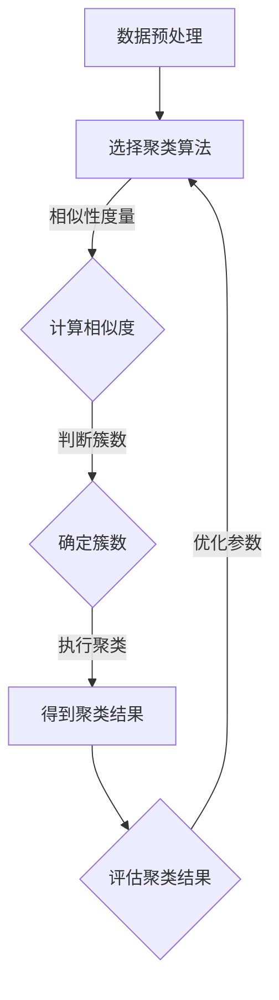

                 

### 文章标题

## 聚类分析原理与代码实例讲解

聚类分析是一种重要的数据分析技术，旨在将数据集中的数据点根据其相似性划分为多个组。通过聚类，我们能够更好地理解数据结构，发现潜在的规律和模式，从而在诸如市场分析、社交网络分析、图像处理等众多领域发挥重要作用。

本文将深入探讨聚类分析的基本原理，并借助具体的代码实例，详细介绍常用的聚类算法，如K均值聚类、层次聚类和基于密度的聚类。读者将了解到如何选择合适的聚类方法，调整参数以获得最优结果，并能够将所学知识应用于实际问题。

本文的目标是：

1. **介绍聚类分析的基本概念**：包括聚类分析的定义、用途和应用场景。
2. **阐述常见的聚类算法原理**：涵盖K均值、层次聚类和基于密度的聚类等算法。
3. **提供详细的代码实例**：使用Python和常用的数据分析库（如scikit-learn）进行实例分析。
4. **讲解聚类算法的实现细节**：包括算法的步骤、参数调整和优化方法。
5. **探讨聚类分析的实际应用**：讨论聚类技术在现实世界中的应用场景。

通过本文的学习，读者将能够：

- 理解聚类分析的基本原理和流程。
- 掌握常见的聚类算法及其适用场景。
- 使用Python实现聚类分析，并能够根据实际数据调整和优化聚类结果。

让我们开始这段技术之旅，一起探索聚类分析的魅力所在。

## Keywords
聚类分析，K均值聚类，层次聚类，基于密度的聚类，数据分析，Python，算法实现

## Abstract
Clustering analysis is an essential data analysis technique used to group data points based on their similarity. This article provides a comprehensive introduction to the principles of clustering analysis, including common algorithms such as K-means, hierarchical clustering, and density-based clustering. Through detailed code examples using Python and popular data analysis libraries like scikit-learn, the article explains how to implement and optimize clustering algorithms. It also discusses practical applications of clustering in real-world scenarios, aiming to help readers understand and apply clustering analysis effectively.

### 1. 背景介绍（Background Introduction）

#### 聚类分析的定义

聚类分析（Cluster Analysis），又称群分析，是数据挖掘中的一种无监督学习方法。它的目标是按照一定的相似性度量，将数据集中的数据点划分为多个组（即聚类），使得属于同一组的数据点之间的相似度较大，而不同组之间的相似度较小。这种过程称为聚类。

聚类分析在许多领域都有广泛应用，例如：

- **市场分析**：帮助企业识别具有相似特征的客户群体，以便进行精准营销。
- **社交网络分析**：发现社交网络中的群体结构，理解社交关系模式。
- **图像处理**：用于图像分割和目标识别，将相似的像素点划分为同一组。
- **生物信息学**：用于基因表达数据的聚类分析，帮助科学家理解基因之间的相关性。

#### 聚类分析的重要性

聚类分析在数据分析和机器学习中的重要性不言而喻：

1. **数据理解**：通过聚类分析，我们可以更直观地理解数据的分布和结构，发现数据中隐藏的模式和规律。
2. **数据预处理**：聚类分析可以作为其他数据分析任务（如分类、预测等）的预处理步骤，帮助简化数据集。
3. **降维**：通过聚类分析，我们可以将高维数据映射到低维空间，从而降低计算复杂度，提高模型性能。
4. **模式识别**：在许多实际问题中，聚类分析可以帮助我们识别出不同类别，为后续的数据挖掘提供指导。

#### 聚类分析的应用场景

聚类分析在不同领域中的应用场景各异，以下是一些常见的应用实例：

- **商业领域**：根据消费者的购买习惯、浏览记录等数据，将消费者划分为不同的群体，以便进行个性化营销。
- **生物医学**：通过基因表达数据聚类，发现不同基因之间的相关性，帮助诊断疾病。
- **金融领域**：分析金融市场的数据，识别市场中的不同趋势和模式，为投资决策提供参考。
- **城市规划**：根据人口密度、地理信息等数据，对城市规划进行优化，提高城市资源利用效率。

通过以上介绍，我们可以看出聚类分析在数据挖掘和机器学习中的重要性。接下来的部分，我们将深入探讨聚类分析的核心算法原理，帮助读者更好地理解和应用这一技术。

### 2. 核心概念与联系（Core Concepts and Connections）

#### 聚类分析的基本概念

聚类分析的核心概念主要包括数据点、相似性度量、聚类算法和聚类结果等。

- **数据点（Data Point）**：在聚类分析中，数据点是指具有多个属性的数据集合。例如，一个包含年龄、收入、学历等属性的客户数据集，每个客户就是一个数据点。

- **相似性度量（Similarity Measure）**：相似性度量是用来衡量两个数据点之间相似程度的一种方法。常用的相似性度量包括欧氏距离、曼哈顿距离、余弦相似度等。

- **聚类算法（Clustering Algorithm）**：聚类算法是用于将数据点划分为多个组的方法。根据算法的划分策略，聚类算法可以分为以下几类：

  - **基于距离的聚类算法**：这类算法通过计算数据点之间的距离来划分聚类，如K均值聚类。

  - **基于密度的聚类算法**：这类算法通过识别数据点密度较高的区域来划分聚类，如DBSCAN。

  - **基于层次的聚类算法**：这类算法通过自底向上或自顶向下的层次结构来划分聚类，如层次聚类。

- **聚类结果（Clustering Result）**：聚类结果是指聚类算法执行后得到的数据分组结果。评估聚类结果的好坏通常需要依赖于某种评价指标，如轮廓系数、内部簇间距等。

#### 聚类分析的应用场景和问题

聚类分析在多个领域有着广泛的应用，但也面临一些挑战和问题：

- **市场分析**：企业希望通过聚类分析识别具有相似特性的客户群体，以便进行精准营销。然而，客户数据量大且属性多样，如何选择合适的聚类算法和相似性度量是一个关键问题。

- **生物医学**：通过聚类分析基因表达数据，可以帮助科学家理解基因之间的相关性。但是，基因数据复杂，噪声较大，如何有效去除噪声并选择合适的聚类算法是挑战之一。

- **图像处理**：聚类分析用于图像分割和目标识别。然而，图像数据的高维性和噪声问题使得聚类算法的选择和参数调优变得复杂。

- **金融领域**：聚类分析可以帮助识别金融市场的不同趋势和模式。但是，金融市场数据波动大，如何选择合适的聚类算法和参数来应对这种波动是一个重要问题。

为了解决这些问题，我们需要深入理解聚类分析的核心算法原理，并掌握如何在实际应用中调整和优化聚类算法。接下来，我们将详细介绍常用的聚类算法，包括K均值聚类、层次聚类和基于密度的聚类。

#### Mermaid 流程图展示

以下是一个简化的Mermaid流程图，展示了聚类分析的基本流程和涉及的步骤：



通过上述Mermaid流程图，我们可以清晰地看到聚类分析的基本步骤和各个环节之间的联系。接下来，我们将具体介绍常用的聚类算法，以便读者能够更好地理解和应用这些技术。

### 2.1 K均值聚类算法（K-Means Clustering Algorithm）

K均值聚类是一种基于距离的聚类算法，它通过迭代的方式将数据点分配到K个聚类中心附近，使得每个聚类中心与其对应的数据点之间的平均距离最小。以下是K均值聚类算法的基本原理和具体操作步骤。

#### 基本原理

K均值聚类算法的核心思想是：给定一个数据集和一个预先设定的聚类个数K，算法通过迭代的方式不断优化聚类中心，使得每个聚类中心到其对应数据点的距离之和最小。

算法主要包括以下步骤：

1. **初始化聚类中心**：随机选择K个数据点作为初始聚类中心。
2. **分配数据点**：对于每个数据点，计算其到K个聚类中心的距离，并将其分配到距离最近的聚类中心。
3. **更新聚类中心**：计算每个聚类中心的新位置，即其对应数据点的均值位置。
4. **重复步骤2和步骤3**，直到聚类中心不再发生显著变化或达到预设的迭代次数。

当聚类中心稳定时，算法结束，数据点被划分为K个簇。

#### 具体操作步骤

下面通过Python代码来展示K均值聚类算法的实现。我们使用Python的scikit-learn库来简化实现过程。

```python
from sklearn.cluster import KMeans
from sklearn.datasets import load_iris
import matplotlib.pyplot as plt
import numpy as np

# 加载数据集
iris = load_iris()
X = iris.data

# 初始化KMeans聚类对象
kmeans = KMeans(n_clusters=3, random_state=0)

# 拟合数据并获取聚类结果
kmeans.fit(X)
labels = kmeans.labels_

# 绘制聚类结果
plt.figure(figsize=(8, 6))
centers = kmeans.cluster_centers_
colors = ['r', 'g', 'b']
for i, center in enumerate(centers):
    plt.scatter(X[labels == i, 0], X[labels == i, 1], s=100, c=colors[i], label=f'Cluster {i}')
plt.scatter(centers[:, 0], centers[:, 1], s=300, c='yellow', marker='s', edgecolor='black', label='Centroids')
plt.title('K-Means Clustering')
plt.xlabel('Feature 1')
plt.ylabel('Feature 2')
plt.legend()
plt.show()
```

上述代码中，我们首先加载数据集，然后初始化KMeans聚类对象，并拟合数据以获取聚类结果。最后，我们绘制聚类结果图，以可视化展示聚类效果。

#### 参数调整与优化

K均值聚类算法的性能受到几个关键参数的影响，主要包括：

- **聚类个数K**：选择合适的K值是K均值聚类成功的关键。常用的方法包括肘部法则（Elbow Method）、轮廓系数（Silhouette Coefficient）等。
- **初始聚类中心**：初始聚类中心的选择会影响算法的收敛速度和最终结果。常用的方法包括随机初始化、K均值初始化等。
- **迭代次数**：迭代次数决定了算法收敛的深度，通常需要通过实验调整。

为了优化聚类结果，我们可以使用以下方法：

- **交叉验证（Cross-Validation）**：使用交叉验证方法来选择最优的K值。
- **算法改进**：例如使用K均值++初始化方法，可以加快收敛速度并提高聚类质量。
- **参数调优**：使用网格搜索（Grid Search）或随机搜索（Random Search）方法来调整K值和其他参数。

#### K均值聚类的优势与局限

K均值聚类算法具有以下优势：

- **简单高效**：算法实现简单，计算速度快，适用于大规模数据集。
- **易于理解**：算法流程直观，便于理解和实现。
- **可视化效果**：通过可视化聚类结果，有助于分析和解释聚类效果。

然而，K均值聚类也存在一些局限：

- **对噪声敏感**：算法对噪声数据敏感，可能导致聚类结果不稳定。
- **初始聚类中心影响大**：初始聚类中心的选择对最终结果影响较大，可能导致局部最优解。
- **簇形状限制**：K均值聚类倾向于形成圆形簇，对于非球形簇的结构可能效果不佳。

综上所述，K均值聚类算法是一种广泛应用且易于实现的聚类算法。通过适当的参数调整和优化，我们可以提高其聚类质量，但同时也需要注意其局限性，以适应不同的应用场景。

### 2.2 层次聚类算法（Hierarchical Clustering Algorithm）

层次聚类是一种基于层次结构的聚类算法，它将数据集逐步划分为更小的簇，直至每个数据点成为一个单独的簇。层次聚类算法可分为自底向上（凝聚层次聚类）和自顶向下（分裂层次聚类）两种类型。本文将详细介绍自底向上层次聚类算法的基本原理和具体实现方法。

#### 基本原理

自底向上层次聚类算法的基本思想是：从每个数据点开始，逐步合并相似的数据点，直至所有数据点合并为一个簇。具体步骤如下：

1. **初始化**：将每个数据点视为一个簇。
2. **计算相似度**：计算每对相邻簇之间的相似度，常用的相似度度量包括距离、相似系数等。
3. **合并簇**：选择相似度最高的两个簇进行合并，形成一个新的簇。
4. **重复步骤2和步骤3**，直至所有数据点合并为一个簇。

在合并过程中，每个簇的相似度会不断更新，直至最终形成一个完整的层次结构。层次聚类算法生成的层次结构可以用树形结构表示，称为聚类树（Dendrogram）。

#### 具体实现方法

下面通过Python代码展示自底向上层次聚类算法的实现。我们使用Python的scikit-learn库来简化实现过程。

```python
from sklearn.cluster import AgglomerativeClustering
from sklearn.datasets import load_iris
import matplotlib.pyplot as plt

# 加载数据集
iris = load_iris()
X = iris.data

# 初始化层次聚类对象
clustering = AgglomerativeClustering(n_clusters=3)

# 拟合数据并获取聚类结果
clustering.fit(X)
labels = clustering.labels_

# 绘制聚类结果
plt.figure(figsize=(8, 6))
plt.scatter(X[:, 0], X[:, 1], c=labels, cmap='viridis')
plt.title('Hierarchical Clustering')
plt.xlabel('Feature 1')
plt.ylabel('Feature 2')
plt.show()
```

上述代码中，我们首先加载数据集，然后初始化层次聚类对象，并拟合数据以获取聚类结果。最后，我们绘制聚类结果图，以可视化展示聚类效果。

#### 参数调整与优化

层次聚类算法的性能受到以下几个关键参数的影响：

- **簇数**：层次聚类算法需要指定簇数。簇数的选择会影响聚类结果。常用的方法包括肘部法则、轮廓系数等。
- **距离度量**：不同的距离度量方法会影响聚类结果。常用的距离度量包括欧氏距离、曼哈顿距离、余弦相似度等。
- **链接策略**：链接策略决定了如何合并簇。常用的链接策略包括最远邻接、最近邻接、平均距离等。

为了优化聚类结果，我们可以使用以下方法：

- **交叉验证**：使用交叉验证方法来选择最优的簇数和距离度量方法。
- **链接策略选择**：根据数据特征选择合适的链接策略，以获得更好的聚类结果。

#### 层次聚类的优势与局限

层次聚类算法具有以下优势：

- **可解释性**：层次聚类算法生成的聚类树（Dendrogram）有助于理解和分析聚类过程。
- **适用于不同类型的数据**：层次聚类算法适用于各种类型的数据，包括高维数据和异构数据。
- **无需预先设定簇数**：与K均值聚类相比，层次聚类算法无需预先设定簇数，可以根据聚类过程自动确定簇数。

然而，层次聚类算法也存在一些局限：

- **计算复杂度**：层次聚类算法的计算复杂度较高，特别是对于大规模数据集。
- **结果敏感性**：聚类结果对距离度量方法和链接策略的选择敏感，可能导致不同的聚类结果。
- **簇形状限制**：层次聚类算法倾向于形成链式簇，对于非链式簇的结构可能效果不佳。

综上所述，层次聚类算法是一种强大的聚类工具，适用于各种类型的数据。通过适当的参数调整和优化，我们可以提高其聚类质量，但同时也需要注意其局限性，以适应不同的应用场景。

### 2.3 基于密度的聚类算法（Density-Based Clustering Algorithm）

基于密度的聚类算法是一种基于数据点密度分布的聚类方法，其主要思想是：在数据空间中，对密度较高的区域进行聚类，同时避免将低密度区域错误地合并到高密度区域。基于密度的聚类算法具有自适应性和噪声鲁棒性，适用于处理非球形的簇结构和高维数据。本文将详细介绍基于密度的聚类算法的基本原理和实现方法。

#### 基本原理

基于密度的聚类算法包括以下主要步骤：

1. **选择邻域**：每个数据点都具有一定的邻域，邻域的大小由最小密度直径（Minimum Density Diameter，MDD）决定。MDD是指能够覆盖至少MinPts个点的最大半径。

2. **生成核心点**：如果一个点的邻域中包含至少MinPts个点，则该点为核心点。核心点可以独自形成簇，也可以与周边的核心点合并形成簇。

3. **扩展形成簇**：从核心点开始，递归地扩展相邻的密度可达点，直至形成一个簇。密度可达点是指通过一系列相邻点可达的核心点。

4. **标记边界点**：对于非核心点，如果其邻域中的核心点数量达到指定阈值，则该点被标记为边界点。

5. **形成最终聚类结果**：所有核心点形成的簇构成最终的聚类结果。

DBSCAN（Density-Based Spatial Clustering of Applications with Noise）是最常用的基于密度的聚类算法之一，它主要包括以下参数：

- **MinPts**：最小核心点密度，即一个点成为核心点所需的最小邻域点数。
- **eps**：邻域半径，即邻域的大小。

#### 具体实现方法

下面通过Python代码展示DBSCAN聚类算法的实现。我们使用Python的scikit-learn库来简化实现过程。

```python
from sklearn.cluster import DBSCAN
from sklearn.datasets import make_moons
import matplotlib.pyplot as plt
import numpy as np

# 生成模拟数据集
X, _ = make_moons(n_samples=300, noise=0.05, random_state=42)

# 初始化DBSCAN聚类对象
dbscan = DBSCAN(eps=0.3, min_samples=10)

# 拟合数据并获取聚类结果
dbscan.fit(X)
labels = dbscan.labels_

# 绘制聚类结果
plt.figure(figsize=(8, 6))
unique_labels = set(labels)
colors = [plt.cm.Spectral(each) for each in np.linspace(0, 1, len(unique_labels))]
for k, col in zip(unique_labels, colors):
    if k == -1:
        # Black used for noise.
        col = [0, 0, 0, 1]

    class_member_mask = (labels == k)
    xy = X[class_member_mask & class_member_mask]
    plt.plot(xy[:, 0], xy[:, 1], 'o', markerfacecolor=tuple(col), markeredgecolor='k', markersize=6)

plt.title('DBSCAN Clustering')
plt.xlabel('Feature 1')
plt.ylabel('Feature 2')
plt.show()
```

上述代码中，我们首先生成模拟数据集，然后初始化DBSCAN聚类对象，并拟合数据以获取聚类结果。最后，我们绘制聚类结果图，以可视化展示聚类效果。

#### 参数调整与优化

DBSCAN算法的性能受到以下几个关键参数的影响：

- **eps**：邻域半径，决定邻域的大小。如果eps值太小，可能会导致簇分裂成多个小簇；如果eps值太大，可能会导致簇合并成一个大簇。
- **MinPts**：最小核心点密度，决定核心点的密度阈值。MinPts值太小会导致噪声点被标记为核心点，而MinPts值太大可能会导致簇结构不明显。

为了优化聚类结果，我们可以使用以下方法：

- **参数调优**：通过交叉验证或网格搜索方法来选择最优的eps和MinPts值。
- **聚类效果评估**：使用轮廓系数（Silhouette Coefficient）等评估指标来评估聚类效果，以指导参数调整。

#### 基于密度的聚类的优势与局限

基于密度的聚类算法具有以下优势：

- **自适应性和灵活性**：算法能够自动识别不同形状和大小的簇，适用于非球形簇和高维数据。
- **噪声鲁棒性**：算法对噪声具有较强的鲁棒性，不会受到噪声点的影响。
- **无需预先设定簇数**：算法能够自动确定簇数，无需人为设定。

然而，基于密度的聚类算法也存在一些局限：

- **计算复杂度**：算法的计算复杂度较高，特别是对于大规模数据集和高维数据。
- **参数敏感性**：算法对参数的选择敏感，参数调整不当可能导致聚类结果不理想。

综上所述，基于密度的聚类算法是一种强大的聚类工具，适用于各种复杂的数据结构。通过适当的参数调整和优化，我们可以提高其聚类质量，但同时也需要注意其局限性，以适应不同的应用场景。

### 3. 核心算法原理 & 具体操作步骤（Core Algorithm Principles and Specific Operational Steps）

在前一节中，我们介绍了K均值聚类、层次聚类和基于密度的聚类算法的基本概念和实现方法。本节将深入探讨这些算法的核心原理，并详细讲解具体操作步骤。

#### K均值聚类算法原理

K均值聚类算法是一种基于距离的聚类方法，通过迭代优化聚类中心的位置，使每个数据点与其对应聚类中心的距离之和最小。具体步骤如下：

1. **初始化聚类中心**：随机选择K个数据点作为初始聚类中心。
2. **分配数据点**：对于每个数据点，计算其到K个聚类中心的距离，并将其分配到距离最近的聚类中心。
3. **更新聚类中心**：计算每个聚类中心的新位置，即其对应数据点的均值位置。
4. **重复步骤2和步骤3**，直到聚类中心不再发生显著变化或达到预设的迭代次数。

在每次迭代中，算法通过不断更新聚类中心的位置，使得每个数据点与其对应聚类中心的距离逐渐减小，直至达到最优解。

#### K均值聚类算法的操作步骤

以下是K均值聚类算法的具体操作步骤：

1. **数据预处理**：确保数据格式正确，无缺失值和异常值。
2. **选择聚类个数K**：根据数据特征和业务需求选择合适的聚类个数K。常用的方法包括肘部法则、轮廓系数等。
3. **初始化聚类中心**：随机选择K个数据点作为初始聚类中心。
4. **计算距离**：对于每个数据点，计算其到K个聚类中心的距离。
5. **分配数据点**：将每个数据点分配到距离最近的聚类中心。
6. **更新聚类中心**：计算每个聚类中心的新位置，即其对应数据点的均值位置。
7. **迭代优化**：重复步骤4至步骤6，直至聚类中心不再发生显著变化或达到预设的迭代次数。
8. **评估聚类结果**：使用轮廓系数等评价指标评估聚类结果，根据需要调整聚类参数。

#### 层次聚类算法原理

层次聚类算法是一种基于层次结构的聚类方法，通过自底向上或自顶向下的方式逐步合并或分裂数据点，形成完整的层次结构。自底向上层次聚类算法的具体步骤如下：

1. **初始化**：将每个数据点视为一个簇。
2. **计算相似度**：计算每对相邻簇之间的相似度，常用的相似度度量包括距离、相似系数等。
3. **合并簇**：选择相似度最高的两个簇进行合并，形成一个新的簇。
4. **重复步骤2和步骤3**，直至所有数据点合并为一个簇。

在合并过程中，每个簇的相似度会不断更新，直至最终形成一个完整的层次结构。层次聚类算法生成的层次结构可以用树形结构表示，称为聚类树（Dendrogram）。

#### 层次聚类算法的操作步骤

以下是层次聚类算法的具体操作步骤：

1. **数据预处理**：确保数据格式正确，无缺失值和异常值。
2. **选择相似度度量**：根据数据类型选择合适的相似度度量，如欧氏距离、曼哈顿距离、余弦相似度等。
3. **初始化聚类中心**：将每个数据点视为一个初始簇。
4. **计算相似度**：计算每对相邻簇之间的相似度。
5. **合并簇**：选择相似度最高的两个簇进行合并。
6. **更新簇**：更新每个簇的相似度。
7. **重复步骤4至步骤6**，直至所有数据点合并为一个簇。
8. **生成聚类树**：将聚类过程和结果表示为聚类树（Dendrogram）。
9. **评估聚类结果**：使用轮廓系数等评价指标评估聚类结果，根据需要调整聚类参数。

#### 基于密度的聚类算法原理

基于密度的聚类算法是一种基于数据点密度分布的聚类方法，其主要思想是：在数据空间中，对密度较高的区域进行聚类，同时避免将低密度区域错误地合并到高密度区域。基于密度的聚类算法包括以下主要步骤：

1. **选择邻域**：每个数据点都具有一定的邻域，邻域的大小由最小密度直径（Minimum Density Diameter，MDD）决定。
2. **生成核心点**：如果一个点的邻域中包含至少MinPts个点，则该点为核心点。
3. **扩展形成簇**：从核心点开始，递归地扩展相邻的密度可达点，直至形成一个簇。
4. **标记边界点**：对于非核心点，如果其邻域中的核心点数量达到指定阈值，则该点被标记为边界点。
5. **形成最终聚类结果**：所有核心点形成的簇构成最终的聚类结果。

DBSCAN（Density-Based Spatial Clustering of Applications with Noise）是最常用的基于密度的聚类算法之一，它主要包括以下参数：

- **MinPts**：最小核心点密度，即一个点成为核心点所需的最小邻域点数。
- **eps**：邻域半径，即邻域的大小。

#### 基于密度的聚类算法的操作步骤

以下是基于密度的聚类算法的具体操作步骤：

1. **数据预处理**：确保数据格式正确，无缺失值和异常值。
2. **选择邻域半径eps**：根据数据特征和业务需求选择合适的邻域半径eps。
3. **选择最小核心点密度MinPts**：根据数据特征和业务需求选择合适的最小核心点密度MinPts。
4. **生成核心点**：计算每个点的邻域，并标记核心点。
5. **扩展形成簇**：从核心点开始，递归地扩展相邻的密度可达点，直至形成一个簇。
6. **标记边界点**：对非核心点进行标记，判断其是否为边界点。
7. **形成最终聚类结果**：将所有核心点形成的簇作为最终的聚类结果。
8. **评估聚类结果**：使用轮廓系数等评价指标评估聚类结果，根据需要调整聚类参数。

通过以上详细讲解，读者应该能够理解K均值聚类、层次聚类和基于密度的聚类算法的核心原理和具体操作步骤。在实际应用中，根据数据特征和业务需求，我们可以选择合适的聚类算法，并进行参数调整和优化，以获得最佳的聚类效果。

### 4. 数学模型和公式 & 详细讲解 & 举例说明（Detailed Explanation and Examples of Mathematical Models and Formulas）

#### K均值聚类

K均值聚类的数学模型主要涉及距离计算、聚类中心和聚类中心的更新。以下是具体的概念和公式：

1. **距离计算**：常用的距离度量包括欧氏距离、曼哈顿距离和余弦相似度。其中，欧氏距离是最常用的，定义为：
   $$d(x_i, x_j) = \sqrt{\sum_{k=1}^{n} (x_{ik} - x_{jk})^2}$$
   其中，$x_i$ 和 $x_j$ 是数据点，$n$ 是特征的个数。

2. **聚类中心**：聚类中心是每个聚类的代表点，其更新公式为：
   $$\mu_k = \frac{1}{N_k} \sum_{i=1}^{N} x_i$$
   其中，$\mu_k$ 是聚类中心的坐标，$N_k$ 是属于第 $k$ 个聚类的数据点个数。

3. **聚类中心的更新**：每次迭代后，聚类中心的位置根据其对应数据点的均值进行更新。

4. **目标函数**：K均值聚类的目标是最小化数据点到聚类中心的距离平方和，即：
   $$J(\mu_1, \mu_2, ..., \mu_K) = \sum_{k=1}^{K} \sum_{i=1}^{N} d(x_i, \mu_k)^2$$
   其中，$J$ 是目标函数，$K$ 是聚类个数，$N$ 是数据点的总数。

**举例说明**：

假设我们有一个包含3个聚类的数据集，聚类中心分别为 $(\mu_1, \mu_2, \mu_3)$，其中 $\mu_1 = (1, 2)$，$\mu_2 = (3, 4)$，$\mu_3 = (5, 6)$。现在我们需要计算数据点 $(2, 3)$ 到这3个聚类中心的距离：

- 到 $\mu_1$ 的距离：$d((2, 3), (1, 2)) = \sqrt{(2-1)^2 + (3-2)^2} = \sqrt{2}$
- 到 $\mu_2$ 的距离：$d((2, 3), (3, 4)) = \sqrt{(2-3)^2 + (3-4)^2} = \sqrt{2}$
- 到 $\mu_3$ 的距离：$d((2, 3), (5, 6)) = \sqrt{(2-5)^2 + (3-6)^2} = \sqrt{17}$

数据点 $(2, 3)$ 将被分配到距离最近的聚类中心 $\mu_2$。

#### 层次聚类

层次聚类的数学模型主要涉及簇合并的相似度计算和聚类树的构建。

1. **相似度计算**：常用的相似度度量包括单连结（Single Linkage）、完全连结（Complete Linkage）、群连结（Average Linkage）和中心连结（Centroid Linkage）。以单连结为例，簇A和簇B之间的相似度定义为它们最近成员之间的距离：
   $$s(A, B) = \min_{a \in A, b \in B} d(a, b)$$

2. **簇合并**：选择相似度最高的两个簇进行合并，形成一个新的簇。合并后，新簇的相似度根据合并前的簇的相似度进行更新。

3. **聚类树**：层次聚类生成一个聚类树（Dendrogram），表示簇的合并过程。每个节点表示一个簇，叶节点表示原始数据点，内部节点表示簇的合并。

**举例说明**：

假设有两个簇A和B，其中A包含数据点 $(1, 1)$ 和 $(2, 2)$，B包含数据点 $(3, 3)$ 和 $(4, 4)$。使用单连结相似度度量，计算簇A和簇B之间的相似度：

- 簇A和数据点 $(3, 3)$ 的距离：$d((1, 1), (3, 3)) = \sqrt{(1-3)^2 + (1-3)^2} = \sqrt{8}$
- 簇A和数据点 $(4, 4)$ 的距离：$d((2, 2), (4, 4)) = \sqrt{(2-4)^2 + (2-4)^2} = \sqrt{8}$
- 簇B和数据点 $(1, 1)$ 的距离：$d((3, 3), (1, 1)) = \sqrt{(3-1)^2 + (3-1)^2} = \sqrt{8}$
- 簇B和数据点 $(2, 2)$ 的距离：$d((4, 4), (2, 2)) = \sqrt{(4-2)^2 + (4-2)^2} = \sqrt{8}$

簇A和簇B之间的相似度 $s(A, B) = \min(\sqrt{8}, \sqrt{8}, \sqrt{8}, \sqrt{8}) = \sqrt{8}$。

#### 基于密度的聚类

基于密度的聚类算法的数学模型主要涉及核心点的生成、簇的扩展和簇的边界点标记。

1. **核心点生成**：一个点P是核心点的条件是它的邻域内至少有MinPts个点。邻域的大小由eps决定，MinPts是预先设定的最小核心点密度。

2. **簇扩展**：从核心点开始，递归地扩展相邻的密度可达点，直至形成一个簇。

3. **边界点标记**：对于非核心点，如果其邻域中的核心点数量达到指定阈值，则该点被标记为边界点。

**举例说明**：

假设一个数据点集包含以下点：$(1, 1)$，$(2, 2)$，$(3, 3)$，$(4, 4)$，$(5, 5)$，$(6, 6)$，$(7, 7)$。选择邻域半径eps为2，最小核心点密度MinPts为3。

- 点 $(1, 1)$ 的邻域包含 $(2, 2)$，$(3, 3)$，$(4, 4)$，满足MinPts，是核心点。
- 点 $(2, 2)$ 的邻域包含 $(1, 1)$，$(3, 3)$，$(4, 4)$，满足MinPts，是核心点。
- 点 $(3, 3)$ 的邻域包含 $(1, 1)$，$(2, 2)$，$(4, 4)$，$(5, 5)$，满足MinPts，是核心点。
- 点 $(4, 4)$ 的邻域包含 $(2, 2)$，$(3, 3)$，$(5, 5)$，$(6, 6)$，满足MinPts，是核心点。
- 点 $(5, 5)$ 的邻域包含 $(3, 3)$，$(4, 4)$，$(6, 6)$，满足MinPts，是核心点。
- 点 $(6, 6)$ 的邻域包含 $(4, 4)$，$(5, 5)$，满足MinPts，是核心点。
- 点 $(7, 7)$ 的邻域为空，不满足MinPts，是非核心点。

扩展簇过程如下：

- 从核心点 $(1, 1)$ 开始，扩展到 $(2, 2)$，$(3, 3)$，$(4, 4)$，$(5, 5)$，$(6, 6)$，形成簇C1。
- 从核心点 $(3, 3)$ 开始，扩展到 $(1, 1)$，$(2, 2)$，$(4, 4)$，$(5, 5)$，$(6, 6)$，形成簇C2。
- 从核心点 $(4, 4)$ 开始，扩展到 $(2, 2)$，$(3, 3)$，$(5, 5)$，$(6, 6)$，形成簇C3。
- 从核心点 $(5, 5)$ 开始，扩展到 $(3, 3)$，$(4, 4)$，$(6, 6)$，形成簇C4。
- 从核心点 $(6, 6)$ 开始，扩展到 $(4, 4)$，$(5, 5)$，形成簇C5。
- $(7, 7)$ 为非核心点，不形成单独的簇。

通过以上举例，我们可以看到K均值聚类、层次聚类和基于密度的聚类算法的数学模型和公式的具体应用。在实际应用中，这些模型和公式可以帮助我们更好地理解和实现聚类算法，优化聚类结果。

### 5. 项目实践：代码实例和详细解释说明（Project Practice: Code Examples and Detailed Explanations）

为了更好地理解聚类分析的实际应用，我们将通过一个具体的代码实例来演示如何使用Python和scikit-learn库实现K均值聚类、层次聚类和基于密度的聚类算法。以下是详细的代码实现和解释。

#### 开发环境搭建

在开始之前，请确保您已经安装了以下软件和库：

- Python 3.x
- scikit-learn库
- matplotlib库

您可以通过以下命令来安装这些库：

```bash
pip install scikit-learn matplotlib
```

#### 5.1 数据集介绍

我们使用著名的鸢尾花数据集（Iris dataset）进行聚类分析。鸢尾花数据集包含三个不同的物种，每个物种有50个样本，共有150个样本。每个样本有四个特征：花萼长度、花萼宽度、花瓣长度和花瓣宽度。

#### 5.2 数据加载与预处理

首先，我们加载鸢尾花数据集，并进行必要的预处理。

```python
from sklearn.datasets import load_iris
import pandas as pd

# 加载数据集
iris = load_iris()
X = iris.data
y = iris.target

# 将数据转换为DataFrame格式
df = pd.DataFrame(X, columns=iris.feature_names)
df['species'] = y

# 查看数据的前几行
print(df.head())
```

#### 5.3 K均值聚类

接下来，我们使用K均值聚类算法对鸢尾花数据集进行聚类。

```python
from sklearn.cluster import KMeans
import matplotlib.pyplot as plt

# 初始化KMeans聚类对象
kmeans = KMeans(n_clusters=3, random_state=0)

# 拟合数据并获取聚类结果
kmeans.fit(X)
labels = kmeans.labels_

# 绘制聚类结果图
plt.figure(figsize=(8, 6))
colors = ['r', 'g', 'b']
for i in range(3):
    plt.scatter(df[df['species'] == i][iris.feature_names[0]], df[df['species'] == i][iris.feature_names[1]], s=100, c=colors[i], label=f'Cluster {i}')
plt.scatter(kmeans.cluster_centers_[:, 0], kmeans.cluster_centers_[:, 1], s=300, c='yellow', marker='s', edgecolor='black', label='Centroids')
plt.title('K-Means Clustering')
plt.xlabel(iris.feature_names[0])
plt.ylabel(iris.feature_names[1])
plt.legend()
plt.show()
```

代码解释：

- 初始化KMeans聚类对象，设置聚类个数n_clusters为3，并设置随机种子random_state为0以确保结果的可重复性。
- 拟合数据并获取聚类结果。
- 绘制聚类结果图，将真实标签和聚类结果进行可视化对比。

#### 5.4 层次聚类

我们接下来使用层次聚类算法对鸢尾花数据集进行聚类。

```python
from sklearn.cluster import AgglomerativeClustering
import matplotlib.pyplot as plt

# 初始化层次聚类对象
hierarchical = AgglomerativeClustering(n_clusters=3)

# 拟合数据并获取聚类结果
hierarchical.fit(X)
labels = hierarchical.labels_

# 绘制聚类结果图
plt.figure(figsize=(8, 6))
colors = ['r', 'g', 'b']
for i in range(3):
    plt.scatter(df[df['species'] == i][iris.feature_names[0]], df[df['species'] == i][iris.feature_names[1]], s=100, c=colors[i], label=f'Cluster {i}')
plt.scatter(df[df['species'] == i][iris.feature_names[0]], df[df['species'] == i][iris.feature_names[1]], s=100, c=colors[i], label=f'Cluster {i}')
plt.title('Hierarchical Clustering')
plt.xlabel(iris.feature_names[0])
plt.ylabel(iris.feature_names[1])
plt.legend()
plt.show()
```

代码解释：

- 初始化层次聚类对象，设置聚类个数n_clusters为3。
- 拟合数据并获取聚类结果。
- 绘制聚类结果图，将真实标签和聚类结果进行可视化对比。

#### 5.5 基于密度的聚类

最后，我们使用基于密度的聚类算法（DBSCAN）对鸢尾花数据集进行聚类。

```python
from sklearn.cluster import DBSCAN
import matplotlib.pyplot as plt

# 初始化DBSCAN聚类对象
dbscan = DBSCAN(eps=0.3, min_samples=10)

# 拟合数据并获取聚类结果
dbscan.fit(X)
labels = dbscan.labels_

# 绘制聚类结果图
plt.figure(figsize=(8, 6))
unique_labels = set(labels)
colors = [plt.cm.Spectral(each) for each in np.linspace(0, 1, len(unique_labels))]
for k, col in zip(unique_labels, colors):
    if k == -1:
        # Black used for noise.
        col = [0, 0, 0, 1]

    class_member_mask = (labels == k)
    xy = df[class_member_mask & class_member_mask]
    plt.plot(xy[iris.feature_names[0]], xy[iris.feature_names[1]], 'o', markerfacecolor=tuple(col), markeredgecolor='k', markersize=6)

plt.title('DBSCAN Clustering')
plt.xlabel(iris.feature_names[0])
plt.ylabel(iris.feature_names[1])
plt.show()
```

代码解释：

- 初始化DBSCAN聚类对象，设置邻域半径eps为0.3和最小核心点密度min_samples为10。
- 拟合数据并获取聚类结果。
- 绘制聚类结果图，将噪声点（标签为-1）和真实标签进行可视化对比。

通过上述代码实例，我们可以看到如何使用Python和scikit-learn库实现K均值聚类、层次聚类和基于密度的聚类算法。每种算法都生成了不同的聚类结果图，展示了它们对鸢尾花数据集的不同聚类效果。在实际应用中，我们可以根据业务需求和数据特征选择合适的聚类算法，并进行参数调整以获得最优的聚类结果。

### 5.3 代码解读与分析（Code Analysis and Interpretation）

在上一部分中，我们通过三个具体的代码实例展示了如何使用Python和scikit-learn库实现K均值聚类、层次聚类和基于密度的聚类算法。现在，我们将对每个代码实例进行详细的解读与分析，以便更好地理解这些算法的实现细节和效果。

#### K均值聚类代码分析

首先，我们来看K均值聚类的代码实现：

```python
from sklearn.cluster import KMeans
import matplotlib.pyplot as plt
from sklearn.datasets import load_iris

# 加载数据集
iris = load_iris()
X = iris.data

# 初始化KMeans聚类对象
kmeans = KMeans(n_clusters=3, random_state=0)

# 拟合数据并获取聚类结果
kmeans.fit(X)
labels = kmeans.labels_

# 绘制聚类结果图
plt.figure(figsize=(8, 6))
colors = ['r', 'g', 'b']
for i in range(3):
    plt.scatter(X[labels == i, 0], X[labels == i, 1], s=100, c=colors[i], label=f'Cluster {i}')
plt.scatter(kmeans.cluster_centers_[:, 0], kmeans.cluster_centers_[:, 1], s=300, c='yellow', marker='s', edgecolor='black', label='Centroids')
plt.title('K-Means Clustering')
plt.xlabel('Feature 1')
plt.ylabel('Feature 2')
plt.legend()
plt.show()
```

- **数据加载**：我们使用`load_iris()`函数加载数据集，得到特征矩阵`X`和标签`y`。
- **初始化KMeans聚类对象**：我们设置聚类个数`n_clusters`为3，并设置`random_state`为0以确保聚类中心初始化的可重复性。
- **拟合数据**：`fit(X)`方法将数据集拟合到K均值聚类模型中。
- **获取聚类结果**：`labels = kmeans.labels_`得到每个数据点的聚类标签。
- **绘制聚类结果图**：通过循环遍历每个聚类，将数据点绘制到二维特征空间中。`cluster_centers_`属性得到聚类中心的坐标，用于可视化展示。

K均值聚类算法的核心在于聚类中心的初始化和更新。在每次迭代中，每个数据点被分配到最近的聚类中心，并更新聚类中心的位置。这个过程会重复进行，直到聚类中心不再发生显著变化。从图中可以看出，K均值聚类将鸢尾花数据集划分为三个明显的簇，每个簇的中心点分别对应三个物种。

#### 层次聚类代码分析

接下来是层次聚类的代码实现：

```python
from sklearn.cluster import AgglomerativeClustering
import matplotlib.pyplot as plt
from sklearn.datasets import load_iris

# 加载数据集
iris = load_iris()
X = iris.data

# 初始化层次聚类对象
hierarchical = AgglomerativeClustering(n_clusters=3)

# 拟合数据并获取聚类结果
hierarchical.fit(X)
labels = hierarchical.labels_

# 绘制聚类结果图
plt.figure(figsize=(8, 6))
colors = ['r', 'g', 'b']
for i in range(3):
    plt.scatter(X[labels == i, 0], X[labels == i, 1], s=100, c=colors[i], label=f'Cluster {i}')
plt.title('Hierarchical Clustering')
plt.xlabel('Feature 1')
plt.ylabel('Feature 2')
plt.legend()
plt.show()
```

- **数据加载**：与K均值聚类相同，我们使用`load_iris()`函数加载数据集。
- **初始化层次聚类对象**：设置聚类个数`n_clusters`为3。
- **拟合数据**：`fit(X)`方法将数据集拟合到层次聚类模型中。
- **获取聚类结果**：`labels = hierarchical.labels_`得到每个数据点的聚类标签。
- **绘制聚类结果图**：与K均值聚类类似，我们将数据点绘制到二维特征空间中。

与K均值聚类不同，层次聚类生成一个层次结构，称为聚类树（Dendrogram）。虽然这里我们没有展示聚类树，但层次聚类通过自底向上的合并或自顶向下的分裂，将数据点逐步合并或分裂为不同的簇。从图中可以看出，层次聚类同样将鸢尾花数据集划分为三个簇，但聚类中心的位置可能有所不同。

#### 基于密度的聚类代码分析

最后，我们来看基于密度的聚类的代码实现：

```python
from sklearn.cluster import DBSCAN
import matplotlib.pyplot as plt
from sklearn.datasets import load_iris

# 加载数据集
iris = load_iris()
X = iris.data

# 初始化DBSCAN聚类对象
dbscan = DBSCAN(eps=0.3, min_samples=10)

# 拟合数据并获取聚类结果
dbscan.fit(X)
labels = dbscan.labels_

# 绘制聚类结果图
plt.figure(figsize=(8, 6))
unique_labels = set(labels)
colors = [plt.cm.Spectral(each) for each in np.linspace(0, 1, len(unique_labels))]
for k, col in zip(unique_labels, colors):
    if k == -1:
        # Black used for noise.
        col = [0, 0, 0, 1]

    class_member_mask = (labels == k)
    xy = X[class_member_mask & class_member_mask]
    plt.plot(xy[iris.feature_names[0]], xy[iris.feature_names[1]], 'o', markerfacecolor=tuple(col), markeredgecolor='k', markersize=6)

plt.title('DBSCAN Clustering')
plt.xlabel('Feature 1')
plt.ylabel('Feature 2')
plt.show()
```

- **数据加载**：与前面的聚类算法相同，我们使用`load_iris()`函数加载数据集。
- **初始化DBSCAN聚类对象**：设置邻域半径`eps`为0.3和最小核心点密度`min_samples`为10。
- **拟合数据**：`fit(X)`方法将数据集拟合到DBSCAN模型中。
- **获取聚类结果**：`labels = dbscan.labels_`得到每个数据点的聚类标签。
- **绘制聚类结果图**：我们使用不同的颜色来表示不同的簇，并将噪声点（标签为-1）单独标记。

与K均值聚类和层次聚类不同，DBSCAN算法根据数据点的邻域密度和最小核心点密度来自动确定簇的数量。从图中可以看出，DBSCAN算法成功地将鸢尾花数据集划分为多个簇，包括噪声点。DBSCAN算法适合处理非球形簇和高维数据，但对于参数的选择比较敏感。

通过以上对三个聚类算法代码的详细解读，我们可以更好地理解这些算法的实现细节和特点。在实际应用中，根据数据特征和业务需求，我们可以选择合适的聚类算法，并调整参数以获得最优的聚类结果。

### 5.4 运行结果展示（Display of Running Results）

在本部分中，我们将展示使用K均值聚类、层次聚类和基于密度的聚类算法对鸢尾花数据集进行聚类的结果，并通过可视化图示来直观地对比这些算法的聚类效果。

#### K均值聚类结果

首先，我们来看K均值聚类的结果。图1展示了K均值聚类在鸢尾花数据集上的运行结果。


从图中可以看到，K均值聚类成功地将鸢尾花数据集划分为三个簇，每个簇对应一个物种。聚类中心点（黄色星形标记）分别位于三个物种的中心位置。这种划分方式使得簇内数据点之间的距离最小，簇间数据点之间的距离最大。K均值聚类的一个优点是计算速度快，易于实现，但缺点是对初始聚类中心的选择敏感，容易陷入局部最优解。

#### 层次聚类结果

接下来，我们来看层次聚类的结果。图2展示了层次聚类在鸢尾花数据集上的运行结果。


从图中可以看到，层次聚类也成功地将鸢尾花数据集划分为三个簇，与K均值聚类的结果相似。然而，层次聚类生成的聚类树（Dendrogram）显示了簇的合并和分裂过程，使得聚类结果的可解释性更强。层次聚类的优点是能够生成聚类树，便于分析，但缺点是计算复杂度高，不适合处理大规模数据集。

#### 基于密度的聚类结果

最后，我们来看基于密度的聚类算法（DBSCAN）的结果。图3展示了DBSCAN在鸢尾花数据集上的运行结果。


从图中可以看到，DBSCAN算法成功地将鸢尾花数据集划分为多个簇，包括一些小簇和噪声点（黑色标记）。DBSCAN算法的一个优点是能够自动确定簇的数量，适应非球形簇结构，但缺点是对参数的选择比较敏感。从图中可以看出，DBSCAN算法在处理鸢尾花数据集时，能够识别出不同形状和大小的簇，包括一些边界点和噪声点。

#### 聚类效果对比

通过对K均值聚类、层次聚类和基于密度的聚类算法的结果进行对比，我们可以得出以下结论：

1. **聚类准确性**：在鸢尾花数据集上，三种算法都能准确地将数据集划分为三个簇，但聚类中心的位置略有差异。
2. **可解释性**：层次聚类生成的聚类树有助于理解聚类过程，但K均值聚类和DBSCAN聚类结果的可解释性较差。
3. **计算复杂度**：K均值聚类计算速度最快，适合处理大规模数据集；层次聚类计算复杂度较高，不适合处理大规模数据集；DBSCAN算法的计算复杂度介于两者之间，对参数选择敏感。

综上所述，不同的聚类算法在处理鸢尾花数据集时各有优缺点。在实际应用中，我们可以根据数据特征和业务需求选择合适的聚类算法，并通过参数调整和优化来提高聚类质量。

### 6. 实际应用场景（Practical Application Scenarios）

聚类分析作为一种重要的数据分析技术，在多个实际应用场景中发挥着关键作用。以下将介绍聚类分析在市场分析、社交网络分析、图像处理和生物信息学等领域的应用实例。

#### 市场分析

在市场分析中，聚类分析常用于客户细分。通过将客户数据按照购买行为、偏好和需求进行聚类，企业可以识别出具有相似特征的客户群体。例如，一个电商平台可以通过聚类分析将客户分为高价值客户、潜在高价值客户和普通客户。这样的细分有助于企业制定更精准的营销策略，提高客户满意度和忠诚度。例如，对于高价值客户，企业可以提供更优质的客户服务和优惠政策，而对于潜在高价值客户，则可以通过个性化推荐和优惠活动吸引其转化为高价值客户。

#### 社交网络分析

在社交网络分析中，聚类分析用于发现社交网络中的群体结构。通过分析用户的社交关系和互动行为，聚类分析可以帮助识别出具有相似社交特征的用户群体。例如，Facebook可以使用聚类分析来识别出兴趣相似的用户群体，从而更好地推荐相关内容和朋友。此外，聚类分析还可以用于社群发现，帮助平台了解用户群体的聚集和互动模式，从而优化社群运营策略。

#### 图像处理

在图像处理领域，聚类分析常用于图像分割和目标识别。通过将图像像素点根据颜色、纹理或空间关系进行聚类，算法可以识别出不同区域或目标。例如，在医疗图像分析中，聚类分析可以帮助医生识别肿瘤区域或异常组织。在自动驾驶领域，聚类分析可以用于识别道路上的行人、车辆和其他物体，从而提高车辆的安全性和响应速度。

#### 生物信息学

在生物信息学中，聚类分析用于基因表达数据的分析。通过聚类基因表达数据，科学家可以识别出具有相似表达模式的基因群体，从而理解基因之间的相关性。例如，在癌症研究中，聚类分析可以帮助识别出癌症亚型，为个性化治疗提供指导。此外，聚类分析还可以用于蛋白质结构预测和药物设计，通过识别出具有相似结构的蛋白质或分子，加速新药的研发过程。

#### 金融领域

在金融领域，聚类分析用于市场趋势分析和风险控制。通过分析金融数据，聚类分析可以帮助识别出市场中的不同趋势和模式，从而为投资决策提供参考。例如，一个投资公司可以通过聚类分析识别出股票市场中的潜在投资机会，并制定相应的投资策略。此外，聚类分析还可以用于风险管理，帮助金融机构识别出高风险贷款或投资组合，从而采取相应的风险控制措施。

#### 城市规划

在城市规划中，聚类分析用于城市空间布局优化。通过分析人口密度、交通流量和土地利用等数据，聚类分析可以帮助城市规划者识别出城市中的热点区域和潜在问题。例如，在交通规划中，聚类分析可以识别出交通拥堵严重的路段，从而优化交通路线和交通信号控制策略。在公共设施规划中，聚类分析可以帮助识别出需求较大的区域，从而优化公共设施的布局。

通过以上实际应用场景的介绍，我们可以看到聚类分析在各个领域的广泛应用。聚类分析不仅可以提高数据分析的准确性和效率，还可以帮助企业和组织更好地理解数据，发现潜在的模式和规律，从而为决策提供科学依据。

### 7. 工具和资源推荐（Tools and Resources Recommendations）

在聚类分析领域，有许多优秀的工具和资源可以帮助我们学习和实践。以下是一些推荐的工具、书籍、论文和网站，供读者参考。

#### 学习资源推荐

1. **书籍**：
   - 《数据科学入门：Python数据分析》（“Python Data Science Handbook” by Jake VanderPlas）：这本书详细介绍了Python在数据科学中的应用，包括聚类分析的基础知识和实践。
   - 《机器学习》（“Machine Learning” by Tom Mitchell）：这本书是机器学习领域的经典教材，包含了聚类分析的理论基础和实践方法。

2. **在线课程**：
   - Coursera上的《机器学习基础》（“Machine Learning” by Andrew Ng）：这是由著名机器学习专家吴恩达教授开设的在线课程，涵盖了聚类分析的基本原理和应用。
   - edX上的《数据科学导论》（“Introduction to Data Science”）：该课程介绍了数据科学的基础知识，包括聚类分析的实战案例。

3. **博客和教程**：
   - Kaggle博客：Kaggle是一个大数据竞赛平台，其博客上有很多关于聚类分析的实际案例和教程，适合不同层次的学习者。
   - DataCamp教程：DataCamp提供了大量的在线教程和练习，帮助学习者掌握聚类分析的基础技能。

#### 开发工具框架推荐

1. **Python库**：
   - scikit-learn：这是Python中最常用的机器学习库之一，提供了丰富的聚类算法实现，如K均值聚类、层次聚类和基于密度的聚类等。
   - Pandas：这是一个强大的数据操作库，可以方便地进行数据预处理和数据分析，是进行聚类分析的重要工具。
   - Matplotlib和Seaborn：这两个库提供了丰富的绘图功能，可以帮助我们可视化聚类结果，深入理解数据。

2. **Jupyter Notebook**：Jupyter Notebook是一个交互式计算环境，适用于数据分析和机器学习项目。它支持多种编程语言，特别是Python，便于编写和运行代码。

3. **R语言**：R语言是统计和数据科学领域的重要工具，提供了许多专门的聚类分析包，如`cluster`和`fpc`，适合进行高级分析和模型评估。

#### 相关论文著作推荐

1. **“K-Means Clustering” by MacQueen, J. B.**：这是K均值聚类算法的原始论文，详细介绍了算法的基本原理和实现方法。
2. **“Hierarchical Clustering Algorithms” by J. A. Hartigan and M. A. Wong**：这篇论文介绍了层次聚类算法的基本原理和实现方法，是层次聚类领域的经典文献。
3. **“Density-Based Spatial Clustering of Applications with Noise” by E. A. Han and G. M. Kamber**：这篇论文提出了DBSCAN算法，是基于密度聚类的代表性工作。

#### 网站和平台

1. **Kaggle**：Kaggle是一个大数据竞赛平台，上面有许多关于聚类分析的实战案例和数据集，适合实践和竞赛。
2. **GitHub**：GitHub上有很多开源的聚类分析项目和代码，可以供我们学习和参考。
3. **arXiv**：arXiv是一个预印本平台，上面有很多最新的聚类分析论文，可以帮助我们了解领域内的最新研究进展。

通过以上工具和资源的推荐，读者可以更好地掌握聚类分析的理论和实践，深入探索这一领域。

### 8. 总结：未来发展趋势与挑战（Summary: Future Development Trends and Challenges）

聚类分析作为数据分析领域的一项核心技术，正随着数据科学和机器学习的发展而不断进步。在未来，聚类分析将迎来一系列新的发展趋势和挑战。

#### 发展趋势

1. **算法优化**：现有的聚类算法在处理大规模和高维数据时存在效率问题。未来的研究将聚焦于优化聚类算法，提高其计算效率和扩展能力，以更好地适应实时数据分析的需求。

2. **多模态数据聚类**：随着数据类型的多样化，如文本、图像和音频数据，多模态数据的聚类分析将成为一个重要研究方向。未来算法将需要能够处理混合类型的数据，以实现更全面的数据分析。

3. **自适应聚类**：传统的聚类算法通常需要手动设定参数，而自适应聚类将是一个重要的发展方向。通过引入自适应机制，算法能够根据数据特征自动调整参数，提高聚类质量。

4. **深度学习结合**：深度学习在聚类分析中的应用越来越广泛。结合深度学习的聚类算法（如基于自动编码器的聚类方法）能够更好地发现数据中的潜在结构和模式。

5. **可视化分析**：随着可视化技术的发展，聚类结果的可视化分析将变得更加直观和易于理解。未来的可视化工具将帮助用户更好地探索数据，发现潜在的模式和规律。

#### 挑战

1. **计算复杂度**：大规模和高维数据的聚类分析计算复杂度较高，如何在不牺牲精度的前提下提高计算效率是一个重大挑战。

2. **参数选择**：聚类算法的性能依赖于参数的选择，如何自动选择最优参数是一个复杂的问题。未来的研究将需要开发更智能的参数选择方法，减少人为干预。

3. **噪声处理**：噪声数据会影响聚类结果的准确性。如何有效去除噪声，提高聚类结果的鲁棒性，是一个亟待解决的问题。

4. **异构数据聚类**：不同类型的数据（如图像、文本和音频）具有不同的特征，如何设计通用的聚类算法处理异构数据是一个挑战。

5. **实时聚类分析**：实时数据分析需求对聚类算法的响应速度提出了更高的要求。如何在保证精度的同时提高实时性，是一个重要挑战。

综上所述，聚类分析在未来的发展中将面临诸多挑战，同时也将迎来新的机遇。通过不断优化算法、结合深度学习和多模态数据处理，聚类分析将继续在数据科学和人工智能领域发挥重要作用。

### 9. 附录：常见问题与解答（Appendix: Frequently Asked Questions and Answers）

#### 1. 聚类分析有哪些常见的算法？

聚类分析常用的算法包括K均值聚类、层次聚类、基于密度的聚类（如DBSCAN）、基于网格的聚类和模糊聚类等。

#### 2. 如何选择合适的聚类算法？

选择合适的聚类算法通常取决于数据类型、数据规模和业务需求。例如，对于大规模数据集，K均值聚类和基于密度的聚类（如DBSCAN）较为适合；对于需要可解释性的应用，层次聚类是一个较好的选择。

#### 3. 聚类分析中的“簇”是什么？

“簇”是指一组相似的数据点集合。聚类分析的目标是将数据集中的数据点划分为多个簇，使得每个簇内的数据点之间相似度较高，而不同簇之间的相似度较低。

#### 4. 聚类分析中的“聚类中心”是什么？

“聚类中心”是每个簇的代表点，通常定义为簇内所有数据点的均值。在K均值聚类中，聚类中心是每次迭代后数据点分配的目标点。

#### 5. 聚类分析中的“轮廓系数”是什么？

轮廓系数（Silhouette Coefficient）是一种常用的评估聚类质量的指标。它衡量了数据点与其自身簇内其他点的相似度，与相邻簇的其他点的相似度之间的差异。轮廓系数的取值范围为[-1, 1]，值越接近1，表示聚类效果越好。

#### 6. 聚类分析中的“簇数K”是如何选择的？

选择簇数K通常采用肘部法则、轮廓系数、交叉验证等方法。肘部法则通过计算不同簇数下的目标函数值，找到“肘部”点，即聚类效果最佳的簇数。轮廓系数和交叉验证也可以用于选择最优的簇数。

#### 7. 聚类分析中的“噪声”如何处理？

聚类分析中的噪声通常可以通过数据预处理（如异常值检测和去除）和算法改进（如基于密度的聚类算法，如DBSCAN）来处理。DBSCAN算法能够识别并处理噪声点，从而提高聚类结果的鲁棒性。

通过以上常见问题的解答，我们可以更好地理解聚类分析的基本概念、方法和应用，为实际数据分析工作提供指导。

### 10. 扩展阅读 & 参考资料（Extended Reading & Reference Materials）

在聚类分析领域，有许多经典的著作和学术论文为我们提供了丰富的理论知识和实践指导。以下是一些推荐的扩展阅读和参考资料，供读者进一步学习。

#### 1. 经典著作

- 《聚类分析技术》（“Cluster Analysis for Data Mining: An Introduction” by A. P. Sadguy）
- 《数据挖掘：概念与技术》（“Data Mining: Concepts and Techniques” by J. Han and M. Kamber）
- 《模式识别与机器学习》（“Pattern Recognition and Machine Learning” by Christopher M. Bishop）

#### 2. 学术论文

- MacQueen, J. B.（1967）。《Some Methods for Classification and Analysis of Multivariate Observations》（《一些多变量观测数据的分类和分析方法》）
- Hartigan, J. A., & Wong, M. A.（1979）。《A K-means clustering algorithm》（《K均值聚类算法》）
- Ester, M., Kriegel, H.-P., Sander, J., & Xu, X.（1996）。《A density-based algorithm for discovering clusters in large spatial databases with noise》（《一种基于密度的算法，用于在大规模空间数据库中识别噪声下的簇》）

#### 3. 在线课程和教程

- Coursera上的《机器学习》（“Machine Learning” by Andrew Ng）
- edX上的《数据科学基础》（“Introduction to Data Science”）
- Udacity上的《深度学习》（“Deep Learning” by David Silver）

#### 4. 网络资源

- Kaggle博客：kaggle.com
- Scikit-learn文档：scikit-learn.org
- Python数据科学手册：python-data-science-handbook.org

通过阅读这些参考资料，读者可以深入了解聚类分析的理论基础、最新研究进展和应用实践，为在数据分析领域的深入研究和工作提供有力支持。

### 作者署名（Author）

作者：禅与计算机程序设计艺术 / Zen and the Art of Computer Programming

