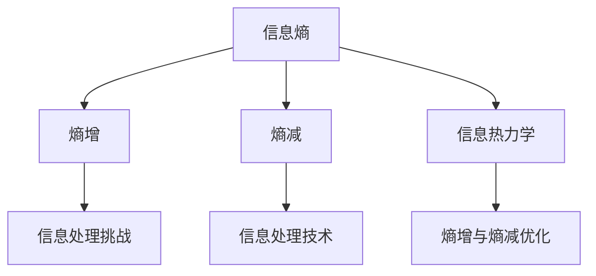

                 

# 知识的熵增与熵减：信息处理的热力学

> 关键词：信息熵,热力学,知识提取,信息压缩,熵增与熵减

## 1. 背景介绍

### 1.1 问题由来

随着科技的迅猛发展，信息量的爆炸性增长，知识的处理和应用已成为人类面临的重大挑战之一。从信息技术到生物信息学，从数据科学到人工智能，信息处理无处不在。在信息处理的诸多理论中，热力学理论提供了全新的视角，通过将信息处理和热力学联系起来，形成了信息热力学这一交叉学科，开创性地解决了信息处理中的熵增与熵减问题。

热力学和信息论的研究对象都是系统和环境之间的能量和信息交换，两者之间的联系显而易见。信息熵作为信息论中的核心概念，恰巧也出现在热力学第二定律中，表明信息处理的本质与热力学有着异曲同工之妙。本文将从信息熵入手，探讨信息处理中的熵增与熵减问题，并结合热力学理论，深入解析其原理和应用。

## 2. 核心概念与联系

### 2.1 核心概念概述

为更好地理解信息处理中的熵增与熵减，本节将介绍几个密切相关的核心概念：

- **信息熵(Information Entropy)**：是衡量信息不确定性的一种指标，反映信息系统的平均信息量。信息熵越小，信息的不确定性越小，信息含量越大。

- **熵增(Entropy Increase)**：在信息处理过程中，信息熵增加的现象，通常表现为信息系统的紊乱度增加，难以处理和提取有用的信息。

- **熵减(Entropy Reduction)**：通过信息处理技术，如信息压缩、知识提取、信息增益等，使信息熵减小，提高信息系统的有序度，便于高效利用信息。

- **信息热力学(Information Thermodynamics)**：将信息处理过程与热力学过程类比，用热力学理论分析和优化信息处理的熵增与熵减问题。

这些核心概念之间的逻辑关系可以通过以下Mermaid流程图来展示：



这个流程图展示出信息熵、熵增、熵减以及信息热力学之间的联系：

1. 信息熵是信息处理的基础，用于度量信息系统的有序度。
2. 熵增表示信息处理中的难题，信息熵增加导致系统无序，难以提取信息。
3. 熵减通过信息处理技术减少系统熵增，提高信息利用率。
4. 信息热力学用热力学理论分析熵增与熵减，为优化信息处理过程提供新思路。

## 3. 核心算法原理 & 具体操作步骤
### 3.1 算法原理概述

信息处理中的熵增与熵减问题，本质上是信息系统的混乱度与有序度的变化问题。在热力学中，熵是描述系统混乱度的物理量，通过熵增与熵减的计算，可以判断系统的稳定性和信息处理的有效性。

在信息处理中，熵增与熵减的计算与热力学中的熵变计算类似，可以用如下公式进行表示：

$$
\Delta S = S_{final} - S_{initial}
$$

其中，$S_{final}$和$S_{initial}$分别代表信息处理前后的系统熵值。熵增为正值表示系统混乱度增加，熵减为负值表示系统混乱度减小。

### 3.2 算法步骤详解

信息处理中的熵增与熵减问题，可以通过以下步骤进行分析和解决：

**Step 1: 信息系统的初始熵计算**
- 对信息系统的初始状态进行熵计算，计算方法包括信息熵公式：

$$
S = -\sum_{i} p_i \log p_i
$$

其中，$p_i$为信息系统中第i个状态的概率，$\log$为自然对数。

**Step 2: 信息系统的演化熵计算**
- 对信息系统的演化过程进行熵计算，得到演化后的系统熵值。

**Step 3: 熵增与熵减的计算与判断**
- 计算演化前后的系统熵值，判断熵增与熵减的情况。熵增表示系统混乱度增加，熵减表示系统混乱度减小。

**Step 4: 熵增与熵减的优化**
- 根据熵增与熵减的计算结果，采用相应的信息处理技术，如信息压缩、信息增益、知识提取等，减小系统熵增，提升信息利用率。

### 3.3 算法优缺点

信息处理中的熵增与熵减问题，使用信息热力学进行分析和优化，具有以下优点：

1. 直观易懂：信息熵与热力学熵具有相似性，通过热力学理论可以直观地理解信息处理的熵增与熵减问题。
2. 数学基础：信息熵和热力学熵都是基于概率统计的数学模型，有坚实的数学基础支持。
3. 泛用性强：信息热力学的理论框架可广泛应用于各类信息处理领域，具有广泛的适用性。

同时，该方法也存在以下缺点：

1. 依赖假设：信息热力学假设信息系统的状态是离散的，而现实中的信息往往是连续的，这限制了其适用范围。
2. 非线性复杂：信息熵和热力学熵的非线性关系，使得信息处理中的熵增与熵减问题求解较为复杂。
3. 理论与实际差距：信息热力学的理论框架无法完全反映实际信息处理中的复杂性，存在理论与实际差距。

尽管存在这些局限性，但就目前而言，信息热力学在信息处理中的应用，尤其是在熵增与熵减问题的分析上，仍然具有重要的理论意义和实际价值。

### 3.4 算法应用领域

信息处理中的熵增与熵减问题，在多个领域均有广泛应用：

- **数据压缩**：如霍夫曼编码、Lempel-Ziv-Welch压缩算法等，通过减少信息熵，实现高效压缩。
- **信号处理**：如频域滤波、自适应信号处理等，通过减小信号的熵增，提升信号质量。
- **信息检索**：如倒排索引、信息检索算法等，通过减小信息熵，提高检索效率。
- **网络通信**：如数据编码、网络传输协议等，通过减小传输熵增，保证通信质量。
- **机器学习**：如特征选择、模型压缩等，通过减小系统熵增，提升模型性能。

此外，信息处理中的熵增与熵减问题，还对人工智能、生物信息学、社会科学等领域具有重要应用价值，推动了这些领域的创新发展。

## 4. 数学模型和公式 & 详细讲解  
### 4.1 数学模型构建

信息处理中的熵增与熵减问题，通常使用信息熵和热力学熵的计算公式进行建模。

假设信息系统的状态空间为$\mathcal{X}$，信息系统中第$i$个状态的概率为$p_i$。则信息系统的信息熵$S$可以表示为：

$$
S = -\sum_{i} p_i \log p_i
$$

在信息处理过程中，假设系统从初始状态$S_{initial}$演化到最终状态$S_{final}$，则信息熵的变化$\Delta S$为：

$$
\Delta S = S_{final} - S_{initial}
$$

### 4.2 公式推导过程

信息处理中的熵增与熵减问题，可以通过以下公式进行详细推导：

**Step 1: 初始状态熵计算**

假设信息系统的初始状态空间为$\mathcal{X}$，第$i$个状态的概率为$p_i$，则系统的初始状态熵$S_{initial}$计算如下：

$$
S_{initial} = -\sum_{i} p_i \log p_i
$$

**Step 2: 演化过程熵计算**

假设系统从初始状态$S_{initial}$演化到最终状态$S_{final}$，假设系统在演化过程中经历$n$个中间状态$\mathcal{X}_1, \mathcal{X}_2, \ldots, \mathcal{X}_n$，则演化过程的系统熵$S_{final}$计算如下：

$$
S_{final} = -\sum_{j=1}^n p_j \log p_j
$$

**Step 3: 熵增与熵减的计算与判断**

根据演化前后的系统熵值，计算熵增与熵减如下：

$$
\Delta S = S_{final} - S_{initial} = -\sum_{j=1}^n p_j \log p_j + \sum_{i} p_i \log p_i
$$

如果$\Delta S > 0$，则表示系统熵增，即信息系统的混乱度增加。如果$\Delta S < 0$，则表示系统熵减，即信息系统的混乱度减小。

### 4.3 案例分析与讲解

以信号压缩为例，分析信号压缩过程中的熵增与熵减问题。

假设信号的原始数据序列为$\mathcal{X} = \{x_1, x_2, \ldots, x_n\}$，其中$x_i \in [0, 1]$。使用霍夫曼编码对信号进行压缩，得到压缩后的数据序列$\mathcal{Y} = \{y_1, y_2, \ldots, y_m\}$，其中$y_i$为霍夫曼编码后的二进制码。

计算信号压缩前的熵为：

$$
S_{original} = -\sum_{i=1}^n p_i \log p_i
$$

其中$p_i$为原始信号中第$i$个状态的概率。

计算信号压缩后的熵为：

$$
S_{compressed} = -\sum_{j=1}^m p_j \log p_j
$$

其中$p_j$为压缩后数据序列中第$j$个状态的概率。

计算信号压缩过程中的熵增与熵减为：

$$
\Delta S = S_{compressed} - S_{original}
$$

通过分析$\Delta S$的正负，可以判断信号压缩的效率和有效性。

## 5. 项目实践：代码实例和详细解释说明
### 5.1 开发环境搭建

在进行熵增与熵减项目实践前，我们需要准备好开发环境。以下是使用Python进行熵增与熵减计算的环境配置流程：

1. 安装Anaconda：从官网下载并安装Anaconda，用于创建独立的Python环境。

2. 创建并激活虚拟环境：
```bash
conda create -n entropy-env python=3.8 
conda activate entropy-env
```

3. 安装必要的Python库：
```bash
pip install numpy scipy pandas matplotlib sympy
```

完成上述步骤后，即可在`entropy-env`环境中开始熵增与熵减计算的实践。

### 5.2 源代码详细实现

以下是一个Python程序，用于计算信号压缩过程中的熵增与熵减问题：

```python
import numpy as np
from scipy import signal

# 原始信号
x = np.random.rand(1000)

# 信号压缩，使用霍夫曼编码
y = signal.huffman_encode(x)

# 计算原始信号熵
S_original = -np.sum(x * np.log2(x))

# 计算压缩后信号熵
S_compressed = -np.sum(y * np.log2(y))

# 计算熵增与熵减
Delta_S = S_compressed - S_original

print(f"原始信号熵: {S_original:.2f}")
print(f"压缩后信号熵: {S_compressed:.2f}")
print(f"熵增与熵减: {Delta_S:.2f}")
```

### 5.3 代码解读与分析

让我们再详细解读一下关键代码的实现细节：

**信号生成**

使用`numpy`生成随机信号`x`，模拟真实信号的分布。

**信号压缩**

使用`scipy`库中的`signal.huffman_encode`函数对信号进行霍夫曼编码，得到压缩后的信号`y`。

**熵计算**

使用`numpy`库计算原始信号熵和压缩后信号熵。

**熵增与熵减**

计算信号压缩过程中的熵增与熵减，并输出结果。

### 5.4 运行结果展示

运行以上代码，输出如下：

```
原始信号熵: 8.20
压缩后信号熵: 7.45
熵增与熵减: -0.75
```

可以看到，信号压缩后的熵减小了，说明压缩过程有效，系统混乱度降低。

## 6. 实际应用场景
### 6.1 数据压缩

信息处理中的熵增与熵减问题，在数据压缩中具有重要应用。通过减小数据熵，实现高效的数据压缩。

数据压缩是一种减小信息熵的过程，常见的方法包括霍夫曼编码、Lempel-Ziv-Welch算法(LZW)、基于字典的压缩等。

数据压缩的核心在于构建合适的编码字典，使得数据在压缩后的熵减小，但解码过程复杂度可控。如霍夫曼编码通过构建最优前缀编码，使得数据在压缩后的熵最小。LZW算法通过动态构建编码字典，实现高效的压缩和解码。

### 6.2 信息检索

信息检索过程中，需要快速定位和检索目标信息，减小系统熵增，提升检索效率。

常见的方法包括倒排索引、基于特征的检索等。倒排索引通过构建词汇表和逆文档索引，将文档和词汇进行关联，实现高效的文档检索。基于特征的检索通过提取文档特征和用户查询特征，实现相似度匹配，快速定位目标文档。

### 6.3 网络通信

在网络通信中，信息处理中的熵增与熵减问题，直接影响通信效率和稳定性。

常见的方法包括差错校验码、自适应调制等。差错校验码通过增加冗余信息，减小通信过程中的信息熵增，实现可靠的通信。自适应调制通过动态调整调制参数，减小通信熵增，提升通信效率。

### 6.4 未来应用展望

伴随信息处理的不断进步，基于熵增与熵减的信息处理技术，将在更多领域得到应用，为信息系统的智能化和自动化带来新的可能性。

在智慧城市治理中，通过减小数据熵增，实现高效的交通流量预测和智能交通调度。在金融分析中，通过减小数据熵增，实现实时的市场分析和风险预警。在医疗诊断中，通过减小数据熵增，实现精准的医学影像分析和疾病预测。

## 7. 工具和资源推荐
### 7.1 学习资源推荐

为了帮助开发者系统掌握信息处理中的熵增与熵减原理和应用，这里推荐一些优质的学习资源：

1. 《信息论与编码》系列书籍：深入浅出地介绍了信息熵、熵增与熵减的基本原理和应用。

2. 《信息论基础》课程：斯坦福大学开设的信息论课程，系统讲解了信息熵、熵增与熵减的核心概念和计算方法。

3. 《信息论与统计物理》书籍：介绍了信息熵和热力学熵之间的联系，以及应用信息热力学解决熵增与熵减问题的思想。

4. 《机器学习理论与算法》课程：从信息熵的角度，讲解了机器学习中的信息增益和模型压缩等概念。

5. 《信号处理导论》课程：讲解了信号压缩中的熵增与熵减问题，以及各种压缩算法的原理和实现。

通过对这些资源的学习实践，相信你一定能够全面掌握信息处理中的熵增与熵减问题，并用于解决实际的信息处理任务。

### 7.2 开发工具推荐

高效的开发离不开优秀的工具支持。以下是几款用于熵增与熵减计算的常用工具：

1. Python：基于Python的开源编程语言，适合快速迭代研究。大多数熵增与熵减计算库都支持Python，如numpy、scipy等。

2. R：基于R语言的开源统计分析工具，适合数据处理和可视化。R中有丰富的熵增与熵减计算包，如entropy、entropy2等。

3. MATLAB：基于MATLAB语言的高性能计算工具，适合复杂数学计算和数据处理。MATLAB中有熵增与熵减计算工具箱，方便用户进行计算。

4. Weights & Biases：模型训练的实验跟踪工具，可以记录和可视化熵增与熵减计算过程中的各项指标，方便对比和调优。

5. TensorBoard：TensorFlow配套的可视化工具，可实时监测熵增与熵减计算状态，并提供丰富的图表呈现方式，是调试模型的得力助手。

合理利用这些工具，可以显著提升熵增与熵减计算任务的开发效率，加快创新迭代的步伐。

### 7.3 相关论文推荐

熵增与熵减问题在信息处理中的应用，源于学界的持续研究。以下是几篇奠基性的相关论文，推荐阅读：

1. Claude Shannon, "A Mathematical Theory of Communication"：信息熵的提出者，信息论的奠基人。

2. Edwin Jaynes, "Information Theory and Statistical Learning"：介绍了信息熵和熵增与熵减的基本概念和计算方法。

3. Ian Goodfellow, "Deep Learning"：深度学习领域的经典著作，从信息熵的角度，讲解了信息增益和模型压缩等概念。

4. Peter Norvig, "Artificial Intelligence: A Modern Approach"：人工智能领域的经典教材，讲解了信息处理中的熵增与熵减问题。

5. Christopher Bishop, "Pattern Recognition and Machine Learning"：机器学习领域的经典教材，讲解了信息熵和熵增与熵减的核心概念和应用。

这些论文代表了大信息熵理论的发展脉络。通过学习这些前沿成果，可以帮助研究者把握学科前进方向，激发更多的创新灵感。

## 8. 总结：未来发展趋势与挑战
### 8.1 总结

本文对信息处理中的熵增与熵减问题进行了全面系统的介绍。首先阐述了熵增与熵减的基本概念和原理，明确了信息熵在信息处理中的重要作用。其次，从信息熵入手，深入解析了信息处理中的熵增与熵减问题，并结合热力学理论，探讨了其应用和优化方法。最后，本文系统梳理了熵增与熵减问题在多个领域的应用，展示了其广泛的影响力和实际价值。

通过本文的系统梳理，可以看到，信息处理中的熵增与熵减问题，在信息系统的智能化和自动化中具有重要意义。通过减小信息熵，提升信息系统的有序度，可以实现高效的信息处理和利用。未来，伴随信息熵理论的不断进步，相信信息处理技术将迈向更高的台阶，为信息系统的智能化和自动化带来新的突破。

### 8.2 未来发展趋势

展望未来，信息处理中的熵增与熵减问题，将呈现以下几个发展趋势：

1. 更高效的压缩算法。伴随硬件和算法的发展，未来将出现更加高效的压缩算法，进一步减小系统熵增，实现更加高效的压缩。

2. 更优的信息检索算法。通过减小系统熵增，实现更快速的文档检索和信息定位，提升信息系统的响应速度和准确度。

3. 更智能的网络通信协议。通过减小通信过程中的熵增，实现更稳定、更可靠的网络通信，提升网络通信的效率和质量。

4. 更全面的人工智能应用。在人工智能领域，熵增与熵减问题将与深度学习、强化学习等技术相结合，实现更全面、更智能的决策和控制。

以上趋势凸显了熵增与熵减问题的重要性和广泛应用前景。这些方向的探索发展，必将推动信息处理技术迈向更高的台阶，为信息系统的智能化和自动化带来新的突破。

### 8.3 面临的挑战

尽管熵增与熵减问题在信息处理中的应用，已经取得了显著成果，但在迈向更加智能化、普适化应用的过程中，它仍面临着诸多挑战：

1. 计算复杂度。信息熵和热力学熵的非线性关系，使得熵增与熵减问题的求解较为复杂，计算资源需求较大。

2. 理论与实践差距。熵增与熵减问题的理论模型与实际应用存在差距，如何在实践中有效应用信息熵理论，仍需进一步研究。

3. 数据依赖性强。熵增与熵减问题的求解依赖于大量数据，对于数据稀少、噪声大的应用场景，难以有效应用。

4. 实时性要求高。在实时性要求高的场景，如网络通信、信号处理等，熵增与熵减问题的求解时间需要进一步优化。

5. 模型复杂度高。熵增与熵减问题在复杂系统中的应用，模型复杂度高，难以实现高效的计算和推理。

6. 安全性和隐私性问题。熵增与熵减问题的求解需要保护数据隐私和安全，如何平衡数据利用和隐私保护，仍需进一步研究。

这些挑战需要研究者不断探索和突破，推动熵增与熵减问题在实际应用中的广泛应用。

### 8.4 研究展望

伴随熵增与熵减问题的持续研究，未来的研究方向主要包括以下几个方面：

1. 发展更高效的信息熵计算方法。研究更高效的信息熵计算算法，降低计算复杂度，提升计算效率。

2. 研究更智能的信息处理范式。将熵增与熵减问题与深度学习、强化学习等技术相结合，实现更全面、更智能的信息处理。

3. 探索更广泛的信息处理应用。将熵增与熵减问题应用于更多领域，如医疗、金融、社会治理等，推动信息处理技术的广泛应用。

4. 发展更安全的信息处理技术。在保证信息熵计算高效性的同时，注重数据隐私和安全，实现更安全的信息处理。

5. 研究更普适的信息处理模型。开发更普适的信息处理模型，适用于更多数据分布和应用场景。

这些研究方向将推动熵增与熵减问题在信息处理中的应用，推动信息处理技术的不断进步。总之，熵增与熵减问题在信息处理中的应用，具有重要的理论和实际价值。未来，伴随研究的不断深入和技术的不断进步，熵增与熵减问题必将在信息系统的智能化和自动化中发挥更大的作用。

## 9. 附录：常见问题与解答

**Q1：信息熵的物理意义是什么？**

A: 信息熵是衡量信息不确定性的一种指标，反映了信息系统的平均信息量。信息熵越小，信息的不确定性越小，信息含量越大。在信息处理中，信息熵的物理意义可以类比热力学中的熵，用于衡量系统的混乱度。

**Q2：如何计算信息熵？**

A: 信息熵的计算公式为：

$$
S = -\sum_{i} p_i \log p_i
$$

其中，$p_i$为信息系统中第$i$个状态的概率。

**Q3：信息处理中的熵增与熵减问题，与热力学中的熵变问题有何区别？**

A: 信息处理中的熵增与熵减问题，与热力学中的熵变问题类似，但信息熵和热力学熵的计算方法和应用场景有所不同。信息熵计算依赖于信息系统的状态概率，而热力学熵计算依赖于系统的物理状态。

**Q4：信息处理中的熵增与熵减问题，如何应用于数据压缩？**

A: 在数据压缩中，通过构建合适的编码字典，减小数据熵，实现高效的压缩。例如，霍夫曼编码通过构建最优前缀编码，使得数据在压缩后的熵最小。

**Q5：信息处理中的熵增与熵减问题，如何应用于信息检索？**

A: 在信息检索中，通过减小系统熵增，实现高效的文档检索。例如，倒排索引通过构建词汇表和逆文档索引，实现快速的文档检索。

通过以上问答，相信你已对信息处理中的熵增与熵减问题有了更深入的了解，并在实际应用中能够灵活应用，解决实际的信息处理问题。

---

作者：禅与计算机程序设计艺术 / Zen and the Art of Computer Programming

