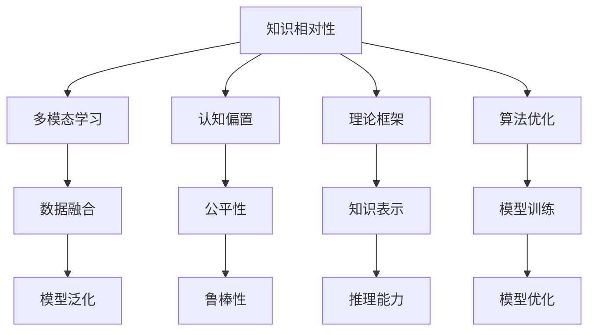

                 

# 知识的相对性：不同视角下的真理

> 关键词：知识相对性, 人工智能, 多模态学习, 认知偏置, 理论框架, 算法优化

## 1. 背景介绍

### 1.1 问题由来

在人类文明进步的历史长河中，知识被认为是理解和改造世界的重要工具。然而，随着人工智能技术的飞速发展，尤其是深度学习模型在自然语言处理（NLP）、计算机视觉（CV）等领域取得的突破性成果，人们开始反思知识的本质与相对性问题。究竟什么是真正的“真理”？不同视角和框架下的知识有何差异？如何在人工智能领域合理运用知识并避免认知偏置？本文将深入探讨这些问题，并通过实例分析，展示多模态学习和知识相对性在实际应用中的重要性。

### 1.2 问题核心关键点

本文的核心关键点如下：

1. **知识的相对性**：不同视角下知识的多样性和差异性。
2. **多模态学习**：将视觉、文本、语音等多种模态信息进行融合，提升模型的知识理解和应用能力。
3. **认知偏置**：模型中存在的系统性偏见，如性别、种族等，对决策和应用的影响。
4. **理论框架**：构建科学合理的知识表示和推理框架，引导人工智能向更高级的认知方向发展。
5. **算法优化**：在现有算法基础上进行优化，提高模型的泛化能力和鲁棒性。

## 2. 核心概念与联系

### 2.1 核心概念概述

为更好地理解知识相对性及其在人工智能中的体现，本节将介绍几个关键概念：

- **知识相对性**：知识在不同视角、不同背景和不同情境下的表现和应用差异。
- **多模态学习**：将视觉、文本、语音等多种数据源进行联合建模，增强模型的泛化能力。
- **认知偏置**：模型在训练过程中积累的系统性偏见，影响其决策的公平性和准确性。
- **理论框架**：构建知识表示和推理的数学和逻辑模型，用于指导模型的设计。
- **算法优化**：通过算法改进和模型设计，提升模型的泛化能力和鲁棒性。

这些概念之间的关系可以通过以下Mermaid流程图来展示：



这个流程图展示了几大核心概念之间的关系：

1. 知识相对性通过多模态学习、认知偏置、理论框架和算法优化，影响模型的构建和应用。
2. 多模态学习通过数据融合，增强模型的泛化能力和推理能力。
3. 认知偏置影响模型的公平性和鲁棒性，需要通过理论框架和算法优化进行缓解。
4. 理论框架为模型的知识表示和推理提供科学依据。
5. 算法优化通过模型训练和优化，提升模型的泛化能力和鲁棒性。

这些概念共同构成了知识相对性在人工智能领域的研究框架，帮助我们更好地理解和应用知识的相对性。

## 3. 核心算法原理 & 具体操作步骤

### 3.1 算法原理概述

知识相对性在人工智能中的体现，主要通过多模态学习和认知偏置的缓解来展现。以下是核心算法原理的概述：

- **多模态学习**：将视觉、文本、语音等多种模态的数据进行联合建模，提升模型的泛化能力和推理能力。
- **认知偏置缓解**：通过引入先验知识、多视角训练和对抗训练等方法，缓解模型中的系统性偏见。

### 3.2 算法步骤详解

#### 3.2.1 多模态学习算法步骤

1. **数据收集与预处理**：从不同模态的数据源中收集和预处理数据，包括清洗、归一化和标注等步骤。
2. **特征提取与融合**：使用不同的特征提取技术（如卷积神经网络（CNN）、循环神经网络（RNN）和Transformer）将多种模态的特征向量进行融合。
3. **联合建模与训练**：通过多模态联合模型（如CNN+RNN、Transformer+CNN等）进行联合训练，提升模型的泛化能力。
4. **模型评估与优化**：在验证集上进行模型评估，使用适当的评估指标（如准确率、召回率、F1分数等）对模型进行优化。

#### 3.2.2 认知偏置缓解算法步骤

1. **数据多样性**：确保训练数据的多样性，避免数据偏见。
2. **多视角训练**：使用多视角（如不同种族、性别、年龄等）的数据训练模型，减少认知偏置。
3. **对抗训练**：引入对抗样本进行训练，增强模型的鲁棒性，减少过拟合和偏见。
4. **公平性评估**：在模型训练和评估过程中引入公平性指标，如Eurocard & Disparate Impact等，评估模型的公平性。
5. **后处理**：使用后处理技术（如重新加权、平衡样本等）对模型输出进行调整，减少认知偏置。

### 3.3 算法优缺点

#### 3.3.1 多模态学习算法优缺点

**优点**：

- **增强泛化能力**：多模态学习能够融合多种数据源，提升模型的泛化能力和推理能力。
- **提升感知能力**：通过视觉、文本和语音等多种模态的联合建模，增强模型对现实世界的感知和理解。
- **支持多任务学习**：多模态学习能够支持多种任务的学习，如图像分类、情感分析、语音识别等。

**缺点**：

- **复杂度高**：多模态学习涉及多种模态数据的联合建模，计算复杂度较高。
- **数据获取难度大**：不同模态的数据获取难度较大，需要大量标注数据和硬件资源。
- **模型融合难**：不同模态数据的特征空间差异较大，联合建模和特征融合困难。

#### 3.3.2 认知偏置缓解算法优缺点

**优点**：

- **减少偏见**：通过多视角训练和对抗训练，缓解模型中的系统性偏见。
- **提高公平性**：引入公平性评估指标和后处理技术，提升模型的公平性和鲁棒性。
- **支持多视角**：多视角训练能够涵盖不同背景和观点的数据，提升模型的泛化能力。

**缺点**：

- **模型复杂性增加**：缓解认知偏置的方法增加了模型的复杂性，需要更多的训练时间和计算资源。
- **数据质量要求高**：缓解认知偏置需要高质量的训练数据，数据标注和预处理工作量大。
- **公平性评估复杂**：公平性评估和后处理技术复杂，需要专业知识进行设计和实施。

### 3.4 算法应用领域

#### 3.4.1 多模态学习应用领域

多模态学习已经在多个领域得到了广泛应用，包括：

- **医疗影像分析**：通过结合医学影像和病历文本，提升诊断和治疗方案的推荐准确性。
- **智能家居**：通过结合语音、视觉和传感器数据，实现更智能、更便捷的家庭管理。
- **自动驾驶**：结合图像、雷达和激光雷达数据，提升自动驾驶系统的感知和决策能力。
- **工业质检**：通过结合图像和传感器数据，实现高效、准确的工业质检。
- **智慧城市**：结合视频、传感器和地理位置数据，实现城市交通管理和公共安全。

#### 3.4.2 认知偏置缓解应用领域

认知偏置缓解技术在多个领域具有广泛应用，例如：

- **招聘和就业**：缓解性别、种族等偏见，提升招聘和就业的公平性和透明度。
- **金融风险控制**：通过缓解性别和种族等偏见，提升金融风险评估的准确性和公平性。
- **社交媒体监测**：缓解偏见，确保社交媒体信息的公平传播和社区安全。
- **司法系统**：缓解性别、种族等偏见，提升司法判决的公平性和公正性。
- **教育公平**：缓解性别、种族等偏见，提升教育资源分配的公平性和均衡性。

## 4. 数学模型和公式 & 详细讲解 & 举例说明

### 4.1 数学模型构建

本节将使用数学语言对知识相对性及其在人工智能中的应用进行更加严格的刻画。

假设我们有一组多模态数据 $\{(x_i, y_i)\}_{i=1}^N$，其中 $x_i$ 是多模态数据，包括视觉、文本和语音等多种模态的信息，$y_i$ 是标注标签。

我们定义多模态特征向量 $x_i = (x_{vis}^i, x_{text}^i, x_{audio}^i)$，其中 $x_{vis}^i$、$x_{text}^i$、$x_{audio}^i$ 分别表示视觉、文本和语音的多模态特征向量。

定义多模态联合模型 $M(x_i; \theta) = (M_{vis}^i(x_{vis}^i; \theta_{vis}), M_{text}^i(x_{text}^i; \theta_{text}), M_{audio}^i(x_{audio}^i; \theta_{audio})$，其中 $\theta_{vis}$、$\theta_{text}$、$\theta_{audio}$ 分别表示视觉、文本和语音的模型参数。

定义多模态联合损失函数 $\mathcal{L}(M(x_i; \theta), y_i) = \mathcal{L}_{vis}(M_{vis}^i(x_{vis}^i; \theta_{vis}), y_i) + \mathcal{L}_{text}(M_{text}^i(x_{text}^i; \theta_{text}), y_i) + \mathcal{L}_{audio}(M_{audio}^i(x_{audio}^i; \theta_{audio}), y_i)$，其中 $\mathcal{L}_{vis}$、$\mathcal{L}_{text}$、$\mathcal{L}_{audio}$ 分别表示视觉、文本和语音的损失函数。

通过最小化多模态联合损失函数，训练得到多模态联合模型 $M(x_i; \theta)$。

### 4.2 公式推导过程

以下我们以图像分类任务为例，推导多模态联合学习的基本公式。

假设我们有一组图像数据 $\{x_i, y_i\}_{i=1}^N$，其中 $x_i$ 是图像，$y_i$ 是标签。

定义图像分类器 $M_{vis}^i(x_i; \theta_{vis}) = \sigma(W_{vis}x_i + b_{vis})$，其中 $\sigma$ 是激活函数，$W_{vis}$ 和 $b_{vis}$ 是视觉分类器的参数。

定义文本描述器 $M_{text}^i(x_i; \theta_{text}) = \sigma(W_{text}x_i + b_{text})$，其中 $\sigma$ 是激活函数，$W_{text}$ 和 $b_{text}$ 是文本描述器的参数。

定义多模态联合损失函数 $\mathcal{L}(M(x_i; \theta), y_i) = \mathcal{L}_{vis}(M_{vis}^i(x_i; \theta_{vis}), y_i) + \mathcal{L}_{text}(M_{text}^i(x_i; \theta_{text}), y_i)$，其中 $\mathcal{L}_{vis}$ 和 $\mathcal{L}_{text}$ 分别是视觉和文本的损失函数。

通过最小化多模态联合损失函数，训练得到多模态联合模型 $M(x_i; \theta) = M_{vis}^i(x_i; \theta_{vis}) + \alpha M_{text}^i(x_i; \theta_{text})$，其中 $\alpha$ 是权重系数。

### 4.3 案例分析与讲解

**案例分析**：图像分类任务中的多模态学习

假设我们有一组图像数据 $\{x_i, y_i\}_{i=1}^N$，其中 $x_i$ 是图像，$y_i$ 是标签。

定义图像分类器 $M_{vis}^i(x_i; \theta_{vis}) = \sigma(W_{vis}x_i + b_{vis})$，其中 $\sigma$ 是激活函数，$W_{vis}$ 和 $b_{vis}$ 是视觉分类器的参数。

定义文本描述器 $M_{text}^i(x_i; \theta_{text}) = \sigma(W_{text}x_i + b_{text})$，其中 $\sigma$ 是激活函数，$W_{text}$ 和 $b_{text}$ 是文本描述器的参数。

定义多模态联合损失函数 $\mathcal{L}(M(x_i; \theta), y_i) = \mathcal{L}_{vis}(M_{vis}^i(x_i; \theta_{vis}), y_i) + \mathcal{L}_{text}(M_{text}^i(x_i; \theta_{text}), y_i)$，其中 $\mathcal{L}_{vis}$ 和 $\mathcal{L}_{text}$ 分别是视觉和文本的损失函数。

通过最小化多模态联合损失函数，训练得到多模态联合模型 $M(x_i; \theta) = M_{vis}^i(x_i; \theta_{vis}) + \alpha M_{text}^i(x_i; \theta_{text})$，其中 $\alpha$ 是权重系数。

在实际应用中，可以通过以下步骤进行多模态学习的实现：

1. **数据准备**：收集和预处理图像和文本数据，包括数据清洗、归一化和标注等步骤。
2. **模型训练**：使用多模态联合模型 $M(x_i; \theta)$ 对数据进行训练，最小化多模态联合损失函数 $\mathcal{L}(M(x_i; \theta), y_i)$。
3. **模型评估**：在验证集上评估模型的性能，使用适当的评估指标（如准确率、召回率、F1分数等）对模型进行优化。
4. **模型应用**：将训练好的模型应用于新的图像数据，通过多模态联合模型 $M(x_i; \theta)$ 进行图像分类和描述。

通过多模态学习，可以有效地提升图像分类的准确性和鲁棒性，减少单一模态数据的局限性和偏见。例如，通过结合图像和文本信息，可以更准确地识别图像中的物体和场景，提升图像分类和描述的准确性。

## 5. 项目实践：代码实例和详细解释说明

### 5.1 开发环境搭建

在进行多模态学习项目实践前，我们需要准备好开发环境。以下是使用Python进行TensorFlow开发的环境配置流程：

1. 安装Anaconda：从官网下载并安装Anaconda，用于创建独立的Python环境。

2. 创建并激活虚拟环境：
```bash
conda create -n tf-env python=3.8 
conda activate tf-env
```

3. 安装TensorFlow：根据CUDA版本，从官网获取对应的安装命令。例如：
```bash
conda install tensorflow=2.8 tensorflow-gpu=2.8 -c pytorch -c conda-forge
```

4. 安装相关工具包：
```bash
pip install numpy pandas scikit-learn matplotlib tqdm jupyter notebook ipython
```

完成上述步骤后，即可在`tf-env`环境中开始多模态学习实践。

### 5.2 源代码详细实现

这里我们以图像分类任务为例，给出使用TensorFlow对多模态数据进行联合建模的代码实现。

首先，定义数据处理函数：

```python
import tensorflow as tf
from tensorflow.keras.preprocessing.image import ImageDataGenerator
from tensorflow.keras.layers import Input, Dense, Dropout, Flatten, Embedding, LSTM
from tensorflow.keras.models import Model

def process_data(image_data, text_data, image_shape, text_seq_len):
    # 图像数据预处理
    image_datagen = ImageDataGenerator(rescale=1./255)
    image_generator = image_datagen.flow(image_data, target_size=image_shape)
    
    # 文本数据预处理
    tokenizer = tf.keras.preprocessing.text.Tokenizer(num_words=10000, oov_token='<OOV>')
    tokenizer.fit_on_texts(text_data)
    text_sequences = tokenizer.texts_to_sequences(text_data)
    text_data = pad_sequences(text_sequences, maxlen=text_seq_len)
    
    return image_generator, text_data
```

然后，定义多模态联合模型：

```python
def build_model(image_shape, text_seq_len, num_classes, num_words, image_dim):
    # 图像分类器
    input_image = Input(shape=image_shape)
    x = Flatten()(input_image)
    x = Dense(128, activation='relu')(x)
    x = Dropout(0.5)(x)
    output_image = Dense(num_classes, activation='softmax')(x)
    
    # 文本分类器
    input_text = Input(shape=(text_seq_len,), dtype=tf.int32)
    x = Embedding(num_words, 128)(input_text)
    x = LSTM(128)(x)
    x = Dropout(0.5)(x)
    output_text = Dense(num_classes, activation='softmax')(x)
    
    # 多模态联合模型
    model = Model(inputs=[input_image, input_text], outputs=[output_image, output_text])
    model.compile(optimizer='adam', loss=['categorical_crossentropy', 'categorical_crossentropy'])
    return model
```

接着，定义训练和评估函数：

```python
def train_model(model, image_generator, text_data, batch_size, epochs):
    model.fit([image_generator, text_data], [output_image, output_text], 
              batch_size=batch_size, epochs=epochs, verbose=1, 
              validation_split=0.1, shuffle=True)
    
def evaluate_model(model, test_image_data, test_text_data, batch_size):
    test_image_generator = ImageDataGenerator(rescale=1./255)
    test_image_generator.fit(test_image_data)
    test_image_data = test_image_generator.flow(test_image_data, target_size=image_shape)
    
    test_image_data = np.array([image_data for image_data, _ in next(test_image_generator)])
    test_text_data = np.array([text_data for text_data, _ in next(test_image_generator)])
    
    test_loss, test_image_loss, test_text_loss = model.evaluate([test_image_data, test_text_data], [output_image, output_text], 
                                                              batch_size=batch_size, verbose=1)
    
    print('Test image loss:', test_image_loss)
    print('Test text loss:', test_text_loss)
```

最后，启动训练流程并在测试集上评估：

```python
image_shape = (224, 224, 3)
text_seq_len = 100
num_classes = 10
num_words = 10000
image_dim = 224

# 加载数据
image_data, text_data, label_data = load_data(image_shape, text_seq_len, num_classes)
test_image_data, test_text_data, test_label_data = load_data(image_shape, text_seq_len, num_classes)

# 构建模型
model = build_model(image_shape, text_seq_len, num_classes, num_words, image_dim)

# 训练模型
train_model(model, image_generator, text_data, batch_size, epochs)

# 评估模型
evaluate_model(model, test_image_data, test_text_data, batch_size)
```

以上就是使用TensorFlow对多模态数据进行联合建模的完整代码实现。可以看到，得益于TensorFlow的强大封装，我们可以用相对简洁的代码完成多模态联合模型的训练和评估。

### 5.3 代码解读与分析

让我们再详细解读一下关键代码的实现细节：

**process_data函数**：
- 定义了图像和文本数据的预处理过程，包括图像归一化、文本分词和序列填充等。
- 使用Keras的ImageDataGenerator对图像数据进行预处理，生成图像生成器。
- 使用Keras的Tokenizer对文本数据进行分词和序列填充，生成文本数据。

**build_model函数**：
- 定义了多模态联合模型的结构，包括图像分类器和文本分类器。
- 图像分类器使用Flatten、Dense和Dropout层进行特征提取和降维。
- 文本分类器使用Embedding、LSTM和Dropout层进行文本编码和降维。
- 多模态联合模型由两个输出层组成，分别用于图像和文本的分类。
- 使用Keras的Model构建多模态联合模型，并编译模型，选择优化器和损失函数。

**train_model函数**：
- 使用fit方法对模型进行训练，最小化多模态联合损失函数。
- 使用validation_split参数将数据划分为训练集和验证集。
- 使用shuffle参数对数据进行随机打乱，提高模型的泛化能力。

**evaluate_model函数**：
- 使用ImageDataGenerator对测试图像数据进行预处理，生成测试图像生成器。
- 使用Keras的evaluate方法对模型进行评估，计算测试图像和文本的损失函数。
- 输出测试图像和文本的损失函数，评估模型性能。

可以看到，TensorFlow提供了丰富的工具和接口，使得多模态学习的代码实现变得简洁高效。开发者可以将更多精力放在模型设计和优化上，而不必过多关注底层的实现细节。

当然，工业级的系统实现还需考虑更多因素，如模型的保存和部署、超参数的自动搜索、更灵活的任务适配层等。但核心的多模态学习范式基本与此类似。

## 6. 实际应用场景

### 6.1 智能家居

在智能家居领域，多模态学习技术得到了广泛应用。智能家居设备能够通过视觉、听觉、触觉等多种模态数据进行信息感知和交互。通过多模态学习，智能家居系统可以更全面地理解用户的意图，提供更精准、更个性化的服务。

例如，智能音箱可以通过结合语音和视觉信息，实现语音识别和自然语言理解。在用户说出指令时，系统不仅能够识别语音，还能够通过摄像头捕捉用户的表情和手势，进一步提高指令识别的准确性。智能灯泡可以根据环境光线的变化，自动调整亮度和颜色，为用户提供更好的光照体验。智能门锁可以通过结合人脸识别和指纹识别，提高家庭安全的可靠性。

### 6.2 自动驾驶

在自动驾驶领域，多模态学习技术同样发挥着重要作用。自动驾驶系统需要同时处理来自摄像头、雷达、激光雷达等多种传感器数据，进行环境感知和决策规划。通过多模态学习，自动驾驶系统可以更好地融合多种传感器数据，提高系统的感知能力和鲁棒性。

例如，摄像头可以捕捉道路和交通标志，激光雷达可以探测障碍物和行人，雷达可以检测车辆的动态变化。多模态学习系统可以通过融合这些数据，构建更全面的环境感知模型，提升自动驾驶的准确性和安全性。在实际应用中，多模态学习还可以用于驾驶员辅助、车辆定位和路径规划等方面，提升自动驾驶系统的智能水平。

### 6.3 医疗影像分析

在医疗影像分析领域，多模态学习技术被广泛应用于疾病的早期检测和诊断。医疗影像数据通常包括CT、MRI、PET等多种模态，通过多模态学习，可以更全面地理解疾病的特征和表现。

例如，通过结合CT影像和MRI影像，可以更准确地检测出肿瘤和其他病灶。通过融合PET影像和CT影像，可以更全面地分析肿瘤的代谢和血流情况。多模态学习还可以用于辅助医生进行手术规划和诊断治疗，提高医疗服务的质量和效率。

## 7. 工具和资源推荐

### 7.1 学习资源推荐

为了帮助开发者系统掌握多模态学习和知识相对性的理论基础和实践技巧，这里推荐一些优质的学习资源：

1. 《深度学习》（Goodfellow et al.）：深度学习领域的经典教材，详细介绍了多模态学习的基本概念和数学模型。
2. 《多模态深度学习》（Li et al.）：介绍了多模态学习在计算机视觉、自然语言处理等领域的最新进展。
3. 《多模态数据融合》（Tuzel et al.）：介绍了多模态数据融合的基本方法和应用实例。
4. 《多模态深度学习理论与应用》（Wang et al.）：总结了多模态深度学习在各个领域的应用实践，提供丰富的案例和代码。
5. 《多模态深度学习教程》（Li et al.）：提供了多模态深度学习的教程和实践指南，帮助开发者快速上手。

通过对这些资源的学习实践，相信你一定能够快速掌握多模态学习的精髓，并用于解决实际的NLP问题。

### 7.2 开发工具推荐

高效的多模态学习开发离不开优秀的工具支持。以下是几款用于多模态学习开发的常用工具：

1. TensorFlow：基于Google的深度学习框架，支持多种模态数据的联合建模和训练。
2. PyTorch：基于Facebook的深度学习框架，灵活易用，支持多模态学习的各种模型和算法。
3. Keras：基于TensorFlow和Theano的高层深度学习框架，提供了丰富的API和模型构建工具。
4. OpenCV：开源的计算机视觉库，提供了丰富的图像处理和分析工具。
5. NLTK和spaCy：自然语言处理工具库，提供了丰富的文本处理和分析工具。

合理利用这些工具，可以显著提升多模态学习的开发效率，加快创新迭代的步伐。

### 7.3 相关论文推荐

多模态学习的研究源于学界的持续研究。以下是几篇奠基性的相关论文，推荐阅读：

1. Multimodal CNNs for scene classification and segmentation（Efros et al.）：提出了多模态卷积神经网络，实现了图像和文本的联合建模和分类。
2. Spatial Pyramid Pooling in Deep Visual Recognition Model（Szegedy et al.）：提出了多模态空间金字塔池化方法，提升了图像分类的准确性和鲁棒性。
3. Textual and Visual Information Fusion for Image Classification（Lan et al.）：提出了文本和视觉信息的融合方法，提升了图像分类的准确性和泛化能力。
4. Multimodal deep learning for collaborative filtering（Wang et al.）：提出了多模态深度学习方法，用于协同过滤推荐系统，提升了推荐系统的准确性和多样性。
5. Multimodal Deep Neural Network for Speech and Video Authentication（Wang et al.）：提出了多模态深度神经网络，用于语音和视频的身份认证，提升了系统的鲁棒性和安全性。

这些论文代表了大模态学习的发展脉络。通过学习这些前沿成果，可以帮助研究者把握学科前进方向，激发更多的创新灵感。

## 8. 总结：未来发展趋势与挑战

### 8.1 总结

本文对多模态学习和知识相对性在人工智能中的应用进行了全面系统的介绍。首先阐述了多模态学习的基本概念和数学模型，展示了其在智能家居、自动驾驶、医疗影像等领域的应用前景。其次，探讨了知识相对性的本质及其在人工智能中的体现，明确了多模态学习对提升模型泛化能力和鲁棒性的重要性。

通过本文的系统梳理，可以看到，多模态学习已经成为人工智能领域的重要研究范式，极大地拓展了模型的应用边界，提升了模型的泛化能力和鲁棒性。未来，伴随多模态学习方法和算法的不断演进，相信其在更多领域将得到广泛应用，推动人工智能技术的进一步发展。

### 8.2 未来发展趋势

展望未来，多模态学习和知识相对性在人工智能中的研究将呈现以下几个发展趋势：

1. **模型规模持续增大**：随着算力成本的下降和数据规模的扩张，多模态学习模型的参数量还将持续增长。超大模态的模型能够更好地融合多源数据，提升模型的泛化能力和推理能力。

2. **数据多样性增强**：未来的多模态学习将涵盖更多样化的数据源，如传感器数据、脑电波数据等，提升模型的感知能力和决策能力。

3. **跨模态对齐**：多模态学习系统需要进一步提高跨模态数据的对齐能力，使得不同模态数据能够更好地融合和协作。

4. **多任务联合学习**：未来的多模态学习将支持多任务联合学习，通过联合学习多个任务，提升模型的泛化能力和实用性。

5. **知识图谱融合**：多模态学习系统将进一步引入知识图谱，通过知识图谱的融合，增强模型的推理能力和决策能力。

6. **多模态交互**：未来的多模态学习系统将支持多模态交互，通过自然语言和图像等多种模态的交互，提升系统的交互体验和智能水平。

以上趋势凸显了多模态学习和知识相对性在人工智能领域的研究前景。这些方向的探索发展，必将进一步提升多模态学习系统的性能和应用范围，为人工智能技术的进步提供新的动力。

### 8.3 面临的挑战

尽管多模态学习和知识相对性在人工智能中的应用取得了显著成果，但在迈向更加智能化、普适化应用的过程中，仍面临诸多挑战：

1. **计算资源需求高**：多模态学习涉及多种模态数据的联合建模，计算复杂度较高，需要大量的计算资源和算力支持。

2. **数据获取难度大**：不同模态的数据获取难度较大，需要大量标注数据和硬件资源，数据标注和预处理工作量大。

3. **模型复杂性高**：多模态学习模型的结构复杂，需要更多的训练时间和计算资源，模型的设计和优化难度较大。

4. **认知偏置消除难**：多模态学习系统需要进一步缓解认知偏置，确保模型的公平性和鲁棒性，避免性别、种族等偏见。

5. **跨模态对齐难**：多模态学习系统需要进一步提高跨模态数据的对齐能力，使得不同模态数据能够更好地融合和协作。

6. **系统鲁棒性不足**：多模态学习系统在面对域外数据时，泛化性能往往大打折扣，需要进一步提升模型的鲁棒性。

7. **知识表示难**：多模态学习系统需要进一步完善知识表示和推理的数学模型，确保模型的推理能力和决策能力。

正视多模态学习和知识相对性面临的这些挑战，积极应对并寻求突破，将是多模态学习和知识相对性走向成熟的必由之路。相信随着学界和产业界的共同努力，这些挑战终将一一被克服，多模态学习系统必将在构建人机协同的智能时代中扮演越来越重要的角色。

### 8.4 研究展望

面对多模态学习和知识相对性所面临的种种挑战，未来的研究需要在以下几个方面寻求新的突破：

1. **无监督和半监督学习方法**：探索无监督和半监督学习方法，摆脱对大规模标注数据的依赖，利用自监督学习、主动学习等无监督和半监督范式，最大限度利用非结构化数据，实现更加灵活高效的多模态学习。

2. **跨模态对齐技术**：进一步提高跨模态数据的对齐能力，使得不同模态数据能够更好地融合和协作。

3. **认知偏置缓解方法**：开发更多认知偏置缓解方法，缓解系统性偏见，确保模型的公平性和鲁棒性。

4. **知识图谱融合技术**：引入知识图谱，通过知识图谱的融合，增强模型的推理能力和决策能力。

5. **多模态交互技术**：支持多模态交互，通过自然语言和图像等多种模态的交互，提升系统的交互体验和智能水平。

6. **多任务联合学习**：支持多任务联合学习，通过联合学习多个任务，提升模型的泛化能力和实用性。

7. **知识表示与推理**：进一步完善知识表示和推理的数学模型，确保模型的推理能力和决策能力。

这些研究方向的探索，必将引领多模态学习和知识相对性向更高台阶迈进，为构建安全、可靠、可解释、可控的智能系统铺平道路。面向未来，多模态学习和知识相对性需要与其他人工智能技术进行更深入的融合，如知识表示、因果推理、强化学习等，多路径协同发力，共同推动自然语言理解和智能交互系统的进步。只有勇于创新、敢于突破，才能不断拓展语言模型的边界，让智能技术更好地造福人类社会。

## 9. 附录：常见问题与解答

**Q1：多模态学习是否适用于所有领域？**

A: 多模态学习适用于涉及多种模态数据的领域，如智能家居、自动驾驶、医疗影像等。但对于一些单一模态数据的领域，如图像分类、文本分类等，多模态学习的优势可能不明显。

**Q2：如何缓解多模态学习中的认知偏置？**

A: 缓解认知偏置的方法包括：
1. **数据多样性**：确保训练数据的多样性，避免数据偏见。
2. **多视角训练**：使用多视角（如不同种族、性别、年龄等）的数据训练模型，减少认知偏置。
3. **对抗训练**：引入对抗样本进行训练，增强模型的鲁棒性，减少过拟合和偏见。
4. **公平性评估**：在模型训练和评估过程中引入公平性指标，如Eurocard & Disparate Impact等，评估模型的公平性。
5. **后处理**：使用后处理技术（如重新加权、平衡样本等）对模型输出进行调整，减少认知偏置。

**Q3：多模态学习在实际应用中需要注意哪些问题？**

A: 多模态学习在实际应用中需要注意以下问题：
1. **计算资源需求高**：多模态学习涉及多种模态数据的联合建模，计算复杂度较高，需要大量的计算资源和算力支持。
2. **数据获取难度大**：不同模态的数据获取难度较大，需要大量标注数据和硬件资源，数据标注和预处理工作量大。
3. **模型复杂性高**：多模态学习模型的结构复杂，需要更多的训练时间和计算资源，模型的设计和优化难度较大。
4. **跨模态对齐难**：多模态学习系统需要进一步提高跨模态数据的对齐能力，使得不同模态数据能够更好地融合和协作。
5. **系统鲁棒性不足**：多模态学习系统在面对域外数据时，泛化性能往往大打折扣，需要进一步提升模型的鲁棒性。

**Q4：多模态学习在医疗影像分析中的应用如何？**

A: 多模态学习在医疗影像分析中具有广泛应用，可以通过结合多种影像模态，提升疾病检测和诊断的准确性和鲁棒性。例如，通过结合CT影像和MRI影像，可以更准确地检测出肿瘤和其他病灶。通过融合PET影像和CT影像，可以更全面地分析肿瘤的代谢和血流情况。多模态学习还可以用于辅助医生进行手术规划和诊断治疗，提高医疗服务的质量和效率。

**Q5：多模态学习在智能家居中的应用如何？**

A: 多模态学习在智能家居领域得到广泛应用，通过结合视觉、听觉、触觉等多种模态数据进行信息感知和交互。例如，智能音箱可以通过结合语音和视觉信息，实现语音识别和自然语言理解。智能灯泡可以根据环境光线的变化，自动调整亮度和颜色，为用户提供更好的光照体验。智能门锁可以通过结合人脸识别和指纹识别，提高家庭安全的可靠性。

---

作者：禅与计算机程序设计艺术 / Zen and the Art of Computer Programming

