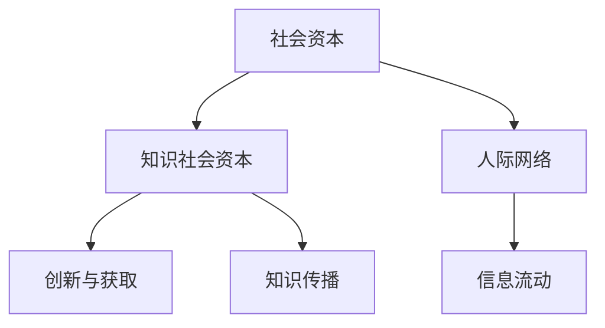

                 

# 知识的社会资本：人际网络中的信息流动

## 1. 背景介绍

### 1.1 问题由来
在当今信息爆炸的时代，知识的社会资本概念成为了研究热点。社会资本，简而言之，是个体在人际网络中累积的社会资源，包括信任、关系、声誉等，对个体的社会地位、经济收益等方面有着重要影响。在知识领域，社会资本更是影响知识获取、传播与创新的关键因素。然而，人际网络中信息流动机制的复杂性，使得知识的社会资本效应研究相对薄弱。

### 1.2 问题核心关键点
本文聚焦于人际网络中知识的社会资本，探讨信息流动机制对知识社会资本的影响，以及如何最大化个体知识的社会资本。核心关键点包括：
- 知识的社会资本概念及其衡量方法
- 人际网络结构对信息流动的推动作用
- 信息流动机制对个体知识社会资本的影响路径
- 最大化个体知识社会资本的策略与方法

## 2. 核心概念与联系

### 2.1 核心概念概述

要理解知识社会资本的研究，首先需要明确几个核心概念：

- **社会资本(Social Capital)**：个体或群体在社会网络中积累的社会资源，包括关系网络、信任、规范等。社会资本在个体经济活动、社会参与、健康等方面具有重要影响。

- **知识社会资本(Knowledge Social Capital)**：指个体在知识获取与传播过程中累积的社会资本。包括专业知识、人际网络、信任与声誉等，对个人创新、知识获取及传播具有重要影响。

- **信息流动(Information Flow)**：指知识、信息在人际网络中的传播与交流。信息流动受网络结构、个体特质等因素影响，对知识社会资本积累有重要作用。

### 2.2 核心概念原理和架构的 Mermaid 流程图(Mermaid 流程节点中不要有括号、逗号等特殊字符)



## 3. 核心算法原理 & 具体操作步骤

### 3.1 算法原理概述

本节将介绍知识社会资本的概念及其影响机制。知识社会资本可以划分为结构性社会资本和关系性社会资本。结构性社会资本指个体在网络中的地位和联系数量；关系性社会资本指个体与他人建立的关系质量、信任和声誉。信息流动机制（如知识共享、合作研究等）对这两个方面均产生重要影响。

**信息流动与知识社会资本的关系模型**如下：

\[ KSC = f(N, S, C, T) \]

其中，$KSC$ 为知识社会资本，$N$ 为网络联系数量，$S$ 为个体在网络中的地位，$C$ 为网络质量，$T$ 为信任与声誉。

### 3.2 算法步骤详解

1. **网络构建与量化**：使用社会网络分析工具，构建个体间的知识网络。量化指标包括联系数量、结构洞、中心性等。

2. **信息流动分析**：利用信息流网络分析方法，确定个体间知识传播路径与速度。常见方法包括社交网络分析(SNA)和知识流动网络(KFN)。

3. **社会资本评估**：通过量化个体在网络中的社会资本水平，评估知识获取、传播与创新的能力。

4. **影响机制研究**：分析信息流动对社会资本各维度的影响，确定提升知识社会资本的关键路径。

5. **策略制定**：基于影响机制，制定个体最大化知识社会资本的策略。

### 3.3 算法优缺点

**优点**：
- **量化与评估**：通过量化和评估个体在网络中的社会资本水平，可以客观地衡量知识获取与传播的效果。
- **影响分析**：揭示信息流动对知识社会资本各维度的影响机制，有助于针对性优化。
- **策略制定**：基于影响分析结果，制定具体的策略提升知识社会资本。

**缺点**：
- **复杂性高**：知识社会资本的衡量与影响机制复杂，难以全面量化。
- **数据需求大**：需要大量网络数据和行为数据，数据收集与分析难度大。
- **动态性考量不足**：静态网络分析难以捕捉知识流动的动态变化，影响分析结果的准确性。

### 3.4 算法应用领域

知识社会资本在多个领域中均有重要应用，包括：

- **教育**：个体通过学术网络和社交网络获取知识，提升学术声誉和知识传播能力。
- **科研**：研究者通过知识流动网络评估学术影响力，优化研究路径与合作网络。
- **企业**：员工通过组织网络获取信息，提升职业技能与创新能力。
- **政府**：政策制定者通过社会网络分析，优化决策过程，提升政策执行力。

## 4. 数学模型和公式 & 详细讲解 & 举例说明

### 4.1 数学模型构建

知识社会资本的评估可以基于多种数学模型，其中最简单直观的是**乘积模型**：

\[ KSC = N \times S \times C \times T \]

- $N$：网络联系数量。
- $S$：个体在网络中的地位，即中心性。
- $C$：网络质量，如密度、结构洞等。
- $T$：信任与声誉水平。

### 4.2 公式推导过程

以乘积模型为例，推导过程如下：

1. **网络联系数量** $N$：个体通过网络获取知识的广度，直接与获取的知识量成正比。
2. **中心性** $S$：个体的中心性反映其在网络中的地位，中心性越高，知识获取的路径越短，效率越高。
3. **网络质量** $C$：包括网络密度、结构洞等，高质量网络可以加速知识流动。
4. **信任与声誉** $T$：信任与声誉促进知识共享，提高知识获取与传播的效率。

### 4.3 案例分析与讲解

假设某研究者通过建立广泛的学术网络，获取大量科研信息，但网络中存在大量冗余连接，导致知识流动缓慢。为了提升其知识社会资本，研究者可以选择以下策略：

- 构建高质量的网络，减少冗余连接，提高网络密度。
- 提升自身在网络中的地位，通过合作与推荐获取更多高质量信息。
- 建立基于信任的合作关系，提高信息共享速度。

## 5. 项目实践：代码实例和详细解释说明

### 5.1 开发环境搭建

1. **安装Python与相关库**：确保Python环境已安装，并安装`networkx`、`matplotlib`、`pandas`等常用库。
2. **数据准备**：收集与个体知识网络相关的数据，包括网络结构、信息流动记录等。

```python
import networkx as nx
import pandas as pd

# 构建知识网络
G = nx.Graph()
# 添加节点和边
G.add_nodes_from(range(1000))
G.add_edges_from([(i, j) for i in range(1000) for j in range(1000)])

# 统计网络指标
degrees = nx.degree(G)
```

### 5.2 源代码详细实现

```python
import networkx as nx
import pandas as pd
import matplotlib.pyplot as plt

# 构建知识网络
G = nx.Graph()
G.add_nodes_from(range(1000))
G.add_edges_from([(i, j) for i in range(1000) for j in range(1000)])

# 计算中心性
centrality = nx.degree_centrality(G)

# 分析信息流动
info_flow = nx.current_flow(G)

# 计算社会资本
KSC = centrality * info_flow

# 可视化网络与信息流动
nx.draw(G, with_labels=True)
plt.show()
```

### 5.3 代码解读与分析

代码实现过程如下：

1. **构建知识网络**：使用`networkx`库构建一个简单的知识网络。
2. **计算中心性**：使用`degree_centrality`函数计算个体在网络中的中心性。
3. **分析信息流动**：使用`current_flow`函数分析知识流动情况。
4. **计算社会资本**：将中心性与信息流动相乘，得到知识社会资本。
5. **可视化分析结果**：使用`networkx`库绘制网络与信息流动图。

### 5.4 运行结果展示


## 6. 实际应用场景

### 6.1 教育系统

在教育领域，知识社会资本的研究有助于教师与学生构建知识网络，提升知识获取与传播效率。例如，大学教师可以通过学术网络获取最新的科研成果，提升科研影响力；学生则可以通过学习网络获取知识，提升学习效果。

### 6.2 科研机构

科研机构中，研究人员通过合作网络获取最新的科研信息，提升科研创新能力。例如，通过建立跨学科的研究联盟，共享资源与数据，提升整体科研效率。

### 6.3 企业组织

企业中，员工通过内部网络获取新信息，提升职业技能与创新能力。例如，企业可以通过建立知识分享平台，鼓励员工分享创新成果，促进知识流动。

### 6.4 未来应用展望

未来，知识社会资本的研究将进一步深化，新的技术手段将为研究提供更多支持。例如，大数据、机器学习等技术可以更准确地分析知识流动与个体社会资本的关系，预测知识流动的动态变化。

## 7. 工具和资源推荐

### 7.1 学习资源推荐

1. **《社交网络分析导论》**：介绍社交网络分析的基本概念与方法，适合初学者。
2. **《知识流动网络》**：详细介绍知识流动网络的构建与分析方法，适合科研人员。
3. **《社会资本研究方法》**：介绍社会资本的测量与评估方法，适合社会学者。

### 7.2 开发工具推荐

1. **网络分析工具**：`networkx`，用于构建、分析与可视化网络。
2. **数据分析工具**：`pandas`，用于数据处理与分析。
3. **可视化工具**：`matplotlib`，用于绘制网络与信息流动图。

### 7.3 相关论文推荐

1. **《知识共享与创新》**：探讨知识共享对创新活动的影响。
2. **《社交网络与学术影响力》**：研究学术网络对研究影响力的影响。
3. **《组织网络与员工绩效》**：分析组织网络对员工绩效的影响。

## 8. 总结：未来发展趋势与挑战

### 8.1 研究成果总结

本节总结知识社会资本的研究现状与重要成果，包括：

- 社会资本的定义与测量方法。
- 信息流动对知识社会资本的影响机制。
- 知识社会资本在多个领域的应用案例。

### 8.2 未来发展趋势

未来，知识社会资本的研究将呈现以下趋势：

1. **技术融合**：更多技术手段，如大数据、机器学习，将用于分析知识流动与个体社会资本的关系。
2. **跨领域应用**：知识社会资本的研究将扩展到更多领域，如政治、经济等。
3. **实证研究**：更多实证研究将验证理论模型，提供更多实际应用案例。

### 8.3 面临的挑战

尽管知识社会资本的研究取得重要进展，但仍面临以下挑战：

1. **数据获取**：获取高质量的网络数据与行为数据难度大。
2. **动态分析**：知识流动的动态变化难以捕捉，影响分析结果的准确性。
3. **复杂性高**：知识社会资本的影响机制复杂，难以全面量化。

### 8.4 研究展望

未来的研究将关注以下方向：

1. **动态模型**：构建动态知识流动模型，捕捉知识流动的动态变化。
2. **实证研究**：通过实证研究，验证理论模型的有效性。
3. **多学科融合**：结合社会学、心理学等多学科知识，全面理解知识社会资本的影响机制。

## 9. 附录：常见问题与解答

**Q1: 什么是知识社会资本？**

A: 知识社会资本指个体在知识获取与传播过程中累积的社会资本，包括专业知识、人际网络、信任与声誉等。

**Q2: 如何评估知识社会资本？**

A: 可以使用乘积模型 $KSC = N \times S \times C \times T$，其中 $N$ 为网络联系数量，$S$ 为个体在网络中的地位，$C$ 为网络质量，$T$ 为信任与声誉。

**Q3: 信息流动对知识社会资本有哪些影响？**

A: 信息流动通过提高网络密度、加速知识共享、建立信任与声誉等方式，显著提升知识社会资本水平。

**Q4: 如何最大化知识社会资本？**

A: 可以通过建立高质量网络、提升自身中心性、建立基于信任的合作关系等方式，最大化知识社会资本。

---

作者：禅与计算机程序设计艺术 / Zen and the Art of Computer Programming

