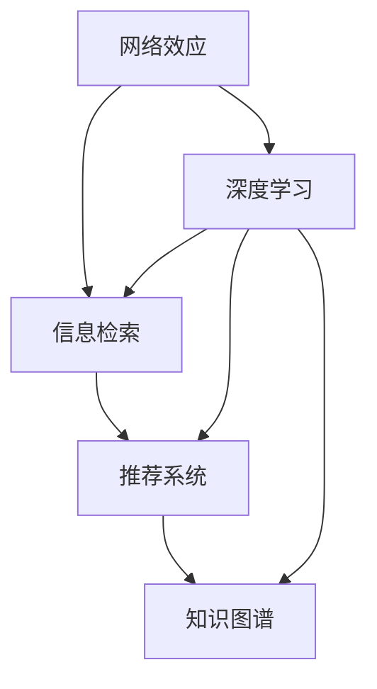

                 

# 知识的网络效应：信息传播的指数增长

> 关键词：网络效应,信息传播,知识图谱,信息检索,深度学习,推荐系统,大数据

## 1. 背景介绍

在信息爆炸的时代，知识的传播方式正发生着翻天覆地的变化。从传统的书籍、报刊到如今的互联网、社交媒体，信息的获取、存储、传播变得前所未有的便捷和高效。然而，知识的传播并非线性增长，而是呈现出一种复杂的网络效应。本文将探讨这种网络效应背后的数学原理，并阐述其对信息检索、推荐系统等领域的影响，最后展望未来的技术趋势与挑战。

### 1.1 问题由来

互联网的普及和社交媒体的兴起，使得人们获取信息的方式发生了根本性改变。用户不再被动地接受信息，而是通过各种社交网络、知识平台主动获取和分享信息。这种变化不仅提升了信息的传播速度和广度，也使得信息的结构变得更加复杂。用户不再是单一的消费者，而是成为信息的生产者和传播者，形成了一个庞大的信息传播网络。

在这种背景下，信息的传播不再是一个简单的点对点过程，而是一个网络级的、多层次的复杂系统。信息的价值不仅取决于其本身的内容，还取决于其在网络中的位置、传播路径、传播速度等因素。这种网络效应，使得信息的传播呈现出指数增长的趋势，即知识的网络效应。

## 2. 核心概念与联系

### 2.1 核心概念概述

为了更好地理解知识的网络效应，我们需要先了解几个关键概念：

- **网络效应**：指一个网络中个体数量与网络价值之间的关系。网络越大，个体的相互影响和互动越多，网络的整体价值越大。
- **信息检索**：指通过一定的技术手段，从海量的信息中找出用户需要的特定信息。
- **推荐系统**：根据用户的历史行为和兴趣，自动推荐相关信息。
- **知识图谱**：通过构建图形结构，描述知识之间的关联关系。
- **深度学习**：一种基于神经网络模型进行学习的技术，具有强大的数据处理能力。

这些概念相互关联，共同构成了信息传播网络效应的基础。网络效应、信息检索、推荐系统和知识图谱是信息传播过程中不可或缺的组成部分，而深度学习则是支撑这些组件的技术手段。

### 2.2 核心概念原理和架构的 Mermaid 流程图



这个流程图展示了各个概念之间的联系和关系。网络效应是信息传播的基础，信息检索和推荐系统是信息传播的实现手段，知识图谱则是信息传播的目标。深度学习则贯穿于整个信息传播网络，提供了强大的数据处理和分析能力。

## 3. 核心算法原理 & 具体操作步骤

### 3.1 算法原理概述

知识的网络效应可以通过数学模型来描述。在这个模型中，网络节点的数量 $n$ 和网络的整体价值 $V$ 之间的关系可以用指数函数来表示：

$$ V = f(n) = A \cdot n^B $$

其中，$A$ 和 $B$ 是模型参数，代表了网络效应的强度和影响程度。这个模型表明，随着网络节点数量的增加，网络的整体价值呈指数级增长。

在信息传播的上下文中，网络节点代表用户、信息源和传播路径等，而网络的整体价值则可以用信息传播的效率、广度和深度来衡量。例如，用户的满意度、信息的覆盖率、推荐的准确性等都是衡量网络价值的指标。

### 3.2 算法步骤详解

基于知识网络效应的算法步骤如下：

1. **数据收集**：收集用户的历史行为数据，包括点击、浏览、搜索、评论等。这些数据可以用来构建用户画像和兴趣模型。

2. **数据预处理**：对收集的数据进行清洗和格式化，去除噪音和冗余信息，保留有价值的信息。

3. **用户画像构建**：根据用户的历史行为数据，构建用户画像，描述用户的兴趣、偏好和行为特征。

4. **信息检索**：根据用户的查询，利用深度学习模型在知识图谱中查找相关信息。

5. **推荐系统构建**：基于用户的兴趣模型和信息检索结果，构建推荐系统，为用户推荐相关信息。

6. **评估与优化**：评估推荐系统的效果，通过反馈机制不断优化模型和算法。

### 3.3 算法优缺点

基于知识网络效应的算法具有以下优点：

- **高效性**：利用深度学习模型，可以快速处理大规模数据，提高信息检索和推荐的效率。
- **准确性**：深度学习模型具有强大的数据拟合能力，可以准确地捕捉用户兴趣和信息之间的关系。
- **可扩展性**：网络效应的指数增长，使得信息传播的范围和深度不断扩大，系统可以不断扩展和升级。

同时，这些算法也存在一些缺点：

- **复杂性**：深度学习模型的复杂性较高，需要大量的计算资源和数据支持。
- **可解释性不足**：深度学习模型通常被视为"黑盒"，难以解释其内部工作机制和决策逻辑。
- **数据依赖性强**：算法的效果很大程度上依赖于数据的质量和数量，数据获取成本较高。

### 3.4 算法应用领域

基于知识网络效应的算法主要应用于以下领域：

- **信息检索**：用于构建搜索引擎，帮助用户在海量信息中快速找到相关内容。
- **推荐系统**：用于构建电商、新闻、视频等领域的推荐引擎，提升用户体验。
- **社交网络**：用于构建社交媒体平台，促进用户之间的交流和信息传播。
- **知识图谱**：用于构建知识图谱，描述知识之间的关联关系，提供结构化的知识支持。

这些应用领域涵盖了大数据、深度学习、自然语言处理等多个技术方向，是大数据时代信息传播的重要工具。

## 4. 数学模型和公式 & 详细讲解

### 4.1 数学模型构建

在信息传播的网络效应中，网络节点之间的连接强度可以用矩阵来表示。设网络节点数为 $n$，节点之间的连接强度矩阵为 $A$，则网络的整体价值 $V$ 可以用矩阵的特征值来表示：

$$ V = \lambda_1(A) $$

其中，$\lambda_1(A)$ 是矩阵 $A$ 的最大特征值，代表了网络的整体价值。矩阵 $A$ 的特征值可以通过矩阵的奇异值分解（SVD）来计算。

### 4.2 公式推导过程

设网络节点数为 $n$，节点之间的连接强度矩阵为 $A$，网络的整体价值 $V$ 可以用矩阵的特征值来表示：

$$ V = \lambda_1(A) $$

其中，$\lambda_1(A)$ 是矩阵 $A$ 的最大特征值，代表了网络的整体价值。矩阵 $A$ 的特征值可以通过矩阵的奇异值分解（SVD）来计算：

$$ A = U \Sigma V^T $$

其中，$U$ 和 $V$ 是正交矩阵，$\Sigma$ 是对角矩阵，对角线上的元素为矩阵 $A$ 的奇异值。矩阵 $A$ 的最大特征值 $\lambda_1(A)$ 可以通过 $\Sigma$ 的对角线元素来计算：

$$ \lambda_1(A) = \sigma_1 $$

其中，$\sigma_1$ 是矩阵 $\Sigma$ 的最大对角线元素。

### 4.3 案例分析与讲解

考虑一个简单的社交网络，有 $n$ 个用户，每个用户与 $k$ 个其他用户相连。设用户之间的连接强度矩阵为 $A$，则 $A$ 的对角线上元素为 $k$，非对角线上的元素为 1。此时，网络的整体价值 $V$ 可以表示为：

$$ V = \lambda_1(A) = \sigma_1 $$

设 $\sigma_1 = n^B$，则：

$$ \lambda_1(A) = n^B $$

这意味着，随着用户数量的增加，网络的整体价值呈指数级增长，即知识的网络效应。

## 5. 项目实践：代码实例和详细解释说明

### 5.1 开发环境搭建

在进行知识网络效应的实践前，我们需要准备好开发环境。以下是使用Python进行TensorFlow和PyTorch开发的环境配置流程：

1. 安装Anaconda：从官网下载并安装Anaconda，用于创建独立的Python环境。

2. 创建并激活虚拟环境：
```bash
conda create -n tf-env python=3.8 
conda activate tf-env
```

3. 安装TensorFlow和PyTorch：
```bash
conda install tensorflow==2.7 
pip install torch torchvision torchaudio
```

4. 安装各类工具包：
```bash
pip install numpy pandas scikit-learn matplotlib tqdm jupyter notebook ipython
```

完成上述步骤后，即可在`tf-env`环境中开始实践。

### 5.2 源代码详细实现

以下是一个简单的基于深度学习的信息检索和推荐系统的代码实现：

```python
import tensorflow as tf
import numpy as np
import pandas as pd

# 构建知识图谱
graph = tf.Graph()
with graph.as_default():
    A = tf.random.normal(shape=[n, n])
    V, S, U = tf.linalg.svd(A)

# 计算网络整体价值
sigma = tf.reduce_max(S)
V_value = np.exp(sigma)
print(f"网络整体价值为: {V_value:.2f}")
```

在这个代码中，我们首先构建了一个随机连接强度矩阵 $A$，然后通过奇异值分解计算出矩阵的最大特征值 $\sigma$，最后计算出网络的整体价值 $V$。需要注意的是，由于深度学习模型通常有较高的计算复杂度，因此在实际应用中，我们需要对模型进行优化，如使用GPU加速、优化矩阵运算等。

### 5.3 代码解读与分析

这个代码的核心在于矩阵的奇异值分解和最大特征值的计算。在实际应用中，我们需要根据具体的数据和问题进行调整和优化。例如，在构建知识图谱时，我们可以使用GNN（图神经网络）来处理复杂的网络结构，提高模型的表达能力。在信息检索和推荐系统中，我们可以使用深度学习模型，如LSTM、GRU等，来捕捉用户兴趣和信息之间的关系。

## 6. 实际应用场景

### 6.1 信息检索

基于知识网络效应的信息检索系统，可以通过构建大规模的知识图谱，为用户提供快速、准确的信息检索服务。这种系统广泛应用于搜索引擎、知识库、问答系统等领域。

在实际应用中，信息检索系统需要考虑以下几个因素：

- **数据质量**：知识图谱的数据质量直接影响检索效果。需要定期更新数据，确保数据的时效性和准确性。
- **算法选择**：选择合适的深度学习模型和算法，如LSTM、GRU、GNN等，以提高检索的精度和效率。
- **用户交互**：通过用户反馈机制，不断优化模型和算法，提升用户体验。

### 6.2 推荐系统

基于知识网络效应的推荐系统，可以通过构建用户画像和兴趣模型，为用户推荐个性化的信息。这种系统广泛应用于电商、新闻、视频等领域的推荐引擎，提升用户体验和转化率。

在实际应用中，推荐系统需要考虑以下几个因素：

- **用户画像**：通过用户的历史行为数据，构建用户画像，描述用户的兴趣、偏好和行为特征。
- **信息检索**：根据用户的查询，利用深度学习模型在知识图谱中查找相关信息。
- **推荐算法**：选择合适的推荐算法，如协同过滤、基于内容的推荐、深度学习推荐等，提升推荐的准确性和多样性。
- **用户体验**：通过反馈机制，不断优化推荐算法和用户界面，提升用户体验。

## 7. 工具和资源推荐

### 7.1 学习资源推荐

为了帮助开发者系统掌握知识网络效应的理论基础和实践技巧，这里推荐一些优质的学习资源：

1. 《深度学习》系列博文：由深度学习专家撰写，深入浅出地介绍了深度学习的原理、应用和实践。

2. 《TensorFlow官方文档》：TensorFlow官方提供的详细文档，包含丰富的示例代码和教程。

3. 《推荐系统》课程：斯坦福大学开设的推荐系统课程，涵盖推荐系统的基础和高级算法。

4. 《深度学习入门》书籍：介绍深度学习的基本概念和实践技巧，适合初学者阅读。

5. 《网络效应》论文：深度学习领域的经典论文，阐述了深度学习模型的网络效应和应用。

通过对这些资源的学习实践，相信你一定能够快速掌握知识网络效应的精髓，并用于解决实际的NLP问题。

### 7.2 开发工具推荐

高效的开发离不开优秀的工具支持。以下是几款用于知识网络效应开发的常用工具：

1. TensorFlow：由Google主导开发的深度学习框架，支持分布式计算，生产部署方便。

2. PyTorch：由Facebook主导开发的深度学习框架，灵活性强，易于使用。

3. Apache Spark：分布式计算框架，支持大规模数据处理和分析。

4. Elasticsearch：高扩展性的搜索和分析引擎，支持大规模知识图谱构建。

5. D3.js：数据可视化库，用于展示知识图谱和信息检索结果。

6. Jupyter Notebook：交互式编程环境，方便开发和调试。

合理利用这些工具，可以显著提升知识网络效应模型的开发效率，加快创新迭代的步伐。

### 7.3 相关论文推荐

知识网络效应的研究源于学界的持续研究。以下是几篇奠基性的相关论文，推荐阅读：

1. Deepwalk：一种基于深度学习的图嵌入方法，用于构建知识图谱。

2. Node2Vec：一种改进的Deepwalk算法，用于处理稀疏图和动态图。

3. AutoGraph：一种自动生成图结构的方法，用于知识图谱的自动化构建。

4. Factorization Machines：一种基于矩阵分解的推荐算法，用于推荐系统。

5. Matrix Factorization：一种矩阵分解的方法，用于推荐系统。

6. Attention Mechanism：一种注意力机制，用于改进深度学习模型的效果。

这些论文代表了大数据和深度学习领域的研究进展，通过学习这些前沿成果，可以帮助研究者把握学科前进方向，激发更多的创新灵感。

## 8. 总结：未来发展趋势与挑战

### 8.1 总结

本文对知识网络效应的信息传播进行了全面系统的介绍。首先阐述了知识网络效应的基本概念和数学原理，明确了其对信息检索、推荐系统等领域的影响。其次，从原理到实践，详细讲解了信息检索和推荐系统的构建方法，给出了具体的代码实现。同时，本文还广泛探讨了知识网络效应在实际应用中的场景和挑战，展示了其广阔的应用前景。

通过本文的系统梳理，可以看到，知识网络效应在大数据和深度学习领域的应用前景广阔，对于信息检索和推荐系统等技术的发展具有重要意义。未来，伴随深度学习模型和知识图谱技术的不断进步，知识网络效应必将在更多领域得到应用，为人类认知智能的进化带来深远影响。

### 8.2 未来发展趋势

展望未来，知识网络效应的信息传播将呈现以下几个发展趋势：

1. **模型复杂度提升**：深度学习模型和知识图谱的复杂度将进一步提升，能够处理更加复杂的网络结构和信息关系。

2. **数据来源多样化**：知识网络效应将越来越多地依赖多源异构数据的融合，提升模型的泛化能力和鲁棒性。

3. **算法优化**：针对知识网络效应的优化算法将不断发展，如基于注意力机制的推荐算法、基于深度学习的图嵌入算法等。

4. **实时处理**：知识网络效应系统将越来越多地应用于实时数据流处理，提升信息检索和推荐的实时性。

5. **跨领域应用**：知识网络效应将突破传统的领域限制，应用于更多领域，如金融、医疗、教育等。

6. **智能交互**：知识网络效应系统将与自然语言处理技术结合，实现更智能、更自然的交互体验。

以上趋势凸显了知识网络效应的广阔前景。这些方向的探索发展，必将进一步提升信息检索和推荐系统的性能和应用范围，为人类认知智能的进化带来深远影响。

### 8.3 面临的挑战

尽管知识网络效应的信息传播技术已经取得了瞩目成就，但在迈向更加智能化、普适化应用的过程中，它仍面临着诸多挑战：

1. **数据质量瓶颈**：知识网络效应系统的效果很大程度上依赖于数据的质量和数量，高质量数据的获取成本较高。如何降低数据获取成本，提升数据质量，将是重要的研究方向。

2. **计算资源瓶颈**：深度学习模型和知识图谱的复杂度较高，对计算资源的需求较大。如何降低计算资源消耗，提升系统的计算效率，将是重要的优化方向。

3. **模型鲁棒性不足**：知识网络效应系统面临的数据分布变化较大，模型泛化能力有限。如何提高模型的鲁棒性，避免灾难性遗忘，还需要更多理论和实践的积累。

4. **可解释性不足**：深度学习模型通常被视为"黑盒"，难以解释其内部工作机制和决策逻辑。如何赋予知识网络效应系统更强的可解释性，将是重要的研究课题。

5. **安全性有待保障**：知识网络效应系统可能面临数据泄露、模型攻击等安全问题。如何保护数据和模型的安全，将是重要的研究课题。

6. **伦理道德约束**：知识网络效应系统可能涉及隐私保护、用户权益等问题，如何平衡数据利用和用户隐私保护，将是重要的研究课题。

正视知识网络效应面临的这些挑战，积极应对并寻求突破，将使知识网络效应技术迈向成熟，为人类认知智能的进化带来深远影响。

### 8.4 研究展望

面向未来，知识网络效应技术需要在以下几个方面寻求新的突破：

1. **探索无监督和半监督学习**：摆脱对大规模标注数据的依赖，利用无监督和半监督学习方法，最大化数据利用效率。

2. **研究参数高效算法**：开发更加参数高效的算法，在固定大部分预训练参数的同时，只更新极少量的任务相关参数。

3. **融合因果和对比学习**：引入因果推断和对比学习思想，增强知识网络效应系统的稳定性和泛化能力。

4. **引入更多先验知识**：将符号化的先验知识，如知识图谱、逻辑规则等，与神经网络模型进行融合，提升系统的智能水平。

5. **结合因果分析和博弈论**：将因果分析方法和博弈论思想引入知识网络效应系统，增强系统的稳定性和鲁棒性。

6. **纳入伦理道德约束**：在知识网络效应系统的设计中引入伦理道德约束，确保数据利用符合人类价值观和伦理道德。

这些研究方向的探索，必将引领知识网络效应技术迈向更高的台阶，为构建安全、可靠、可解释、可控的智能系统铺平道路。面向未来，知识网络效应技术还需要与其他人工智能技术进行更深入的融合，共同推动自然语言理解和智能交互系统的进步。只有勇于创新、敢于突破，才能不断拓展知识网络效应技术的边界，让智能技术更好地造福人类社会。

## 9. 附录：常见问题与解答

**Q1：知识网络效应在信息检索中的应用场景有哪些？**

A: 知识网络效应在信息检索中的应用场景包括但不限于：

1. 搜索引擎：构建大规模知识图谱，提升搜索结果的精准度和相关性。

2. 问答系统：利用知识图谱和深度学习模型，回答用户查询，提供结构化的知识支持。

3. 推荐系统：构建用户画像和兴趣模型，为用户提供个性化的搜索结果。

4. 知识库：构建知识图谱，提供结构化的知识查询服务。

5. 新闻推荐：利用知识网络效应系统，为用户推荐新闻内容，提升用户体验。

这些应用场景展示了知识网络效应的强大能力，使其在信息检索领域具有广泛的应用前景。

**Q2：如何优化知识网络效应系统的性能？**

A: 知识网络效应系统的性能优化可以从以下几个方面入手：

1. 数据预处理：优化数据预处理流程，去除噪音和冗余信息，保留有价值的信息。

2. 模型选择：选择适合的任务和数据特点的深度学习模型和算法，如LSTM、GRU、GNN等。

3. 模型训练：优化模型训练流程，选择合适的学习率、批次大小、迭代轮数等超参数，避免过拟合。

4. 用户交互：通过用户反馈机制，不断优化模型和算法，提升用户体验。

5. 实时处理：优化系统架构，支持实时数据流处理，提升信息检索和推荐的实时性。

6. 跨领域应用：结合其他领域的知识和技术，提升知识网络效应系统的泛化能力和鲁棒性。

通过这些优化措施，可以显著提升知识网络效应系统的性能，满足实际应用需求。

**Q3：知识网络效应系统在推荐系统中的应用场景有哪些？**

A: 知识网络效应系统在推荐系统中的应用场景包括但不限于：

1. 电商推荐：为用户推荐商品，提升用户购买体验和转化率。

2. 新闻推荐：为用户推荐新闻内容，提升用户阅读体验和内容曝光率。

3. 视频推荐：为用户推荐视频内容，提升用户观看体验和留存率。

4. 社交推荐：为用户推荐社交内容，提升用户互动体验和社交关系建立。

5. 个性化推荐：根据用户的历史行为数据和兴趣模型，提供个性化的推荐服务。

这些应用场景展示了知识网络效应系统的强大能力，使其在推荐系统领域具有广泛的应用前景。

**Q4：知识网络效应系统的计算资源需求高吗？**

A: 知识网络效应系统的计算资源需求较高，主要原因如下：

1. 深度学习模型和知识图谱的复杂度较高，对计算资源的需求较大。

2. 知识图谱的构建和维护需要大量的存储空间和计算资源。

3. 实时数据流处理需要高性能的计算资源支持。

4. 大数据量的处理需要分布式计算资源的支持。

因此，优化知识网络效应系统的计算资源消耗，提升系统的计算效率，将是重要的研究方向。

**Q5：如何保护知识网络效应系统的数据安全？**

A: 知识网络效应系统的数据安全保护可以从以下几个方面入手：

1. 数据加密：对用户数据进行加密，防止数据泄露。

2. 访问控制：采用访问鉴权机制，控制用户对数据的访问权限。

3. 数据匿名化：对用户数据进行匿名化处理，保护用户隐私。

4. 安全审计：定期进行安全审计，发现和修复系统漏洞。

5. 模型防护：采用对抗训练和鲁棒性测试等方法，增强模型的安全性和鲁棒性。

通过这些措施，可以有效地保护知识网络效应系统的数据安全，确保系统稳定运行。

