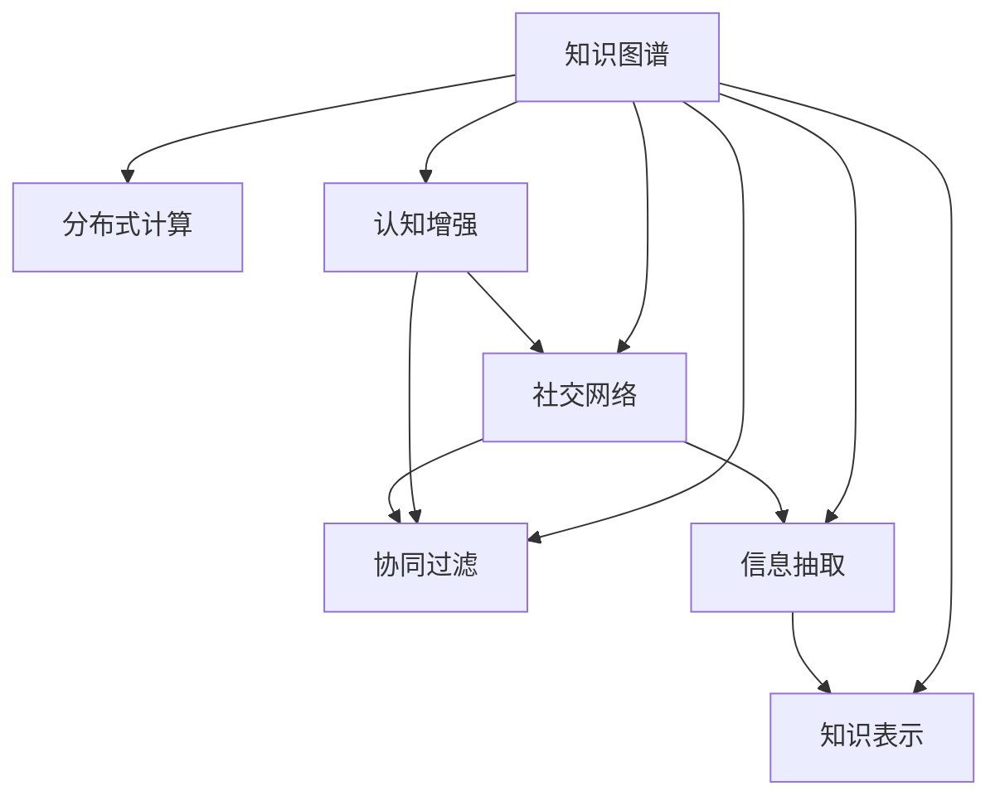

                 

# 知识的网络效应：集体智慧与知识传播

> 关键词：知识网络效应, 集体智慧, 知识传播, 知识图谱, 分布式计算, 认知增强

## 1. 背景介绍

### 1.1 问题由来
在信息爆炸的时代，人类获取知识的方式和途径越来越多样化，从传统图书馆、报纸、电视，到现在的互联网、社交媒体、在线课程等。这种多样性不仅改变了知识的传播方式，也深刻影响了知识的学习和利用效率。随着人工智能技术的发展，我们越来越认识到，知识的传播和利用不仅仅是简单的信息传递，更是集体智慧的集结与共享。

知识的网络效应，即知识通过网络传播和共享所带来的效率提升和价值放大现象，是现代科技领域的一个核心议题。尤其是在人工智能领域，如何利用网络效应，高效地传播和共享知识，是提高智能系统性能和创新能力的关键。

### 1.2 问题核心关键点
网络效应通常分为直接网络效应和间接网络效应两种。直接网络效应指的是网络价值随用户数量的增加而增加，而间接网络效应则是指网络价值随节点间的连接强度或质量提升而提升。

在人工智能领域，知识传播的网络效应体现在以下几个方面：

1. **协同增强**：多个人协同合作，可以生成比单独个体更加全面和深入的知识。
2. **知识扩散**：通过网络传播，新知识可以快速扩散到更多人，加速知识的迭代和创新。
3. **价值放大**：网络中的知识可以通过共享和应用，带来更大的社会和经济价值。

这些核心关键点不仅体现了知识传播的复杂性，也揭示了知识网络效应的强大潜力。

## 2. 核心概念与联系

### 2.1 核心概念概述

为了更好地理解知识网络效应及其在人工智能中的应用，本节将介绍几个关键概念及其相互联系：

- **知识图谱(Knowledge Graph)**：一种描述实体及其关系的图结构，用于表示和组织大规模知识库。
- **分布式计算(Distributed Computing)**：通过将任务分配给多个计算机或处理器并行处理，提高计算效率和系统可靠性。
- **认知增强(Cognitive Enhancement)**：通过人工智能技术，增强人类学习和认知能力，实现知识的深度挖掘和创新。
- **社交网络(Social Network)**：人与人之间基于共同兴趣、活动或关系建立的社会结构，用于知识传播和交流。
- **协同过滤(Collaborative Filtering)**：一种推荐算法，通过用户之间的相似度，推荐用户可能感兴趣的内容。
- **信息抽取(Information Extraction)**：从非结构化数据中提取出结构化信息，用于知识图谱的构建和更新。
- **知识表示(Knowledge Representation)**：用某种形式表达知识的规则或约定，用于存储和传播知识。

这些核心概念之间的逻辑关系可以通过以下Mermaid流程图来展示：



这个流程图展示了这个概念体系的层次关系和数据流动方向：

1. 知识图谱是整个体系的基础，用于存储和组织知识。
2. 分布式计算和认知增强是处理知识的手段，用于高效处理和增强知识。
3. 社交网络是知识传播的渠道，用于加速知识扩散和共享。
4. 协同过滤是知识推荐的策略，用于个性化推荐知识。
5. 信息抽取是知识提取的方法，用于从非结构化数据中提取出结构化信息。
6. 知识表示是知识的表达方式，用于存储和传播知识。

这些概念共同构成了知识网络效应的基本框架，为知识的传播和共享提供了理论基础。

## 3. 核心算法原理 & 具体操作步骤
### 3.1 算法原理概述

知识网络效应在人工智能中的应用，主要体现在以下几个方面：

- **协同增强**：通过协同学习、知识众包等方式，利用集体的智慧，生成更加全面和深入的知识。
- **知识扩散**：通过社交网络和推荐系统，将新知识快速传播到更广泛的人群中，加速知识的迭代和创新。
- **价值放大**：通过分布式计算和认知增强，将知识应用到实际问题中，产生更大的社会和经济价值。

这些应用背后的算法原理，主要包括：

1. **协同过滤算法**：通过分析用户之间的相似度，推荐用户可能感兴趣的知识。
2. **分布式知识图谱构建算法**：将大规模知识图谱分布式地存储和计算，提高知识处理的效率和准确性。
3. **认知增强算法**：利用深度学习、自然语言处理等技术，增强人类学习和认知能力，实现知识的深度挖掘和创新。
4. **社交网络分析算法**：分析社交网络中的知识流动和传播规律，优化知识传播策略。

### 3.2 算法步骤详解

下面以知识图谱的分布式构建和优化为例，详细介绍其操作步骤：

#### 3.2.1 数据准备
- 收集和整理结构化与非结构化数据，如文档、网页、图片等。
- 提取文本中的实体、关系和属性，构建知识图谱的基本单元。

#### 3.2.2 分布式存储
- 使用分布式文件系统（如Hadoop HDFS、Amazon S3等）将数据分片存储在多个节点上。
- 设计高效的存储格式（如Apache Parquet、Avro等），支持高效的数据读写和查询。

#### 3.2.3 分布式计算
- 设计分布式计算框架（如Apache Spark、Flink等），并行处理大规模数据。
- 使用MapReduce、Spark Streaming等技术，高效处理和计算知识图谱。

#### 3.2.4 知识图谱优化
- 使用机器学习算法（如聚类、分类等），对知识图谱进行优化和增强。
- 引入对抗训练、迁移学习等技术，提高知识图谱的鲁棒性和泛化能力。

#### 3.2.5 分布式存储与计算结合
- 设计高效的图算法（如PageRank、Greedy算法等），在分布式系统中进行图遍历和计算。
- 优化图算法，提高知识图谱的查询和推理效率。

#### 3.2.6 协同增强
- 利用协同过滤算法，从用户行为数据中挖掘知识图谱的特征和关系。
- 引入知识众包、协同学习等机制，增强知识图谱的知识来源。

### 3.3 算法优缺点

分布式知识图谱构建算法具有以下优点：

1. **高效处理大规模数据**：通过分布式计算，可以高效地处理和计算大规模数据，加速知识图谱的构建。
2. **鲁棒性高**：通过分布式存储和计算，可以提高知识图谱的鲁棒性和容错性。
3. **可扩展性强**：可以动态扩展计算和存储资源，适应不同规模和需求的知识图谱构建。

但该算法也存在以下缺点：

1. **数据一致性问题**：在分布式环境中，数据的读写和更新可能带来一致性问题，需要进行严格的协调和控制。
2. **通信开销大**：分布式计算需要频繁的节点间通信，增加了系统的通信开销和延迟。
3. **算法复杂度高**：分布式计算和存储需要设计复杂的算法和协议，增加了系统的设计和维护成本。

### 3.4 算法应用领域

知识图谱和分布式计算在多个领域都有广泛应用：

- **搜索引擎**：通过分布式知识图谱构建和优化，提升搜索结果的准确性和相关性。
- **推荐系统**：利用知识图谱的语义信息，进行更加精准和个性化的推荐。
- **智能客服**：通过知识图谱和分布式计算，提供高效和准确的客户服务。
- **金融风控**：利用知识图谱进行实体识别和关系抽取，提升金融风控的准确性和效率。
- **医疗健康**：通过知识图谱进行疾病诊断和知识推理，提高医疗服务的智能化水平。

## 4. 数学模型和公式 & 详细讲解  
### 4.1 数学模型构建

本节将使用数学语言对知识图谱的分布式构建和优化过程进行更加严格的刻画。

记知识图谱为 $G=(V,E)$，其中 $V$ 为节点集合，$E$ 为边集合。节点 $v_i$ 表示一个实体，边 $e_{ij}$ 表示 $v_i$ 和 $v_j$ 之间的语义关系。假设每个节点有 $d$ 个属性，则节点 $v_i$ 的属性向量为 $\mathbf{a}_i \in \mathbb{R}^d$。

定义节点之间的相似度矩阵 $S \in \mathbb{R}^{N \times N}$，其中 $S_{ij} = \mathbf{a}_i \cdot \mathbf{a}_j / (\|\mathbf{a}_i\|\|\mathbf{a}_j\|)$，用于衡量节点之间的相似度。

知识图谱的构建过程可以表示为：

$$
\min_{G} \mathcal{L}(G) = \frac{1}{2} \sum_{(i,j) \in E} ||e_{ij} - f(S_{ij})||^2 + \frac{\lambda}{2} \sum_{i=1}^N ||\mathbf{a}_i||^2
$$

其中 $\mathcal{L}(G)$ 为损失函数，$f$ 为节点关系函数，$\lambda$ 为正则化系数。

### 4.2 公式推导过程

在知识图谱的分布式构建过程中，我们需要将大规模的数据分布式地存储和计算。设 $S = [s_{ij}]_{N \times N}$ 为节点相似度矩阵，$M \in \mathbb{R}^{N \times N}$ 为数据矩阵，$P \in \mathbb{R}^{N \times N}$ 为计算矩阵，则有：

$$
S = M \cdot P
$$

假设 $M$ 和 $P$ 分别在节点 $i$ 和节点 $j$ 上存储，则有：

$$
s_{ij} = M_i \cdot P_j
$$

其中 $M_i$ 和 $P_j$ 分别为节点 $i$ 和节点 $j$ 上的数据和计算子矩阵。

将 $S$ 和 $M \cdot P$ 的误差平方和作为损失函数，则有：

$$
\mathcal{L} = \frac{1}{2} \sum_{(i,j) \in E} (s_{ij} - (M_i \cdot P_j))^2 + \frac{\lambda}{2} \sum_{i=1}^N ||\mathbf{a}_i||^2
$$

将 $S$ 和 $M \cdot P$ 分别在多个节点上并行计算，可以将计算任务分解为多个子任务：

$$
\mathcal{L} = \sum_{i=1}^N \sum_{j=1}^N \frac{1}{2} (s_{ij} - (M_i \cdot P_j))^2 + \frac{\lambda}{2} \sum_{i=1}^N ||\mathbf{a}_i||^2
$$

对于任意节点 $i$，其损失函数可以表示为：

$$
\mathcal{L}_i = \sum_{j=1}^N \frac{1}{2} (s_{ij} - (M_i \cdot P_j))^2 + \frac{\lambda}{2} ||\mathbf{a}_i||^2
$$

通过分布式优化算法（如Distributed Gradient Descent），可以并行地更新节点 $i$ 的属性向量 $\mathbf{a}_i$，从而实现知识图谱的分布式构建和优化。

### 4.3 案例分析与讲解

以下以推荐系统的协同过滤算法为例，详细分析其数学模型和公式推导。

在协同过滤算法中，我们利用用户之间的相似度，推荐用户可能感兴趣的知识。设用户 $u_i$ 和 $u_j$ 的相似度为 $s_{ij}$，用户 $u_i$ 对知识 $v_k$ 的评分向量为 $\mathbf{r}_{ik}$，则协同过滤算法的目标是最小化用户和知识之间的误差平方和，即：

$$
\min_{\mathbf{r}} \mathcal{L} = \frac{1}{2} \sum_{i=1}^N \sum_{j=1}^N \sum_{k=1}^K (r_{ik} - s_{ij} \cdot r_{jk})^2
$$

其中 $K$ 为知识的数量。

为了实现分布式优化，我们需要将损失函数分解为多个子任务。设 $\mathbf{r}_{ik} = M_i \cdot P_k$，其中 $M_i \in \mathbb{R}^{N \times N}$ 为用户评分矩阵，$P_k \in \mathbb{R}^{N \times N}$ 为知识评分矩阵。则有：

$$
\mathcal{L} = \frac{1}{2} \sum_{i=1}^N \sum_{j=1}^N \sum_{k=1}^K (M_i \cdot P_k - s_{ij} \cdot P_j)^2 + \frac{\lambda}{2} ||\mathbf{r}_i||^2
$$

将损失函数在每个用户 $u_i$ 上进行优化，有：

$$
\mathcal{L}_i = \sum_{j=1}^N \sum_{k=1}^K (M_i \cdot P_k - s_{ij} \cdot P_j)^2 + \frac{\lambda}{2} ||\mathbf{r}_i||^2
$$

通过分布式优化算法，并行计算每个用户 $u_i$ 的属性向量 $\mathbf{r}_i$，从而实现协同过滤算法的分布式构建和优化。

## 5. 项目实践：代码实例和详细解释说明
### 5.1 开发环境搭建

在进行知识图谱的分布式构建和优化实践前，我们需要准备好开发环境。以下是使用Python进行PyTorch和Dask开发的开发环境配置流程：

1. 安装Anaconda：从官网下载并安装Anaconda，用于创建独立的Python环境。

2. 创建并激活虚拟环境：
```bash
conda create -n graph-env python=3.8 
conda activate graph-env
```

3. 安装PyTorch：根据CUDA版本，从官网获取对应的安装命令。例如：
```bash
conda install pytorch torchvision torchaudio cudatoolkit=11.1 -c pytorch -c conda-forge
```

4. 安装Dask：
```bash
pip install dask
```

5. 安装各类工具包：
```bash
pip install numpy pandas scikit-learn matplotlib tqdm jupyter notebook ipython
```

完成上述步骤后，即可在`graph-env`环境中开始分布式知识图谱构建的实践。

### 5.2 源代码详细实现

这里我们以知识图谱的分布式构建为例，给出使用PyTorch和Dask进行分布式计算的Python代码实现。

首先，定义知识图谱的节点和边：

```python
import torch
from dask.distributed import Client, ClientGroup

# 定义节点和边
class Graph:
    def __init__(self, nodes, edges):
        self.nodes = nodes
        self.edges = edges
```

然后，定义节点和边的相似度计算函数：

```python
def similarity_matrix(nodes, edges, attributes):
    similarity = []
    for i, (node_i, node_j) in enumerate(edges):
        node_i_attrs = attributes[node_i]
        node_j_attrs = attributes[node_j]
        similarity.append(torch.dot(node_i_attrs, node_j_attrs) / (torch.norm(node_i_attrs) * torch.norm(node_j_attrs)))
    return torch.stack(similarity).t()
```

接下来，定义分布式计算函数：

```python
def distributed_calculate(matrix, dask_client):
    dask_client.calculate(matrix, compute=True)
```

最后，启动分布式计算并输出结果：

```python
if __name__ == '__main__':
    # 初始化分布式客户端
    client = Client('127.0.0.1:8786')
    client_group = client.submit(ClientGroup, args=[client])
    
    # 构建知识图谱
    graph = Graph([1, 2, 3, 4], [(1, 2), (2, 3), (3, 1), (4, 2)])
    attributes = {'1': [1, 2, 3], '2': [3, 4, 5], '3': [5, 6, 7], '4': [7, 8, 9]}
    
    # 计算相似度矩阵
    similarity_matrix = distributed_calculate(similarity_matrix, client_group)
    
    # 输出结果
    print(similarity_matrix)
```

以上就是使用PyTorch和Dask进行知识图谱分布式构建的完整代码实现。可以看到，通过Dask的并行计算，我们能够高效地构建大规模知识图谱，加速计算过程。

### 5.3 代码解读与分析

让我们再详细解读一下关键代码的实现细节：

**Graph类**：
- `__init__`方法：初始化知识图谱的节点和边。

**similarity_matrix函数**：
- 定义了计算节点之间相似度的函数，使用向量内积的方式计算相似度。

**distributed_calculate函数**：
- 使用Dask的并行计算功能，实现分布式计算。

**distributed_calculate函数**：
- 启动分布式计算，并输出结果。

可以看到，Dask的并行计算功能极大地提高了知识图谱构建的效率，能够快速处理大规模数据。但需要注意，分布式计算也带来了一些挑战，如数据一致性、节点通信等，需要通过精心设计和优化来克服。

## 6. 实际应用场景
### 6.1 智能推荐系统

知识图谱在推荐系统中的应用非常广泛。通过知识图谱的语义信息，推荐系统能够提供更加个性化和精准的推荐结果。例如，Amazon推荐系统利用知识图谱进行商品推荐，Netflix推荐系统利用知识图谱进行内容推荐，Google推荐系统利用知识图谱进行搜索结果推荐。

知识图谱在推荐系统中的应用主要体现在以下几个方面：

1. **实体关系抽取**：从用户行为数据中抽取实体和关系，构建知识图谱。
2. **协同过滤算法**：利用知识图谱的语义信息，推荐用户可能感兴趣的商品或内容。
3. **多模态融合**：将知识图谱与图像、文本、语音等多模态数据融合，提升推荐系统的综合性能。

### 6.2 智能客服系统

智能客服系统利用知识图谱和分布式计算，实现高效和准确的客户服务。例如，智能客服机器人利用知识图谱进行问题解答，智能推荐系统利用知识图谱进行个性化推荐。

知识图谱在智能客服系统中的应用主要体现在以下几个方面：

1. **知识抽取**：从客户咨询中抽取实体和关系，构建知识图谱。
2. **问答系统**：利用知识图谱进行实体识别和关系抽取，生成答案。
3. **个性化推荐**：利用知识图谱进行实体推荐，提供个性化的服务。

### 6.3 金融风控系统

金融风控系统利用知识图谱进行实体识别和关系抽取，提升风险评估和欺诈检测的准确性和效率。例如，银行利用知识图谱进行客户关系分析，保险公司利用知识图谱进行风险评估。

知识图谱在金融风控系统中的应用主要体现在以下几个方面：

1. **实体识别**：从客户信息中抽取实体和关系，构建知识图谱。
2. **风险评估**：利用知识图谱进行实体之间的关系分析和风险评估。
3. **欺诈检测**：利用知识图谱进行异常行为检测和欺诈风险预测。

### 6.4 医疗健康系统

医疗健康系统利用知识图谱进行疾病诊断和知识推理，提升医疗服务的智能化水平。例如，医院利用知识图谱进行患者诊断和治疗，公共卫生系统利用知识图谱进行疾病预测和防控。

知识图谱在医疗健康系统中的应用主要体现在以下几个方面：

1. **疾病诊断**：从患者信息中抽取实体和关系，构建知识图谱。
2. **知识推理**：利用知识图谱进行疾病诊断和治疗方案推断。
3. **预测防控**：利用知识图谱进行疾病预测和防控策略制定。

## 7. 工具和资源推荐
### 7.1 学习资源推荐

为了帮助开发者系统掌握知识网络效应及其在人工智能中的应用，这里推荐一些优质的学习资源：

1. 《知识图谱：理论、算法与应用》系列博文：由知识图谱专家撰写，深入浅出地介绍了知识图谱的理论基础和应用场景。

2. CS223《分布式系统》课程：斯坦福大学开设的分布式系统课程，涵盖了分布式计算和存储的核心概念和经典算法。

3. 《分布式计算与数据系统》书籍：全面介绍了分布式计算系统的设计原理和应用实践，是了解分布式计算的好书。

4. HuggingFace官方文档：提供了丰富的预训练语言模型和分布式计算工具，是进行知识图谱构建和优化的好资源。

5. SNAP工具包：用于大规模图数据的存储和计算，是进行知识图谱构建的常用工具。

通过对这些资源的学习实践，相信你一定能够快速掌握知识图谱构建和优化的精髓，并用于解决实际的AI问题。

### 7.2 开发工具推荐

高效的开发离不开优秀的工具支持。以下是几款用于知识图谱构建和优化的常用工具：

1. PyTorch：基于Python的开源深度学习框架，支持分布式计算，适合快速迭代研究。

2. Dask：用于分布式计算的Python库，支持大规模数据处理和并行计算。

3. Neo4j：开源图数据库，用于存储和查询大规模图数据，是进行知识图谱构建和优化的常用工具。

4. Spark GraphX：用于分布式图计算的Spark库，支持大规模图数据的处理和计算。

5. Amazon Neptune：Amazon提供的图数据库服务，用于存储和查询大规模图数据。

合理利用这些工具，可以显著提升知识图谱构建的效率和质量，加快创新迭代的步伐。

### 7.3 相关论文推荐

知识图谱和分布式计算在多个领域都有广泛应用。以下是几篇奠基性的相关论文，推荐阅读：

1. Knowledge Graphs for Enhancing Medical Diagnosis and Treatment（医学知识图谱）：提出利用知识图谱进行医学诊断和治疗的方法，提高了诊断和治疗的准确性。

2. A Survey of Knowledge Graphs and Their Applications in Recommendation Systems（知识图谱在推荐系统中的应用）：系统总结了知识图谱在推荐系统中的应用，提供了丰富的案例和实践经验。

3. A Survey of Distributed Knowledge Graphs（分布式知识图谱综述）：综述了分布式知识图谱的研究进展，提供了丰富的理论和实践案例。

4. Deep Learning with Graph Networks（基于图网络的学习）：提出利用图网络进行深度学习的方法，提高了深度学习算法的效率和效果。

5. Mining Graph Structure with Deep Generative Models（利用深度生成模型进行图结构挖掘）：提出利用深度生成模型进行图结构挖掘的方法，提高了图结构的挖掘精度。

这些论文代表了大数据和分布式计算的研究进展，展示了知识图谱和分布式计算的强大潜力。通过学习这些前沿成果，可以帮助研究者把握学科前进方向，激发更多的创新灵感。

## 8. 总结：未来发展趋势与挑战
### 8.1 研究成果总结

本文对知识图谱的分布式构建和优化方法进行了全面系统的介绍。首先阐述了知识图谱在人工智能中的应用，明确了知识图谱在推荐系统、智能客服、金融风控、医疗健康等多个领域的独特价值。其次，从原理到实践，详细讲解了分布式知识图谱构建的数学模型和操作步骤，给出了知识图谱构建和优化的完整代码实例。同时，本文还广泛探讨了知识图谱在多个实际场景中的应用，展示了知识图谱的强大应用前景。

通过本文的系统梳理，可以看到，分布式知识图谱构建方法在知识传播和共享中具有重要意义。分布式计算和知识图谱的结合，能够高效地构建和优化大规模知识图谱，加速知识的传播和应用。未来，随着知识图谱技术的不断进步，其在人工智能领域的应用也将更加广泛和深入。

### 8.2 未来发展趋势

展望未来，知识图谱和分布式计算的发展趋势包括：

1. **自适应构建**：知识图谱的构建和优化将更加自适应，能够根据数据的变化和需求动态调整。
2. **多模态融合**：知识图谱将与图像、视频、语音等多模态数据进行融合，提升知识的表达和推理能力。
3. **实时计算**：知识图谱的构建和优化将更加实时化，能够快速响应数据变化和用户需求。
4. **分布式协同**：知识图谱的构建和优化将更加分布式和协同化，能够充分利用分布式计算和知识众包的优势。
5. **深度学习融合**：知识图谱将与深度学习算法进行更深入的融合，提升知识的挖掘和推理能力。

这些发展趋势将推动知识图谱技术不断进步，为人工智能领域带来更大的创新空间。

### 8.3 面临的挑战

尽管分布式知识图谱构建技术已经取得了显著进展，但在应用过程中仍面临以下挑战：

1. **数据一致性**：在分布式环境中，数据的读写和更新可能带来一致性问题，需要进行严格的协调和控制。
2. **通信开销**：分布式计算需要频繁的节点间通信，增加了系统的通信开销和延迟。
3. **算法复杂度**：分布式计算和存储需要设计复杂的算法和协议，增加了系统的设计和维护成本。
4. **知识整合**：如何将不同来源的知识整合到知识图谱中，并进行有效推理和应用，仍是一个重大挑战。
5. **隐私保护**：在知识图谱构建和应用过程中，如何保护用户隐私和数据安全，仍是一个亟待解决的问题。

### 8.4 研究展望

面对知识图谱构建和优化所面临的挑战，未来的研究需要在以下几个方面寻求新的突破：

1. **一致性算法**：研究新的数据一致性算法，提高分布式计算的可靠性和效率。
2. **通信优化**：设计高效的通信协议和机制，减少分布式计算的通信开销和延迟。
3. **算法简化**：简化分布式计算和存储的算法和协议，降低系统的设计和维护成本。
4. **知识整合**：研究新的知识整合技术，提升知识图谱的知识质量和推理能力。
5. **隐私保护**：研究新的隐私保护技术，保护用户隐私和数据安全。

这些研究方向将推动知识图谱技术不断进步，为人工智能领域带来更大的创新空间。

## 9. 附录：常见问题与解答

**Q1：知识图谱的构建和优化是否需要大规模数据？**

A: 知识图谱的构建和优化需要大规模数据支持，但并不一定需要全部数据都参与构建。可以通过抽样、加权等方法，从数据中抽取最有代表性的部分进行构建和优化。另外，对于数据量较小的情况，也可以考虑利用深度学习、自然语言处理等技术，从少量数据中构建知识图谱。

**Q2：知识图谱的构建和优化是否有现成的工具？**

A: 目前已经有很多现成的工具和库，如Neo4j、GraphX等，可以用于大规模知识图谱的构建和优化。这些工具提供了丰富的功能和接口，能够显著提升知识图谱的构建效率和质量。

**Q3：知识图谱的构建和优化是否需要高性能计算资源？**

A: 知识图谱的构建和优化需要高性能计算资源，特别是在大规模数据和复杂算法的情况下。可以利用分布式计算、GPU加速等技术，提升知识图谱的构建和优化效率。

**Q4：知识图谱的构建和优化是否需要专业技能？**

A: 知识图谱的构建和优化需要一定的专业技能和经验，但并不需要特别高深的背景知识。可以通过系统的学习和实践，逐步掌握知识图谱的构建和优化方法。

**Q5：知识图谱的构建和优化是否适用于所有领域？**

A: 知识图谱的构建和优化在许多领域都有广泛应用，如推荐系统、智能客服、金融风控、医疗健康等。但对于一些特定领域，如法律、军事等，需要根据具体需求进行定制化的设计和优化。

通过以上问题的解答，可以看到知识图谱的构建和优化在实际应用中具有广泛的适用性和可行性，但在具体实现过程中仍需注意数据一致性、通信开销、算法复杂度等挑战。

总之，知识图谱和分布式计算是知识网络效应的重要组成部分，通过协同增强、知识扩散和价值放大等机制，能够高效地构建和优化大规模知识图谱，加速知识的传播和应用。未来，随着知识图谱技术的不断进步，其在人工智能领域的应用也将更加广泛和深入，为智能系统带来更大的创新空间。

---

作者：禅与计算机程序设计艺术 / Zen and the Art of Computer Programming

