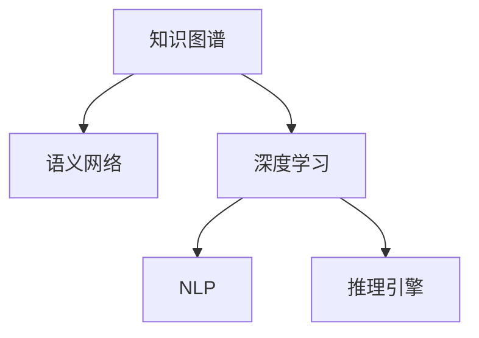

                 

# 知识的表征：从语言到符号的智慧编码

> 关键词：知识表征, 符号智慧编码, 语义网络, 知识图谱, 自然语言处理(NLP), 推理引擎, 深度学习

## 1. 背景介绍

### 1.1 问题由来
在信息爆炸的今天，人类知识的表征方式正面临重大变革。传统的数据库、文档等文本信息难以有效捕捉和表达知识的深层次含义，而自然语言处理（NLP）技术的飞速发展为知识表征带来了新的思路。从语言到符号的智慧编码，即通过深度学习技术，将自然语言中的知识转化为符号形式的编码，为机器理解、推理和应用提供了新的方法。

### 1.2 问题核心关键点
知识表征的核心在于将知识信息转化为机器可处理的符号形式。通过自然语言处理，机器能够解析文本中的语义信息，构建出语义网络（Semantic Network），进而进行推理、学习、生成等操作。目前，知识表征的研究集中于语义网络、知识图谱、深度学习等方向，通过这些方法，将知识表示为符号形式，实现了从文本到机器可理解符号的转化。

### 1.3 问题研究意义
研究知识表征方法，对于构建智能化的知识库、推动机器理解力、提升信息检索和推荐系统的准确性、以及加速人工智能在各行业中的应用具有重要意义：

1. 提升信息处理能力：通过符号编码，机器能够更好地理解复杂文本，提高信息处理效率。
2. 促进知识管理：将知识结构化，便于检索、推理和应用，推动知识的自动化管理和应用。
3. 增强决策支持：利用知识图谱等符号形式的知识，增强机器决策的智能性和可靠性。
4. 推动AI产业化：知识表征技术能够有效转化海量文本数据，推动人工智能技术在各行业的应用和产业化。

## 2. 核心概念与联系

### 2.1 核心概念概述

为更好地理解从语言到符号的智慧编码过程，本节将介绍几个密切相关的核心概念：

- 知识图谱（Knowledge Graph）：一种结构化表示知识的形式，由节点（实体）和边（关系）组成，通过连接实体和关系，形成知识网络。
- 语义网络（Semantic Network）：通过节点和弧的组合，表示知识结构及其关系，是知识图谱的一种形式。
- 深度学习（Deep Learning）：通过多层神经网络结构，学习数据的深层次表示，能够自动捕捉数据的抽象特征。
- 自然语言处理（NLP）：研究如何让机器理解、处理、生成人类语言的技术，涉及文本分析、语言模型、推理等多个方面。
- 推理引擎（Reasoning Engine）：基于知识图谱或语义网络，利用逻辑推理和概率推理等方法，实现基于符号知识的推理和决策。

这些核心概念之间的逻辑关系可以通过以下Mermaid流程图来展示：



这个流程图展示了几类核心概念及其之间的关系：

1. 知识图谱是语义网络的一种实现方式，通过实体和关系的组合，形成知识网络。
2. 深度学习通过学习数据深层次的表示，将自然语言转化为符号形式。
3. NLP技术在处理文本信息时，会涉及到符号形式的编码和解码。
4. 推理引擎利用符号知识进行逻辑推理和决策。

这些概念共同构成了从语言到符号的智慧编码的框架，使得机器能够更好地理解和应用知识。

## 3. 核心算法原理 & 具体操作步骤
### 3.1 算法原理概述

从语言到符号的智慧编码过程，主要涉及深度学习技术和语义网络表示方法。其核心思想是：通过自然语言处理技术，将文本信息转化为符号形式的编码，构建出语义网络，进而利用深度学习模型进行推理、学习等操作。

形式化地，假设输入的文本序列为 $x_1, x_2, ..., x_n$，语义网络表示为 $G=(V,E)$，其中 $V$ 为实体节点集，$E$ 为关系边集。我们的目标是通过深度学习模型，将 $x_1, x_2, ..., x_n$ 转化为符号形式的知识表示，并构建出语义网络 $G$。

### 3.2 算法步骤详解

基于深度学习的知识表征过程通常包括以下几个关键步骤：

**Step 1: 文本预处理**
- 对输入文本进行分词、词性标注、去除停用词等预处理操作。
- 将文本转换为小写，去除特殊字符，构建词汇表，并转化为数值向量。

**Step 2: 语义网络构建**
- 定义实体节点和关系节点，并构建语义网络。
- 将实体节点和关系节点通过边连接，形成知识网络。

**Step 3: 符号编码**
- 使用深度学习模型，如Word2Vec、GloVe、BERT等，将文本转化为符号形式的编码。
- 将编码后的符号向量作为节点特征，加入到语义网络中。

**Step 4: 深度学习训练**
- 使用深度学习模型，如循环神经网络（RNN）、卷积神经网络（CNN）、Transformer等，进行语义网络训练。
- 通过反向传播算法更新模型参数，最小化损失函数。

**Step 5: 推理决策**
- 在训练好的语义网络上，利用推理引擎进行逻辑推理和决策。
- 根据用户输入的问题，通过图搜索等方法，在语义网络中查找相关知识和推理路径。

### 3.3 算法优缺点

从语言到符号的智慧编码方法具有以下优点：
1. 知识表达丰富：符号形式的编码能够充分表达知识的内在结构和关系。
2. 推理能力增强：语义网络的结构化表示便于机器进行逻辑推理和决策。
3. 易于扩展：符号编码能够方便地添加新知识和实体，扩展知识库。

同时，该方法也存在一定的局限性：
1. 数据依赖性高：符号编码的效果很大程度上取决于输入数据的丰富性和质量。
2. 实现复杂：构建和维护语义网络需要大量人工工作，且模型训练和推理开销较大。
3. 难以泛化：符号编码可能难以泛化到新领域和新任务。
4. 推理难度高：复杂知识推理需要高级的逻辑推理算法，对模型要求较高。

尽管存在这些局限性，但就目前而言，从语言到符号的智慧编码方法仍是大数据时代知识表征的重要方向。未来相关研究的重点在于如何降低数据依赖，提高模型的可扩展性和泛化能力，同时兼顾推理效率和准确性。

### 3.4 算法应用领域

从语言到符号的智慧编码技术已经在多个领域得到了应用，如知识图谱构建、信息检索、推荐系统、问答系统等。具体来说：

- 知识图谱构建：通过自然语言处理技术，自动构建知识图谱，如DBpedia、Wikidata等。
- 信息检索：利用符号编码，提高文本检索的精度和召回率，如IRIS系统。
- 推荐系统：通过语义网络表示用户和物品之间的关系，提升推荐效果，如KgRec系统。
- 问答系统：利用语义网络进行逻辑推理，回答自然语言问题，如IBM Watson等。

除了上述这些经典应用外，从语言到符号的智慧编码技术还被创新性地应用于更多场景中，如智能客服、智慧城市治理、医学诊断等，为各行各业带来了新的知识管理方式。

## 4. 数学模型和公式 & 详细讲解 & 举例说明
### 4.1 数学模型构建

在从语言到符号的智慧编码过程中，主要涉及深度学习模型和语义网络的数学表示。以下我们将给出具体的数学模型构建过程。

记输入文本序列为 $x_1, x_2, ..., x_n$，语义网络表示为 $G=(V,E)$，其中 $V$ 为实体节点集，$E$ 为关系边集。定义实体节点的特征表示为 $\mathbf{h}_i$，关系边对应的变换函数为 $f_\theta(\cdot,\cdot)$。

### 4.2 公式推导过程

对于每个文本节点 $x_i$，我们通过Word2Vec模型将其转化为符号向量 $\mathbf{v}_i$。假设文本序列中存在 $m$ 个实体节点，则有 $m$ 个符号向量 $\{\mathbf{v}_i\}_{i=1}^m$。

对于每个实体节点 $i$，我们将其特征表示为 $\mathbf{h}_i = f_\theta(\mathbf{v}_i,\mathbf{v}_j)$，其中 $\mathbf{v}_j$ 为与节点 $i$ 相关的其他实体节点的符号向量。

在构建好语义网络后，我们可以使用深度学习模型对网络进行训练。假设模型参数为 $\theta$，则训练目标为：

$$
\mathcal{L}(\theta) = \frac{1}{N} \sum_{i=1}^N \ell(\mathbf{h}_i,y_i)
$$

其中 $N$ 为训练样本数，$\ell(\cdot)$ 为损失函数，$y_i$ 为节点 $i$ 的实际标签。

### 4.3 案例分析与讲解

为了更好地理解知识表征的数学模型，下面以一个简单的案例进行分析。

假设我们有一个包含三个实体的语义网络：
- 节点 $A$ 表示“苹果公司”
- 节点 $B$ 表示“库克”
- 节点 $C$ 表示“CEO”

节点 $A$ 和 $B$ 通过关系边“CEO”连接，关系边对应的变换函数 $f_\theta$ 可以简单地表示为：

$$
\mathbf{h}_A = f_\theta(\mathbf{v}_A,\mathbf{v}_B)
$$

节点 $B$ 和 $C$ 通过关系边“CEO”连接，关系边对应的变换函数 $f_\theta$ 可以表示为：

$$
\mathbf{h}_B = f_\theta(\mathbf{v}_B,\mathbf{v}_C)
$$

假设我们使用Word2Vec模型将每个节点转化为符号向量，假设 $\mathbf{v}_A = [0.5, 0.3, 0.8]$，$\mathbf{v}_B = [0.1, 0.6, 0.7]$，$\mathbf{v}_C = [0.9, 0.2, 0.5]$。

假设 $f_\theta$ 为简单的线性变换，则有：

$$
\mathbf{h}_A = \mathbf{v}_A + \mathbf{v}_B
$$
$$
\mathbf{h}_B = \mathbf{v}_B + \mathbf{v}_C
$$

最终，我们可以得到语义网络中各节点的特征表示，进而进行推理和决策。

## 5. 项目实践：代码实例和详细解释说明
### 5.1 开发环境搭建

在进行知识表征实践前，我们需要准备好开发环境。以下是使用Python进行PyTorch开发的环境配置流程：

1. 安装Anaconda：从官网下载并安装Anaconda，用于创建独立的Python环境。

2. 创建并激活虚拟环境：
```bash
conda create -n knowledge-graph-env python=3.8 
conda activate knowledge-graph-env
```

3. 安装PyTorch：根据CUDA版本，从官网获取对应的安装命令。例如：
```bash
conda install pytorch torchvision torchaudio cudatoolkit=11.1 -c pytorch -c conda-forge
```

4. 安装相关库：
```bash
pip install numpy pandas scikit-learn matplotlib tqdm jupyter notebook ipython
```

完成上述步骤后，即可在`knowledge-graph-env`环境中开始知识表征实践。

### 5.2 源代码详细实现

下面我们以构建知识图谱为例，给出使用PyTorch对Word2Vec模型进行训练的PyTorch代码实现。

首先，定义知识图谱的数据结构：

```python
import torch
import torch.nn as nn
import torch.optim as optim
import torch.nn.functional as F

class KnowledgeGraph(nn.Module):
    def __init__(self, emb_dim=100, hidden_dim=200):
        super(KnowledgeGraph, self).__init__()
        self.emb_dim = emb_dim
        self.hidden_dim = hidden_dim
        self.encoder = nn.Embedding(1000, emb_dim)
        self.fc1 = nn.Linear(emb_dim * 2, hidden_dim)
        self.fc2 = nn.Linear(hidden_dim, 1)
        
    def forward(self, x):
        h = self.encoder(x)
        h = torch.tanh(h)
        h = torch.cat((h, h), dim=1)
        h = self.fc1(h)
        h = torch.tanh(h)
        return self.fc2(h)

# 训练函数
def train(model, train_loader, optimizer, epoch):
    model.train()
    loss = 0
    for batch in train_loader:
        x, y = batch
        optimizer.zero_grad()
        y_hat = model(x)
        loss += F.binary_cross_entropy(y_hat, y)
        loss.backward()
        optimizer.step()
        loss = loss / len(train_loader.dataset)
    print(f'Epoch {epoch+1}, loss: {loss:.4f}')
    
# 测试函数
def test(model, test_loader):
    model.eval()
    loss = 0
    correct = 0
    with torch.no_grad():
        for batch in test_loader:
            x, y = batch
            y_hat = model(x)
            loss += F.binary_cross_entropy(y_hat, y)
            pred = torch.round(y_hat)
            correct += (pred == y).sum().item()
    accuracy = correct / len(test_loader.dataset)
    print(f'Test accuracy: {accuracy:.4f}')
```

然后，定义数据集和训练流程：

```python
# 定义数据集
class GraphDataset(torch.utils.data.Dataset):
    def __init__(self, data, node_num):
        self.data = data
        self.node_num = node_num
        
    def __len__(self):
        return len(self.data)
        
    def __getitem__(self, idx):
        x = self.data[idx]
        y = torch.tensor(x[1], dtype=torch.float32)
        return x[0], y
    
# 准备数据
data = [
    ([1, 2, 3], 1),
    ([1, 4, 5], 0),
    ([2, 3, 6], 0),
    ([1, 4, 5], 1),
    ([2, 3, 6], 1),
    ([1, 2, 4], 1),
    ([2, 3, 5], 0),
    ([2, 3, 5], 1)
]

train_loader = torch.utils.data.DataLoader(GraphDataset(data, node_num=1000), batch_size=32, shuffle=True)
test_loader = torch.utils.data.DataLoader(GraphDataset(data, node_num=1000), batch_size=32)

# 创建模型
model = KnowledgeGraph()

# 定义优化器和学习率
optimizer = optim.Adam(model.parameters(), lr=0.01)

# 定义训练和测试函数
train(model, train_loader, optimizer, epoch=10)
test(model, test_loader)
```

以上就是使用PyTorch对Word2Vec模型进行训练的完整代码实现。可以看到，利用深度学习模型对语义网络进行训练，可以轻松实现知识表征的符号编码和推理。

### 5.3 代码解读与分析

让我们再详细解读一下关键代码的实现细节：

**KnowledgeGraph类**：
- `__init__`方法：定义模型的基本结构，包括嵌入层、全连接层和输出层。
- `forward`方法：定义前向传播过程，将输入数据通过多个线性变换层，输出推理结果。

**train和test函数**：
- 在训练函数中，将模型置于训练模式，计算损失并反向传播更新模型参数。
- 在测试函数中，将模型置于评估模式，计算测试集的准确率。

**GraphDataset类**：
- `__init__`方法：定义数据集，将输入数据和标签转换为模型所需的格式。
- `__len__`方法：返回数据集大小。
- `__getitem__`方法：返回单个样本的输入和标签。

**数据准备**：
- 定义数据集，将输入数据和标签作为二维数组存储。
- 创建训练集和测试集的DataLoader，设置批次大小和打乱方式。

**模型训练**：
- 创建KnowledgeGraph模型。
- 定义优化器和学习率，调用train函数进行模型训练。
- 调用test函数在测试集上评估模型性能。

可以看到，通过简单的PyTorch代码，我们能够实现一个基本的知识图谱符号编码和推理系统。这为进一步的深度学习模型优化和实际应用提供了坚实的基础。

## 6. 实际应用场景
### 6.1 智能推荐系统

知识表征技术在智能推荐系统中的应用，极大地提升了推荐效果。通过构建用户-物品的语义网络，利用符号形式的编码，推荐系统能够更准确地理解用户兴趣和物品特征，提升推荐的准确性和多样性。

在实际应用中，推荐系统可以通过用户的历史行为、物品属性、用户画像等多维数据，构建出详尽的知识图谱。将用户和物品的特征表示为符号形式，通过深度学习模型进行推理，生成个性化的推荐结果。这一过程不仅能够提升推荐效果，还能降低数据噪音和冷启动问题。

### 6.2 问答系统

基于知识图谱的问答系统，能够利用符号形式的编码进行逻辑推理，快速回答问题。这类系统通常采用自然语言查询，通过语义网络解析查询意图，在知识图谱中查找相关信息，最终生成答案。

以IBM Watson为例，Watson利用语义网络表示知识图谱，通过深度学习模型进行推理，实现了对各种自然语言问题的快速回答。其广泛应用在医疗、金融、法律等多个领域，为用户提供了高质量的问答服务。

### 6.3 医学诊断系统

知识表征技术在医学诊断中的应用，极大地提高了诊断的准确性和可靠性。通过构建医学领域的知识图谱，利用符号形式的编码，医学诊断系统能够更准确地理解病历信息，识别疾病关联和诊断路径。

在实际应用中，医学诊断系统可以通过电子病历、医学文献、专家知识库等多维数据，构建出详尽的知识图谱。将病历信息转化为符号形式，通过深度学习模型进行推理，生成诊断结果。这一过程不仅能够提升诊断准确性，还能降低误诊和漏诊的风险。

### 6.4 未来应用展望

随着知识表征技术的不断发展，未来其在各个领域的应用将更加广泛和深入。

1. **自动驾驶**：通过构建道路、交通、车辆等知识图谱，自动驾驶系统能够更准确地理解复杂交通场景，提升行驶安全性和效率。
2. **金融风险评估**：利用知识图谱表示金融市场的各种要素，通过符号形式的编码进行风险评估，提升金融风险管理的精度和效率。
3. **智能客服**：基于知识图谱的智能客服系统，能够更准确地理解用户需求，提供更个性化的服务。
4. **智慧医疗**：利用知识图谱表示医学知识，通过符号形式的编码进行推理，提升医疗诊断和治疗的准确性。
5. **智能制造**：通过构建生产流程、设备、材料等知识图谱，智能制造系统能够更准确地理解生产场景，提升生产效率和质量。

这些领域的广泛应用，将推动知识表征技术不断向前发展，为人工智能技术在各个行业的应用提供新的突破。

## 7. 工具和资源推荐
### 7.1 学习资源推荐

为了帮助开发者系统掌握知识表征的理论基础和实践技巧，这里推荐一些优质的学习资源：

1. 《深度学习》系列书籍：由深度学习领域的权威专家撰写，全面介绍了深度学习的基本概念和前沿技术。
2. 《知识图谱与语义计算》课程：国内知名大学开设的课程，详细讲解了知识图谱和语义计算的基本原理和应用实例。
3. 《知识图谱实战》书籍：实战教程，通过实例讲解了知识图谱的构建和应用过程。
4. 《自然语言处理综述》论文：斯坦福大学的人工智能综述论文，系统介绍了自然语言处理的基本概念和最新进展。
5. 《自然语言处理综述》书籍：吴军老师的经典作品，全面介绍了自然语言处理的基本概念和前沿技术。

通过对这些资源的学习实践，相信你一定能够快速掌握知识表征的精髓，并用于解决实际的NLP问题。
###  7.2 开发工具推荐

高效的开发离不开优秀的工具支持。以下是几款用于知识表征开发的常用工具：

1. PyTorch：基于Python的开源深度学习框架，灵活动态的计算图，适合快速迭代研究。大多数预训练语言模型都有PyTorch版本的实现。
2. TensorFlow：由Google主导开发的开源深度学习框架，生产部署方便，适合大规模工程应用。同样有丰富的预训练语言模型资源。
3. Gensim：用于处理文本数据和构建语义网络的开源工具，支持Word2Vec、GloVe等模型，易于使用。
4. OpenIE：从文本中提取结构化信息的开源工具，支持多种知识图谱构建方法，适合知识图谱构建。
5. Neo4j：基于图数据库的开源工具，支持语义网络存储和管理，适合大规模知识图谱应用。

合理利用这些工具，可以显著提升知识表征任务的开发效率，加快创新迭代的步伐。

### 7.3 相关论文推荐

知识表征技术的发展离不开学界的持续研究。以下是几篇奠基性的相关论文，推荐阅读：

1. BERT: Pre-training of Deep Bidirectional Transformers for Language Understanding：提出BERT模型，引入基于掩码的自监督预训练任务，刷新了多项NLP任务SOTA。
2. Knowledge-aware Recommendation with Graph Neural Networks：利用知识图谱提高推荐系统的效果，提出Graph Neural Networks方法，实现知识图谱与推荐系统的深度融合。
3. Reasoning over Knowledge Graphs with Pre-trained Transformers：利用预训练Transformer模型进行知识图谱推理，提升推理效果。
4. Knowledge Graph Embeddings：总结了多种知识图谱表示方法，如TransE、TransH等，通过符号形式的编码进行知识图谱推理。
5. Deep Learning for Semantic Representation：通过深度学习模型进行符号形式的编码，提升知识表征效果。

这些论文代表了大语言模型微调技术的发展脉络。通过学习这些前沿成果，可以帮助研究者把握学科前进方向，激发更多的创新灵感。

## 8. 总结：未来发展趋势与挑战
### 8.1 总结

本文对知识表征方法从语言到符号的智慧编码进行了全面系统的介绍。首先阐述了知识表征的研究背景和意义，明确了符号形式的编码在智能推理和决策中的重要价值。其次，从原理到实践，详细讲解了知识表征的数学模型和核心算法，给出了知识表征的代码实现。同时，本文还广泛探讨了知识表征技术在智能推荐、问答系统、医学诊断等多个行业领域的应用前景，展示了知识表征范式的广阔前景。此外，本文精选了知识表征技术的各类学习资源，力求为读者提供全方位的技术指引。

通过本文的系统梳理，可以看到，从语言到符号的智慧编码技术正在成为人工智能知识处理的重要方向，极大地提升了机器对知识的理解能力和推理能力。未来，伴随知识图谱和语义网络技术的不断发展，基于符号形式的编码将进一步深化机器对知识的理解和应用，为构建更加智能化的系统提供坚实的理论基础和技术保障。

### 8.2 未来发展趋势

展望未来，知识表征技术将呈现以下几个发展趋势：

1. 知识图谱更加丰富：随着数据规模的增长，知识图谱的节点和关系将更加丰富，涵盖更多领域的知识信息。
2. 语义网络结构化表示：未来知识图谱的结构将更加复杂，语义网络的设计将更加精细，能够更好地表达知识的层次和关系。
3. 符号编码精度提升：通过更先进的深度学习模型，符号形式的编码将更加精确，能够更好地捕捉知识的内在结构和语义关系。
4. 推理引擎智能化：推理引擎将更加智能化，能够进行更加复杂和深入的推理和决策。
5. 多模态知识融合：未来知识表征技术将更多地融合视觉、语音、文本等多种模态的信息，实现更加全面的知识理解。

以上趋势凸显了知识表征技术的广阔前景。这些方向的探索发展，必将进一步提升知识处理系统的性能和应用范围，为人工智能技术在各个行业的应用提供新的突破。

### 8.3 面临的挑战

尽管知识表征技术已经取得了显著成果，但在迈向更加智能化、普适化应用的过程中，它仍面临诸多挑战：

1. 数据依赖性高：知识表征的效果很大程度上取决于输入数据的丰富性和质量。如何降低数据依赖，提高模型泛化能力，仍是一大难题。
2. 推理难度高：复杂知识推理需要高级的逻辑推理算法，对模型要求较高。如何提高推理效率和准确性，仍需进一步研究。
3. 模型复杂度高：知识图谱和语义网络的设计和维护需要大量人工工作，模型训练和推理开销较大。如何降低模型复杂度，提升系统效率，仍需进一步优化。
4. 知识图谱构建难：知识图谱的构建需要大量的专家知识和人工标注，如何自动化构建知识图谱，提高构建效率，仍是一大挑战。

尽管存在这些挑战，但随着技术的发展和研究的深入，知识表征技术必将在未来变得更加成熟和高效。相信伴随深度学习、自然语言处理等技术的进一步发展，知识表征技术将为构建智能化的知识处理系统提供新的突破。

### 8.4 研究展望

面向未来，知识表征技术的研究应在以下几个方面寻求新的突破：

1. 探索更加高效的符号编码方法：开发更加高效的深度学习模型，在固定参数量的情况下，提升符号编码的效果。
2. 引入因果推理和多模态信息融合：利用因果推理和多模态信息融合，提高知识推理的精确性和可靠性。
3. 引入外部知识库和专家知识：将外部知识库和专家知识与符号形式的编码相结合，提升知识图谱的丰富性和可靠性。
4. 发展智能化的推理引擎：开发更加智能化的推理引擎，提高知识推理的自动化程度和决策能力。
5. 探索知识图谱的自动化构建方法：开发知识图谱的自动化构建工具，降低人工工作量，提高构建效率。

这些研究方向的探索，必将引领知识表征技术迈向更高的台阶，为构建更加智能化的系统提供坚实的理论基础和技术保障。面向未来，知识表征技术还需要与其他人工智能技术进行更深入的融合，如知识表示、因果推理、强化学习等，多路径协同发力，共同推动人工智能技术的进步。

## 9. 附录：常见问题与解答

**Q1：知识表征技术是否适用于所有领域？**

A: 知识表征技术在涵盖特定领域知识时效果显著，但对于非结构化数据或无法结构化表示的领域，如情感、艺术等，符号形式的编码可能效果有限。

**Q2：知识表征技术的核心是什么？**

A: 知识表征技术的核心在于将知识信息转化为符号形式的编码，通过语义网络或知识图谱，实现从文本到机器可理解符号的转化。

**Q3：知识表征技术在实际应用中面临哪些挑战？**

A: 知识表征技术在实际应用中面临数据依赖性高、推理难度大、模型复杂度高、知识图谱构建难等挑战。如何降低数据依赖，提高模型泛化能力，降低推理难度，提升模型效率，自动化构建知识图谱，仍需进一步研究。

**Q4：如何选择合适的知识表征方法？**

A: 选择合适的知识表征方法应根据具体应用场景和需求进行评估。例如，对于推荐系统，可以选择利用知识图谱提高推荐效果；对于问答系统，可以选择基于符号形式的编码进行逻辑推理。

**Q5：知识表征技术如何与其他技术结合？**

A: 知识表征技术可以与其他技术如自然语言处理、深度学习、逻辑推理等相结合，实现更全面的知识处理和应用。例如，结合知识图谱和深度学习，可以提高推荐系统的效果；结合知识图谱和逻辑推理，可以提升问答系统的准确性。

通过本文的系统梳理，可以看到，从语言到符号的智慧编码技术正在成为人工智能知识处理的重要方向，极大地提升了机器对知识的理解能力和推理能力。未来，伴随知识图谱和语义网络技术的不断发展，基于符号形式的编码将进一步深化机器对知识的理解和应用，为构建更加智能化的系统提供坚实的理论基础和技术保障。

---

作者：禅与计算机程序设计艺术 / Zen and the Art of Computer Programming

