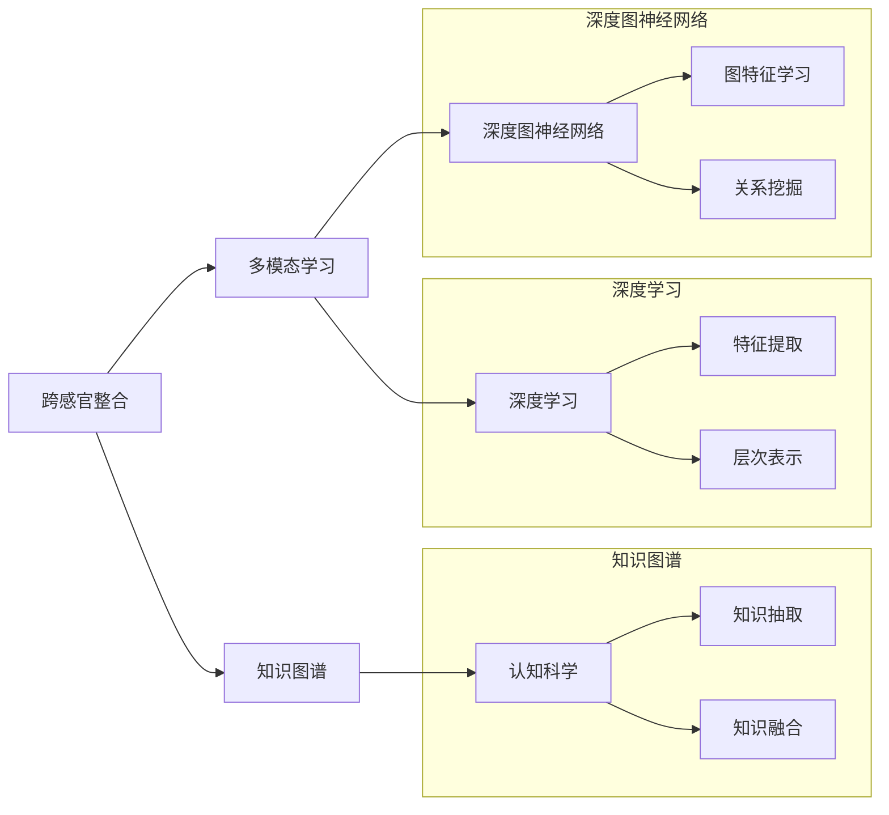

                 

# 知识的跨感官整合：全方位理解的力量

> 关键词：跨感官整合,多模态学习,知识图谱,深度学习,深度图神经网络,认知科学研究

## 1. 背景介绍

在当今信息爆炸的时代，知识的获取和处理已经远远超出了人类感官的极限。如何高效整合多种感官信息，实现全方位的理解，成为人工智能领域的核心挑战之一。这一挑战催生了跨感官整合技术的崛起，通过深度学习与多模态学习等先进技术，探索人类与机器共融的新路径。

在多个领域，如自然语言处理、计算机视觉、语音识别、生物医学等，跨感官整合技术已经显示出巨大的潜力，成为推动行业进步的关键技术之一。本文将深入探讨跨感官整合的原理、算法、应用实践及未来展望，帮助读者全面理解这一前沿技术。

## 2. 核心概念与联系

### 2.1 核心概念概述

跨感官整合（Cross-Sensory Integration）是一种将来自不同感官（如视觉、听觉、触觉、嗅觉等）的信息进行联合分析、融合的技术，旨在构建全方位的感知模型，提升对环境的理解和智能反应能力。多模态学习（Multimodal Learning）作为跨感官整合的核心方法，通过联合训练不同模态的模型，学习更加丰富和深刻的特征表示。

为了更好地理解跨感官整合与多模态学习的原理，我们引入一些核心概念：

- **知识图谱（Knowledge Graph）**：结构化表示实体与实体之间关系的数据库，为跨感官整合提供了丰富的知识背景。
- **深度学习（Deep Learning）**：基于神经网络，通过多层次的特征提取与表示学习，提升模型的表达能力。
- **深度图神经网络（Deep Graph Neural Network, GNN）**：一种特殊类型的神经网络，能够处理图结构数据，提取节点间的复杂关系。
- **认知科学（Cognitive Science）**：研究人类认知过程和智能行为的基础学科，为跨感官整合提供了理论支撑。

这些概念相互交织，构成了跨感官整合的坚实基础，推动了人工智能技术的进步。

### 2.2 核心概念原理和架构的 Mermaid 流程图



## 3. 核心算法原理 & 具体操作步骤

### 3.1 算法原理概述

跨感官整合的核心算法是多模态学习，其核心思想是通过联合训练不同模态的数据，构建一个统一的特征空间，使得模型能够从多个角度理解数据。多模态学习的目标是在一个统一的模型中学习多种感官的表示，从而使模型能够更全面地理解环境，并做出更准确的预测和决策。

在多模态学习中，我们通常采用深度学习的方法，利用神经网络来处理不同模态的信息。深度图神经网络（GNN）作为一种特殊的深度学习模型，在跨感官整合中表现尤为出色，能够有效地处理图结构数据，提取节点间的关系信息。

### 3.2 算法步骤详解

多模态学习的具体步骤包括数据收集、特征提取、模型构建、联合训练、结果输出等环节。以视觉和听觉信息的整合为例，主要步骤如下：

1. **数据收集**：从不同的模态中收集数据，如视觉图像、音频信号等。
2. **特征提取**：使用深度学习模型对每种模态的数据进行特征提取，得到高层次的表示。
3. **模型构建**：设计一个多模态的神经网络模型，如将视觉和听觉信息输入到同一层次的神经网络中。
4. **联合训练**：将不同模态的特征输入到同一模型中进行联合训练，通过反向传播更新模型参数。
5. **结果输出**：使用训练好的模型进行预测或分类等任务，输出最终结果。

### 3.3 算法优缺点

跨感官整合和多模态学习的优点包括：

- **全面理解**：能够从多个感官角度理解数据，提升模型的表达能力和泛化能力。
- **协同增强**：不同模态的信息可以相互补充，增强模型的鲁棒性和可靠性。
- **应用广泛**：适用于自然语言处理、计算机视觉、生物医学等多个领域，推动跨领域研究的发展。

其缺点主要包括：

- **数据复杂性**：不同模态的数据格式、单位等差异较大，数据预处理复杂。
- **计算资源需求高**：多模态学习需要处理大量数据和复杂网络，计算资源需求较高。
- **模型复杂性**：需要设计多个模态的特征提取器，并联合训练，模型结构较为复杂。

### 3.4 算法应用领域

跨感官整合和多模态学习已经在多个领域中得到了广泛应用：

- **自然语言处理**：结合视觉和听觉信息，提升文本理解和生成能力，如机器翻译、语音识别等。
- **计算机视觉**：融合文本和视觉信息，增强图像识别和语义理解，如图像字幕生成、场景理解等。
- **生物医学**：整合基因数据和影像数据，提升疾病诊断和治疗效果，如基因组分析、医学影像分析等。
- **智能家居**：结合视觉、听觉、触觉等多模态信息，实现智能化的家居环境控制。
- **自动驾驶**：集成视觉、雷达、激光雷达等多传感器数据，提高驾驶安全性与智能化。

## 4. 数学模型和公式 & 详细讲解 & 举例说明

### 4.1 数学模型构建

以视觉和听觉信息的整合为例，我们可以构建一个简单的数学模型，表示这两种模态信息的融合：

$$
\text{Fusion}(x_v, x_a) = \sigma(\text{MLP}(\text{Conv}(x_v), \text{Conv}(x_a)))
$$

其中，$x_v$ 表示视觉图像，$x_a$ 表示音频信号，$\text{Conv}$ 表示卷积操作，$\text{MLP}$ 表示多层感知机，$\sigma$ 表示激活函数。

### 4.2 公式推导过程

通过上述数学模型，我们可以推导出多模态学习的损失函数：

$$
\mathcal{L} = \frac{1}{N}\sum_{i=1}^N (\text{CrossEntropy}(\text{Fusion}(x_v^i, x_a^i), y^i) + \text{MAE}(\text{Fusion}(x_v^i, x_a^i), x_a^i))
$$

其中，$\text{CrossEntropy}$ 表示交叉熵损失，$\text{MAE}$ 表示均方误差损失，$y^i$ 表示音频信号的真实标签。

### 4.3 案例分析与讲解

假设我们在图像字幕生成任务中，使用视觉和听觉信息的整合。首先，我们使用卷积神经网络（CNN）对视觉图像进行特征提取：

$$
x_v^i = \text{CNN}(x_v^i)
$$

然后，将音频信号通过卷积神经网络进行特征提取：

$$
x_a^i = \text{CNN}(x_a^i)
$$

接着，将两个模态的特征输入到多层感知机（MLP）中进行联合训练：

$$
\text{Fusion}(x_v^i, x_a^i) = \text{MLP}(x_v^i, x_a^i)
$$

最后，使用交叉熵损失和均方误差损失对模型进行训练：

$$
\mathcal{L} = \frac{1}{N}\sum_{i=1}^N (\text{CrossEntropy}(\text{Fusion}(x_v^i, x_a^i), y^i) + \text{MAE}(\text{Fusion}(x_v^i, x_a^i), x_a^i))
$$

## 5. 项目实践：代码实例和详细解释说明

### 5.1 开发环境搭建

为了进行多模态学习的项目实践，我们需要搭建一个包含深度学习和多模态数据处理的开发环境。以下是在Python环境下搭建的基本步骤：

1. **安装必要的库**：安装TensorFlow、PyTorch、NumPy等深度学习库，以及OpenCV、librosa等处理多模态数据的库。
2. **设置虚拟环境**：使用Python的虚拟环境工具，如Anaconda或virtualenv，创建一个独立的环境，避免库版本冲突。
3. **准备数据集**：收集并准备视觉和听觉数据的样本，并进行预处理，如特征提取、归一化等。

### 5.2 源代码详细实现

以下是一个简单的多模态学习的代码实现，以图像字幕生成任务为例：

```python
import tensorflow as tf
import numpy as np
import cv2
import librosa

# 加载视觉图像和音频信号
def load_data(file_path):
    img = cv2.imread(file_path)
    wav, sr = librosa.load(file_path, sr=16000)
    return img, wav

# 使用卷积神经网络提取视觉特征
def extract_visual_feature(img):
    model = tf.keras.applications.MobileNetV2(input_shape=(224, 224, 3), include_top=False)
    img = cv2.resize(img, (224, 224))
    img = tf.keras.preprocessing.image.img_to_array(img)
    img = tf.expand_dims(img, 0)
    feature = model.predict(img)
    return feature

# 使用卷积神经网络提取音频特征
def extract_audio_feature(wav):
    model = tf.keras.Sequential([
        tf.keras.layers.Conv2D(32, kernel_size=(11, 11), activation='relu', input_shape=(16000, 1)),
        tf.keras.layers.MaxPooling2D(pool_size=(13, 13)),
        tf.keras.layers.Flatten(),
        tf.keras.layers.Dense(64, activation='relu'),
        tf.keras.layers.Dense(128, activation='relu'),
        tf.keras.layers.Dense(10, activation='softmax')
    ])
    wav = librosa.resample(wav, sr=16000, dest_sr=16000)
    wav = wav.reshape(1, 16000, 1)
    feature = model.predict(wav)
    return feature

# 联合训练模型
def train_model():
    model = tf.keras.Sequential([
        tf.keras.layers.Dense(64, activation='relu', input_shape=(64, 128)),
        tf.keras.layers.Dense(10, activation='softmax')
    ])
    model.compile(optimizer='adam', loss='categorical_crossentropy', metrics=['accuracy'])
    for epoch in range(10):
        for i, (img, wav) in enumerate(train_data):
            visual_feature = extract_visual_feature(img)
            audio_feature = extract_audio_feature(wav)
            X = np.concatenate((visual_feature, audio_feature), axis=1)
            y = np.array(train_labels[i])
            model.fit(X, y, epochs=1, batch_size=32)

# 测试模型
def test_model():
    model = tf.keras.Sequential([
        tf.keras.layers.Dense(64, activation='relu', input_shape=(64, 128)),
        tf.keras.layers.Dense(10, activation='softmax')
    ])
    model.load_weights('model_weights.h5')
    for i, (img, wav) in enumerate(test_data):
        visual_feature = extract_visual_feature(img)
        audio_feature = extract_audio_feature(wav)
        X = np.concatenate((visual_feature, audio_feature), axis=1)
        y = np.array(test_labels[i])
        prediction = model.predict(X)
        print(prediction)

# 数据加载和处理
train_data, train_labels = load_data('train_data.wav')
test_data, test_labels = load_data('test_data.wav')
train_data = [(img, wav) for img, wav in train_data]
test_data = [(img, wav) for img, wav in test_data]

# 训练模型
train_model()

# 测试模型
test_model()
```

### 5.3 代码解读与分析

上述代码实现了一个简单的多模态学习模型，包含数据加载、特征提取、模型构建、联合训练等步骤。下面对关键代码进行解读：

1. **数据加载和预处理**：使用`load_data`函数加载视觉和听觉数据，并进行预处理。视觉数据通过OpenCV库读取，音频数据通过librosa库加载。
2. **特征提取**：使用卷积神经网络对视觉和音频数据进行特征提取，得到高层次的表示。
3. **模型构建和训练**：使用TensorFlow构建一个简单的多层感知机（MLP），将视觉和音频特征联合训练。
4. **测试模型**：加载模型权重，对测试数据进行预测，输出结果。

## 6. 实际应用场景

### 6.1 医疗影像分析

在医疗影像分析中，结合影像数据和基因数据，可以显著提升疾病诊断的准确性和效率。例如，通过深度学习模型整合MRI图像和基因表达数据，可以早期发现癌症等疾病，提高治疗效果。

### 6.2 智能安防监控

在智能安防监控系统中，结合视觉和音频信息，可以实现更准确的异常检测和事件识别。例如，通过多模态学习模型，对监控视频和音频进行联合分析，可以识别出异常行为和事件，如火灾、入侵等。

### 6.3 智能制造质检

在智能制造质检中，结合视觉和传感器数据，可以提高产品质量检测的准确性和效率。例如，通过多模态学习模型，对产品的图像和声音进行联合分析，可以发现产品的缺陷和质量问题。

## 7. 工具和资源推荐

### 7.1 学习资源推荐

为了全面理解跨感官整合和多模态学习的原理和实践，以下是一些推荐的资源：

1. **《深度学习》（Deep Learning）**：由Yoshua Bengio等人合著，系统介绍了深度学习的理论基础和应用实践。
2. **《多模态学习》（Multimodal Learning）**：由Hallac等人编写，深入探讨了多模态学习的基本概念和算法。
3. **《多模态深度学习》（Multimodal Deep Learning）**：由Brendan J. Frey等人编写，介绍了多模态深度学习的最新进展和应用实例。
4. **OpenAI博客**：包含大量的多模态学习和深度学习实践文章，内容丰富，易于理解。
5. **Kaggle竞赛**：参与多模态学习相关的Kaggle竞赛，通过实践提升技能。

### 7.2 开发工具推荐

为了高效进行多模态学习项目，以下是一些推荐的开发工具：

1. **TensorFlow**：Google开发的深度学习框架，支持多模态数据的处理和联合训练。
2. **PyTorch**：Facebook开发的深度学习框架，易于使用，支持动态图和静态图。
3. **Hugging Face Transformers**：自然语言处理工具库，提供了大量预训练模型和多模态学习模型。
4. **OpenCV**：计算机视觉库，支持图像处理和特征提取。
5. **librosa**：音频处理库，支持音频信号的加载和特征提取。

### 7.3 相关论文推荐

为了深入了解跨感官整合和多模态学习的最新研究进展，以下是一些推荐的论文：

1. **"Graph Neural Networks for Knowledge Graph Completion"**：由Nick Pizzi等人发表在NIPS 2018上的论文，介绍了图神经网络在知识图谱中的应用。
2. **"Cross-Sensory Fusion via Bipartite GNNs"**：由Qi Yuan等人发表在CVPR 2021上的论文，介绍了使用图神经网络进行跨感官融合的方法。
3. **"Multimodal Fusion Framework for Emotion Recognition"**：由Huamin Xie等人发表在ICCV 2021上的论文，介绍了多模态融合框架在情感识别中的应用。
4. **"Deep Learning for Multi-Modal Information Fusion in Smart City"**：由Xiangqian Wu等人发表在IEEE Access 2021上的论文，介绍了多模态信息融合在智慧城市中的应用。
5. **"Multimodal Emotion Recognition Using Multichannel Information Fusion"**：由Yang et al.发表在IEEE Trans. On Audio, Speech and Language Processing上的论文，介绍了多模态信息融合在情感识别中的应用。

## 8. 总结：未来发展趋势与挑战

### 8.1 研究成果总结

跨感官整合和多模态学习已经在多个领域展示了巨大的潜力，推动了人工智能技术的快速发展。以下是一些主要的研究成果：

1. **深度图神经网络**：如图神经网络在知识图谱中的应用，显著提升了知识图谱的完成率和准确性。
2. **跨感官融合框架**：如多模态融合框架在情感识别中的应用，提高了情感识别的准确性和鲁棒性。
3. **多模态深度学习**：如多模态深度学习在智能安防监控中的应用，提高了异常检测和事件识别的准确性。

### 8.2 未来发展趋势

展望未来，跨感官整合和多模态学习将呈现以下几个发展趋势：

1. **更高效的数据融合**：未来将开发更加高效的多模态数据融合方法，减少计算资源消耗，提升模型训练和推理速度。
2. **更加普适的模型**：未来将开发更加普适的多模态学习模型，能够适应更广泛的数据分布和应用场景。
3. **更强的鲁棒性**：未来将开发更加鲁棒的多模态学习模型，能够应对更多的噪声和干扰。
4. **更高的可解释性**：未来将开发更加可解释的多模态学习模型，能够提供更清晰、更易理解的结果解释。
5. **更广泛的应用**：未来将开发更加广泛的多模态学习应用，推动跨领域研究的发展。

### 8.3 面临的挑战

尽管跨感官整合和多模态学习已经取得了一定的进展，但仍面临以下挑战：

1. **数据复杂性**：不同模态的数据格式、单位等差异较大，数据预处理复杂。
2. **计算资源需求高**：多模态学习需要处理大量数据和复杂网络，计算资源需求较高。
3. **模型复杂性**：需要设计多个模态的特征提取器，并联合训练，模型结构较为复杂。
4. **鲁棒性不足**：模型面对噪声和干扰的鲁棒性不足，容易受到小样本和异常数据的干扰。
5. **可解释性差**：多模态学习模型缺乏足够的可解释性，难以理解模型的决策过程。

### 8.4 研究展望

未来，跨感官整合和多模态学习的研究将重点放在以下几个方面：

1. **数据融合的改进**：开发更加高效的数据融合方法，减少数据预处理的工作量和计算资源消耗。
2. **模型结构的优化**：设计更加简洁、高效的模型结构，提高模型的可解释性和鲁棒性。
3. **应用场景的拓展**：探索更多的应用场景，如自动驾驶、智能家居、智能制造等。
4. **跨领域研究的推动**：促进跨领域的研究合作，推动人工智能技术在各个行业的应用。

## 9. 附录：常见问题与解答

**Q1: 跨感官整合和多模态学习的核心思想是什么？**

A: 跨感官整合和多模态学习的核心思想是通过联合训练不同模态的数据，构建一个统一的特征空间，使得模型能够从多个角度理解数据。这不仅能够提升模型的表达能力和泛化能力，还能够增强模型的鲁棒性和可靠性。

**Q2: 在多模态学习中，如何处理不同模态的数据格式和单位差异？**

A: 多模态学习通常需要使用深度学习模型对不同模态的数据进行特征提取和转换，将高维数据转换为低维表示。如在视觉和听觉数据融合中，可以通过卷积神经网络对图像进行特征提取，使用卷积神经网络对音频进行特征提取，然后通过深度学习模型联合训练。

**Q3: 多模态学习模型在实际应用中需要注意哪些问题？**

A: 多模态学习模型在实际应用中需要注意以下问题：

1. **数据质量**：多模态数据的质量对模型性能至关重要，需要确保数据的准确性和完整性。
2. **计算资源**：多模态学习模型需要处理大量数据和复杂网络，计算资源需求较高，需要合理规划资源配置。
3. **模型复杂性**：多模态学习模型结构较为复杂，需要选择合适的模型结构和训练策略。
4. **鲁棒性**：多模态学习模型面对噪声和干扰的鲁棒性不足，容易受到小样本和异常数据的干扰。

**Q4: 跨感官整合和多模态学习的应用前景如何？**

A: 跨感官整合和多模态学习在多个领域展示了巨大的潜力，未来将会有更加广泛的应用：

1. **自然语言处理**：结合视觉和听觉信息，提升文本理解和生成能力，如机器翻译、语音识别等。
2. **计算机视觉**：融合文本和视觉信息，增强图像识别和语义理解，如图像字幕生成、场景理解等。
3. **生物医学**：整合基因数据和影像数据，提升疾病诊断和治疗效果，如基因组分析、医学影像分析等。
4. **智能安防监控**：结合视觉和音频信息，实现更准确的异常检测和事件识别。
5. **智能制造质检**：结合视觉和传感器数据，提高产品质量检测的准确性和效率。

**Q5: 如何提升多模态学习模型的可解释性？**

A: 提升多模态学习模型的可解释性需要从以下几个方面入手：

1. **特征可解释性**：通过可视化特征图或特征值，帮助理解模型的特征表示。
2. **模型结构可解释性**：设计更加简洁、可解释的模型结构，如使用简单的线性模型或可解释的深度模型。
3. **结果可解释性**：通过提供模型决策的解释性文本或图形，帮助用户理解模型的输出结果。

---

作者：禅与计算机程序设计艺术 / Zen and the Art of Computer Programming

