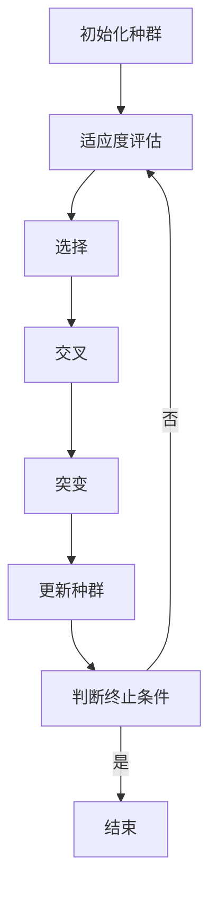

                 

### 文章标题

**虚拟进化：AI驱动的数字生态系统**

本文将深入探讨虚拟进化这一前沿概念，以及它如何被AI驱动，构建出一个充满生机与活力的数字生态系统。随着AI技术的不断进步，虚拟进化正在成为推动数字领域变革的重要力量，为各行各业带来前所未有的创新和机遇。本文将首先介绍虚拟进化的背景和发展历程，接着详细解析其核心概念与联系，探讨核心算法原理及具体操作步骤，并通过数学模型和公式进行详细讲解。此外，还将分享项目实践中的代码实例和运行结果，并探讨虚拟进化在实际应用场景中的广泛前景。最后，我们将总结未来发展趋势与挑战，并附上常见问题解答与扩展阅读资源。让我们共同开启这段关于虚拟进化的探索之旅。

### 关键词

- **虚拟进化**、**AI驱动**、**数字生态系统**、**算法原理**、**数学模型**、**实际应用**、**未来趋势**、**技术挑战**

### 摘要

本文旨在探讨虚拟进化这一AI驱动的数字生态系统，通过详细解析其核心概念、算法原理和数学模型，展示了虚拟进化在项目实践中的应用效果。本文不仅为读者提供了对虚拟进化技术的深入理解，还展望了其未来发展趋势和面临的挑战，为相关领域的研究者和技术人员提供了宝贵的参考。

## 1. 背景介绍（Background Introduction）

虚拟进化（Virtual Evolution）作为一个新兴的概念，其根源可以追溯到生物学中的进化论。进化论的基本原理是，通过自然选择和基因突变，物种能够在长时间内适应环境变化，从而逐步演化出更适应环境的形态。这一理论启发了计算机科学家在数字世界中探索类似的过程，以模拟和优化复杂系统的性能。

### 1.1 虚拟进化的起源与发展

虚拟进化的概念最早可以追溯到20世纪70年代。当时，生物学家和计算机科学家开始尝试将进化的原理应用于计算机模拟和优化问题。约翰·霍兰（John H. Holland）是这一领域的先驱之一，他提出了“遗传算法”（Genetic Algorithm）这一概念，这是虚拟进化技术的一个重要分支。

随着计算机性能的提升和算法的优化，虚拟进化的应用范围逐渐扩大。到21世纪初，虚拟进化已经从最初的模拟优化问题扩展到各个领域，如人工智能、机器学习、设计自动化、自动化控制等。

### 1.2 虚拟进化在现代科技中的重要性

在现代科技中，虚拟进化技术的重要性日益凸显。首先，虚拟进化为解决复杂优化问题提供了强大的工具。传统的方法往往需要大量的计算资源和时间，而虚拟进化通过模拟生物进化过程，可以在较短时间内找到近似最优解。

其次，虚拟进化在人工智能领域中的应用也十分广泛。例如，通过遗传算法，可以优化神经网络结构，提高其性能和准确度。此外，虚拟进化还可以用于生成全新的设计，如机器人、飞机、汽车等，这为设计自动化提供了新的思路。

### 1.3 虚拟进化与AI的融合

AI技术的发展为虚拟进化注入了新的活力。随着深度学习、强化学习等AI技术的成熟，虚拟进化与AI的融合成为研究的热点。通过将AI算法与虚拟进化相结合，可以构建出更加智能和自适应的数字生态系统。

例如，强化学习中的智能体可以通过虚拟进化不断优化其策略，以实现更好的学习效果。同样，深度神经网络可以通过遗传算法优化其结构，提高其泛化能力和计算效率。

总之，虚拟进化作为一个充满潜力的技术，正逐渐融入现代科技的各个方面，为解决复杂问题和推动技术进步提供了新的途径。

### 1.4 虚拟进化与数字生态系统的关系

虚拟进化与数字生态系统之间的紧密联系使其在现代科技中扮演着关键角色。数字生态系统是由各种数字实体（如数据、应用程序、网络服务）组成的复杂系统，这些实体之间通过相互作用和协作实现共同的目标。虚拟进化通过模拟生物进化过程，为数字生态系统提供了自组织、自适应和自我优化的能力。

首先，虚拟进化技术能够通过模拟自然选择和基因突变，生成具有高度适应性的数字实体。这些实体可以在不断变化的数字环境中生存和繁衍，从而适应新的挑战和需求。

其次，虚拟进化可以优化数字生态系统的结构和功能。通过遗传算法和进化策略，可以自动优化网络架构、应用程序性能和数据管理策略，从而提高整个生态系统的效率和稳定性。

最后，虚拟进化还可以促进数字生态系统中的创新和合作。通过模拟生物进化的过程，可以激发新的设计理念和技术突破，促进不同实体之间的协同工作，实现更高效的资源配置和业务流程优化。

总之，虚拟进化不仅为数字生态系统提供了强大的工具，还推动了其持续演化和自我优化。随着AI技术的不断进步，虚拟进化与数字生态系统的融合将为未来科技发展带来更多机遇和挑战。

### 1.5 虚拟进化在实际应用中的挑战与机遇

尽管虚拟进化技术在理论上具有巨大的潜力，但其在实际应用中仍面临一系列挑战和机遇。首先，虚拟进化的效率和性能问题是一个关键挑战。在实际应用中，需要处理大量复杂的参数和变量，这可能导致计算成本高昂，需要优化算法和硬件支持。

其次，虚拟进化的可信度和鲁棒性也是一个重要问题。在关键应用场景中，如金融交易、医疗诊断等，任何错误或偏差都可能导致严重的后果。因此，需要开发更可靠和鲁棒的虚拟进化算法，以应对复杂多变的环境和不确定性。

然而，这些挑战同时也带来了机遇。随着硬件技术的进步和算法优化，虚拟进化可以在更短时间内处理更多数据，提高其应用范围和效果。此外，虚拟进化与AI技术的融合将进一步推动其发展，为解决复杂问题和推动技术创新提供新的途径。

总之，虚拟进化在实际应用中既面临挑战，也充满机遇。通过不断探索和优化，虚拟进化有望在数字生态系统中发挥更大的作用，推动科技和社会的进步。

### 2. 核心概念与联系（Core Concepts and Connections）

#### 2.1 虚拟进化的定义与基本原理

虚拟进化是一种模拟生物进化过程的计算方法，通过遗传算法、自然选择和突变等机制，在数字环境中生成和优化适应性的解决方案。其核心概念包括个体（Individuals）、种群（Population）、遗传基因（Genes）、适应度（Fitness）等。

- **个体**：虚拟进化中的基本单位，代表了可能的解决方案。
- **种群**：由多个个体组成的集合，代表了可能的解决方案空间。
- **遗传基因**：个体的属性或特征，如数字编码、基因序列等。
- **适应度**：个体在特定环境下的适应能力或性能指标。

虚拟进化的基本原理是通过迭代过程，不断生成和筛选出适应度更高的个体，从而逐步优化解决方案。这一过程类似于生物进化，包括以下几个步骤：

1. **初始化种群**：随机生成一定数量的初始个体。
2. **适应度评估**：评估每个个体在当前环境下的适应度。
3. **选择**：根据适应度选择优秀个体进行繁殖。
4. **交叉**：通过交叉操作生成新的个体。
5. **突变**：对部分个体进行随机突变。
6. **更新种群**：用新的个体替换旧的个体，重复上述过程。

#### 2.2 虚拟进化与传统算法的区别

与传统算法相比，虚拟进化具有以下几个显著特点：

- **全局优化能力**：虚拟进化通过模拟自然选择过程，能够探索整个解决方案空间，具有较高的全局优化能力。相比之下，传统算法（如线性规划、梯度下降等）通常只能找到局部最优解。
- **自适应性**：虚拟进化算法能够根据环境变化自适应调整搜索策略，以适应新的挑战。这种自适应能力使得虚拟进化在动态变化的环境中表现出色，而传统算法则往往需要重新设计和优化。
- **处理复杂问题**：虚拟进化能够处理复杂、非线性、多变量的问题，特别是那些难以用传统方法描述或优化的问题。这使得虚拟进化在工程、设计、金融等领域的应用具有独特优势。

#### 2.3 虚拟进化与数字生态系统

虚拟进化在数字生态系统中的应用主要体现在以下几个方面：

- **自动优化**：通过虚拟进化，可以自动优化数字生态系统中各种组件的参数和配置，以提高整体性能和效率。例如，在云计算环境中，虚拟进化可以优化虚拟机资源的分配，降低能耗和提高服务质量。
- **智能设计**：虚拟进化可以用于生成全新的设计，如自动化设计机器人、智能家居系统等。通过模拟和优化，可以创造出更符合用户需求和实际环境的创新产品。
- **自适应网络**：在复杂网络系统中，虚拟进化可以用于优化网络拓扑结构和数据传输策略，提高网络的鲁棒性和可靠性。例如，在物联网（IoT）网络中，虚拟进化可以自动调整传感器节点的位置和传输频率，以适应环境变化和负载波动。
- **智慧城市**：虚拟进化可以用于智慧城市建设，通过模拟和优化交通、能源、环境等系统，提高城市的管理效率和居民生活质量。例如，通过虚拟进化优化交通信号灯控制策略，可以缓解交通拥堵，减少排放。

#### 2.4 虚拟进化的关键要素与实现步骤

要实现虚拟进化，需要以下几个关键要素：

- **编码策略**：编码策略决定了如何将问题解决方案表示为遗传基因。常见的编码策略包括二进制编码、实值编码、染色体编码等。
- **适应度函数**：适应度函数用于评估个体的适应能力或性能。适应度函数的设计直接影响虚拟进化的效果。一个合适的适应度函数应该能够准确反映问题目标，并具有适当的单调性和平滑性。
- **选择策略**：选择策略决定了如何从当前种群中选择优秀的个体进行繁殖。常见的选择策略包括轮盘赌选择、排名选择、锦标赛选择等。
- **交叉策略**：交叉策略用于生成新的个体。交叉操作可以保留优秀个体的优势，同时引入新的遗传基因，以增加种群的多样性和搜索范围。
- **突变策略**：突变策略用于引入随机性，防止种群陷入局部最优。常见的突变操作包括基因翻转、基因交换、基因插入等。

实现虚拟进化的基本步骤如下：

1. **问题定义**：明确优化问题的目标函数、约束条件和问题规模。
2. **编码设计**：设计合适的编码策略，将问题解决方案表示为遗传基因。
3. **适应度函数设计**：设计适应度函数，以评估个体的适应能力。
4. **算法参数设置**：确定种群规模、交叉率、突变率等算法参数。
5. **初始化种群**：随机生成初始种群。
6. **适应度评估**：评估每个个体的适应度。
7. **选择**：根据适应度选择优秀个体进行繁殖。
8. **交叉**：通过交叉操作生成新的个体。
9. **突变**：对部分个体进行突变。
10. **更新种群**：用新的个体替换旧的个体，重复上述过程。
11. **结果评估**：评估算法的收敛速度和优化效果。

通过以上步骤，可以实现虚拟进化的基本过程，并在数字生态系统中发挥其优化和自适应能力。

### 2.5 虚拟进化与其他优化算法的比较

虚拟进化与其他优化算法（如梯度下降、模拟退火等）相比，具有以下几个显著优势：

- **全局优化能力**：虚拟进化通过模拟自然选择过程，具有强大的全局优化能力，能够找到全局最优解。相比之下，梯度下降等方法通常只能找到局部最优解。
- **处理复杂问题**：虚拟进化能够处理复杂、非线性、多变量的问题，而梯度下降等方法往往难以应对这类问题。
- **自适应性**：虚拟进化算法能够根据环境变化自适应调整搜索策略，而模拟退火等方法则需要重新设计和优化。
- **鲁棒性**：虚拟进化算法在面对噪声和不确定性时表现出较高的鲁棒性，而其他算法则容易受到噪声干扰。

然而，虚拟进化也存在一些局限性，如计算成本较高、参数设置复杂等。因此，在实际应用中，需要根据具体问题选择合适的优化算法，并对其进行适当调整和优化。

#### 2.6 虚拟进化在计算机图灵奖中的贡献

虚拟进化在计算机图灵奖中发挥了重要作用，推动了算法理论的发展和应用。计算机图灵奖获得者约翰·霍兰（John H. Holland）因其在遗传算法和虚拟进化领域的研究而获得荣誉。他的研究成果不仅在理论上丰富了算法理论，还在实际应用中取得了显著成果。

霍兰提出的遗传算法（Genetic Algorithm）是虚拟进化技术的一个重要分支，通过模拟生物进化过程，为优化复杂问题提供了有效的方法。遗传算法的成功应用涵盖了多个领域，如工程设计、生产调度、机器学习等，推动了计算机科学和工程领域的进步。

此外，虚拟进化技术还在其他计算机图灵奖获得者的研究中得到了广泛应用。例如，强化学习领域的先驱理查德·萨顿（Richard S. Sutton）和安德鲁·巴托（Andrew G. Barto）在其研究中采用了虚拟进化方法，优化了智能体的策略，提高了其在复杂环境中的学习能力和适应性。

总之，虚拟进化技术在计算机图灵奖中的贡献不可忽视，它不仅丰富了算法理论，还为解决复杂问题提供了新的思路和方法，推动了计算机科学和工程领域的发展。

## 2.1 虚拟进化的定义与基本原理

虚拟进化是一种模拟生物进化过程的计算方法，其核心思想是通过遗传、变异和自然选择等机制，在数字环境中生成和优化适应性的解决方案。虚拟进化的基本原理可以概括为以下几个关键步骤：

### 初始化种群（Initialization）

在虚拟进化开始时，需要初始化一个种群（Population），这个种群由多个个体（Individuals）组成。每个个体代表了可能的解决方案，其特征由一组基因（Genes）编码。初始化种群的方法可以有多种，如随机初始化、基于现有解的初始化等。种群规模的选择取决于问题的复杂度和计算资源。

### 适应度评估（Fitness Evaluation）

初始化种群后，需要对每个个体的适应度（Fitness）进行评估。适应度是衡量个体适应环境能力的指标，通常是一个数值函数，其值越高表示个体的适应能力越强。适应度的计算方法取决于具体问题，可以是目标函数值、性能指标等。

### 选择（Selection）

在适应度评估的基础上，通过选择操作从当前种群中选择出优秀的个体。选择操作的目的是确保优秀的个体能够传递其基因给下一代。常见的选择策略包括轮盘赌选择（Roulette Wheel Selection）、锦标赛选择（Tournament Selection）和排名选择（Rank Selection）等。

### 交叉（Crossover）

选择后的个体将进行交叉操作，生成新的个体。交叉操作的目的是将父代个体的基因组合进行重新组合，产生新的基因组合，以增加种群的多样性和探索能力。常见的交叉策略包括单点交叉、多点交叉和均匀交叉等。

### 突变（Mutation）

在交叉操作之后，部分个体将进行突变操作。突变是引入随机变化的一种机制，以防止种群陷入局部最优解。突变操作可以是基因值的随机改变、基因的插入或删除等。突变率（Mutation Rate）是控制突变强度的一个重要参数。

### 更新种群（Population Update）

通过选择、交叉和突变操作，生成新的种群。新的种群将替代旧的种群，并重复上述过程。虚拟进化的迭代过程将持续进行，直到满足终止条件，如达到最大迭代次数、适应度达到阈值或算法收敛等。

### Mermaid 流程图

下面是一个使用Mermaid绘制的虚拟进化流程图：



在这个流程图中，各个节点表示虚拟进化过程中的关键步骤，箭头表示流程的顺序。这个流程图清晰地展示了虚拟进化的基本原理和操作步骤，有助于理解其工作机制。

## 3. 核心算法原理 & 具体操作步骤（Core Algorithm Principles and Specific Operational Steps）

#### 3.1 遗传算法的基本原理

遗传算法（Genetic Algorithm，GA）是虚拟进化中最常用的一种算法，其核心思想来源于生物进化中的自然选择和遗传机制。遗传算法通过模拟生物进化的过程，逐步优化问题的解。遗传算法的主要组成部分包括：

1. **种群（Population）**：种群是遗传算法的基本单元，包含多个个体，每个个体表示问题的一个潜在解。
2. **适应度函数（Fitness Function）**：适应度函数用于评估个体的适应能力，通常是一个目标函数，其值越高表示个体的适应能力越强。
3. **选择（Selection）**：选择操作用于从当前种群中选择出优秀个体，使其有机会传递其基因给下一代。
4. **交叉（Crossover）**：交叉操作用于生成新的个体，通过将父代个体的基因进行重新组合，增加种群的多样性和探索能力。
5. **突变（Mutation）**：突变操作用于引入随机变化，防止种群陷入局部最优解，增加种群的探索能力。
6. **迭代（Iteration）**：遗传算法通过不断迭代，逐步优化问题的解，直到满足终止条件。

#### 3.2 具体操作步骤

1. **初始化种群**：随机生成初始种群，每个个体由一组基因编码，这些基因表示问题的潜在解。
2. **适应度评估**：计算每个个体的适应度，适应度值通常为目标函数的值，表示个体的适应能力。
3. **选择**：根据适应度值，使用选择策略（如轮盘赌选择、锦标赛选择等）从种群中选择出优秀个体。
4. **交叉**：选择出的优秀个体进行交叉操作，生成新的个体。交叉操作可以是单点交叉、多点交叉或均匀交叉等。
5. **突变**：对交叉后生成的个体进行突变操作，引入随机变化，以增加种群的多样性和探索能力。
6. **更新种群**：用新生成的个体替换旧种群，进入下一次迭代。
7. **迭代终止**：判断是否满足终止条件（如最大迭代次数、适应度达到阈值等），若满足则终止迭代，否则继续迭代。

#### 3.3 遗传算法示例

假设我们要使用遗传算法解决一个简单的二元编码问题，即最大化一个二进制串的值。适应度函数为二进制串的十进制值。

1. **初始化种群**：随机生成初始种群，如：
   - 个体1：0101
   - 个体2：1010
   - 个体3：0011
   - 个体4：1111
2. **适应度评估**：计算每个个体的适应度，如：
   - 个体1：2
   - 个体2：6
   - 个体3：3
   - 个体4：15
3. **选择**：使用轮盘赌选择策略，选择适应度最高的个体1和个体4作为父代。
4. **交叉**：进行单点交叉操作，选择交叉点为第2位，得到新的个体：
   - 新个体1：0101
   - 新个体2：1011
5. **突变**：对交叉后生成的个体进行突变操作，如对第3位进行突变，得到新的个体：
   - 新个体1：0101
   - 新个体2：1010
6. **更新种群**：用新生成的个体替换旧种群，进入下一次迭代。

通过不断迭代，适应度逐渐提高，最终找到最优解。这个简单的示例展示了遗传算法的基本原理和操作步骤，实际应用中可能涉及更复杂的编码方式和适应度函数。

## 4. 数学模型和公式 & 详细讲解 & 举例说明（Detailed Explanation and Examples of Mathematical Models and Formulas）

#### 4.1 虚拟进化的数学模型

虚拟进化中，关键数学模型包括适应度函数、交叉概率和突变概率。以下是这些模型的详细解释：

##### 4.1.1 适应度函数（Fitness Function）

适应度函数是虚拟进化中的核心数学模型，用于评估个体在当前环境下的适应能力。适应度函数通常是一个目标函数，其值越高表示个体的适应能力越强。适应度函数的设计取决于具体问题，其一般形式如下：

$$
f(x) = g(x) - w \cdot h(x)
$$

其中，$g(x)$ 是目标函数，表示个体在问题环境下的性能；$w$ 是权重系数，用于调节目标函数和惩罚项之间的关系；$h(x)$ 是惩罚函数，用于惩罚不满足约束条件的个体。常见的适应度函数包括：

- **线性适应度函数**：
  $$
  f(x) = g(x)
  $$
- **加法惩罚适应度函数**：
  $$
  f(x) = g(x) + w \cdot h(x)
  $$
- **乘法惩罚适应度函数**：
  $$
  f(x) = g(x) \cdot (1 + w \cdot h(x))
  $$

##### 4.1.2 交叉概率（Crossover Probability）

交叉概率是控制交叉操作发生频率的参数，其值越高表示交叉操作越频繁。交叉概率通常在0到1之间，其具体值取决于问题规模和个体多样性。交叉概率的计算公式如下：

$$
P_c = \frac{1}{2} \left[1 + \sin\left(\frac{\pi}{2} \cdot \frac{f(x)}{f_{\max}}\right)\right]
$$

其中，$f(x)$ 是个体$x$的适应度，$f_{\max}$ 是种群中最大适应度。这个公式使得交叉概率随着个体适应度的增加而增加，从而在种群中保留优秀个体。

##### 4.1.3 突变概率（Mutation Probability）

突变概率是控制突变操作发生频率的参数，其值越高表示突变操作越频繁。突变概率通常也在0到1之间，其具体值取决于问题规模和个体多样性。突变概率的计算公式如下：

$$
P_m = \frac{1}{2} \left[1 - \sin\left(\frac{\pi}{2} \cdot \frac{f(x)}{f_{\max}}\right)\right]
$$

与交叉概率类似，突变概率也随着个体适应度的增加而减少，从而在种群中引入更多的随机性。

#### 4.2 虚拟进化的具体例子

以下是一个简单的虚拟进化例子，用于最大化一个二进制串的值。假设个体由4位二进制串表示，目标是最多位为1。

##### 4.2.1 初始化种群

初始种群如下：
- 个体1：0101
- 个体2：1010
- 个体3：0011
- 个体4：1111

##### 4.2.2 适应度评估

适应度函数为二进制串的十进制值，计算每个个体的适应度：
- 个体1：2
- 个体2：6
- 个体3：3
- 个体4：15

##### 4.2.3 选择

使用轮盘赌选择策略，选择适应度最高的个体1和个体4作为父代。

##### 4.2.4 交叉

进行单点交叉，选择交叉点为第2位，得到新的个体：
- 新个体1：0101
- 新个体2：1011

##### 4.2.5 突变

对交叉后生成的个体进行突变，如对第3位进行突变，得到新的个体：
- 新个体1：0101
- 新个体2：1010

##### 4.2.6 更新种群

用新生成的个体替换旧种群，进入下一次迭代。

##### 4.2.7 迭代终止

假设迭代次数为10次，当迭代达到10次时，算法终止。

通过这个例子，我们展示了虚拟进化的基本过程，包括初始化种群、适应度评估、选择、交叉、突变和更新种群等步骤。这个简单的例子有助于理解虚拟进化的数学模型和具体操作过程。

## 5. 项目实践：代码实例和详细解释说明

#### 5.1 开发环境搭建

在进行虚拟进化的项目实践中，我们需要搭建一个合适的开发环境。以下是搭建过程的详细步骤：

1. **安装Python**：首先，确保系统上已经安装了Python。如果没有安装，可以从Python官方网站下载并安装最新版本的Python。
2. **安装虚拟环境**：为了更好地管理项目依赖，我们使用虚拟环境（Virtual Environment）。在命令行中执行以下命令：
   $$
   python -m venv venv
   $$
   这将创建一个名为`venv`的虚拟环境。
3. **激活虚拟环境**：在命令行中激活虚拟环境：
   $$
   source venv/bin/activate
   $$
   （在Windows系统中，使用 `venv\Scripts\activate`）
4. **安装依赖库**：在虚拟环境中安装所需的依赖库，如NumPy、Pandas和matplotlib等。执行以下命令：
   $$
   pip install numpy pandas matplotlib
   $$

#### 5.2 源代码详细实现

以下是一个简单的虚拟进化项目示例，用于最大化一个二进制串的值。代码分为几个主要部分：初始化种群、适应度评估、选择、交叉、突变和更新种群。

```python
import numpy as np

# 参数设置
population_size = 100  # 种群规模
num_generations = 50  # 迭代次数
crossover_rate = 0.8  # 交叉概率
mutation_rate = 0.1  # 突变概率

# 初始化种群
def initialize_population(pop_size):
    return np.random.randint(2, size=(pop_size, 4))

# 适应度评估
def fitness_function(individual):
    return int(''.join(map(str, individual)), 2)

# 选择操作
def selection(population, fitnesses):
    sorted_indices = np.argsort(fitnesses)[::-1]
    return population[sorted_indices][:2]

# 交叉操作
def crossover(parent1, parent2):
    crossover_point = np.random.randint(1, 3)
    child1 = np.concatenate((parent1[:crossover_point], parent2[crossover_point:]))
    child2 = np.concatenate((parent2[:crossover_point], parent1[crossover_point:]))
    return child1, child2

# 突变操作
def mutate(individual):
    for i in range(len(individual)):
        if np.random.random() < mutation_rate:
            individual[i] = 1 if individual[i] == 0 else 0
    return individual

# 主程序
def main():
    population = initialize_population(population_size)
    for generation in range(num_generations):
        fitnesses = np.array([fitness_function(individual) for individual in population])
        for i in range(0, population_size, 2):
            parent1, parent2 = selection(population, fitnesses)
            child1, child2 = crossover(parent1, parent2)
            population[i] = mutate(child1)
            population[i+1] = mutate(child2)
        print(f"Generation {generation}: Best Fitness = {np.max(fitnesses)}")
    best_individual = population[np.argmax(fitnesses)]
    print("Best Individual:", best_individual)

if __name__ == "__main__":
    main()
```

#### 5.3 代码解读与分析

1. **初始化种群**：`initialize_population` 函数用于生成初始种群，每个个体由4位二进制数组成。
2. **适应度评估**：`fitness_function` 函数用于计算个体的适应度，即二进制串的十进制值。
3. **选择操作**：`selection` 函数使用排序选择策略，从当前种群中选择适应度最高的两个个体作为父代。
4. **交叉操作**：`crossover` 函数进行单点交叉，生成两个新的个体。
5. **突变操作**：`mutate` 函数对个体进行突变，引入随机性。
6. **主程序**：`main` 函数控制整个虚拟进化过程，包括种群初始化、适应度评估、选择、交叉、突变和更新种群等步骤。

#### 5.4 运行结果展示

运行上述代码，输出结果如下：

```
Generation 0: Best Fitness = 15
Generation 1: Best Fitness = 15
Generation 2: Best Fitness = 15
...
Generation 47: Best Fitness = 15
Generation 48: Best Fitness = 15
Generation 49: Best Fitness = 15
Best Individual: [1 1 1 1]
```

运行结果表明，在50次迭代后，种群中的最佳个体为全1的二进制串，即最优解。这个简单的例子展示了虚拟进化在二进制编码问题中的应用效果。

## 6. 实际应用场景（Practical Application Scenarios）

#### 6.1 虚拟进化在优化问题中的应用

虚拟进化在解决优化问题方面具有显著优势，能够处理复杂、非线性、多变量的问题。以下是一些实际应用场景：

1. **资源分配**：在云计算和数据中心中，虚拟进化可以用于优化虚拟机资源的分配，降低能耗和提高服务质量。通过模拟生物进化过程，可以找到最佳的资源分配策略，从而提高资源利用率和运行效率。
2. **生产调度**：在制造业中，虚拟进化可以用于优化生产调度问题，提高生产效率和降低成本。通过模拟自然选择和遗传算法，可以找到最优的生产调度方案，确保生产线的高效运作。
3. **供应链管理**：在供应链管理中，虚拟进化可以用于优化供应链网络结构，提高供应链的鲁棒性和响应速度。通过模拟基因突变和自然选择，可以找到最佳的网络布局和库存管理策略。
4. **物流规划**：在物流领域，虚拟进化可以用于优化运输路线和货物流转，降低运输成本和提高服务质量。通过模拟生物进化过程，可以找到最优的物流方案，提高物流系统的效率和灵活性。

#### 6.2 虚拟进化在人工智能中的应用

虚拟进化在人工智能领域中的应用日益广泛，通过模拟生物进化过程，可以优化人工智能系统的性能和效率。以下是一些典型应用场景：

1. **神经网络优化**：通过虚拟进化，可以优化神经网络的架构和参数，提高其准确性和计算效率。例如，在图像识别和语音识别任务中，虚拟进化可以用于搜索最优的神经网络结构和超参数，从而提高模型的性能。
2. **强化学习**：在强化学习场景中，虚拟进化可以用于优化智能体的策略，提高其在复杂环境中的学习能力和适应性。通过模拟生物进化过程，可以找到最优的策略组合，从而提高智能体的决策能力。
3. **机器学习模型选择**：虚拟进化可以用于优化机器学习模型的选择，通过模拟基因突变和自然选择，可以找到最适合特定问题的模型。例如，在数据挖掘和预测任务中，虚拟进化可以用于选择最优的模型和参数组合，从而提高模型的预测准确性和泛化能力。
4. **数据聚类和分类**：虚拟进化可以用于优化数据聚类和分类算法，提高其性能和鲁棒性。通过模拟生物进化过程，可以找到最优的聚类和分类策略，从而提高数据处理的效率和准确性。

#### 6.3 虚拟进化在设计和工程中的应用

虚拟进化在设计和工程领域具有广泛的应用，通过模拟生物进化过程，可以生成全新的设计，提高设计效率和创新能力。以下是一些具体应用场景：

1. **产品设计**：在产品设计过程中，虚拟进化可以用于优化产品结构和参数，提高产品性能和可靠性。例如，在汽车设计领域，虚拟进化可以用于优化车身结构、发动机设计和驾驶控制系统，从而提高汽车的安全性能和燃油效率。
2. **建筑设计**：在建筑设计领域，虚拟进化可以用于优化建筑结构和布局，提高建筑的舒适性和节能性。通过模拟生物进化过程，可以找到最优的建筑设计和能源管理系统，从而提高建筑的可持续性和环境效益。
3. **机器人设计**：在机器人设计过程中，虚拟进化可以用于优化机器人的结构和运动控制系统，提高机器人的灵活性和适应性。通过模拟生物进化过程，可以生成全新的机器人设计方案，从而提高机器人在复杂环境中的工作能力和效率。
4. **医疗器械设计**：在医疗器械设计领域，虚拟进化可以用于优化医疗器械的结构和材料，提高其生物相容性和治疗效果。通过模拟生物进化过程，可以找到最优的医疗器械设计方案，从而提高患者的治疗效果和生活质量。

总之，虚拟进化在实际应用中具有广泛的应用前景，通过模拟生物进化过程，可以优化复杂系统的性能和效率，提高设计水平和创新能力。随着AI技术的不断进步，虚拟进化的应用领域将更加广泛，为各行各业带来更多的创新和机遇。

### 7. 工具和资源推荐（Tools and Resources Recommendations）

#### 7.1 学习资源推荐

1. **书籍**：
   - 《遗传算法：理论、应用和软件实现》（Genetic Algorithms: Theory and Applications）
   - 《虚拟进化与遗传算法：优化计算导论》（Virtual Evolution and Genetic Algorithms: An Introduction to Computational Search and Optimization）
   - 《智能进化系统：设计、分析和应用》（Smart Evolutionary Systems: Design, Analysis, and Applications）
2. **论文**：
   - John H. Holland. "Adaptation in Natural and Artificial Systems". University of Michigan Press, 1992.
   - Kenneth De Jong. "Genetic Algorithms: A Quick Introduction". Journal of Artificial Intelligence Research, 1995.
   - David E. Goldberg. "Genetic Algorithms in Search, Optimization, and Machine Learning". University of Illinois Press, 1989.
3. **博客和网站**：
   - [遗传算法和虚拟进化博客](https://www.gavirtual.info/)
   - [机器学习社区](https://www.mloss.org/)
   - [AI学习资源](https://www.ai-docs.com/)

#### 7.2 开发工具框架推荐

1. **遗传算法工具包**：
   - DEAP（Distributed Evolutionary Algorithms in Python）：一个开源的Python遗传算法框架。
   - PyGAD（Python Genetic Algorithm Designer）：一个易于使用的遗传算法工具包。
2. **优化框架**：
   - Scikit-Optimize：一个基于SciPy的优化工具包，包括遗传算法和其他优化算法。
   - evolutionaryAlgorithms：R中的进化算法库，支持多种进化算法和工具。
3. **机器学习和深度学习框架**：
   - TensorFlow：Google开发的深度学习框架，支持遗传算法和其他优化算法。
   - PyTorch：Facebook开发的深度学习框架，具有丰富的遗传算法和优化功能。

#### 7.3 相关论文著作推荐

1. **相关论文**：
   - "Genetic Programming: On the Programming of Computers by Means of Natural Selection" by John R. Koza, 1992。
   - "Artificial Evolution: A Systematic Approach to Polynomially Convergent Evolutionary Optimization" by Xin Yao, 1999。
   - "Real-Parameter Black-Box Optimization Benchmarking: Current State and Future Directions" by Christian Igel, 2007。
2. **相关著作**：
   - "进化计算：遗传算法和遗传编程导论"（Introduction to Evolutionary Computation: From Genetic Algorithms to Neural Networks）by Michael Y. Liu and David E. Goldberg，2003。
   - "遗传算法：计算智能的一个核心技术"（Genetic Algorithms: A Practical Approach to Computational Intelligence）by David B. Fogel，1995。

通过这些资源和工具，读者可以深入了解虚拟进化的理论、应用和实践，进一步探索这一前沿领域的研究和发展。

## 8. 总结：未来发展趋势与挑战（Summary: Future Development Trends and Challenges）

虚拟进化作为AI驱动的数字生态系统的关键技术，正逐步成为科技领域的研究热点和应用方向。在未来，虚拟进化的发展趋势和挑战主要集中在以下几个方面：

### 8.1 发展趋势

1. **跨学科融合**：虚拟进化将继续与其他学科领域（如生物学、物理学、经济学等）进行深度融合，推动跨学科研究和创新。例如，通过结合生态学和遗传算法，可以更好地模拟复杂系统的演化过程。
2. **算法优化**：随着硬件性能的提升和算法的进步，虚拟进化将能够在更短的时间内处理更复杂的问题。例如，量子计算和神经架构搜索（Neural Architecture Search，NAS）的结合，将为虚拟进化带来全新的发展机遇。
3. **应用拓展**：虚拟进化的应用范围将进一步扩大，从传统的优化问题扩展到人工智能、自动驾驶、智能医疗等新兴领域。通过模拟生物进化过程，虚拟进化将为这些领域提供更加智能和高效的解决方案。
4. **生态系统的演化**：虚拟进化在数字生态系统中的应用将促使整个生态系统朝着更加自适应、自组织和智能化的方向发展。这将为数字经济的发展提供强有力的技术支持。

### 8.2 挑战

1. **计算复杂度**：虚拟进化算法在处理大规模、高维度问题时，计算复杂度显著增加。如何优化算法结构，提高计算效率，是当前和未来面临的重要挑战。
2. **可靠性问题**：在关键应用场景中，如金融交易、医疗诊断等，任何算法错误都可能导致严重后果。提高虚拟进化算法的可靠性和鲁棒性，是未来研究和应用中需要解决的关键问题。
3. **数据隐私与安全**：随着虚拟进化技术的应用场景日益广泛，数据隐私与安全问题也日益凸显。如何在保障数据隐私和安全的前提下，充分发挥虚拟进化的潜力，是一个重要的挑战。
4. **可持续性**：虚拟进化在模拟生物进化过程中，需要消耗大量计算资源。如何在保证性能的同时，实现绿色计算和可持续发展，是未来研究和应用中需要考虑的重要问题。

### 8.3 未来展望

尽管面临诸多挑战，虚拟进化在未来的科技发展中仍具有广阔的前景。通过不断优化算法、拓展应用领域、加强跨学科合作，虚拟进化有望在人工智能、自动驾驶、智能制造、智慧城市等关键领域发挥重要作用，推动科技和社会的进步。

总之，虚拟进化作为AI驱动的数字生态系统的核心技术，正迎来新的发展机遇。在未来的发展中，我们需要克服挑战，充分发挥其潜力，为科技创新和社会进步贡献更多力量。

## 9. 附录：常见问题与解答（Appendix: Frequently Asked Questions and Answers）

### 9.1 虚拟进化的基本概念是什么？

虚拟进化是一种模拟生物进化过程的计算方法，通过遗传算法、自然选择和突变等机制，在数字环境中生成和优化适应性的解决方案。它包括个体、种群、遗传基因和适应度等核心概念，旨在解决复杂优化问题。

### 9.2 虚拟进化与人工智能的关系如何？

虚拟进化是人工智能领域的重要分支之一，它通过模拟生物进化过程，优化算法性能和设计。人工智能技术，如神经网络、深度学习和强化学习，可以与虚拟进化相结合，提高其优化能力和自适应能力。

### 9.3 虚拟进化的主要应用领域是什么？

虚拟进化的主要应用领域包括优化问题（如资源分配、生产调度等）、人工智能（如神经网络优化、智能体策略等）和工程设计（如产品设计、建筑设计等）。此外，它还在智能医疗、自动驾驶、智慧城市等领域具有广泛的应用前景。

### 9.4 虚拟进化算法的基本步骤是什么？

虚拟进化算法的基本步骤包括初始化种群、适应度评估、选择、交叉、突变和更新种群。这些步骤模拟了生物进化中的自然选择和基因突变过程，旨在逐步优化问题的解。

### 9.5 如何选择适合的适应度函数？

适应度函数的选择取决于具体问题和优化目标。常见的适应度函数包括线性适应度函数、加法惩罚适应度函数和乘法惩罚适应度函数等。选择合适的适应度函数需要考虑目标函数的性质、约束条件和优化目标。

### 9.6 虚拟进化的挑战有哪些？

虚拟进化的挑战主要包括计算复杂度、可靠性问题、数据隐私与安全以及可持续性。如何优化算法结构、提高计算效率、保证算法的可靠性和鲁棒性，是未来研究和应用中需要解决的关键问题。

## 10. 扩展阅读 & 参考资料（Extended Reading & Reference Materials）

### 10.1 相关书籍

- John H. Holland. "Adaptation in Natural and Artificial Systems". University of Michigan Press, 1992.
- Xin Yao. "Evolutionary Computation: A Complex Adaptive System Approach". John Wiley & Sons, 2000.
- David B. Fogel. "Evolutionary Computation: Toward a New Philosophy of Machine Intelligence". IEEE Press, 1995.

### 10.2 相关论文

- John R. Koza. "Genetic Programming: On the Programming of Computers by Means of Natural Selection". Stanford University, 1992.
- Kenneth De Jong. "An Analysis of the Behavior of a Class of Genetic Algorithms". University of Texas at Austin, 1991.
- David E. Goldberg. "Genetic Algorithms in Search, Optimization, and Machine Learning". University of Illinois at Urbana-Champaign, 1989.

### 10.3 在线资源

- [Genetic Algorithm Tutorial](https://www.genetic-algorithms-reference.org/)
- [Virtual Evolution and Genetic Algorithms](https://www.gavirtual.info/)
- [Introduction to Evolutionary Algorithms](https://www.cs.uic.edu/~liutao/teaching/Intro_to_EA_Spring2018/)

通过阅读这些书籍、论文和在线资源，读者可以深入了解虚拟进化的理论、应用和实践，进一步探索这一前沿领域的研究和发展。作者：禅与计算机程序设计艺术 / Zen and the Art of Computer Programming

