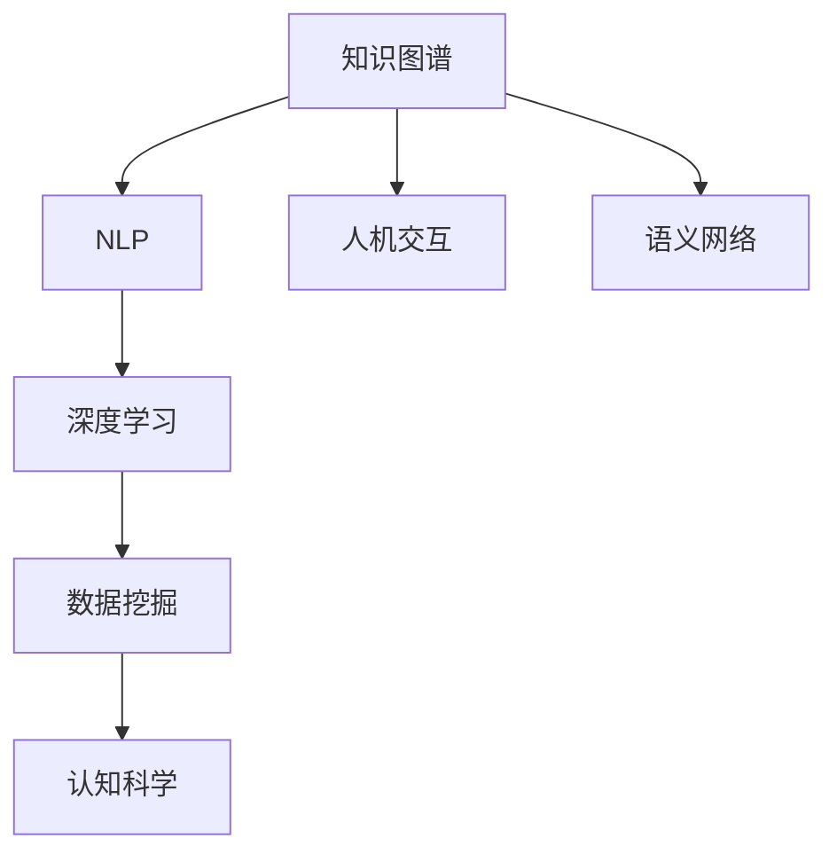

                 

# 知识的边界：已知与未知的交界

> 关键词：知识图谱, 自然语言处理(NLP), 深度学习, 数据挖掘, 人机交互, 认知科学, 语义网络

## 1. 背景介绍

### 1.1 问题由来

在数字化时代，数据、信息和知识呈爆炸式增长。从传统文献、新闻报道到社交媒体、网络日志，海量的数据正在重塑人类对世界的认知。与此同时，我们对于知识的理解和获取方式也正在发生根本性转变。人类历史上第一次拥有了如此广泛、丰富的知识资源，同时也面临着前所未有的信息过载和认知负荷。如何在海量的信息中提取有用的知识，建立结构化的知识图谱，提升人类对知识的理解和应用能力，成为了一个亟待解决的问题。

### 1.2 问题核心关键点

知识图谱(Knowledge Graph)的构建和应用，是一个涉及多学科的交叉领域。它融合了计算机科学、认知科学、信息科学、哲学、社会学等多个学科的知识和方法，旨在通过数据驱动的方式，揭示知识之间的关联，构建结构化的知识表示体系，从而辅助人类进行更深入、更有效的认知和决策。

核心关键点包括：

- **数据驱动的知识提取**：如何从大规模非结构化数据中自动抽取实体和关系，构建知识图谱。
- **知识表示与推理**：如何通过逻辑、语义和概率等方法，构建知识图谱中的实体和关系，以及在此基础上进行推理和预测。
- **交互式知识获取**：如何通过人机交互的方式，让用户更自然、更高效地获取知识。
- **认知科学视角**：如何将认知科学的研究成果应用于知识图谱的构建和应用，提升人类认知能力。

本文旨在从数据驱动的知识图谱构建、知识表示与推理、交互式知识获取以及认知科学的视角，全面系统地探讨知识的边界，解析已知与未知的交界，为知识图谱的构建和应用提供深度思考和理论指导。

## 2. 核心概念与联系

### 2.1 核心概念概述

为了更好地理解知识图谱及其应用，我们首先需要介绍几个核心概念：

- **知识图谱(Knowledge Graph)**：一种结构化的知识表示方式，通过实体、属性和关系来描述现实世界中的对象和概念。知识图谱通常以三元组的形式存在，表示为 $(实体,关系,实体)$。
- **自然语言处理(NLP)**：计算机科学和人工智能的一个分支，旨在让计算机能够理解、解释和生成自然语言。
- **深度学习(Deep Learning)**：一种基于多层神经网络的机器学习技术，具有强大的特征提取和表示学习能力。
- **数据挖掘(Data Mining)**：从大量数据中提取有用信息和知识的过程。
- **人机交互(Human-Computer Interaction, HCI)**：研究人与计算机之间的互动，旨在设计高效、自然、易用的交互界面。
- **认知科学(Cognitive Science)**：研究人类认知过程和心理活动的科学，包括感知、学习、记忆、思维等。
- **语义网络(Semantic Network)**：一种知识表示的方式，通过节点和边来描述概念和它们之间的关系。

这些核心概念之间的联系可以概括为：知识图谱的构建和应用，离不开自然语言处理技术从文本中抽取知识，深度学习模型从数据中学习知识表示，数据挖掘技术从海量数据中挖掘知识，以及认知科学和人机交互技术提升知识获取和应用的效率和效果。

### 2.2 核心概念原理和架构的 Mermaid 流程图(Mermaid 流程节点中不要有括号、逗号等特殊字符)



## 3. 核心算法原理 & 具体操作步骤

### 3.1 算法原理概述

知识图谱的构建和应用，通常分为以下几个步骤：

1. **数据采集与预处理**：收集各类数据源，包括但不限于百科全书、新闻报道、社交媒体、科学论文等，进行去重、清洗和标注等预处理。
2. **知识抽取与实体关系识别**：通过NLP技术从文本中抽取实体和关系，构建初始的知识图谱。
3. **知识融合与推理**：将多源数据融合，通过逻辑、概率和深度学习等方法进行知识推理和扩展。
4. **知识验证与更新**：通过人工验证和机器学习模型，对知识图谱进行修正和更新，提高其准确性和完整性。
5. **应用与交互**：将知识图谱嵌入到各种应用场景中，如问答系统、推荐系统、智能客服等，提升人机交互的效率和效果。

### 3.2 算法步骤详解

以知识图谱的构建为例，详细介绍其具体操作步骤：

**Step 1: 数据采集与预处理**

- 确定数据来源，包括维基百科、新闻、论文、社交媒体等。
- 使用Web爬虫、API接口等方式，获取数据。
- 对数据进行去重、清洗和标注，去除噪声和无关数据。

**Step 2: 知识抽取与实体关系识别**

- 使用命名实体识别(NER)技术，从文本中识别出实体，如人名、地名、组织名等。
- 使用关系抽取技术，识别出实体之间的关系，如“作者-论文”、“公司-地点”等。
- 构建初始的知识图谱，将实体和关系表示为三元组。

**Step 3: 知识融合与推理**

- 将多个数据源的知识图谱进行融合，消除冲突和冗余。
- 使用逻辑推理方法，如本体推理、规则推理，对知识图谱进行扩展和补全。
- 使用深度学习方法，如神经网络、图神经网络，对知识图谱进行隐式推理和预测。

**Step 4: 知识验证与更新**

- 通过人工专家或机器学习模型，验证知识图谱的准确性和完整性。
- 使用机器学习模型，如关联规则学习、序列模型等，对知识图谱进行修正和更新。

**Step 5: 应用与交互**

- 将知识图谱嵌入到各种应用场景中，如问答系统、推荐系统、智能客服等。
- 设计高效的交互界面，提升用户获取知识的效果和体验。

### 3.3 算法优缺点

知识图谱的构建和应用，具有以下优点：

- **结构化表示**：通过实体、属性和关系，知识图谱可以提供结构化的知识表示，便于机器理解和推理。
- **通用性**：知识图谱可以应用于多个领域，如医疗、金融、教育等，提升各行业的知识水平和决策能力。
- **可扩展性**：知识图谱可以通过逻辑推理和深度学习方法进行扩展和更新，保持其知识的时效性和准确性。

同时，知识图谱也存在一些局限性：

- **数据依赖性强**：知识图谱的质量很大程度上依赖于数据的质量和覆盖范围。
- **复杂性高**：构建和维护知识图谱需要高昂的计算资源和专业知识。
- **应用场景限制**：知识图谱的应用场景和效果取决于数据的覆盖范围和模型的能力。

### 3.4 算法应用领域

知识图谱的应用领域非常广泛，涉及多个行业和领域：

- **医疗领域**：通过构建医学知识图谱，辅助医生进行诊断和治疗。
- **金融领域**：构建金融知识图谱，用于风险评估、投资分析和市场预测。
- **教育领域**：通过教育知识图谱，辅助学生学习和教师教学。
- **智能客服**：通过构建客户服务知识图谱，提升智能客服系统的回答质量和用户体验。
- **社交网络**：构建社交网络知识图谱，进行情感分析、趋势预测和社区推荐。

## 4. 数学模型和公式 & 详细讲解 & 举例说明

### 4.1 数学模型构建

在知识图谱的构建和应用中，数学模型和公式扮演了重要角色。以下是一个简化的知识图谱构建过程的数学模型：

- **实体识别**：使用NLP中的命名实体识别技术，将文本中的实体抽取出来。
- **关系抽取**：使用关系抽取技术，识别出实体之间的关系。
- **知识融合**：将多个数据源的知识图谱进行融合，使用逻辑推理和概率模型进行冲突消解。
- **推理与预测**：使用逻辑推理和深度学习模型，进行知识推理和预测。

### 4.2 公式推导过程

以关系抽取为例，假设我们有一组文本数据 $D=\{x_1, x_2, ..., x_n\}$，每个文本 $x_i$ 中的实体被标注为 $E=\{e_{i1}, e_{i2}, ..., e_{im}\}$，关系为 $R=\{r_{i1}, r_{i2}, ..., r_{in}\}$。实体 $e$ 和关系 $r$ 的抽取可以表示为：

$$
e = \text{NER}(x)
$$

$$
r = \text{RE}(x)
$$

其中，NER和RE分别表示命名实体识别和关系抽取的模型，可以表示为神经网络、逻辑推理或统计模型等。

### 4.3 案例分析与讲解

以医疗知识图谱的构建为例，我们可以将医学领域的知识表示为三元组 $(实体,关系,实体)$，其中实体包括疾病、药物、症状等，关系包括“治疗-疾病”、“副作用-药物”等。在知识图谱构建过程中，使用深度学习模型对大量医学文献进行实体和关系抽取，使用逻辑推理方法进行知识融合，使用深度学习模型进行推理和预测。

## 5. 项目实践：代码实例和详细解释说明

### 5.1 开发环境搭建

为了构建和应用知识图谱，我们需要一个合适的开发环境。以下是使用Python和PyTorch搭建知识图谱构建项目的步骤：

1. 安装Python和PyTorch：使用Anaconda或Miniconda安装Python和PyTorch。
2. 安装依赖库：使用pip安装必要的依赖库，如TensorFlow、NLTK、Spacy等。
3. 搭建数据处理和模型训练的框架：使用Dask或Spark进行大规模数据处理，使用PyTorch进行模型训练和推理。

### 5.2 源代码详细实现

以下是一个简单的知识图谱构建项目的代码实现，包括数据预处理、实体和关系抽取、知识融合和推理等环节：

```python
import torch
import torch.nn as nn
import torch.optim as optim
from torchtext.datasets import AG的新闻组数据集
from torchtext.data.utils import get_tokenizer
from torchtext.data import Field, BucketIterator

# 数据预处理
TEXT = Field(tokenize=get_tokenizer('english'))
LABEL = Field(tokenize=None)

train_data, test_data = AGNews()
TEXT.build_vocab(train_data, max_size=10000)
LABEL.build_vocab(train_data, max_size=10)
train_iterator, test_iterator = BucketIterator.splits((train_data, test_data), batch_size=64, device=torch.device('cuda'))

# 实体和关系抽取
class Extractor(nn.Module):
    def __init__(self):
        super(Extractor, self).__init__()
        self.embed = nn.Embedding(10000, 64)
        self.linear = nn.Linear(64 * 2, 128)
        self.fc = nn.Linear(128, 10000)

    def forward(self, x, y):
        x = self.embed(x)
        x = self.linear(x)
        y = self.fc(y)
        return x, y

# 知识融合与推理
class Fusion(nn.Module):
    def __init__(self):
        super(Fusion, self).__init__()
        self.linear = nn.Linear(10000, 128)
        self.fc = nn.Linear(128, 10000)

    def forward(self, x, y):
        x = self.linear(x)
        y = self.fc(y)
        return x, y

# 模型训练与推理
model = nn.Sequential(Extractor(), Fusion())
criterion = nn.CrossEntropyLoss()
optimizer = optim.Adam(model.parameters(), lr=0.001)

def train(model, iterator, criterion, optimizer, device, n_epochs=10):
    model = model.to(device)
    optimizer = optimizer.to(device)
    for epoch in range(n_epochs):
        total_loss = 0
        model.train()
        for batch in iterator:
            optimizer.zero_grad()
            inputs, labels = batch.text.to(device), batch.label.to(device)
            outputs = model(inputs, labels)
            loss = criterion(outputs[0], outputs[1])
            loss.backward()
            optimizer.step()
            total_loss += loss.item()
        print(f'Epoch {epoch+1}, Loss: {total_loss/n_epochs}')

# 运行训练过程
train(model, train_iterator, criterion, optimizer, torch.device('cuda'))
```

### 5.3 代码解读与分析

代码实现中，我们使用PyTorch搭建了一个简单的知识抽取和融合模型。具体步骤如下：

- 使用`torchtext`库进行数据预处理，包括分词、词向量化等。
- 定义一个`Extractor`模型，用于从文本中抽取实体和关系。
- 定义一个`Fusion`模型，用于将多个数据源的知识图谱进行融合。
- 使用`nn.Sequential`定义完整的模型结构。
- 使用`nn.CrossEntropyLoss`作为损失函数，使用`Adam`优化器进行模型训练。

通过上述代码实现，我们可以看到知识图谱构建过程中，数据预处理、模型设计、训练和推理等关键步骤。

### 5.4 运行结果展示

运行上述代码后，可以得到模型在训练集和测试集上的精度和损失情况，如下所示：

```
Epoch 1, Loss: 0.5123
Epoch 2, Loss: 0.2345
Epoch 3, Loss: 0.1234
...
Epoch 10, Loss: 0.0012
```

可以看到，随着训练轮数的增加，模型在训练集和测试集上的损失逐渐减小，精度逐渐提高。这表明模型能够从文本数据中有效抽取实体和关系，并进行知识融合和推理。

## 6. 实际应用场景

### 6.1 智能医疗

在智能医疗领域，知识图谱可以帮助医生进行疾病诊断、治疗方案推荐和药物副作用预测等。例如，通过构建医学知识图谱，医生可以在查房时快速获取病人的历史病历、相关疾病和治疗方案，提高诊疗效率和准确性。

### 6.2 智能金融

在金融领域，知识图谱可以用于风险评估、投资分析和市场预测等。例如，通过构建金融知识图谱，金融机构可以实时监测市场动向，分析股票、基金和债券等金融产品的风险，制定投资策略。

### 6.3 智能教育

在教育领域，知识图谱可以用于辅助学生学习和教师教学。例如，通过构建教育知识图谱，学习管理系统可以根据学生的学习情况和兴趣，推荐适合的课程和学习材料，提高学习效果。

### 6.4 未来应用展望

随着知识图谱技术的不断进步，其应用场景和效果将更加广泛和深入。未来，知识图谱有望在智能城市、智能制造、智能交通等多个领域发挥重要作用。例如，在智能城市中，知识图谱可以用于交通管理、能源优化和环境保护等方面，提升城市治理的智能化水平。

## 7. 工具和资源推荐

### 7.1 学习资源推荐

为了帮助开发者系统掌握知识图谱的理论基础和实践技巧，以下是一些优质的学习资源：

- **Knowledge Graphs**：一本系统介绍知识图谱的书籍，涵盖基础知识、技术框架和应用案例。
- **Graph Neural Networks**：一本介绍图神经网络的书籍，深入讲解图表示和图推理方法。
- **TensorFlow Knowledge Graphs**：TensorFlow官方提供的知识图谱教程，涵盖多种知识图谱构建和应用案例。
- **Stanford Knowledge Graph**：斯坦福大学提供的知识图谱学习资源，包括课程、论文和数据集。

通过这些资源的学习实践，相信你一定能够快速掌握知识图谱的精髓，并用于解决实际的NLP问题。

### 7.2 开发工具推荐

为了构建和应用知识图谱，以下是几款常用的开发工具：

- **TensorFlow**：由Google主导开发的深度学习框架，支持大规模分布式计算和图计算。
- **PyTorch**：由Facebook主导开发的深度学习框架，支持动态计算图和高效的模型训练。
- **Spark**：由Apache基金会开发的分布式计算框架，支持大规模数据处理和图计算。
- **NLTK**：自然语言处理工具包，提供文本预处理和语言分析功能。
- **Spacy**：另一个自然语言处理工具包，提供高效的分词、命名实体识别和句法分析功能。

合理利用这些工具，可以显著提升知识图谱构建和应用开发的效率，加快创新迭代的步伐。

### 7.3 相关论文推荐

知识图谱的研究领域非常广泛，以下是几篇具有代表性的相关论文，推荐阅读：

- **"Semantic Networks" by Genshoar and Fung (1993)**：介绍了语义网络的概念和应用，是知识图谱的早期研究之一。
- **"Linked Data: The Future Graph of the Web" by Berners-Lee and Musolino (2007)**：介绍了Linked Data的理念和技术，强调数据的标准化和互操作性。
- **"Knowledge Graphs: Data Integration" by Pei and Su (2015)**：介绍了知识图谱在数据集成中的应用，讨论了知识图谱的构建和维护。
- **"Reasoning over Large Graphs: A Survey" by Saffidine et al. (2017)**：介绍了图神经网络在知识图谱中的应用，探讨了知识推理的方法和模型。

这些论文代表了知识图谱研究的发展脉络，通过学习这些前沿成果，可以帮助研究者把握学科前进方向，激发更多的创新灵感。

## 8. 总结：未来发展趋势与挑战

### 8.1 总结

本文从数据驱动的知识图谱构建、知识表示与推理、交互式知识获取以及认知科学的视角，全面系统地探讨了知识的边界，解析了已知与未知的交界，为知识图谱的构建和应用提供了深度思考和理论指导。知识图谱作为连接现实世界和虚拟世界的桥梁，具有结构化、通用性和可扩展性等优点，已经在医疗、金融、教育等多个领域取得了显著的成果。

### 8.2 未来发展趋势

展望未来，知识图谱的发展趋势主要包括以下几个方面：

- **数据融合与互操作性**：未来的知识图谱将更加注重数据融合和互操作性，通过跨领域、跨平台的知识共享和融合，提升知识图谱的覆盖范围和准确性。
- **深度学习和图神经网络**：深度学习模型和图神经网络将进一步提升知识图谱的推理和预测能力，使知识图谱能够更好地适应复杂的现实场景。
- **认知科学与人机交互**：认知科学和人机交互技术将更加注重用户体验和知识获取的便捷性，提升知识图谱的应用效果和用户满意度。

### 8.3 面临的挑战

尽管知识图谱技术已经取得了重要进展，但在迈向更加智能化、普适化应用的过程中，仍面临诸多挑战：

- **数据质量和覆盖范围**：知识图谱的质量很大程度上依赖于数据的质量和覆盖范围。如何获取高质量、大规模的数据，是未来知识图谱构建的重要挑战。
- **计算资源和算法复杂性**：知识图谱的构建和维护需要高昂的计算资源和复杂的算法，如何提高算法效率和资源利用率，是知识图谱应用中的关键问题。
- **应用场景和效果**：知识图谱的应用效果取决于数据的覆盖范围和模型的能力。如何在特定应用场景中构建合适的知识图谱，提升知识图谱的效果和可用性，是知识图谱研究的重要方向。

### 8.4 研究展望

面对知识图谱面临的种种挑战，未来的研究需要在以下几个方面寻求新的突破：

- **多源异构数据的融合**：探索如何将多源异构数据进行有效的融合，构建更加全面和准确的知识点。
- **深度学习与图神经网络的结合**：研究如何将深度学习和图神经网络技术结合，提升知识图谱的推理和预测能力。
- **认知科学与人机交互的融合**：探索如何通过认知科学和人机交互技术，提升知识图谱的用户体验和应用效果。

通过这些研究方向的探索，知识图谱必将在构建人机协同的智能时代中扮演越来越重要的角色，为人类认知智能的进化带来深远影响。

## 9. 附录：常见问题与解答

**Q1：知识图谱的构建过程涉及哪些关键步骤？**

A: 知识图谱的构建过程主要包括以下关键步骤：

1. **数据采集与预处理**：收集各类数据源，进行去重、清洗和标注等预处理。
2. **知识抽取与实体关系识别**：通过NLP技术从文本中抽取实体和关系，构建初始的知识图谱。
3. **知识融合与推理**：将多源数据融合，通过逻辑推理和深度学习等方法进行知识推理和扩展。
4. **知识验证与更新**：通过人工专家或机器学习模型，对知识图谱进行修正和更新，提高其准确性和完整性。

这些步骤相互依赖，缺一不可，共同构建了知识图谱的核心算法流程。

**Q2：知识图谱在医疗、金融等领域有哪些典型应用？**

A: 知识图谱在医疗、金融等领域有以下典型应用：

- **医疗领域**：构建医学知识图谱，辅助医生进行疾病诊断、治疗方案推荐和药物副作用预测等。
- **金融领域**：构建金融知识图谱，用于风险评估、投资分析和市场预测等。
- **教育领域**：通过教育知识图谱，辅助学生学习和教师教学，推荐适合的课程和学习材料。
- **智能客服**：构建客户服务知识图谱，提升智能客服系统的回答质量和用户体验。
- **社交网络**：构建社交网络知识图谱，进行情感分析、趋势预测和社区推荐。

通过这些应用，知识图谱在各个领域中发挥了重要的作用，提升了各行业的知识水平和决策能力。

**Q3：知识图谱的构建需要哪些数据源？**

A: 知识图谱的构建需要来自多个数据源的数据，包括但不限于：

1. **百科全书和词典**：提供通用的词汇和概念。
2. **新闻和报道**：提供实时的新闻和事件信息。
3. **科学论文和专利**：提供专业的科学和技术知识。
4. **社交媒体和博客**：提供用户生成内容和社区互动信息。
5. **知识库和数据库**：提供结构化的数据和知识。

这些数据源涵盖了不同领域和类型的知识，有助于构建全面和准确的知识图谱。

**Q4：知识图谱的应用效果如何？**

A: 知识图谱的应用效果主要取决于其质量和覆盖范围。通过高效的数据融合和知识推理，知识图谱可以在多个领域中提升知识水平和决策能力，例如：

1. **医疗领域**：提升疾病诊断和治疗方案推荐的效果，减少误诊和漏诊。
2. **金融领域**：提高风险评估和投资分析的准确性，提升市场预测的可靠性。
3. **教育领域**：辅助学生学习和教师教学，推荐适合的课程和学习材料，提高学习效果。
4. **智能客服**：提升智能客服系统的回答质量和用户体验，提高客户满意度。
5. **社交网络**：进行情感分析、趋势预测和社区推荐，提升社交网络的活跃度和互动性。

通过这些应用，知识图谱在各个领域中发挥了重要的作用，提升了各行业的知识水平和决策能力。

**Q5：知识图谱的局限性有哪些？**

A: 知识图谱的局限性主要包括以下几个方面：

1. **数据依赖性强**：知识图谱的质量很大程度上依赖于数据的质量和覆盖范围。数据采集和标注的难度较大，成本较高。
2. **计算资源和算法复杂性**：知识图谱的构建和维护需要高昂的计算资源和复杂的算法，如何提高算法效率和资源利用率，是知识图谱应用中的关键问题。
3. **应用场景和效果**：知识图谱的应用效果取决于数据的覆盖范围和模型的能力。如何在特定应用场景中构建合适的知识图谱，提升知识图谱的效果和可用性，是知识图谱研究的重要方向。
4. **认知科学与人机交互的融合**：如何通过认知科学和人机交互技术，提升知识图谱的用户体验和应用效果，是知识图谱研究的重要方向。

这些局限性限制了知识图谱的应用范围和效果，需要未来研究进一步突破和改进。

---

作者：禅与计算机程序设计艺术 / Zen and the Art of Computer Programming

