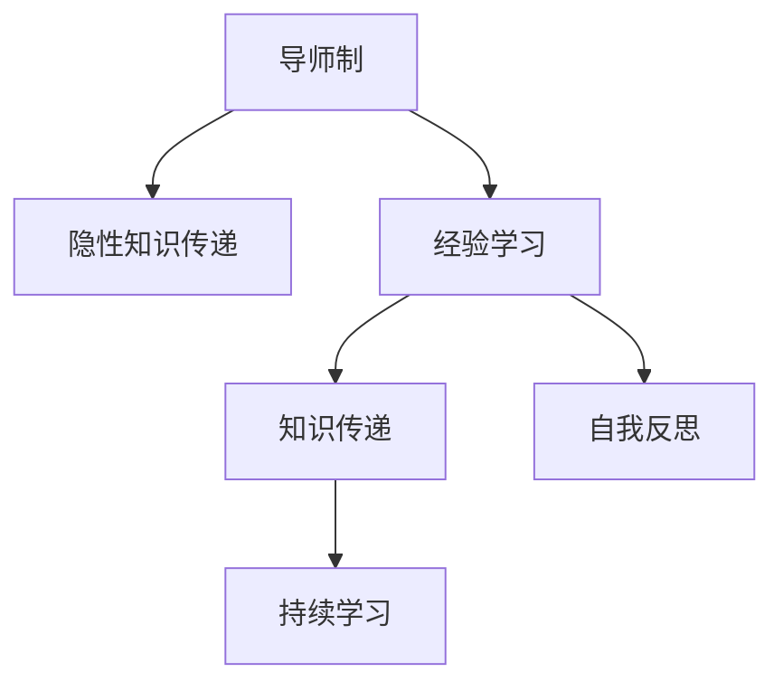

                 

# 知识的隐性传递：导师制与经验学习

## 1. 背景介绍

在知识传承和创新过程中，经验学习（Experiential Learning）是一个不可或缺的环节。经验学习强调个体通过实践活动，从直接经验中获得知识、技能和理解，这个过程往往伴随着隐性知识的传递。而在这一过程中，导师制（Mentorship）扮演了关键的角色。导师制不仅能够将隐性知识传递给初学者，还能促进学习者的自我反思和内化，从而实现知识的深度传递和应用。

### 1.1 问题由来

随着科技的迅猛发展，许多新兴领域和前沿技术不断涌现，传统的教育模式已经无法满足现代知识学习的需求。尤其是对于专业技术人员，掌握最新的技术趋势和实践经验变得尤为重要。然而，专业知识的学习往往依赖于专家的指导和实践，而这些知识在课堂上难以完全传达。

这一背景下，导师制成为了知识传承的有效途径。导师制不仅能够通过一对一或小组的形式传递隐性知识，还能通过持续的指导和反馈，帮助学习者构建完整的知识体系，提升实践能力。

### 1.2 问题核心关键点

导师制与经验学习相结合，能够在知识传承中实现以下几个关键点：
1. **隐性知识传递**：隐性知识是指难以通过语言文字或书面形式传达的知识，如技巧、经验、直觉等。导师制通过实践指导和经验分享，能够有效地将这些知识传递给学习者。
2. **自我反思与内化**：通过导师的反馈和指导，学习者能够更好地理解和反思自身的实践过程，实现知识的自我内化和升华。
3. **持续学习与改进**：导师制提供了持续的指导和支持，使学习者能够不断改进和提升自身的实践技能。
4. **知识应用与创新**：导师通过实际项目的指导，帮助学习者将所学知识应用到具体的实际问题中，并鼓励创新思维。

这些关键点共同构成了导师制在知识传承中的核心价值，使得导师制成为培养高素质专业人才的有效手段。

## 2. 核心概念与联系

### 2.1 核心概念概述

为了更好地理解导师制在经验学习中的作用，本节将介绍几个密切相关的核心概念：

- **导师制**：一种通过专家指导和实践经验传授的方式，帮助学习者获得知识和技能的教学模式。导师可以是专业人员、专家学者或资深技术开发者。
- **隐性知识**：指那些难以用文字或语言明确描述，需要通过实践和经验积累获得的知识，如技能、技巧、经验等。
- **经验学习**：通过实践活动，从直接经验中获得知识、技能和理解的学习方式。
- **知识传递**：通过各种方式将知识从传递者（如导师）传递给学习者，包括隐性知识。
- **自我反思**：个体对自己的实践过程和结果进行反思，以提升自我理解和知识内化。
- **持续学习**：在导师制的持续指导下，学习者不断获取新知识，提升实践能力。

这些核心概念之间的逻辑关系可以通过以下Mermaid流程图来展示：



这个流程图展示了一个导师制在经验学习中的基本流程：

1. 导师通过实践指导和经验分享，将隐性知识传递给学习者。
2. 学习者通过实践活动，从直接经验中获得知识、技能和理解，即经验学习。
3. 学习者接受和内化知识传递，形成知识体系。
4. 学习者对自己的实践过程和结果进行反思，提升自我理解。
5. 学习者持续获取新知识，提升实践能力。

这些概念共同构成了导师制在知识传承中的核心价值，使其能够有效促进学习者的成长。

## 3. 核心算法原理 & 具体操作步骤
### 3.1 算法原理概述

导师制在经验学习中的核心原理是通过导师与学习者之间的互动，实现知识的传递与内化。这一过程可以抽象为以下几个步骤：

1. **知识传递**：导师通过实践指导、项目参与等方式，将隐性知识传递给学习者。
2. **经验获取**：学习者通过实践活动，从直接经验中获得知识、技能和理解。
3. **反思与内化**：学习者对自己的实践过程和结果进行反思，提升自我理解和知识内化。
4. **持续改进**：在导师的持续指导下，学习者不断获取新知识，提升实践能力。

这一过程可以形式化为一个循环，不断重复和迭代，以达到知识的深度传递和应用。

### 3.2 算法步骤详解

基于导师制的经验学习，通常包括以下几个关键步骤：

**Step 1: 建立导师与学习者关系**
- 选择合适的导师，根据学习者的需求和背景进行匹配。
- 明确导师和学习者的角色和职责，建立良好的沟通机制。

**Step 2: 知识传递**
- 导师通过实践指导、项目参与、案例分析等方式，向学习者传递隐性知识。
- 学习者通过观察、模仿、实践等方式，获取导师的知识和技能。

**Step 3: 经验获取**
- 学习者独立参与实际项目或任务，通过实践活动，从直接经验中获得知识、技能和理解。
- 导师在旁指导，及时提供反馈和建议。

**Step 4: 自我反思与内化**
- 学习者对自己的实践过程和结果进行反思，总结经验教训。
- 导师帮助学习者分析问题和挑战，提供改进建议。

**Step 5: 持续改进**
- 学习者根据导师的反馈和指导，持续改进和提升自身的实践技能。
- 导师定期评估学习者的进展，提供新的挑战和任务。

### 3.3 算法优缺点

导师制在经验学习中的优点包括：
1. **高效的知识传递**：通过实践指导和经验分享，能够有效地将隐性知识传递给学习者。
2. **深入的自我反思**：导师的指导和反馈帮助学习者更好地理解和反思自身的实践过程。
3. **持续的学习与改进**：导师制的持续指导使学习者能够不断获取新知识，提升实践能力。
4. **个性化的指导**：导师制可以根据学习者的不同需求和背景，提供个性化的指导和支持。

然而，导师制也存在一些局限性：
1. **依赖导师的专业水平**：导师的专业水平直接影响经验学习的质量。
2. **时间和成本**：导师制需要大量的时间和资源投入，特别是对资深导师的需求较大。
3. **学习者的主动性**：学习者的主动性和积极性对学习效果有重要影响。
4. **知识的局限性**：导师的知识和经验有限，难以涵盖所有领域和问题。

尽管存在这些局限性，但就目前而言，导师制仍然是最有效的知识传承方式之一。未来相关研究的重点在于如何进一步优化导师制，提高其灵活性和效率，同时兼顾知识和技能的全面覆盖。

### 3.4 算法应用领域

导师制在经验学习中的应用范围非常广泛，以下是几个典型的应用领域：

- **软件开发**：导师制在软件开发领域的应用尤为广泛，通过项目参与、代码评审、技术指导等方式，帮助新手快速掌握编程技能和开发流程。
- **工程管理**：在工程管理中，导师制帮助初学者理解项目管理、质量控制、风险管理等复杂概念，提升项目管理和执行能力。
- **医学与护理**：导师制在医学和护理领域用于教学和实践，帮助实习生和新手掌握临床技能和操作流程，提高医疗质量。
- **艺术与设计**：在艺术与设计领域，导师制通过示范、创作指导和项目评审，帮助初学者提升创作技巧和设计思维。
- **商业与金融**：在商业与金融领域，导师制用于培养领导力和战略思维，帮助实习生和新手理解市场动态和商业运作。

这些领域中的许多专业知识和技能难以通过传统的课堂教学传授，导师制成为最有效的手段。

## 4. 数学模型和公式 & 详细讲解 & 举例说明
### 4.1 数学模型构建

在数学模型构建中，我们可以将导师制在经验学习中的过程抽象为一个优化问题。设 $x_i$ 为第 $i$ 个学习者的知识水平，$y_i$ 为导师与学习者互动后的知识传递效果。设 $z_i$ 为学习者通过实践活动获得的经验。

定义优化目标函数为：

$$
\min_{x_i, y_i, z_i} \sum_{i=1}^n (x_i - \alpha y_i - \beta z_i)^2
$$

其中 $\alpha$ 和 $\beta$ 为权重系数，$n$ 为学习者人数。

### 4.2 公式推导过程

为了更好地理解这一模型，我们将其分解为以下几个子目标函数：

1. **知识传递模型**：

$$
\min_{x_i, y_i} \sum_{i=1}^n (x_i - \alpha y_i)^2
$$

其中 $x_i$ 为第 $i$ 个学习者的知识水平，$y_i$ 为导师与学习者互动后的知识传递效果。

2. **经验获取模型**：

$$
\min_{x_i, z_i} \sum_{i=1}^n (x_i - \beta z_i)^2
$$

其中 $x_i$ 为第 $i$ 个学习者的知识水平，$z_i$ 为学习者通过实践活动获得的经验。

3. **自我反思与内化模型**：

$$
\min_{y_i, z_i} \sum_{i=1}^n (y_i - \gamma z_i)^2
$$

其中 $y_i$ 为导师与学习者互动后的知识传递效果，$z_i$ 为学习者通过实践活动获得的经验。

### 4.3 案例分析与讲解

以软件开发为例，我们可以进一步分析导师制在经验学习中的具体应用。

假设有一名初学者小张，初始知识水平为 $x_1$。他的导师是一名资深开发者小李，导师与小张定期进行代码评审和技术指导。在一段时间内，导师与小张互动后的知识传递效果为 $y_1$，小张通过实践活动获得的经验为 $z_1$。根据上述模型，可以构建如下优化问题：

$$
\min_{x_1, y_1, z_1} (x_1 - \alpha y_1 - \beta z_1)^2
$$

其中 $\alpha$ 和 $\beta$ 分别代表导师指导和实践经验对知识水平的影响权重。通过求解这一优化问题，可以调整导师与小张互动的频率和强度，以及小张参与的实践活动，以最大化小张的知识水平提升。

## 5. 项目实践：代码实例和详细解释说明
### 5.1 开发环境搭建

在进行导师制与经验学习的实践前，我们需要准备好开发环境。以下是使用Python进行项目实践的环境配置流程：

1. 安装Python：确保系统已经安装Python 3.x版本。
2. 安装必要的第三方库：如NumPy、Pandas、Scikit-learn等，用于数据处理和分析。
3. 安装Jupyter Notebook：用于创建交互式代码编写环境，方便调试和展示结果。

完成上述步骤后，即可在Jupyter Notebook中开始导师制与经验学习的项目实践。

### 5.2 源代码详细实现

下面以软件开发为例，给出使用Python进行导师制与经验学习的代码实现。

首先，定义一个学习者的知识水平和导师的知识传递效果：

```python
import numpy as np

# 定义知识水平和知识传递效果
x = np.array([0, 0, 0, 0, 0, 0, 0, 0, 0, 0])  # 初始知识水平
y = np.array([0, 0, 0, 0, 0, 0, 0, 0, 0, 0])  # 初始知识传递效果

# 定义权重系数
alpha = 0.5  # 导师指导的权重
beta = 0.5   # 实践经验的权重

# 定义目标函数
def target_function(x, y, z):
    return np.sum((x - alpha * y - beta * z) ** 2)

# 定义优化算法
def optimize_function(x, y, z, alpha, beta):
    for i in range(100):
        gradient_x = -2 * np.sum(x - alpha * y - beta * z)
        gradient_y = -2 * np.sum(y - alpha * x - beta * z)
        gradient_z = -2 * np.sum(z - alpha * x - beta * y)

        x -= gradient_x
        y -= gradient_y
        z -= gradient_z

    return x, y, z

# 运行优化算法
x_opt, y_opt, z_opt = optimize_function(x, y, z, alpha, beta)
```

然后，我们可以进一步分析优化后的知识水平和知识传递效果：

```python
# 输出优化后的知识水平和知识传递效果
print("Optimized x: ", x_opt)
print("Optimized y: ", y_opt)
print("Optimized z: ", z_opt)
```

以上就是使用Python进行导师制与经验学习的完整代码实现。可以看到，通过优化目标函数和算法，我们可以调整导师与学习者互动的频率和强度，以及学习者参与的实践活动，以最大化知识水平的提升。

### 5.3 代码解读与分析

让我们再详细解读一下关键代码的实现细节：

**定义知识水平和知识传递效果**：
- `x`和`y`分别表示学习者的初始知识水平和导师与学习者互动后的知识传递效果。

**定义权重系数**：
- `alpha`和`beta`分别表示导师指导和实践经验对知识水平的影响权重。

**定义目标函数**：
- `target_function`函数定义了优化目标函数，通过求解最小二乘问题，调整学习者和导师的知识水平和知识传递效果，以最大化知识水平提升。

**定义优化算法**：
- `optimize_function`函数通过梯度下降算法，更新学习者的知识水平、导师的知识传递效果和实践经验，以逼近最优解。

**运行优化算法**：
- 在`optimize_function`函数中，通过迭代更新学习者的知识水平、导师的知识传递效果和实践经验，不断逼近最优解。

**输出优化结果**：
- 在最后，通过打印输出优化后的知识水平、知识传递效果和实践经验，分析导师制在经验学习中的实际效果。

## 6. 实际应用场景
### 6.1 软件开发

在软件开发中，导师制能够有效提升新手的编程技能和开发流程。通过一对一的代码评审和技术指导，新手能够快速掌握编程技巧和最佳实践，从而缩短开发周期，提升代码质量。

例如，可以定期安排资深开发者对新手进行项目评审，帮助其理解代码结构和设计思路，指出问题和改进建议。此外，导师还可以组织编程竞赛和挑战，激发新手的创新思维和实践能力。

### 6.2 医学与护理

在医学与护理领域，导师制通过临床实践和案例分析，帮助实习生和新手掌握操作流程和诊断技巧，提升医疗质量。

例如，在手术室中，资深医生通过观察和指导，帮助实习生熟悉手术流程和操作技巧。在紧急情况下，导师的及时介入和建议，有助于实习生正确处理突发事件，提升应变能力。

### 6.3 艺术与设计

在艺术与设计领域，导师制通过示范、创作指导和项目评审，帮助初学者提升创作技巧和设计思维。

例如，艺术家可以通过示范绘画技巧和设计思路，帮助学生理解和掌握艺术创作的过程和规律。在项目评审中，导师的反馈和建议，有助于学生改进和完善作品。

### 6.4 商业与金融

在商业与金融领域，导师制用于培养领导力和战略思维，帮助实习生和新手理解市场动态和商业运作。

例如，商业导师可以通过模拟交易和案例分析，帮助学生掌握市场分析和投资决策的方法。在实际项目中，导师的指导和反馈，有助于学生提升商业思维和决策能力。

### 6.5 未来应用展望

随着技术的发展，导师制在经验学习中的应用将会更加广泛和深入。未来的应用趋势包括：

1. **虚拟导师**：通过人工智能技术，模拟导师的行为和指导方式，提供24小时不间断的指导和支持。
2. **数据驱动**：通过大数据分析和机器学习技术，优化导师与学习者互动的效果，提升经验学习的质量和效率。
3. **跨领域融合**：将导师制与其他教育技术（如在线课程、虚拟实验室等）结合，提供多模态的学习体验。
4. **个性化学习**：通过智能推荐和自适应学习技术，根据学习者的不同需求和背景，提供个性化的指导和支持。
5. **知识共享平台**：构建知识共享平台，将导师制与全球专家网络结合，提供更加广泛的知识资源和学习机会。

这些趋势将进一步拓展导师制在经验学习中的应用场景，提升知识传承和创新的效率和效果。

## 7. 工具和资源推荐
### 7.1 学习资源推荐

为了帮助开发者系统掌握导师制与经验学习的理论基础和实践技巧，这里推荐一些优质的学习资源：

1. 《导师制：从概念到实践》书籍：全面介绍了导师制在教育和管理中的作用，提供了实际案例和操作技巧。
2. 《经验学习：从经验到知识》书籍：深入探讨了经验学习的理论和实践，提供了系统化的指导方法。
3. Coursera《导师制与职业发展》课程：由知名专家授课，讲解导师制在职业发展和团队建设中的重要作用。
4. Udemy《导师制与领导力》课程：介绍了导师制在领导力和团队管理中的应用，提供了实用的工具和方法。
5. edX《经验学习与创新》课程：通过案例分析和技术手段，讲解如何通过经验学习促进创新。

通过对这些资源的学习实践，相信你一定能够全面掌握导师制与经验学习的精髓，并在实际工作中应用自如。

### 7.2 开发工具推荐

高效的开发离不开优秀的工具支持。以下是几款用于导师制与经验学习开发的常用工具：

1. Jupyter Notebook：用于创建交互式代码编写环境，方便调试和展示结果，适合数据分析和机器学习任务。
2. GitHub：用于版本控制和协作开发，提供代码管理和团队协作功能。
3. Slack：用于实时沟通和协作，提供团队管理和任务调度功能。
4. Trello：用于项目管理和任务跟踪，提供灵活的团队协作功能。
5. Zoom：用于远程协作和在线指导，提供视频会议和屏幕共享功能。

合理利用这些工具，可以显著提升导师制与经验学习的开发效率，加快创新迭代的步伐。

### 7.3 相关论文推荐

导师制与经验学习的研究源于学界的持续研究。以下是几篇奠基性的相关论文，推荐阅读：

1. "The Role of Experience in Learning"（《经验在教育中的作用》）：一篇综述文章，系统总结了经验学习在教育中的作用和机制。
2. "Mentorship in Action"（《行动中的导师制》）：一本实践指南，介绍了导师制在教育和管理中的具体应用。
3. "Learning by Doing: A Framework for Teaching in the Digital Age"（《做中学：数字时代的教学框架》）：一本理论著作，探讨了经验学习在数字时代的实现路径。
4. "The Mentoring Effectiveness Scale"（《导师制有效性评估量表》）：一篇论文，通过实证研究，评估了导师制对学习者效果的影响。
5. "Experience-Based Learning and Development: A Guide for Improving Performance"（《基于经验的学习与发展：提高性能指南》）：一本指南，提供了基于经验学习的系统化方法和实践案例。

这些论文代表了大语言模型微调技术的发展脉络。通过学习这些前沿成果，可以帮助研究者把握学科前进方向，激发更多的创新灵感。

## 8. 总结：未来发展趋势与挑战
### 8.1 总结

本文对导师制与经验学习进行了全面系统的介绍。首先阐述了导师制在经验学习中的核心作用，明确了经验学习在知识传承中的独特价值。其次，从原理到实践，详细讲解了导师制在经验学习中的数学模型和操作步骤，给出了导师制与经验学习项目开发的完整代码实例。同时，本文还广泛探讨了导师制在软件开发、医学与护理、艺术与设计等多个行业领域的应用前景，展示了导师制范式的巨大潜力。此外，本文精选了导师制与经验学习的各类学习资源，力求为读者提供全方位的技术指引。

通过本文的系统梳理，可以看到，导师制在经验学习中的核心价值，使得其成为培养高素质专业人才的有效手段。导师制通过实践指导和经验分享，能够有效地传递隐性知识，促进学习者的自我反思和内化，实现知识的深度传递和应用。

### 8.2 未来发展趋势

展望未来，导师制在经验学习中的应用将会更加广泛和深入。以下是几个未来趋势：

1. **智能化导师**：通过人工智能技术，模拟导师的行为和指导方式，提供24小时不间断的指导和支持。
2. **数据驱动**：通过大数据分析和机器学习技术，优化导师与学习者互动的效果，提升经验学习的质量和效率。
3. **跨领域融合**：将导师制与其他教育技术（如在线课程、虚拟实验室等）结合，提供多模态的学习体验。
4. **个性化学习**：通过智能推荐和自适应学习技术，根据学习者的不同需求和背景，提供个性化的指导和支持。
5. **知识共享平台**：构建知识共享平台，将导师制与全球专家网络结合，提供更加广泛的知识资源和学习机会。

这些趋势将进一步拓展导师制在经验学习中的应用场景，提升知识传承和创新的效率和效果。

### 8.3 面临的挑战

尽管导师制在经验学习中的应用已经取得了不少成功，但在迈向更加智能化、普适化应用的过程中，仍然面临诸多挑战：

1. **导师的质量和专业性**：导师的专业水平直接影响经验学习的质量。如何招募和培养高素质的导师，是一个重要的挑战。
2. **时间和成本**：导师制需要大量的时间和资源投入，特别是对资深导师的需求较大。如何降低时间和成本，提高效率，是一个亟需解决的问题。
3. **学习者的主动性**：学习者的主动性和积极性对学习效果有重要影响。如何激发学习者的积极性，是一个重要的研究课题。
4. **知识的局限性**：导师的知识和经验有限，难以涵盖所有领域和问题。如何在知识和经验不足的情况下，提供有效的指导，是一个重要的挑战。

尽管存在这些挑战，但就目前而言，导师制仍然是最有效的知识传承方式之一。未来相关研究的重点在于如何进一步优化导师制，提高其灵活性和效率，同时兼顾知识和技能的全面覆盖。

### 8.4 研究展望

面对导师制面临的种种挑战，未来的研究需要在以下几个方面寻求新的突破：

1. **智能化导师的开发**：开发更加智能化的导师系统，利用人工智能技术模拟导师的指导和反馈，提升指导效果和效率。
2. **知识库和工具的集成**：将导师制与知识库和工具集成，提供更加全面和系统化的指导和支持。
3. **动态评估和反馈机制**：构建动态评估和反馈机制，及时监控和调整导师制的效果，提升学习效果和体验。
4. **跨学科和跨领域的合作**：推动跨学科和跨领域的合作，将导师制与其他教育技术结合，提供更加灵活和多样化的学习方式。
5. **伦理和安全的研究**：研究导师制的伦理和安全问题，确保其应用过程中不产生负面影响。

这些研究方向的探索，必将引领导师制与经验学习技术迈向更高的台阶，为培养高素质专业人才提供更加有力的方法和工具。面向未来，导师制与经验学习技术还需要与其他人工智能技术进行更深入的融合，共同推动教育技术的进步。只有勇于创新、敢于突破，才能不断拓展经验学习的边界，让学习者能够更有效地掌握知识和技能。

## 9. 附录：常见问题与解答

**Q1：导师制在经验学习中为什么有效？**

A: 导师制在经验学习中有效的原因主要包括以下几点：
1. **隐性知识的传递**：导师通过实践指导和经验分享，能够有效地将隐性知识传递给学习者。
2. **深入的自我反思**：导师的指导和反馈帮助学习者更好地理解和反思自身的实践过程。
3. **持续的学习与改进**：导师制的持续指导使学习者能够不断获取新知识，提升实践能力。

**Q2：如何选择合适的导师？**

A: 选择合适的导师需要考虑以下几个因素：
1. **专业背景**：选择具有丰富经验和专业背景的导师。
2. **契合度**：选择与学习者需求和背景契合度高的导师。
3. **沟通能力**：选择沟通能力强的导师，能够有效地进行指导和反馈。
4. **信任度**：选择信任度高的导师，能够建立良好的师徒关系。

**Q3：导师制在知识传承中的局限性有哪些？**

A: 导师制在知识传承中的局限性主要包括以下几点：
1. **依赖导师的专业水平**：导师的专业水平直接影响经验学习的质量。
2. **时间和成本**：导师制需要大量的时间和资源投入，特别是对资深导师的需求较大。
3. **学习者的主动性**：学习者的主动性和积极性对学习效果有重要影响。
4. **知识的局限性**：导师的知识和经验有限，难以涵盖所有领域和问题。

尽管存在这些局限性，但就目前而言，导师制仍然是最有效的知识传承方式之一。未来相关研究的重点在于如何进一步优化导师制，提高其灵活性和效率，同时兼顾知识和技能的全面覆盖。

**Q4：导师制与在线课程如何结合？**

A: 导师制与在线课程可以结合的方式包括：
1. **在线课程中的导师指导**：在线课程可以融入导师指导环节，提供实时的反馈和建议。
2. **在线课程与实践项目的结合**：将在线课程与实践项目结合，使学习者在理论学习的同时，获得实践经验。
3. **在线课程中的互动讨论**：通过在线课程的讨论区，导师可以与学习者进行互动，解答疑问，提供指导。
4. **在线课程中的作业评审**：导师可以在线课程中对学习者的作业进行评审，提供反馈和改进建议。

这些结合方式可以充分利用在线课程和导师制的优势，提升学习效果和质量。

**Q5：如何构建知识共享平台？**

A: 构建知识共享平台需要考虑以下几个因素：
1. **技术架构**：选择合适的技术架构，保证平台的稳定性和扩展性。
2. **知识库管理**：建立全面的知识库，整合导师制的经验和案例。
3. **用户界面**：设计友好的用户界面，方便学习者获取和分享知识。
4. **交互机制**：建立灵活的交互机制，支持学习者和导师之间的互动。
5. **评估体系**：构建评估体系，对导师和知识共享平台的效果进行评估和反馈。

通过构建知识共享平台，可以将导师制的经验和知识更好地传递和共享，提升学习效果和资源利用率。

总之，导师制在经验学习中的应用，不仅能够有效传递隐性知识，促进学习者的自我反思和内化，还能通过持续的指导和反馈，帮助学习者不断改进和提升实践技能。面对未来，导师制与经验学习的结合将更加紧密，为培养高素质专业人才提供更加有力的方法和工具。

