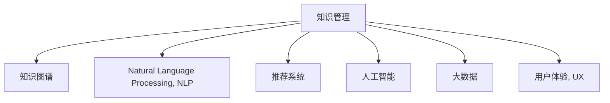

                 

# 知识管理在危机应对中的作用

> 关键词：知识管理,危机应对,知识图谱,知识工程,人工智能,大数据,自然语言处理,推荐系统,用户体验

## 1. 背景介绍

### 1.1 问题由来

在现代社会，各种类型的危机频繁发生，无论是自然灾害、公共卫生事件，还是企业危机、金融危机，都给社会带来了巨大的冲击。面对这些危机，有效的应对措施至关重要。危机应对不仅仅需要快速的反应和资源调配，更需要在复杂的背景下，做出明智的决策。而这一切的基础，是企业或组织具备强大的信息整合与知识管理能力。

### 1.2 问题核心关键点

危机应对中的知识管理，核心在于如何从大量海量的数据和信息中快速抽取出有价值的知识，并将其高效地整合、应用到决策过程中。这不仅涉及数据的收集、整理、分析，更需要通过先进的技术手段，如知识图谱、自然语言处理（NLP）、推荐系统等，进行深度挖掘和智能推荐，以支撑决策者的决策。

### 1.3 问题研究意义

研究知识管理在危机应对中的作用，具有以下几方面的意义：

1. 提升决策效率。通过对海量的数据进行分析和整合，快速提炼出关键信息，辅助决策者做出快速反应，提升决策效率。
2. 提高决策质量。通过智能化的知识推荐和辅助决策，减少决策中的主观偏差，提高决策的科学性和准确性。
3. 增强应对能力。通过智能化的知识管理，提升组织在应对各类危机中的整体应对能力，减少因信息不对称导致的损失。
4. 降低信息过载。通过知识管理，帮助决策者在信息过载的环境中，聚焦关键信息，减轻信息负担。
5. 促进创新。通过知识整合和智能推荐，激发新的想法和创意，促进组织在危机应对中的创新与变革。

## 2. 核心概念与联系

### 2.1 核心概念概述

为了深入理解知识管理在危机应对中的作用，我们先简要介绍几个核心概念：

- **知识管理（Knowledge Management, KM）**：旨在整合、共享、应用和创新组织内部的知识，以提升组织能力和决策质量。
- **知识图谱（Knowledge Graph, KG）**：以图形化方式表示实体及其相互关系，便于知识表示、查询和推理。
- **自然语言处理（Natural Language Processing, NLP）**：通过计算机技术处理和理解人类语言，以提取、整合和生成知识。
- **推荐系统（Recommendation System）**：利用用户历史行为数据，推荐用户可能感兴趣的内容或产品。
- **人工智能（Artificial Intelligence, AI）**：使计算机系统具备人类智能的能力，包括学习、推理和自适应等。
- **大数据（Big Data）**：包含结构化和非结构化数据的海量集合，需要进行大规模分析和处理。
- **用户体验（User Experience, UX）**：用户在使用产品或服务过程中产生的感受和体验，涉及界面设计、交互方式等。

这些概念之间的逻辑关系可以通过以下Mermaid流程图来展示：



这个流程图展示出知识管理的各个子领域和相关技术是如何相互关联的：

1. **知识图谱**：提供了知识表示和结构化存储的框架，是知识管理的基础。
2. **自然语言处理**：将非结构化文本转换为结构化知识，是知识获取的重要手段。
3. **推荐系统**：根据用户行为数据，推荐相关信息，辅助决策。
4. **人工智能**：通过机器学习和深度学习技术，挖掘和应用知识。
5. **大数据**：提供了数据收集和分析的基础设施，是知识管理的数据源。
6. **用户体验**：通过优化产品界面和交互，提升知识获取和应用的用户体验。

## 3. 核心算法原理 & 具体操作步骤

### 3.1 算法原理概述

知识管理在危机应对中的核心算法原理，主要基于知识图谱和推荐系统的应用。其核心思想是通过知识图谱将各类知识结构化，并利用推荐系统将关键信息高效推荐给决策者，辅助其做出快速、准确的决策。

具体而言，知识图谱通过构建实体-关系-属性的三元组（Triple），将各类知识整合成一个统一的语义网络。推荐系统则通过分析用户历史行为数据和上下文信息，生成个性化的推荐结果，辅助决策者快速获取关键信息。

### 3.2 算法步骤详解

知识管理在危机应对中的算法步骤主要包括以下几个方面：

1. **数据收集**：从各类数据源（如新闻、社交媒体、企业内部系统等）收集与危机相关的信息，存储在知识图谱中。
2. **实体识别与关系抽取**：利用自然语言处理技术，从文本中识别出实体和关系，建立知识图谱的基本结构。
3. **知识更新与融合**：实时更新知识图谱，保持其时效性和准确性，同时通过知识融合技术，整合多源异构知识。
4. **推荐系统构建**：根据用户历史行为和上下文信息，构建推荐模型，生成个性化的知识推荐。
5. **知识应用与决策支持**：将推荐结果呈现给决策者，辅助其快速响应危机。

### 3.3 算法优缺点

知识管理在危机应对中的算法具有以下优点：

- **高效性**：通过结构化存储和高效推荐，快速获取关键信息。
- **准确性**：利用自然语言处理和推荐系统，减少信息过载，提高决策准确性。
- **灵活性**：可以根据不同危机场景，灵活调整推荐算法和知识图谱。
- **可扩展性**：适用于各种规模的危机应对，可以随着数据量的增加进行扩展。

同时，该算法也存在以下缺点：

- **复杂性**：涉及多源异构数据的整合和处理，技术复杂度较高。
- **资源需求**：需要大量的计算资源和存储空间，特别是在大数据背景下。
- **数据隐私**：处理大量敏感数据，需要严格的数据隐私保护措施。
- **解释性不足**：推荐系统模型的决策过程往往缺乏可解释性，难以调试。

### 3.4 算法应用领域

知识管理在危机应对中的应用领域广泛，具体包括：

- **公共卫生事件**：通过分析病例报告、新闻报道等信息，快速识别疫情传播趋势和关键节点。
- **自然灾害应对**：从气象数据、地质数据中提取关键信息，辅助救援资源的调配和风险评估。
- **企业危机管理**：通过分析市场动态、舆情信息，快速识别危机源，制定应对策略。
- **金融危机监测**：从金融报告、新闻报道中提取关键事件和数据，实时监控市场波动。
- **环境危机应对**：从遥感数据、监测数据中提取环境变化信息，辅助环保政策的制定。

## 4. 数学模型和公式 & 详细讲解 & 举例说明

### 4.1 数学模型构建

知识管理的核心数学模型可以基于知识图谱和推荐系统的构建。以下是一个基本的知识图谱构建模型：

- **实体（Entity）**：知识图谱的基本单位，表示现实世界中的对象或概念。
- **关系（Relation）**：实体之间的关系，表示实体之间的关联。
- **属性（Attribute）**：实体的特征属性，表示实体的具体信息。

知识图谱的构建模型可以表示为：

$$
G(V, E, R) = \{ (e_1, r, e_2) \}
$$

其中，$G$表示知识图谱，$V$表示实体集合，$E$表示关系集合，$R$表示属性集合。每个三元组表示一个实体之间的关系，例如：

$$
(e_1, r, e_2) \in G
$$

表示实体$e_1$与$e_2$之间存在关系$r$。

### 4.2 公式推导过程

知识图谱的构建和推荐系统的推理，涉及以下公式推导过程：

1. **实体识别与关系抽取**：利用命名实体识别（Named Entity Recognition, NER）技术，从文本中识别出实体，并将其与知识图谱中的实体进行匹配。例如：

$$
\text{NER}(x) = \{e_i\}
$$

其中$x$表示文本，$\{e_i\}$表示识别出的实体。

2. **知识图谱的更新与融合**：通过知识融合技术，将不同来源的知识图谱进行合并，减少信息冲突。例如：

$$
G_1 \cup G_2 = G
$$

其中$G_1$和$G_2$表示两个不同的知识图谱，$G$表示合并后的知识图谱。

3. **推荐系统模型的构建**：利用协同过滤（Collaborative Filtering）和深度学习模型，构建推荐系统。例如：

$$
\text{Recommender}(D, R, U, I) = \hat{y}_i
$$

其中，$D$表示用户行为数据，$R$表示用户画像，$U$表示用户评分数据，$I$表示物品评分数据，$\hat{y}_i$表示用户对物品$i$的推荐评分。

### 4.3 案例分析与讲解

以下是一个简单的知识管理在危机应对中的应用案例：

假设有一个城市正面临突发的公共卫生事件，如疫情爆发。知识管理系统的任务是快速识别疫情的传播趋势，并辅助决策者制定应对措施。

1. **数据收集**：从各类数据源（如医院报告、社交媒体、新闻报道等）收集相关信息，存储在知识图谱中。
2. **实体识别与关系抽取**：利用自然语言处理技术，从文本中识别出病例、病人、地理位置等实体，并将其关系（如患病时间、接触者等）抽取出来，构建知识图谱。
3. **知识更新与融合**：实时更新知识图谱，保持其时效性。通过知识融合技术，整合不同数据源的信息，减少信息冲突。
4. **推荐系统构建**：根据病人的地理位置和症状信息，构建推荐模型，生成个性化的推荐结果。例如，推荐最近的医院、感染高风险区域、同症状病人的接触者等。
5. **知识应用与决策支持**：将推荐结果呈现给决策者，辅助其快速响应疫情。

## 5. 项目实践：代码实例和详细解释说明

### 5.1 开发环境搭建

在知识管理的项目实践中，首先需要搭建好开发环境。以下是使用Python进行知识管理项目开发的流程：

1. 安装Anaconda：从官网下载并安装Anaconda，用于创建独立的Python环境。

2. 创建并激活虚拟环境：
```bash
conda create -n knowledge-management python=3.8 
conda activate knowledge-management
```

3. 安装相关库：
```bash
pip install pandas numpy networkx transformers pytorch sklearn
```

4. 安装可视化工具：
```bash
pip install matplotlib seaborn
```

完成上述步骤后，即可在`knowledge-management`环境中开始项目开发。

### 5.2 源代码详细实现

以下是一个简单的知识图谱构建与推荐系统实现示例：

```python
import pandas as pd
import networkx as nx
import numpy as np
from transformers import BertTokenizer, BertForSequenceClassification
from sklearn.model_selection import train_test_split
from sklearn.metrics import accuracy_score

# 构建知识图谱
G = nx.Graph()
G.add_node('SARS')
G.add_node('Beijing')
G.add_edge('SARS', 'Beijing', relation='Outbreak')

# 添加更多节点和边
G.add_node('Guangdong')
G.add_edge('Beijing', 'Guangdong', relation='Spread')
G.add_node('Shanghai')
G.add_edge('Guangdong', 'Shanghai', relation='Spread')

# 构建推荐系统
tokenizer = BertTokenizer.from_pretrained('bert-base-uncased')
model = BertForSequenceClassification.from_pretrained('bert-base-uncased', num_labels=2)

# 构建用户行为数据
data = pd.DataFrame({'user_id': ['Alice', 'Bob', 'Charlie'],
                    'session': ['search SARS', 'search Beijing', 'search Shanghai'],
                    'action': ['click news', 'buy mask', 'view hospital']})
X = data['session']
y = data['action'] == 'click news'

# 数据预处理
X = X.apply(tokenizer.encode)
X = np.array(X)
y = np.array(y)

# 模型训练
X_train, X_test, y_train, y_test = train_test_split(X, y, test_size=0.2, random_state=42)
model.fit(X_train, y_train)

# 模型评估
y_pred = model.predict(X_test)
accuracy = accuracy_score(y_test, y_pred)
print(f'Accuracy: {accuracy:.2f}')
```

### 5.3 代码解读与分析

让我们再详细解读一下关键代码的实现细节：

**知识图谱构建**：
- 使用NetworkX库构建知识图谱，通过添加节点和边，构建基本的知识图谱结构。
- 通过关系（relation）来表示节点之间的关联，如Outbreak、Spread等。

**推荐系统实现**：
- 使用BERT模型进行文本处理，将用户行为数据转换为模型输入。
- 构建一个二分类模型，预测用户是否点击了与疫情相关的文章。
- 通过训练和评估模型，获取推荐结果的准确率。

**用户行为数据构建**：
- 构建用户行为数据表，包含用户ID、浏览历史、点击行为等。
- 通过对比点击行为和浏览历史，生成训练数据集。

## 6. 实际应用场景

### 6.1 智能应急响应平台

智能应急响应平台通过集成知识管理和推荐系统，帮助政府和企业快速响应各类危机。例如，在自然灾害发生时，平台能够实时监测气象数据，通过知识图谱分析历史灾害数据，预测灾害趋势，生成个性化的应急建议。

### 6.2 公共卫生监测系统

公共卫生监测系统通过知识管理技术，实时监测公共卫生事件。例如，通过分析病例报告和社交媒体数据，构建知识图谱，预测疫情传播路径，辅助防疫决策。

### 6.3 金融风险预警系统

金融风险预警系统通过知识管理技术，实时监测市场动态和舆情信息，构建知识图谱，预测市场波动，生成个性化的风险预警。

### 6.4 未来应用展望

随着知识管理和推荐系统技术的不断进步，知识管理在危机应对中的应用将更加广泛和深入。未来，知识管理将进一步融合多模态数据，如语音、图像、视频等，提升危机应对的全面性和准确性。

## 7. 工具和资源推荐

### 7.1 学习资源推荐

为了帮助开发者系统掌握知识管理在危机应对中的理论基础和实践技巧，这里推荐一些优质的学习资源：

1. 《知识图谱与推荐系统》系列书籍：系统介绍知识图谱和推荐系统的基本原理和应用实例。
2. 《大数据与人工智能》课程：由斯坦福大学等知名高校提供的在线课程，涵盖大数据、人工智能和推荐系统等内容。
3. 《自然语言处理》课程：由麻省理工学院等知名高校提供的在线课程，介绍NLP技术在知识管理中的应用。
4. GitHub上的开源项目：如TensorFlow、PyTorch等框架提供的大量知识图谱和推荐系统样例代码，可供参考和学习。

通过对这些资源的学习实践，相信你一定能够快速掌握知识管理在危机应对中的精髓，并用于解决实际的NLP问题。

### 7.2 开发工具推荐

高效的开发离不开优秀的工具支持。以下是几款用于知识管理开发常用的工具：

1. Python：广泛使用的开源编程语言，支持大量数据处理和机器学习库。
2. PyTorch：基于Python的深度学习框架，支持动态计算图，适合快速迭代研究。
3. TensorFlow：由Google主导开发的深度学习框架，支持分布式计算和模型部署。
4. NetworkX：Python中的网络图库，适合构建和分析知识图谱。
5. Apache Spark：分布式计算框架，适合处理大规模数据集。
6. Elasticsearch：分布式搜索引擎，适合存储和检索知识图谱数据。

合理利用这些工具，可以显著提升知识管理系统的开发效率，加快创新迭代的步伐。

### 7.3 相关论文推荐

知识管理在危机应对中的应用源于学界的持续研究。以下是几篇奠基性的相关论文，推荐阅读：

1. "Knowledge Graphs and Recommendation Systems"：探讨了知识图谱和推荐系统在推荐系统中的应用。
2. "Collaborative Filtering for Implicit Feedback Datasets"：介绍了协同过滤算法在推荐系统中的应用。
3. "The Semantic Representation of Knowledge and Its Applications in Recommendation Systems"：探讨了语义表示在推荐系统中的应用。
4. "A Survey of Knowledge Graph-Based Recommendation Systems"：综述了知识图谱在推荐系统中的应用进展。
5. "A Deep Learning Framework for Personalized Recommendation Systems"：介绍了深度学习在推荐系统中的应用。

这些论文代表了大语言模型微调技术的发展脉络。通过学习这些前沿成果，可以帮助研究者把握学科前进方向，激发更多的创新灵感。

## 8. 总结：未来发展趋势与挑战

### 8.1 研究成果总结

本文对知识管理在危机应对中的作用进行了全面系统的介绍。首先阐述了知识管理在危机应对中的研究背景和意义，明确了其在提升决策效率、提高决策质量等方面的独特价值。其次，从原理到实践，详细讲解了知识管理在危机应对中的核心算法原理和操作步骤，给出了知识图谱和推荐系统的完整代码实现。同时，本文还广泛探讨了知识管理在智能应急响应平台、公共卫生监测系统、金融风险预警系统等多个行业领域的应用前景，展示了知识管理在危机应对中的广泛应用。此外，本文精选了知识管理在危机应对中的学习资源、开发工具和相关论文，力求为读者提供全方位的技术指引。

### 8.2 未来发展趋势

展望未来，知识管理在危机应对中的应用将呈现以下几个发展趋势：

1. **多模态融合**：未来的知识管理将更加注重多模态数据的整合，如语音、图像、视频等，提升危机应对的全面性和准确性。
2. **实时处理**：随着计算能力的提升，知识管理将实现实时处理和决策支持，提升应急响应的速度和效率。
3. **智能决策**：通过深度学习和智能推理，知识管理将更好地辅助决策者做出科学合理的决策。
4. **隐私保护**：在处理敏感数据时，知识管理将更加注重数据隐私保护，确保信息安全。
5. **跨领域应用**：知识管理将逐步拓展到更多领域，如医疗、教育、交通等，提供综合性的应急响应支持。

这些趋势凸显了知识管理在危机应对中的巨大潜力和应用前景。这些方向的探索发展，必将进一步提升知识管理系统的性能和应用范围，为危机应对提供更加智能、高效的支持。

### 8.3 面临的挑战

尽管知识管理在危机应对中取得了显著进展，但在迈向更加智能化、普适化应用的过程中，仍面临诸多挑战：

1. **数据质量**：知识图谱和推荐系统依赖高质量的数据，如何从海量数据中提取有价值的信息，是知识管理面临的一大挑战。
2. **算法复杂性**：知识管理涉及多源异构数据的整合和处理，算法复杂度较高，需要更多的研究和技术支持。
3. **资源需求**：知识管理需要大量的计算资源和存储空间，特别是在大数据背景下，资源需求更大。
4. **隐私保护**：处理敏感数据时，需要严格的数据隐私保护措施，避免信息泄露。
5. **系统可解释性**：推荐系统模型的决策过程往往缺乏可解释性，难以调试和优化。

### 8.4 研究展望

面对知识管理在危机应对中面临的挑战，未来的研究需要在以下几个方面寻求新的突破：

1. **优化数据预处理**：通过数据清洗、数据增强等手段，提高数据质量，增强知识图谱和推荐系统的准确性。
2. **简化算法复杂度**：开发更加高效的算法模型，减少计算资源消耗，提升知识管理的可扩展性。
3. **融合多模态数据**：通过多模态数据融合技术，提升知识管理系统的综合性和实用性。
4. **增强系统可解释性**：引入可解释性技术，提高推荐系统模型的透明度和可解释性。
5. **强化隐私保护**：采用隐私保护技术，确保数据处理过程中的信息安全。

这些研究方向将进一步推动知识管理技术在危机应对中的应用，提升系统的性能和可靠性，为社会的智能化、高效化应急响应提供有力支持。总之，知识管理在危机应对中的应用前景广阔，未来的研究和发展将为社会带来更多的变革和创新。

## 9. 附录：常见问题与解答

**Q1：知识管理是否适用于所有类型的危机？**

A: 知识管理在应对不同类型的危机中都有应用价值，但在具体场景中，需要根据危机的特点进行定制化设计。例如，对于技术故障、市场波动等非实体类危机，知识管理的重点在于数据收集和预测分析；而对于灾害、疫情等实体类危机，知识管理的重点在于实体关系抽取和推荐系统构建。

**Q2：知识管理在微调过程中如何避免过拟合？**

A: 知识管理在微调过程中，可以通过以下几种方式避免过拟合：
1. 数据增强：通过数据扩充、数据合成等技术，增加训练数据的多样性。
2. 正则化：使用L1/L2正则、Dropout等技术，减少模型复杂度，防止过拟合。
3. 模型融合：通过集成多个模型，提高模型的泛化能力和鲁棒性。
4. 小批量训练：采用小批量训练策略，降低模型对单批次数据的依赖。

**Q3：知识管理在危机应对中如何获取高质量数据？**

A: 获取高质量数据是知识管理在危机应对中的重要挑战。以下是一些获取高质量数据的方法：
1. 数据清洗：对原始数据进行预处理，去除噪声和错误数据。
2. 数据增强：通过数据扩充、数据合成等技术，增加训练数据的多样性。
3. 数据标注：对关键数据进行标注，提高数据的准确性和可解释性。
4. 数据采集：通过爬虫技术、API接口等方式，获取高质量的数据源。

**Q4：知识管理在危机应对中如何处理多模态数据？**

A: 处理多模态数据是知识管理在危机应对中的重要任务。以下是一些处理多模态数据的方法：
1. 数据融合：通过数据融合技术，将不同模态的数据进行整合，提升数据的一致性和完整性。
2. 多模态表示：使用多模态表示学习技术，将不同模态的数据转换为统一的表示形式。
3. 跨模态匹配：通过跨模态匹配技术，在不同模态之间建立关联，提升模型的泛化能力。

**Q5：知识管理在危机应对中如何保证系统的安全性？**

A: 保证知识管理系统的安全性是关键任务。以下是一些保证系统安全性的方法：
1. 数据加密：对敏感数据进行加密处理，防止信息泄露。
2. 访问控制：对系统的访问进行严格控制，防止未经授权的访问。
3. 异常检测：通过异常检测技术，及时发现和防范潜在的安全威胁。
4. 数据备份：对关键数据进行定期备份，防止数据丢失。

---

作者：禅与计算机程序设计艺术 / Zen and the Art of Computer Programming

