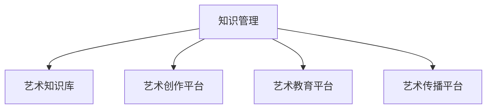

                 

# 知识管理在艺术领域的实践

## 1. 背景介绍

### 1.1 问题由来
艺术作为人类文化的重要组成部分，其创作、传播与鉴赏一直是人类的重要活动。然而，随着全球化的加速和数字技术的进步，传统的艺术创作与鉴赏方式正面临严峻挑战。艺术领域的数字化、智能化、个性化需求日益增长，迫切需要构建一个高效的知识管理体系，以支持艺术创作、研究、教育和传播。

### 1.2 问题核心关键点
本文聚焦于如何将知识管理技术应用于艺术领域，通过构建一个集成的知识管理平台，为艺术家、研究人员、教育者及公众提供一个全面的艺术知识资源库，促进艺术创作与研究的智能化、数字化、个性化发展。

## 2. 核心概念与联系

### 2.1 核心概念概述

为更好地理解知识管理在艺术领域的实践，本节将介绍几个密切相关的核心概念：

- **知识管理(Knowledge Management, KM)**：是指通过计划、策略、技术等手段，系统地创建、存储、检索、共享和应用知识的过程。在艺术领域，知识管理不仅包括艺术理论、历史、技法等方面的知识，还涉及艺术家的生平、作品、艺术流派等相关信息。

- **艺术知识库(Art Knowledge Repository)**：是指将艺术领域的各类知识进行系统化存储和管理的数字化平台。它能够为艺术家、研究人员、教育者及公众提供全面的艺术知识资源，支持艺术创作、研究和传播。

- **艺术创作平台(Art Creation Platform)**：是指为艺术家提供创作工具和资源的平台，通过知识管理技术的支持，使艺术家能够高效利用现有的艺术资源，提升创作质量和效率。

- **艺术教育平台(Art Education Platform)**：是指结合知识管理技术和现代教育技术，为艺术教育提供全方位的支持，包括在线课程、虚拟教室、互动讨论区等功能。

- **艺术传播平台(Art Dissemination Platform)**：是指利用知识管理技术和社交媒体平台，将艺术作品、研究论文、教育课程等内容传播到全球观众，提升艺术作品的知名度和影响力。

这些核心概念之间的逻辑关系可以通过以下Mermaid流程图来展示：



这个流程图展示出知识管理在艺术领域的核心概念及其相互关系：

1. 知识管理通过系统化、结构化的方式管理艺术领域的大量知识。
2. 艺术知识库是知识管理的重要载体，存储和管理艺术领域的各类信息资源。
3. 艺术创作平台利用知识管理技术，为艺术家提供创作工具和资源。
4. 艺术教育平台融合知识管理与现代教育技术，为艺术教育提供全方位支持。
5. 艺术传播平台通过知识管理技术，将艺术内容传播到全球观众。

这些概念共同构成了知识管理在艺术领域的实践框架，为艺术领域的数字化、智能化、个性化发展提供了强有力的技术支持。

## 3. 核心算法原理 & 具体操作步骤
### 3.1 算法原理概述

知识管理在艺术领域的实践，本质上是将知识管理技术与艺术领域的具体应用场景相结合的过程。其核心思想是：通过构建一个集成的知识管理平台，利用先进的知识组织、存储、检索和应用技术，全面提升艺术领域的知识管理和应用水平。

### 3.2 算法步骤详解

知识管理在艺术领域的实践一般包括以下几个关键步骤：

**Step 1: 需求分析与平台设计**
- 识别艺术领域的具体需求，包括艺术创作、研究、教育、传播等方面的知识管理需求。
- 设计知识管理平台的总体架构，包括平台的功能模块、数据模型、用户角色等。

**Step 2: 数据收集与整合**
- 收集艺术领域的各类数据，包括艺术作品、艺术家生平、艺术流派、艺术评论等。
- 对收集的数据进行清洗、分类、标准化处理，构建统一的数据模型。
- 利用数据仓库和数据库技术，实现数据的集中存储和管理。

**Step 3: 知识组织与存储**
- 设计知识组织结构，如本体论、分类体系等，将知识进行系统化组织。
- 利用知识图谱、语义网络等技术，构建知识之间的关联关系，实现知识的深度整合。
- 使用先进的存储技术，如分布式文件系统、NoSQL数据库等，实现数据的可靠存储和高效检索。

**Step 4: 知识检索与推荐**
- 设计知识检索模型，如向量空间模型、基于图的检索模型等，实现对知识的高效检索。
- 开发智能推荐系统，利用机器学习、深度学习等技术，根据用户需求推荐相关知识资源。
- 集成自然语言处理技术，提升知识检索和推荐的准确性和智能化水平。

**Step 5: 知识应用与共享**
- 开发知识应用平台，如艺术创作工具、艺术教育平台、艺术传播平台等，支持用户利用知识进行创作、研究和传播。
- 设计知识共享机制，利用社交网络、API接口等技术，实现知识在艺术家、研究人员、教育者及公众之间的共享和交流。
- 提供知识管理培训和技术支持，帮助用户高效利用知识管理平台，提升艺术创作、研究和传播水平。

### 3.3 算法优缺点

知识管理在艺术领域的实践具有以下优点：
1. 系统化管理：通过系统化、结构化的方式管理艺术领域的各类知识，提升知识管理的效率和准确性。
2. 智能化应用：利用先进的知识组织、存储、检索和应用技术，提升知识应用的智能化水平。
3. 高效共享：实现知识的集中存储和高效检索，支持多用户间的知识共享和交流。
4. 个性化服务：通过智能推荐系统，根据用户需求提供个性化的知识服务。

同时，该方法也存在一定的局限性：
1. 数据质量依赖：知识管理的质量很大程度上依赖于数据的完整性和准确性，数据的获取和清洗过程较为复杂。
2. 技术门槛较高：需要高级的技术人员进行知识管理平台的搭建和维护，技术门槛较高。
3. 知识整合难度：将不同来源、不同格式的知识进行整合，需要克服多源异构数据的挑战。
4. 应用场景有限：当前的知识管理平台主要应用于艺术创作和研究，对于艺术教育、传播等场景的支持还需进一步加强。

尽管存在这些局限性，但就目前而言，知识管理在艺术领域的实践仍然是大规模、系统化管理艺术知识的重要手段。未来相关研究的重点在于如何进一步降低技术门槛，提高知识管理的普适性，同时兼顾知识整合能力和智能化应用。

### 3.4 算法应用领域

知识管理在艺术领域的实践已经在多个领域得到了应用，具体如下：

- **艺术创作**：为艺术家提供创作工具和资源，通过知识管理平台，艺术家能够高效利用现有的艺术资源，提升创作质量和效率。
- **艺术研究**：利用知识管理平台，研究人员能够系统化地研究艺术作品、流派、历史等知识，发现新的研究热点和方向。
- **艺术教育**：通过知识管理平台，教育者能够提供全方位的艺术教育资源，如在线课程、虚拟教室、互动讨论区等，提升教学效果。
- **艺术传播**：利用知识管理平台，将艺术作品、研究论文、教育课程等内容传播到全球观众，提升艺术作品的知名度和影响力。
- **艺术资源管理**：通过知识管理平台，博物馆、艺术机构等能够更好地管理其艺术资源，提升艺术资源的利用效率。

除了上述这些经典应用外，知识管理技术还在艺术领域的其他场景中得到了创新性的应用，如艺术数据的可视化、艺术研究的机器学习等，为艺术领域的数字化、智能化、个性化发展提供了新的方向。

## 4. 数学模型和公式 & 详细讲解
### 4.1 数学模型构建

本节将使用数学语言对知识管理在艺术领域的实践过程进行更加严格的刻画。

记艺术知识库为 $K=\{D,O\}$，其中 $D$ 为数据集，$O$ 为知识组织结构。假设 $D$ 包含 $N$ 个艺术作品，每个作品包含 $M$ 个属性，属性取值为 $V$。记 $O$ 为一个本体论模型，包含 $C$ 个类 $c_i$，每个类包含 $R_i$ 个属性 $r_j$。

定义知识检索模型为 $I(K, q)$，其中 $q$ 为查询语句。知识检索模型的目标是最小化查询结果与真实答案之间的差异，即：

$$
\min_{I} \sum_{i=1}^N \max_{r \in D_i} ||I(D_i, q) - r||^2
$$

其中 $D_i$ 为作品 $i$ 的 $M$ 个属性，$||.||$ 为归一化距离。

定义智能推荐模型为 $R(K, u)$，其中 $u$ 为用户。智能推荐模型的目标是根据用户需求，从知识库 $K$ 中推荐最相关的艺术作品，即：

$$
\max_{R} \sum_{i=1}^N u_i \cdot I(D_i, R(D_i))
$$

其中 $u_i$ 为作品 $i$ 对用户 $u$ 的相关度评分。

### 4.2 公式推导过程

以下我们以艺术作品推荐为例，推导智能推荐模型的公式。

假设用户 $u$ 对作品 $D_i$ 的评分向量为 $u_i = (u_{i1}, u_{i2}, ..., u_{im})$，作品 $D_i$ 的属性 $r_j$ 对用户 $u$ 的相关度向量为 $r_{ij} = (r_{ij1}, r_{ij2}, ..., r_{ijn})$。设知识检索模型为 $I(K, q)$，则智能推荐模型的目标函数可以表示为：

$$
\max_{R} \sum_{i=1}^N \sum_{j=1}^{R_i} u_{ij} \cdot I(D_i, r_j)
$$

根据用户需求，智能推荐模型需要考虑多种因素，如用户兴趣、作品属性、作品关联等。因此，智能推荐模型可以进一步扩展为：

$$
\max_{R} \sum_{i=1}^N \sum_{j=1}^{R_i} \alpha_{uj} \cdot u_{ij} \cdot I(D_i, r_j) + \beta_{uj} \cdot I(D_i, R(D_i))
$$

其中 $\alpha_{uj}$ 和 $\beta_{uj}$ 分别为作品 $D_i$ 和作品关联 $R(D_i)$ 对用户 $u$ 的兴趣权重。

通过对智能推荐模型的公式推导，我们可以看出，智能推荐系统需要综合考虑多种因素，通过优化权重系数，实现对用户需求的高效响应。

### 4.3 案例分析与讲解

以中国美术馆的知识管理平台为例，分析其知识管理实践的实现过程：

1. **需求分析与平台设计**：
   - 中国美术馆首先需要明确其知识管理的总体需求，包括艺术作品的数字化、艺术家的生平资料、艺术展览的组织与宣传等。
   - 根据需求，设计知识管理平台的总体架构，包括数据管理、知识组织、智能推荐、用户管理等功能模块。

2. **数据收集与整合**：
   - 收集中国美术馆的艺术作品、艺术家生平、展览信息等各类数据。
   - 对收集的数据进行清洗、分类、标准化处理，构建统一的数据模型。
   - 利用分布式文件系统和NoSQL数据库，实现数据的集中存储和管理。

3. **知识组织与存储**：
   - 设计知识组织结构，构建本体论模型，将知识进行系统化组织。
   - 利用知识图谱技术，构建知识之间的关联关系，实现知识的深度整合。
   - 使用分布式数据库，实现知识的可靠存储和高效检索。

4. **知识检索与推荐**：
   - 设计知识检索模型，利用向量空间模型，实现对知识的高效检索。
   - 开发智能推荐系统，利用协同过滤、深度学习等技术，根据用户需求推荐相关知识资源。
   - 集成自然语言处理技术，提升知识检索和推荐的准确性和智能化水平。

5. **知识应用与共享**：
   - 开发艺术创作工具、虚拟教室、互动讨论区等，支持用户利用知识进行创作、研究和传播。
   - 设计知识共享机制，利用社交网络、API接口等技术，实现知识在艺术家、研究人员、教育者及公众之间的共享和交流。
   - 提供知识管理培训和技术支持，帮助用户高效利用知识管理平台，提升艺术创作、研究和传播水平。

通过对中国美术馆知识管理平台的案例分析，可以看到知识管理在艺术领域的实践过程，是一个系统化、结构化的知识管理过程，需要综合考虑数据收集、知识组织、智能推荐、知识应用与共享等多个环节。

## 5. 项目实践：代码实例和详细解释说明
### 5.1 开发环境搭建

在进行知识管理平台开发前，我们需要准备好开发环境。以下是使用Python进行知识管理平台开发的开发环境配置流程：

1. 安装Anaconda：从官网下载并安装Anaconda，用于创建独立的Python环境。

2. 创建并激活虚拟环境：
```bash
conda create -n km-env python=3.8 
conda activate km-env
```

3. 安装Python环境依赖：
```bash
pip install numpy pandas scikit-learn scipy tqdm
```

4. 安装知识管理相关库：
```bash
pip install sparqlwrapper pykglib rdfkit
```

完成上述步骤后，即可在`km-env`环境中开始知识管理平台的开发。

### 5.2 源代码详细实现

这里我们以知识图谱构建为例，给出使用PyKGL库构建艺术知识图谱的PyTorch代码实现。

首先，定义知识图谱的节点和关系：

```python
from pykglib import KGL, RDFGraph

graph = RDFGraph()
graph.add_triple("http://www.w3.org/1999/02/22-rdf-syntax-ns#type", "http://www.w3.org/2000/01/rdf-schema#Class", "http://www.w3.org/2000/01/rdf-schema#Class")
graph.add_triple("http://www.w3.org/1999/02/22-rdf-syntax-ns#type", "http://www.w3.org/2000/01/rdf-schema#Property", "http://www.w3.org/2000/01/rdf-schema#Property")
```

然后，加载艺术数据并构建知识图谱：

```python
from pykglib import load_ntriple

g = load_ntriple("art_triples.n3", graph)
```

接着，查询并输出知识图谱中的信息：

```python
from pykglib import get_all_triples, get_all_classes, get_all_relations

all_triples = get_all_triples(g)
all_classes = get_all_classes(g)
all_relations = get_all_relations(g)

print("All triples:\n", all_triples)
print("All classes:\n", all_classes)
print("All relations:\n", all_relations)
```

最后，保存知识图谱并查询特定的节点和关系：

```python
from pykglib import save_rdf, query_triples

save_rdf(g, "art_graph.turtle")

results = query_triples(g, ("http://www.w3.org/2000/01/rdf-schema#class", "http://www.w3.org/1999/02/22-rdf-syntax-ns#type", "http://www.w3.org/2000/01/rdf-schema#Class"), limit=10)
for result in results:
    print(result)
```

以上就是使用PyKGL库构建艺术知识图谱的完整代码实现。可以看到，PyKGL库提供了便捷的API接口，使得构建知识图谱变得简单高效。

### 5.3 代码解读与分析

让我们再详细解读一下关键代码的实现细节：

**知识图谱构建**：
- 通过定义节点和关系，构建了一个简单的知识图谱。在实际应用中，需要根据具体的艺术数据，定义更复杂的节点和关系。
- 利用`load_ntriple`方法，加载艺术数据，构建知识图谱。在实际应用中，需要从博物馆、艺术机构等渠道收集艺术数据，构建更加丰富的知识图谱。
- 通过`get_all_triples`、`get_all_classes`、`get_all_relations`方法，可以获取知识图谱中的所有节点、类和关系，方便进行分析和查询。

**知识图谱查询**：
- 利用`query_triples`方法，可以查询知识图谱中的节点和关系。在实际应用中，可以通过查询特定的节点和关系，获取特定的艺术信息。
- 通过设置`limit`参数，可以限制查询结果的数量。在实际应用中，可以根据查询需求，设置合理的查询结果数量。

通过以上代码实现，我们可以看到知识图谱的构建和查询过程，知识管理在艺术领域的实践可以通过构建知识图谱、进行知识检索和推荐等方式，提升艺术领域的数字化、智能化、个性化水平。

## 6. 实际应用场景
### 6.1 智能推荐系统

基于知识管理技术的智能推荐系统，可以为艺术爱好者提供个性化的艺术作品推荐服务。通过分析用户的历史行为、兴趣偏好，利用知识图谱中的信息，为用户推荐最相关的艺术作品。

在技术实现上，可以利用知识图谱中的关联关系，设计多跳推理模型，实现对艺术作品的多角度分析。同时，可以引入机器学习算法，对用户的行为数据进行建模，提升推荐系统的智能化水平。

### 6.2 艺术创作平台

知识管理技术可以为艺术创作提供丰富的创作资源和工具支持。通过构建艺术作品数据库、艺术家信息库、艺术技法库等，为艺术家提供创作灵感和参考。

在技术实现上，可以利用知识图谱中的信息，构建艺术创作工具，如艺术作品生成器、艺术技法分析器等。同时，可以引入自然语言处理技术，实现艺术作品的智能生成和分析。

### 6.3 艺术教育平台

知识管理技术可以为艺术教育提供全方位的支持，包括在线课程、虚拟教室、互动讨论区等功能。通过知识图谱中的信息，可以为学生提供全面的艺术知识资源，提升教育效果。

在技术实现上，可以利用知识图谱中的信息，设计在线课程和虚拟教室，利用知识图谱中的关联关系，进行知识点的串联和拓展。同时，可以引入交互式学习工具，提升学生的学习效果。

### 6.4 艺术传播平台

知识管理技术可以为艺术作品、艺术研究、艺术教育等内容提供高效传播渠道。通过知识图谱中的信息，可以将艺术内容传播到全球观众，提升艺术作品的知名度和影响力。

在技术实现上，可以利用知识图谱中的信息，设计艺术传播平台，利用社交网络、API接口等技术，实现艺术内容的传播。同时，可以引入内容推荐系统，提升艺术内容的传播效果。

### 6.5 艺术资源管理

知识管理技术可以为博物馆、艺术机构等提供高效的资源管理方案。通过知识图谱中的信息，可以为艺术资源的管理、检索、展示提供全面支持。

在技术实现上，可以利用知识图谱中的信息，设计艺术资源管理系统，利用知识图谱中的关联关系，进行艺术资源的分类和检索。同时，可以引入可视化技术，提升艺术资源的展示效果。

## 7. 工具和资源推荐
### 7.1 学习资源推荐

为了帮助开发者系统掌握知识管理在艺术领域的实践，这里推荐一些优质的学习资源：

1. **《知识管理与艺术创作》系列博文**：由知识管理领域专家撰写，深入浅出地介绍了知识管理技术在艺术领域的应用，涵盖艺术创作、研究、教育、传播等方面的知识管理实践。

2. **CS340《知识管理》课程**：斯坦福大学开设的知识管理课程，有Lecture视频和配套作业，带你入门知识管理的基本概念和经典模型。

3. **《知识管理与艺术研究》书籍**：介绍知识管理技术在艺术研究中的应用，帮助研究人员利用知识管理技术提升艺术研究的效率和深度。

4. **《艺术知识图谱构建与分析》论文**：介绍艺术知识图谱的构建方法和应用，展示了知识管理技术在艺术领域的应用效果。

5. **Knowledge Graph Library (PyKGL)**：一个开源的知识图谱构建和查询库，提供了便捷的API接口和丰富的功能，适合进行知识图谱的构建和查询。

通过对这些资源的学习实践，相信你一定能够快速掌握知识管理在艺术领域的实践技能，并用于解决实际的NLP问题。

### 7.2 开发工具推荐

高效的开发离不开优秀的工具支持。以下是几款用于知识管理平台开发的常用工具：

1. **PyTorch**：基于Python的开源深度学习框架，灵活动态的计算图，适合快速迭代研究。
2. **TensorFlow**：由Google主导开发的开源深度学习框架，生产部署方便，适合大规模工程应用。
3. **PyKGL**：一个开源的知识图谱构建和查询库，提供了便捷的API接口和丰富的功能，适合进行知识图谱的构建和查询。
4. **Jupyter Notebook**：一个交互式笔记本环境，支持Python编程和代码调试，方便进行知识管理平台的开发和调试。
5. **Tarsier**：一个基于PyTorch的可视化库，支持知识图谱的可视化展示，方便进行知识图谱的分析和展示。

合理利用这些工具，可以显著提升知识管理平台开发效率，加快创新迭代的步伐。

### 7.3 相关论文推荐

知识管理在艺术领域的实践研究源于学界的持续研究。以下是几篇奠基性的相关论文，推荐阅读：

1. **《知识管理在艺术创作中的应用》**：介绍知识管理技术在艺术创作中的应用，展示了知识管理技术在艺术创作中的实际效果。
2. **《基于知识图谱的艺术作品推荐系统》**：介绍基于知识图谱的推荐系统在艺术作品推荐中的应用，展示了知识图谱在艺术推荐中的效果。
3. **《艺术知识图谱的构建与分析》**：介绍艺术知识图谱的构建方法和应用，展示了知识管理技术在艺术领域的应用效果。
4. **《智能推荐系统在艺术教育中的应用》**：介绍智能推荐系统在艺术教育中的应用，展示了知识管理技术在艺术教育中的效果。
5. **《艺术传播平台的知识管理实践》**：介绍艺术传播平台的知识管理实践，展示了知识管理技术在艺术传播中的应用效果。

这些论文代表了大语言模型微调技术的发展脉络。通过学习这些前沿成果，可以帮助研究者把握学科前进方向，激发更多的创新灵感。

## 8. 总结：未来发展趋势与挑战

### 8.1 总结

本文对知识管理在艺术领域的实践进行了全面系统的介绍。首先阐述了知识管理在艺术领域的实践背景和意义，明确了知识管理技术在艺术领域的应用需求。其次，从原理到实践，详细讲解了知识管理在艺术领域的核心算法和操作步骤，给出了知识管理平台开发的完整代码实例。同时，本文还广泛探讨了知识管理在艺术领域的实际应用场景，展示了知识管理技术在艺术领域的广阔应用前景。此外，本文精选了知识管理技术的各类学习资源，力求为读者提供全方位的技术指引。

通过本文的系统梳理，可以看到，知识管理在艺术领域的实践是系统化、结构化的知识管理过程，需要综合考虑数据收集、知识组织、智能推荐、知识应用与共享等多个环节。

### 8.2 未来发展趋势

展望未来，知识管理在艺术领域的实践将呈现以下几个发展趋势：

1. **技术普及化**：随着知识管理技术的不断成熟，知识管理在艺术领域的普及化程度将进一步提升，更多的艺术机构和艺术家将采用知识管理技术，提升艺术创作、研究和传播的效率和效果。
2. **智能化提升**：利用机器学习、深度学习等先进技术，知识管理在艺术领域的智能化水平将进一步提升，智能推荐系统、艺术创作工具等将成为知识管理的重要组成部分。
3. **跨学科融合**：知识管理将与其他学科领域进行更深入的融合，如计算机科学、心理学、社会学等，进一步提升知识管理在艺术领域的应用效果。
4. **多模态整合**：知识管理技术将与其他模态的数据进行整合，如文本、图像、视频等，提升艺术知识的全面性和多样性。
5. **社会化协同**：知识管理技术将支持社会化协同创作，艺术家、研究人员、教育者及公众可以通过知识管理平台进行互动，共同创作和研究艺术作品。

以上趋势凸显了知识管理在艺术领域的广阔前景。这些方向的探索发展，必将进一步提升知识管理在艺术领域的应用水平，为艺术创作、研究、教育和传播带来新的变革。

### 8.3 面临的挑战

尽管知识管理在艺术领域的实践已经取得了一定的成果，但在迈向更加智能化、普适化应用的过程中，它仍面临着诸多挑战：

1. **数据质量依赖**：知识管理的质量很大程度上依赖于数据的完整性和准确性，数据的获取和清洗过程较为复杂。
2. **技术门槛较高**：需要高级的技术人员进行知识管理平台的搭建和维护，技术门槛较高。
3. **知识整合难度**：将不同来源、不同格式的知识进行整合，需要克服多源异构数据的挑战。
4. **应用场景有限**：当前的知识管理平台主要应用于艺术创作和研究，对于艺术教育、传播等场景的支持还需进一步加强。

尽管存在这些挑战，但通过技术创新和持续优化，知识管理在艺术领域的实践必将继续发展，为艺术领域的数字化、智能化、个性化发展提供强有力的技术支持。

### 8.4 未来突破

面对知识管理在艺术领域面临的挑战，未来的研究需要在以下几个方面寻求新的突破：

1. **无监督学习技术**：开发无监督学习算法，降低对大规模标注数据的依赖，提升知识管理的效果。
2. **跨模态知识整合**：研究跨模态知识整合技术，将文本、图像、视频等多模态信息进行整合，提升知识管理的效果。
3. **多领域知识融合**：研究多领域知识融合技术，将不同学科的知识进行整合，提升知识管理的效果。
4. **社会化知识管理**：研究社会化知识管理技术，支持艺术家、研究人员、教育者及公众的互动和协同创作。
5. **实时知识更新**：研究实时知识更新技术，支持知识管理平台的持续更新和维护，提升知识管理的效果。

这些研究方向的探索，必将引领知识管理在艺术领域的进一步发展，为艺术领域的数字化、智能化、个性化发展提供新的动力。面向未来，知识管理技术需要在技术创新和应用场景拓展上持续发力，共同推动艺术领域的知识管理实践迈向新的高度。

## 9. 附录：常见问题与解答

**Q1：知识管理在艺术领域的应用前景如何？**

A: 知识管理在艺术领域的应用前景广阔，能够为艺术家、研究人员、教育者及公众提供全面的艺术知识资源，提升艺术创作、研究和传播的效率和效果。未来，知识管理技术将成为艺术领域的核心技术之一，推动艺术领域的数字化、智能化、个性化发展。

**Q2：知识管理在艺术领域的技术难点是什么？**

A: 知识管理在艺术领域的技术难点主要包括以下几个方面：
1. 数据质量依赖：知识管理的质量很大程度上依赖于数据的完整性和准确性，数据的获取和清洗过程较为复杂。
2. 技术门槛较高：需要高级的技术人员进行知识管理平台的搭建和维护，技术门槛较高。
3. 知识整合难度：将不同来源、不同格式的知识进行整合，需要克服多源异构数据的挑战。
4. 应用场景有限：当前的知识管理平台主要应用于艺术创作和研究，对于艺术教育、传播等场景的支持还需进一步加强。

尽管存在这些技术难点，但通过技术创新和持续优化，知识管理在艺术领域的实践必将继续发展，为艺术领域的数字化、智能化、个性化发展提供强有力的技术支持。

**Q3：如何提升知识管理在艺术领域的效果？**

A: 提升知识管理在艺术领域的效果，可以从以下几个方面入手：
1. 数据质量控制：确保数据的完整性和准确性，减少数据清洗和处理的复杂度。
2. 技术平台优化：采用先进的知识管理技术，提升知识管理平台的效率和效果。
3. 多模态融合：将文本、图像、视频等多模态信息进行整合，提升知识管理的效果。
4. 跨学科融合：与其他学科领域进行更深入的融合，提升知识管理的效果。
5. 社会化协同：支持艺术家、研究人员、教育者及公众的互动和协同创作，提升知识管理的效果。

通过这些方法，可以显著提升知识管理在艺术领域的效果，促进艺术领域的数字化、智能化、个性化发展。

**Q4：知识管理在艺术领域的应用案例有哪些？**

A: 知识管理在艺术领域的应用案例包括：
1. 智能推荐系统：为艺术爱好者提供个性化的艺术作品推荐服务。
2. 艺术创作平台：为艺术家提供创作工具和资源，提升创作效率和效果。
3. 艺术教育平台：为艺术教育提供全方位的支持，提升教育效果。
4. 艺术传播平台：将艺术作品、艺术研究、艺术教育等内容传播到全球观众，提升艺术作品的知名度和影响力。
5. 艺术资源管理：为博物馆、艺术机构等提供高效的资源管理方案，提升艺术资源的利用效率。

这些应用案例展示了知识管理在艺术领域的广阔前景，为艺术领域的数字化、智能化、个性化发展提供了新的方向。

---

作者：禅与计算机程序设计艺术 / Zen and the Art of Computer Programming

