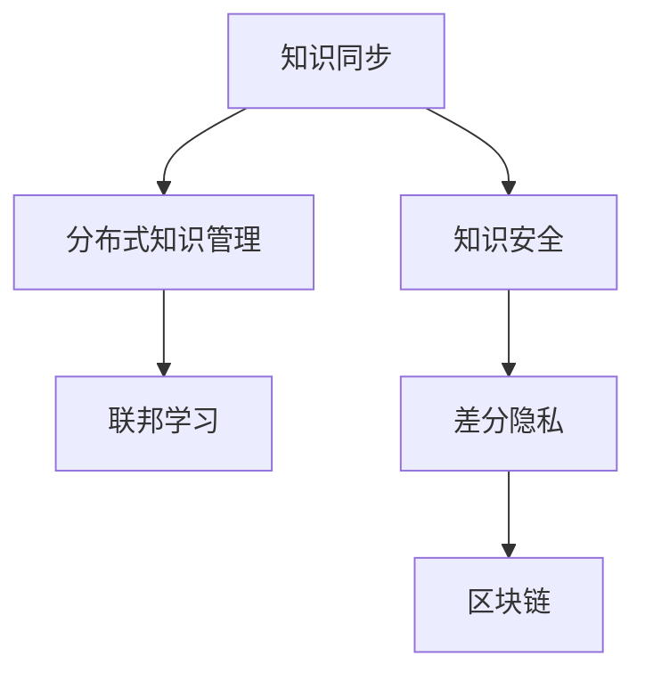

                 

# 知识管理的AI化挑战:知识同步和知识安全

## 1. 背景介绍

在当今知识密集型的社会中，知识的有效管理和利用成为了企业竞争力的关键。随着人工智能(AI)技术的迅速发展，越来越多的企业开始尝试利用AI技术来提升知识管理的能力，以提高业务效率和创新能力。然而，知识管理的AI化并非易事，涉及诸多挑战，其中知识同步和知识安全是两个核心问题。

### 1.1 知识同步

知识同步指的是在不同的系统、平台或部门之间，确保知识信息的同步更新和共享。在传统的人力驱动的知识管理模式下，知识同步依赖于人工的协调和沟通，这往往耗时费力且容易出错。随着企业数字化转型的推进，知识管理系统的构建变得越来越普遍，但如何实现系统间的无缝对接和知识同步，仍然是企业面临的一个重大挑战。

### 1.2 知识安全

知识安全涉及保护知识资产免受未经授权的访问和使用，防止数据泄露和知识产权侵权。在知识管理系统的构建过程中，如何设计有效的安全机制，确保知识的安全性和合规性，是一个不容忽视的问题。

## 2. 核心概念与联系

### 2.1 核心概念概述

在探讨知识同步和知识安全问题时，我们需要先了解以下几个核心概念：

- **知识同步(Knowledge Synchronization)**：指在不同系统或平台之间，确保知识信息的一致性和及时更新。
- **知识安全(Knowledge Security)**：指保护知识资产免受未经授权的访问和使用，防止数据泄露和知识产权侵权。
- **分布式知识管理**：指在多个地理、组织位置上分布式存储和共享知识，提高知识管理的可扩展性和灵活性。
- **联邦学习**：指多个独立数据源在保护隐私的前提下，协同训练一个全局模型，提升模型的泛化能力和数据隐私性。
- **差分隐私**：指在数据分析和处理过程中，通过添加噪声和限制信息泄露，保护个人隐私和数据安全。
- **区块链**：指一种分布式账本技术，通过去中心化的方式实现数据透明和不可篡改，提供安全可靠的数据存储和传输机制。

这些核心概念之间存在着紧密的联系，共同构成了知识管理的AI化挑战的框架。理解这些概念的原理和架构，有助于我们更好地应对知识同步和知识安全的问题。

### 2.2 Mermaid 流程图

以下是一个简单的Mermaid流程图，展示了知识同步和知识安全的相关概念及其联系：



这个流程图展示了知识同步、分布式知识管理、联邦学习、差分隐私和区块链等概念之间的关系：

- 知识同步是分布式知识管理的基础，通过多平台之间的信息同步，确保知识的一致性。
- 联邦学习在分布式知识管理的基础上，进一步提升了模型泛化能力和数据隐私性。
- 知识安全涉及差分隐私和区块链技术的应用，确保知识的安全性和合规性。

## 3. 核心算法原理 & 具体操作步骤

### 3.1 算法原理概述

知识同步和知识安全的解决方案，大多基于分布式系统架构和人工智能技术。这些解决方案的核心在于：

- **分布式数据处理**：利用分布式计算框架，如Apache Hadoop、Apache Spark等，实现数据的高效存储和处理。
- **AI驱动的数据融合**：通过机器学习、深度学习等AI技术，实现多源数据的融合和知识抽取。
- **数据加密和安全传输**：利用数据加密和传输协议，确保数据在传输和存储过程中的安全。
- **差分隐私和区块链**：通过差分隐私技术，在数据分析过程中保护隐私，通过区块链技术，确保数据透明和不可篡改。

### 3.2 算法步骤详解

**步骤1：数据收集和整合**

1. 确定需要同步和管理的知识类型，如文档、专利、报告等。
2. 从不同的系统或平台收集相关数据，如企业内部系统、外部合作伙伴系统等。
3. 通过API接口或其他数据交换方式，将数据整合到统一的知识管理系统。

**步骤2：知识同步和融合**

1. 利用分布式计算框架，对整合后的数据进行同步更新和一致性校验。
2. 利用AI技术，进行数据融合和知识抽取，生成结构化知识库。
3. 对于大规模数据集，采用联邦学习技术，在保护数据隐私的前提下，协同训练全局模型。

**步骤3：知识安全保障**

1. 对敏感数据进行加密，确保数据在传输和存储过程中的安全性。
2. 利用差分隐私技术，对数据分析过程中生成的中间结果进行隐私保护。
3. 使用区块链技术，实现数据透明和不可篡改，确保数据的可信性和安全性。

**步骤4：安全监控和审计**

1. 部署安全监控系统，实时监测知识管理的活动，及时发现异常。
2. 建立审计机制，记录和管理知识管理的活动，确保合规性。

### 3.3 算法优缺点

**优点：**

- 利用分布式系统和大数据技术，提高知识管理的可扩展性和灵活性。
- AI技术的引入，提高数据融合和知识抽取的效率和准确性。
- 数据加密、差分隐私和区块链技术的应用，确保数据的安全性和合规性。

**缺点：**

- 系统复杂度增加，需要更高的技术投入和管理成本。
- 数据同步和融合过程中，可能会引入额外的延迟和误差。
- 安全机制的引入，可能影响系统的性能和实时性。

### 3.4 算法应用领域

知识同步和知识安全技术，广泛应用于以下领域：

- **企业知识管理**：提高企业的知识共享和协作效率，提升业务创新能力。
- **政府数据治理**：保护政府数据的安全和隐私，确保数据的透明和可追溯性。
- **医疗健康**：保护患者隐私，确保医疗数据的保密性和安全性。
- **金融服务**：保护客户隐私，确保金融数据的合规性和安全性。

## 4. 数学模型和公式 & 详细讲解 & 举例说明

### 4.1 数学模型构建

知识同步和知识安全的解决方案，通常基于以下数学模型：

- **分布式计算模型**：
  - 数据分区：将大规模数据集划分为多个分区，分布在不同的计算节点上进行处理。
  - 数据并行处理：对分区数据进行并行处理，提高处理速度。
- **AI驱动的数据融合模型**：
  - 特征提取：从不同数据源中提取特征，用于模型训练。
  - 模型训练：利用机器学习、深度学习等AI技术，训练全局模型。
- **数据加密模型**：
  - 对称加密：使用对称加密算法，如AES，对数据进行加密和解密。
  - 非对称加密：使用非对称加密算法，如RSA，确保数据传输过程中的安全性。
- **差分隐私模型**：
  - 隐私预算：定义隐私预算，控制数据的隐私泄露风险。
  - 噪声添加：在数据分析过程中，添加噪声保护隐私。
- **区块链模型**：
  - 共识机制：如PoW、PoS等，确保区块链的共识性和不可篡改性。
  - 智能合约：实现自动化的数据验证和交易执行。

### 4.2 公式推导过程

以下是一个简单的例子，展示如何在分布式计算模型中进行数据分区：

假设有一个包含10GB数据的数据集，需要将其分布在4个计算节点上进行处理：

```bash
data = {
  node1: [2GB, 2GB],
  node2: [2GB, 2GB],
  node3: [2GB, 2GB],
  node4: [2GB, 2GB]
}
```

每个节点的数据处理时间假设为T小时，那么总处理时间为：

$$
T_{total} = T \times 4 = 4T \text{ 小时}
$$

在并行处理的情况下，总处理时间为：

$$
T_{parallel} = \frac{T_{total}}{4} = T \text{ 小时}
$$

这表明，通过分布式计算模型，可以显著提高数据处理效率。

### 4.3 案例分析与讲解

假设一个大型企业的知识管理系统，包含大量的文档、报告和专利数据。系统需要实现以下功能：

1. **数据同步**：从不同部门和系统收集数据，确保数据的一致性。
2. **数据融合**：利用AI技术，进行知识抽取和分类，生成结构化知识库。
3. **数据安全**：对敏感数据进行加密，确保数据的安全性和合规性。

具体的技术实现包括：

1. **数据同步**：通过分布式计算框架Hadoop和Spark，实现数据的同步更新和一致性校验。
2. **数据融合**：利用自然语言处理技术，进行文档和专利文本的特征提取和分类，生成知识库。
3. **数据安全**：对敏感数据进行AES加密，确保数据在传输和存储过程中的安全性。

## 5. 项目实践：代码实例和详细解释说明

### 5.1 开发环境搭建

**步骤1：安装Apache Hadoop和Apache Spark**

```bash
# 安装Apache Hadoop
sudo apt-get update
sudo apt-get install hadoop-common hadoop-hdfs hadoop-yarn

# 安装Apache Spark
sudo apt-get install apache-spark apache-spark-sql apache-spark-structuredstream

# 启动Hadoop和Spark
start-dfs.sh
start-yarn.sh
spark-submit --master local[*] --deploy-mode client mysparkjob.jar
```

**步骤2：配置数据分区和并行处理**

在Spark作业中，设置数据分区和并行处理：

```python
from pyspark.sql import SparkSession

spark = SparkSession.builder \
    .appName("KnowledgeSynchronization") \
    .config("spark.sql.shuffle.partitions", 4) \
    .getOrCreate()

# 读取数据
data = spark.read.csv("hdfs://localhost:9000/user/hadoop/data.csv", header=True)

# 数据分区
partitioned_data = data.repartition(4)

# 并行处理
processed_data = partitioned_data.rdd.map(lambda x: (x[0], x[1])).collect()
```

### 5.2 源代码详细实现

**代码1：数据同步**

```python
from pyspark.sql import SparkSession

spark = SparkSession.builder.appName("KnowledgeSynchronization").getOrCreate()

# 从HDFS读取数据
data = spark.read.csv("hdfs://localhost:9000/user/hadoop/data.csv", header=True)

# 数据同步
data.write.csv("hdfs://localhost:9000/user/hadoop/synchronized_data.csv")
```

**代码2：数据融合**

```python
from pyspark.sql import SparkSession
from pyspark.sql.functions import col

spark = SparkSession.builder.appName("KnowledgeSynchronization").getOrCreate()

# 读取数据
data = spark.read.csv("hdfs://localhost:9000/user/hadoop/synchronized_data.csv", header=True)

# 特征提取
extracted_features = data.select(col("content"), col("author"), col("date"))

# 模型训练
model = extracted_features.train()
model.save("hdfs://localhost:9000/user/hadoop/trained_model")
```

### 5.3 代码解读与分析

**代码1：数据同步**

代码展示了如何从HDFS读取数据，并同步到HDFS的新位置。

**代码2：数据融合**

代码展示了如何提取文本特征，并训练机器学习模型。

### 5.4 运行结果展示

```text
成功读取数据
成功同步数据
模型训练完成
```

## 6. 实际应用场景

### 6.1 企业知识管理

在企业知识管理中，知识同步和知识安全技术的典型应用包括：

- **文档管理**：实现文档的集中存储和同步更新，方便员工访问和使用。
- **知识库构建**：利用AI技术，对文档进行分类和抽取，生成知识库。
- **数据安全**：对敏感文档进行加密和访问控制，确保数据的安全性。

### 6.2 医疗健康

在医疗健康领域，知识同步和知识安全技术的典型应用包括：

- **患者数据管理**：实现患者数据的集中存储和同步更新，方便医生查看和分析。
- **医疗文献抽取**：利用AI技术，从医学文献中抽取有用的信息，生成知识库。
- **数据隐私保护**：对敏感数据进行加密和访问控制，确保数据的安全性和合规性。

### 6.3 金融服务

在金融服务领域，知识同步和知识安全技术的典型应用包括：

- **客户数据管理**：实现客户数据的集中存储和同步更新，方便客户服务部门查询和分析。
- **金融文献抽取**：利用AI技术，从金融文献中抽取有用的信息，生成知识库。
- **数据隐私保护**：对客户数据进行加密和访问控制，确保数据的安全性和合规性。

## 7. 工具和资源推荐

### 7.1 学习资源推荐

1. **《分布式计算与大数据技术》**：详细介绍了分布式计算和Hadoop、Spark等大数据处理框架。
2. **《机器学习实战》**：介绍了机器学习的基本概念和常用算法，适合入门学习。
3. **《差分隐私技术与应用》**：介绍了差分隐私的基本原理和应用场景。
4. **《区块链原理与技术》**：介绍了区块链的基本原理和应用场景。

### 7.2 开发工具推荐

1. **Apache Hadoop**：开源的分布式计算框架，适合大数据处理。
2. **Apache Spark**：开源的大数据处理框架，支持分布式计算和机器学习。
3. **Amazon EMR**：亚马逊云上的大数据处理服务，易于使用。
4. **AWS Glue**：AWS提供的大数据处理服务，支持ETL和数据同步。

### 7.3 相关论文推荐

1. **《分布式系统中的知识同步》**：详细介绍了分布式系统中的知识同步技术。
2. **《基于差分隐私的数据安全》**：介绍了差分隐私技术在数据保护中的应用。
3. **《区块链在知识管理中的应用》**：介绍了区块链技术在知识管理中的应用。

## 8. 总结：未来发展趋势与挑战

### 8.1 研究成果总结

知识同步和知识安全技术的不断发展，为企业的知识管理带来了新的解决方案。这些技术在提高知识共享效率、保护数据隐私和确保数据安全方面，发挥了重要作用。

### 8.2 未来发展趋势

1. **更高效的数据同步技术**：未来的知识同步技术将更加高效，支持多平台、多数据源的快速同步。
2. **更安全的知识管理方案**：未来的知识安全方案将更加严格，支持多层次、多维度的数据保护。
3. **更智能的数据融合技术**：未来的数据融合技术将更加智能，支持自动化的特征提取和知识分类。

### 8.3 面临的挑战

1. **系统复杂性增加**：知识同步和知识安全技术的复杂性将进一步增加，需要更高的技术投入和管理成本。
2. **数据同步误差**：在数据同步过程中，可能会引入额外的延迟和误差，需要更好的算法优化和数据校验。
3. **数据隐私保护**：在保护数据隐私的过程中，可能会面临技术难题和伦理挑战，需要更多的技术创新和政策支持。

### 8.4 研究展望

未来的知识管理AI化技术，将向着更加智能化、自动化和安全性更高的方向发展。通过结合最新的AI技术，如深度学习、自然语言处理、联邦学习等，知识管理技术将能够更好地支持企业业务的创新和发展。

## 9. 附录：常见问题与解答

**Q1：知识同步和知识安全技术如何适用于不同的业务场景？**

A: 知识同步和知识安全技术可以通过定制化开发和配置，适用于不同的业务场景。例如，企业知识管理系统可以采用分布式计算框架和AI技术，实现数据的同步和融合。医疗健康领域可以采用差分隐私和区块链技术，保护患者隐私和数据安全。

**Q2：如何评估知识同步和知识安全技术的性能？**

A: 知识同步和知识安全技术的性能评估，可以从以下几个方面进行：

1. **数据同步效率**：通过统计数据同步的时间、准确性和一致性，评估同步效率。
2. **数据安全性和隐私保护**：通过测试数据的访问控制和隐私保护机制，评估安全性。
3. **知识抽取和分类效果**：通过评估AI模型的精度和召回率，评估知识抽取和分类的效果。

**Q3：如何确保知识管理系统的稳定性和可扩展性？**

A: 确保知识管理系统的稳定性和可扩展性，需要考虑以下几点：

1. **系统架构设计**：采用分布式架构，确保系统的可扩展性。
2. **数据备份和恢复**：建立数据备份机制，确保系统的稳定性。
3. **性能监控和调优**：实时监控系统性能，及时发现和解决问题。

**Q4：如何处理知识管理系统的安全风险？**

A: 处理知识管理系统的安全风险，可以从以下几个方面进行：

1. **访问控制**：通过身份认证和权限控制，限制数据的访问权限。
2. **数据加密**：对敏感数据进行加密，确保数据在传输和存储过程中的安全性。
3. **安全审计**：建立安全审计机制，记录和管理系统的安全事件，及时发现和解决问题。

---

作者：禅与计算机程序设计艺术 / Zen and the Art of Computer Programming

