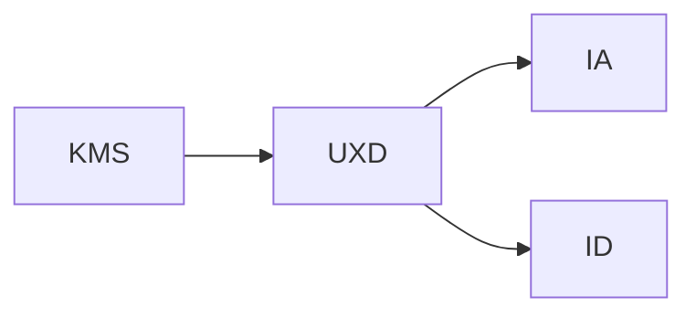

                 

# 知识管理系统的用户体验设计

> 关键词：知识管理系统,用户体验设计,人机交互,用户中心设计,信息架构,交互设计

## 1. 背景介绍

### 1.1 问题由来
随着信息技术的飞速发展，现代组织面临的信息量呈指数级增长，如何有效管理和利用这些信息，成为了各行业的核心挑战。知识管理系统(Knowledge Management System, KMS) 作为组织知识资产的核心管理工具，应运而生。然而，现有的KMS普遍存在用户接受度低、使用效率低下等问题，影响了其在组织中的应用价值。

### 1.2 问题核心关键点
知识管理系统的用户体验设计，是决定其是否能够被有效使用、是否能够真正提升组织知识管理能力的关键。优秀的设计不仅能帮助用户迅速找到所需信息，还能激发用户参与知识共享的积极性，提升知识管理的整体效果。

设计良好的用户体验，应具备以下特点：
1. **用户中心**：以用户需求为设计核心，始终站在用户角度考虑问题，提供符合用户习惯的交互方式。
2. **高效简洁**：提供简洁直观的界面，减少用户操作步骤，快速完成任务。
3. **个性化**：根据用户行为习惯调整界面布局和内容推荐，提高用户体验。
4. **交互友好**：采用自然流畅的交互方式，减少用户学习成本。
5. **灵活适应**：能够适应不同场景和设备，提供一致的用户体验。

### 1.3 问题研究意义
优化知识管理系统的用户体验设计，有助于提升用户满意度，增强知识管理的实际效果。它不仅能提高组织的知识共享和协作效率，还能辅助决策支持，提升企业的竞争力。良好的用户体验设计，将促进知识的有效整合和利用，使知识成为推动企业发展的动力源泉。

## 2. 核心概念与联系

### 2.1 核心概念概述

为更好地理解知识管理系统的用户体验设计，本节将介绍几个关键概念及其联系：

- **知识管理系统(Knowledge Management System, KMS)**：以知识管理为核心，提供知识收集、存储、检索、共享、评估和重用等功能，支持组织知识管理的平台。
- **用户体验设计(User Experience Design, UXD)**：以用户为中心，设计用户与产品（或服务）交互的过程，提升用户满意度和使用体验。
- **信息架构(Information Architecture, IA)**：研究信息的结构、组织方式，以实现信息的有效管理与用户的高效查找。
- **交互设计(Interaction Design, ID)**：专注于人与产品的交互方式，设计出简洁易用、自然流畅的交互流程。

以上概念间的关系可简要概括为：



KMS通过UXD、IA、ID等设计手段，提升用户体验，从而实现知识的高效管理与利用。

## 3. 核心算法原理 & 具体操作步骤
### 3.1 算法原理概述

知识管理系统的用户体验设计，涉及到信息架构、交互设计、个性化推荐等多个方面，通过以下算法步骤实现：

1. **需求分析**：收集用户需求，建立用户画像，了解用户行为模式。
2. **信息架构设计**：根据用户需求和信息特点，设计信息结构，实现信息有效组织。
3. **交互设计**：基于信息架构，设计简洁自然的交互流程，减少用户操作步骤。
4. **个性化推荐**：根据用户行为数据，进行推荐系统优化，实现个性化内容推荐。
5. **用户体验评估**：通过A/B测试等方法，不断优化设计，提升用户体验。

### 3.2 算法步骤详解

#### 3.2.1 需求分析

需求分析是设计的基础，需要全面了解用户需求。

**3.2.1.1 用户调研**
- 通过问卷调查、访谈等方式，收集用户的基本信息、使用习惯、功能需求等。
- 了解用户痛点，明确需求优先级。

**3.2.1.2 用户画像**
- 根据调研数据，构建用户画像，包含用户的年龄、职业、技能水平等信息。
- 根据用户画像，设计符合用户特点的界面和功能。

#### 3.2.2 信息架构设计

信息架构设计是知识管理系统的核心，决定用户如何高效获取信息。

**3.2.2.1 主题分类**
- 将知识主题进行分类，形成主题树或标签体系。
- 设定每类信息的层次关系，明确各级信息的功能和组织方式。

**3.2.2.2 导航设计**
- 设计简洁直观的导航结构，便于用户快速查找信息。
- 提供多级导航，满足不同层次用户的信息需求。

#### 3.2.3 交互设计

交互设计关注用户与系统的交互方式，以提升用户体验。

**3.2.3.1 界面设计**
- 设计简洁明了的用户界面，减少视觉干扰，突出重点信息。
- 使用标准布局和组件，提升界面一致性和易用性。

**3.2.3.2 交互方式**
- 采用自然流畅的交互方式，如拖放、多选、搜索等。
- 提供多种交互方式，减少用户的操作步骤。

#### 3.2.4 个性化推荐

个性化推荐提高用户的使用体验，实现信息精准推送。

**3.2.4.1 推荐模型**
- 采用协同过滤、内容推荐、混合推荐等算法，设计个性化推荐模型。
- 对用户历史行为数据进行分析和挖掘，找出用户兴趣点。

**3.2.4.2 推荐算法**
- 使用深度学习算法如神经网络、协同过滤算法等，实现更精准的推荐。
- 根据用户行为数据不断更新推荐模型，提高推荐效果。

#### 3.2.5 用户体验评估

用户体验评估是优化设计的重要环节，不断提升用户体验。

**3.2.5.1 测试与反馈**
- 通过A/B测试、问卷调查等方法，收集用户反馈。
- 分析测试数据，找出用户体验问题。

**3.2.5.2 持续优化**
- 根据用户反馈和测试结果，不断优化设计。
- 保持设计迭代，提升用户体验。

### 3.3 算法优缺点

知识管理系统的用户体验设计，有以下优缺点：

**优点**：
1. **提升用户满意度**：设计良好的KMS能显著提升用户满意度，增加用户粘性。
2. **提升知识利用效率**：优秀的设计能帮助用户快速获取所需信息，提高知识利用效率。
3. **降低培训成本**：界面简洁自然的KMS，用户上手快，降低培训成本。
4. **推动知识共享**：设计良好的交互方式，激发用户参与知识共享的积极性。

**缺点**：
1. **设计成本高**：用户体验设计需进行大量的需求调研、数据分析和设计工作，成本较高。
2. **数据隐私风险**：个性化推荐需要收集和分析用户行为数据，涉及数据隐私问题。
3. **过度个性化可能带来负面影响**：过度个性化可能导致信息过载，增加用户学习成本。

### 3.4 算法应用领域

知识管理系统的用户体验设计，在多个领域得到广泛应用，例如：

1. **企业内部知识管理**：优化员工内部知识共享和协作，提升工作效率。
2. **学术科研**：帮助研究人员快速查找和共享研究资料，推动学术交流。
3. **医疗健康**：提升医务人员获取医学知识和信息的能力，提高医疗服务质量。
4. **教育培训**：提供教学资源和知识库，辅助教师教学，促进学生学习。
5. **公共服务**：优化公共信息管理和服务，提升政府工作效率。

以上应用领域展示了知识管理系统在各个行业的广泛应用前景。

## 4. 数学模型和公式 & 详细讲解  
### 4.1 数学模型构建

本节将使用数学语言对知识管理系统的用户体验设计进行详细讲解。

假设知识管理系统的用户数为 $N$，知识主题总数为 $C$，用户对每个主题的访问次数为 $T$。则知识管理系统的用户行为矩阵 $U$ 为：

$$
U_{ij} = \left\{
\begin{aligned}
& 1, & \text{若用户 }i \text{ 访问主题 }j\\
& 0, & \text{否则}
\end{aligned}
\right.
$$

用户对每个主题的评分向量为 $R$，评分向量 $R$ 的维度为 $C$，其值为：

$$
R_j = \sum_{i=1}^{N} U_{ij} \times w_i
$$

其中 $w_i$ 为第 $i$ 个用户的权重，表示其在知识管理系统中的重要性。

### 4.2 公式推导过程

根据用户行为矩阵 $U$ 和评分向量 $R$，我们可以构建推荐模型。假设推荐模型为 $P$，则有：

$$
P_{ij} = \frac{U_{ij}}{\sum_{j=1}^{C} U_{ij}}
$$

用户对每个主题的推荐向量为 $P$，推荐向量 $P$ 的维度为 $C$，其值为：

$$
P_j = \sum_{i=1}^{N} R_i \times P_{ij}
$$

根据推荐向量 $P$，为用户推荐其最感兴趣的主题，最终构建的推荐系统流程如下：

1. 收集用户行为数据 $U$
2. 构建评分向量 $R$
3. 根据用户行为矩阵 $U$ 和评分向量 $R$，计算推荐向量 $P$
4. 根据推荐向量 $P$，为用户推荐其最感兴趣的主题

### 4.3 案例分析与讲解

#### 4.3.1 企业内部知识管理

某企业需要一个知识管理系统，优化其内部知识共享和协作。

**需求分析**：
- 通过问卷调查和访谈，收集员工的基本信息、使用习惯、功能需求等。
- 了解员工在知识管理中遇到的问题，明确需求优先级。

**信息架构设计**：
- 将企业知识主题进行分类，形成主题树或标签体系。
- 设计简洁直观的导航结构，便于员工快速查找信息。

**交互设计**：
- 设计简洁明了的用户界面，减少视觉干扰，突出重点信息。
- 采用自然流畅的交互方式，如拖放、多选、搜索等。

**个性化推荐**：
- 根据员工历史行为数据，进行推荐系统优化。
- 使用深度学习算法如神经网络，实现更精准的推荐。

**用户体验评估**：
- 通过A/B测试、问卷调查等方法，收集员工反馈。
- 根据员工反馈和测试结果，不断优化设计。

通过上述流程，设计出的企业内部知识管理系统，不仅提高了员工的使用效率，还激发了员工的参与积极性，提升企业的知识共享和协作能力。

## 5. 项目实践：代码实例和详细解释说明
### 5.1 开发环境搭建

在进行知识管理系统用户体验设计的实践时，我们需要准备好开发环境。以下是使用Python进行Flask开发的环境配置流程：

1. 安装Anaconda：从官网下载并安装Anaconda，用于创建独立的Python环境。

2. 创建并激活虚拟环境：
```bash
conda create -n flask-env python=3.8 
conda activate flask-env
```

3. 安装Flask：
```bash
conda install flask
```

4. 安装相关工具包：
```bash
pip install pandas scikit-learn numpy flask-tensorflow flask-bcrypt flask-login flask-wtf
```

5. 安装TensorFlow：
```bash
pip install tensorflow
```

完成上述步骤后，即可在`flask-env`环境中开始项目实践。

### 5.2 源代码详细实现

下面是使用Flask实现知识管理系统的源代码详细实现。

首先，定义知识管理系统的主要路由和视图函数：

```python
from flask import Flask, render_template, request, jsonify
from flask_login import LoginManager, login_user, logout_user, login_required, current_user
from flask_bcrypt import Bcrypt

app = Flask(__name__)
bcrypt = Bcrypt(app)
login_manager = LoginManager(app)
login_manager.login_view = 'login'
login_manager.init_app(app)

@app.route('/')
@login_required
def index():
    return render_template('index.html')

@app.route('/login')
def login():
    return render_template('login.html')

@app.route('/logout')
@login_required
def logout():
    logout_user()
    return redirect('/')
```

然后，定义用户模型和相关业务逻辑：

```python
from flask_login import UserMixin
from werkzeug.security import generate_password_hash, check_password_hash

class User(UserMixin):
    def __init__(self, id, username, password):
        self.id = id
        self.username = username
        self.password = password

user_db = [
    User(1, 'admin', generate_password_hash('password')),
    User(2, 'user1', generate_password_hash('password1')),
    User(3, 'user2', generate_password_hash('password2'))
]

@app.route('/register', methods=['GET', 'POST'])
def register():
    if request.method == 'POST':
        username = request.form.get('username')
        password = request.form.get('password')
        if username and password:
            hashed_password = generate_password_hash(password)
            user_db.append(User(len(user_db) + 1, username, hashed_password))
            return jsonify(message="注册成功")
        else:
            return jsonify(message="用户名或密码不能为空")
    else:
        return render_template('register.html')
```

最后，启动Flask应用：

```python
if __name__ == '__main__':
    app.run(debug=True)
```

以上就是使用Flask进行知识管理系统开发的完整代码实现。

### 5.3 代码解读与分析

让我们再详细解读一下关键代码的实现细节：

**Flask应用**：
- 通过Flask框架搭建知识管理系统的前后端接口。
- 使用Flask-Login实现用户认证和会话管理。
- 使用Flask-Bcrypt对用户密码进行加密存储。

**路由和视图函数**：
- 定义了首页、登录、注册、登出等页面，并提供相应的视图函数。
- 使用@login_required装饰器，确保用户登录后才能访问首页。
- 使用@login_manager_login_view装饰器，指定登录页面的路由。

**用户模型**：
- 定义User类，继承自UserMixin，实现用户信息的存储和验证。
- 使用werkzeug.security库提供的generate_password_hash和check_password_hash函数，实现密码的加密和验证。

**注册功能**：
- 通过render_template函数，渲染注册页面，供用户填写信息。
- 当用户提交注册表单时，检查用户名和密码是否为空。
- 如果信息合法，则生成密码哈希值，将用户信息添加到数据库中，返回注册成功的消息。

## 6. 实际应用场景
### 6.1 企业内部知识管理

知识管理系统在企业内部得到了广泛应用，能够有效提升企业的知识管理水平。例如，某大型制造企业利用知识管理系统，优化其内部知识共享和协作，显著提高了工作效率。

**具体实现**：
- 设计简洁明了的用户界面，减少视觉干扰，突出重点信息。
- 采用自然流畅的交互方式，如拖放、多选、搜索等。
- 根据员工历史行为数据，进行推荐系统优化，实现个性化知识推荐。

通过优化用户体验，该企业员工的知识共享和协作效率显著提高，推动了企业的创新发展。

### 6.2 学术科研

在学术科研领域，知识管理系统也得到了广泛应用。例如，某大学利用知识管理系统，优化其学术资源的共享和交流，推动了学术研究的发展。

**具体实现**：
- 将学术论文、研究报告等学术资源进行分类和标签化，设计简洁直观的导航结构，便于研究人员快速查找信息。
- 采用自然流畅的交互方式，如搜索、浏览、下载等。
- 根据研究人员的历史行为数据，进行推荐系统优化，实现个性化内容推荐。

通过优化用户体验，该大学研究人员能够快速获取所需资源，提高了科研效率和研究质量。

### 6.3 医疗健康

在医疗健康领域，知识管理系统也得到了广泛应用。例如，某医疗机构利用知识管理系统，优化其医疗知识的共享和传递，提高了医疗服务质量。

**具体实现**：
- 将医疗知识、病例、治疗方案等医疗资源进行分类和标签化，设计简洁直观的导航结构，便于医务人员快速查找信息。
- 采用自然流畅的交互方式，如搜索、浏览、下载等。
- 根据医务人员的历史行为数据，进行推荐系统优化，实现个性化知识推荐。

通过优化用户体验，该医疗机构医务人员能够快速获取所需医疗知识，提高了医疗服务质量。

### 6.4 未来应用展望

随着知识管理系统用户体验设计的不断发展，未来将在更多领域得到应用，为组织和社会带来更大的价值。

在智慧城市治理中，知识管理系统可以帮助城市管理者高效获取和利用城市运行数据，提升城市管理水平。

在智能交通领域，知识管理系统可以优化交通流数据，提升交通管理效率，改善交通环境。

在智能制造领域，知识管理系统可以优化生产流程，提升生产效率，降低生产成本。

以上应用领域展示了知识管理系统在各个行业的广泛应用前景。

## 7. 工具和资源推荐
### 7.1 学习资源推荐

为了帮助开发者系统掌握知识管理系统的用户体验设计，这里推荐一些优质的学习资源：

1. 《UX Design》课程：Udemy上的《UX Design》课程，系统讲解了用户体验设计的理论和实践。
2. 《Interaction Design》书籍：《Interaction Design》一书，介绍了交互设计的基本概念和设计方法。
3. 《Information Architecture for the Web》书籍：《Information Architecture for the Web》一书，深入讲解了信息架构的设计方法。
4. UX Design MOOC：Coursera上的UX Design MOOC课程，由世界顶尖的UX设计师讲授。
5. NIST Information Architecture Guidelines：NIST发布的信息架构指南，提供了详细的标准和最佳实践。

通过对这些资源的学习实践，相信你一定能够快速掌握知识管理系统的用户体验设计的精髓，并用于解决实际的业务问题。
###  7.2 开发工具推荐

高效的开发离不开优秀的工具支持。以下是几款用于知识管理系统用户体验设计开发的常用工具：

1. Sketch：业界领先的设计工具，支持矢量绘图、界面设计等功能。
2. Adobe XD：功能强大的用户体验设计工具，支持原型制作和交互设计。
3. Axure RP：交互式原型设计工具，支持快速制作和分享交互原型。
4. Balsamiq：简单易用的原型设计工具，支持快速绘制界面原型。
5. Figma：云端协作的设计工具，支持多人协作设计和实时反馈。

合理利用这些工具，可以显著提升知识管理系统用户体验设计的开发效率，加快创新迭代的步伐。

### 7.3 相关论文推荐

知识管理系统用户体验设计的快速发展得益于学界的持续研究。以下是几篇奠基性的相关论文，推荐阅读：

1. "User Experience Design: Beyond User-Centered Design" by Anthony T. O'Cassidy
2. "Information Architecture: Framework for Planning and Designing Information Spaces" by Christopher M. Noel
3. "Interaction Design for Information Products" by Jan Tullis and Jeff Exum
4. "The New Experience Economy" by B.J. Fahrenheit and D.B. Pine II
5. "Interaction Design Foundation: A Guide to the Interactive Experience" by Jakob Nielsen

这些论文代表了大语言模型微调技术的发展脉络。通过学习这些前沿成果，可以帮助研究者把握学科前进方向，激发更多的创新灵感。

## 8. 总结：未来发展趋势与挑战

### 8.1 总结

本文对知识管理系统的用户体验设计进行了全面系统的介绍。首先阐述了知识管理系统和用户体验设计的核心概念及其联系，明确了用户体验设计在知识管理中的重要性。其次，从需求分析、信息架构设计、交互设计、个性化推荐等多个方面，详细讲解了用户体验设计的具体步骤。最后，通过代码实例和实际应用案例，展示了用户体验设计在各个行业中的广泛应用。

通过本文的系统梳理，可以看到，知识管理系统的用户体验设计不仅能提升用户满意度，还能显著提高知识管理的实际效果，促进知识的有效整合和利用。未来，伴随着用户体验设计的不断优化和创新，知识管理系统必将在各个行业得到更加广泛的应用，带来更大的商业和社会价值。

### 8.2 未来发展趋势

展望未来，知识管理系统的用户体验设计将呈现以下几个发展趋势：

1. **用户中心设计**：以用户需求为核心，提供符合用户习惯的界面和功能，进一步提升用户体验。
2. **自然交互方式**：采用自然流畅的交互方式，减少用户操作步骤，提高使用效率。
3. **个性化推荐系统**：结合用户行为数据和深度学习技术，实现更精准的内容推荐。
4. **多设备兼容**：提供适应不同设备的用户体验，提升用户在不同环境下的使用体验。
5. **智能界面**：采用AI技术进行界面自适应，根据用户行为动态调整界面布局和内容。

以上趋势凸显了知识管理系统用户体验设计的广阔前景。这些方向的探索发展，必将进一步提升用户的使用体验，促进知识的有效整合和利用。

### 8.3 面临的挑战

尽管知识管理系统用户体验设计已经取得了瞩目成就，但在迈向更加智能化、普适化应用的过程中，它仍面临诸多挑战：

1. **用户行为数据隐私问题**：个性化推荐需要收集和分析用户行为数据，涉及数据隐私问题，需要严格的隐私保护措施。
2. **界面复杂度**：设计复杂的界面可能导致用户学习成本增加，降低使用效率。
3. **多设备兼容性**：不同设备和平台上的用户体验设计需要统一，以实现一致的用户体验。
4. **系统兼容性**：不同系统和平台间的兼容性问题，需要统一设计和开发标准。

### 8.4 研究展望

面向未来，知识管理系统用户体验设计需要在以下几个方面寻求新的突破：

1. **数据隐私保护**：研究如何有效保护用户行为数据隐私，避免数据泄露风险。
2. **界面设计简化**：设计简单直观的界面，降低用户学习成本，提高使用效率。
3. **跨平台兼容性**：设计跨设备、跨平台的用户体验，实现一致的用户体验。
4. **多设备自适应**：采用自适应技术，根据用户设备特点调整界面布局和内容。

这些研究方向的探索，必将引领知识管理系统用户体验设计向更高的台阶，为构建智能化的知识管理系统铺平道路。

## 9. 附录：常见问题与解答

**Q1：如何设计符合用户习惯的界面？**

A: 设计符合用户习惯的界面，需要进行大量的用户调研和用户测试。以下是几个关键步骤：

1. **用户调研**：通过问卷调查、访谈等方式，了解用户的基本信息、使用习惯、功能需求等。
2. **用户画像**：根据调研数据，构建用户画像，包含用户的年龄、职业、技能水平等信息。
3. **界面设计**：设计简洁明了的用户界面，减少视觉干扰，突出重点信息。
4. **用户测试**：邀请用户进行测试，收集用户反馈，根据反馈不断优化设计。

通过上述步骤，可以设计出符合用户习惯的界面，提升用户体验。

**Q2：如何优化个性化推荐系统？**

A: 优化个性化推荐系统，需要结合用户行为数据和深度学习技术，实现更精准的内容推荐。以下是几个关键步骤：

1. **数据收集**：收集用户的历史行为数据，如访问记录、搜索记录等。
2. **模型构建**：采用协同过滤、内容推荐、混合推荐等算法，构建推荐模型。
3. **深度学习**：使用深度学习算法如神经网络，实现更精准的推荐。
4. **模型优化**：根据用户反馈和测试结果，不断优化推荐模型，提高推荐效果。

通过上述步骤，可以构建出优化后的个性化推荐系统，提升用户的使用体验。

**Q3：如何保护用户行为数据隐私？**

A: 保护用户行为数据隐私，需要采取多层次的安全措施。以下是几个关键步骤：

1. **数据匿名化**：对用户行为数据进行匿名化处理，避免数据泄露。
2. **数据加密**：对用户行为数据进行加密存储，防止数据泄露。
3. **访问控制**：对用户行为数据进行访问控制，仅允许授权人员访问。
4. **隐私政策**：制定隐私政策，明确数据使用范围和保护措施。

通过上述步骤，可以有效地保护用户行为数据隐私，提升用户信任度。

总之，知识管理系统用户体验设计的优化需要从用户需求出发，结合技术手段，不断迭代和优化设计，才能真正提升用户的使用体验，推动知识管理的实际效果。

