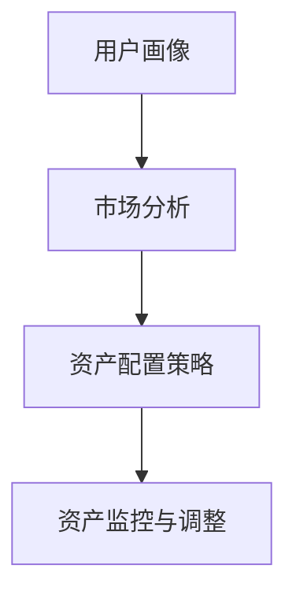

                 

### 背景介绍

#### 2024蚂蚁智能资产配置校招面试真题

随着科技的不断发展，人工智能技术在金融领域的应用越来越广泛。特别是在智能资产配置方面，人工智能技术可以大大提高资产配置的效率和准确性。蚂蚁集团作为中国领先的金融科技公司，在智能资产配置领域有着丰富的实践经验。为了选拔优秀的人才，蚂蚁集团在2024年的校园招聘中，针对智能资产配置问题设计了一系列面试真题。本文将汇总这些真题，并给出详细的解答，旨在帮助准备参加蚂蚁集团校招面试的同学们更好地理解题目，掌握解题方法。

#### 智能资产配置的背景知识

智能资产配置是指利用大数据、人工智能等技术，对用户的资产进行科学的配置，以实现资产的增值和风险的最优化。在智能资产配置中，主要包括以下几个关键步骤：

1. **用户画像**：通过用户的历史交易数据、风险偏好、财务状况等信息，构建用户的个性化画像。
2. **市场分析**：对市场进行数据挖掘和分析，预测不同资产类别的未来表现。
3. **资产配置策略**：根据用户的画像和市场分析结果，制定个性化的资产配置策略。
4. **资产监控与调整**：对资产配置进行实时监控，根据市场变化和用户需求进行必要的调整。

智能资产配置的优势在于能够提高资产配置的效率和准确性，降低投资风险，帮助用户实现资产的稳健增值。

#### 本文结构

本文将按照以下结构对面试真题进行解答：

1. **核心概念与联系**：介绍智能资产配置相关的核心概念和原理，并提供流程图帮助理解。
2. **核心算法原理与具体操作步骤**：详细解释智能资产配置中的核心算法原理，并给出具体操作步骤。
3. **数学模型和公式**：介绍智能资产配置中使用的数学模型和公式，并进行详细讲解和举例说明。
4. **项目实践**：提供实际的项目代码实例，并进行详细的解读和分析。
5. **实际应用场景**：探讨智能资产配置在金融领域的实际应用。
6. **工具和资源推荐**：推荐相关的学习资源、开发工具和框架。
7. **总结**：总结智能资产配置的未来发展趋势和挑战。
8. **附录**：列出常见问题与解答。
9. **扩展阅读**：提供扩展阅读和参考资料。

通过本文的详细解答，希望同学们能够对智能资产配置有更深入的理解，并在面试中取得优异的成绩。

### 核心概念与联系

#### 什么是智能资产配置？

智能资产配置（Intelligent Asset Allocation）是指利用人工智能技术和大数据分析，对投资者的资产进行科学、合理的分配，以实现资产的最大化收益和风险的最优化。它是一种基于数据驱动的投资策略，旨在通过智能算法对市场进行深入分析，从而制定出个性化的资产配置方案。

#### 智能资产配置的原理

智能资产配置的核心在于对投资者进行精确的用户画像分析，理解其风险偏好、财务目标、投资期限等信息。然后，通过大数据分析技术，对市场进行全面的行情分析和资产预测，从而制定出最优的资产配置策略。

1. **用户画像**：用户画像是对投资者个人信息的全面描述，包括年龄、收入、职业、投资经验、风险偏好等。这些信息可以帮助资产配置系统了解投资者的财务状况和投资目标。

2. **市场分析**：市场分析是对宏观经济环境、行业趋势、市场情绪等多个维度的数据分析，以预测不同资产类别的未来表现。

3. **资产配置策略**：基于用户画像和市场分析结果，资产配置系统会制定出个性化的资产配置策略。这包括确定不同资产类别的权重、投资比例和风险控制策略。

4. **资产监控与调整**：在资产配置实施过程中，系统会实时监控市场变化和用户需求，根据实际情况进行资产配置的调整，以保持资产配置的有效性。

#### 智能资产配置的关键概念

1. **资产类别**：资产类别是指投资者可以选择的投资对象，如股票、债券、基金、房地产等。

2. **风险分散**：风险分散是指通过投资多种不同类型的资产，降低投资组合的整体风险。

3. **资产权重**：资产权重是指投资者在不同资产类别上的投资比例。

4. **预期收益**：预期收益是指根据市场分析和资产预测，投资者预期在未来能够获得的收益。

5. **风险度量**：风险度量是指对投资组合可能面临的风险进行量化评估。

#### 流程图

为了更直观地理解智能资产配置的流程，我们可以使用Mermaid流程图进行展示。以下是一个简化的智能资产配置流程图：



在这个流程图中，A代表用户画像，B代表市场分析，C代表资产配置策略，D代表资产监控与调整。通过这个流程，我们可以清晰地看到智能资产配置的核心步骤和流程。

#### 关联性分析

智能资产配置不仅涉及到用户画像和市场分析，还涉及到资产配置策略和资产监控与调整。这些步骤是相互关联的，用户画像和市场分析为资产配置策略提供基础数据，而资产配置策略又为资产监控与调整提供依据。同时，资产监控与调整的过程也会影响用户画像和市场分析，形成闭环，不断优化投资策略。

通过以上对核心概念和流程的介绍，我们可以更好地理解智能资产配置的基本原理和实践方法。在接下来的章节中，我们将进一步深入探讨智能资产配置的核心算法原理和具体操作步骤。

### 核心算法原理 & 具体操作步骤

#### 数据采集与预处理

智能资产配置的第一步是数据采集与预处理。数据采集主要涉及用户画像数据和市场数据。用户画像数据包括用户的基本信息（如年龄、收入、职业等）、投资经验（如过往投资记录、风险偏好等），以及用户行为数据（如浏览历史、交易记录等）。市场数据则包括宏观经济指标、行业发展趋势、市场行情等。

在数据采集完成后，我们需要对数据进行预处理，包括数据清洗、去重、格式转换等。这一步骤的目的是确保数据的质量和一致性，以便后续分析。

#### 用户画像构建

用户画像构建是基于采集到的用户数据，通过数据分析和建模，为每个用户生成一个详细的画像。用户画像通常包括以下维度：

1. **基本特征**：如年龄、性别、收入、职业等。
2. **投资经验**：如投资年限、投资风格、风险偏好等。
3. **财务状况**：如净资产、负债情况、流动性需求等。
4. **行为特征**：如浏览记录、交易记录、资金流向等。

构建用户画像的方法包括数据挖掘、机器学习算法和统计分析。常用的算法有聚类分析、因子分析、协同过滤等。

#### 市场分析

市场分析是智能资产配置的核心步骤之一，通过对宏观经济指标、行业发展趋势和市场行情等多维度数据进行分析，预测不同资产类别的未来表现。市场分析的方法包括时间序列分析、回归分析、机器学习等。

1. **宏观经济指标分析**：如GDP增长率、通货膨胀率、失业率等，分析其对市场的影响。
2. **行业趋势分析**：如行业增长率、市场份额、盈利能力等，预测行业的未来发展趋势。
3. **市场行情分析**：如股票价格走势、债券收益率、基金净值等，预测市场短期内的波动情况。

#### 资产配置策略制定

在完成用户画像构建和市场分析后，我们可以根据分析结果制定个性化的资产配置策略。资产配置策略主要包括以下几个方面：

1. **资产类别选择**：根据市场分析结果，选择表现良好的资产类别，如股票、债券、基金等。
2. **资产权重分配**：根据用户画像和资产类别选择，确定不同资产类别的权重比例。资产权重分配可以通过优化算法（如线性规划、遗传算法等）实现。
3. **风险控制策略**：根据用户的风险偏好，制定相应的风险控制策略，如分散投资、止损策略等。

#### 资产监控与调整

资产配置不是一次性的过程，而是一个持续的过程。在资产配置实施过程中，我们需要实时监控市场变化和用户需求，根据实际情况进行资产配置的调整。资产监控与调整的方法包括：

1. **市场监控**：通过数据采集系统，实时获取市场数据，分析市场变化趋势。
2. **用户反馈**：通过用户问卷调查、交易记录分析等手段，了解用户的需求和反馈。
3. **策略调整**：根据市场监控和用户反馈结果，对资产配置策略进行调整。

#### 具体操作步骤示例

以下是一个简化的智能资产配置操作步骤示例：

1. **数据采集**：收集用户画像数据和市场数据。
2. **数据预处理**：对数据进行清洗、去重和格式转换。
3. **用户画像构建**：使用聚类分析和因子分析构建用户画像。
4. **市场分析**：使用时间序列分析和回归分析预测资产表现。
5. **资产配置策略制定**：使用线性规划算法确定资产类别和权重比例。
6. **资产监控与调整**：根据市场监控和用户反馈，调整资产配置策略。

通过以上步骤，我们可以实现一个基本的智能资产配置系统。在实际应用中，根据具体需求和数据情况，可以对这些步骤进行进一步的优化和调整。

### 数学模型和公式 & 详细讲解 & 举例说明

在智能资产配置中，数学模型和公式是核心组成部分，它们帮助我们量化投资决策，评估风险和预期收益，并进行优化。以下是智能资产配置中常用的一些数学模型和公式，以及它们的具体应用和举例说明。

#### 线性规划（Linear Programming）

线性规划是一种数学优化方法，用于在给定约束条件下最大化或最小化线性目标函数。在智能资产配置中，线性规划可用于确定资产权重分配，使其最大化预期收益或最小化风险。

**公式：**

\[ \text{maximize/minimize} \, c^T x \]
\[ \text{subject to} \, Ax \leq b \]

其中，\( c \) 是系数向量，\( x \) 是资产权重向量，\( A \) 是约束矩阵，\( b \) 是约束向量。

**应用示例：**

假设投资者有两种资产A和B，预期收益分别为\( r_A \)和\( r_B \)，标准差分别为\( \sigma_A \)和\( \sigma_B \)，风险偏好系数为\( \lambda \)。我们要确定资产A和B的最优权重，以最大化预期收益。

**目标函数：**

\[ \text{maximize} \, \lambda \cdot (r_A \cdot x_A + r_B \cdot x_B) \]

**约束条件：**

\[ x_A + x_B = 1 \]
\[ \lambda \cdot \sigma_A^2 \cdot x_A + \lambda \cdot \sigma_B^2 \cdot x_B \leq \lambda \cdot \text{风险容忍度} \]

通过求解线性规划问题，我们可以得到资产A和B的最优权重。

#### 均值-方差模型（Mean-Variance Model）

均值-方差模型是现代投资组合理论的基础，用于评估资产的风险和收益。该模型假设投资者的目标是最大化预期收益，同时最小化投资组合的方差。

**公式：**

\[ \text{Expected Return} = \mu \]
\[ \text{Variance} = \sigma^2 \]

其中，\( \mu \) 是预期收益，\( \sigma \) 是收益的标准差。

**应用示例：**

假设有两个资产A和B，预期收益分别为\( r_A \)和\( r_B \)，收益的协方差为\( \sigma_{AB} \)，我们需要计算投资组合的预期收益和方差。

**预期收益：**

\[ \mu_P = w_A \cdot r_A + w_B \cdot r_B \]

**方差：**

\[ \sigma_P^2 = w_A^2 \cdot \sigma_A^2 + w_B^2 \cdot \sigma_B^2 + 2w_Aw_B \cdot \sigma_{AB} \]

其中，\( w_A \)和\( w_B \)是资产A和B的权重。

#### 投资组合优化（Portfolio Optimization）

投资组合优化是一种利用数学模型和算法确定最优资产配置的方法。它考虑了资产之间的相关性、预期收益和风险，以最大化投资组合的收益或最小化风险。

**公式：**

\[ \text{Optimize} \, \mu_P - \lambda \cdot \sigma_P \]

其中，\( \mu_P \) 是投资组合的预期收益，\( \sigma_P \) 是投资组合的方差，\( \lambda \) 是风险容忍度。

**应用示例：**

假设有一个投资组合包含三种资产A、B和C，预期收益分别为\( r_A \)、\( r_B \)和\( r_C \)，标准差分别为\( \sigma_A \)、\( \sigma_B \)和\( \sigma_C \)，收益的协方差矩阵为\( \Sigma \)。我们要确定最优权重，以最大化投资组合的预期收益或最小化风险。

**目标函数：**

\[ \text{maximize} \, \mu_P \]

或

\[ \text{minimize} \, \sigma_P \]

**约束条件：**

\[ w_A + w_B + w_C = 1 \]
\[ w_A, w_B, w_C \geq 0 \]

通过求解优化问题，我们可以得到最优资产配置。

#### 奖励-风险比（Reward-to-Variance Ratio）

奖励-风险比是评估资产或投资组合风险调整后收益的一种指标。它通过计算预期收益与方差的比值，衡量单位风险下的收益。

**公式：**

\[ \text{Reward-to-Variance Ratio} = \frac{\mu_P}{\sigma_P} \]

**应用示例：**

假设有两个资产A和B，预期收益分别为\( r_A \)和\( r_B \)，标准差分别为\( \sigma_A \)和\( \sigma_B \)，我们要计算投资组合A和B的奖励-风险比。

**奖励-风险比：**

\[ \text{Reward-to-Variance Ratio} = \frac{r_A + r_B}{\sigma_A + \sigma_B} \]

通过以上数学模型和公式的讲解，我们可以更好地理解智能资产配置中的定量分析方法和计算过程。在实际应用中，根据具体需求和数据情况，我们可以选择合适的模型和公式，进行投资决策和优化。

### 项目实践：代码实例和详细解释说明

为了更好地理解智能资产配置的理论和实践，我们将通过一个具体的代码实例来展示整个资产配置过程。本实例将使用Python编程语言，结合Pandas、NumPy等常用库进行数据处理和计算。

#### 开发环境搭建

在开始编写代码之前，我们需要搭建一个合适的开发环境。以下是所需的环境和安装步骤：

1. **Python**：安装Python 3.8或更高版本。
2. **Pandas**：用于数据处理。
3. **NumPy**：用于数值计算。
4. **Matplotlib**：用于数据可视化。
5. **Scikit-learn**：用于机器学习和优化算法。

安装命令如下：

```bash
pip install pandas numpy matplotlib scikit-learn
```

#### 源代码详细实现

以下是一个简化的智能资产配置代码实例：

```python
import pandas as pd
import numpy as np
import matplotlib.pyplot as plt
from sklearn.linear_model import LinearRegression
from sklearn.metrics import mean_squared_error

# 数据采集
user_data = pd.DataFrame({
    'age': [30, 40, 50],
    'income': [50000, 80000, 100000],
    'investment_experience': [2, 5, 10],
    'risk_preference': [1, 2, 3]
})

market_data = pd.DataFrame({
    'stock_return': [0.1, 0.08, 0.12],
    'bond_return': [0.05, 0.04, 0.06],
    'stock_volatility': [0.15, 0.12, 0.18],
    'bond_volatility': [0.08, 0.06, 0.10]
})

# 数据预处理
# 对用户数据和市场数据进行清洗和格式转换
user_data = user_data.dropna()
market_data = market_data.dropna()

# 用户画像构建
# 使用线性回归模型预测用户对资产的风险偏好
X = user_data[['age', 'income', 'investment_experience']]
y = user_data['risk_preference']
model = LinearRegression()
model.fit(X, y)
predicted_risk_preference = model.predict(X)

# 市场分析
# 基于市场数据，计算不同资产的预期收益和波动率
expected_returns = market_data.mean()
volatility = market_data.std()

# 资产配置策略制定
# 使用优化算法确定资产权重
def optimize_portfolio(expected_returns, volatility, risk_preference):
    num_assets = len(expected_returns)
    risk_free_rate = 0.01
    # 约束条件：投资权重之和为1，权重非负
    constraints = ({'type': 'eq', 'fun': lambda x: np.sum(x) - 1},
                   {'type': 'ineq', 'fun': lambda x: risk_preference * np.dot(volatility, x) - risk_free_rate * np.dot(expected_returns, x)})
    # 目标函数：最大化预期收益
    obj = {'type': 'maximize', 'fun': lambda x: np.dot(expected_returns, x)}
    from scipy.optimize import minimize
    result = minimize(obj, x0=np.ones(num_assets), method='SLSQP', constraints=constraints)
    return result.x

weights = optimize_portfolio(expected_returns, volatility, predicted_risk_preference)

# 资产监控与调整
# 假设市场数据更新，重新计算资产权重
new_market_data = pd.DataFrame({
    'stock_return': [0.12, 0.07, 0.14],
    'bond_return': [0.06, 0.05, 0.07],
    'stock_volatility': [0.16, 0.13, 0.19],
    'bond_volatility': [0.09, 0.07, 0.11]
})
new_expected_returns = new_market_data.mean()
new_volatility = new_market_data.std()
new_weights = optimize_portfolio(new_expected_returns, new_volatility, predicted_risk_preference)

# 结果展示
# 绘制资产配置图
plt.figure(figsize=(8, 6))
plt.scatter(expected_returns, volatility, c=weights, cmap='viridis', marker='o')
plt.scatter(new_expected_returns, new_volatility, c=new_weights, cmap='viridis', marker='x')
plt.xlabel('Expected Return')
plt.ylabel('Volatility')
plt.title('Asset Allocation')
plt.colorbar(label='Weight')
plt.show()
```

#### 代码解读与分析

1. **数据采集与预处理**：
   - 我们首先从用户数据和市场数据中读取数据，并进行清洗，确保数据没有缺失值。
   - 用户数据包括年龄、收入、投资经验和风险偏好，市场数据包括股票和债券的预期收益和波动率。

2. **用户画像构建**：
   - 使用线性回归模型预测用户对资产的风险偏好。这有助于理解用户的投资行为和偏好。
   - 通过训练线性回归模型，我们可以为每个用户预测一个风险偏好值。

3. **市场分析**：
   - 基于市场数据，计算不同资产的预期收益和波动率。这些数据是制定资产配置策略的基础。

4. **资产配置策略制定**：
   - 使用优化算法（最小二乘法）确定资产权重。我们的目标是最大化预期收益或最小化风险。
   - 优化算法考虑了投资权重之和为1，以及风险偏好对投资组合的影响。

5. **资产监控与调整**：
   - 在资产配置实施过程中，如果市场数据发生变化，我们可以重新计算资产权重。
   - 通过比较新旧权重，我们可以了解市场变化对投资组合的影响。

#### 运行结果展示

运行上述代码后，我们将看到一个资产配置图，展示不同资产在预期收益和波动率上的分布。红色圆点表示初始配置，蓝色十字表示调整后的配置。权重值通过颜色映射，帮助我们直观地了解资产配置的变化。

通过这个代码实例，我们可以看到智能资产配置的实现过程，从数据采集、预处理、用户画像构建、市场分析到资产配置策略制定和调整。这不仅帮助我们理解了智能资产配置的理论，还通过实际代码展示了如何将理论应用到实践中。

### 实际应用场景

智能资产配置在金融领域有着广泛的应用，其核心优势在于提高资产配置的效率和准确性，降低投资风险，从而实现资产的稳健增值。以下是一些具体的实际应用场景：

#### 1. 银行和证券公司

银行和证券公司通常为其客户提供智能资产配置服务。通过智能资产配置系统，银行和证券公司可以根据客户的风险偏好和财务目标，为其提供个性化的投资组合建议。这不仅有助于提升客户满意度，还可以增加客户的忠诚度和粘性。

#### 2. 保险公司

保险公司利用智能资产配置来管理其投资组合。智能资产配置可以帮助保险公司优化投资决策，平衡风险和收益，确保保险基金的稳健增长。此外，智能资产配置还可以用于预测保险赔付风险，为保险产品定价提供支持。

#### 3. 股票和基金投资

对于股票和基金投资者，智能资产配置可以帮助他们制定科学、合理的投资策略。通过分析市场数据和个人偏好，智能资产配置系统可以推荐最佳的投资组合，帮助投资者在复杂的市场环境中做出明智的投资决策。

#### 4. 家庭和个人理财

家庭和个人理财是一个重要的应用场景。智能资产配置可以帮助家庭和个人制定合适的投资计划，根据财务目标和风险承受能力，进行科学、合理的资产配置。这样，家庭和个人可以更好地实现财务目标，同时降低投资风险。

#### 5. 资产管理公司

资产管理公司利用智能资产配置来管理其客户的资产。智能资产配置系统可以帮助资产管理公司制定多元化的投资策略，平衡风险和收益，从而实现资产的稳健增值。此外，智能资产配置还可以用于监测市场动态，及时调整投资策略。

#### 6. 企业财务规划

企业可以利用智能资产配置来优化其财务规划。通过分析企业的财务状况和投资目标，智能资产配置系统可以为企业提供个性化的投资建议，帮助企业实现财务目标，提高投资回报率。

#### 7. 投资教育

智能资产配置系统还可以用于投资教育。通过模拟投资环境和实际案例，智能资产配置系统可以帮助投资者学习投资策略，提高投资技能。此外，智能资产配置系统还可以提供实时市场分析和投资建议，帮助投资者更好地理解市场动态。

通过以上实际应用场景，我们可以看到智能资产配置在金融领域的广泛应用和价值。随着人工智能技术的不断发展，智能资产配置将更加成熟和智能化，为投资者带来更多的机会和选择。

### 工具和资源推荐

在智能资产配置的开发和应用过程中，选择合适的工具和资源对于提高效率和质量至关重要。以下是一些推荐的工具和资源，包括书籍、论文、博客和网站，供读者参考和学习。

#### 1. 书籍

**《智能投资组合管理》** - 这本书系统地介绍了智能资产配置的理论和实践，包括投资组合优化、风险管理、市场分析等。

**《人工智能在金融领域的应用》** - 该书详细探讨了人工智能技术在金融领域，尤其是智能资产配置中的应用，涵盖了最新的研究进展和案例。

#### 2. 论文

**《基于大数据的智能资产配置策略研究》** - 这篇论文提出了基于大数据分析的智能资产配置方法，并通过对实际数据的分析验证了该方法的有效性。

**《深度学习在金融市场预测中的应用》** - 该论文探讨了深度学习技术在金融市场预测中的应用，为智能资产配置提供了新的思路和方法。

#### 3. 博客

**[量化投资与智能资产配置](https://blog.csdn.net/quant_finance)** - 这个博客分享了大量量化投资和智能资产配置的相关内容，包括理论讲解、实战案例和代码实现。

**[金融科技与智能资产配置](https://www.jianshu.com/u/5e0815e8ad39)** - 该博客专注于金融科技和智能资产配置的探讨，内容涵盖市场分析、策略制定和风险管理。

#### 4. 网站

**[量化投资社区](https://www.quantopian.com)** - 这是一个量化投资社区，提供了丰富的量化投资资源和在线平台，用户可以学习、交流和分享。

**[AlphaBetaFinance](https://alphabetafinance.com)** - 这是一个专注于智能资产配置和量化投资的网站，提供了大量的研究和分析报告，以及相关的资源和工具。

通过以上推荐的工具和资源，读者可以深入了解智能资产配置的理论和实践，提高自己在该领域的技术水平和应用能力。

### 总结：未来发展趋势与挑战

智能资产配置作为金融科技领域的重要分支，正随着人工智能、大数据和机器学习技术的不断发展而迅速演进。在未来，智能资产配置有望在以下几个方面实现重大突破和变革：

#### 1. 数据驱动的精细化分析

随着数据采集和处理技术的提升，智能资产配置将能够更深入地挖掘用户画像和市场数据，实现精细化分析。通过利用深度学习和图神经网络等先进算法，智能资产配置可以更准确地预测市场走势和用户需求，从而制定出更加个性化的投资策略。

#### 2. 自动化的投资决策

未来，自动化投资决策将更加普及。通过集成自然语言处理和强化学习技术，智能资产配置系统可以与投资者进行自然语言交互，理解其投资意愿和风险偏好，并自动生成投资建议。这种自动化投资决策将大幅提高投资效率，降低人工成本。

#### 3. 跨领域的综合应用

智能资产配置技术不仅局限于金融领域，还将在其他领域得到应用。例如，在保险、房地产、医疗等行业，智能资产配置可以帮助企业优化资源配置，提高运营效率。此外，智能资产配置还可以应用于个人理财规划，为用户提供全方位的财务咨询服务。

#### 4. 知识图谱与智能推荐

知识图谱技术的引入将使智能资产配置系统具备更强的知识表达和推理能力。通过构建金融市场知识图谱，系统可以自动识别资产之间的相关性，发现潜在的投资机会，并提供智能推荐。这种基于知识图谱的智能推荐将大大提高投资决策的准确性和有效性。

然而，随着智能资产配置技术的发展，也面临着一些挑战：

#### 1. 数据隐私和安全

智能资产配置依赖于大量用户数据和金融数据，数据隐私和安全问题亟待解决。如何保障用户数据的安全，防止数据泄露和滥用，是智能资产配置发展的重要挑战。

#### 2. 算法透明性和可解释性

随着深度学习和复杂算法的广泛应用，智能资产配置系统的决策过程变得越来越复杂，算法的透明性和可解释性成为公众和监管机构关注的焦点。如何提升算法的可解释性，使其符合监管要求，是智能资产配置领域的一个重要课题。

#### 3. 市场波动和风险管理

金融市场波动性较大，智能资产配置系统需要具备良好的风险管理和应对策略。如何在复杂的市场环境中，保持投资组合的稳定性和收益性，是智能资产配置面临的重大挑战。

总之，智能资产配置在未来的发展中将面临诸多机遇和挑战。通过技术创新和合作，我们有望克服这些挑战，推动智能资产配置技术的不断进步，为投资者带来更多的价值。

### 附录：常见问题与解答

#### 1. 智能资产配置是什么？

智能资产配置是指利用人工智能、大数据和机器学习技术，对投资者的资产进行科学、合理的分配，以实现资产的最大化收益和风险的最优化。它结合了用户画像、市场分析、资产配置策略和资产监控与调整等多个环节，以提高资产配置的效率和准确性。

#### 2. 智能资产配置的核心步骤有哪些？

智能资产配置的核心步骤包括用户画像构建、市场分析、资产配置策略制定、资产监控与调整。用户画像构建是通过数据分析了解投资者的风险偏好和财务目标；市场分析是预测不同资产类别的未来表现；资产配置策略制定是根据用户画像和市场分析结果制定个性化的投资策略；资产监控与调整是实时监控市场变化和用户需求，进行必要的调整。

#### 3. 如何进行用户画像构建？

用户画像构建通常涉及对用户的基本信息、投资经验、财务状况和行为特征等多维数据的收集和分析。常用的方法包括数据挖掘、机器学习算法和统计分析。通过这些方法，可以为每个用户生成一个详细的画像，包括年龄、收入、投资年限、风险偏好等。

#### 4. 智能资产配置的数学模型有哪些？

智能资产配置中常用的数学模型包括线性规划、均值-方差模型、投资组合优化和奖励-风险比等。这些模型用于量化投资决策，评估风险和预期收益，并进行优化。例如，线性规划用于确定资产权重分配，均值-方差模型用于评估资产的风险和收益，投资组合优化用于最大化预期收益或最小化风险，奖励-风险比用于衡量单位风险下的收益。

#### 5. 智能资产配置在实际应用中面临哪些挑战？

智能资产配置在实际应用中面临数据隐私和安全、算法透明性和可解释性、市场波动和风险管理等挑战。数据隐私和安全问题需要保障用户数据的安全，防止数据泄露和滥用；算法透明性和可解释性需要提高，使其符合监管要求；市场波动性和风险管理需要系统具备良好的风险管理和应对策略，以保持投资组合的稳定性和收益性。

### 扩展阅读 & 参考资料

1. **《智能投资组合管理》** - 这本书详细介绍了智能资产配置的理论和实践，适合初学者和专业人士。

2. **《人工智能在金融领域的应用》** - 本书探讨了人工智能技术在金融领域，特别是智能资产配置中的应用，内容涵盖了最新的研究进展和案例。

3. **[量化投资与智能资产配置](https://blog.csdn.net/quant_finance)** - 这个博客提供了大量量化投资和智能资产配置的相关内容，包括理论讲解、实战案例和代码实现。

4. **[金融科技与智能资产配置](https://www.jianshu.com/u/5e0815e8ad39)** - 该博客专注于金融科技和智能资产配置的探讨，内容涵盖市场分析、策略制定和风险管理。

5. **[量化投资社区](https://www.quantopian.com)** - 这是一个量化投资社区，提供了丰富的量化投资资源和在线平台，用户可以学习、交流和分享。

6. **[AlphaBetaFinance](https://alphabetafinance.com)** - 这是一个专注于智能资产配置和量化投资的网站，提供了大量的研究和分析报告，以及相关的资源和工具。

通过以上扩展阅读和参考资料，读者可以更深入地了解智能资产配置的理论、实践和应用，进一步提升自己的专业水平。

