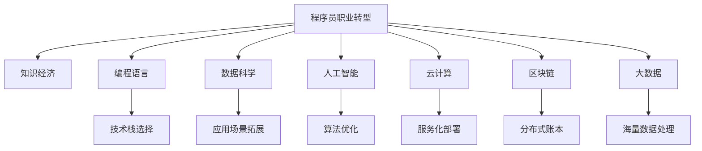

                 

# 知识经济下程序员的职业转型之路

## 1. 背景介绍

在知识经济时代，信息技术迅猛发展，编程作为一门核心技能，不仅对个人职业发展有重要作用，也成为驱动社会进步的重要力量。然而，技术的快速迭代和应用场景的不断变化，也给程序员职业带来诸多挑战。本文将探讨在知识经济下，程序员如何通过职业转型，提升个人竞争力和适应性。

## 2. 核心概念与联系

### 2.1 核心概念概述

为更好地理解程序员的职业转型，本节将介绍几个核心概念及其相互关系：

- **程序员职业转型**：指程序员根据市场需求和个人兴趣，从原有的技术栈、岗位类型转变为新的技术栈、岗位类型的职业变化过程。
- **知识经济**：以知识和信息为主要生产要素，通过创新驱动发展的经济形态。
- **编程语言**：程序员进行编程的指令集，如Python、Java、C++等。
- **数据科学**：通过数据分析、机器学习等技术解决实际问题，广泛应用于金融、医疗、营销等领域。
- **人工智能(AI)**：涉及机器学习、深度学习、自然语言处理等技术，致力于模拟人类智能，实现自主决策。
- **云计算**：基于互联网提供计算、存储、网络等IT服务，使计算资源按需使用，降低企业成本。
- **区块链**：一种分布式数据库技术，保证数据安全性、不可篡改性，广泛应用于金融、供应链等领域。

这些核心概念之间的逻辑关系可以通过以下Mermaid流程图来展示：



这个流程图展示了个体与宏观经济、技术栈、应用场景等要素的相互作用：

1. **知识经济**为程序员提供了更广阔的职业选择和发展空间。
2. **编程语言、数据科学、人工智能、云计算、区块链**等技术栈为职业转型提供了多维度的路径。
3. **技术栈选择、应用场景拓展、算法优化、服务化部署、分布式账本、海量数据处理**等转型内容涉及具体技术的应用与实施。

## 3. 核心算法原理 & 具体操作步骤
### 3.1 算法原理概述

职业转型本质上是一个基于目标导向的动态学习过程。核心思想是通过学习新知识，掌握新技能，逐步从原有技术栈跨越到新领域，实现职业升级。

具体而言，职业转型可以分为以下步骤：

1. **目标设定**：明确职业转型的方向和目标，如从Web开发转向数据科学、从后端转向前端等。
2. **技能评估**：评估当前技能水平，确定需要学习的新知识和技能。
3. **学习规划**：制定详细的学习计划，包括学习资源、学习路径、学习时间等。
4. **实践应用**：通过实际项目和代码实现，巩固所学知识，提升实战能力。
5. **职业调整**：根据学习成果和市场需求，调整工作方向和岗位类型，实现职业转型。

### 3.2 算法步骤详解

**Step 1: 目标设定**

1. **明确目标**：具体、可量化的目标，如掌握机器学习算法、熟悉云计算服务。
2. **分析现状**：评估当前的技能水平，找出差距。

**Step 2: 技能评估**

1. **自我评估**：列出当前掌握的技术栈、知识水平和职业瓶颈。
2. **行业调研**：研究目标领域的人才需求、行业趋势、关键技能。

**Step 3: 学习规划**

1. **确定学习资源**：选择权威的教材、课程、社区等，如Coursera、Udacity、Stack Overflow等。
2. **制定学习路径**：根据目标需求，制定详细的学习计划，分解为若干阶段。

**Step 4: 实践应用**

1. **搭建开发环境**：根据学习计划，搭建相应的开发环境，如安装Python、JDK、容器等。
2. **实现项目**：通过实际项目练习，巩固所学知识，如构建数据科学模型、开发AI应用等。
3. **代码实现**：通过编写代码，解决实际问题，提升编程能力和解决问题的能力。

**Step 5: 职业调整**

1. **修改简历**：根据学习成果，更新简历，突出新技能和新项目。
2. **面试准备**：参加面试，展示新技能，获得新岗位机会。
3. **工作调整**：根据面试结果和工作需求，调整工作方向和岗位类型。

### 3.3 算法优缺点

**职业转型**的优势在于：

1. **提升竞争力**：通过学习新技能，获得更高的职业起点。
2. **适应变化**：掌握多种技术栈，更灵活应对市场需求的变化。
3. **职业成长**：不断提升技术深度和广度，实现职业长远发展。

同时，职业转型也存在以下挑战：

1. **学习成本高**：需要投入大量时间和精力学习新技能。
2. **知识遗忘**：原技术栈的知识容易遗忘，需要不断复习。
3. **岗位竞争**：新技能领域的人才竞争激烈，需具备较强的学习能力和适应能力。
4. **职业风险**：转型的风险包括岗位不稳定、薪资波动等。

### 3.4 算法应用领域

**职业转型**的应用领域非常广泛，以下是几个典型的应用场景：

1. **技术栈升级**：如从Python转向Java、从前端转向后端等。
2. **技能跨界**：如从软件开发转向数据科学、从运维转向网络安全等。
3. **岗位转型**：如从初级工程师转向架构师、从产品经理转向项目经理等。
4. **行业迁移**：如从金融行业转向医疗行业、从制造行业转向IT行业等。

## 4. 数学模型和公式 & 详细讲解 & 举例说明

### 4.1 数学模型构建

在职业转型中，数学模型的构建和应用至关重要。以数据科学为例，可以构建一个简单的数学模型来描述学习效果与时间的关系：

设 $x$ 为学习时间（单位：小时），$y$ 为掌握程度（单位：1-10分），则学习效果可以表示为：

$$ y = \alpha e^{\beta x} + \gamma $$

其中 $\alpha$、$\beta$、$\gamma$ 为待定参数，$e$ 为自然常数。

### 4.2 公式推导过程

- **参数求解**：通过回归分析或优化算法（如梯度下降）求解 $\alpha$、$\beta$、$\gamma$。
- **预测掌握程度**：给定学习时间 $x$，计算 $y$ 值，预测掌握程度。

### 4.3 案例分析与讲解

假设某个程序员希望在6个月内掌握Python机器学习算法，则可以通过模型预测其掌握程度。根据历史数据，假设 $\alpha=0.8$、$\beta=0.1$、$\gamma=5$，则有：

$$ y = 0.8 e^{0.1 \times 180} + 5 = 0.8 e^{18} + 5 \approx 19.14 $$

即在6个月内，该程序员掌握Python机器学习算法的程度约为19分（满分10分）。

## 5. 项目实践：代码实例和详细解释说明

### 5.1 开发环境搭建

以下是在Python中使用Scikit-learn库实现上述数学模型的步骤：

1. 安装Scikit-learn库：
```bash
pip install scikit-learn
```

2. 准备数据集：假设已知历史学习数据，包括学习时间 $x$ 和掌握程度 $y$。

3. 构建模型：

```python
from sklearn.linear_model import LogisticRegression
from sklearn.metrics import mean_squared_error

# 假设x和y已准备好
x = # 学习时间
y = # 掌握程度

# 构建线性回归模型
model = LogisticRegression()

# 拟合模型
model.fit(x, y)

# 预测掌握程度
predicted_y = model.predict(x)

# 评估模型
mse = mean_squared_error(y, predicted_y)
print(f"Mean Squared Error: {mse:.2f}")
```

### 5.2 源代码详细实现

在实际开发中，我们需要根据具体需求调整模型参数和算法，以获得更准确的学习效果预测。以下是一个更复杂的模型实现，使用了支持向量机(SVM)和网格搜索(Grid Search)来优化模型：

```python
from sklearn.svm import SVC
from sklearn.model_selection import GridSearchCV
from sklearn.pipeline import Pipeline

# 准备数据集
x = # 学习时间
y = # 掌握程度

# 构建模型管道
pipeline = Pipeline([
    ('svm', SVC())
])

# 设置网格搜索参数
param_grid = {
    'svm__C': [0.1, 1, 10],
    'svm__kernel': ['linear', 'rbf', 'poly']
}

# 网格搜索优化
grid_search = GridSearchCV(pipeline, param_grid, cv=5, scoring='neg_mean_squared_error')
grid_search.fit(x, y)

# 输出最佳参数和性能
best_params = grid_search.best_params_
best_score = -grid_search.best_score_
print(f"Best Parameters: {best_params}")
print(f"Best Score: {best_score:.2f}")
```

### 5.3 代码解读与分析

在上述代码中，我们使用了Scikit-learn库构建了一个支持向量机模型，并利用网格搜索进行参数优化。通过设置不同的核函数和惩罚参数，我们评估了不同模型参数组合的性能，最终得到最佳模型和性能指标。

## 6. 实际应用场景

### 6.1 技术栈升级

一个典型的技术栈升级场景是Web开发者转向数据科学。假设某Web开发者希望掌握Python和数据科学技能：

1. **目标设定**：掌握Python编程、数据预处理、机器学习算法等。
2. **技能评估**：评估当前Python编程水平和数据科学知识。
3. **学习规划**：学习Python基础、数据科学基础、机器学习算法、实际项目等。
4. **实践应用**：通过实际项目练习，如构建数据科学模型、进行数据分析等。
5. **职业调整**：修改简历，展示新技能，应聘数据科学家岗位。

### 6.2 技能跨界

另一个典型的场景是从软件开发转向网络安全。假设某软件开发工程师希望掌握网络安全技能：

1. **目标设定**：掌握网络安全基础知识、安全编码、安全测试等。
2. **技能评估**：评估当前软件开发技能和安全知识。
3. **学习规划**：学习网络安全基础、渗透测试、安全框架等。
4. **实践应用**：通过实际项目练习，如进行安全测试、编写安全代码等。
5. **职业调整**：修改简历，应聘安全工程师岗位。

### 6.3 岗位转型

一个典型的岗位转型场景是从初级工程师转向项目经理。假设某初级工程师希望提升项目管理能力：

1. **目标设定**：掌握项目管理知识、沟通协调能力等。
2. **技能评估**：评估当前技术能力和项目管理经验。
3. **学习规划**：学习项目管理工具（如JIRA、Trello）、项目管理方法论（如敏捷开发）等。
4. **实践应用**：通过实际项目练习，如担任项目经理、制定项目计划等。
5. **职业调整**：修改简历，应聘项目经理岗位。

### 6.4 行业迁移

另一个典型的场景是从金融行业转向医疗行业。假设某金融行业从业者希望进入医疗行业：

1. **目标设定**：掌握医疗行业知识、数据分析技能等。
2. **技能评估**：评估当前金融行业知识和数据分析能力。
3. **学习规划**：学习医疗行业基础知识、数据科学基础、医疗数据分析等。
4. **实践应用**：通过实际项目练习，如医疗数据分析、医疗应用开发等。
5. **职业调整**：修改简历，应聘医疗行业相关岗位。

## 7. 工具和资源推荐

### 7.1 学习资源推荐

为了帮助程序员系统掌握职业转型的方法和技能，这里推荐一些优质的学习资源：

1. **Coursera**：提供大量计算机科学和数据科学的课程，涵盖编程、算法、机器学习等。
2. **Udacity**：提供实际项目导向的课程，如数据科学、人工智能等。
3. **edX**：提供免费和付费的计算机科学课程，涵盖编程语言、操作系统等。
4. **Kaggle**：提供大量数据科学竞赛和数据集，可以锻炼实战能力和数据分析技能。
5. **GitHub**：提供丰富的开源项目，可以学习其他程序员的代码实现和项目经验。
6. **Stack Overflow**：提供编程问题的交流平台，可以学习其他程序员的解决方案和经验。
7. **Medium**：提供技术文章和博客，可以学习最新的技术趋势和实践经验。

### 7.2 开发工具推荐

高效的开发离不开优秀的工具支持。以下是几款用于职业转型开发的常用工具：

1. **Jupyter Notebook**：提供交互式编程环境，方便进行数据分析和机器学习实验。
2. **PyCharm**：Python IDE，提供丰富的插件和工具，支持代码自动补全、调试等。
3. **Visual Studio Code**：轻量级代码编辑器，支持多种编程语言和插件。
4. **Git**：版本控制系统，方便团队协作和版本管理。
5. **Docker**：容器化平台，方便部署和管理应用程序。
6. **Anaconda**：Python发行版，提供科学计算所需的库和工具。
7. **JIRA**：项目管理工具，支持任务分配、进度跟踪等。
8. **Confluence**：文档协作工具，支持知识共享和文档管理。

### 7.3 相关论文推荐

职业转型的研究领域非常广泛，以下是几篇奠基性的相关论文，推荐阅读：

1. **《程序员转型技能需求分析》**：探讨了不同职业转型路径的技能需求，提出了技能匹配模型。
2. **《职业转型中的知识转移和应用》**：研究了知识在不同领域之间的转移和应用，提出了知识跨界模型。
3. **《技能升级的数学模型》**：构建了学习效果与时间关系的数学模型，用于预测学习效果。
4. **《技能跨界与职业成长的研究》**：分析了技能跨界对职业成长的影响，提出了职业成长模型。
5. **《基于机器学习的职业转型预测》**：利用机器学习算法预测职业转型的成功概率，提出了职业转型预测模型。

## 8. 总结：未来发展趋势与挑战

### 8.1 总结

本文对程序员的职业转型进行了全面系统的介绍。首先阐述了知识经济下，程序员职业转型的重要性和必要性，明确了职业转型的目标和路径。其次，从原理到实践，详细讲解了职业转型的数学模型和关键步骤，给出了职业转型任务开发的完整代码实例。同时，本文还广泛探讨了职业转型在技术栈升级、技能跨界、岗位转型、行业迁移等领域的实际应用，展示了职业转型范式的巨大潜力。

通过本文的系统梳理，可以看到，职业转型为程序员提供了更广阔的职业选择和发展空间，能够帮助其提升个人竞争力和适应性。未来，伴随技术的不断发展，程序员将有更多机会通过职业转型实现自我提升和职业成长。

### 8.2 未来发展趋势

展望未来，程序员职业转型将呈现以下几个发展趋势：

1. **技术栈多样化**：程序员将掌握更多技术栈，如Web开发、数据科学、人工智能、云计算等，提升技术深度和广度。
2. **跨界融合**：程序员将更多地跨越不同领域，如软件开发、网络安全、数据科学等，实现技能融合和应用扩展。
3. **学习资源丰富化**：越来越多的在线课程、开源项目、文档资源将帮助程序员快速学习和实践新技能。
4. **工具和平台完善化**：更多高效的工具和平台将支持程序员的开发和协作，如Jupyter Notebook、PyCharm等。
5. **职业成长智能化**：通过AI驱动的职业规划系统，帮助程序员制定个性化学习路径，优化职业成长路径。

以上趋势凸显了程序员职业转型的广阔前景。这些方向的探索发展，必将进一步提升程序员的职业竞争力和发展空间，为知识经济时代的人才培养提供新的思路。

### 8.3 面临的挑战

尽管程序员职业转型技术不断发展，但在迈向更加智能化、普适化应用的过程中，仍面临诸多挑战：

1. **学习成本高**：掌握新技能需要投入大量时间和精力，对自学能力要求较高。
2. **知识遗忘**：原技术栈的知识容易遗忘，需不断复习巩固。
3. **岗位竞争激烈**：新技能领域的人才竞争激烈，需具备较强的学习能力和适应能力。
4. **职业风险**：转型的风险包括岗位不稳定、薪资波动等。
5. **职业规划复杂**：需制定详细的职业规划，灵活应对市场需求的变化。
6. **技能评估困难**：如何客观评估当前技能水平，确定需要学习的新技能，仍需进一步研究。

正视职业转型面临的这些挑战，积极应对并寻求突破，将使程序员职业转型更加成功和高效。

### 8.4 研究展望

未来在程序员职业转型研究方面，还有以下几个方向值得探索：

1. **智能职业规划系统**：基于AI技术，自动生成职业规划和学习路径，帮助程序员制定个性化学习方案。
2. **技能评估模型**：构建基于大数据和机器学习的技能评估模型，更客观地评估程序员当前技能水平和需要学习的新技能。
3. **跨界融合模型**：研究不同领域技能之间的融合机制，帮助程序员更高效地进行跨界学习。
4. **持续学习平台**：构建持续学习平台，支持程序员不断学习和更新技能，保持竞争力。
5. **职业成长可视化**：开发可视化工具，展示职业成长路径和学习效果，帮助程序员更好地规划职业发展。

这些研究方向的探索，必将引领程序员职业转型技术迈向更高的台阶，为知识经济时代的职业发展提供新的思路和解决方案。总之，职业转型需要程序员不断学习、实践和探索，方能实现技术深度和广度的全面提升，走向更加广阔的职业发展道路。

## 9. 附录：常见问题与解答

**Q1：如何选择合适的职业转型方向？**

A: 选择职业转型方向需要考虑以下几个因素：

1. **兴趣和激情**：选择感兴趣且充满激情的方向，能保持长期的学习动力。
2. **市场需求**：选择市场需求旺盛、前景广阔的方向，有更多的职业机会。
3. **技术栈匹配**：选择与当前技术栈有重叠的部分，避免从零开始学习。
4. **职业愿景**：选择符合职业愿景和发展方向的方向，避免盲目跟风。
5. **资源支持**：选择有丰富学习资源、工具和平台的方向，提高学习效率。

**Q2：职业转型需要多长时间？**

A: 职业转型时间因人而异，一般需要数月到数年的时间。以下是参考时间：

1. **技术栈升级**：如从Web开发转向数据科学，一般需要3-6个月。
2. **技能跨界**：如从软件开发转向网络安全，一般需要6-12个月。
3. **岗位转型**：如从初级工程师转向项目经理，一般需要1-2年。
4. **行业迁移**：如从金融行业转向医疗行业，一般需要1-3年。

**Q3：如何进行职业转型？**

A: 职业转型一般包括以下几个步骤：

1. **目标设定**：明确职业转型方向，制定学习目标。
2. **技能评估**：评估当前技能水平，找出差距。
3. **学习规划**：制定详细的学习计划，选择学习资源。
4. **实践应用**：通过实际项目练习，巩固所学知识。
5. **职业调整**：修改简历，应聘新岗位。

**Q4：如何评估学习效果？**

A: 评估学习效果可以通过以下几个方法：

1. **考试和认证**：参加相关考试和认证，如PMP、AWS认证等。
2. **项目展示**：通过实际项目展示学习成果，如数据科学模型、AI应用等。
3. **代码质量**：通过代码质量评估工具，如CodeClimate、SonarQube等。
4. **技术社区**：在技术社区分享学习经验和项目成果，获取反馈。
5. **职业晋升**：通过职业晋升和发展，评估学习效果和职业成长。

**Q5：如何避免职业转型中的常见误区？**

A: 避免职业转型中的常见误区，可以注意以下几个方面：

1. **目标不明确**：制定明确的学习目标，避免盲目跟风。
2. **缺乏规划**：制定详细的学习计划，避免时间浪费。
3. **学习浅尝辄止**：深入学习新技能，避免流于表面。
4. **忽视基础**：巩固当前技术栈的基础，避免知识断层。
5. **资源不足**：充分利用学习资源和工具，避免学习瓶颈。
6. **缺乏交流**：积极参与技术社区和交流活动，获取反馈和支持。

总之，职业转型需要程序员系统规划、深入学习、实践应用和不断优化，方能实现职业提升和长远发展。只有在技术深度和广度全面提升的前提下，程序员才能在知识经济时代中脱颖而出，实现职业价值的最大化。

