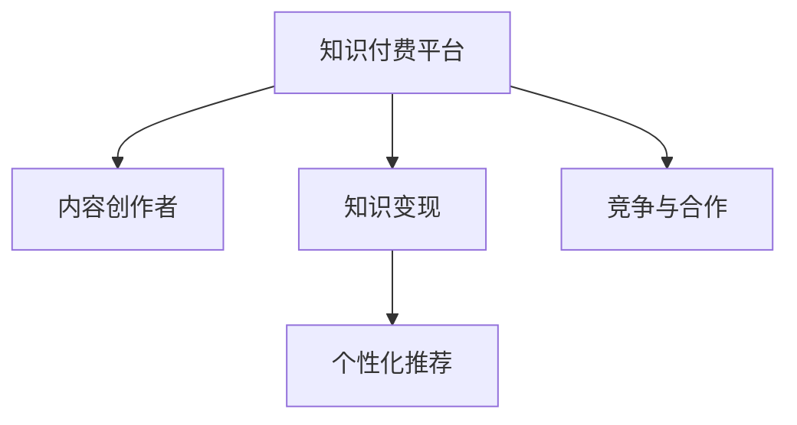

                 

# 知识经济时代下的知识付费创业机会与挑战

## 1. 背景介绍

### 1.1 问题由来
随着互联网和数字技术的发展，知识经济时代的到来为知识付费创业提供了前所未有的机遇。人们开始意识到，信息爆炸的时代，有价值的知识和智慧变得更加稀缺。与此同时，短视频、社交媒体等新兴媒介的崛起，也加剧了内容供需的不平衡。

在这一背景下，知识付费平台应运而生，成为了连接知识创作者和消费者的桥梁。通过平台化的模式，知识付费不仅实现了知识变现，也为知识传播提供了更广泛、更便捷的渠道。

### 1.2 问题核心关键点
知识付费创业的核心在于如何有效地汇聚优质内容，并通过高效的变现机制，满足用户对于知识的需求。具体而言，需要解决以下几个关键问题：
1. 优质内容的获取与生产。如何吸引有才华的创作者，并持续生产优质内容，是知识付费平台生存和发展的基础。
2. 有效的知识变现模式。如何构建合理的付费体系，保障内容创作者和平台的利益，吸引用户订阅和付费，是知识付费平台的核心竞争力。
3. 增强用户体验与满意度。如何通过个性化推荐、优质互动等手段，提升用户的使用体验和满意度，促进用户留存和复购。
4. 应对市场竞争与挑战。如何应对其他平台的竞争，如免费内容、广告收入等，在激烈的市场环境中保持竞争优势。

这些关键问题共同构成了知识付费创业的主要挑战，同时也提供了巨大的创业机会。

### 1.3 问题研究意义
知识付费创业的深入研究，不仅有助于创业公司把握市场机遇，提升竞争力，还为知识传播的商业化探索提供了新的思路和方法。通过对知识付费创业的全面分析，可以为后续的研究和实践提供有价值的参考，推动知识经济时代的进一步发展。

## 2. 核心概念与联系

### 2.1 核心概念概述

为更好地理解知识付费创业的关键要素和内在联系，本节将介绍几个密切相关的核心概念：

- **知识付费平台**：指通过平台化的方式，汇聚优质内容，实现知识变现，并为用户提供个性化服务的商业模型。
- **内容创作者**：指拥有专业知识、技能或经验，能够在平台上创作和发布有价值内容的人。
- **知识变现**：指通过商业化的方式，将知识或信息转化为经济收益的过程。
- **个性化推荐**：指根据用户的兴趣和行为数据，推荐符合其需求的内容，提升用户体验和满意度。
- **竞争与合作**：指知识付费平台在市场中的竞争与合作关系，包括与传统媒体、新兴平台的竞争，以及与其他知识付费平台的合作。

这些核心概念之间的逻辑关系可以通过以下Mermaid流程图来展示：



这个流程图展示了大语言模型的核心概念及其之间的关系：

1. 知识付费平台通过汇聚内容创作者，提供个性化推荐，实现知识变现。
2. 个性化推荐和知识变现是知识付费平台的主要营收手段。
3. 平台间通过竞争与合作，共同构建知识经济生态。

## 3. 核心算法原理 & 具体操作步骤
### 3.1 算法原理概述

知识付费创业的算法原理主要围绕用户行为数据的分析和处理，通过构建个性化推荐系统，实现知识变现和用户满意度的最大化。其核心思想是：利用用户的历史行为数据，预测其未来的行为和需求，并据此推荐合适的知识内容。

形式化地，假设用户集合为 $U=\{u_i\}_{i=1}^N$，内容集合为 $C=\{c_j\}_{j=1}^M$，每个用户在内容 $c_j$ 上的评分向量为 $R_{u_i c_j} \in [0,1]$。知识付费平台的推荐系统目标是最大化以下目标函数：

$$
\max_{P} \sum_{i,j} P_{i,j}R_{u_i c_j}
$$

其中 $P_{i,j}$ 为内容 $c_j$ 对用户 $u_i$ 的推荐概率，满足 $P_{i,j} \geq 0$，$\sum_{j} P_{i,j} = 1$。

该目标函数是最大化用户满意度的经典推荐系统目标，可以通过多种算法实现，如协同过滤、内容推荐、混合推荐等。

### 3.2 算法步骤详解

知识付费创业的推荐算法主要包括以下几个关键步骤：

**Step 1: 数据准备与预处理**
- 收集用户行为数据，包括访问记录、评分数据、购买记录等。
- 对数据进行清洗、去重、归一化等预处理，确保数据的质量和一致性。
- 构建用户-内容评分矩阵 $R$，矩阵中每个元素 $R_{u_i c_j}$ 表示用户 $u_i$ 对内容 $c_j$ 的评分。

**Step 2: 推荐模型训练**
- 根据评分矩阵 $R$，选择合适的推荐算法，如矩阵分解、协同过滤、深度学习模型等。
- 使用评分矩阵 $R$ 训练推荐模型，优化推荐概率 $P_{i,j}$。
- 通过交叉验证等方法，评估推荐模型的性能，调整模型参数。

**Step 3: 推荐系统部署**
- 将训练好的推荐模型部署到线上环境，实时计算推荐概率 $P_{i,j}$。
- 根据用户的实时行为数据，实时生成推荐列表，推送到用户界面。
- 使用A/B测试等方法，评估推荐系统的实际效果，持续优化。

**Step 4: 反馈机制构建**
- 收集用户的反馈数据，如浏览时长、点击率、购买率等。
- 根据反馈数据，实时调整推荐模型，提升推荐精度。
- 定期收集用户满意度调查数据，持续优化推荐系统。

### 3.3 算法优缺点

知识付费创业的推荐算法具有以下优点：
1. 个性化强。通过深度学习模型，能够准确捕捉用户的兴趣和行为，提供更符合预期的推荐。
2. 实时性高。推荐系统能够实时响应用户的行为变化，提供动态更新的推荐内容。
3. 可扩展性强。推荐算法通常采用分布式计算方式，能够应对大规模数据和高并发请求。

同时，该算法也存在以下局限性：
1. 数据需求高。推荐算法需要大量的用户行为数据，数据质量和多样性对于推荐效果至关重要。
2. 模型复杂度高。深度学习模型虽然效果好，但模型复杂度高，计算资源消耗较大。
3. 用户隐私问题。用户行为数据涉及隐私，如何保护用户隐私，是推荐系统面临的重要挑战。
4. 公平性问题。推荐系统可能出现“冷启动”现象，对新用户的推荐效果差，可能产生偏见。

尽管存在这些局限性，但就目前而言，推荐算法仍然是知识付费创业中最核心的技术手段。未来相关研究的重点在于如何进一步降低推荐算法对数据的依赖，提高推荐系统的可解释性和公平性，同时兼顾用户隐私保护。

### 3.4 算法应用领域

知识付费创业的推荐算法在知识付费平台上得到了广泛的应用，具体如下：

- 内容推荐：为用户推荐最符合其兴趣和需求的知识内容，提高用户满意度和留存率。
- 新用户推荐：为刚注册的新用户推荐优质内容，帮助其快速适应平台，提升用户体验。
- 广告推荐：基于用户行为数据，推荐适合的广告内容，提高广告转化率。
- 个性化推荐引擎：构建复杂推荐模型，提升推荐系统的精度和效果，满足高要求场景。

除了上述这些经典应用外，知识付费创业的推荐算法还被创新性地应用到更多场景中，如社交网络推荐、电商平台推荐等，为推荐系统的发展带来了新的突破。

## 4. 数学模型和公式 & 详细讲解  
### 4.1 数学模型构建

本节将使用数学语言对知识付费创业的推荐系统进行更加严格的刻画。

假设用户集合为 $U=\{u_i\}_{i=1}^N$，内容集合为 $C=\{c_j\}_{j=1}^M$，用户 $u_i$ 对内容 $c_j$ 的评分向量为 $R_{u_i c_j} \in [0,1]$。推荐系统需要构建一个推荐矩阵 $P$，使得 $P_{i,j}$ 表示内容 $c_j$ 对用户 $u_i$ 的推荐概率。

推荐系统的目标函数为：

$$
\max_{P} \sum_{i,j} P_{i,j}R_{u_i c_j}
$$

其中 $P_{i,j}$ 为内容 $c_j$ 对用户 $u_i$ 的推荐概率，满足 $P_{i,j} \geq 0$，$\sum_{j} P_{i,j} = 1$。

### 4.2 公式推导过程

为了求解推荐矩阵 $P$，我们通常采用矩阵分解的方法。假设 $R_{u_i c_j} = \sum_{k=1}^K \theta_{ik} \phi_{kj}$，其中 $\theta_{ik}$ 为用户 $u_i$ 在因子 $k$ 上的表示，$\phi_{kj}$ 为内容 $c_j$ 在因子 $k$ 上的表示。则推荐概率 $P_{i,j}$ 可以表示为：

$$
P_{i,j} = \frac{\exp(\sum_{k=1}^K \theta_{ik}\phi_{kj})}{\sum_{k=1}^K \exp(\sum_{k=1}^K \theta_{ik}\phi_{kj'})}
$$

将上式代入目标函数，得：

$$
\max_{\theta,\phi} \sum_{i,j} \frac{\exp(\sum_{k=1}^K \theta_{ik}\phi_{kj})}{\sum_{k=1}^K \exp(\sum_{k=1}^K \theta_{ik}\phi_{kj'})}R_{u_i c_j}
$$

通过最大化目标函数，可以求解出最优的因子 $\theta_{ik}$ 和 $\phi_{kj}$，进而得到推荐矩阵 $P$。

### 4.3 案例分析与讲解

以Google的PageRank算法为例，其核心思想是通过计算网页的权威度和相关度，来推荐网页的相关性。PageRank算法通过迭代计算，求解网页的权威度和相关度向量，最终得到每个网页对用户的重要程度。

PageRank算法的基本步骤包括：
1. 初始化网页的权威度 $p_i$ 和相关度 $c_j$。
2. 计算每个网页的相关度，即其他网页指向该网页的权重。
3. 根据网页的相关度，更新网页的权威度。
4. 迭代多次，直至收敛。

PageRank算法的核心在于，通过网页的权威度和相关度，计算网页之间的相关性，从而实现网页的推荐。

## 5. 项目实践：代码实例和详细解释说明
### 5.1 开发环境搭建

在进行推荐系统开发前，我们需要准备好开发环境。以下是使用Python进行TensorFlow开发的环境配置流程：

1. 安装Anaconda：从官网下载并安装Anaconda，用于创建独立的Python环境。

2. 创建并激活虚拟环境：
```bash
conda create -n tf-env python=3.8 
conda activate tf-env
```

3. 安装TensorFlow：根据CUDA版本，从官网获取对应的安装命令。例如：
```bash
conda install tensorflow -c tf
```

4. 安装相关库：
```bash
pip install numpy pandas sklearn scipy
```

完成上述步骤后，即可在`tf-env`环境中开始推荐系统开发。

### 5.2 源代码详细实现

这里我们以基于TensorFlow实现协同过滤推荐系统为例，给出推荐系统的PyTorch代码实现。

首先，定义协同过滤推荐系统的数据处理函数：

```python
import pandas as pd
import numpy as np

def process_data(file_path):
    data = pd.read_csv(file_path, sep=',', header=None, names=['user_id', 'item_id', 'rating'])
    return np.array(data)

# 处理数据
data = process_data('data.csv')
```

然后，定义协同过滤模型的参数和超参数：

```python
learning_rate = 0.01
num_factors = 20
num_epochs = 100
num_users, num_items = data.shape[0], data.shape[1]
```

接着，定义协同过滤模型的函数：

```python
import tensorflow as tf

def collaborative_filtering(data, learning_rate, num_factors, num_epochs):
    num_users, num_items = data.shape[0], data.shape[1]
    learning_rate = tf.Variable(learning_rate)
    P = tf.Variable(tf.random.normal([num_users, num_items]))
    Q = tf.Variable(tf.random.normal([num_items, num_factors]))
    R = tf.Variable(tf.random.normal([num_users, num_factors]))
    phi = tf.Variable(tf.random.normal([num_items, num_factors]))
    theta = tf.Variable(tf.random.normal([num_users, num_factors]))
    
    for epoch in range(num_epochs):
        for i in range(num_users):
            for j in range(num_items):
                P_grad = tf.zeros_like(P)
                Q_grad = tf.zeros_like(Q)
                R_grad = tf.zeros_like(R)
                phi_grad = tf.zeros_like(phi)
                theta_grad = tf.zeros_like(theta)
                for k in range(num_factors):
                    P_grad += tf.reduce_sum(data[i, :] * Q[j, k])
                    Q_grad += tf.reduce_sum(tf.matmul(data[:, j], theta[i, :]))
                    R_grad += tf.reduce_sum(data[i, :] * phi[j, :])
                    phi_grad += tf.reduce_sum(tf.matmul(data[:, j], R[i, :]))
                    theta_grad += tf.reduce_sum(tf.matmul(data[:, j], P[i, :]))
                
        with tf.GradientTape() as tape:
            loss = tf.reduce_mean(tf.reduce_sum(data * (tf.matmul(P, phi) * tf.matmul(Q, R) / (tf.matmul(tf.matmul(P, theta) * tf.matmul(Q, phi) + 1e-9)))
        
        gradients = tape.gradient(loss, [P, Q, R, phi, theta])
        optimizer.apply_gradients(zip(gradients, [P, Q, R, phi, theta]))
        
    return P.numpy(), Q.numpy(), R.numpy(), phi.numpy(), theta.numpy()

# 构建推荐矩阵
P, Q, R, phi, theta = collaborative_filtering(data, learning_rate, num_factors, num_epochs)
```

最后，定义推荐系统的测试和评估函数：

```python
from sklearn.metrics import mean_squared_error

def evaluate(P, Q, R, data):
    error = np.sum(np.abs(P @ Q - R))
    return error

# 评估推荐系统性能
error = evaluate(P, Q, R, data)
print(f"推荐系统性能误差为：{error}")
```

以上就是使用TensorFlow实现协同过滤推荐系统的完整代码实现。可以看到，得益于TensorFlow的强大封装，我们可以用相对简洁的代码完成推荐系统的开发。

### 5.3 代码解读与分析

让我们再详细解读一下关键代码的实现细节：

**process_data函数**：
- 读取数据集，将其转换为NumPy数组。

**collaborative_filtering函数**：
- 定义协同过滤模型的参数，包括用户、内容、因子等。
- 定义模型的梯度和优化器，通过迭代更新模型参数。
- 通过损失函数计算模型误差，通过反向传播更新模型参数。

**evaluate函数**：
- 计算推荐矩阵与实际评分矩阵的误差，评估推荐系统的性能。

**推荐系统测试**：
- 通过测试集数据，评估推荐系统的实际效果。

可以看出，TensorFlow提供的高效计算图机制，大大简化了推荐系统开发的复杂性，使开发者可以更多地关注算法设计和优化。

当然，工业级的系统实现还需考虑更多因素，如模型的保存和部署、超参数的自动搜索、多模型集成等。但核心的协同过滤范式基本与此类似。

## 6. 实际应用场景
### 6.1 智能客服系统

基于推荐系统的智能客服系统，可以为用户提供个性化的客户服务体验。通过收集用户的历史客服对话记录，为用户推荐最合适的客服方案，提高客服响应速度和用户满意度。

在技术实现上，可以收集企业内部的历史客服对话记录，将问题和最佳答复构建成监督数据，在此基础上对协同过滤推荐系统进行微调。推荐系统能够自动理解用户意图，匹配最合适的客服方案进行推荐，提升客服系统的智能化水平。

### 6.2 金融推荐系统

金融机构需要为用户推荐最合适的理财产品、投资组合等金融产品，提高用户的投资回报率。通过收集用户的投资历史、风险偏好、行为数据等，为用户推荐最符合其需求的金融产品，增强用户的粘性和忠诚度。

在技术实现上，可以通过协同过滤推荐系统，根据用户的投资历史、风险偏好等行为数据，为用户推荐最符合其需求的金融产品。推荐系统能够实时响应用户的投资需求，提高用户的投资体验和收益。

### 6.3 电子商务推荐系统

电子商务平台需要为用户推荐最合适的商品，提升用户的购买率和复购率。通过收集用户的历史浏览、购买、评价等行为数据，为用户推荐最符合其需求的商品，提高用户的购买体验和满意度。

在技术实现上，可以使用协同过滤推荐系统，根据用户的浏览历史、购买记录等行为数据，为用户推荐最符合其需求的商品。推荐系统能够实时更新推荐结果，提升用户的购物体验和复购率。

### 6.4 未来应用展望

随着推荐系统的不断发展，其在知识付费创业中的应用也将更加广泛。未来，推荐系统将融入更多技术手段，如深度学习、因果推理、多模态融合等，提升推荐系统的精度和效果，满足更多场景的需求。

在智慧医疗领域，推荐系统可应用于医学知识推荐、病人诊疗方案推荐等，为医生和病人提供更精准的医疗服务。

在智能教育领域，推荐系统可应用于课程推荐、学习路径规划等，为学生提供更个性化的学习体验。

在智慧城市治理中，推荐系统可应用于城市事件监测、智慧出行推荐等，提高城市管理的智能化水平。

此外，在企业生产、社会治理、文娱传媒等众多领域，推荐系统也将得到更广泛的应用，为社会带来更多便利和价值。

## 7. 工具和资源推荐
### 7.1 学习资源推荐

为了帮助开发者系统掌握推荐系统的理论基础和实践技巧，这里推荐一些优质的学习资源：

1. 《推荐系统基础》书籍：由王斌教授所著，全面介绍了推荐系统的发展历程、算法原理和实现方法。
2. 《Python推荐系统实战》书籍：由崔宇教授所著，提供了大量实战案例，涵盖协同过滤、深度学习等多种推荐算法。
3. 《TensorFlow推荐系统》教程：由TensorFlow官方提供，详细介绍了TensorFlow推荐系统的实现方法和应用场景。
4. Kaggle推荐系统竞赛：Kaggle平台提供的推荐系统竞赛，提供大量数据集和解决方案，帮助你了解推荐系统的实际应用。
5. DeepLearning.AI推荐系统课程：由Andrew Ng教授团队提供，涵盖推荐系统的基础知识和高级算法。

通过对这些资源的学习实践，相信你一定能够快速掌握推荐系统的精髓，并用于解决实际的推荐问题。
### 7.2 开发工具推荐

高效的开发离不开优秀的工具支持。以下是几款用于推荐系统开发的常用工具：

1. TensorFlow：由Google主导开发的开源深度学习框架，支持分布式计算和GPU加速，适合大规模推荐系统开发。
2. PyTorch：由Facebook主导开发的深度学习框架，易于使用，适合快速迭代研究。
3. Apache Spark：由Apache基金会提供的分布式计算框架，支持大规模数据处理和机器学习算法。
4. ELK Stack：用于日志收集、存储和分析的开源工具栈，适用于推荐系统的日志分析和优化。
5. Tableau：用于数据可视化的工具，便于分析和展示推荐系统的运行效果。

合理利用这些工具，可以显著提升推荐系统开发的效率，加快创新迭代的步伐。

### 7.3 相关论文推荐

推荐系统的发展源于学界的持续研究。以下是几篇奠基性的相关论文，推荐阅读：

1. "Collaborative Filtering for Implicit Feedback Datasets"（SUIF论文）：提出SUIF算法，利用隐式反馈数据进行协同过滤推荐。
2. "TrustRank: A Trust-Based Recommendation Algorithm"（TrustRank论文）：提出TrustRank算法，利用信任网络进行推荐。
3. "Deep Collaborative Filtering"（DeepCF论文）：提出DeepCF算法，利用深度学习进行协同过滤推荐。
4. "Frequent Pattern Mining Based Recommendation System"（FPM基于频繁模式推荐系统论文）：提出FPM算法，利用频繁模式进行推荐。
5. "Adaptive Trust Rank"（Adaptive Trust Rank论文）：提出Adaptive Trust Rank算法，利用多步预测进行推荐。

这些论文代表了大语言模型微调技术的发展脉络。通过学习这些前沿成果，可以帮助研究者把握学科前进方向，激发更多的创新灵感。

## 8. 总结：未来发展趋势与挑战

### 8.1 总结

本文对知识付费创业的推荐系统进行了全面系统的介绍。首先阐述了推荐系统在知识付费创业中的核心地位和应用场景，明确了推荐系统在提升用户满意度、优化推荐效果等方面的独特价值。其次，从原理到实践，详细讲解了协同过滤推荐系统的数学原理和关键步骤，给出了推荐系统开发的完整代码实例。同时，本文还广泛探讨了推荐系统在智能客服、金融推荐、电子商务等多个行业领域的应用前景，展示了推荐系统的巨大潜力。

通过本文的系统梳理，可以看到，基于协同过滤的推荐系统正在成为知识付费创业的重要范式，极大地拓展了知识付费平台的业务范围，提高了知识变现的效率。未来，伴随推荐算法的持续演进，基于推荐系统的内容付费服务必将在更多领域得到应用，为知识经济的繁荣提供新的动力。

### 8.2 未来发展趋势

展望未来，推荐系统的发展趋势主要体现在以下几个方面：

1. 个性化推荐系统的智能化程度将进一步提升。通过深度学习、因果推断等技术，推荐系统将能够更准确地捕捉用户行为和需求，提供更加个性化、精准的推荐服务。
2. 推荐系统将更多地融合多模态信息。除了文本信息，推荐系统还将结合图片、视频、语音等多模态数据，提升推荐效果。
3. 推荐系统的可解释性和可控性将进一步增强。通过引入符号化的规则、知识图谱等，推荐系统将具备更强的可解释性和可控性，提高用户对推荐结果的信任度。
4. 推荐系统的公平性和隐私保护将得到重视。推荐系统将更多地考虑用户的公平性需求，减少“冷启动”现象，同时加强用户隐私保护，构建更加公正、透明、安全的推荐环境。
5. 推荐系统的实时性和动态性将显著提升。通过分布式计算和增量学习技术，推荐系统将能够实时响应用户行为变化，动态调整推荐结果。

这些趋势凸显了推荐系统的广阔前景。这些方向的探索发展，必将进一步提升推荐系统的性能和应用范围，为知识经济时代的进一步发展提供新的动力。

### 8.3 面临的挑战

尽管推荐系统在知识付费创业中已经取得了显著的成果，但在迈向更加智能化、普适化应用的过程中，仍面临诸多挑战：

1. 数据质量和多样性问题。推荐系统需要大量的高质量数据，如何获取多样性、代表性强的数据，是推荐系统面临的主要挑战。
2. 模型复杂性和计算资源消耗。深度学习模型虽然效果好，但计算资源消耗较大，如何优化模型结构和计算效率，是推荐系统需要解决的问题。
3. 用户隐私和安全问题。用户行为数据涉及隐私，如何保护用户隐私，确保推荐系统的安全性，是推荐系统面临的重要挑战。
4. 公平性和偏见问题。推荐系统可能出现“冷启动”现象，对新用户的推荐效果差，可能产生偏见。
5. 系统稳定性和可靠性问题。推荐系统需要持续监控和优化，如何保证系统的稳定性和可靠性，是推荐系统需要解决的问题。

这些挑战需要研究者不断探索和优化，才能使推荐系统在未来知识付费创业中发挥更大的作用。

### 8.4 研究展望

面对推荐系统面临的种种挑战，未来的研究需要在以下几个方面寻求新的突破：

1. 探索无监督和半监督推荐方法。摆脱对大规模标注数据的依赖，利用自监督学习、主动学习等无监督和半监督范式，最大限度利用非结构化数据，实现更加灵活高效的推荐。
2. 研究参数高效和计算高效的推荐范式。开发更加参数高效的推荐方法，在固定大部分预训练参数的同时，只更新极少量的任务相关参数。同时优化推荐模型的计算图，减少前向传播和反向传播的资源消耗，实现更加轻量级、实时性的部署。
3. 融合因果和对比学习范式。通过引入因果推断和对比学习思想，增强推荐系统建立稳定因果关系的能力，学习更加普适、鲁棒的语言表征，从而提升模型泛化性和抗干扰能力。
4. 引入更多先验知识。将符号化的先验知识，如知识图谱、逻辑规则等，与神经网络模型进行巧妙融合，引导推荐过程学习更准确、合理的语言模型。同时加强不同模态数据的整合，实现视觉、语音等多模态信息与文本信息的协同建模。
5. 结合因果分析和博弈论工具。将因果分析方法引入推荐系统，识别出推荐决策的关键特征，增强输出解释的因果性和逻辑性。借助博弈论工具刻画人机交互过程，主动探索并规避推荐系统的脆弱点，提高系统稳定性。
6. 纳入伦理道德约束。在推荐系统训练目标中引入伦理导向的评估指标，过滤和惩罚有害的推荐内容，确保推荐系统的公正性和道德性。

这些研究方向的探索，必将引领推荐系统技术迈向更高的台阶，为知识付费创业提供更强大的技术支持。面向未来，推荐系统需要在多领域、多场景中发挥更大作用，推动知识付费技术的不断创新和发展。

