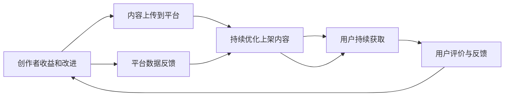

                 

# 知识经济时代下的知识付费创新商业模式运营

在知识经济时代，知识的价值日益凸显，人们对知识付费的接受度也显著提高。知识付费不仅为个人提供了一种便捷的学习途径，也为企业家和创作者开辟了新的商业模式。本文将从核心概念入手，详细探讨知识付费的原理与操作流程，分析其优缺点与应用领域，并通过案例分析与讲解，阐述未来发展趋势与面临的挑战。

## 1. 背景介绍

### 1.1 问题由来

随着互联网的普及和信息技术的进步，知识的获取变得更加便捷。然而，海量的免费内容也导致知识的筛选和获取成本不断增加，许多人无法有效获取有价值的信息。知识付费则解决了这一问题，通过付费获取优质内容，极大提升了知识获取的效率和质量。

### 1.2 问题核心关键点

知识付费的核心在于，通过市场机制筛选和提供高质量的知识内容，同时为创作者和平台带来稳定的收益，形成良性循环。其主要关键点包括：

- 高质量内容：知识付费平台需提供专业、系统、高效的知识内容，满足用户的多样化需求。
- 激励机制：通过合理的激励机制，保障内容创作者的积极性和持续性。
- 用户粘性：平台需提供丰富的社交互动功能，提高用户粘性。
- 商业模式：知识付费平台需要构建稳定的商业模式，以实现可持续发展。

## 2. 核心概念与联系

### 2.1 核心概念概述

为更好地理解知识付费的原理与操作流程，本节将介绍几个关键概念：

- 知识付费：通过付费方式获取高质量知识内容的一种模式。平台需筛选优质内容，保障内容质量，同时为创作者提供合理回报，形成良性循环。
- 知识平台：汇集和分发知识内容的平台，包括内容创作者、平台运营商和用户三方。平台需提供优质的内容体验和服务。
- 内容创作者：通过平台提供知识内容，包括文章、视频、课程等。创作者需保证内容的专业性和独特性。
- 用户：付费获取知识内容的群体，需根据自身需求选择合适的内容，并进行互动评价。
- 激励机制：包括付费模式、分成比例、推荐算法等，保障内容创作者的积极性和持续性。

这些核心概念共同构成了知识付费的基本框架，各方的互动和协同是其正常运行的基础。

### 2.2 核心概念原理和架构的 Mermaid 流程图(Mermaid 流程节点中不要有括号、逗号等特殊字符)



这个流程图展示了知识付费的基本流程：创作者将内容上传到平台，平台审核上架，用户付费获取，创作者根据用户评价与反馈获得收益并进行改进，平台根据数据反馈持续优化上架内容。

## 3. 核心算法原理 & 具体操作步骤

### 3.1 算法原理概述

知识付费的算法原理主要涉及内容筛选、推荐算法和定价模型。

#### 3.1.1 内容筛选

内容筛选是知识付费平台的核心功能之一，通过筛选优质内容，提升用户体验和满意度。主要算法包括：

- 用户反馈算法：通过用户的评价和反馈，筛选出受欢迎和高质量的内容。
- 专业评价算法：邀请专家对内容进行审核和评价，确保内容的准确性和专业性。

#### 3.1.2 推荐算法

推荐算法是提升用户满意度的关键，主要算法包括：

- 协同过滤算法：根据用户的兴趣和行为，推荐相关内容。
- 内容画像算法：构建用户和内容的画像，精准匹配用户和内容。

#### 3.1.3 定价模型

定价模型是知识付费商业模式的基础，主要算法包括：

- 价值评估模型：通过市场调研和用户反馈，评估内容的价值，制定合理的价格。
- 动态定价模型：根据市场变化和用户反馈，动态调整价格。

### 3.2 算法步骤详解

#### 3.2.1 内容上传与审核

- 创作者将内容上传到平台，包括文章、视频、课程等。
- 平台通过审核算法对内容进行初步筛选，剔除低质量内容。
- 邀请专家进行专业审核，确保内容的准确性和专业性。

#### 3.2.2 用户付费与获取

- 用户浏览内容，选择感兴趣的内容进行购买。
- 平台提供多种支付方式，确保用户的便利性。
- 用户获取内容，进行学习和使用。

#### 3.2.3 用户评价与反馈

- 用户在学习使用后，进行评价和反馈，指出内容的优点和不足。
- 平台根据用户反馈，调整和优化内容。

#### 3.2.4 创作者收益与改进

- 创作者根据用户评价和反馈，持续改进内容质量。
- 平台根据评价和反馈，向创作者提供收益分成。

#### 3.2.5 平台优化与扩展

- 平台根据数据反馈，持续优化内容筛选和推荐算法。
- 平台扩展新的内容和功能，满足用户的多样化需求。

### 3.3 算法优缺点

#### 3.3.1 优点

- 保障内容质量：通过专业审核和用户反馈，确保内容的专业性和质量。
- 提升用户满意度：通过精准推荐和互动评价，提升用户体验。
- 保障创作者收益：通过合理的分成比例和激励机制，保障创作者的积极性和持续性。

#### 3.3.2 缺点

- 内容筛选难度大：需要投入大量资源进行内容审核，筛选出优质内容。
- 用户粘性不足：部分用户可能付费后不再使用平台，降低用户留存率。
- 市场竞争激烈：众多知识付费平台竞争激烈，需不断创新才能保持优势。

### 3.4 算法应用领域

知识付费的应用领域广泛，包括但不限于：

- 在线教育：提供系统化、专业化的课程和资料，满足学习者的多样化需求。
- 职场培训：提供职业技能和业务知识的课程，帮助职业人士提升竞争力。
- 个人成长：提供自我提升、健康管理等方面的知识，满足个人成长需求。
- 企业培训：提供企业文化、管理知识等方面的课程，提升企业竞争力。
- 技术交流：提供技术教程、编程资料等，促进技术交流和创新。

## 4. 数学模型和公式 & 详细讲解 & 举例说明

### 4.1 数学模型构建

知识付费的数学模型主要涉及用户行为分析、内容评价和定价模型。

#### 4.1.1 用户行为分析模型

用户行为分析模型通过分析用户的行为和偏好，推荐相关内容。主要公式包括：

$$
P(u,i) = f(u,r_i,r_j,u_i,r_i,r_j)
$$

其中 $u$ 为用户，$i$ 为内容，$r_i$ 为内容评价，$r_j$ 为同类内容评价，$f$ 为函数，表示用户对内容的偏好。

#### 4.1.2 内容评价模型

内容评价模型通过专家和用户对内容的评价，筛选出优质内容。主要公式包括：

$$
S(i) = \alpha R_i + \beta C_i
$$

其中 $S(i)$ 为内容评分，$\alpha$ 和 $\beta$ 为权重，$R_i$ 为用户评价，$C_i$ 为专家评价。

#### 4.1.3 定价模型

定价模型通过评估内容的价值，制定合理的价格。主要公式包括：

$$
P(i) = C(i) \times \delta
$$

其中 $P(i)$ 为内容价格，$C(i)$ 为内容成本，$\delta$ 为利润率。

### 4.2 公式推导过程

#### 4.2.1 用户行为分析模型推导

用户行为分析模型的推导基于协同过滤算法，通过用户行为数据构建用户画像，并根据内容特征和用户画像进行推荐。具体推导过程如下：

1. 构建用户画像：通过用户行为数据，如浏览、点赞、评论等，构建用户画像 $U$。
2. 构建内容画像：通过内容特征和用户评价，构建内容画像 $I$。
3. 推荐计算：通过用户画像和内容画像，计算用户对内容的偏好 $P(u,i)$。

推导公式为：

$$
P(u,i) = \sum_{k=1}^{K} \alpha_k \times P_{ui} \times P_{ki}
$$

其中 $\alpha_k$ 为权重，$P_{ui}$ 为用户对内容的评分，$P_{ki}$ 为内容对用户的评分。

#### 4.2.2 内容评价模型推导

内容评价模型的推导基于专家和用户评价，通过加权平均法计算内容的综合评分。具体推导过程如下：

1. 用户评价：通过用户对内容的评分 $R_i$，构建用户评价向量 $R$。
2. 专家评价：通过专家对内容的评分 $C_i$，构建专家评价向量 $C$。
3. 内容评分：通过加权平均法，计算内容的综合评分 $S(i)$。

推导公式为：

$$
S(i) = \alpha R_i + \beta C_i
$$

其中 $\alpha$ 和 $\beta$ 为权重，根据专家和用户的权重进行分配。

#### 4.2.3 定价模型推导

定价模型的推导基于成本和利润率，通过成本和用户评价计算内容的价格。具体推导过程如下：

1. 内容成本：通过内容制作和审核成本，计算内容的成本 $C(i)$。
2. 用户评价：通过用户对内容的评价 $R_i$，计算内容的评分 $P(i)$。
3. 价格计算：通过成本和评分，计算内容的定价 $P(i)$。

推导公式为：

$$
P(i) = C(i) \times \delta
$$

其中 $\delta$ 为利润率，根据市场和成本进行确定。

### 4.3 案例分析与讲解

#### 4.3.1 在线教育平台

某在线教育平台通过知识付费模式，提供各类课程和资料。平台使用用户行为分析模型推荐内容，使用内容评价模型筛选优质内容，使用定价模型制定合理价格。具体推导过程如下：

1. 用户行为分析：平台通过分析用户的学习行为，如课程浏览、观看时长、评分等，构建用户画像 $U$。
2. 内容评价：平台通过专家审核和用户评分，构建内容画像 $I$。
3. 推荐计算：平台通过用户画像和内容画像，计算用户对课程的偏好 $P(u,i)$。
4. 内容筛选：平台通过内容评价模型，筛选出优质课程 $S(i)$。
5. 定价计算：平台通过成本和用户评价，计算课程价格 $P(i)$。

推导公式为：

$$
P(u,i) = \sum_{k=1}^{K} \alpha_k \times P_{ui} \times P_{ki}
$$

$$
S(i) = \alpha R_i + \beta C_i
$$

$$
P(i) = C(i) \times \delta
$$

通过以上推导，平台可以更好地推荐课程、筛选优质内容，并制定合理价格，提升用户满意度和平台收益。

## 5. 项目实践：代码实例和详细解释说明

### 5.1 开发环境搭建

在进行知识付费项目开发前，我们需要准备好开发环境。以下是使用Python进行Flask开发的环境配置流程：

1. 安装Anaconda：从官网下载并安装Anaconda，用于创建独立的Python环境。

2. 创建并激活虚拟环境：
```bash
conda create -n flask-env python=3.8 
conda activate flask-env
```

3. 安装Flask：
```bash
pip install Flask
```

4. 安装Flask-RESTful：
```bash
pip install Flask-RESTful
```

5. 安装SQLAlchemy：
```bash
pip install SQLAlchemy
```

6. 安装Flask-SQLAlchemy：
```bash
pip install Flask-SQLAlchemy
```

7. 安装Flask-Migrate：
```bash
pip install Flask-Migrate
```

8. 安装Jinja2：
```bash
pip install Jinja2
```

完成上述步骤后，即可在`flask-env`环境中开始知识付费项目开发。

### 5.2 源代码详细实现

下面我们以在线教育平台为例，给出使用Flask进行知识付费项目开发的代码实现。

首先，定义数据库模型和用户行为分析模型：

```python
from flask_sqlalchemy import SQLAlchemy
from flask_migrate import Migrate
from flask_restful import Resource, Api
from flask import request, jsonify

app = Flask(__name__)
app.config['SQLALCHEMY_DATABASE_URI'] = 'sqlite:///static/online_education.db'
app.config['SQLALCHEMY_TRACK_MODIFICATIONS'] = False

db = SQLAlchemy(app)
migrate = Migrate(app, db)

class User(db.Model):
    id = db.Column(db.Integer, primary_key=True)
    name = db.Column(db.String(50), unique=True)
    courses = db.relationship('Course', backref='users', lazy='dynamic')

class Course(db.Model):
    id = db.Column(db.Integer, primary_key=True)
    name = db.Column(db.String(50))
    description = db.Column(db.String(100))
    creator = db.Column(db.Integer, db.ForeignKey('user.id'))

class UserBehavior(db.Model):
    id = db.Column(db.Integer, primary_key=True)
    user_id = db.Column(db.Integer, db.ForeignKey('user.id'))
    course_id = db.Column(db.Integer, db.ForeignKey('course.id'))
    time = db.Column(db.DateTime)

class UserBehaviorAnalysis:
    def __init__(self, user, course):
        self.user = user
        self.course = course
        self.prefs = self.calculate_preferences()

    def calculate_preferences(self):
        prefs = []
        for userpref in self.user.userbehavior:
            prefs.append((userpref.course_id, userpref.time))
        return prefs
```

然后，定义API接口和推荐算法：

```python
class UserBehaviorAPI(Resource):
    def get(self, user_id):
        user = User.query.get(user_id)
        courses = Course.query.join(UserBehaviorAnalysis).filter(UserBehaviorAnalysis.user_id == user.id).all()
        return jsonify([{'id': course.id, 'name': course.name, 'description': course.description} for course in courses])

class CourseRecommendationAPI(Resource):
    def get(self, course_id):
        course = Course.query.get(course_id)
        for user in User.query:
            prefs = UserBehaviorAnalysis(user, course).prefs
            similarity = self.calculate_similarity(prefs, user.userbehavior)
            if similarity > 0.5:
                return jsonify({'user_id': user.id, 'name': user.name})
        return jsonify({'message': 'No recommendations'})

    def calculate_similarity(self, prefs1, prefs2):
        common = len(set(prefs1) & set(prefs2))
        return common / len(prefs1)
```

最后，定义运行入口：

```python
api = Api(app)
api.add_resource(UserBehaviorAPI, '/users/<int:user_id>')
api.add_resource(CourseRecommendationAPI, '/courses/<int:course_id>')

if __name__ == '__main__':
    app.run(debug=True)
```

通过以上代码，我们构建了一个简单的在线教育平台，实现了用户行为分析、课程推荐等功能。开发者可以根据实际需求，进一步完善平台功能，如用户登录、课程购买、评价反馈等。

### 5.3 代码解读与分析

让我们再详细解读一下关键代码的实现细节：

**User和Course模型**：
- `User`模型用于存储用户信息，包含用户名和购买课程。
- `Course`模型用于存储课程信息，包含课程名、描述和创建者。

**UserBehavior模型**：
- `UserBehavior`模型用于存储用户行为数据，包含用户ID、课程ID和时间戳。

**UserBehaviorAnalysis类**：
- 构造函数接收用户ID和课程ID，计算用户对课程的偏好。
- `calculate_preferences`方法根据用户行为数据，计算用户对课程的偏好。

**UserBehaviorAPI类**：
- 实现`get`方法，根据用户ID获取用户购买的所有课程。

**CourseRecommendationAPI类**：
- 实现`get`方法，根据课程ID获取课程推荐的用户列表。
- `calculate_similarity`方法计算两个用户行为数据之间的相似度。

**运行入口**：
- 创建API资源，并绑定到Flask应用。
- 启动应用，并进入调试模式。

这个代码实例展示了知识付费平台的基本功能和架构。开发者可以根据实际需求，添加更多的功能和优化算法，如课程评分、用户评价、搜索排序等。

## 6. 实际应用场景

### 6.1 智能医疗咨询

智能医疗咨询是知识付费的重要应用场景之一，通过在线医疗平台提供专业医疗知识，满足用户对健康咨询的需求。

具体而言，平台可以整合各类医学资源，包括专家解读、疾病科普、健康管理等内容。通过知识付费模式，用户可以获取系统化、专业化的医疗知识，提升自身健康管理水平。平台通过用户行为分析、内容评价等算法，推荐优质医疗知识，满足用户的多样化需求。

### 6.2 职业培训

职业培训是知识付费的另一重要应用场景，通过在线培训平台提供各类职业技能培训，帮助职业人士提升竞争力。

具体而言，平台可以提供各类职业技能课程，包括编程、设计、营销等。通过知识付费模式，用户可以获取系统化、专业化的职业技能培训，提升自身职业素养。平台通过用户行为分析、内容评价等算法，推荐优质课程，满足用户的多样化需求。

### 6.3 个人成长

个人成长是知识付费的另一重要应用场景，通过在线学习平台提供各类个人成长知识，满足用户对自我提升的需求。

具体而言，平台可以提供各类个人成长课程，包括心理健康、时间管理、财务管理等。通过知识付费模式，用户可以获取系统化、专业化的个人成长知识，提升自身生活质量。平台通过用户行为分析、内容评价等算法，推荐优质内容，满足用户的多样化需求。

## 7. 工具和资源推荐

### 7.1 学习资源推荐

为了帮助开发者系统掌握知识付费的原理与实践技巧，这里推荐一些优质的学习资源：

1. 《知识付费：从内容到变现》：深入浅出地介绍了知识付费的发展历程、商业模式和运营策略，提供了丰富的实践案例。

2. 《内容付费与知识付费模式分析》：对知识付费的模式进行了详细的分析，探讨了各方的收益和成本，提供了系统的知识框架。

3. 《知识付费平台设计与实现》：详细介绍了知识付费平台的设计思路、功能模块和开发流程，提供了实用的开发指南。

4. 《知识付费市场分析与趋势预测》：对知识付费市场进行了深入分析，探讨了市场规模、用户需求和竞争格局，提供了数据驱动的市场策略。

5. 《知识付费商业模式创新》：探讨了知识付费的创新商业模式，包括内容生产、平台运营和用户留存等方面的策略。

通过对这些资源的学习实践，相信你一定能够快速掌握知识付费的精髓，并用于解决实际的商业问题。

### 7.2 开发工具推荐

高效的开发离不开优秀的工具支持。以下是几款用于知识付费开发的常用工具：

1. Flask：基于Python的开源Web框架，灵活高效，适合快速迭代研究。

2. SQLAlchemy：Python的SQL工具包，提供ORM和SQL查询功能，方便数据库操作。

3. Flask-RESTful：基于Flask的RESTful API框架，提供简洁的API开发体验。

4. Jinja2：Python的模板引擎，提供灵活的模板渲染功能，方便页面开发。

5. Bootstrap：基于HTML/CSS的UI框架，提供丰富的UI组件和样式，方便页面布局和样式开发。

6. VS Code：开源的代码编辑器，支持多语言开发，提供丰富的插件和扩展。

合理利用这些工具，可以显著提升知识付费项目的开发效率，加快创新迭代的步伐。

### 7.3 相关论文推荐

知识付费技术的发展源于学界的持续研究。以下是几篇奠基性的相关论文，推荐阅读：

1. 《知识付费的市场规模与用户行为分析》：对知识付费市场进行了详细分析，探讨了用户行为特征和影响因素。

2. 《知识付费平台的推荐算法研究》：对知识付费平台的推荐算法进行了深入研究，探讨了协同过滤和内容画像等算法的应用。

3. 《知识付费平台的定价策略》：对知识付费平台的定价模型进行了详细分析，探讨了成本、收益和市场变化对定价的影响。

4. 《知识付费平台的用户留存策略》：对知识付费平台的用户留存策略进行了详细研究，探讨了用户行为分析和推荐算法的作用。

5. 《知识付费平台的创新商业模式》：对知识付费平台的创新商业模式进行了探讨，提出了多模态支付、订阅服务等内容付费形式。

这些论文代表了大语言模型微调技术的发展脉络。通过学习这些前沿成果，可以帮助研究者把握学科前进方向，激发更多的创新灵感。

## 8. 总结：未来发展趋势与挑战

### 8.1 研究成果总结

本文对知识付费的原理与实践进行了详细探讨。首先，介绍了知识付费的核心概念和应用场景，明确了知识付费在知识经济时代的重要价值。其次，从原理到实践，详细讲解了知识付费的算法原理和具体操作步骤，提供了系统化的开发指南。最后，分析了知识付费的未来发展趋势和面临的挑战，提出了未来的研究方向。

通过本文的系统梳理，可以看到，知识付费在知识经济时代具有广阔的市场前景和发展潜力。其核心的算法原理和操作步骤，为开发者提供了全面的技术指引。

### 8.2 未来发展趋势

展望未来，知识付费将呈现以下几个发展趋势：

1. 个性化推荐：通过更加精确的用户画像和推荐算法，提升用户满意度和平台收益。

2. 内容多样化：平台将提供更多元化的内容形式，如视频、音频、直播等，满足用户的多样化需求。

3. 多模态交互：平台将引入多种交互形式，如语音、视频等，提升用户体验和平台粘性。

4. 内容增值服务：平台将提供更多的增值服务，如专业咨询、课程答疑等，增强用户的粘性和满意度。

5. 数据驱动运营：平台将更加注重数据驱动的运营策略，通过数据挖掘和分析，提升运营效率和效果。

### 8.3 面临的挑战

尽管知识付费技术已经取得了瞩目成就，但在迈向更加智能化、普适化应用的过程中，它仍面临着诸多挑战：

1. 内容质量控制：需要投入大量资源进行内容审核，保证内容的专业性和质量。

2. 用户粘性不足：部分用户可能付费后不再使用平台，降低用户留存率。

3. 市场竞争激烈：众多知识付费平台竞争激烈，需不断创新才能保持优势。

4. 知识付费平台的商业模式尚未完全成熟，需要更多的探索和实践。

### 8.4 研究展望

面对知识付费面临的挑战，未来的研究需要在以下几个方面寻求新的突破：

1. 探索无监督和半监督知识付费模式。摆脱对大规模标注数据的依赖，利用自监督学习、主动学习等无监督和半监督范式，最大限度利用非结构化数据，实现更加灵活高效的知识付费。

2. 研究知识付费平台的推荐算法和定价模型。开发更加精确的推荐算法和定价模型，提升用户满意度和平台收益。

3. 引入更多先验知识和多模态信息。将符号化的先验知识，如知识图谱、逻辑规则等，与神经网络模型进行巧妙融合，引导知识付费过程学习更准确、合理的知识表征。

4. 结合因果分析和博弈论工具。将因果分析方法引入知识付费平台，识别出用户决策的关键特征，增强知识付费的因果性和逻辑性。借助博弈论工具刻画人机交互过程，主动探索并规避知识付费平台的脆弱点，提高系统稳定性。

5. 纳入伦理道德约束。在知识付费平台的决策过程中，引入伦理导向的评估指标，过滤和惩罚有偏见、有害的输出倾向。加强人工干预和审核，建立知识付费平台的监管机制，确保输出的安全性。

这些研究方向将为知识付费平台带来新的突破，为知识经济时代提供更加智能化、普适化的服务。

## 9. 附录：常见问题与解答

**Q1：知识付费平台如何保证内容质量？**

A: 知识付费平台通过以下方式保证内容质量：
1. 内容筛选：平台设有严格的审核机制，通过专家审核和用户反馈筛选优质内容。
2. 内容评价：平台引入专家评价和用户评价，对内容进行综合评分，确保内容的专业性和准确性。
3. 推荐算法：平台通过协同过滤和内容画像算法，精准推荐优质内容。
4. 用户反馈：平台提供用户反馈机制，用户可对内容进行评价和反馈，平台根据反馈优化内容。

**Q2：知识付费平台如何提升用户留存率？**

A: 知识付费平台通过以下方式提升用户留存率：
1. 内容多样化：平台提供更多元化的内容形式，如视频、音频、直播等，满足用户的多样化需求。
2. 互动功能：平台提供丰富的社交互动功能，如评论、点赞、分享等，增强用户粘性。
3. 个性化推荐：平台通过精准的推荐算法，推荐用户感兴趣的内容。
4. 用户激励：平台提供奖励机制，如积分、优惠券等，激励用户持续使用平台。
5. 持续优化：平台根据用户反馈和行为数据，持续优化平台功能和内容，提升用户满意度和粘性。

**Q3：知识付费平台如何应对市场竞争？**

A: 知识付费平台通过以下方式应对市场竞争：
1. 内容创新：平台不断推出优质、原创的内容，满足用户需求。
2. 用户激励：平台提供多样化的激励机制，如积分、优惠券等，增强用户粘性。
3. 技术创新：平台引入先进的技术手段，如大数据分析、人工智能等，提升运营效率和效果。
4. 合作共赢：平台与其他知识平台和机构合作，共同推广知识付费。
5. 品牌建设：平台注重品牌建设，提升品牌知名度和用户信任度。

**Q4：知识付费平台的商业模式是否可持续？**

A: 知识付费平台的商业模式是可持续的，主要基于以下三点：
1. 专业内容：平台提供专业、系统、高效的内容，满足用户的多样化需求。
2. 用户粘性：平台提供丰富的社交互动功能，增强用户粘性，降低流失率。
3. 精准推荐：平台通过精准的推荐算法，提升用户满意度和留存率，实现稳定的收益。

**Q5：知识付费平台如何应对市场变化？**

A: 知识付费平台通过以下方式应对市场变化：
1. 数据驱动：平台注重数据驱动的运营策略，通过数据挖掘和分析，及时调整和优化策略。
2. 用户反馈：平台提供用户反馈机制，及时了解用户需求和市场变化，做出调整。
3. 内容优化：平台根据市场变化，优化内容生产和推荐算法，满足用户需求。
4. 持续创新：平台不断推出新的内容和功能，保持市场竞争力。

通过以上常见问题的解答，可以帮助开发者更好地理解知识付费平台的核心运营策略，提升平台的用户满意度和收益。

---

作者：禅与计算机程序设计艺术 / Zen and the Art of Computer Programming

