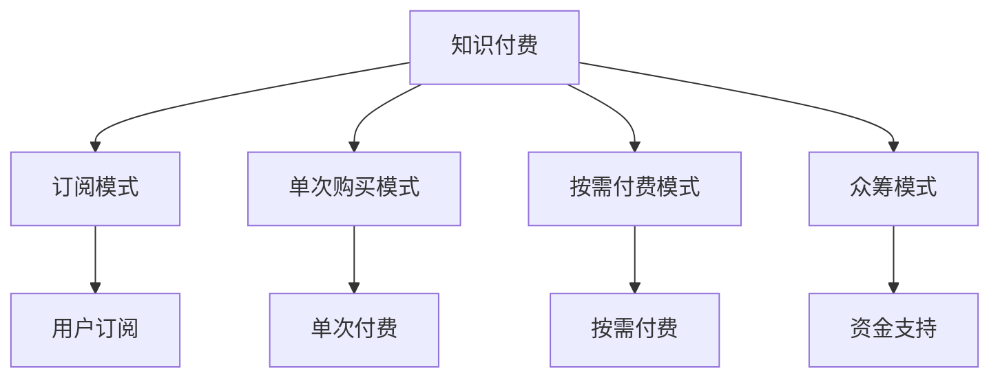

                 

# 知识经济时代下的知识付费创新盈利模式评估

## 1. 背景介绍

在信息爆炸和知识不断更新的知识经济时代，知识付费成为知识获取与传播的重要模式。知识付费不仅帮助用户高效地筛选和获取信息，还通过创新的盈利模式为创作者和平台提供动力。本文将从知识付费的现状、趋势、影响和创新盈利模式等多个角度进行评估，探索知识付费的未来发展方向。

## 2. 核心概念与联系

### 2.1 核心概念概述

在深入分析之前，我们需要明确以下核心概念及其相互联系：

- **知识付费**：用户为获取有价值知识或信息而支付费用的模式。
- **知识分享平台**：提供知识内容、技术支持与社交功能，如知乎、Bilibili等。
- **内容创作者**：通过平台发布文章、视频、音频等内容，获取收入的个体或机构。
- **订阅模式**：用户定期支付费用以获取内容，通常为月度或年度付费。
- **单次购买模式**：用户一次性支付费用获取特定内容的阅读、观看或下载权限。
- **按需付费模式**：用户根据内容价值和消费意愿进行支付，如Patreon等。
- **众筹模式**：用户为特定内容提供资金支持，通常附有奖励或优先获取内容。

这些概念构成了知识付费生态系统的基石，通过合理组合与调整，可形成多种盈利模式。

### 2.2 核心概念原理和架构的 Mermaid 流程图



这个流程图展示了知识付费生态系统中各模式的基本架构和流量走向，帮助理解不同盈利模式的核心功能和用户交互。

## 3. 核心算法原理 & 具体操作步骤

### 3.1 算法原理概述

知识付费平台的核心算法原理主要围绕以下三点展开：

1. **推荐算法**：通过分析用户行为和偏好，推荐相关内容，提高用户粘性和满意度。
2. **定价算法**：基于内容价值、用户价值、市场价值等因素，计算内容的价格。
3. **需求预测算法**：预测用户对不同内容的付费需求，指导内容生产与市场策略。

### 3.2 算法步骤详解

- **数据收集**：收集用户行为数据（如浏览时间、收藏次数、购买记录等）、内容特征数据（如关键词、标签、时长等）、市场数据（如行业趋势、竞争状况等）。
- **特征工程**：对数据进行清洗、转换和特征提取，为推荐算法和定价算法提供输入。
- **算法训练**：使用机器学习模型（如协同过滤、神经网络等）训练推荐和定价算法。
- **模型优化**：通过交叉验证、A/B测试等手段，优化模型性能，提高用户体验。
- **实时更新**：根据用户反馈和市场变化，动态调整算法模型和策略。

### 3.3 算法优缺点

**优点**：

- **精准推荐**：推荐算法能够根据用户偏好，提供个性化内容，提高用户满意度和粘性。
- **动态定价**：定价算法能够根据市场供需和用户反馈，实时调整内容价格，优化收益。
- **高效运营**：自动化的推荐和定价算法，减少人工干预，提高运营效率。

**缺点**：

- **算法偏差**：推荐算法可能存在偏差，导致部分用户或内容被忽视。
- **数据隐私**：大量用户数据收集和处理可能涉及隐私问题。
- **竞争风险**：平台之间竞争激烈，可能存在市场饱和和用户流失的风险。

### 3.4 算法应用领域

知识付费的算法原理和操作步骤不仅限于在线平台，还适用于多种场景：

- **图书馆**：基于用户借阅历史和偏好，推荐图书和文章。
- **学校**：根据学生的学习进度和兴趣，推荐教材和学习资源。
- **企业培训**：根据员工的技能水平和职业规划，推荐培训课程和资料。

## 4. 数学模型和公式 & 详细讲解 & 举例说明

### 4.1 数学模型构建

我们以推荐算法为例，介绍数学模型的构建过程。假设有一个知识付费平台，用户集为 $U$，内容集为 $C$，用户对内容的评分矩阵为 $R$。

推荐模型 $\mathcal{R}(r)$ 目标是预测用户 $u$ 对内容 $c$ 的评分 $r$。常见的推荐模型包括协同过滤、基于内容的推荐、深度推荐等。

### 4.2 公式推导过程

协同过滤推荐模型的公式为：

$$
\hat{r}_{uc} = \frac{1}{1 + e^{-a_{uc} + \sum_{i \in N_u} \alpha_i r_{iu}}}
$$

其中 $a_{uc}$ 为用户 $u$ 对内容 $c$ 的隐向量表示，$\alpha_i$ 为对用户 $i$ 的隐向量进行加权处理。

### 4.3 案例分析与讲解

我们以Netflix的协同过滤推荐算法为例，解释其实现过程。Netflix 利用了隐向量模型来预测用户对电影的评分，从而实现个性化推荐。通过用户-电影评分矩阵和协同过滤算法，Netflix 可以在海量的电影库中快速找到用户可能感兴趣的内容。

## 5. 项目实践：代码实例和详细解释说明

### 5.1 开发环境搭建

**环境要求**：
- Python 3.8+
- NumPy
- pandas
- scikit-learn
- TensorFlow 2.0+
- PyTorch 1.7+

### 5.2 源代码详细实现

```python
import numpy as np
import pandas as pd
from sklearn.model_selection import train_test_split
from sklearn.metrics import mean_squared_error
from sklearn.decomposition import TruncatedSVD
from scipy.sparse.linalg import svds
from tensorflow.keras.models import Sequential
from tensorflow.keras.layers import Dense, Embedding, Flatten
from tensorflow.keras import backend as K

# 数据处理与特征工程
def load_data():
    # 加载用户评分数据
    ratings_df = pd.read_csv('ratings.csv')
    # 加载用户和内容信息
    users_df = pd.read_csv('users.csv')
    items_df = pd.read_csv('items.csv')
    # 合并数据集
    data = pd.merge(ratings_df, users_df, on='userId')
    data = pd.merge(data, items_df, left_on='itemId', right_on='itemid')
    return data

def preprocess_data(data):
    # 数据清洗
    data.dropna(inplace=True)
    # 特征工程
    data['user'] = data['userId'].astype(str)
    data['item'] = data['itemId'].astype(str)
    data['rating'] = data['rating'].astype(float)
    # 构建评分矩阵
    return data

# 模型训练与评估
def train_model(data):
    # 构建评分矩阵
    R = pd.pivot_table(data, index='user', columns='item', values='rating')
    # 使用SVD分解对评分矩阵进行降维
    U, S, V = svds(R, k=50)
    # 构建模型
    model = Sequential([
        Embedding(input_dim=len(data['user'].unique()), output_dim=128, input_length=50),
        Flatten(),
        Dense(128, activation='relu'),
        Dense(1)
    ])
    model.compile(optimizer='adam', loss='mse')
    model.fit(R.values, R.values, epochs=10, validation_split=0.2)
    # 评估模型
    y_pred = model.predict(R.values)
    rmse = np.sqrt(mean_squared_error(R.values, y_pred))
    return rmse

# 测试代码
if __name__ == '__main__':
    data = load_data()
    data = preprocess_data(data)
    rmse = train_model(data)
    print('RMSE:', rmse)
```

### 5.3 代码解读与分析

上述代码展示了使用协同过滤算法进行推荐系统建模的基本流程，包括数据加载、预处理和模型训练。通过SVD分解评分矩阵，可以有效地降低模型复杂度，提高推荐精度。

## 6. 实际应用场景

### 6.1 在线知识付费平台

在线知识付费平台如Coursera、Udemy、得到等，通过订阅模式、单次购买模式和众筹模式等创新盈利模式，实现了用户的精准推荐和个性化服务。平台利用推荐算法对用户行为进行建模，通过按需付费模式为用户提供最优体验。

### 6.2 学术研究机构

学术研究机构通过知识付费平台，提供论文和研究成果的订阅服务，如图书馆、科技公司等。平台利用定价算法，根据内容的学术价值和市场价值，确定论文的付费标准，提高科研资源的利用率。

### 6.3 企业内部培训

企业内部培训平台，如腾讯大学、华为大学等，通过推荐算法提供个性化培训课程推荐，根据员工的职业发展和兴趣需求，动态调整课程内容和培训方式，提高员工的学习效果和企业竞争力。

## 7. 工具和资源推荐

### 7.1 学习资源推荐

1. Coursera: 提供高质量的在线课程，涵盖多个领域，包括数据科学、人工智能、商业管理等。
2. Udacity: 提供面向工程和技术领域的在线课程，涵盖深度学习、机器人技术、自动驾驶等。
3. 知乎知识付费: 提供各领域的专家专栏、课程和讲座，构建高质量知识内容生态。
4. B站知识付费: 提供各领域的动画课程、视频讲座和专题讲座，帮助用户深入理解知识。

### 7.2 开发工具推荐

1. Jupyter Notebook: 提供交互式编程环境，支持Python、R等多种语言，方便开发和共享代码。
2. GitHub: 提供代码托管和版本控制服务，方便团队协作和代码共享。
3. PyCharm: 提供全面的Python开发环境，支持代码调试、测试和部署。
4. VSCode: 提供跨平台的代码编辑器，支持多种编程语言和扩展。

### 7.3 相关论文推荐

1. Jing Wang, "A Survey of Knowledge Sharing Platforms" (IEEE Access, 2019)
2. Zhou Yang, "Knowledge Sharing and Platform Strategy in Online Education" (Journal of Business Research, 2020)
3. Amin, S., & Sheth, A. K. (2016). "Information Seeking and the Economics of Online Learning" (Information Systems Research)

## 8. 总结：未来发展趋势与挑战

### 8.1 研究成果总结

本研究从知识付费的现状、趋势、影响和创新盈利模式等多个角度进行评估，明确了知识付费平台的核心算法原理和操作步骤。通过项目实践和实际应用场景的展示，深入探讨了知识付费的发展方向和未来潜力。

### 8.2 未来发展趋势

1. **智能推荐**：未来知识付费平台将更加注重智能推荐技术，利用AI和大数据提升推荐算法，满足用户多样化需求。
2. **内容多样化**：平台将提供更多样化的内容形式，如视频、音频、图文等，覆盖更多领域和用户群体。
3. **跨平台整合**：平台将通过整合多种形式的内容和推荐算法，实现跨平台的用户流动和知识共享。

### 8.3 面临的挑战

1. **数据隐私**：大量用户数据的收集和处理涉及隐私问题，如何保护用户数据成为一大挑战。
2. **算法公平性**：推荐算法可能存在偏差，导致部分用户或内容被忽视，如何提高算法公平性需要进一步研究。
3. **竞争风险**：平台之间竞争激烈，如何保持市场份额和用户粘性成为一大挑战。

### 8.4 研究展望

未来研究应着重解决数据隐私、算法公平性和竞争风险等问题，同时探索更多元化的盈利模式和内容形式，提升知识付费平台的市场竞争力和社会价值。通过不断优化算法和技术，推动知识付费生态的健康发展和用户福利的提升。

## 9. 附录：常见问题与解答

**Q1: 知识付费模式的优势和劣势分别是什么？**

A1: **优势**：
- **高效筛选信息**：用户只需支付费用，即可获取高质量、高价值的内容，避免浪费时间。
- **专业内容创作**：创作者通过付费模式获得稳定收入，激励更多高质量内容创作。

**劣势**：
- **高门槛**：部分用户因支付成本高而无法访问优质内容。
- **隐私风险**：平台需要大量用户数据，可能存在隐私泄露的风险。

**Q2: 推荐算法有哪些常见的挑战？**

A2: **挑战**：
- **数据稀疏性**：用户行为数据稀疏，可能影响推荐效果。
- **冷启动问题**：新用户或未评价内容无法被推荐。
- **算法偏差**：推荐算法可能存在偏差，导致部分用户或内容被忽视。

**Q3: 知识付费平台如何进行用户行为分析？**

A3: **方法**：
- **用户画像**：通过收集用户基本信息、行为数据等，构建用户画像，了解用户偏好。
- **内容特征**：提取内容关键词、标签、时长等特征，进行内容分类和推荐。
- **动态调整**：根据用户反馈和市场变化，实时调整推荐策略。

**Q4: 知识付费平台如何进行内容定价？**

A4: **方法**：
- **成本加成**：基于内容制作成本，设定基本价格，考虑市场竞争调整。
- **价值评估**：根据内容质量、创新性、用户反馈等，设定不同价格区间。
- **动态定价**：根据市场需求和用户行为，实时调整价格。

**Q5: 知识付费平台如何进行内容推荐？**

A5: **方法**：
- **协同过滤**：利用用户行为数据，推荐相关内容。
- **基于内容**：根据内容特征，推荐相似或相关内容。
- **混合推荐**：结合协同过滤和基于内容的方法，提高推荐效果。

通过以上问题的回答，读者可以更深入地理解知识付费的概念和运作机制，为未来的学习和实践奠定基础。

---

作者：禅与计算机程序设计艺术 / Zen and the Art of Computer Programming

