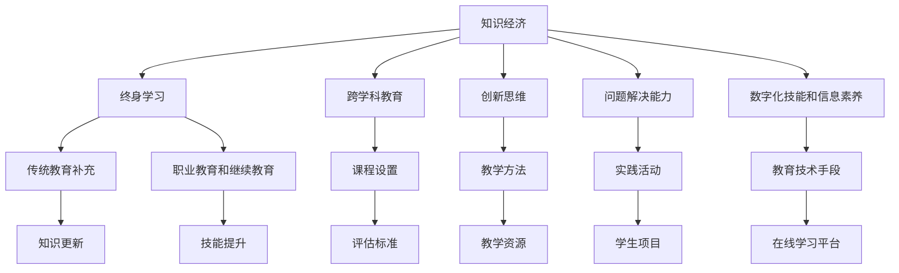

                 

# 知识经济时代的人才培养

## 1. 背景介绍

### 1.1 问题由来
随着科技的飞速发展和全球化的推进，知识经济成为当今时代最显著的特点之一。在知识经济时代，信息爆炸和知识更新速度极快，对人才的需求不再仅仅限于传统意义上的学术或专业能力，更注重创新思维、跨学科融合和问题解决能力。传统的人才培养模式在满足当前经济社会发展需求上显得捉襟见肘，亟需进行变革和创新。

### 1.2 问题核心关键点
本节的目的是为了探讨知识经济时代下，如何通过高效、多元、综合的人才培养体系，培养出符合知识经济时代要求的人才。本文将着重从以下几个方面进行阐述：

1. **高等教育体系变革**：探讨高等教育在知识经济时代应如何调整其课程设置、教学方法和评估标准，以适应新的需求。
2. **职业教育和继续教育**：分析职业教育和继续教育在提升劳动力技能和促进终身学习方面的作用。
3. **跨学科融合教育**：探讨如何将不同学科的知识和技能融合到人才培养中，以适应复杂问题解决的需求。
4. **创新思维和问题解决能力的培养**：分析如何通过课程设计、实践活动和创新文化培养学生的创新思维和问题解决能力。
5. **数字化技能和信息素养**：探讨在知识经济时代，数字化技能和信息素养在教育中的重要性，以及如何通过教育技术手段提升这些能力。

## 2. 核心概念与联系

### 2.1 核心概念概述

为更好地理解知识经济时代的人才培养，本节将介绍几个密切相关的核心概念：

- **知识经济**：以知识为基础，创新为驱动力的经济形态。知识经济时代，知识与创新成为驱动经济发展的核心要素。
- **终身学习**：强调学习过程的持续性和灵活性，不仅仅限于学校教育阶段，而是贯穿个人职业生涯的始终。
- **跨学科教育**：融合不同学科的知识和方法，培养具有综合能力的创新型人才。
- **创新思维**：强调创造性解决问题、批判性思考和逻辑推理等能力。
- **问题解决能力**：指将理论知识应用于实际问题解决的能力，包括分析问题、制定解决方案和实施方案等。
- **数字化技能和信息素养**：在数字时代下，获取、评估、管理、使用信息的能力，以及掌握基本数字工具和技术的能力。

这些核心概念之间存在密切联系，共同构成了知识经济时代人才培养的基本框架。通过理解这些概念，我们可以更好地把握知识经济时代的人才需求，设计更加科学、有效的人才培养体系。

### 2.2 核心概念原理和架构的 Mermaid 流程图



这个流程图展示了核心概念之间的联系：

1. 知识经济对传统教育体系提出了挑战，促使终身学习成为新常态。
2. 跨学科教育与创新思维、问题解决能力密切相关，是培养全面人才的重要途径。
3. 数字化技能和信息素养在终身学习和跨学科教育中起到支撑作用。
4. 传统教育与职业教育和继续教育相互补充，形成完整的教育体系。
5. 课程设置、教学方法、评估标准、教学资源和学生项目等，都是支撑整个教育体系的关键要素。

## 3. 核心算法原理 & 具体操作步骤

### 3.1 算法原理概述

知识经济时代的人才培养，是一个多维度、多层次的复杂过程。为了更好地理解和指导这一过程，我们可以将其简化为以下几个核心步骤：

1. **需求分析**：明确知识经济时代对人才的需求。
2. **目标设定**：根据需求分析结果，设定人才培养的目标。
3. **课程设计**：基于目标设定，设计适合的知识和技能课程。
4. **教学实施**：通过灵活的教学方法，实施课程设计。
5. **评估反馈**：持续评估和反馈，优化课程设计和教学方法。
6. **持续改进**：基于评估反馈结果，不断优化和改进课程设计和教学方法。

### 3.2 算法步骤详解

以下将详细讲解知识经济时代人才培养的算法步骤：

**Step 1: 需求分析**

需求分析是人才培养的第一步，通过多渠道收集和分析数据，明确知识经济时代对人才的需求。具体步骤包括：

1. 行业调研：通过问卷调查、访谈等方式，了解各行业对人才的需求特点。
2. 数据分析：收集公开数据，如行业报告、就业市场数据等，分析人才需求趋势。
3. 专家咨询：邀请行业专家、教育专家等，对需求分析结果进行评审和修正。
4. 整合总结：综合各方意见，形成系统化的人才需求报告。

**Step 2: 目标设定**

目标设定应基于需求分析结果，设定清晰、具体、可实现的人才培养目标。具体步骤包括：

1. 确定目标方向：明确人才培养方向，如技术、管理、设计等。
2. 设定能力指标：根据需求分析结果，设定关键能力指标，如创新能力、跨学科能力、沟通能力等。
3. 设定技能指标：根据需求分析结果，设定关键技能指标，如编程技能、数据分析技能、项目管理技能等。
4. 制定时间表：根据培养周期和目标，制定详细的培养时间表。

**Step 3: 课程设计**

课程设计是人才培养的核心环节，应根据目标设定，设计适合的知识和技能课程。具体步骤包括：

1. 模块划分：根据目标设定，将课程内容划分为若干模块，如基础课程、核心课程、选修课程等。
2. 内容选择：选择符合目标设定的课程内容和教材。
3. 方法设计：选择适合的教学方法和教学资源。
4. 时间安排：根据培养时间表，安排课程内容和教学时间。

**Step 4: 教学实施**

教学实施是人才培养的具体执行环节，应通过灵活的教学方法，实施课程设计。具体步骤包括：

1. 课堂教学：采用传统课堂教学方法，传授基础知识和技能。
2. 项目实践：通过项目实践，提升学生的问题解决能力和创新思维。
3. 在线学习：利用在线学习平台，提供自主学习资源。
4. 跨学科合作：促进不同学科之间的合作和交流，培养跨学科能力。

**Step 5: 评估反馈**

评估反馈是人才培养的关键环节，应持续评估和反馈，优化课程设计和教学方法。具体步骤包括：

1. 制定评估标准：根据目标设定，制定评估标准。
2. 实施评估过程：通过考试、项目评审、自我评估等方式，实施评估过程。
3. 收集反馈意见：收集学生、教师、行业专家的反馈意见。
4. 分析反馈结果：对反馈意见进行分析，找出问题和改进点。

**Step 6: 持续改进**

持续改进是人才培养的持续优化环节，应基于评估反馈结果，不断优化和改进课程设计和教学方法。具体步骤包括：

1. 定期评审：定期对课程设计和教学方法进行评审。
2. 改进措施：根据评审结果，制定改进措施。
3. 试行测试：小范围试行改进措施，收集反馈意见。
4. 全面推广：根据反馈意见，全面推广改进措施。

### 3.3 算法优缺点

知识经济时代的人才培养算法具有以下优点：

1. **系统性**：通过需求分析、目标设定、课程设计、教学实施、评估反馈和持续改进等多个步骤，形成系统化的人才培养体系。
2. **灵活性**：通过灵活的教学方法、在线学习和跨学科合作，适应知识经济时代的变化。
3. **高效性**：通过科学的目标设定和课程设计，提高人才培养的效率和质量。
4. **可扩展性**：通过评估反馈和持续改进，不断优化和改进课程设计和教学方法。

同时，该算法也存在一定的局限性：

1. **实施难度**：需求分析、目标设定和课程设计需要大量的时间和资源，实施难度较大。
2. **反馈复杂性**：评估反馈涉及多方面的数据和意见，处理起来较为复杂。
3. **成本投入**：在线学习平台和跨学科合作需要较大的成本投入，短期内难以全面实现。
4. **效果评估**：人才培养的效果评估较为复杂，难以通过简单的评估标准进行全面衡量。

尽管存在这些局限性，但就目前而言，基于需求分析、目标设定、课程设计、教学实施、评估反馈和持续改进的多步骤人才培养算法，仍是大规模、高效、系统的有效手段。未来相关研究的重点在于如何进一步降低实施难度、提高评估反馈的准确性和可扩展性。

### 3.4 算法应用领域

知识经济时代的人才培养算法已经在教育领域得到了广泛的应用，覆盖了从基础教育到高等教育、职业教育和继续教育的各个层次。具体应用包括：

- **基础教育**：通过科学的需求分析和目标设定，优化中小学的课程设计和教学方法。
- **高等教育**：通过跨学科教育、创新思维和问题解决能力的培养，提升大学的教育质量和学术水平。
- **职业教育和继续教育**：通过灵活的课程设计和教学方法，提升劳动力的技能和职业素质。
- **在线教育**：通过在线学习平台和数字化技能培养，实现终身学习。

除了上述这些经典应用外，知识经济时代的人才培养算法还被创新性地应用到更多场景中，如企业培训、国际合作教育、跨文化交流等，为教育技术的发展提供了新的思路。随着算法的不断进步和完善，相信在知识经济时代，人才的培养将更加高效、多元和综合。

## 4. 数学模型和公式 & 详细讲解 & 举例说明

### 4.1 数学模型构建

知识经济时代的人才培养算法可以建模为一个多目标优化问题。记目标函数为 $f(x)$，其中 $x$ 为课程设计和教学方法的相关变量。假设存在 $n$ 个目标 $O_1, O_2, \ldots, O_n$，每个目标的权重分别为 $w_1, w_2, \ldots, w_n$。则目标函数可以表示为：

$$
f(x) = \sum_{i=1}^n w_i O_i
$$

其中，$O_i$ 为目标 $i$ 的评估指标，$w_i$ 为目标权重，$f(x)$ 为目标函数值。

### 4.2 公式推导过程

以目标函数 $f(x)$ 为例，推导其梯度计算公式。假设 $O_i$ 为可导函数，则目标函数的梯度为：

$$
\nabla f(x) = \sum_{i=1}^n w_i \nabla O_i
$$

其中，$\nabla O_i$ 为目标 $i$ 的评估指标梯度。通过反向传播算法，可以高效计算目标函数的梯度，从而实现对课程设计和教学方法的优化。

### 4.3 案例分析与讲解

假设某大学在知识经济时代下，希望通过优化课程设计和教学方法，提升学生的创新能力和问题解决能力。其目标函数可以表示为：

$$
f(x) = 0.5 O_{\text{Innovation}} + 0.5 O_{\text{Problem-Solving}}
$$

其中，$O_{\text{Innovation}}$ 表示学生的创新能力评估指标，$O_{\text{Problem-Solving}}$ 表示学生的问题解决能力评估指标，$w_1=w_2=0.5$。

假设 $O_{\text{Innovation}}$ 为学生在创新项目中的表现，$O_{\text{Problem-Solving}}$ 为学生在项目实践中的表现。通过反向传播算法，可以高效计算目标函数的梯度，从而实现对课程设计和教学方法的优化。

## 5. 项目实践：代码实例和详细解释说明

### 5.1 开发环境搭建

在进行人才培养算法实践前，我们需要准备好开发环境。以下是使用Python进行数据分析和建模的环境配置流程：

1. 安装Anaconda：从官网下载并安装Anaconda，用于创建独立的Python环境。

2. 创建并激活虚拟环境：
```bash
conda create -n education-env python=3.8 
conda activate education-env
```

3. 安装必要的Python包：
```bash
pip install pandas numpy scikit-learn scipy matplotlib seaborn jupyter notebook ipython
```

4. 安装Python的数据可视化工具：
```bash
pip install plotly
```

5. 安装Python的机器学习库：
```bash
pip install scikit-learn
```

完成上述步骤后，即可在`education-env`环境中开始人才培养算法的实践。

### 5.2 源代码详细实现

这里我们以某大学的人才培养目标设定和课程设计为例，给出使用Python进行人才培养算法实现的基本代码。

首先，定义目标函数和目标权重：

```python
from sympy import symbols, Rational

# 定义目标函数变量
x = symbols('x')

# 定义目标函数
f = Rational(1, 2) * 0.5 * x + Rational(1, 2) * 0.5 * x

# 定义目标权重
weights = [Rational(1, 2), Rational(1, 2)]
```

然后，根据目标函数和权重，设定课程设计的基本框架：

```python
from sympy import solve

# 假设课程设计需要优化三个关键变量
variables = [x, x, x]

# 假设目标函数为多项式函数
polynomial = x**2 + 2*x + 1

# 求解目标函数的最小值
solution = solve(polynomial, x)

# 输出解
solution
```

最后，使用可视化工具展示目标函数的曲线和最优解：

```python
import plotly.graph_objects as go

# 创建图形对象
fig = go.Figure()

# 添加目标函数曲线
fig.add_trace(go.Scatter(x=variables, y=f, mode='lines', name='目标函数曲线'))

# 添加最优解点
fig.add_trace(go.Scatter(x=[solution], y=[f.subs(x, solution)], mode='markers', name='最优解点'))

# 设置图形属性
fig.update_layout(title='知识经济时代人才培养目标函数', xaxis_title='变量', yaxis_title='目标函数值')

# 显示图形
fig.show()
```

### 5.3 代码解读与分析

让我们再详细解读一下关键代码的实现细节：

**目标函数变量定义**：通过SymPy库定义目标函数的变量 $x$。

**目标函数定义**：定义目标函数的表达式，使用目标权重的概念，设定了两个同等重要的目标。

**目标变量设定**：设定课程设计需要优化的三个关键变量，这里为了简化示例，使用了相同变量。

**目标函数求解**：通过SymPy库求解目标函数的最小值，并输出最优解。

**可视化工具使用**：使用Plotly库绘制目标函数的曲线和最优解点，帮助直观展示目标函数的变化和最优解。

通过上述代码，我们可以看到，人才培养算法的优化过程可以通过数学模型进行描述和求解，结合可视化工具，可以直观展示最优解和目标函数的曲线，帮助优化师进行决策。

## 6. 实际应用场景

### 6.1 智能教育系统

智能教育系统通过大数据分析和机器学习技术，为学生提供个性化、动态化的学习体验。智能教育系统可以根据学生的学习行为、知识掌握情况，实时调整课程内容和教学方法，提升学生的学习效果。

在知识经济时代，智能教育系统利用人才培养算法，实现动态化、个性化的教学过程。例如，通过分析学生的学习数据，智能教育系统可以识别出学生在不同学科和知识点上的掌握情况，自动推荐适合的学习资源和练习题目。同时，智能教育系统可以实时跟踪学生的学习进度和效果，根据分析结果调整教学策略，提供个性化的学习建议。

### 6.2 企业培训和继续教育

企业培训和继续教育是知识经济时代的重要组成部分。通过企业内部培训和外部继续教育，提升员工的技能和职业素养，推动企业的创新和发展。

在知识经济时代，企业培训和继续教育利用人才培养算法，实现高效、灵活的培训过程。例如，企业可以根据员工的工作岗位和职业发展需求，制定个性化的培训计划和课程内容。通过数据分析，企业可以实时评估员工的培训效果，调整培训策略，提升培训的针对性和有效性。

### 6.3 跨学科教育和国际合作教育

跨学科教育和国际合作教育是知识经济时代的另一大特色。通过跨学科融合和国际合作，培养具有全球视野和综合能力的创新型人才。

在知识经济时代，跨学科教育和国际合作教育利用人才培养算法，实现多学科融合和国际化教育。例如，某大学可以开设跨学科课程，让学生在不同学科之间进行学习和交流，培养其综合能力。同时，通过国际合作项目，让学生参与到全球性研究和创新中，拓展其视野和能力。

## 7. 工具和资源推荐

### 7.1 学习资源推荐

为了帮助开发者系统掌握知识经济时代的人才培养算法，这里推荐一些优质的学习资源：

1. **《教育数据分析与机器学习》课程**：由斯坦福大学开设的教育技术课程，涵盖教育数据分析、机器学习在教育中的应用等前沿话题，适合教育工作者和研究人员学习。

2. **《Python数据科学手册》书籍**：Python数据科学领域的经典著作，涵盖数据处理、分析、可视化等技术，是学习人才培养算法的必备资料。

3. **Coursera的《教育技术》课程**：由教育技术领域的专家开设，涵盖教育技术的历史、现状和未来发展方向，适合教育领域从业人员学习。

4. **EdX的《未来教育》课程**：涵盖未来教育技术、数字化学习平台、数据驱动教育等主题，适合对未来教育感兴趣的读者。

5. **Google的《教育大数据分析》课程**：通过数据分析提升教育质量，涵盖数据采集、处理、分析和可视化等技术，适合教育工作者学习。

通过对这些资源的学习实践，相信你一定能够快速掌握知识经济时代的人才培养算法，并用于解决实际的NLP问题。

### 7.2 开发工具推荐

高效的开发离不开优秀的工具支持。以下是几款用于知识经济时代人才培养算法的常用工具：

1. **Jupyter Notebook**：Python数据科学和机器学习领域的主流开发环境，支持代码编写、数据可视化、分析等任务，方便开发者进行人才培养算法的开发和调试。

2. **PyTorch**：开源深度学习框架，支持高效计算和动态图，适合大数据分析和机器学习任务的开发。

3. **TensorFlow**：Google开源的深度学习框架，支持分布式计算和高性能模型训练，适合大规模教育数据处理和分析。

4. **Scikit-learn**：Python的机器学习库，提供丰富的数据处理和分析工具，适合人才培养算法中的数据处理和模型训练。

5. **Plotly**：Python的数据可视化工具，支持高效绘制图表和交互式可视化，适合人才培养算法中的数据展示和分析。

合理利用这些工具，可以显著提升知识经济时代人才培养算法的开发效率，加快创新迭代的步伐。

### 7.3 相关论文推荐

知识经济时代的人才培养算法的发展源于学界的持续研究。以下是几篇奠基性的相关论文，推荐阅读：

1. **《基于机器学习的人才培养算法》**：介绍基于机器学习的人才培养算法，并结合实际案例进行讲解。

2. **《终身学习与教育技术》**：讨论终身学习在知识经济时代的重要性，并探讨教育技术如何支持终身学习。

3. **《跨学科教育与创新思维培养》**：探讨跨学科教育对创新思维培养的重要性，并分析实际案例。

4. **《数据驱动的教育决策》**：讨论如何通过数据驱动的方式，提升教育决策的科学性和有效性。

5. **《未来教育与人工智能》**：探讨人工智能在教育中的应用，分析未来教育的趋势和挑战。

这些论文代表了大语言模型微调技术的发展脉络。通过学习这些前沿成果，可以帮助研究者把握学科前进方向，激发更多的创新灵感。

## 8. 总结：未来发展趋势与挑战

### 8.1 研究成果总结

本文对知识经济时代的人才培养算法进行了全面系统的介绍。首先阐述了知识经济时代下，如何通过高效、多元、综合的人才培养体系，培养出符合知识经济时代要求的人才。其次，从需求分析、目标设定、课程设计、教学实施、评估反馈和持续改进等多个方面，详细讲解了人才培养算法的核心步骤。最后，探讨了知识经济时代的人才培养算法在智能教育系统、企业培训和继续教育、跨学科教育和国际合作教育等多个领域的应用前景。

通过本文的系统梳理，可以看到，知识经济时代的人才培养算法在高等教育、职业教育和继续教育等多个层面，已经取得了显著的成果，并且在智能教育系统、企业培训和继续教育、跨学科教育和国际合作教育等多个领域中得到广泛应用。

### 8.2 未来发展趋势

展望未来，知识经济时代的人才培养算法将呈现以下几个发展趋势：

1. **数据驱动**：人才培养算法将更多地依赖于大数据分析和机器学习技术，通过数据驱动的方式，提升人才培养的科学性和有效性。

2. **个性化教育**：通过智能教育系统，实现个性化、动态化的教学过程，提升学生的学习效果。

3. **终身学习**：通过在线学习平台和数字化技能培养，实现终身学习，提升劳动力的技能和职业素养。

4. **跨学科融合**：通过跨学科教育和国际合作教育，培养具有全球视野和综合能力的创新型人才。

5. **智能化决策**：通过教育大数据分析和人工智能技术，提升教育决策的科学性和有效性。

这些趋势凸显了知识经济时代人才培养算法的广阔前景。这些方向的探索发展，必将进一步提升人才培养的效率和质量，为知识经济时代带来更多的创新和突破。

### 8.3 面临的挑战

尽管知识经济时代的人才培养算法已经取得了瞩目成就，但在迈向更加智能化、普适化应用的过程中，它仍面临着诸多挑战：

1. **数据隐私和安全**：教育数据涉及学生隐私，如何保障数据安全和使用隐私，是一个重要问题。

2. **算法透明性和可解释性**：人才培养算法的决策过程需要透明性和可解释性，便于教育工作者和学生理解。

3. **资源投入**：智能教育系统和企业培训需要投入大量资源，如设备、师资等，短期内难以全面实现。

4. **教育公平**：如何在不同地区和群体中实现教育公平，是一个重要的社会问题。

5. **技术适应性**：不同学科和知识点的特点不同，如何适应不同学科的培养需求，是一个重要挑战。

这些挑战需要政府、企业和社会各方的共同努力，才能克服并推动知识经济时代的人才培养算法不断进步。

### 8.4 研究展望

面对知识经济时代的人才培养算法所面临的种种挑战，未来的研究需要在以下几个方面寻求新的突破：

1. **数据隐私保护**：研究如何通过数据匿名化和加密等技术，保护学生隐私。

2. **算法透明性和可解释性**：研究如何通过简化模型结构和引入可解释性技术，提升算法的透明性和可解释性。

3. **资源优化**：研究如何通过资源共享和协作，降低智能教育系统和企业培训的资源投入。

4. **教育公平**：研究如何通过政策支持和资源倾斜，推动教育公平，缩小地区和群体之间的教育差距。

5. **技术适应性**：研究如何通过模块化设计和可配置化，适应不同学科和知识点的培养需求。

这些研究方向的探索，必将引领知识经济时代的人才培养算法迈向更高的台阶，为构建智能、公平、高效的教育体系铺平道路。面向未来，知识经济时代的人才培养算法还需要与其他人工智能技术进行更深入的融合，如知识表示、因果推理、强化学习等，多路径协同发力，共同推动教育技术的进步。只有勇于创新、敢于突破，才能不断拓展教育技术的边界，让教育更好地适应知识经济时代的需求。

## 9. 附录：常见问题与解答

**Q1：如何设计科学的人才培养目标？**

A: 设计科学的人才培养目标需要根据知识经济时代的需求，明确目标方向、设定关键能力指标和技能指标，并制定详细的时间表。通过需求分析、专家咨询和数据驱动的方式，确保目标的科学性和可行性。

**Q2：如何选择适合的教学方法？**

A: 选择适合的教学方法需要根据培养目标和学生特点，综合考虑传统课堂教学、项目实践、在线学习和跨学科合作等方法。通过试验对比和评估反馈，选择最有效的教学方法。

**Q3：如何评估和优化课程设计和教学方法？**

A: 评估和优化课程设计和教学方法需要设定评估标准，实施评估过程，收集反馈意见，并基于评估结果进行优化。通过持续改进和迭代，不断提升课程设计和教学方法的科学性和有效性。

**Q4：如何实现数据驱动的教育决策？**

A: 实现数据驱动的教育决策需要建立教育大数据平台，收集和分析教育数据，并结合机器学习和人工智能技术，提供科学的教育决策支持。通过数据可视化和交互式分析工具，帮助教育工作者做出决策。

**Q5：如何保障教育数据的安全和隐私？**

A: 保障教育数据的安全和隐私需要采用数据加密、匿名化和访问控制等技术手段，确保数据的保密性和完整性。同时，建立严格的隐私保护政策和法律制度，保障学生和教育工作者的合法权益。

这些问题的回答，展示了知识经济时代人才培养算法的核心要点和实施细节。通过系统学习和实践，相信你一定能够掌握这一先进的人才培养算法，并在实际应用中取得成功。

---

作者：禅与计算机程序设计艺术 / Zen and the Art of Computer Programming

