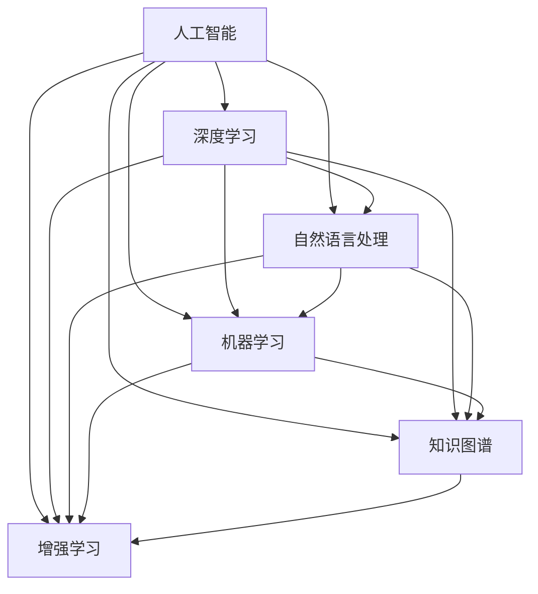

                 

# 知识经济时代：人工智能的贡献

在21世纪的知识经济时代，人工智能(AI)技术正在以前所未有的速度改变着各行各业的运作方式和业务模式。通过深度学习、自然语言处理、机器视觉等前沿技术的革新，AI不仅在技术层面提供了强大的助力，更在社会经济层面带来了深远的影响。本文将深入探讨人工智能在知识经济时代的具体贡献，并展望其未来的发展趋势和面临的挑战。

## 1. 背景介绍

### 1.1 问题由来
随着全球数据量的爆炸性增长和计算技术的飞速进步，AI技术进入了一个高速发展的黄金时期。特别是在大数据、云计算和深度学习技术的推动下，AI的应用场景从传统的图像识别、语音识别等领域扩展到了医疗、金融、教育、农业等诸多行业。AI技术的应用，不仅提升了生产效率，降低了运营成本，还创新了商业模式，驱动了新一轮的产业革命。

### 1.2 问题核心关键点
人工智能在知识经济时代的核心贡献在于其对信息处理能力的提升和对人类知识经验的深度挖掘。通过高效的数据处理和强大的模式识别能力，AI技术不仅重塑了信息传递和知识共享的方式，还推动了知识创新和应用，促进了知识经济的健康发展。

## 2. 核心概念与联系

### 2.1 核心概念概述

为更好地理解人工智能在知识经济时代的贡献，本节将介绍几个密切相关的核心概念：

- 人工智能(AI)：指通过计算机模拟人类智能行为，使机器能够自主地进行信息处理、学习、推理等高级认知活动的学科。
- 深度学习(Deep Learning)：一种基于神经网络的机器学习方法，通过多层次的特征提取和抽象，实现对复杂数据的高效处理和分析。
- 自然语言处理(NLP)：研究如何让机器理解、处理和生成人类语言的学科，包括文本分类、情感分析、机器翻译等应用。
- 机器学习(ML)：指通过数据驱动的方式，让机器具备学习能力的学科，包括监督学习、无监督学习、强化学习等方法。
- 知识图谱(KG)：一种将知识结构化、可视化表示的数据库，用于促进知识的自动推理和应用。
- 增强学习(RL)：指通过与环境的交互，让机器不断调整自身策略，以最大化长期收益的学科。

这些核心概念之间的逻辑关系可以通过以下Mermaid流程图来展示：



这个流程图展示了人工智能及其分支技术之间的相互关系：

1. 人工智能是综合多个子技术的一个总称。
2. 深度学习、自然语言处理、机器学习、知识图谱和增强学习等技术都是人工智能的重要分支。
3. 这些分支技术相互支撑，共同推动了人工智能在知识经济时代的发展。

## 3. 核心算法原理 & 具体操作步骤
### 3.1 算法原理概述

人工智能在知识经济时代的核心算法原理主要基于数据驱动的机器学习技术。通过构建数学模型和算法框架，让机器从大量数据中学习和提取规律，从而实现自主的决策和行为。具体来说，人工智能在知识经济时代的主要贡献在于以下几个方面：

1. **数据驱动的知识发现**：利用机器学习算法，从海量的结构化和非结构化数据中提取有用信息，支持知识经济中的数据驱动决策。
2. **高效的智能推荐系统**：通过深度学习模型，构建推荐系统，为用户提供个性化的信息和服务，提升用户体验。
3. **智能自动化和优化**：使用机器学习算法，优化生产流程和业务流程，提高效率和质量。
4. **智能搜索和信息检索**：利用自然语言处理和信息检索技术，快速找到所需信息，支持知识获取和共享。

### 3.2 算法步骤详解

基于人工智能的核心算法原理，通常可以按照以下步骤进行具体实现：

**Step 1: 数据准备**
- 收集和预处理数据，包括清洗、标准化、标注等。
- 将数据划分为训练集、验证集和测试集，确保模型在未见过的数据上也能表现良好。

**Step 2: 模型选择与设计**
- 根据任务特点选择合适的模型，如卷积神经网络(CNN)、循环神经网络(RNN)、Transformer等。
- 设计模型架构，包括输入层、隐藏层、输出层等，确定超参数，如学习率、批大小等。

**Step 3: 训练与优化**
- 使用训练集对模型进行迭代训练，通过前向传播和反向传播计算梯度。
- 使用优化算法如Adam、SGD等更新模型参数，最小化损失函数。
- 在验证集上评估模型性能，根据评估结果调整模型和训练策略。

**Step 4: 测试与部署**
- 使用测试集评估模型最终性能，确保模型在实际应用中表现稳定。
- 将训练好的模型部署到生产环境中，进行实时推理和应用。

### 3.3 算法优缺点

人工智能在知识经济时代的应用具有以下优点：
1. **高效的信息处理能力**：能够快速处理海量数据，提升信息处理效率。
2. **智能决策支持**：通过数据驱动的决策，提供科学、客观的决策支持，减少人为错误。
3. **个性化服务**：利用深度学习等技术，为用户提供定制化的产品和服务，提升用户体验。
4. **跨领域应用广泛**：AI技术可以应用于多个行业，解决复杂问题，推动产业升级。

同时，也存在一些局限性：
1. **数据依赖性强**：AI模型性能依赖于数据的质量和量，数据不足可能导致模型表现不佳。
2. **模型解释性差**：AI模型通常是"黑盒"，难以解释其内部工作机制和决策逻辑。
3. **隐私和安全问题**：AI模型可能涉及敏感数据，需注意隐私保护和安全性问题。
4. **计算资源消耗大**：深度学习模型往往需要大量的计算资源和存储空间，导致部署成本高。
5. **技术门槛高**：需要具备一定的技术背景和专业技能，普通用户难以直接应用。

尽管存在这些局限性，但就目前而言，AI技术在知识经济时代的发展已经取得了显著的成效，并将在未来继续发挥重要作用。

### 3.4 算法应用领域

人工智能在知识经济时代的广泛应用，覆盖了诸多领域，包括但不限于：

- **医疗健康**：通过图像识别、自然语言处理等技术，辅助医生进行疾病诊断、病理分析、药物研发等。
- **金融科技**：利用深度学习和增强学习等技术，进行风险控制、欺诈检测、智能投顾等。
- **教育培训**：使用机器学习和大数据分析，个性化推荐学习资源、智能批改作业、学情分析等。
- **智能制造**：通过智能传感器和数据分析，优化生产流程、预测设备故障、自动化控制等。
- **农业科技**：利用遥感技术和数据分析，优化种植方案、精准农业、灾害预警等。
- **智慧城市**：通过物联网和数据分析，提升城市管理、交通调度、公共安全等。

## 4. 数学模型和公式 & 详细讲解  
### 4.1 数学模型构建

基于人工智能的核心算法原理，可以构建一系列的数学模型来描述其工作机制。以卷积神经网络(CNN)为例，其数学模型可以表示为：

$$
h = \sigma(Wx + b)
$$

其中 $x$ 为输入特征向量，$W$ 为权重矩阵，$b$ 为偏置向量，$\sigma$ 为激活函数，$h$ 为输出特征向量。通过多层卷积和池化操作，CNN可以提取输入数据的局部特征和全局特征。

### 4.2 公式推导过程

以简单的线性回归模型为例，推导其公式推导过程：

假设样本集 $\{(x_i, y_i)\}_{i=1}^N$，其中 $x_i \in \mathbb{R}^d$ 为特征向量，$y_i \in \mathbb{R}$ 为标签。线性回归模型的目标是最小化预测值 $\hat{y} = \theta^Tx$ 与真实值 $y$ 之间的均方误差：

$$
L = \frac{1}{N} \sum_{i=1}^N (y_i - \theta^Tx_i)^2
$$

通过对损失函数求导，得到最优参数 $\theta$ 的求解公式：

$$
\theta = (\mathbf{X}^T\mathbf{X})^{-1}\mathbf{X}^T\mathbf{Y}
$$

其中 $\mathbf{X} = [x_1, x_2, ..., x_N] \in \mathbb{R}^{N\times d}$ 为特征矩阵，$\mathbf{Y} = [y_1, y_2, ..., y_N] \in \mathbb{R}^N$ 为标签向量。

### 4.3 案例分析与讲解

以图像分类任务为例，分析基于卷积神经网络的模型构建和训练过程：

- **模型构建**：使用卷积层、池化层、全连接层等构建卷积神经网络。
- **数据预处理**：将图像数据转换为数值特征向量，并进行标准化和归一化处理。
- **训练过程**：使用随机梯度下降等优化算法，迭代训练模型，最小化损失函数。
- **评估与调优**：在验证集上评估模型性能，根据结果调整超参数，如学习率、批大小等。

## 5. 项目实践：代码实例和详细解释说明
### 5.1 开发环境搭建

在进行AI项目实践前，我们需要准备好开发环境。以下是使用Python进行TensorFlow开发的环境配置流程：

1. 安装Anaconda：从官网下载并安装Anaconda，用于创建独立的Python环境。

2. 创建并激活虚拟环境：
```bash
conda create -n tf-env python=3.8 
conda activate tf-env
```

3. 安装TensorFlow：根据CUDA版本，从官网获取对应的安装命令。例如：
```bash
conda install tensorflow -c conda-forge
```

4. 安装各类工具包：
```bash
pip install numpy pandas scikit-learn matplotlib tqdm jupyter notebook ipython
```

完成上述步骤后，即可在`tf-env`环境中开始AI项目的开发。

### 5.2 源代码详细实现

这里我们以图像分类任务为例，给出使用TensorFlow进行卷积神经网络模型开发的PyTorch代码实现。

首先，定义图像分类任务的训练和评估函数：

```python
import tensorflow as tf
from tensorflow.keras import layers, models

def build_model(input_shape):
    model = models.Sequential([
        layers.Conv2D(32, (3, 3), activation='relu', input_shape=input_shape),
        layers.MaxPooling2D((2, 2)),
        layers.Conv2D(64, (3, 3), activation='relu'),
        layers.MaxPooling2D((2, 2)),
        layers.Conv2D(128, (3, 3), activation='relu'),
        layers.MaxPooling2D((2, 2)),
        layers.Flatten(),
        layers.Dense(64, activation='relu'),
        layers.Dense(10)
    ])
    return model

def train_model(model, train_dataset, validation_dataset, epochs, batch_size):
    model.compile(optimizer=tf.keras.optimizers.Adam(), loss=tf.keras.losses.SparseCategoricalCrossentropy(from_logits=True), metrics=['accuracy'])
    model.fit(train_dataset, validation_data=validation_dataset, epochs=epochs, batch_size=batch_size)

def evaluate_model(model, test_dataset, batch_size):
    test_loss, test_acc = model.evaluate(test_dataset, verbose=0)
    print('Test accuracy:', test_acc)
```

然后，定义图像数据集和模型训练流程：

```python
import numpy as np
from tensorflow.keras.preprocessing.image import ImageDataGenerator

train_datagen = ImageDataGenerator(rescale=1./255)
test_datagen = ImageDataGenerator(rescale=1./255)

train_dataset = train_datagen.flow_from_directory(train_dir, target_size=(224, 224), batch_size=batch_size, class_mode='categorical')
validation_dataset = train_datagen.flow_from_directory(validation_dir, target_size=(224, 224), batch_size=batch_size, class_mode='categorical')
test_dataset = test_datagen.flow_from_directory(test_dir, target_size=(224, 224), batch_size=batch_size, class_mode='categorical')

model = build_model((224, 224, 3))
epochs = 10
batch_size = 32

train_model(model, train_dataset, validation_dataset, epochs, batch_size)
evaluate_model(model, test_dataset, batch_size)
```

以上就是使用TensorFlow进行图像分类任务卷积神经网络微调的完整代码实现。可以看到，TensorFlow的高级API使得模型构建和训练过程变得非常简单，开发者可以更加专注于算法的设计和调试。

### 5.3 代码解读与分析

让我们再详细解读一下关键代码的实现细节：

**图像数据生成器**：
- 使用`ImageDataGenerator`类，实现数据增强和标准化处理。
- `train_datagen`和`test_datagen`分别用于训练集和测试集的图像生成。
- `rescale`参数实现图像像素值归一化，方便模型训练。

**模型构建**：
- 使用`Sequential`类构建卷积神经网络。
- 包含卷积层、池化层、全连接层等组件，设置激活函数和输出层。

**训练流程**：
- 使用`compile`方法设置优化器、损失函数和评估指标。
- `fit`方法对模型进行训练，设定训练轮数和批次大小。
- `evaluate`方法在测试集上评估模型性能。

## 6. 实际应用场景
### 6.1 医疗健康

在医疗健康领域，人工智能技术的应用正在带来深刻的变革。AI通过深度学习和大数据分析，能够辅助医生进行疾病诊断、病理分析、药物研发等工作，大大提高了医疗服务的质量和效率。

具体应用场景包括：
- **疾病诊断**：使用图像识别技术，自动分析X光片、CT扫描等医学影像，辅助医生进行疾病诊断。
- **病理分析**：通过自然语言处理技术，对病历报告进行文本分析和信息提取，辅助病理医生进行病理分析。
- **药物研发**：利用深度学习模型，对生物信息学数据进行建模和分析，加速新药的发现和开发。

### 6.2 金融科技

金融科技领域，人工智能技术的应用同样带来了显著的效益。AI通过深度学习和增强学习等技术，能够进行风险控制、欺诈检测、智能投顾等工作，提升金融服务的智能化水平。

具体应用场景包括：
- **风险控制**：使用机器学习模型，对客户信用数据进行分析，预测违约风险。
- **欺诈检测**：通过异常检测和行为分析，及时发现和防范金融欺诈行为。
- **智能投顾**：利用自然语言处理和深度学习技术，提供个性化投资建议和风险评估。

### 6.3 教育培训

在教育培训领域，AI技术的应用正改变着传统的教学方式和学习模式。通过智能推荐、智能批改和学情分析等技术，AI能够提供更加个性化和高效的教育服务。

具体应用场景包括：
- **智能推荐**：根据学生的学习行为和成绩，推荐适合的学习资源和课程。
- **智能批改**：使用自然语言处理技术，自动批改作业和考试试卷，提高教师效率。
- **学情分析**：通过数据分析，识别学生的知识盲点和薄弱环节，制定个性化学习计划。

### 6.4 智能制造

智能制造领域，人工智能技术的应用正在推动制造业的数字化和智能化转型。通过智能传感器和数据分析，AI能够优化生产流程、预测设备故障、自动化控制等，提升制造业的效率和质量。

具体应用场景包括：
- **生产流程优化**：通过数据分析和预测模型，优化生产计划和资源配置。
- **设备故障预测**：利用机器学习模型，预测设备运行状态，提前进行维护和检修。
- **自动化控制**：使用机器人技术，实现生产线的自动化和智能化管理。

## 7. 工具和资源推荐
### 7.1 学习资源推荐

为了帮助开发者系统掌握人工智能技术的理论基础和实践技巧，这里推荐一些优质的学习资源：

1. 《深度学习》系列博文：由知名AI专家撰写，涵盖深度学习的基本概念、算法和应用。
2. CS231n《卷积神经网络》课程：斯坦福大学开设的深度学习课程，讲解卷积神经网络原理和实践。
3. 《TensorFlow实战》书籍：TensorFlow官方出版的实战指南，提供丰富的代码示例和应用场景。
4. Udacity《深度学习基础》课程：在线深度学习课程，由知名AI专家讲授，涵盖深度学习的基础理论和应用。
5. Kaggle竞赛平台：提供大量数据集和竞赛题目，帮助开发者练习深度学习和数据处理技能。

通过对这些资源的学习实践，相信你一定能够快速掌握人工智能技术的精髓，并用于解决实际的业务问题。
###  7.2 开发工具推荐

高效的开发离不开优秀的工具支持。以下是几款用于AI项目开发的常用工具：

1. TensorFlow：由Google主导开发的深度学习框架，生产部署方便，适合大规模工程应用。
2. PyTorch：基于Python的开源深度学习框架，灵活动态的计算图，适合快速迭代研究。
3. Keras：高级神经网络API，提供简洁易用的接口，支持TensorFlow和Theano等后端。
4. Jupyter Notebook：交互式的编程环境，支持Python、R等多种语言，适合数据分析和机器学习任务。
5. Visual Studio Code：功能强大的代码编辑器，支持Python、R等多种语言，适合AI项目开发和调试。

合理利用这些工具，可以显著提升AI项目的开发效率，加快创新迭代的步伐。

### 7.3 相关论文推荐

人工智能技术的发展源于学界的持续研究。以下是几篇奠基性的相关论文，推荐阅读：

1. Deep Blue: Machine Learning in Chess（Deep Blue论文）：首次展示了AI在复杂策略游戏中的应用。
2. AlphaGo Zero: Mastering the Game of Go without Human Knowledge（AlphaGo论文）：通过强化学习技术，实现了AlphaGo Zero在无监督学习下击败人类顶尖选手的突破。
3. ImageNet Classification with Deep Convolutional Neural Networks（AlexNet论文）：首次展示了卷积神经网络在图像分类任务中的强大表现。
4. Speech and Language Processing（自然语言处理综述）：由斯坦福大学出版，全面介绍了自然语言处理的基本概念和技术。
5. Introduction to Machine Learning with PyTorch（PyTorch实战指南）：由官方作者撰写，提供了丰富的代码示例和应用场景。

这些论文代表了大数据、深度学习和自然语言处理技术的发展脉络。通过学习这些前沿成果，可以帮助研究者把握学科前进方向，激发更多的创新灵感。

## 8. 总结：未来发展趋势与挑战

### 8.1 总结

本文对人工智能在知识经济时代的具体贡献进行了全面系统的介绍。首先阐述了人工智能技术在信息处理、智能推荐、自动化优化等方面的重要作用，明确了其在知识经济中的关键地位。其次，从原理到实践，详细讲解了人工智能的核心算法原理和具体操作步骤，给出了具体应用的代码实现。同时，本文还广泛探讨了人工智能技术在医疗健康、金融科技、教育培训、智能制造等多个行业领域的应用前景，展示了人工智能技术的广阔前景。

通过本文的系统梳理，可以看到，人工智能技术在知识经济时代的应用正在改变着各行各业的运作方式和业务模式，为社会经济的持续发展提供了强大的技术支撑。未来，伴随技术的不断演进和应用场景的拓展，人工智能必将在知识经济时代发挥更加重要的作用。

### 8.2 未来发展趋势

展望未来，人工智能技术在知识经济时代的发展趋势将呈现出以下几个特点：

1. **多模态融合**：未来的人工智能技术将突破单一模态的限制，融合视觉、语音、文本等多种信息形式，实现更加全面和准确的感知与理解。
2. **深度学习与强化学习结合**：深度学习与强化学习的结合，将推动AI在复杂决策和动态系统中的应用，提升智能系统的鲁棒性和灵活性。
3. **跨领域协同**：人工智能技术将在不同行业间实现跨领域的协同应用，推动各行业的创新和发展，实现产业升级。
4. **知识图谱与自然语言处理结合**：知识图谱与自然语言处理的结合，将提升AI系统对复杂知识和关系的理解与推理能力，支持更加智能的决策和应用。
5. **联邦学习与边缘计算**：通过联邦学习和边缘计算技术，AI模型可以在分布式环境中进行训练和推理，提升数据隐私和模型性能。

这些趋势凸显了人工智能技术在知识经济时代的持续演进和应用拓展，预示着AI技术的未来发展方向。

### 8.3 面临的挑战

尽管人工智能技术在知识经济时代的发展取得了显著成效，但在迈向更加智能化、普适化应用的过程中，仍面临诸多挑战：

1. **数据隐私和安全问题**：AI模型通常需要大量数据进行训练，涉及用户隐私和数据安全问题。如何在数据收集和使用过程中保障隐私和安全性，是未来的一大挑战。
2. **模型透明性和可解释性**：AI模型通常是"黑盒"，难以解释其内部工作机制和决策逻辑。如何赋予AI模型更强的透明性和可解释性，是提升用户信任和接受度的重要问题。
3. **计算资源消耗**：深度学习模型往往需要大量的计算资源和存储空间，导致部署成本高。如何优化模型结构和资源消耗，是提高AI模型应用效率的重要方向。
4. **知识整合与自动化**：AI模型需要整合和自动化各种知识形式，如知识图谱、逻辑规则等，以实现更加全面和准确的信息处理。如何实现知识的高效整合和自动化应用，是未来AI技术的重要课题。
5. **公平性和包容性**：AI模型可能存在偏见和歧视，如何确保模型的公平性和包容性，避免对特定群体的不公正对待，是保障AI技术普惠性的重要问题。

这些挑战需要技术、伦理和社会等多方面的共同努力，才能在知识经济时代实现人工智能技术的全面发展和应用。

### 8.4 研究展望

面对人工智能技术在知识经济时代面临的挑战，未来的研究需要在以下几个方面寻求新的突破：

1. **数据隐私保护**：开发更加高效的数据加密和隐私保护技术，确保数据在收集和使用过程中不被滥用。
2. **模型透明性提升**：通过可解释AI技术，提升AI模型的透明性和可解释性，增强用户对AI系统的信任和接受度。
3. **计算资源优化**：研究高效的模型压缩、量化和优化技术，降低深度学习模型的计算和存储需求，提升模型的应用效率。
4. **知识整合自动化**：开发更加智能的知识图谱和自动推理系统，实现知识的高效整合和自动化应用，提升AI系统的智能水平。
5. **公平性保证**：研究公平性和包容性算法，确保AI模型在各个应用场景中均不偏向特定群体，保障社会公平正义。

这些研究方向将推动人工智能技术在知识经济时代的全面发展和应用，为人类的知识经济和智能化发展提供有力支持。

## 9. 附录：常见问题与解答

**Q1：人工智能技术在知识经济时代的主要应用场景有哪些？**

A: 人工智能技术在知识经济时代的应用非常广泛，涵盖了医疗健康、金融科技、教育培训、智能制造等多个领域。具体应用场景包括疾病诊断、风险控制、智能推荐、生产流程优化等，能够有效提升各行业的生产效率和服务质量。

**Q2：人工智能技术在知识经济时代面临的主要挑战是什么？**

A: 人工智能技术在知识经济时代面临的主要挑战包括数据隐私和安全问题、模型透明性和可解释性、计算资源消耗、知识整合与自动化、公平性和包容性等。这些挑战需要技术、伦理和社会等多方面的共同努力，才能实现人工智能技术的全面发展和应用。

**Q3：如何优化人工智能模型的计算资源消耗？**

A: 优化人工智能模型的计算资源消耗可以通过以下几个方法：
1. 模型压缩：使用剪枝、量化等技术，减小模型参数量，降低计算资源消耗。
2. 模型并行：采用分布式训练和推理，提升模型的计算速度和并行效率。
3. 数据增强：通过数据增强技术，提高模型泛化能力，减少对大规模数据的依赖。
4. 算法优化：研究更加高效的优化算法和损失函数，提升模型训练速度和精度。

**Q4：人工智能技术在知识经济时代未来的发展趋势是什么？**

A: 人工智能技术在知识经济时代的未来发展趋势包括多模态融合、深度学习与强化学习结合、跨领域协同、知识图谱与自然语言处理结合、联邦学习与边缘计算等。这些趋势将推动人工智能技术的全面发展和应用，为知识经济时代提供更加强大和智能的技术支撑。

---

作者：禅与计算机程序设计艺术 / Zen and the Art of Computer Programming

