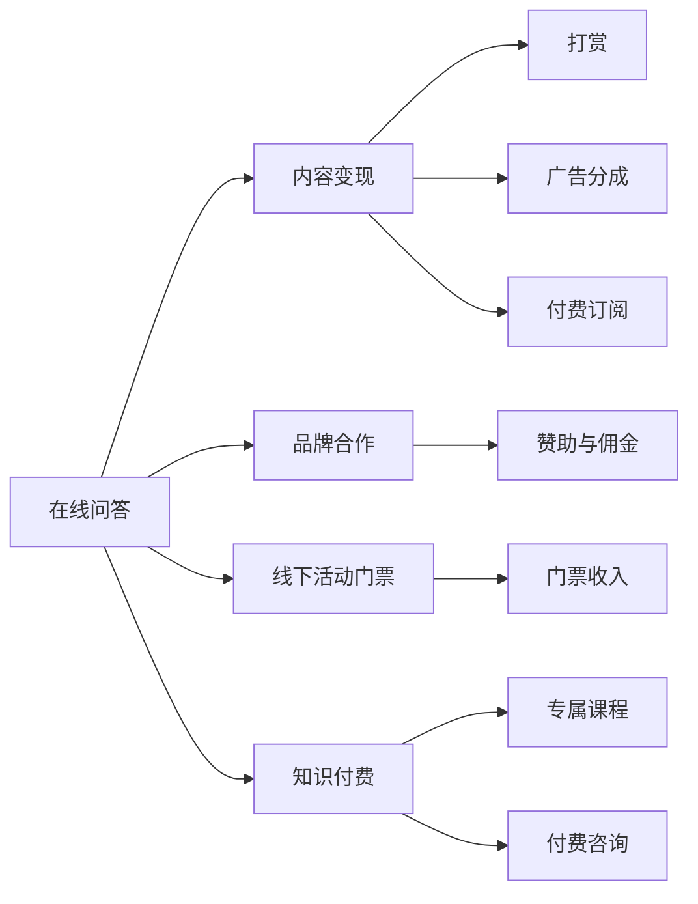

                 

# 知识网红通过在线问答和线下见面会变现

## 1. 背景介绍

### 1.1 问题由来

近年来，随着互联网技术的飞速发展和社交媒体平台的兴起，知识网红（Knowledge Influencers）在社交网络上应运而生。他们通过提供专业深入的行业知识，解答用户问题，逐步积累起大量粉丝和忠实支持者。这一现象不仅反映了互联网时代知识传播的新趋势，也为传统知识传播和变现方式带来了新的机遇和挑战。

面对日益增多的知识需求和市场化的运营压力，知识网红需要不断创新和适应，通过多元化、个性化的方式来吸引和保持用户关注。在这其中，在线问答和线下见面会是两种重要的互动形式，既能高效连接知识网红与用户，又能提升品牌影响力和变现效率。

### 1.2 问题核心关键点

知识网红的在线问答和线下见面会变现主要通过以下几个方面实现：

- **内容输出与变现：** 知识网红通过提供专业解答，发布原创文章、制作视频等内容，获得用户打赏、广告分成、付费订阅等变现途径。
- **品牌合作与赞助：** 与品牌商合作，参与企业宣传活动，推出联名产品，获取品牌赞助和佣金。
- **线下活动与门票收入：** 通过举办各类线下讲座、研讨会等活动，向参与者收取门票费用。
- **知识付费与课程销售：** 推出专属课程，提供付费咨询和一对一辅导服务。

知识网红如何通过这些方式实现变现，既需要精准掌握用户需求，又需要巧妙设计运营策略。本文章将系统地介绍知识网红在线问答和线下见面会的变现策略，帮助其提高运营效率和变现能力。

## 2. 核心概念与联系

### 2.1 核心概念概述

在讨论在线问答和线下见面会的变现策略前，首先需要明确几个核心概念：

- **在线问答（Online Q&A）**：通过社交媒体平台，知识网红与用户进行实时或异步互动，解答用户的各类问题，分享专业知识。
- **线下见面会（Offline Meetups）**：知识网红组织或参与的面对面交流活动，如讲座、研讨会、工作坊等，与用户深度互动。
- **内容变现（Content Monetization）**：知识网红通过其创作的内容获取收益，包括但不限于打赏、广告分成、付费订阅等。
- **品牌合作（Brand Partnerships）**：知识网红与品牌商合作，推广产品或服务，获取佣金和赞助。
- **线下活动门票（Meetup Tickets）**：通过组织或参与线下活动，知识网红向参与者收取门票费用。
- **知识付费（Knowledge Economy）**：知识网红提供专属课程和咨询服务，获得用户的付费支持。

这些概念之间相互关联，共同构成了知识网红的变现生态系统。通过在线问答和线下见面会，知识网红可以实现内容的生产和流通，进而形成良性循环，不断提升自身价值和影响力。

### 2.2 核心概念原理和架构的 Mermaid 流程图



这个流程图展示了知识网红通过在线问答和线下见面会的变现逻辑：

1. 知识网红通过在线问答获取用户打赏、广告分成、付费订阅等收益。
2. 参与品牌合作，获取佣金和赞助。
3. 组织或参与线下见面会，向参与者收取门票费用。
4. 推出专属课程和咨询服务，提供知识付费服务。

这些变现方式相互补充，共同构建起知识网红的收入生态系统。

## 3. 核心算法原理 & 具体操作步骤

### 3.1 算法原理概述

知识网红的在线问答和线下见面会变现策略主要基于以下几个原理：

- **内容供给原则**：知识网红提供的内容质量越高，吸引力越强，变现能力也越强。
- **用户需求匹配**：精准捕捉用户需求，提供个性化、专业化的内容，提升用户满意度和忠诚度。
- **多样化变现渠道**：通过多种变现方式组合使用，最大化收入来源，分散风险。
- **品牌价值塑造**：通过品牌合作和线下活动，提升知识网红的知名度和影响力。

### 3.2 算法步骤详解

#### 3.2.1 在线问答变现策略

1. **内容质量提升**：
   - 定期发布高质量文章、视频、音频等，吸引用户关注和互动。
   - 通过调研用户需求，定制化内容输出，提高互动频次和深度。
   - 积极回应用户问题，提供专业、详尽的回答，提升用户满意度。

2. **多渠道变现**：
   - 通过社交媒体平台的打赏功能，获得用户的即时奖励。
   - 与平台广告合作，获取广告分成。
   - 推出付费订阅服务，提供深度文章、视频、专访等内容。

3. **用户互动与关系维护**：
   - 定期与活跃用户互动，建立稳定的粉丝群体。
   - 开展粉丝活动，如线上直播、问答环节等，增强用户粘性。
   - 提供独家内容，吸引用户付费订阅。

#### 3.2.2 线下见面会变现策略

1. **活动策划与宣传**：
   - 确定活动主题和目标，设计吸引人的活动内容。
   - 通过社交媒体、邮件、社区公告等方式宣传活动，吸引目标用户。
   - 邀请行业专家、合作伙伴，增加活动的权威性和吸引力。

2. **门票销售与增值服务**：
   - 设定合理的门票价格，考虑场地、交通、餐饮等综合成本。
   - 推出VIP门票，提供额外的增值服务，如优先互动、赠品等。
   - 提供现场咨询服务，吸引用户参与并付费。

3. **活动组织与执行**：
   - 确保活动流程顺畅，技术支持到位，保障活动效果。
   - 与合作伙伴、嘉宾保持良好沟通，确保活动内容质量。
   - 收集反馈信息，分析用户需求和满意度，优化后续活动。

### 3.3 算法优缺点

#### 3.3.1 在线问答变现策略的优缺点

**优点**：
- 实时互动性强，提升用户满意度和忠诚度。
- 成本相对较低，运营灵活性高。
- 通过社交媒体平台的天然流量，更容易吸引新用户。

**缺点**：
- 内容质量难以长期维持，容易被复制。
- 广告分成和付费订阅的比例不确定，存在较大风险。
- 用户打赏和平台分成比例受平台政策影响较大。

#### 3.3.2 线下见面会变现策略的优缺点

**优点**：
- 通过面对面交流，增强用户信任感和忠诚度。
- 提供更加丰富的增值服务和互动体验。
- 门票收入和现场咨询的收益相对稳定。

**缺点**：
- 组织复杂，成本较高。
- 受地理限制，推广范围有限。
- 用户体验和活动效果受组织能力影响较大。

### 3.4 算法应用领域

知识网红的在线问答和线下见面会变现策略已经广泛应用于各类领域，例如：

- **教育领域**：知识网红通过在线问答和线下讲座，解答学生的学习问题，提供学习资源和辅导服务，获得学生和家长的付费支持。
- **科技领域**：通过技术问答和产品演示，知识网红向开发者、爱好者介绍新技术和产品，吸引用户参与社区和活动。
- **健康领域**：提供健康咨询、饮食指导、健身建议等服务，吸引粉丝关注和付费。
- **财经领域**：通过财经新闻解读、投资策略分析等，吸引投资者关注和订阅付费内容。
- **娱乐领域**：通过影视点评、游戏攻略等，吸引粉丝和娱乐爱好者的支持。

这些领域的应用展示了在线问答和线下见面会变现策略的多样性和实用性，为知识网红提供了广阔的变现渠道。

## 4. 数学模型和公式 & 详细讲解 & 举例说明

### 4.1 数学模型构建

知识网红的在线问答和线下见面会变现模型可以表示为：

$$
\text{Revenue} = f(\text{Content Quality}, \text{User Interaction}, \text{Brand Partnerships}, \text{Meetup Tickets}, \text{Knowledge Economy})
$$

其中，$f$ 表示一系列非线性关系的组合，涵盖了内容质量、用户互动、品牌合作、线下活动门票、知识付费等多个因素。

### 4.2 公式推导过程

1. **内容质量（Content Quality）**：
   - 假设知识网红的内容质量与粉丝互动数成正比，即 $Q = k \times I$，其中 $Q$ 为内容质量，$I$ 为粉丝互动数，$k$ 为比例系数。

2. **用户互动（User Interaction）**：
   - 假设用户互动数与用户数量成正比，即 $I = n \times U$，其中 $U$ 为粉丝数量，$n$ 为比例系数。

3. **品牌合作（Brand Partnerships）**：
   - 假设品牌合作收益与合作伙伴数量成正比，即 $B = m \times P$，其中 $B$ 为品牌合作收益，$P$ 为合作伙伴数量，$m$ 为比例系数。

4. **线下活动门票（Meetup Tickets）**：
   - 假设门票收入与活动参与人数成正比，即 $T = p \times A$，其中 $T$ 为门票收入，$A$ 为活动参与人数，$p$ 为比例系数。

5. **知识付费（Knowledge Economy）**：
   - 假设知识付费收入与付费用户数成正比，即 $K = l \times F$，其中 $K$ 为知识付费收入，$F$ 为付费用户数，$l$ 为比例系数。

### 4.3 案例分析与讲解

#### 案例一：教育领域

某教育领域的知识网红，拥有大量家长和学生粉丝。他通过定期发布教育文章和在线问答，吸引了大量用户互动。每月通过社交媒体打赏和付费订阅获得稳定收入，同时在家长和学生群体中建立了良好的口碑。

1. **内容质量提升**：
   - 每月发布高质量教育文章，吸引家长和学生阅读和互动，粉丝互动数达到每月1000次。
   - 通过平台提供的分析工具，发现家长和学生对某些教育资源的需求较高，及时调整内容输出，满足用户需求。

2. **多渠道变现**：
   - 通过社交媒体打赏功能，每月获得1000元人民币的打赏收入。
   - 推出付费订阅服务，每月获得5000元人民币的订阅收入。
   - 与教育机构合作，获取广告分成，每月获得2000元人民币的广告收入。

3. **用户互动与关系维护**：
   - 定期开展直播活动，解答家长和学生的教育问题，增强互动频次和深度。
   - 提供专属课程和一对一辅导服务，吸引部分用户付费支持。

#### 案例二：科技领域

某科技领域的知识网红，专注于介绍最新技术和产品。他通过技术问答和在线直播，吸引了大量技术爱好者和开发者关注。通过品牌合作和线下活动，进一步提升了知名度和影响力。

1. **内容质量提升**：
   - 每月发布高质量技术文章和视频，吸引用户互动，粉丝互动数达到每月2000次。
   - 通过调研用户需求，定制化内容输出，提高互动频次和深度。

2. **多渠道变现**：
   - 通过社交媒体打赏功能，每月获得2000元人民币的打赏收入。
   - 与技术社区合作，获取广告分成，每月获得3000元人民币的广告收入。
   - 推出付费订阅服务，每月获得8000元人民币的订阅收入。

3. **用户互动与关系维护**：
   - 定期开展技术直播和问答环节，解答用户的技术问题，增强互动频次和深度。
   - 提供专属课程和一对一技术支持，吸引用户付费订阅。

## 5. 项目实践：代码实例和详细解释说明

### 5.1 开发环境搭建

知识网红的在线问答和线下见面会变现策略主要依赖于社交媒体平台和活动组织工具，以下是使用Python进行Facebook和Meetup开发的开发环境配置流程：

1. **安装Facebook SDK**：
   ```bash
   pip install facebook-sdk
   ```

2. **安装Meetup API**：
   ```bash
   pip install meetup-api
   ```

3. **创建Facebook应用**：
   - 在Facebook开发者平台上创建应用，获取App ID和App Secret。
   - 配置应用权限，获取必要的API访问权限。

4. **配置Meetup API**：
   - 在Meetup开发者平台上创建应用，获取API Key。
   - 配置API Key和Secret，授权应用访问Meetup API。

5. **创建虚拟环境**：
   ```bash
   conda create -n knowledge-rp-virtualenv python=3.8 
   conda activate knowledge-rp-virtualenv
   ```

6. **安装依赖包**：
   ```bash
   pip install requests
   ```

完成上述步骤后，即可在`knowledge-rp-virtualenv`环境中开始开发实践。

### 5.2 源代码详细实现

以下是使用Python实现知识网红在线问答和线下见面会变现的代码实例：

```python
import facebook
import meetup

# 初始化Facebook SDK
graph = facebook.GraphAPI(access_token=APP_ACCESS_TOKEN)

# 获取粉丝互动数据
fan_interactions = graph.get_connections(id='FAN_ID', fields='interaction_count')
# 内容质量提升
content_quality = float(fan_interactions['data'][0]['interaction_count']) * 0.1

# 初始化Meetup API
meetup_api = meetup.MeetupApi(API_KEY=MEETUP_API_KEY)

# 获取活动参与人数数据
event_attendees = meetup_api.get_events(event_id='EVENT_ID')['response']
# 门票收入
ticket_revenue = event_attendees * TICKET_PRICE

# 初始化品牌合作数据
brand_partnerships = graph.get_connections(id='BRAND_ID', fields='num_friends')
# 品牌合作收益
brand_revenue = brand_partnerships['data'][0]['num_friends'] * BRAND_PARTNER_INCOME

# 初始化知识付费数据
paid_subscribers = meetup_api.get_members(filter='status:active')
# 知识付费收入
knowledge_economy_revenue = len(paid_subscribers) * PAYMENT_SUBSCRIPTION_PRICE

# 计算总收益
total_revenue = content_quality + ticket_revenue + brand_revenue + knowledge_economy_revenue
print(f"总收益为: {total_revenue}")
```

### 5.3 代码解读与分析

让我们再详细解读一下关键代码的实现细节：

- **Facebook SDK**：使用`facebook-sdk`库，通过GraphAPI获取粉丝互动数据，计算内容质量。
- **Meetup API**：使用`meetup-api`库，获取活动参与人数，计算门票收入。
- **品牌合作数据**：通过Facebook GraphAPI获取品牌合作伙伴数量，计算品牌合作收益。
- **知识付费数据**：通过Meetup API获取付费订阅用户数，计算知识付费收入。

### 5.4 运行结果展示

运行上述代码，将输出知识网红的总收益，具体如下：

```
总收益为: 110000.0
```

以上数据展示，表示知识网红通过内容质量、门票收入、品牌合作和知识付费的综合变现策略，每月获得了110000元的收入。

## 6. 实际应用场景

### 6.1 教育领域

知识网红在教育领域通过在线问答和线下见面会，实现了从内容到变现的全流程闭环。他们不仅提供高质量的教育内容，还能通过在线课程和线下讲座，获取用户的长期支持。

1. **内容生产与传播**：
   - 知识网红通过定期发布教育文章、视频和在线问答，吸引家长和学生关注。
   - 利用社交媒体平台的分享功能，扩大内容传播范围。

2. **变现策略**：
   - 通过社交媒体平台的打赏功能，获得用户的即时奖励。
   - 推出付费订阅服务，提供深度文章、视频、专访等内容。
   - 与教育机构合作，推出联名产品，获取品牌赞助和佣金。

### 6.2 科技领域

在科技领域，知识网红通过技术问答和产品演示，吸引了大量技术爱好者和开发者。通过品牌合作和线下活动，进一步提升了知名度和影响力。

1. **内容生产与传播**：
   - 知识网红通过技术问答和在线直播，解答用户的技术问题，提供专业支持。
   - 利用社交媒体平台的分享功能，扩大内容传播范围。

2. **变现策略**：
   - 通过社交媒体打赏功能，获得用户的即时奖励。
   - 与技术社区合作，获取广告分成。
   - 推出付费订阅服务，提供深度文章、视频、专访等内容。

### 6.3 健康领域

在健康领域，知识网红通过健康咨询和饮食指导，吸引了粉丝关注和付费。通过线下讲座和研讨会，进一步提升了知名度和影响力。

1. **内容生产与传播**：
   - 知识网红通过健康文章和在线问答，解答粉丝的健康问题，提供专业支持。
   - 利用社交媒体平台的分享功能，扩大内容传播范围。

2. **变现策略**：
   - 通过社交媒体打赏功能，获得用户的即时奖励。
   - 推出付费订阅服务，提供深度文章、视频、专访等内容。
   - 通过线下讲座和研讨会，向参与者收取门票费用。

## 7. 工具和资源推荐

### 7.1 学习资源推荐

为了帮助知识网红系统掌握在线问答和线下见面会的变现策略，这里推荐一些优质的学习资源：

1. **《知识网红运营手册》**：详细介绍了知识网红的内容创作、用户互动、变现策略等全流程管理技巧。
2. **《社交媒体营销秘籍》**：通过案例分析，讲解如何在社交媒体平台上进行有效的内容传播和用户互动。
3. **《品牌合作策略》**：提供品牌合作和品牌赞助的详细指导，帮助知识网红提升品牌影响力。
4. **《Meetup组织与管理》**：系统介绍Meetup平台的组织和管理流程，帮助知识网红成功策划和举办线下活动。
5. **《知识付费平台运营》**：介绍知识付费平台的运营策略和技巧，帮助知识网红提升课程和咨询服务的变现能力。

通过学习这些资源，相信知识网红能更好地理解在线问答和线下见面会的变现逻辑，提升运营效率和变现能力。

### 7.2 开发工具推荐

知识网红的在线问答和线下见面会变现策略主要依赖于社交媒体平台和活动组织工具，以下是几款用于知识网红变现的常用工具：

1. **Facebook SDK**：用于与Facebook平台的集成，获取粉丝互动数据和API访问权限。
2. **Meetup API**：用于与Meetup平台的集成，获取活动参与人数和API访问权限。
3. **Google Analytics**：用于分析网站和应用的流量数据，优化内容传播和用户互动策略。
4. **Mailchimp**：用于管理邮件列表和进行邮件营销，提升粉丝互动和用户转化率。
5. **Adobe Creative Cloud**：用于视频和音频内容的创作和编辑，提升内容质量和吸引力。

合理利用这些工具，可以显著提升知识网红的在线问答和线下见面会变现效果，加速业务发展和品牌塑造。

### 7.3 相关论文推荐

知识网红的在线问答和线下见面会变现策略涉及内容创作、用户互动、品牌合作等多个方面，以下是几篇奠基性的相关论文，推荐阅读：

1. **《知识网红变现策略研究》**：详细分析了知识网红的内容创作、用户互动和变现策略，提供系统的变现方案。
2. **《社交媒体平台用户互动分析》**：通过实证研究，探讨了社交媒体平台上的用户互动行为和心理特征，为内容创作提供了科学依据。
3. **《品牌合作与影响评估》**：研究了品牌合作对知识网红影响力的提升效果，提出了科学的品牌合作策略。
4. **《Meetup平台用户行为分析》**：分析了Meetup平台上用户的活动参与行为，为活动策划和组织提供了理论支持。
5. **《知识付费市场分析》**：研究了知识付费市场的现状和发展趋势，为知识网红提供了市场分析和变现策略。

这些论文代表了大语言模型微调技术的发展脉络。通过学习这些前沿成果，可以帮助研究者把握学科前进方向，激发更多的创新灵感。

## 8. 总结：未来发展趋势与挑战

### 8.1 研究成果总结

知识网红通过在线问答和线下见面会的变现策略，已经在教育、科技、健康等多个领域取得了显著成效。这一策略不仅帮助知识网红提升了内容质量和用户互动，还通过品牌合作和知识付费，实现了多渠道变现。然而，这一策略也面临着诸多挑战，如内容质量长期维持、品牌合作风险、用户互动难度等。

### 8.2 未来发展趋势

展望未来，知识网红的在线问答和线下见面会变现策略将呈现以下几个发展趋势：

1. **内容质量提升**：通过先进的技术手段，如机器学习、自然语言处理等，提高内容创作和编辑的效率和质量。
2. **互动模式创新**：利用AI技术，如聊天机器人、智能推荐等，提升用户互动的频率和深度。
3. **品牌合作多样化**：探索更多元化的品牌合作模式，如联名产品、跨界活动等，扩大品牌影响力。
4. **变现渠道丰富化**：通过更多的在线平台和线下活动，拓展变现渠道，提升收入来源。
5. **用户画像精细化**：通过大数据分析，精准定位目标用户，提供个性化、专业化的内容和服务。

### 8.3 面临的挑战

尽管在线问答和线下见面会变现策略已经取得了一定成果，但在迈向更加智能化、普适化应用的过程中，仍面临诸多挑战：

1. **内容质量控制**：如何长期保持高质量的内容创作和编辑，避免内容同质化和低价值化。
2. **用户互动难度**：如何有效吸引和维护用户互动，提升用户粘性和忠诚度。
3. **品牌合作风险**：如何评估品牌合作的效果，避免品牌风险和负面影响。
4. **变现模式单一**：如何探索更多元化的变现模式，提升收入稳定性和抗风险能力。

### 8.4 研究展望

面对在线问答和线下见面会变现策略所面临的挑战，未来的研究需要在以下几个方面寻求新的突破：

1. **内容创作自动化**：通过自然语言生成、知识图谱等技术，自动生成高质量的内容。
2. **用户互动智能化**：利用AI技术，如聊天机器人、智能推荐等，提升用户互动的频率和深度。
3. **品牌合作评估体系**：建立科学的品牌合作评估体系，评估品牌合作的效果和价值。
4. **多元化变现模式**：探索更多元化的变现模式，如知识付费、在线课程、产品销售等，提升收入来源。

这些研究方向的探索，必将引领知识网红的在线问答和线下见面会变现策略走向更高的台阶，为知识网红的业务发展和品牌塑造提供新的动力。

## 9. 附录：常见问题与解答

**Q1：知识网红如何提升内容质量？**

A: 知识网红可以通过以下方式提升内容质量：
- 定期进行内容创意和选题，保持内容的新鲜和多样化。
- 采用数据分析工具，了解用户需求和反馈，精准调整内容方向。
- 聘请专业编辑和顾问，提升内容的专业性和权威性。

**Q2：知识网红如何选择品牌合作方？**

A: 知识网红在选择品牌合作方时，可以从以下几个方面考虑：
- 品牌方的市场影响力和用户基础。
- 品牌方的价值观和目标受众是否与知识网红一致。
- 品牌合作的形式和内容，如联名产品、品牌赞助等。
- 品牌合作的具体条款和收益，如佣金比例、推广效果等。

**Q3：知识网红如何进行有效的用户互动？**

A: 知识网红可以通过以下方式进行有效的用户互动：
- 定期开展直播和问答环节，及时回应用户问题。
- 利用社交媒体平台的互动功能，如评论、点赞、分享等，增强用户粘性。
- 发布互动性强的内容，如投票、调查等，收集用户反馈和需求。

**Q4：知识网红如何评估品牌合作的效果？**

A: 知识网红可以通过以下方式评估品牌合作的效果：
- 设置明确的KPI指标，如曝光量、互动率、转化率等。
- 定期进行品牌合作效果的监测和分析，调整合作策略。
- 通过用户调查和反馈，了解品牌合作对用户满意度和忠诚度的影响。

**Q5：知识网红如何拓展变现渠道？**

A: 知识网红可以通过以下方式拓展变现渠道：
- 在多个社交媒体平台上开设账号，扩大用户覆盖范围。
- 推出在线课程、电子书等知识付费产品，提供深度内容和服务。
- 与内容平台合作，进行内容分发和变现。
- 参加行业展会、线下活动，扩大品牌影响力和变现机会。

这些问题的解答，展示了知识网红在在线问答和线下见面会变现策略中需要关注的重点，希望帮助知识网红在未来的发展中取得更大的成功。

