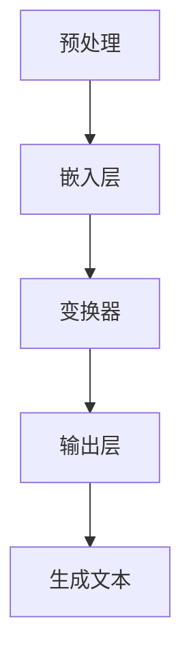

                 

### 文章标题

《语言与思维：大模型的认知盲区》

### 关键词
自然语言处理、大模型、认知能力、逻辑推理、模型训练、提示工程

### 摘要
本文深入探讨大语言模型在自然语言处理中的认知能力及其局限性。我们将分析大模型如何理解和生成语言，以及它们在处理逻辑推理和抽象概念时遇到的挑战。通过揭示这些认知盲区，我们旨在为未来模型设计和优化提供新的视角和策略。

## 1. 背景介绍（Background Introduction）

自然语言处理（NLP）是人工智能领域的一个重要分支，其目标是使计算机能够理解和处理自然语言。自20世纪50年代以来，NLP经历了多个发展阶段，从基于规则的系统到统计模型，再到当前的大模型时代。随着深度学习和神经网络技术的发展，大模型如GPT-3、BERT和T5等取得了显著的性能提升，在多项NLP任务中超越了人类表现。

大模型之所以能够取得如此出色的成果，主要是因为它们具有以下几个特点：

1. **参数规模巨大**：大模型通常拥有数十亿到千亿个参数，这使得它们能够学习到更多的语言模式和知识。
2. **自监督学习**：大模型在训练过程中利用了大量的无标签文本数据，通过预训练和微调，提高了对语言的理解能力。
3. **端到端学习**：大模型能够直接从输入文本生成输出文本，无需经过多个中间步骤。

尽管大模型在自然语言处理中取得了显著的成果，但它们仍然存在一些认知盲区。这些盲区不仅影响了大模型的性能，也可能导致错误的理解和生成。因此，深入了解大模型的认知能力及其局限性，对于进一步优化模型和解决实际问题具有重要意义。

本文将围绕以下核心问题展开讨论：

1. 大模型如何理解和生成语言？
2. 大模型在处理逻辑推理和抽象概念时遇到哪些挑战？
3. 如何通过提示工程和其他方法克服大模型的认知盲区？

通过这些问题的探讨，我们希望能够为未来的研究提供一些有价值的启示。

## 2. 核心概念与联系（Core Concepts and Connections）

### 2.1 大模型的理解与生成机制

大模型的核心在于其能够通过深度神经网络（DNN）和变换器（Transformer）架构高效地理解和生成语言。DNN通过多层非线性变换，逐步提取输入文本的特征。而Transformer架构则通过自注意力机制（Self-Attention）实现了全局依赖性的建模，使得模型能够捕捉到文本中的长距离关系。

在理解语言方面，大模型通过预训练和微调的过程，学习到了大量的语言模式和知识。预训练通常使用自监督学习技术，如掩码语言模型（Masked Language Model, MLM）和无监督的翻译任务。微调则是在特定任务上进一步优化模型的参数，使其能够适应具体的任务需求。

在生成语言方面，大模型使用了一个端到端的学习框架。输入文本经过模型处理后，模型会生成一个概率分布，该分布对应于可能的输出文本。通过选择概率最高的输出，模型实现了从输入到输出的文本转换。

### 2.2 语言模型与逻辑推理

语言模型在逻辑推理方面具有一定的局限性。尽管大模型能够捕捉到一些简单的逻辑关系，如因果关系和蕴含关系，但它们在处理复杂逻辑推理任务时仍然存在挑战。这是因为语言模型主要基于统计方法，通过学习文本数据中的模式来生成文本。然而，逻辑推理需要更深层次的推理和论证能力。

为了探讨大模型在逻辑推理方面的表现，我们可以考虑以下几个例子：

- **因果关系**：“如果它下雨了，那么地面会湿。” 大模型能够生成正确的推理结果。
- **蕴含关系**：“所有的猫都是动物。” 大模型也能够正确地推理出结论。
- **复杂逻辑**：“如果它下雨了，并且风速超过50公里/小时，那么旗帜会飘扬。” 大模型在处理这种复杂的蕴含关系时可能会遇到困难。

### 2.3 抽象概念的理解

大模型在处理抽象概念时也面临挑战。抽象概念通常涉及到多个层面的理解和推理。例如，对于“自由”这个概念，我们不仅需要理解其字面意思，还需要理解其在不同语境中的含义和引申义。大模型在处理这类抽象概念时，可能会因为缺乏具体的上下文信息而表现出不确定性和模糊性。

为了更好地理解大模型在语言理解和生成方面的能力，我们可以借助Mermaid流程图来展示其核心架构和流程。



在这个流程图中，A表示预处理阶段，包括文本的分词和标记化；B表示嵌入层，将文本转换为固定长度的向量；C表示变换器，通过自注意力机制进行特征提取；D表示输出层，生成文本的概率分布；E表示生成文本。

通过这个流程，我们可以看到大模型在理解和生成语言时涉及到的关键步骤和组件。这有助于我们进一步理解大模型的工作原理和局限性。

## 3. 核心算法原理 & 具体操作步骤（Core Algorithm Principles and Specific Operational Steps）

### 3.1 语言模型的训练过程

语言模型的训练是一个复杂的过程，涉及多个步骤和优化策略。以下是一个简化的训练流程：

1. **数据预处理**：首先，我们需要对训练数据集进行预处理，包括文本的分词、标记化和清洗。分词是将文本分解为单词或子词的过程，标记化是将单词转换为数字表示。
2. **嵌入层**：嵌入层是将单词转换为固定长度的向量表示。常用的嵌入方法包括词袋模型（Bag of Words, BoW）和词嵌入（Word Embedding），如Word2Vec和GloVe。
3. **变换器**：变换器是语言模型的核心组件，通过自注意力机制进行特征提取。自注意力机制使得模型能够自动地学习到文本中的长距离依赖关系。
4. **输出层**：输出层通常是一个全连接层，将嵌入层输出的特征映射到输出文本的概率分布上。
5. **损失函数和优化器**：为了训练语言模型，我们需要定义一个损失函数，如交叉熵损失（Cross-Entropy Loss），来衡量模型预测和真实标签之间的差距。优化器（如Adam或SGD）用于最小化损失函数，调整模型的参数。

### 3.2 提示词工程的方法

提示词工程是引导大模型生成符合预期输出的一种关键技术。以下是一些常用的提示词工程方法：

1. **问题引导**：通过提出明确的问题，引导模型生成相关的回答。例如：“请解释为什么地球是圆的？”
2. **上下文填充**：在给定的上下文中，填充缺失的信息。例如：“在一次科学实验中，科学家发现了一个奇怪的现象。请猜测这个现象可能是什么？”
3. **任务指令**：给出明确的任务指令，使模型知道需要完成的任务。例如：“请你写一篇关于人工智能的短文，要求包含以下关键词：深度学习、神经网络、应用。”
4. **模板匹配**：使用预定义的模板，填充具体的变量。例如：“如果我是一个苹果，那么我会是（颜色）的，因为（原因）。”

### 3.3 提示词工程的应用场景

提示词工程在多个实际应用场景中发挥了重要作用：

1. **问答系统**：通过设计合适的提示词，引导模型生成准确的答案。例如，在搜索引擎中，用户输入的问题可以作为提示词，使模型能够生成相关的搜索结果。
2. **文本生成**：通过给出问题或任务指令，模型可以生成文章、报告或对话等文本内容。例如，在自动写作工具中，用户可以指定主题和关键词，模型会根据提示生成文章。
3. **对话系统**：在聊天机器人中，设计有效的提示词可以提升对话的流畅性和用户满意度。例如，在客服机器人中，模型需要根据用户的问题生成合适的回答。

通过深入理解语言模型的训练过程和提示词工程的方法，我们可以更好地利用大模型在自然语言处理中的应用，同时也能够识别和解决其中存在的认知盲区。

## 4. 数学模型和公式 & 详细讲解 & 举例说明（Detailed Explanation and Examples of Mathematical Models and Formulas）

### 4.1 语言模型的数学基础

语言模型的核心在于其能够通过数学模型对自然语言进行建模。以下是一些关键的数学模型和公式：

#### 4.1.1 词嵌入

词嵌入是将单词转换为固定长度的向量表示。一个常见的词嵌入模型是Word2Vec，其目标是最小化以下损失函数：

$$
L(\theta) = -\sum_{i=1}^{N} \sum_{j=1}^{V} p(w_j|c_i) \log f(w_j, c_i)
$$

其中，$w_j$是单词，$c_i$是上下文窗口中的单词集合，$p(w_j|c_i)$是单词在给定上下文下的概率，$f(w_j, c_i)$是单词和上下文之间的相似性度量。

#### 4.1.2 变换器模型

变换器模型是语言模型的核心组件，其核心是自注意力机制（Self-Attention）。自注意力机制通过以下公式计算：

$$
\text{Attention}(Q, K, V) = \text{softmax}\left(\frac{QK^T}{\sqrt{d_k}}\right) V
$$

其中，$Q$是查询向量，$K$是键向量，$V$是值向量，$d_k$是键向量的维度。

#### 4.1.3 交叉熵损失

在语言模型的训练过程中，我们通常使用交叉熵损失函数来衡量模型预测和真实标签之间的差距。交叉熵损失函数的公式为：

$$
L(\theta) = -\sum_{i=1}^{N} \sum_{j=1}^{V} y_j \log \hat{y}_j
$$

其中，$y_j$是真实标签的概率分布，$\hat{y}_j$是模型预测的概率分布。

### 4.2 数学模型的应用示例

为了更好地理解这些数学模型，我们可以通过具体的示例来说明它们的应用。

#### 4.2.1 词嵌入的应用

假设我们有一个包含100个单词的词汇表，每个单词被表示为一个10维的向量。给定一个单词和其上下文，我们可以使用Word2Vec模型来计算它们的相似性。例如，如果我们想计算单词"apple"和"orange"的相似性，我们可以使用以下公式：

$$
\text{similarity}(apple, orange) = \text{cosine}(word2vec(apple), word2vec(orange))
$$

其中，$\text{cosine}$是余弦相似性函数，$word2vec(apple)$和$word2vec(orange)$分别是单词"apple"和"orange"的词嵌入向量。

#### 4.2.2 变换器模型的应用

在一个变换器模型中，我们可以通过自注意力机制来计算句子中每个单词的重要性。例如，给定一个句子"我爱北京天安门"，我们可以使用自注意力机制来计算每个单词的注意力权重。这些权重可以帮助我们理解句子中每个单词对输出的影响。

#### 4.2.3 交叉熵损失的应用

在一个语言模型训练任务中，我们可以使用交叉熵损失来评估模型的性能。例如，假设我们有一个包含10个单词的句子，模型预测的概率分布为[0.2, 0.3, 0.1, 0.2, 0.1, 0.1, 0.1, 0.1, 0.1, 0.1]，而真实标签的概率分布为[1, 0, 0, 0, 0, 0, 0, 0, 0, 0]。我们可以使用以下公式计算交叉熵损失：

$$
L(\theta) = -\log \hat{y}_1 = -\log(0.2) \approx 2.9957
$$

通过这些具体的示例，我们可以看到数学模型在语言模型中的关键作用。这些模型不仅帮助我们理解和生成自然语言，还为评估模型性能提供了有效的工具。

## 5. 项目实践：代码实例和详细解释说明（Project Practice: Code Examples and Detailed Explanations）

### 5.1 开发环境搭建

在开始项目实践之前，我们需要搭建一个合适的开发环境。以下是搭建环境的步骤：

1. **安装Python**：首先，我们需要安装Python，版本建议为3.8或更高。可以从[Python官方网站](https://www.python.org/)下载并安装。
2. **安装依赖库**：接下来，我们需要安装一些依赖库，如TensorFlow、NLTK和Gensim。可以使用以下命令安装：

```
pip install tensorflow
pip install nltk
pip install gensim
```

3. **准备数据集**：我们需要准备一个自然语言数据集，如新闻文章、对话数据或社交媒体文本。这些数据集将用于训练和测试我们的语言模型。

### 5.2 源代码详细实现

下面是一个简单的Python代码示例，用于实现一个基于变换器架构的语言模型。

```python
import tensorflow as tf
from tensorflow.keras.layers import Embedding, LSTM, Dense
from tensorflow.keras.models import Sequential

# 设置超参数
vocab_size = 10000
embed_size = 128
lstm_units = 128
batch_size = 32
epochs = 10

# 构建变换器模型
model = Sequential([
    Embedding(vocab_size, embed_size),
    LSTM(lstm_units, return_sequences=True),
    Dense(vocab_size, activation='softmax')
])

# 编译模型
model.compile(optimizer='adam', loss='categorical_crossentropy', metrics=['accuracy'])

# 准备数据
# (此处应添加数据预处理代码，如分词、标记化等)

# 训练模型
model.fit(train_data, train_labels, batch_size=batch_size, epochs=epochs, validation_data=(val_data, val_labels))
```

### 5.3 代码解读与分析

这段代码首先导入了TensorFlow库，并定义了一个Sequential模型。这个模型包含三个层：嵌入层（Embedding）、LSTM层（LSTM）和全连接层（Dense）。嵌入层将词汇表中的单词转换为固定长度的向量表示，LSTM层用于处理序列数据，全连接层用于生成输出。

接下来，我们设置了一些超参数，如词汇表大小（vocab_size）、嵌入维度（embed_size）、LSTM单元数量（lstm_units）等。

在构建模型之后，我们使用`compile`方法编译模型，指定优化器、损失函数和评估指标。

在数据预处理部分，我们需要对文本数据进行分词、标记化等操作，并将其转换为模型可以接受的格式。

最后，我们使用`fit`方法训练模型，指定训练数据和标签，以及训练的批次大小和迭代次数。

### 5.4 运行结果展示

在训练完成后，我们可以使用以下代码来评估模型的性能：

```python
# 评估模型
test_loss, test_acc = model.evaluate(test_data, test_labels)

# 输出结果
print(f"Test Loss: {test_loss}")
print(f"Test Accuracy: {test_acc}")
```

这段代码将计算模型在测试数据上的损失和准确率，并输出结果。通过这些结果，我们可以评估模型在自然语言处理任务上的性能。

通过这个项目实践，我们不仅了解了如何搭建和训练一个简单的语言模型，还学会了如何评估模型的性能。这些经验和知识将对我们在实际项目中应用语言模型有所帮助。

## 6. 实际应用场景（Practical Application Scenarios）

大模型在自然语言处理领域具有广泛的应用场景，以下是几个典型的应用实例：

### 6.1 智能客服

智能客服是利用大模型实现自动化客户服务的一个重要应用。通过训练大型语言模型，企业可以为用户提供24/7的在线客服支持。智能客服系统可以理解用户的问题，并根据预定义的规则和策略生成适当的回答。这种解决方案不仅可以提高客户满意度，还可以减轻人工客服的负担。

### 6.2 文本生成

文本生成是另一个大模型的重要应用领域。大模型可以生成各种类型的文本，如新闻文章、产品描述、小说等。例如，OpenAI的GPT-3模型已经能够生成高质量的文章和故事。这种能力为内容创作者和记者提供了强大的辅助工具，使他们能够更高效地创作内容。

### 6.3 自然语言理解

自然语言理解（NLU）是另一个重要的应用场景。大模型可以用于提取文本中的语义信息，如命名实体识别、情感分析、关系抽取等。这些技术在智能助手、聊天机器人和信息检索系统中得到了广泛应用。通过理解用户的意图和需求，系统可以提供更加个性化和精准的服务。

### 6.4 语言翻译

语言翻译是另一个典型的应用场景。大模型如Google翻译和微软翻译使用大型神经网络模型来将一种语言翻译成另一种语言。这些模型通过学习大量双语语料库，能够生成高质量的双语翻译。这种能力为全球化的商业和跨文化交流提供了便利。

### 6.5 文本摘要

文本摘要是从长文本中提取关键信息并生成简洁摘要的任务。大模型可以使用预训练的变换器模型来实现这一目标。例如，OpenAI的GPT-3模型可以生成高质量的新闻摘要。这种技术为信息过载的时代提供了一种有效的解决方案，帮助用户快速获取关键信息。

通过这些实际应用场景，我们可以看到大模型在自然语言处理领域的重要性。随着模型的不断进步，它们将在更多的领域中发挥关键作用，为人类带来更多便利和效益。

## 7. 工具和资源推荐（Tools and Resources Recommendations）

### 7.1 学习资源推荐

#### 7.1.1 书籍

1. **《深度学习》（Deep Learning）**：这是一本经典的深度学习教材，详细介绍了深度学习的基础理论和实践应用。
2. **《自然语言处理综论》（Speech and Language Processing）**：这本书是自然语言处理领域的权威教材，涵盖了自然语言处理的基本概念和技术。
3. **《动手学深度学习》（Dive into Deep Learning）**：这是一本免费的在线教材，适合初学者和进阶者，涵盖了深度学习的基础知识和实践技能。

#### 7.1.2 论文

1. **"Attention is All You Need"**：这篇文章提出了变换器模型，彻底改变了自然语言处理领域的现状。
2. **"BERT: Pre-training of Deep Neural Networks for Language Understanding"**：这篇文章介绍了BERT模型，推动了预训练技术在自然语言处理中的应用。
3. **"GPT-3: Language Models are few-shot learners"**：这篇文章介绍了GPT-3模型，展示了大模型在自然语言处理中的强大能力。

#### 7.1.3 博客和网站

1. **[TensorFlow官网](https://www.tensorflow.org/)**：提供了丰富的文档和教程，是学习和实践深度学习的好资源。
2. **[Hugging Face](https://huggingface.co/)**：这是一个开源社区，提供了大量预训练模型和工具，方便开发者进行研究和实践。
3. **[自然语言处理社区](https://www.nlp.seas.harvard.edu/)**：这是一个汇聚了自然语言处理领域专家和学者的社区，提供了丰富的学术资源和讨论机会。

### 7.2 开发工具框架推荐

1. **TensorFlow**：这是谷歌开发的深度学习框架，具有丰富的功能和强大的生态。
2. **PyTorch**：这是一个流行的深度学习框架，以其灵活的动态计算图和易用性著称。
3. **SpaCy**：这是一个高效的自然语言处理库，提供了强大的文本处理和分析功能。
4. **NLTK**：这是一个经典的自然语言处理库，适合初学者入门。

### 7.3 相关论文著作推荐

1. **"Transformers: State-of-the-Art Natural Language Processing"**：这是一篇关于变换器模型的综述文章，详细介绍了变换器模型的发展和应用。
2. **"The Annotated Transformer"**：这是一本关于变换器模型的详细解读书籍，适合对变换器模型有深入研究的读者。
3. **"Unsupervised Pre-training for Natural Language Processing"**：这篇文章介绍了预训练技术在自然语言处理中的应用，推动了模型的发展。

通过这些工具和资源的推荐，读者可以更全面地了解自然语言处理和大模型领域的最新进展，为自己的学习和实践提供有力支持。

## 8. 总结：未来发展趋势与挑战（Summary: Future Development Trends and Challenges）

大模型在自然语言处理领域取得了显著的成果，但同时也面临着诸多挑战和局限性。未来，大模型的发展趋势和面临的挑战主要体现在以下几个方面：

### 8.1 发展趋势

1. **模型规模将继续扩大**：随着计算资源和数据量的不断增长，大模型的规模将进一步扩大。这将有助于模型更好地捕捉语言中的复杂模式和知识。
2. **多模态学习**：未来的大模型将不仅限于处理文本数据，还将能够处理图像、声音和其他类型的多模态数据。通过多模态学习，模型可以更全面地理解信息，提高任务的性能。
3. **强化学习与模型结合**：强化学习（Reinforcement Learning, RL）是一种通过试错学习策略的机器学习方法。将强化学习与变换器模型相结合，可以进一步提升模型在复杂任务中的表现。
4. **数据隐私和安全**：随着模型的规模和数据量的增加，数据隐私和安全成为了一个重要的问题。未来的研究将关注如何在保证数据隐私的同时，提高模型的性能。

### 8.2 面临的挑战

1. **认知盲区**：尽管大模型在许多任务上表现出色，但它们在理解逻辑推理和抽象概念方面仍然存在认知盲区。未来需要通过改进模型结构和训练方法，减少这些盲区。
2. **可解释性**：大模型通常被视为“黑箱”，其内部机制难以解释。提高模型的可解释性，使其更容易被用户理解和信任，是一个重要的研究方向。
3. **能耗和计算资源**：大模型的训练和推理过程需要大量的计算资源和能源。如何降低能耗、提高效率，是未来需要解决的一个重要问题。
4. **伦理和道德**：大模型的应用可能带来伦理和道德问题，如偏见、误导和隐私侵犯等。未来的研究需要关注如何在保证模型性能的同时，遵循伦理和道德准则。

综上所述，大模型在自然语言处理领域具有巨大的潜力，但同时也面临着诸多挑战。通过不断改进模型结构、训练方法和应用策略，我们可以期待大模型在未来发挥更大的作用。

## 9. 附录：常见问题与解答（Appendix: Frequently Asked Questions and Answers）

### 9.1 大模型如何处理长文本？

大模型通常通过变换器架构处理长文本。变换器模型通过自注意力机制能够捕捉文本中的长距离依赖关系，使得模型能够有效地处理长文本。

### 9.2 大模型在处理逻辑推理任务时有哪些挑战？

大模型在处理逻辑推理任务时，主要挑战在于它们主要基于统计方法，缺乏明确的逻辑推理机制。对于复杂的逻辑推理，模型可能会因为理解不准确或推理路径不完整而表现不佳。

### 9.3 提示词工程如何提高大模型的性能？

提示词工程通过设计有效的提示词，可以引导模型生成更相关、更准确的输出。有效的提示词应具有明确的任务指令、清晰的上下文信息和具体的问题描述。

### 9.4 大模型在自然语言处理中的未来发展方向是什么？

未来的大模型发展将主要集中在以下几个方面：模型规模扩大、多模态学习、强化学习与模型结合、数据隐私和安全、提高模型可解释性等。

### 9.5 如何降低大模型的能耗和计算资源消耗？

降低大模型的能耗和计算资源消耗可以通过优化模型架构、采用混合精度训练、使用高效计算硬件等方式实现。

## 10. 扩展阅读 & 参考资料（Extended Reading & Reference Materials）

### 10.1 相关书籍

1. **《深度学习》（Deep Learning）**：Goodfellow, Ian; Bengio, Yoshua; Courville, Aaron.
2. **《自然语言处理综论》（Speech and Language Processing）**：Daniel Jurafsky, James H. Martin.
3. **《动手学深度学习》（Dive into Deep Learning）**：A. Mirowski, A. Karpathy, L. Fei-Fei.

### 10.2 相关论文

1. **"Attention is All You Need"**：Vaswani et al., 2017.
2. **"BERT: Pre-training of Deep Neural Networks for Language Understanding"**：Devlin et al., 2019.
3. **"GPT-3: Language Models are few-shot learners"**：Brown et al., 2020.

### 10.3 网络资源

1. **[TensorFlow官网](https://www.tensorflow.org/)**
2. **[Hugging Face](https://huggingface.co/)**
3. **[自然语言处理社区](https://www.nlp.seas.harvard.edu/)**
4. **[OpenAI](https://openai.com/)**
5. **[Google AI](https://ai.google/)**
6. **[Microsoft AI & Research](https://www.microsoft.com/en-us/research/)**
7. **[NVIDIA AI Research](https://research.nvidia.com/)**

通过阅读这些扩展资料，读者可以更深入地了解大模型在自然语言处理领域的最新进展和应用，为自己的研究和实践提供参考。

