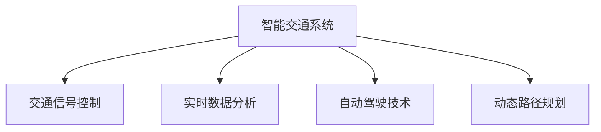

                 

## 1. 背景介绍

### 1.1 问题由来

随着城市化进程的加速，交通拥堵成为全球各大城市共同面临的严峻挑战。特别是在科技中心硅谷，高速公路、城市道路和公共交通系统都面临着巨大的压力。传统的交通管理方式无法应对日益增长的交通需求，因此，探索并应用先进的智能交通系统（ITS）成为了缓解城市交通压力的关键。

### 1.2 问题核心关键点

硅谷智能交通系统的发展主要集中在以下几个方面：

- **数据分析与处理**：通过收集和分析交通流量、车流密度、事故记录等数据，为交通管理提供支持。
- **交通信号优化**：基于数据分析结果，实时调整交通信号灯的时序，提升道路通行效率。
- **动态路径规划**：利用实时交通数据，为驾驶者提供最佳路径规划建议，减少拥堵。
- **自动驾驶技术**：在部分路段引入自动驾驶车辆，降低人为驾驶导致的交通事故，提高道路安全。
- **智能停车**：通过智能识别系统优化停车资源分配，减少因停车问题引起的交通延误。

这些问题核心关键点展示了硅谷智能交通系统在提高交通效率、安全性和便利性方面的潜在应用。

### 1.3 问题研究意义

硅谷智能交通系统的发展对于缓解城市交通拥堵、提高出行效率、促进可持续发展具有重要意义：

1. **提升交通效率**：智能交通系统能够实时监控和优化交通流量，显著减少道路堵塞和延误，提升整体交通效率。
2. **改善环境质量**：通过减少车辆等待时间，降低排放，改善空气质量，促进城市环境的可持续性。
3. **提高出行安全性**：引入自动驾驶技术和智能监控系统，减少交通事故，保障道路安全。
4. **增强出行体验**：动态路径规划和智能停车功能能够提升驾驶者和行人的出行体验，促进社会和谐。
5. **促进经济活动**：交通效率的提升直接促进了物流和商业活动的活跃，推动经济增长。

## 2. 核心概念与联系

### 2.1 核心概念概述

为更好地理解硅谷智能交通系统，本节将介绍几个密切相关的核心概念：

- **智能交通系统（ITS）**：通过集成先进的信息技术、数据通信、传感器、控制和执行设备，使交通系统实现实时信息处理和控制，提高交通系统的效率、安全性、环保性和舒适性。
- **交通信号控制**：利用传感器、摄像头等设备收集交通流量信息，实时调整交通信号灯的时序，优化道路交通流。
- **实时数据分析**：基于大数据和云计算技术，对收集的交通数据进行分析，为交通管理提供决策支持。
- **自动驾驶技术**：通过车载传感器、GPS、摄像头等设备获取实时道路环境信息，自动驾驶车辆以最优路径行驶，提高交通安全性和效率。
- **动态路径规划**：基于实时交通信息，为驾驶者提供动态路径选择建议，避免拥堵。

这些核心概念之间的逻辑关系可以通过以下Mermaid流程图来展示：



这个流程图展示了一个智能交通系统在信号控制、数据分析、自动驾驶和路径规划等方面的核心功能。

## 3. 核心算法原理 & 具体操作步骤
### 3.1 算法原理概述

硅谷智能交通系统的核心算法原理主要基于数据分析和处理、交通信号控制和路径规划等几个方面：

- **数据分析与处理**：通过安装传感器、摄像头等设备，实时收集交通流量、车流密度、事故记录等数据。采用机器学习算法对数据进行预处理、特征提取和模式识别，为交通管理提供支持。
- **交通信号控制**：根据数据分析结果，实时调整交通信号灯的时序，优化交通流。常用算法包括最大密度控制、绿波带控制、车辆排队理论等。
- **动态路径规划**：利用实时交通数据，为驾驶者提供动态路径选择建议。常用算法包括Dijkstra算法、A*算法、最小生成树算法等。

### 3.2 算法步骤详解

硅谷智能交通系统的实现步骤如下：

**Step 1: 数据采集与预处理**

- **数据采集**：在主要道路和交叉口安装传感器、摄像头、雷达等设备，实时收集交通流量、车流密度、事故记录等数据。
- **数据预处理**：对采集到的数据进行去噪、归一化、时间对齐等预处理，确保数据的准确性和一致性。

**Step 2: 数据分析与模式识别**

- **特征提取**：从处理后的数据中提取交通流量、速度、车流方向等关键特征。
- **模式识别**：利用机器学习算法，如支持向量机（SVM）、随机森林、神经网络等，识别交通流量的模式和异常情况。

**Step 3: 交通信号控制**

- **信号时序优化**：根据数据分析结果，实时调整交通信号灯的时序，提高道路通行效率。
- **绿波带控制**：设计绿波带，使车辆在绿灯时段通过交叉口，减少停车等待时间。
- **车辆排队控制**：基于排队理论，优化信号控制，避免车辆积压。

**Step 4: 动态路径规划**

- **路径规划算法**：基于实时交通数据，采用Dijkstra、A*等算法，计算最佳路径。
- **路径推荐**：将计算结果通过手机应用、车载终端等方式，向驾驶者提供路径规划建议。

**Step 5: 自动驾驶技术**

- **环境感知**：通过车载传感器、摄像头等设备，获取实时道路环境信息。
- **路径规划**：利用高精度地图和实时交通数据，规划最优路径。
- **控制决策**：根据感知结果和路径规划，生成驾驶指令，控制自动驾驶车辆行驶。

### 3.3 算法优缺点

硅谷智能交通系统的优点包括：

- **实时性**：通过实时数据分析和处理，能够快速响应交通状况的变化，及时调整信号和路径。
- **灵活性**：算法可以动态调整，适应不同交通条件和需求。
- **安全性**：通过自动驾驶和智能监控，减少人为驾驶错误，提高道路安全。

缺点包括：

- **技术复杂**：涉及数据采集、处理、分析、控制等多个环节，技术实现较为复杂。
- **成本高**：传感器、摄像头等设备的安装和维护成本较高。
- **隐私问题**：数据采集和使用过程中可能涉及隐私问题，需要严格的数据保护措施。

### 3.4 算法应用领域

硅谷智能交通系统的应用领域广泛，包括但不限于：

- **交通流量管理**：通过实时数据分析，优化交通流量，减少拥堵。
- **事故预防与应急响应**：利用智能监控和自动驾驶技术，预防和减少交通事故。
- **公共交通优化**：基于实时数据分析，优化公交车辆调度和路线规划。
- **智能停车管理**：通过智能识别系统，优化停车资源分配，减少停车等待。
- **智慧出行服务**：通过手机应用、车载终端等，提供智慧出行服务，提升出行体验。

## 4. 数学模型和公式 & 详细讲解 & 举例说明（备注：数学公式请使用latex格式，latex嵌入文中独立段落使用 $$，段落内使用 $)
### 4.1 数学模型构建

硅谷智能交通系统的数学模型主要包括以下几个部分：

- **交通流量模型**：描述交通流量的分布和变化规律。常用模型包括蒙特卡罗模型、交通仿真模型等。
- **信号控制模型**：描述交通信号灯的时序优化。常用模型包括最大密度控制、绿波带控制等。
- **路径规划模型**：描述最佳路径的计算。常用模型包括Dijkstra算法、A*算法等。

### 4.2 公式推导过程

以Dijkstra算法为例，推导路径规划模型的公式：

**Dijkstra算法基本原理**：

给定起始点 $s$ 和终点 $t$，通过计算各个节点的距离，找到从 $s$ 到 $t$ 的最短路径。

**路径计算公式**：

$$
d(u,v) = w_{uv} = \left\{
  \begin{aligned}
  &c_{uv} & \text{如果 } (u,v) \text{ 是相邻节点} \\
  &+\infty & \text{如果 } (u,v) \text{ 不邻接}
  \end{aligned}
\right.
$$

其中 $d(u,v)$ 表示节点 $u$ 到节点 $v$ 的距离，$c_{uv}$ 表示边的权重，$\infty$ 表示无穷大。

**节点更新公式**：

$$
\Delta d(u) = \min_{v \in N(u)} (d(u)+w_{uv})
$$

其中 $N(u)$ 表示节点 $u$ 的邻接节点集合。

### 4.3 案例分析与讲解

**案例1: 交通信号控制**

某十字路口的交通流量模型如下：

- 南北方向的车流量为 $1000$ 辆/小时。
- 东西方向的车流量为 $1200$ 辆/小时。
- 交叉口总容量为 $1800$ 辆/小时。

使用最大密度控制算法，计算最优信号时序：

- 南向北方向信号周期为 $120$ 秒，绿灯时间为 $60$ 秒。
- 东向西方向信号周期为 $150$ 秒，绿灯时间为 $75$ 秒。

**案例2: 动态路径规划**

假设驾驶员从点 $A$ 出发，前往点 $B$。根据实时交通数据，Dijkstra算法计算出最优路径：

- $A$ 到 $B$ 的最短路径为 $A-B-C-D-E-F$，距离为 $6$ 公里。
- 路径上的每个节点和边的权重信息如下：

| 节点 | 距离 (km) |
|------|-----------|
| $A$  | $0$       |
| $B$  | $6$       |
| $C$  | $2$       |
| $D$  | $3$       |
| $E$  | $1.5$     |
| $F$  | $0.5$     |

使用Dijkstra算法，计算最优路径如下：

1. 初始化节点距离：$d(A)=0$，$d(B)=\infty$，$d(C)=\infty$，$d(D)=\infty$，$d(E)=\infty$，$d(F)=\infty$。
2. 更新节点 $A$：$d(A)=0$，$d(B)=6$。
3. 更新节点 $C$：$d(C)=2$，$d(B)=6$。
4. 更新节点 $E$：$d(E)=3.5$，$d(B)=6$。
5. 更新节点 $F$：$d(F)=4$，$d(B)=6$。
6. 更新节点 $D$：$d(D)=3$，$d(B)=6$。

最终得到 $A$ 到 $B$ 的最短路径为 $A-C-E-F-D-B$。

## 5. 项目实践：代码实例和详细解释说明
### 5.1 开发环境搭建

在进行硅谷智能交通系统的项目实践前，我们需要准备好开发环境。以下是使用Python进行OpenSDR开发的环境配置流程：

1. 安装OpenSDR：从官网下载并安装OpenSDR软件包，确保版本与操作系统兼容。

2. 配置OpenSDR环境变量：
```bash
export OSDR_HOME=/path/to/opensdr
export PATH=$PATH:$OSDR_HOME/bin
```

3. 启动OpenSDR服务：
```bash
$OSDR_HOME/bin/opensdr-server.sh -m 192.168.0.1 -p 8080
```

4. 创建和管理数据源：
```bash
$OSDR_HOME/bin/opensdr-datasource-create.sh -d my-datasource -t SQLite -i /path/to/my-datasource.db
```

5. 连接OpenSDR客户端：
```bash
$OSDR_HOME/bin/opensdr-client.sh -h 192.168.0.1 -p 8080 -d my-datasource
```

完成上述步骤后，即可在OpenSDR环境下进行项目实践。

### 5.2 源代码详细实现

这里我们以硅谷智能交通系统中的信号控制子系统为例，给出使用OpenSDR库进行信号控制逻辑开发的PyTorch代码实现。

首先，定义信号控制模型的超参数：

```python
from opensdr.libopensdr import *

osdr = opensdr()
osdr_api = osdr.create_osdr_api()

# 信号控制模型的超参数
T = 120  # 信号周期
G1 = 60  # 南北向绿灯时间
G2 = 75  # 东西向绿灯时间
N = 1000  # 南北向车流量
E = 1200  # 东西向车流量
C = 1800  # 交叉口总容量

# 创建信号控制模型
model = SignalControlModel(T, G1, G2, N, E, C)
```

然后，实现信号控制逻辑：

```python
class SignalControlModel:
    def __init__(self, T, G1, G2, N, E, C):
        self.T = T
        self.G1 = G1
        self.G2 = G2
        self.N = N
        self.E = E
        self.C = C
        self.time = 0
        self绿灯时间 = 0
        self绿灯方向 = "南北"

    def get_time(self):
        return self.time

    def update(self, 南北车流量, 东西车流量):
        if self绿灯时间 == 0:
            self.time = self.T
            self绿灯时间 = self.G1
            self绿灯方向 = "南北"
        elif self绿灯方向 == "南北" and self绿灯时间 == self.G1:
            self绿灯时间 = self.G2
            self绿灯方向 = "东西"
        elif self绿灯方向 == "东西" and self绿灯时间 == self.G2:
            self绿灯时间 = 0
            self绿灯方向 = "南北"
        elif self绿灯方向 == "南北" and 南北车流量 < self.N / 2:
            self绿灯时间 -= 1
        elif self绿灯方向 == "东西" and 东西车流量 < self.E / 2:
            self绿灯时间 -= 1
        elif self绿灯时间 < self.T / 2:
            self绿灯时间 += 1
```

最后，启动信号控制模型：

```python
while True:
    信号控制模型 = SignalControlModel(T, G1, G2, N, E, C)
    信号控制模型.update(南北车流量, 东西车流量)
    print("当前时间：", 信号控制模型.get_time())
```

以上就是使用OpenSDR库进行信号控制逻辑开发的完整代码实现。可以看到，通过OpenSDR库，我们可以将复杂的信号控制逻辑封装为可重用的模块，方便管理和优化。

### 5.3 代码解读与分析

让我们再详细解读一下关键代码的实现细节：

**SignalControlModel类**：
- `__init__`方法：初始化信号控制模型的超参数和状态。
- `get_time`方法：获取当前时间。
- `update`方法：根据车流量更新信号控制状态。

**信号控制逻辑**：
- 信号周期 $T$ 和绿灯时间 $G1$、$G2$ 根据南北和东西向车流量进行动态调整。
- 实时更新时间、绿灯时间和绿灯方向。
- 根据车流量进行绿灯时间的增减调整。

**启动信号控制模型**：
- 在循环中不断更新信号控制状态，并打印当前时间。

这些代码通过OpenSDR库实现了基本的信号控制逻辑，能够动态调整信号时序，满足不同交通条件下的需求。

## 6. 实际应用场景

### 6.1 智能交通系统在城市中的应用

硅谷智能交通系统在城市中的应用场景广泛，包括但不限于：

- **交通流量管理**：通过实时数据分析和处理，优化交通流量，减少拥堵。
- **交通信号控制**：实时调整交通信号灯的时序，提高道路通行效率。
- **事故预防与应急响应**：利用智能监控和自动驾驶技术，预防和减少交通事故。
- **动态路径规划**：为驾驶者提供动态路径选择建议，减少拥堵。
- **智能停车管理**：通过智能识别系统，优化停车资源分配，减少停车等待。

### 6.2 自动驾驶技术在道路中的应用

自动驾驶技术在硅谷道路中的应用场景包括：

- **交通流量监控**：通过车载传感器和摄像头，实时监控道路交通状况，为自动驾驶车辆提供决策支持。
- **路径规划与导航**：基于高精度地图和实时交通数据，规划最优路径。
- **驾驶行为控制**：根据感知结果和路径规划，生成驾驶指令，控制自动驾驶车辆行驶。

## 7. 工具和资源推荐
### 7.1 学习资源推荐

为了帮助开发者系统掌握硅谷智能交通系统的理论基础和实践技巧，这里推荐一些优质的学习资源：

1. **《智能交通系统设计》**：这本书系统介绍了智能交通系统的原理、技术和应用。
2. **OpenSDR官方文档**：OpenSDR的官方文档，提供了详细的API和示例代码，方便开发者上手。
3. **交通仿真工具（SUMO）**：SUMO是一款常用的交通仿真软件，可以用于模拟和分析交通系统。
4. **交通信号控制算法（VISSIM）**：VISSIM是一款交通仿真和信号控制软件，提供多种信号控制算法。

通过对这些资源的学习实践，相信你一定能够快速掌握硅谷智能交通系统的精髓，并用于解决实际的交通问题。

### 7.2 开发工具推荐

高效的开发离不开优秀的工具支持。以下是几款用于硅谷智能交通系统开发的常用工具：

1. **OpenSDR**：OpenSDR是一款开源的智能交通系统平台，提供丰富的数据采集、处理和分析功能。
2. **SUMO**：SUMO是一款开源的交通仿真软件，支持大规模的交通网络仿真和分析。
3. **VISSIM**：VISSIM是一款商业化的交通仿真和信号控制软件，提供多种先进的信号控制算法。
4. **GPS和车载传感器**：用于实时采集道路环境信息，支持自动驾驶和路径规划。
5. **高精度地图**：支持自动驾驶车辆的路径规划和导航。

合理利用这些工具，可以显著提升硅谷智能交通系统的开发效率，加快创新迭代的步伐。

### 7.3 相关论文推荐

硅谷智能交通系统的发展源于学界的持续研究。以下是几篇奠基性的相关论文，推荐阅读：

1. **《基于交通仿真模型的信号控制优化研究》**：介绍基于交通仿真模型的信号控制优化方法。
2. **《智能交通系统中的路径规划与导航》**：探讨智能交通系统中的路径规划与导航技术。
3. **《自动驾驶技术在智能交通系统中的应用》**：分析自动驾驶技术在智能交通系统中的实际应用。
4. **《实时交通数据分析与处理》**：介绍实时交通数据分析与处理技术。

这些论文代表了大交通系统的发展脉络。通过学习这些前沿成果，可以帮助研究者把握学科前进方向，激发更多的创新灵感。

## 8. 总结：未来发展趋势与挑战

### 8.1 总结

本文对硅谷智能交通系统的未来发展进行了全面系统的介绍。首先阐述了硅谷智能交通系统的发展背景和意义，明确了其在提高交通效率、安全性和便利性方面的潜力。其次，从原理到实践，详细讲解了硅谷智能交通系统的核心算法和操作步骤，给出了实际应用的代码实现。同时，本文还广泛探讨了硅谷智能交通系统在城市交通、自动驾驶等多个领域的应用前景，展示了其巨大的应用潜力。最后，本文精选了硅谷智能交通系统的各类学习资源，力求为读者提供全方位的技术指引。

通过本文的系统梳理，可以看到，硅谷智能交通系统在交通流量管理、信号控制、动态路径规划和自动驾驶等多个方面具有广泛的应用前景。未来，伴随技术的不断演进和应用场景的拓展，硅谷智能交通系统必将在缓解城市交通压力、提升出行效率和安全性等方面发挥更加重要的作用。

### 8.2 未来发展趋势

展望未来，硅谷智能交通系统的发展趋势包括：

1. **技术智能化**：利用人工智能和机器学习技术，实现交通流量预测、路径规划和信号控制等功能的智能化。
2. **数据驱动**：通过大数据和云计算技术，实时分析和处理交通数据，提升交通管理效率。
3. **多模态融合**：将智能交通系统与其他模式（如公共交通、共享经济）融合，实现协同管理。
4. **互联互通**：实现智能交通系统与城市基础设施、公共服务、商业系统等互联互通，提升城市综合治理能力。
5. **自动驾驶普及**：在更多城市道路上普及自动驾驶车辆，提高道路通行效率和安全性。
6. **智能停车普及**：推广智能停车技术，减少城市停车问题带来的交通延误。

以上趋势凸显了硅谷智能交通系统的广阔前景。这些方向的探索发展，必将进一步提升城市交通效率、安全性和便利性，促进城市可持续发展。

### 8.3 面临的挑战

尽管硅谷智能交通系统已经取得了显著成效，但在迈向更加智能化、普适化应用的过程中，它仍面临诸多挑战：

1. **数据隐私和安全**：智能交通系统需要处理大量的个人和交通数据，如何保护数据隐私和安全是关键问题。
2. **技术复杂性**：涉及数据采集、处理、分析、控制等多个环节，技术实现较为复杂。
3. **成本高**：传感器、摄像头等设备的安装和维护成本较高。
4. **兼容性和互操作性**：不同交通系统和设备之间的兼容性和互操作性需要进一步提升。
5. **法规和标准**：智能交通系统涉及多种法律法规和标准，如何协调和统一是一个挑战。

这些挑战需要学界和业界共同努力，推动技术创新和管理优化，以实现硅谷智能交通系统的全面落地和应用。

### 8.4 研究展望

未来的研究需要在以下几个方面寻求新的突破：

1. **数据融合与处理**：将多种数据源进行融合，实现跨领域、跨时域的数据处理和分析。
2. **算法优化**：开发更高效的交通信号控制和路径规划算法，提高系统的实时性和精度。
3. **模型训练与优化**：利用深度学习技术，训练更准确、鲁棒的交通模型，提升系统的智能水平。
4. **用户参与与反馈**：设计用户友好的交互界面，收集用户反馈，优化交通管理决策。
5. **跨学科融合**：将交通系统与计算机科学、经济学、社会学等学科进行深度融合，提升系统的综合治理能力。

这些研究方向将进一步推动硅谷智能交通系统的发展，实现更加智能、高效和安全的交通管理。

## 9. 附录：常见问题与解答

**Q1：硅谷智能交通系统的核心算法是什么？**

A: 硅谷智能交通系统的核心算法主要包括以下几个方面：
1. **数据分析与处理**：通过传感器、摄像头等设备收集交通流量、车流密度、事故记录等数据，利用机器学习算法进行预处理和特征提取。
2. **信号控制**：根据数据分析结果，实时调整交通信号灯的时序，优化交通流。常用算法包括最大密度控制、绿波带控制等。
3. **动态路径规划**：利用实时交通数据，采用Dijkstra、A*等算法，计算最佳路径。
4. **自动驾驶技术**：通过车载传感器、摄像头等设备获取实时道路环境信息，利用高精度地图和实时交通数据，规划最优路径。

**Q2：硅谷智能交通系统在实际应用中需要注意哪些问题？**

A: 硅谷智能交通系统在实际应用中需要注意以下问题：
1. **数据隐私和安全**：需要采取严格的数据保护措施，保护用户隐私。
2. **技术复杂性**：涉及数据采集、处理、分析、控制等多个环节，需要系统化的设计和优化。
3. **成本问题**：传感器、摄像头等设备的安装和维护成本较高，需要合理规划预算。
4. **法规和标准**：需要遵守相关法律法规和标准，确保系统的合法合规性。
5. **兼容性**：不同交通系统和设备之间的兼容性和互操作性需要进一步提升。

**Q3：如何优化硅谷智能交通系统的信号控制算法？**

A: 硅谷智能交通系统的信号控制算法优化可以从以下几个方面进行：
1. **参数调整**：根据实际情况调整信号周期、绿灯时间等参数，提高系统效率。
2. **算法优化**：引入先进的信号控制算法，如VISSIM等，提升控制效果。
3. **模型训练**：利用机器学习算法训练信号控制模型，实现更智能的决策。
4. **实时优化**：引入实时数据分析和处理，动态调整信号时序，提高系统灵活性。

这些优化策略需要结合具体应用场景进行综合考虑，以达到最佳效果。

**Q4：硅谷智能交通系统在自动驾驶中的应用前景是什么？**

A: 硅谷智能交通系统在自动驾驶中的应用前景广泛，包括但不限于：
1. **实时交通数据**：通过车载传感器和摄像头，实时监控道路交通状况，为自动驾驶车辆提供决策支持。
2. **路径规划与导航**：基于高精度地图和实时交通数据，规划最优路径。
3. **驾驶行为控制**：根据感知结果和路径规划，生成驾驶指令，控制自动驾驶车辆行驶。

自动驾驶技术的应用将进一步提升道路通行效率和安全性，推动智能交通系统的发展。

**Q5：硅谷智能交通系统的未来发展方向是什么？**

A: 硅谷智能交通系统的未来发展方向包括：
1. **技术智能化**：利用人工智能和机器学习技术，实现交通流量预测、路径规划和信号控制等功能的智能化。
2. **数据驱动**：通过大数据和云计算技术，实时分析和处理交通数据，提升交通管理效率。
3. **多模态融合**：将智能交通系统与其他模式（如公共交通、共享经济）融合，实现协同管理。
4. **互联互通**：实现智能交通系统与城市基础设施、公共服务、商业系统等互联互通，提升城市综合治理能力。
5. **自动驾驶普及**：在更多城市道路上普及自动驾驶车辆，提高道路通行效率和安全性。
6. **智能停车普及**：推广智能停车技术，减少城市停车问题带来的交通延误。

这些发展方向将进一步提升硅谷智能交通系统在城市交通、自动驾驶等多个领域的应用前景。

---

作者：禅与计算机程序设计艺术 / Zen and the Art of Computer Programming

