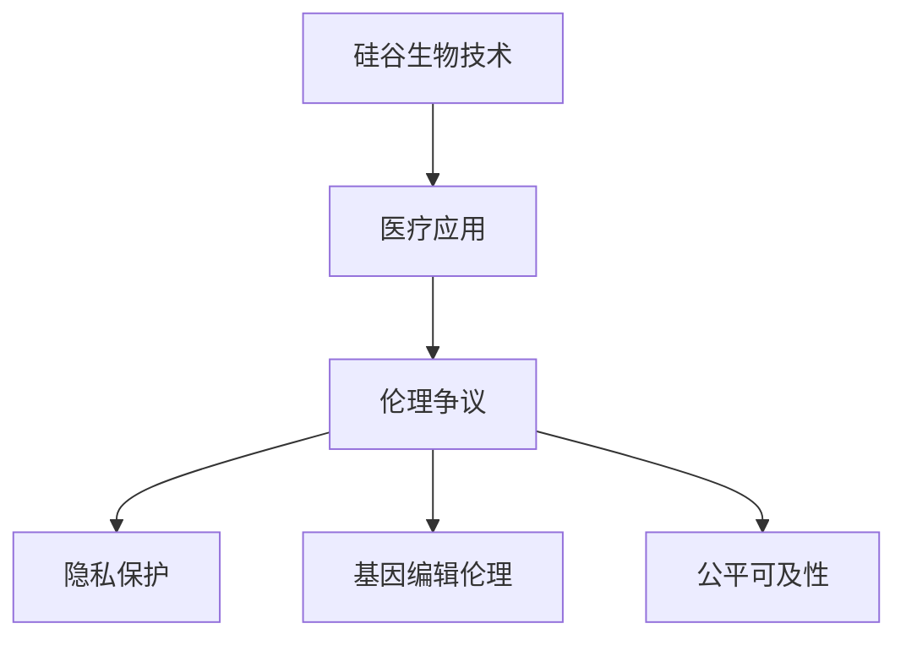

                 

# 硅谷生物技术医疗应用的伦理争议

## 1. 背景介绍

在硅谷，科技巨头们正积极投入生物技术医疗领域的研究与开发，试图通过先进技术来解决医学难题、改善人类健康。然而，随着技术的深入应用，其带来的伦理争议也日益凸显，引发了公众和学界的广泛关注。本文将深入探讨硅谷生物技术在医疗领域的应用现状、主要争议点以及未来的发展趋势，希望能为行业的发展提供有益的参考和思考。

## 2. 核心概念与联系

### 2.1 核心概念概述

- **硅谷生物技术**：指在硅谷地区，由科技公司、初创企业及研究机构推动的生物技术研发活动。重点领域包括基因编辑、合成生物学、个性化医疗等。
- **医疗应用**：指将生物技术应用于医疗领域，以解决疾病诊断、治疗、预防等医学问题，提高医疗服务质量和效率。
- **伦理争议**：指由于生物技术在医疗应用中可能引发的道德、法律和社会问题，如隐私保护、基因编辑伦理、公平可及性等。

### 2.2 核心概念原理和架构的 Mermaid 流程图



## 3. 核心算法原理 & 具体操作步骤

### 3.1 算法原理概述

硅谷生物技术的医疗应用，通常涉及复杂的数据处理、模型训练和应用部署。其核心算法原理主要包括以下几个方面：

1. **数据收集与预处理**：从临床试验、公共数据库等渠道收集医学数据，并进行清洗、归一化等预处理。
2. **模型训练**：使用机器学习或深度学习算法，构建医学诊断、预测模型。
3. **模型评估与优化**：通过交叉验证、指标评估等方法，优化模型性能，确保其在实际应用中的有效性。
4. **应用部署**：将训练好的模型部署到临床系统或移动应用中，实现医学诊断、治疗方案推荐等功能。

### 3.2 算法步骤详解

1. **数据收集与预处理**
   - 数据来源：电子健康记录、基因组测序数据、医学影像等。
   - 数据清洗：去除缺失值、异常值，标准化数据格式。
   - 数据集划分：将数据分为训练集、验证集和测试集，确保模型训练和评估的可靠性。

2. **模型训练**
   - 选择合适的算法：如决策树、支持向量机、深度神经网络等。
   - 特征工程：提取、选择、构造特征，提升模型性能。
   - 超参数调优：通过网格搜索、随机搜索等方法，找到最佳超参数组合。

3. **模型评估与优化**
   - 交叉验证：通过K折交叉验证，评估模型泛化能力。
   - 性能指标：如准确率、召回率、F1分数等，衡量模型效果。
   - 模型优化：调整算法参数、优化损失函数，提升模型性能。

4. **应用部署**
   - API接口设计：定义API接口，实现模型服务的调用。
   - 部署平台选择：选择合适的云平台或本地服务器，部署模型。
   - 监控与维护：实时监控模型性能，定期维护更新模型参数。

### 3.3 算法优缺点

**优点**：
- 数据驱动：基于大量数据训练的模型，能够提供更准确的医学预测和治疗方案。
- 技术先进：利用深度学习等先进算法，提升医学诊断和治疗的精度和效率。
- 适用范围广：适用于多种医学问题和应用场景，具有较强的通用性。

**缺点**：
- 数据隐私：医疗数据的隐私保护问题，如何确保数据安全，避免信息泄露。
- 伦理争议：基因编辑、人工智能辅助决策等技术可能引发伦理争议，需要慎重考虑。
- 公平性问题：算法偏见可能导致不同群体间的不公平，需要关注模型公正性。

### 3.4 算法应用领域

硅谷生物技术的医疗应用广泛，涵盖以下几个主要领域：

1. **基因编辑**：利用CRISPR-Cas9等技术，直接修改基因序列，治疗遗传疾病。
2. **个性化医疗**：基于基因组数据，定制个性化治疗方案，提升治疗效果。
3. **医学影像**：利用深度学习算法，分析医学影像，辅助诊断肿瘤、心脏病等疾病。
4. **健康监测**：通过可穿戴设备收集生理数据，实时监测健康状况，预防疾病。
5. **药物研发**：利用AI和大数据分析，加速药物发现和研发，降低成本。

## 4. 数学模型和公式 & 详细讲解 & 举例说明

### 4.1 数学模型构建

在硅谷生物技术的医疗应用中，常见的数学模型包括决策树、支持向量机、深度神经网络等。这里以深度神经网络为例，介绍其构建过程。

### 4.2 公式推导过程

以一个简单的多分类问题为例，假设输入数据为 $x$，输出为 $y$，其中 $y \in \{1,2,3\}$。使用Softmax回归模型进行多分类预测，模型公式为：

$$
P(y|x) = \frac{e^{xWy+b}}{\sum_{j=1}^{K} e^{xWj+b}}
$$

其中 $W$ 为权重矩阵，$b$ 为偏置项，$K$ 为类别数。

### 4.3 案例分析与讲解

以医学影像分类为例，使用卷积神经网络(CNN)模型对医学影像进行分类。首先，对影像数据进行预处理，然后通过多个卷积层和池化层提取特征，最后通过全连接层输出分类结果。模型训练过程中，通过交叉熵损失函数进行优化，确保模型能够准确预测医学影像的类别。

## 5. 项目实践：代码实例和详细解释说明

### 5.1 开发环境搭建

- **安装Python和相关库**：在Python环境中安装TensorFlow、Keras等深度学习库。
- **准备数据集**：收集并准备医学影像数据集，进行数据清洗和预处理。
- **设计模型架构**：使用Keras设计卷积神经网络模型架构。
- **模型训练与评估**：通过TensorFlow训练模型，使用准确率、召回率等指标评估模型效果。
- **应用部署**：将训练好的模型部署到临床系统中，实现医学影像分类。

### 5.2 源代码详细实现

```python
import tensorflow as tf
from tensorflow.keras import layers, models

# 构建卷积神经网络模型
model = models.Sequential([
    layers.Conv2D(32, (3, 3), activation='relu', input_shape=(32, 32, 3)),
    layers.MaxPooling2D((2, 2)),
    layers.Conv2D(64, (3, 3), activation='relu'),
    layers.MaxPooling2D((2, 2)),
    layers.Conv2D(64, (3, 3), activation='relu'),
    layers.Flatten(),
    layers.Dense(64, activation='relu'),
    layers.Dense(3, activation='softmax')
])

# 编译模型
model.compile(optimizer='adam', loss='categorical_crossentropy', metrics=['accuracy'])

# 训练模型
model.fit(train_images, train_labels, epochs=10, validation_data=(val_images, val_labels))

# 评估模型
test_loss, test_acc = model.evaluate(test_images, test_labels)
print('Test accuracy:', test_acc)
```

### 5.3 代码解读与分析

- **模型构建**：使用Keras构建卷积神经网络模型，包括多个卷积层和全连接层。
- **模型编译**：指定优化器、损失函数和评估指标，准备训练模型。
- **模型训练**：使用训练集进行模型训练，并通过验证集评估模型性能。
- **模型评估**：在测试集上评估模型效果，输出准确率。

## 6. 实际应用场景

### 6.1 基因编辑技术的应用

基因编辑技术在硅谷广泛应用于遗传疾病的治疗。例如，利用CRISPR-Cas9技术，可以直接修改患者细胞中的特定基因，修复突变基因，实现基因治疗。

### 6.2 个性化医疗的实践

基于基因组数据，硅谷的生物技术公司正在开发个性化药物和治疗方案。通过分析患者基因特征，定制个性化的治疗方案，提升治疗效果。

### 6.3 医学影像分析的案例

硅谷的深度学习公司利用深度神经网络，对医学影像进行分类和分析，辅助医生进行疾病诊断，提高诊断准确率。

### 6.4 未来应用展望

未来，硅谷的生物技术将进一步拓展应用场景，推动医学领域的创新发展：

1. **精准医疗**：基于基因组数据和人工智能技术，实现精准诊断和治疗。
2. **智能健康监测**：利用可穿戴设备，实时监测健康状况，预防疾病。
3. **药物研发加速**：利用AI和大数据分析，加速新药发现和研发过程。
4. **医疗机器人**：结合机器人技术和人工智能，提供更智能化的医疗服务。

## 7. 工具和资源推荐

### 7.1 学习资源推荐

- **在线课程**：Coursera、edX等平台提供深度学习、医疗大数据等在线课程，适合初学者入门。
- **书籍**：《深度学习》（Goodfellow等）、《人工智能与医疗》（Goldsmith等）等书籍，详细介绍了相关理论和应用。
- **论文**：访问arXiv、PubMed等平台，获取最新的生物技术和医学应用研究论文。

### 7.2 开发工具推荐

- **深度学习框架**：TensorFlow、PyTorch、Keras等深度学习框架，提供丰富的API和工具库。
- **数据处理工具**：Pandas、NumPy等数据处理库，支持高效的数据清洗和分析。
- **可视化工具**：Matplotlib、Seaborn等数据可视化工具，帮助分析和展示数据。

### 7.3 相关论文推荐

- **基因编辑**：《CRISPR-Cas9在基因编辑中的应用》（Cong等）
- **医学影像**：《深度学习在医学影像分析中的应用》（Russakovsky等）
- **个性化医疗**：《基于基因组数据的个性化医疗》（Wilson等）

## 8. 总结：未来发展趋势与挑战

### 8.1 研究成果总结

硅谷生物技术在医疗领域的应用取得了显著进展，但也面临着隐私保护、伦理争议等挑战。未来，需要在技术创新和伦理规范之间找到平衡点，推动技术健康发展。

### 8.2 未来发展趋势

未来，硅谷的生物技术将在以下方面持续发展：

1. **技术创新**：不断突破基因编辑、深度学习等技术瓶颈，提升医疗应用的效果和效率。
2. **多学科融合**：与其他学科（如工程、社会学）结合，形成更加综合的解决方案。
3. **全球合作**：加强国际合作，共享数据和研究成果，推动全球医疗健康发展。

### 8.3 面临的挑战

硅谷生物技术在医疗应用中面临以下挑战：

1. **隐私保护**：医疗数据的隐私保护问题，如何确保数据安全，避免信息泄露。
2. **伦理争议**：基因编辑、人工智能辅助决策等技术可能引发伦理争议，需要慎重考虑。
3. **公平性问题**：算法偏见可能导致不同群体间的不公平，需要关注模型公正性。

### 8.4 研究展望

未来研究需要在以下方面进一步深入：

1. **隐私保护技术**：开发更加安全的隐私保护技术，确保医疗数据的隐私。
2. **伦理规范**：建立明确的伦理规范和指导原则，引导技术健康发展。
3. **模型公正性**：研究算法偏见和公平性问题，确保模型的公正性和可解释性。

## 9. 附录：常见问题与解答

### 9.1 问题1：硅谷生物技术在医疗领域的应用现状如何？

**回答**：硅谷的生物技术公司在基因编辑、个性化医疗、医学影像等领域取得了显著进展。基因编辑技术在遗传疾病治疗中展现出巨大潜力，个性化医疗基于基因组数据，提升治疗效果，医学影像分析帮助医生进行疾病诊断。

### 9.2 问题2：硅谷生物技术在医疗应用中面临的主要伦理争议有哪些？

**回答**：主要伦理争议包括隐私保护、基因编辑伦理、公平可及性等。隐私保护问题关注如何确保医疗数据的隐私安全，基因编辑伦理涉及如何处理基因编辑的道德问题，公平可及性关注不同群体间的公平问题。

### 9.3 问题3：未来硅谷生物技术在医疗领域的应用展望是什么？

**回答**：未来展望包括精准医疗、智能健康监测、药物研发加速、医疗机器人等。精准医疗结合基因组数据和人工智能技术，实现精准诊断和治疗；智能健康监测利用可穿戴设备，实时监测健康状况；药物研发加速利用AI和大数据分析，加速新药发现；医疗机器人结合技术和人工智能，提供智能化的医疗服务。

---

作者：禅与计算机程序设计艺术 / Zen and the Art of Computer Programming

