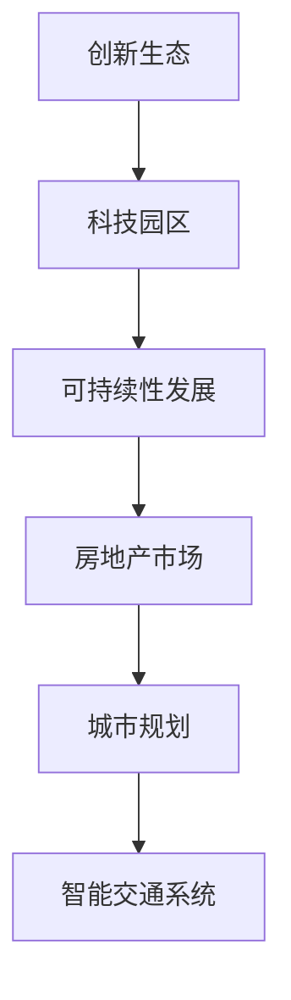

                 

# 硅谷的城市规划:创新社区的建设

> 关键词：硅谷, 城市规划, 创新社区, 科技园区, 可持续性, 创新生态, 房地产市场

## 1. 背景介绍

### 1.1 问题由来
硅谷作为全球科技创新的中心，汇聚了世界各地的优秀人才，推动了互联网、人工智能、生物科技等多个领域的飞速发展。然而，随着技术的不断进步和人口的不断增加，硅谷在城市规划、交通、住房等方面面临诸多挑战。如何在保持创新活力的同时，提升城市的宜居性和可持续发展能力，成为了硅谷未来发展的重要课题。

### 1.2 问题核心关键点
硅谷的城市规划创新社区的建设主要关注以下几个核心关键点：

1. **创新生态构建**：吸引并留住全球顶尖的科技人才，形成良好的创新生态。
2. **交通系统优化**：建设高效的交通网络，缓解拥堵问题。
3. **住房问题解决**：满足高科技人才的住房需求，缓解房价高涨带来的压力。
4. **可持续性发展**：推动绿色建筑和清洁能源的使用，减少环境污染。
5. **城市环境改善**：提升城市绿化和公共空间质量，提升居民生活质量。

通过系统性、科学性的城市规划，硅谷旨在构建一个既能吸引全球人才，又能持续发展的创新社区。

## 2. 核心概念与联系

### 2.1 核心概念概述

为更好地理解硅谷的城市规划创新社区的建设，本节将介绍几个关键概念：

- **创新生态**：指在特定区域内，汇聚企业、研究机构、投资机构等创新资源，形成良好的创新循环系统。
- **科技园区**：专门用于科技研发和创新创业的园区，提供良好的基础设施和创新环境。
- **可持续性发展**：通过绿色建筑、清洁能源、生态农业等措施，实现经济、社会、环境的全面协调发展。
- **房地产市场**：包含住宅、商业地产、工业用地等多种类型的房地产市场，是城市发展的重要组成部分。
- **城市规划**：政府或规划机构对城市空间布局、基础设施、公共服务等方面的系统性安排和规划。
- **智能交通系统**：利用信息技术和大数据分析，优化交通管理，提升交通效率和安全性。

这些概念之间的逻辑关系可以通过以下Mermaid流程图来展示：



这个流程图展示了一些关键概念及其之间的关系：

1. 创新生态是科技园区建设的基础。
2. 科技园区需要考虑可持续性发展和房地产市场布局。
3. 城市规划是整体性设计，需要协调科技园区、智能交通等各个方面的内容。
4. 智能交通系统是城市规划的重要组成部分。

## 3. 核心算法原理 & 具体操作步骤
### 3.1 算法原理概述

硅谷的城市规划创新社区建设，本质上是一个复杂的系统性工程。其核心算法原理可以概括为以下几个方面：

1. **多目标优化**：城市规划需要同时优化多个目标，如经济增长、环境保护、交通效率等。
2. **数据驱动决策**：通过大数据分析和人工智能技术，辅助决策者做出科学合理的规划。
3. **动态调整**：城市规划需要考虑未来的变化，如人口增长、技术迭代等，需要灵活调整。
4. **多方参与**：城市规划需要政府、企业、居民等多方共同参与，形成合力。

### 3.2 算法步骤详解

硅谷的城市规划创新社区建设可以分为以下几个关键步骤：

**Step 1: 需求分析**
- 收集城市人口、交通流量、住房需求、环境质量等数据，进行系统分析。
- 识别城市发展的关键问题和优先级。

**Step 2: 规划设计**
- 制定多目标优化模型，包括经济、环境、交通等多个维度。
- 引入数据驱动的方法，如机器学习、模拟仿真等，辅助设计决策。
- 确定各区域的功能定位，如科技园区、居住区、商业区等。

**Step 3: 实施执行**
- 制定详细的实施计划和时间表。
- 采用分阶段、分区域的方式逐步推进规划实施。
- 动态监测和评估规划效果，及时调整优化。

**Step 4: 评估反馈**
- 定期对规划效果进行评估，对比目标和实际效果。
- 收集多方反馈，包括政府、企业、居民等。
- 根据反馈结果，进行持续改进和优化。

### 3.3 算法优缺点

硅谷的城市规划创新社区建设方法具有以下优点：

1. **系统性**：通过多目标优化模型，全面考虑城市发展的各个方面。
2. **科学性**：利用数据驱动决策，提高规划的准确性和合理性。
3. **灵活性**：动态调整规划，适应未来的变化。
4. **多方参与**：多方参与提高规划的可行性和执行力。

同时，该方法也存在一些局限性：

1. **复杂性**：规划涉及多个目标和变量，模型复杂度高。
2. **资源需求**：需要大量数据和计算资源进行建模和仿真。
3. **长期效果不确定性**：规划效果受未来变化影响较大。
4. **实施难度**：多目标优化可能存在利益冲突，协调难度大。

尽管存在这些局限性，但就目前而言，硅谷的城市规划创新社区建设方法仍然是城市规划的先进范式。未来相关研究的重点在于如何进一步降低规划的复杂性，提高资源利用效率，同时兼顾多目标优化和多方参与。

### 3.4 算法应用领域

硅谷的城市规划创新社区建设方法在多个领域得到了广泛的应用，例如：

- **科技园区建设**：制定科技园区的空间布局、功能分区、交通规划等。
- **房地产市场调控**：通过规划指导房地产市场的健康发展，调控房价和供需平衡。
- **环境保护**：推动绿色建筑和清洁能源的使用，减少环境污染。
- **智能交通系统优化**：构建高效的智能交通系统，缓解城市交通拥堵。
- **公共服务提升**：改善公共空间和基础设施，提升居民生活质量。

除了上述这些经典应用外，硅谷的城市规划创新社区建设方法还催生了更多新的研究方向和应用场景，如智慧城市、数字政府、绿色金融等，为城市发展的智能化和可持续发展提供了新的思路。

## 4. 数学模型和公式 & 详细讲解
### 4.1 数学模型构建

硅谷的城市规划创新社区建设涉及多个领域的数学模型，以下以科技园区规划为例，构建一个简单的多目标优化模型：

- **目标函数**：
  - 经济目标：最大化科技园区内企业的创新产出和经济收益。
  - 环境目标：最小化科技园区内的能源消耗和碳排放。
  - 交通目标：最小化科技园区内的交通拥堵和出行时间。

- **约束条件**：
  - 土地面积约束：科技园区总土地面积不超过设定的上限。
  - 基础设施约束：园区内必须配备必要的交通、能源、通信等基础设施。
  - 环保约束：必须满足一定的环保标准，如绿化率、污染物排放等。

### 4.2 公式推导过程

以下我们以科技园区经济目标为例，推导多目标优化模型中的经济目标函数。

假设科技园区内有 $n$ 家企业，每家企业的创新产出为 $x_i$，收益为 $y_i$，目标函数为：

$$
\max \sum_{i=1}^n \left(\alpha_i x_i + \beta_i y_i\right)
$$

其中 $\alpha_i$ 和 $\beta_i$ 分别为创新产出和收益的权重系数。目标函数表示，在权重系数一定的情况下，最大化创新产出和经济收益的加权和。

### 4.3 案例分析与讲解

假设某科技园区内有 5 家企业，创新产出和收益如表所示：

| 企业 | 创新产出 | 收益 |
| --- | --- | --- |
| A | 100 | 1000 |
| B | 80 | 800 |
| C | 60 | 600 |
| D | 40 | 400 |
| E | 20 | 200 |

设 $\alpha = 0.5$，$\beta = 0.5$，则经济目标函数为：

$$
\max \left(0.5 \times (100 + 80 + 60 + 40 + 20) + 0.5 \times (1000 + 800 + 600 + 400 + 200)\right) = \max (600 + 3600) = 4200
$$

根据上述方法，可以构建和求解多目标优化模型，辅助科技园区的规划设计。

## 5. 项目实践：代码实例和详细解释说明
### 5.1 开发环境搭建

在进行项目实践前，我们需要准备好开发环境。以下是使用Python进行Python编程的开发环境配置流程：

1. 安装Anaconda：从官网下载并安装Anaconda，用于创建独立的Python环境。

2. 创建并激活虚拟环境：
```bash
conda create -n py-env python=3.8 
conda activate py-env
```

3. 安装必要的库：
```bash
pip install numpy pandas matplotlib scikit-learn
```

4. 准备数据集：收集科技园区规划相关的数据，如企业数量、创新产出、收益、土地面积、环保标准等。

### 5.2 源代码详细实现

以下是一个简单的Python代码，用于计算科技园区经济目标函数：

```python
import numpy as np

# 定义企业数据
innovations = np.array([100, 80, 60, 40, 20])
profits = np.array([1000, 800, 600, 400, 200])
weights = np.array([0.5, 0.5])

# 计算经济目标
economic_objective = weights[0] * np.sum(innovations) + weights[1] * np.sum(profits)
print("经济目标函数值为：", economic_objective)
```

### 5.3 代码解读与分析

让我们再详细解读一下关键代码的实现细节：

**数据定义**：
- `innovations`和`profits`数组分别表示企业创新产出和收益。
- `weights`数组表示创新产出和收益的权重系数。

**目标计算**：
- 通过加权和计算经济目标函数值。

**输出结果**：
- 打印出经济目标函数值，以供后续优化和决策。

这个代码实现简单明了，但并不完整，实际应用中需要更复杂的数据处理和模型构建。

## 6. 实际应用场景
### 6.1 智能城市建设

硅谷的城市规划创新社区建设方法，在智能城市建设中得到了广泛应用。智能城市通过物联网、云计算、大数据等技术手段，实现对城市各个方面的智能化管理，提升城市运行效率和生活质量。

在科技园区建设中，智能城市可以实现园区内智能交通、智能安防、智能能源等系统的集成，提升园区管理水平。例如，通过智能交通系统，可以实现实时交通流量监控和动态调整，优化出行路线，减少交通拥堵。

### 6.2 数字政府构建

数字政府建设是政府向服务型政府转型的重要方向。通过城市规划创新社区建设方法，可以实现政府服务的智能化和数字化，提高行政效率和公共服务水平。

在数字政府建设中，可以通过城市规划构建统一的数据平台，集成各类政府服务和公共资源，实现一站式服务。例如，通过智能城市管理系统，可以实现跨部门信息共享和协同办公，提升政府决策和执行效率。

### 6.3 绿色金融发展

绿色金融是金融行业向可持续性发展转型的重要方向。通过城市规划创新社区建设方法，可以实现绿色金融的落地应用，推动环境保护和可持续发展。

在绿色金融发展中，可以通过城市规划构建绿色金融平台，集成各类环保项目和绿色投资，推动绿色技术和产业的发展。例如，通过绿色债券发行，支持绿色企业和项目的发展，实现经济、环境和社会的协调发展。

### 6.4 未来应用展望

未来，硅谷的城市规划创新社区建设方法将在更多领域得到应用，为城市发展和创新生态构建提供新的思路和工具。

在智慧医疗领域，智能城市和数字政府的技术手段可以应用于医疗服务管理，实现医疗资源优化配置和健康数据分析，提升医疗服务质量。

在智能制造领域，智能城市和数字政府的技术手段可以应用于工业互联网和智能制造平台，实现生产过程的智能化和柔性化，提升制造企业的竞争力。

在数字农业领域，智能城市和数字政府的技术手段可以应用于农业物联网和智能农业系统，实现农业生产过程的智能化和精准化，提升农业生产效率和质量。

## 7. 工具和资源推荐
### 7.1 学习资源推荐

为了帮助开发者系统掌握硅谷的城市规划创新社区建设理论基础和实践技巧，这里推荐一些优质的学习资源：

1. 《智能城市：从规划到建设》系列博文：深入介绍智能城市的概念、规划和建设方法，结合硅谷案例进行详细讲解。

2. 《数字政府建设》课程：介绍数字政府的理论基础和实践方法，通过硅谷案例进行实例分析。

3. 《绿色金融发展》书籍：介绍绿色金融的理论和实践，结合硅谷的绿色金融项目进行详细讲解。

4. CS224N《人工智能与城市管理》课程：斯坦福大学开设的课程，系统介绍人工智能在城市管理中的应用，结合硅谷案例进行讲解。

5. 《智慧城市与可持续发展》论文：系统分析智慧城市的概念、技术和应用，结合硅谷的智慧城市项目进行详细讲解。

通过对这些资源的学习实践，相信你一定能够快速掌握硅谷的城市规划创新社区建设的精髓，并用于解决实际的智能城市和数字政府问题。

### 7.2 开发工具推荐

高效的开发离不开优秀的工具支持。以下是几款用于硅谷的城市规划创新社区建设开发的常用工具：

1. Python：基于Python的开源编程语言，灵活动态的计算图，适合快速迭代研究。

2. Jupyter Notebook：开源的交互式编程环境，支持代码运行和结果展示，方便开发者进行数据分析和模型实验。

3. Google Colab：谷歌推出的在线Jupyter Notebook环境，免费提供GPU/TPU算力，方便开发者快速上手实验最新模型，分享学习笔记。

4. Weights & Biases：模型训练的实验跟踪工具，可以记录和可视化模型训练过程中的各项指标，方便对比和调优。

5. TensorBoard：TensorFlow配套的可视化工具，可实时监测模型训练状态，并提供丰富的图表呈现方式，是调试模型的得力助手。

6. GitHub：代码托管平台，支持版本控制和协作开发，方便开发者进行代码共享和项目管理。

合理利用这些工具，可以显著提升硅谷的城市规划创新社区建设任务的开发效率，加快创新迭代的步伐。

### 7.3 相关论文推荐

硅谷的城市规划创新社区建设技术的发展源于学界的持续研究。以下是几篇奠基性的相关论文，推荐阅读：

1. 《智慧城市规划与建设》论文：系统介绍智慧城市的概念、规划和建设方法，结合硅谷案例进行详细讲解。

2. 《数字政府建设与实践》论文：介绍数字政府的理论基础和实践方法，结合硅谷案例进行实例分析。

3. 《绿色金融发展与实践》论文：介绍绿色金融的理论和实践，结合硅谷的绿色金融项目进行详细讲解。

4. 《智能城市管理系统设计与实现》论文：系统分析智能城市的概念、技术和应用，结合硅谷的智慧城市项目进行详细讲解。

5. 《城市规划创新社区建设理论与实践》论文：系统分析城市规划创新社区建设的理论基础和实践方法，结合硅谷的案例进行详细讲解。

这些论文代表了大语言模型微调技术的发展脉络。通过学习这些前沿成果，可以帮助研究者把握学科前进方向，激发更多的创新灵感。

## 8. 总结：未来发展趋势与挑战
### 8.1 总结

本文对硅谷的城市规划创新社区建设方法进行了全面系统的介绍。首先阐述了城市规划在科技创新中的重要性，明确了创新生态、科技园区、可持续性等关键概念及其关系。其次，从原理到实践，详细讲解了多目标优化、数据驱动决策等核心算法原理和操作步骤。最后，探讨了基于大数据和人工智能的创新社区建设方法在多个领域的应用前景，推荐了相关的学习资源、开发工具和研究论文。

通过本文的系统梳理，可以看到，硅谷的城市规划创新社区建设方法已经成为城市规划的先进范式，极大地推动了城市的创新发展和可持续发展。未来，伴随技术的不断进步和应用的持续探索，硅谷的城市规划创新社区建设将更加完善和高效，为全球城市提供可借鉴的经验和模式。

### 8.2 未来发展趋势

展望未来，硅谷的城市规划创新社区建设方法将呈现以下几个发展趋势：

1. **智能化水平提升**：通过大数据和人工智能技术，进一步提升城市管理的智能化水平，实现实时监测和智能决策。
2. **多模态融合**：推动智慧城市和数字政府的多模态融合，实现物联网、大数据、人工智能等技术的协同应用。
3. **持续优化**：采用动态调整和持续优化的方式，及时应对城市发展的变化和挑战。
4. **多方参与**：推动政府、企业、居民等各方的共同参与，形成合力，提升城市规划的效果和可执行性。
5. **可持续发展**：注重绿色建筑、清洁能源、生态农业等措施，推动城市的可持续发展。

以上趋势凸显了硅谷的城市规划创新社区建设方法的广阔前景。这些方向的探索发展，必将进一步提升城市的创新能力和宜居性，为全球城市规划提供新的思路和方向。

### 8.3 面临的挑战

尽管硅谷的城市规划创新社区建设方法已经取得了瞩目成就，但在迈向更加智能化、普适化应用的过程中，它仍面临着诸多挑战：

1. **数据获取难度大**：城市规划需要大量数据支持，但数据获取难度大，成本高。如何高效获取和利用数据，将是重要的挑战。
2. **技术门槛高**：城市规划涉及多个领域的复杂问题，需要高水平的技术和知识支撑。如何降低技术门槛，普及相关技术，将是重要的课题。
3. **多方利益协调**：城市规划涉及政府、企业、居民等多方利益，如何协调各方利益，达成共识，将是重要的挑战。
4. **长期效果不确定性**：城市规划效果的评估和优化需要时间和持续投入，如何确保长期效果，将是重要的挑战。

尽管存在这些挑战，但通过不断探索和创新，硅谷的城市规划创新社区建设方法必将在未来的发展中克服困难，继续推动城市的创新和发展。

### 8.4 研究展望

未来，硅谷的城市规划创新社区建设方法需要在以下几个方面进行更深入的研究：

1. **数据驱动的城市规划**：利用大数据和人工智能技术，实现城市规划的智能化和科学化。
2. **多方协同的城市规划**：推动政府、企业、居民等多方的共同参与和协作，形成合力，提升城市规划的效果和可执行性。
3. **绿色低碳的城市规划**：注重绿色建筑、清洁能源、生态农业等措施，推动城市的可持续发展。
4. **智能交通系统的优化**：通过智能交通系统，优化城市交通管理，提升交通效率和安全性。
5. **公共服务系统的提升**：改善公共空间和基础设施，提升居民生活质量。

这些研究方向的研究突破，必将进一步提升硅谷的城市规划创新社区建设水平，为全球城市提供可借鉴的经验和模式。

## 9. 附录：常见问题与解答

**Q1：城市规划创新社区建设需要考虑哪些关键问题？**

A: 城市规划创新社区建设需要考虑以下几个关键问题：

1. **创新生态**：吸引并留住全球顶尖的科技人才，形成良好的创新生态。
2. **交通系统优化**：建设高效的交通网络，缓解拥堵问题。
3. **住房问题解决**：满足高科技人才的住房需求，缓解房价高涨带来的压力。
4. **可持续性发展**：推动绿色建筑和清洁能源的使用，减少环境污染。
5. **城市环境改善**：提升城市绿化和公共空间质量，提升居民生活质量。

通过系统性、科学性的城市规划，硅谷旨在构建一个既能吸引全球人才，又能持续发展的创新社区。

**Q2：如何选择合适的城市规划目标？**

A: 城市规划目标的选择需要考虑多个方面，包括：

1. **经济目标**：提升城市经济活力和竞争力。
2. **环境目标**：改善城市生态环境和居民生活质量。
3. **社会目标**：提升城市公共服务水平和居民幸福感。
4. **交通目标**：优化城市交通系统，缓解拥堵问题。
5. **基础设施目标**：完善城市基础设施，提升城市运行效率。

根据不同城市的实际情况和优先级，选择合适的目标，进行多目标优化。

**Q3：城市规划创新社区建设需要哪些数据支持？**

A: 城市规划创新社区建设需要以下关键数据：

1. **人口数据**：城市人口数量、分布、增长率等。
2. **交通数据**：交通流量、拥堵情况、交通事故等。
3. **住房数据**：房价、租金、供需情况等。
4. **环境数据**：绿地率、空气质量、能源消耗等。
5. **基础设施数据**：道路、公园、学校、医院等公共设施的数量和质量。

通过数据分析和建模，辅助城市规划决策。

**Q4：城市规划创新社区建设面临哪些挑战？**

A: 城市规划创新社区建设面临以下挑战：

1. **数据获取难度大**：城市规划需要大量数据支持，但数据获取难度大，成本高。
2. **技术门槛高**：城市规划涉及多个领域的复杂问题，需要高水平的技术和知识支撑。
3. **多方利益协调**：城市规划涉及政府、企业、居民等多方利益，如何协调各方利益，达成共识，将是重要的挑战。
4. **长期效果不确定性**：城市规划效果的评估和优化需要时间和持续投入，如何确保长期效果，将是重要的挑战。

尽管存在这些挑战，但通过不断探索和创新，硅谷的城市规划创新社区建设方法必将在未来的发展中克服困难，继续推动城市的创新和发展。

**Q5：如何确保城市规划的长期效果？**

A: 确保城市规划的长期效果，需要采取以下措施：

1. **持续监测和评估**：定期对规划效果进行监测和评估，及时发现问题并进行调整。
2. **动态调整**：根据城市发展的变化，及时调整和优化规划方案。
3. **多方参与**：推动政府、企业、居民等多方的共同参与和协作，形成合力，提升城市规划的效果和可执行性。
4. **技术创新**：采用最新的技术手段，提高城市规划的智能化和科学化水平。

只有从数据、技术、多方参与等多个维度进行全面优化，才能确保城市规划的长期效果。

