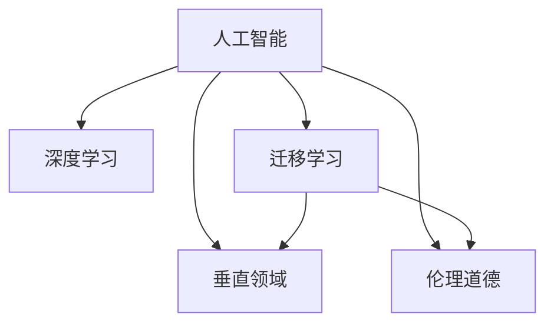

                 

## 1. 背景介绍

### 1.1 问题由来
硅谷作为全球科技创新中心，一直以开放、包容、多元化著称。近年来，人工智能(AI)技术迅猛发展，AI企业纷纷在硅谷崛起，推动了AI应用在各个垂直领域的创新。然而，在AI企业迅猛发展的同时，也面临着诸多挑战，如技术瓶颈、市场竞争、伦理道德等。本文旨在通过探讨AI企业在硅谷的多元化发展，剖析其创新路径，探索垂直领域独特价值，为AI技术在实际应用中的推广提供参考。

### 1.2 问题核心关键点
AI企业在硅谷的多元化发展，主要涉及以下几个核心关键点：
- **技术创新**：如何突破AI核心技术，开发适用于垂直领域的新算法、新架构。
- **市场拓展**：如何精准定位市场需求，构建符合垂直领域特性的AI产品和服务。
- **伦理道德**：如何在商业化过程中平衡技术进步与伦理道德的边界。
- **国际化**：如何整合全球资源，拓展国际市场，推动AI技术的全球化应用。
- **可持续性**：如何在商业发展与环保、社会责任之间找到平衡点，实现可持续发展。

### 1.3 问题研究意义
研究AI企业在硅谷的多元化发展，对于理解AI技术的商业化路径、推动AI技术的垂直领域应用、探索AI技术的伦理道德边界、实现AI技术的可持续发展具有重要意义：

1. **技术普及**：通过剖析AI企业在垂直领域的创新实践，为技术开发者提供借鉴和指导，促进AI技术的更广泛应用。
2. **市场探索**：通过了解AI企业在市场定位、产品构建方面的经验，帮助更多企业成功进入AI市场，实现商业价值。
3. **伦理规范**：通过讨论AI企业在伦理道德方面的挑战与应对，引导AI企业建立更加负责任的技术开发和应用环境。
4. **可持续发展**：通过探讨AI企业的国际化与可持续发展策略，促进AI技术与全球资源的深度整合，推动AI技术的全球化应用。

## 2. 核心概念与联系

### 2.1 核心概念概述

为了更好地理解AI企业在硅谷的多元化发展，本节将介绍几个关键概念：

- **人工智能(AI)**：以计算机科学、认知科学、统计学等为基础，通过模拟人类智能，使机器能够自主学习、推理和解决问题的技术。
- **深度学习**：一种特殊的机器学习技术，通过多层神经网络，模仿人脑处理信息的方式，进行特征提取和模式识别。
- **迁移学习**：将在一个任务上学习到的知识迁移到另一个相关任务上，以提高模型在新任务上的性能。
- **垂直领域**：指特定行业或应用场景，如医疗、金融、教育等，针对这些领域的特定需求进行AI技术的定制化开发。
- **伦理道德**：AI技术开发和应用过程中需要遵守的道德准则和法律法规，涉及数据隐私、算法透明、社会公平等多个方面。

这些核心概念之间的逻辑关系可以通过以下Mermaid流程图来展示：



这个流程图展示了大语言模型的核心概念及其之间的关系：

1. 人工智能技术通过深度学习和迁移学习等技术手段，提升了模型的智能水平和适应能力。
2. 深度学习和迁移学习在垂直领域的应用，使AI模型能够更好地满足特定行业的需求。
3. 在垂直领域的应用中，伦理道德的考虑至关重要，确保AI技术的开发和应用符合社会价值观和法律法规。

## 3. 核心算法原理 & 具体操作步骤
### 3.1 算法原理概述

AI企业在硅谷的多元化发展，基于深度学习技术，通过对垂直领域数据的深度分析，提取有价值的特征，训练出适合特定行业需求的AI模型。其主要算法原理如下：

- **深度学习**：通过多层神经网络，模拟人脑的层次化信息处理机制，进行特征提取和模式识别。
- **迁移学习**：利用已有模型在特定任务上的知识，在新任务上进行微调，提升模型在新领域的表现。
- **垂直领域算法**：针对特定垂直领域的需求，开发具有行业特色的算法，如自然语言处理、计算机视觉、机器人控制等。

### 3.2 算法步骤详解

AI企业在硅谷的多元化发展，通常包括以下几个关键步骤：

**Step 1: 数据收集与预处理**
- 收集特定垂直领域的标注数据和未标注数据，进行数据清洗、去重、标注等预处理操作。
- 划分数据集为训练集、验证集和测试集，确保数据的多样性和代表性。

**Step 2: 模型选择与训练**
- 根据垂直领域的特点，选择适合的深度学习模型，如卷积神经网络(CNN)、循环神经网络(RNN)、Transformer等。
- 在训练集上进行模型训练，调整超参数，如学习率、批量大小、迭代轮数等，以获得最优模型。

**Step 3: 模型微调与优化**
- 在垂直领域的少量标注数据上进行模型微调，调整模型参数，以适应特定领域的需求。
- 应用正则化技术，如L2正则、Dropout等，防止模型过拟合。
- 使用对抗训练、数据增强等方法，提升模型的鲁棒性和泛化能力。

**Step 4: 模型评估与部署**
- 在验证集上评估模型性能，调整模型参数，确保模型在新数据上的表现。
- 将优化后的模型部署到实际应用场景中，进行实时推理和预测。
- 定期收集新数据，持续训练和优化模型，保持模型性能的稳定性。

### 3.3 算法优缺点

AI企业在硅谷的多元化发展，基于深度学习技术，具有以下优点：
1. **模型适应性高**：深度学习模型能够适应不同垂直领域的数据分布，具有较高的泛化能力。
2. **自动化程度高**：自动化处理大规模数据，降低人工标注和特征工程的成本。
3. **性能优越**：深度学习模型在特定任务上，如自然语言处理、计算机视觉等，表现优异。

同时，该方法也存在一些局限性：
1. **数据依赖度高**：模型性能依赖于标注数据的质量和数量，数据量不足会影响模型效果。
2. **计算资源消耗大**：深度学习模型参数量庞大，训练和推理消耗大量的计算资源。
3. **模型复杂度高**：深度学习模型结构复杂，难以解释模型的内部机制，存在"黑盒"问题。
4. **伦理道德风险**：深度学习模型可能引入偏见，对特定群体产生歧视，引发伦理道德问题。

尽管存在这些局限性，但就目前而言，基于深度学习的AI企业在硅谷的多元化发展仍然是大规模技术应用的重要范式。未来相关研究的方向在于如何进一步降低对数据和计算资源的依赖，提高模型的可解释性和公平性，同时兼顾高效和性能的平衡。

### 3.4 算法应用领域

AI企业在硅谷的多元化发展，已经在多个垂直领域取得了显著成效，具体应用包括：

- **医疗健康**：利用深度学习技术，开发智能诊断系统、疾病预测模型、个性化治疗方案等，提升医疗服务质量。
- **金融服务**：开发智能风控系统、量化交易模型、智能客服等，降低金融风险，提升客户体验。
- **智能制造**：应用计算机视觉和机器人控制技术，实现生产自动化、质量检测、物流优化等，提高生产效率和质量。
- **自动驾驶**：利用深度学习进行环境感知、路径规划、决策控制等，推动无人驾驶技术的发展。
- **智慧城市**：开发智能交通系统、城市安防监控、能源管理等，提升城市管理智能化水平。
- **教育培训**：开发智能辅助教学系统、个性化学习推荐、作业批改系统等，推动教育公平和个性化教育。

这些领域的应用展示了AI企业的多元化发展方向，展示了AI技术的强大潜力和广阔应用前景。

## 4. 数学模型和公式 & 详细讲解
### 4.1 数学模型构建

本节将使用数学语言对AI企业在硅谷的多元化发展进行更加严格的刻画。

记AI企业在硅谷开发的深度学习模型为 $M_{\theta}$，其中 $\theta$ 为模型参数。假设模型用于特定垂直领域 $D$ 的数据集 $D=\{(x_i, y_i)\}_{i=1}^N$，其中 $x_i$ 为输入，$y_i$ 为输出。

定义模型 $M_{\theta}$ 在数据样本 $(x,y)$ 上的损失函数为 $\ell(M_{\theta}(x),y)$，则在数据集 $D$ 上的经验风险为：

$$
\mathcal{L}(\theta) = \frac{1}{N} \sum_{i=1}^N \ell(M_{\theta}(x_i),y_i)
$$

微调的目标是最小化经验风险，即找到最优参数：

$$
\theta^* = \mathop{\arg\min}_{\theta} \mathcal{L}(\theta)
$$

在实践中，我们通常使用基于梯度的优化算法（如SGD、Adam等）来近似求解上述最优化问题。设 $\eta$ 为学习率，$\lambda$ 为正则化系数，则参数的更新公式为：

$$
\theta \leftarrow \theta - \eta \nabla_{\theta}\mathcal{L}(\theta) - \eta\lambda\theta
$$

其中 $\nabla_{\theta}\mathcal{L}(\theta)$ 为损失函数对参数 $\theta$ 的梯度，可通过反向传播算法高效计算。

### 4.2 公式推导过程

以下我们以图像分类任务为例，推导交叉熵损失函数及其梯度的计算公式。

假设模型 $M_{\theta}$ 在输入 $x$ 上的输出为 $\hat{y}=M_{\theta}(x) \in [0,1]$，表示样本属于正类的概率。真实标签 $y \in \{0,1\}$。则二分类交叉熵损失函数定义为：

$$
\ell(M_{\theta}(x),y) = -[y\log \hat{y} + (1-y)\log (1-\hat{y})]
$$

将其代入经验风险公式，得：

$$
\mathcal{L}(\theta) = -\frac{1}{N}\sum_{i=1}^N [y_i\log M_{\theta}(x_i)+(1-y_i)\log(1-M_{\theta}(x_i))]
$$

根据链式法则，损失函数对参数 $\theta_k$ 的梯度为：

$$
\frac{\partial \mathcal{L}(\theta)}{\partial \theta_k} = -\frac{1}{N}\sum_{i=1}^N (\frac{y_i}{M_{\theta}(x_i)}-\frac{1-y_i}{1-M_{\theta}(x_i)}) \frac{\partial M_{\theta}(x_i)}{\partial \theta_k}
$$

其中 $\frac{\partial M_{\theta}(x_i)}{\partial \theta_k}$ 可进一步递归展开，利用自动微分技术完成计算。

在得到损失函数的梯度后，即可带入参数更新公式，完成模型的迭代优化。重复上述过程直至收敛，最终得到适应垂直领域的最优模型参数 $\theta^*$。

## 5. 项目实践：代码实例和详细解释说明
### 5.1 开发环境搭建

在进行AI企业的多元化发展实践前，我们需要准备好开发环境。以下是使用Python进行PyTorch开发的环境配置流程：

1. 安装Anaconda：从官网下载并安装Anaconda，用于创建独立的Python环境。

2. 创建并激活虚拟环境：
```bash
conda create -n pytorch-env python=3.8 
conda activate pytorch-env
```

3. 安装PyTorch：根据CUDA版本，从官网获取对应的安装命令。例如：
```bash
conda install pytorch torchvision torchaudio cudatoolkit=11.1 -c pytorch -c conda-forge
```

4. 安装TensorFlow：由Google主导开发的开源深度学习框架，生产部署方便，适合大规模工程应用。同样有丰富的预训练语言模型资源。

5. 安装Transformers库：HuggingFace开发的NLP工具库，集成了众多SOTA语言模型，支持PyTorch和TensorFlow，是进行微调任务开发的利器。

6. 安装各类工具包：
```bash
pip install numpy pandas scikit-learn matplotlib tqdm jupyter notebook ipython
```

完成上述步骤后，即可在`pytorch-env`环境中开始AI企业的实践。

### 5.2 源代码详细实现

这里我们以医疗健康领域的疾病预测为例，给出使用Transformers库对BERT模型进行微调的PyTorch代码实现。

首先，定义疾病预测任务的数据处理函数：

```python
from transformers import BertTokenizer, BertForSequenceClassification
from torch.utils.data import Dataset
import torch

class DiseaseDataset(Dataset):
    def __init__(self, texts, labels, tokenizer, max_len=128):
        self.texts = texts
        self.labels = labels
        self.tokenizer = tokenizer
        self.max_len = max_len
        
    def __len__(self):
        return len(self.texts)
    
    def __getitem__(self, item):
        text = self.texts[item]
        label = self.labels[item]
        
        encoding = self.tokenizer(text, return_tensors='pt', max_length=self.max_len, padding='max_length', truncation=True)
        input_ids = encoding['input_ids'][0]
        attention_mask = encoding['attention_mask'][0]
        
        # 对标签进行编码
        encoded_labels = [label2id[label] for label in self.labels] 
        encoded_labels.extend([label2id['O']] * (self.max_len - len(encoded_labels)))
        labels = torch.tensor(encoded_labels, dtype=torch.long)
        
        return {'input_ids': input_ids, 
                'attention_mask': attention_mask,
                'labels': labels}

# 标签与id的映射
label2id = {'O': 0, 'diabetes': 1, 'cancer': 2, 'heart_disease': 3, 'asthma': 4, 'hypertension': 5}
id2label = {v: k for k, v in label2id.items()}

# 创建dataset
tokenizer = BertTokenizer.from_pretrained('bert-base-cased')

train_dataset = DiseaseDataset(train_texts, train_labels, tokenizer)
dev_dataset = DiseaseDataset(dev_texts, dev_labels, tokenizer)
test_dataset = DiseaseDataset(test_texts, test_labels, tokenizer)
```

然后，定义模型和优化器：

```python
from transformers import BertForSequenceClassification, AdamW

model = BertForSequenceClassification.from_pretrained('bert-base-cased', num_labels=len(label2id))

optimizer = AdamW(model.parameters(), lr=2e-5)
```

接着，定义训练和评估函数：

```python
from torch.utils.data import DataLoader
from tqdm import tqdm
from sklearn.metrics import classification_report

device = torch.device('cuda') if torch.cuda.is_available() else torch.device('cpu')
model.to(device)

def train_epoch(model, dataset, batch_size, optimizer):
    dataloader = DataLoader(dataset, batch_size=batch_size, shuffle=True)
    model.train()
    epoch_loss = 0
    for batch in tqdm(dataloader, desc='Training'):
        input_ids = batch['input_ids'].to(device)
        attention_mask = batch['attention_mask'].to(device)
        labels = batch['labels'].to(device)
        model.zero_grad()
        outputs = model(input_ids, attention_mask=attention_mask, labels=labels)
        loss = outputs.loss
        epoch_loss += loss.item()
        loss.backward()
        optimizer.step()
    return epoch_loss / len(dataloader)

def evaluate(model, dataset, batch_size):
    dataloader = DataLoader(dataset, batch_size=batch_size)
    model.eval()
    preds, labels = [], []
    with torch.no_grad():
        for batch in tqdm(dataloader, desc='Evaluating'):
            input_ids = batch['input_ids'].to(device)
            attention_mask = batch['attention_mask'].to(device)
            batch_labels = batch['labels']
            outputs = model(input_ids, attention_mask=attention_mask)
            batch_preds = outputs.logits.argmax(dim=2).to('cpu').tolist()
            batch_labels = batch_labels.to('cpu').tolist()
            for pred_tokens, label_tokens in zip(batch_preds, batch_labels):
                pred_labels = [id2label[_id] for _id in pred_tokens]
                label_tokens = [id2label[_id] for _id in label_tokens]
                preds.append(pred_labels[:len(label_tokens)])
                labels.append(label_tokens)
                
    print(classification_report(labels, preds))
```

最后，启动训练流程并在测试集上评估：

```python
epochs = 5
batch_size = 16

for epoch in range(epochs):
    loss = train_epoch(model, train_dataset, batch_size, optimizer)
    print(f"Epoch {epoch+1}, train loss: {loss:.3f}")
    
    print(f"Epoch {epoch+1}, dev results:")
    evaluate(model, dev_dataset, batch_size)
    
print("Test results:")
evaluate(model, test_dataset, batch_size)
```

以上就是使用PyTorch对BERT进行医疗健康领域疾病预测任务的微调的完整代码实现。可以看到，得益于Transformers库的强大封装，我们可以用相对简洁的代码完成BERT模型的加载和微调。

### 5.3 代码解读与分析

让我们再详细解读一下关键代码的实现细节：

**DiseaseDataset类**：
- `__init__`方法：初始化文本、标签、分词器等关键组件。
- `__len__`方法：返回数据集的样本数量。
- `__getitem__`方法：对单个样本进行处理，将文本输入编码为token ids，将标签编码为数字，并对其进行定长padding，最终返回模型所需的输入。

**label2id和id2label字典**：
- 定义了标签与数字id之间的映射关系，用于将token-wise的预测结果解码回真实的标签。

**训练和评估函数**：
- 使用PyTorch的DataLoader对数据集进行批次化加载，供模型训练和推理使用。
- 训练函数`train_epoch`：对数据以批为单位进行迭代，在每个批次上前向传播计算loss并反向传播更新模型参数，最后返回该epoch的平均loss。
- 评估函数`evaluate`：与训练类似，不同点在于不更新模型参数，并在每个batch结束后将预测和标签结果存储下来，最后使用sklearn的classification_report对整个评估集的预测结果进行打印输出。

**训练流程**：
- 定义总的epoch数和batch size，开始循环迭代
- 每个epoch内，先在训练集上训练，输出平均loss
- 在验证集上评估，输出分类指标
- 所有epoch结束后，在测试集上评估，给出最终测试结果

可以看到，PyTorch配合Transformers库使得BERT微调的代码实现变得简洁高效。开发者可以将更多精力放在数据处理、模型改进等高层逻辑上，而不必过多关注底层的实现细节。

当然，工业级的系统实现还需考虑更多因素，如模型的保存和部署、超参数的自动搜索、更灵活的任务适配层等。但核心的微调范式基本与此类似。

## 6. 实际应用场景
### 6.1 医疗健康

基于深度学习技术，AI企业在医疗健康领域的应用已经初具规模。智能诊断系统、疾病预测模型、个性化治疗方案等应用，大大提升了医疗服务质量和效率。具体案例包括：

1. **智能诊断系统**：利用深度学习技术，开发智能医学影像诊断系统，通过分析医学影像，辅助医生进行疾病诊断。例如，Google Health开发的乳腺癌影像诊断系统，通过深度学习模型自动识别乳腺癌病变，提升了诊断的准确性和效率。

2. **疾病预测模型**：基于患者历史病历、基因信息等数据，开发疾病预测模型，提前发现疾病风险，制定个性化预防和治疗方案。例如，IBM Watson Health利用深度学习模型，对癌症患者进行风险预测，帮助医生制定更科学的诊疗计划。

3. **个性化治疗方案**：结合患者的基因信息和疾病特征，开发个性化治疗方案，提高治疗效果和患者满意度。例如，AdaHealth利用深度学习模型，根据用户提供的症状和健康数据，推荐个性化的治疗方案。

### 6.2 金融服务

AI企业在金融服务领域的应用，主要集中在风险控制、量化交易、智能客服等方面。智能风控系统、量化交易模型、智能客服等应用，有效降低了金融风险，提升了客户体验。具体案例包括：

1. **智能风控系统**：利用深度学习技术，开发智能风控系统，通过分析用户行为数据、交易记录等，预测违约风险，提前预警。例如，Visa利用深度学习模型，对信用卡用户进行信用评分，降低了信用风险。

2. **量化交易模型**：基于历史交易数据，开发量化交易模型，通过深度学习进行市场预测，优化交易策略。例如，Two Sigma利用深度学习模型，进行股票价格预测，获得了显著的收益。

3. **智能客服系统**：利用深度学习技术，开发智能客服系统，通过自然语言处理技术，自动解答客户咨询，提升客户满意度。例如，Finastrum开发了智能客服系统，通过深度学习模型，回答客户的各种金融咨询问题。

### 6.3 智能制造

AI企业在智能制造领域的应用，主要集中在生产自动化、质量检测、物流优化等方面。计算机视觉和机器人控制技术的应用，大幅提升了生产效率和产品质量。具体案例包括：

1. **生产自动化**：利用深度学习技术，开发生产自动化系统，通过计算机视觉技术，实现对生产环境的实时监控和自动化控制。例如，GE利用深度学习模型，实现了航空发动机的智能检测和维修。

2. **质量检测**：基于工业视觉数据，开发质量检测模型，通过深度学习进行产品缺陷检测，提升产品质量。例如，Amazon利用深度学习模型，对产品进行图像识别，检测缺陷。

3. **物流优化**：利用深度学习技术，开发智能物流系统，通过优化路线和调度，提高物流效率。例如，UPS利用深度学习模型，优化物流路线，降低了物流成本。

### 6.4 未来应用展望

随着深度学习技术的不断进步，AI企业在硅谷的多元化发展将面临新的挑战和机遇。未来AI企业的发展趋势包括：

1. **模型规模增大**：深度学习模型参数量将进一步增大，模型复杂度将提升。需要更高的计算资源和更高效的模型压缩技术，以支持大规模模型的训练和推理。

2. **算法多样化**：未来的深度学习算法将更加多样化，涵盖更多的任务和应用场景。例如，基于强化学习的机器人控制、基于生成对抗网络的图像生成等。

3. **伦理道德重视**：AI技术的应用将更加注重伦理道德，避免偏见和歧视，确保技术应用的安全和公平。例如，OpenAI推出的公平性评估工具，对模型输出进行伦理道德审查。

4. **国际化拓展**：AI企业将加速国际化布局，拓展全球市场，推动AI技术的全球化应用。例如，Tesla在全球范围内推广其自动驾驶技术，拓展国际市场。

5. **可持续发展**：AI企业将更加注重可持续发展，降低环境影响，提升社会责任。例如，Microsoft开发了绿色数据中心，减少能耗，降低碳排放。

## 7. 工具和资源推荐
### 7.1 学习资源推荐

为了帮助开发者系统掌握AI企业的多元化发展，这里推荐一些优质的学习资源：

1. **《深度学习入门》**：吴恩达等人编写的入门级深度学习教材，适合初学者系统学习深度学习的基本概念和算法。

2. **《Python深度学习》**：François Chollet编写的深度学习实战指南，介绍了TensorFlow、Keras等工具的使用方法，适合动手实践。

3. **《自然语言处理综论》**：北京大学陈丹青等人编写的NLP教材，涵盖了NLP的基本理论和应用技术，适合系统学习NLP知识。

4. **《Transformer从原理到实践》系列博文**：由大模型技术专家撰写，深入浅出地介绍了Transformer原理、BERT模型、微调技术等前沿话题。

5. **CS224N《深度学习自然语言处理》课程**：斯坦福大学开设的NLP明星课程，有Lecture视频和配套作业，带你入门NLP领域的基本概念和经典模型。

6. **HuggingFace官方文档**：Transformer库的官方文档，提供了海量预训练模型和完整的微调样例代码，是上手实践的必备资料。

通过对这些资源的学习实践，相信你一定能够快速掌握AI企业的多元化发展路径，并用于解决实际的AI问题。
###  7.2 开发工具推荐

高效的开发离不开优秀的工具支持。以下是几款用于AI企业的多元化发展的常用工具：

1. **PyTorch**：基于Python的开源深度学习框架，灵活动态的计算图，适合快速迭代研究。大部分预训练语言模型都有PyTorch版本的实现。

2. **TensorFlow**：由Google主导开发的开源深度学习框架，生产部署方便，适合大规模工程应用。同样有丰富的预训练语言模型资源。

3. **Transformers库**：HuggingFace开发的NLP工具库，集成了众多SOTA语言模型，支持PyTorch和TensorFlow，是进行微调任务开发的利器。

4. **Weights & Biases**：模型训练的实验跟踪工具，可以记录和可视化模型训练过程中的各项指标，方便对比和调优。与主流深度学习框架无缝集成。

5. **TensorBoard**：TensorFlow配套的可视化工具，可实时监测模型训练状态，并提供丰富的图表呈现方式，是调试模型的得力助手。

6. **Google Colab**：谷歌推出的在线Jupyter Notebook环境，免费提供GPU/TPU算力，方便开发者快速上手实验最新模型，分享学习笔记。

合理利用这些工具，可以显著提升AI企业的多元化发展任务的开发效率，加快创新迭代的步伐。

### 7.3 相关论文推荐

AI企业的多元化发展源于学界的持续研究。以下是几篇奠基性的相关论文，推荐阅读：

1. **Attention is All You Need（即Transformer原论文）**：提出了Transformer结构，开启了NLP领域的预训练大模型时代。

2. **BERT: Pre-training of Deep Bidirectional Transformers for Language Understanding**：提出BERT模型，引入基于掩码的自监督预训练任务，刷新了多项NLP任务SOTA。

3. **Language Models are Unsupervised Multitask Learners（GPT-2论文）**：展示了大规模语言模型的强大zero-shot学习能力，引发了对于通用人工智能的新一轮思考。

4. **Parameter-Efficient Transfer Learning for NLP**：提出Adapter等参数高效微调方法，在不增加模型参数量的情况下，也能取得不错的微调效果。

5. **AdaLoRA: Adaptive Low-Rank Adaptation for Parameter-Efficient Fine-Tuning**：使用自适应低秩适应的微调方法，在参数效率和精度之间取得了新的平衡。

这些论文代表了大语言模型微调技术的发展脉络。通过学习这些前沿成果，可以帮助研究者把握学科前进方向，激发更多的创新灵感。

## 8. 总结：未来发展趋势与挑战
### 8.1 总结

本文对AI企业在硅谷的多元化发展进行了全面系统的介绍。首先阐述了AI企业的发展背景和意义，明确了AI技术在垂直领域的应用方向。其次，从原理到实践，详细讲解了深度学习模型的数学原理和关键步骤，给出了AI企业在垂直领域的完整代码实例。同时，本文还广泛探讨了AI企业的多元化发展在医疗健康、金融服务、智能制造等多个行业领域的应用前景，展示了AI技术的强大潜力和广阔应用前景。此外，本文精选了AI企业的多元化发展的各类学习资源，力求为开发者提供全方位的技术指引。

通过本文的系统梳理，可以看到，AI企业在硅谷的多元化发展路径是多样且有效的，AI技术的垂直领域应用展示了其强大的生命力和广阔的发展前景。未来，伴随AI技术的不断成熟和创新，AI企业必将在更多领域实现突破，为人类社会带来深远的变革。

### 8.2 未来发展趋势

展望未来，AI企业在硅谷的多元化发展将呈现以下几个发展趋势：

1. **技术创新持续**：深度学习算法和技术将不断进步，推动AI技术在垂直领域的应用。例如，基于生成对抗网络的图像生成、基于强化学习的机器人控制等。

2. **市场拓展加速**：AI企业将加速市场布局，拓展国际市场，推动AI技术的全球化应用。例如，Tesla在全球范围内推广其自动驾驶技术，拓展国际市场。

3. **伦理道德重视**：AI技术的应用将更加注重伦理道德，避免偏见和歧视，确保技术应用的安全和公平。例如，OpenAI推出的公平性评估工具，对模型输出进行伦理道德审查。

4. **可持续发展关注**：AI企业将更加注重可持续发展，降低环境影响，提升社会责任。例如，Microsoft开发了绿色数据中心，减少能耗，降低碳排放。

5. **多样化应用兴起**：AI技术将在更多垂直领域得到应用，推动各行各业的数字化转型升级。例如，在医疗健康、金融服务、智能制造等领域，AI技术的应用将进一步深化，带来革命性变革。

以上趋势凸显了AI企业在硅谷的多元化发展前景。这些方向的探索发展，必将进一步提升AI技术的性能和应用范围，为人类社会带来深远影响。

### 8.3 面临的挑战

尽管AI企业在硅谷的多元化发展已经取得了瞩目成就，但在迈向更加智能化、普适化应用的过程中，它仍面临着诸多挑战：

1. **数据依赖度高**：AI模型的性能依赖于标注数据的质量和数量，数据量不足会影响模型效果。如何进一步降低对标注数据的依赖，将是一大难题。

2. **计算资源消耗大**：深度学习模型参数量庞大，训练和推理消耗大量的计算资源。如何优化模型结构，提高推理速度，是未来需要解决的问题。

3. **模型鲁棒性不足**：AI模型面对域外数据时，泛化性能往往大打折扣。对于测试样本的微小扰动，模型预测也容易发生波动。如何提高模型的鲁棒性，避免灾难性遗忘，还需要更多理论和实践的积累。

4. **伦理道德风险**：AI技术开发和应用过程中，可能引入偏见，对特定群体产生歧视，引发伦理道德问题。如何从数据和算法层面消除模型偏见，避免恶意用途，确保输出的安全性，也将是重要的研究课题。

5. **可解释性不足**：AI模型的决策过程缺乏可解释性，难以对其推理逻辑进行分析和调试。如何赋予AI模型更强的可解释性，将是亟待攻克的难题。

尽管存在这些挑战，但就目前而言，基于深度学习的AI企业在硅谷的多元化发展仍然是大规模技术应用的重要范式。未来相关研究的方向在于如何进一步降低对数据和计算资源的依赖，提高模型的可解释性和公平性，同时兼顾高效和性能的平衡。

### 8.4 研究展望

面对AI企业在硅谷的多元化发展所面临的种种挑战，未来的研究需要在以下几个方面寻求新的突破：

1. **探索无监督和半监督学习**：摆脱对大规模标注数据的依赖，利用自监督学习、主动学习等无监督和半监督范式，最大限度利用非结构化数据，实现更加灵活高效的AI应用。

2. **研究参数高效和计算高效的微调范式**：开发更加参数高效的微调方法，在固定大部分预训练参数的同时，只更新极少量的任务相关参数。同时优化微调模型的计算图，减少前向传播和反向传播的资源消耗，实现更加轻量级、实时性的部署。

3. **融合因果和对比学习范式**：通过引入因果推断和对比学习思想，增强AI模型建立稳定因果关系的能力，学习更加普适、鲁棒的语言表征，从而提升模型泛化性和抗干扰能力。

4. **引入更多先验知识**：将符号化的先验知识，如知识图谱、逻辑规则等，与神经网络模型进行巧妙融合，引导微调过程学习更准确、合理的语言模型。同时加强不同模态数据的整合，实现视觉、语音等多模态信息与文本信息的协同建模。

5. **结合因果分析和博弈论工具**：将因果分析方法引入AI模型，识别出模型决策的关键特征，增强输出解释的因果性和逻辑性。借助博弈论工具刻画人机交互过程，主动探索并规避模型的脆弱点，提高系统稳定性。

6. **纳入伦理道德约束**：在模型训练目标中引入伦理导向的评估指标，过滤和惩罚有偏见、有害的输出倾向。同时加强人工干预和审核，建立模型行为的监管机制，确保输出符合人类价值观和伦理道德。

这些研究方向的探索，必将引领AI企业在硅谷的多元化发展技术迈向更高的台阶，为构建安全、可靠、可解释、可控的智能系统铺平道路。面向未来，AI企业的多元化发展技术还需要与其他人工智能技术进行更深入的融合，如知识表示、因果推理、强化学习等，多路径协同发力，共同推动自然语言理解和智能交互系统的进步。只有勇于创新、敢于突破，才能不断拓展AI技术的边界，让智能技术更好地造福人类社会。

## 9. 附录：常见问题与解答

**Q1：AI企业在硅谷的多元化发展是否依赖于特定的技术和工具？**

A: AI企业在硅谷的多元化发展依赖于深度学习技术和工具，如PyTorch、TensorFlow、Transformers库等。这些工具提供了强大的算法实现和模型封装，降低了开发门槛，加速了AI应用的落地。但同时，AI企业在多元化发展过程中，也需要不断探索新的技术和工具，以应对技术瓶颈和市场需求变化。

**Q2：AI企业如何应对数据依赖性高的挑战？**

A: AI企业可以采用数据增强、迁移学习等技术手段，降低对标注数据的需求。数据增强包括对现有数据进行旋转、裁剪、缩放等变换，生成更多样化的训练数据。迁移学习则是利用已有模型的知识，在新任务上进行微调，减少新任务标注数据的数量。此外，AI企业还可以通过无监督学习和半监督学习等方法，利用非标注数据进行模型训练，进一步降低数据依赖。

**Q3：AI企业如何在市场拓展过程中避免伦理道德风险？**

A: AI企业需要在市场拓展过程中，重视伦理道德问题，建立完善的伦理审查机制，确保AI应用的公平性、透明性和安全性。例如，建立数据隐私保护机制，防止数据滥用；制定模型输出公平性评估标准，确保不同群体的公平待遇；引入伦理专家进行审查，确保AI应用符合伦理道德规范。

**Q4：AI企业如何在国际市场推广过程中关注可持续发展？**

A: AI企业需要在国际市场推广过程中，注重可持续发展，减少对环境的影响，提升社会责任。例如，采用可再生能源进行模型训练和推理；优化模型结构，减少计算资源消耗；开发绿色数据中心，降低能耗和碳排放。同时，AI企业还可以与其他环保组织合作，推动AI技术的可持续发展。

**Q5：AI企业如何在垂直领域应用中提高模型的可解释性？**

A: AI企业可以采用多种方法提高模型的可解释性，如决策树可视化、特征重要性分析、模型对比分析等。此外，AI企业还可以引入符号化先验知识，如知识图谱、逻辑规则等，增强模型的可解释性和透明性。例如，在医疗领域，AI企业可以结合临床知识库，提高模型的诊断和治疗建议的可解释性。

这些回答展示了AI企业在硅谷的多元化发展中面临的挑战和应对策略，为AI企业提供了宝贵的经验和建议。通过不断探索和创新，AI企业必将在未来的发展中实现更大的突破和进步。

