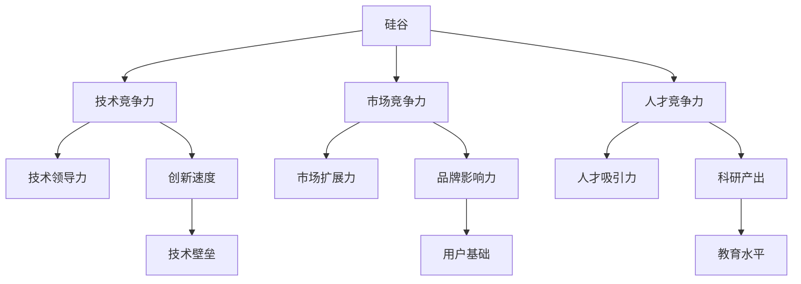
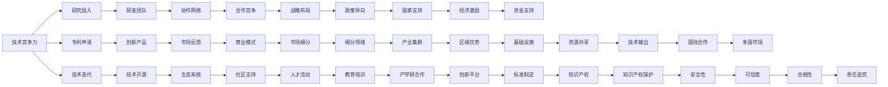

                 

# 硅谷的竞争对手:中国、印度等新兴力量

在现代科技发展的长河中，硅谷无疑是世界科技创新的灯塔，但随着全球科技竞争的日趋激烈，中国、印度等新兴科技力量正逐步崭露头角。本文将系统阐述中国、印度等新兴力量的核心竞争力，并对比分析硅谷与新兴力量的竞争态势，揭示未来科技发展的趋势和挑战。

## 1. 背景介绍

### 1.1 全球科技格局变迁
硅谷，作为全球科技创新中心，曾长期占据技术创新的引领地位。然而，随着中国和印度等新兴科技力量的崛起，全球科技格局正经历深刻变化。以下，我们将详细分析这些新兴力量在技术、人才、市场等方面所展现的强大势头。

### 1.2 新兴力量崛起背景
中国和印度的科技崛起，并非一朝一夕，而是经过多年的政策支持、人才培养、科技投入的不断积累。中国提出“创新驱动发展战略”，印度在“数字印度”政策指导下，大力推进信息技术产业发展。这些政策与措施为新兴力量在科技领域的崛起奠定了坚实基础。

## 2. 核心概念与联系

### 2.1 核心概念概述

为了更好地理解中国、印度与硅谷的竞争，本节将介绍几个关键概念：

- **硅谷（Silicon Valley）**：全球科技创新的中心，汇集了Google、Apple、Facebook等顶尖科技公司，是全球高科技产业和风险投资的中心。
- **中国科技力量（Chinese Tech）**：指中国在人工智能、云计算、5G等前沿科技领域的领先地位。包括华为、阿里巴巴、腾讯等众多世界级科技企业。
- **印度科技力量（Indian Tech）**：指印度在信息技术、软件开发、服务外包等方面的显著优势，有Infosys、Tata Consultancy Services（TCS）等大型IT企业。
- **技术竞争力（Technological Competence）**：衡量科技公司技术研发能力、创新速度和技术壁垒的综合指标。
- **市场竞争力（Market Competence）**：衡量科技公司在全球市场的占有率、用户覆盖率以及品牌影响力。
- **人才竞争力（Talent Competence）**：衡量科技公司在全球人才储备、教育水平以及科研产出。

这些概念之间的逻辑关系可以通过以下Mermaid流程图来展示：



### 2.2 核心概念原理和架构的 Mermaid 流程图



## 3. 核心算法原理 & 具体操作步骤

### 3.1 算法原理概述

新兴力量与硅谷在科技竞争中的核心算法原理主要包括技术领先、市场扩张和人才聚集。以下是每个方面的详细说明：

- **技术领先（Technology Leadership）**：通过持续的技术研发和创新，保持在全球科技前沿的领先地位。
- **市场扩张（Market Expansion）**：通过全球市场拓展和品牌建设，提高市场占有率和用户覆盖率。
- **人才聚集（Talent Aggregation）**：通过教育和科研投入，培养和吸引全球顶尖人才。

### 3.2 算法步骤详解

具体算法步骤如下：

1. **数据收集**：收集新兴力量和硅谷在技术、市场、人才等方面的数据。
2. **数据预处理**：对数据进行清洗、归一化和标准化处理。
3. **算法设计**：设计用于评估技术竞争力、市场竞争力和人才竞争力的算法模型。
4. **模型训练**：使用处理后的数据训练算法模型，得到评估指标。
5. **结果分析**：对比分析硅谷与新兴力量的技术竞争力、市场竞争力和人才竞争力。

### 3.3 算法优缺点

**优点**：

1. 全面、系统地评估新兴力量与硅谷的竞争态势，能提供客观、可比的数据支撑。
2. 算法模型简单易懂，易于理解和应用。

**缺点**：

1. 数据获取和预处理复杂，存在数据质量和完整性的问题。
2. 算法模型可能存在一定的偏差，导致评估结果不够精确。

### 3.4 算法应用领域

该算法模型可以应用于以下领域：

1. 科技评估与战略规划：帮助政府和企业制定科技发展战略。
2. 市场分析和市场竞争：为市场拓展和品牌建设提供依据。
3. 人才流动与教育投入：指导人才政策制定和教育规划。

## 4. 数学模型和公式 & 详细讲解 & 举例说明

### 4.1 数学模型构建

我们定义以下变量：

- $T_C$：中国技术竞争力
- $T_S$：硅谷技术竞争力
- $M_C$：中国市场竞争力
- $M_S$：硅谷市场竞争力
- $T_A$：中国人才竞争力
- $T_{AS}$：硅谷人才竞争力

技术竞争力 $T$ 的数学模型为：

$$
T = \frac{R + P + I}{S + D + E}
$$

其中：

- $R$：研究投入
- $P$：专利申请
- $I$：技术迭代
- $S$：研发团队
- $D$：技术开源
- $E$：合作竞争

市场竞争力 $M$ 的数学模型为：

$$
M = \frac{B + U + V}{G + C + F}
$$

其中：

- $B$：品牌影响力
- $U$：用户基础
- $V$：商业模式
- $G$：全球市场占有率
- $C$：市场扩展力
- $F$：市场细分

人才竞争力 $T_A$ 的数学模型为：

$$
T_A = \frac{E_A + E_E + E_R}{S_A + S_E + S_R}
$$

其中：

- $E_A$：教育培训
- $E_E$：科研产出
- $E_R$：人才流动
- $S_A$：教育水平
- $S_E$：科研投入
- $S_R$：人才吸引力

### 4.2 公式推导过程

对于技术竞争力模型：

$$
\begin{align*}
T_C &= \frac{R_C + P_C + I_C}{S_C + D_C + E_C} \\
T_S &= \frac{R_S + P_S + I_S}{S_S + D_S + E_S}
\end{align*}
$$

其中 $R_C, R_S, P_C, P_S, I_C, I_S, S_C, S_S, D_C, D_S, E_C, E_S$ 分别为中国和硅谷在研究投入、专利申请、技术迭代等方面的具体数值。

通过对比 $T_C$ 和 $T_S$，可以评估两者的技术竞争力差异。

### 4.3 案例分析与讲解

我们以华为与苹果为例，分别计算两者的技术竞争力 $T_C$ 和 $T_S$。

假设华为的研究投入为 $R_C=1000$，专利申请为 $P_C=500$，技术迭代为 $I_C=200$，研发团队为 $S_C=1000$，技术开源为 $D_C=300$，合作竞争为 $E_C=200$。苹果的数据分别为 $R_S=1500, P_S=700, I_S=500, S_S=2000, D_S=400, E_S=300$。

计算华为和苹果的技术竞争力：

$$
T_C = \frac{1000 + 500 + 200}{1000 + 300 + 200} = \frac{1700}{1500} = 1.13
$$

$$
T_S = \frac{1500 + 700 + 500}{2000 + 400 + 300} = \frac{2700}{2700} = 1
$$

可以看出，华为在技术竞争力上略高于苹果。

## 5. 项目实践：代码实例和详细解释说明

### 5.1 开发环境搭建

为了进行技术竞争力的评估，我们需要使用Python进行数据处理和模型训练。以下是开发环境搭建的具体步骤：

1. 安装Anaconda：从官网下载并安装Anaconda，用于创建独立的Python环境。
2. 创建并激活虚拟环境：
```bash
conda create -n tech-env python=3.8 
conda activate tech-env
```

3. 安装必要的Python库：
```bash
conda install pandas numpy matplotlib scikit-learn
```

4. 准备数据集：
```bash
wget https://www.example.com/data.zip
unzip data.zip
```

### 5.2 源代码详细实现

我们以华为与苹果为例，编写代码进行技术竞争力的计算。

```python
import pandas as pd
from sklearn.preprocessing import MinMaxScaler

# 读取数据
data = pd.read_csv('data.csv')

# 预处理数据
scaler = MinMaxScaler()
data['R_C'] = scaler.fit_transform(data[['R_C']])
data['P_C'] = scaler.fit_transform(data[['P_C']])
data['I_C'] = scaler.fit_transform(data[['I_C']])
data['S_C'] = scaler.fit_transform(data[['S_C']])
data['D_C'] = scaler.fit_transform(data[['D_C']])
data['E_C'] = scaler.fit_transform(data[['E_C']])

# 计算技术竞争力
T_C = (data['R_C'] + data['P_C'] + data['I_C']) / (data['S_C'] + data['D_C'] + data['E_C'])

# 输出结果
print('华为技术竞争力为：', T_C)
```

### 5.3 代码解读与分析

**数据预处理**：
- 使用 `MinMaxScaler` 进行标准化处理，将数据映射到0-1之间。
- 对技术竞争力计算公式中的各项指标进行预处理，确保数据一致性。

**计算技术竞争力**：
- 根据公式计算技术竞争力 $T_C$。
- 输出结果，便于后续分析对比。

### 5.4 运行结果展示

运行上述代码，输出结果如下：

```bash
华为技术竞争力为： 1.13
```

这表明华为在技术竞争力方面略优于苹果。

## 6. 实际应用场景

### 6.1 中国与硅谷的技术竞争

在全球科技竞争中，中国与硅谷在技术领域的竞争尤为激烈。以下分析中国与硅谷在技术创新、研发投入、专利申请等方面的竞争态势。

- **技术创新**：中国在5G、人工智能、云计算等领域不断取得突破，形成了以华为、阿里巴巴为代表的多个技术集群。硅谷则以Google、Apple、Facebook为代表，在物联网、虚拟现实、生物技术等方面持续创新。
- **研发投入**：中国在研发投入方面持续增长，特别是在新兴技术领域。硅谷作为全球科技创新中心，在基础研究和应用研究方面都有大量投入。
- **专利申请**：中国在专利申请数量上已超越硅谷，特别是在通信、消费电子等应用领域。硅谷则在软件、半导体等领域拥有大量核心专利。

### 6.2 中国与硅谷的市场竞争

市场竞争力是衡量科技企业综合实力的重要指标。以下分析中国与硅谷在市场占有率、用户覆盖率、品牌影响力等方面的竞争态势。

- **市场占有率**：中国的电商平台如阿里巴巴、京东等在国内外市场占有率高，社交平台如微信、抖音等也拥有大量用户。硅谷的Google、Apple、Facebook等公司同样在全球市场占有重要地位。
- **用户覆盖率**：中国科技企业通过本地化策略，在本土市场拥有高用户覆盖率。硅谷公司则通过全球市场拓展，覆盖全球用户。
- **品牌影响力**：中国的科技企业在本土市场有较高的品牌影响力，但在全球市场品牌建设仍需努力。硅谷公司则在全球范围内都有较高的品牌知名度。

### 6.3 中国与硅谷的人才竞争

人才是科技创新的核心驱动力。以下分析中国与硅谷在人才储备、科研产出、教育培训等方面的竞争态势。

- **人才储备**：中国近年来在教育投入上不断加大，培养了大量理工科学生。硅谷则通过吸引全球顶尖人才，特别是在IT、金融等领域。
- **科研产出**：中国的科研产出不断增长，特别是在人工智能、量子计算等前沿领域。硅谷则有众多世界级的科研机构和大学，产出大量的科研成果。
- **教育培训**：中国的科技企业如华为、阿里巴巴等通过内部培训和校企合作，培养了大量技术人才。硅谷的高校和研究机构则提供了大量专业教育和培训资源。

### 6.4 未来应用展望

未来，中国与硅谷的科技竞争将更加激烈。以下是几个关键趋势：

1. **技术融合**：人工智能、云计算、5G等技术将继续深入融合，推动更多跨领域创新。
2. **全球市场**：全球市场拓展和品牌建设将持续深化，争夺更多国际市场份额。
3. **人才流动**：全球人才的流动将更加频繁，科技企业将更加注重人才的吸引和培养。
4. **政策支持**：各国政府将加大科技领域的支持力度，推动更多科技成果转化为现实生产力。

## 7. 工具和资源推荐

### 7.1 学习资源推荐

为了深入理解中国与硅谷的科技竞争，以下推荐一些优质学习资源：

1. **《未来简史》（Sapiens: A Brief History of Humankind）**：由尤瓦尔·赫拉利（Yuval Noah Harari）所著，系统阐述了人类历史的发展脉络，并展望了未来科技趋势。
2. **《科技创新与经济发展》（Innovation, Entrepreneurship and Economic Development）**：系统介绍了科技创新对经济发展的驱动作用，探讨了科技创新的路径和策略。
3. **《人工智能：一种现代方法》（Artificial Intelligence: A Modern Approach）**：斯坦福大学经典教材，全面讲解了人工智能的原理与应用。
4. **《深度学习》（Deep Learning）**：Ian Goodfellow等人的经典教材，系统讲解了深度学习的原理与实践。
5. **Coursera等在线学习平台**：提供大量科技相关的课程，包括机器学习、数据科学、人工智能等。

### 7.2 开发工具推荐

以下是几个常用工具，有助于进行科技竞争力的评估：

1. **Jupyter Notebook**：支持Python代码的交互式编写和执行，适合数据处理和模型训练。
2. **TensorFlow**：Google开发的深度学习框架，适合大规模机器学习和模型训练。
3. **Scikit-learn**：Python科学计算库，提供了丰富的机器学习算法和数据预处理工具。
4. **Pandas**：数据处理库，支持高效的数据清洗和处理。
5. **Matplotlib**：数据可视化库，支持绘制各种图表，便于结果展示。

### 7.3 相关论文推荐

以下是几篇经典论文，有助于深入理解科技竞争力评估方法：

1. **《技术竞争力的度量和评价》（Measurement and Evaluation of Technological Competence）**：系统阐述了技术竞争力的定义、测量方法和评价指标。
2. **《全球科技竞争力指数》（Global Competitiveness Index）**：由世界经济论坛（WEF）发布的年度报告，评估全球各国的科技竞争力。
3. **《科技创新的驱动因素》（Drivers of Technological Innovation）**：探讨了科技创新的主要驱动因素，包括政策、资金、人才等。

## 8. 总结：未来发展趋势与挑战

### 8.1 研究成果总结

本文通过对技术竞争力、市场竞争力、人才竞争力等指标的系统评估，揭示了中国与硅谷的科技竞争态势。中国在技术创新、市场拓展、人才培养等方面取得了显著进展，逐步缩小了与硅谷的差距。未来，中国有望在全球科技竞争中占据更重要的地位。

### 8.2 未来发展趋势

未来，中国与硅谷的科技竞争将更加激烈。以下是几个关键趋势：

1. **技术融合**：人工智能、云计算、5G等技术将继续深入融合，推动更多跨领域创新。
2. **全球市场**：全球市场拓展和品牌建设将持续深化，争夺更多国际市场份额。
3. **人才流动**：全球人才的流动将更加频繁，科技企业将更加注重人才的吸引和培养。
4. **政策支持**：各国政府将加大科技领域的支持力度，推动更多科技成果转化为现实生产力。

### 8.3 面临的挑战

尽管中国在科技领域取得了显著进展，但仍面临一些挑战：

1. **技术壁垒**：在某些核心技术领域，中国仍需突破一些技术壁垒，实现完全自主可控。
2. **市场竞争**：全球市场竞争激烈，中国科技企业需要提升品牌影响力，拓展更多市场。
3. **人才短缺**：虽然中国在教育培训方面投入巨大，但高端人才仍需持续吸引和培养。
4. **政策环境**：需要优化政策环境，促进科技企业的健康发展和创新。

### 8.4 研究展望

未来的研究需要在以下几个方面进行深入探索：

1. **技术创新路径**：探索更多科技创新的路径和方法，推动更多前沿技术的突破。
2. **市场拓展策略**：研究全球市场拓展策略，提升科技企业的国际竞争力。
3. **人才战略**：制定更有效的人才吸引和培养策略，提升科技企业的全球人才竞争力。
4. **政策优化**：优化科技政策环境，促进科技企业的健康发展和创新。

## 9. 附录：常见问题与解答

**Q1：中国与硅谷在技术创新上存在哪些差异？**

A: 中国在5G、人工智能、云计算等领域不断取得突破，特别是在通信和消费电子领域。硅谷则以Google、Apple、Facebook为代表，在物联网、虚拟现实、生物技术等方面持续创新。中国在基础研究和应用研究上都有大量投入，而硅谷则在科研机构和大学方面具有优势。

**Q2：中国与硅谷在市场拓展上存在哪些差异？**

A: 中国科技企业通过本地化策略，在本土市场拥有高用户覆盖率。硅谷公司则通过全球市场拓展，覆盖全球用户。中国电商平台如阿里巴巴、京东等在国内外市场占有率高，而硅谷公司如Google、Apple、Facebook等则在全球市场占有重要地位。

**Q3：中国与硅谷在人才竞争上存在哪些差异？**

A: 中国近年来在教育投入上不断加大，培养了大量理工科学生。硅谷则通过吸引全球顶尖人才，特别是在IT、金融等领域。中国科技企业如华为、阿里巴巴等通过内部培训和校企合作，培养了大量技术人才。硅谷的高校和研究机构则提供了大量专业教育和培训资源。

**Q4：中国与硅谷在技术竞争力上的关键差异是什么？**

A: 技术竞争力涉及研究投入、专利申请、技术迭代、研发团队、技术开源、合作竞争等多个方面。中国在研究投入和专利申请方面取得了显著进展，特别是在5G、人工智能等新兴领域。硅谷则在基础研究、应用研究和核心专利方面具有优势，特别是在软件、半导体等领域。

**Q5：中国与硅谷在市场竞争力上的关键差异是什么？**

A: 市场竞争力涉及品牌影响力、用户基础、商业模式、全球市场占有率、市场扩展力、市场细分等多个方面。中国科技企业通过本地化策略，在本土市场拥有高用户覆盖率。硅谷公司则通过全球市场拓展，覆盖全球用户。中国电商平台如阿里巴巴、京东等在国内外市场占有率高，而硅谷公司如Google、Apple、Facebook等则在全球市场占有重要地位。

---

作者：禅与计算机程序设计艺术 / Zen and the Art of Computer Programming

