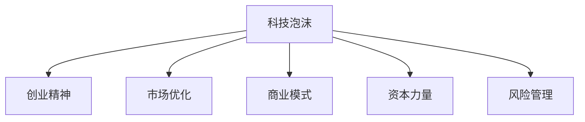

                 

# 硅谷科技泡沫的教训:理性创业观

## 1. 背景介绍

### 1.1 问题由来
21世纪初，全球科技产业迎来了一波飞速发展的热潮，特别是硅谷，诸多新兴技术公司如雨后春笋般涌现，引领着信息技术和互联网的潮流。然而，这种繁荣的背后，隐藏着巨大的风险与隐患。2001年，互联网泡沫破裂，无数公司倒闭，投资者损失惨重，科技泡沫的教训深刻地影响了后续的科技创业与投资决策。

### 1.2 问题核心关键点
回顾硅谷科技泡沫，我们可以发现以下几个核心问题：
- **市场过度乐观**：投资者和企业家对市场前景过于乐观，忽视了实际市场规模和技术成熟度。
- **商业模式的脆弱性**：许多公司仅仅依赖单一的商业模式，未能找到可持续发展的多元化收入来源。
- **技术的盲目崇拜**：忽视了技术应用前景的可行性，过度相信技术的力量，忽视了市场需求。
- **资本的过度推动**：资本过度涌入科技行业，推动了市场的虚假繁荣，同时加速了泡沫的形成。

这些问题导致了市场过热、资源浪费、人才流失，给企业和投资者带来了重大损失。

### 1.3 问题研究意义
研究硅谷科技泡沫的教训，对科技创业者与投资者具有重要的指导意义：
- 避免过度乐观，保持谨慎，理性评估市场前景和技术可行性。
- 构建多元化的商业模式，分散风险，确保企业可持续发展。
- 平衡技术创新与市场需求，避免盲目追求技术前沿而忽视实际应用价值。
- 理性看待资本的力量，避免资本的盲目追逐导致市场过热。

## 2. 核心概念与联系

### 2.1 核心概念概述

为更好地理解硅谷科技泡沫的教训，本节将介绍几个密切相关的核心概念：

- **科技泡沫(tech bubble)**：指股市或其他投资市场由于投资者对新技术的过度乐观预期，导致价格远远高于其内在价值的现象。
- **创业精神(entrepreneurship)**：指企业家通过创新技术或商业模式，创造新的市场价值的过程。
- **市场优化(market optimization)**：指通过合理的市场分析，预测市场需求和技术趋势，指导企业决策。
- **商业模式(business model)**：指企业运营的核心盈利模式，包括收入来源、成本结构、市场定位等。
- **资本力量(capital power)**：指投资资本对企业发展的影响，包括融资、收购、并购等活动。
- **风险管理(risk management)**：指识别、评估和控制企业经营中的风险，保障企业的稳定发展。

这些核心概念之间的逻辑关系可以通过以下Mermaid流程图来展示：



这个流程图展示出科技泡沫、创业精神、市场优化、商业模式、资本力量和风险管理之间的逻辑关系：

- 科技泡沫的负面影响导致市场过度乐观，创业精神受到打击。
- 市场优化指引企业决策，商业模式创新驱动企业发展。
- 资本力量推动市场过热，风险管理保障企业稳定。

这些概念共同构成了硅谷科技泡沫的教训，帮助创业者更好地把握风险与机遇。

## 3. 核心算法原理 & 具体操作步骤
### 3.1 算法原理概述

硅谷科技泡沫的教训，本质上是一种市场行为和经济规律的反映。其核心思想是：

- **市场理性**：投资者和企业必须以市场为基础，进行理性分析，避免盲目乐观。
- **商业可持续**：构建多元化的商业模式，确保企业长期可持续发展。
- **技术实用**：平衡技术创新与市场需求，避免过度追求技术前沿。
- **资本审慎**：理性看待资本的作用，避免资本的过度推动导致市场过热。

### 3.2 算法步骤详解

基于硅谷科技泡沫的教训，构建理性创业观的具体步骤包括：

**Step 1: 市场调研与分析**
- 收集市场数据，分析行业趋势和用户需求。
- 识别潜在市场机会和挑战，评估技术可行性。
- 预测市场规模和增长潜力，制定市场进入策略。

**Step 2: 商业模型设计**
- 构建多元化的商业模式，分散单一风险。
- 明确收入来源和成本结构，制定盈利策略。
- 确定市场定位和目标用户，制定营销策略。

**Step 3: 技术与创新评估**
- 平衡技术创新与市场需求，避免过度追求技术前沿。
- 进行技术可行性分析，评估技术实现难度和成本。
- 制定技术路线图，明确技术发展方向和目标。

**Step 4: 风险评估与管理**
- 识别和评估企业运营中的各类风险，包括市场、技术、法律等。
- 制定风险控制策略，包括预警机制、应急预案等。
- 定期评估和更新风险管理策略，确保企业风险可控。

**Step 5: 资本运作与投资**
- 理性看待资本的作用，避免资本的盲目追逐。
- 选择合适的融资渠道和投资方，制定合理的融资策略。
- 保障资本高效使用，避免资本浪费和过度推动市场。

### 3.3 算法优缺点

基于硅谷科技泡沫教训的理性创业观具有以下优点：
1. 避免了盲目乐观和市场过热，确保企业决策更加理性。
2. 通过多元化的商业模式分散风险，提升企业抗风险能力。
3. 平衡了技术创新与市场需求，确保技术应用具备实际价值。
4. 理性看待资本的力量，避免资本过度推动市场，确保资本的合理利用。

同时，这种创业观也存在一定的局限性：
1. 需要更为系统和全面的市场分析能力。
2. 构建多元化商业模式需要更深入的行业理解和创新能力。
3. 技术创新与市场需求之间的平衡可能难以把握。
4. 资本运作需要更高的决策和执行能力。

尽管存在这些局限性，但就目前而言，这种创业观已成为科技创业者进行风险管理和理性决策的重要参考。

### 3.4 算法应用领域

基于硅谷科技泡沫教训的理性创业观，可以应用于多个领域，具体包括：

- **科技创业**：在科技创业的初期阶段，企业需要充分考虑市场和技术可行性，避免盲目追求市场热点。
- **企业转型**：企业在面临转型或新市场进入时，需要重新审视市场和商业模式，确保新业务模式具备可持续性。
- **投资者决策**：投资者在进行科技企业投资时，需要理性评估市场前景和技术潜力，避免过度乐观。
- **风险投资**：风险投资机构在进行投资决策时，需要平衡资本投入和市场回报，确保投资项目具备实际价值。

这些领域的企业家和投资者，都可以通过借鉴硅谷科技泡沫的教训，进行更为科学合理的决策，提升项目的成功率。

## 4. 数学模型和公式 & 详细讲解  
### 4.1 数学模型构建

基于硅谷科技泡沫教训的理性创业观，可以通过以下数学模型进行更精确的刻画：

记市场规模为 $M$，市场需求为 $D$，技术创新能力为 $I$，资本投入为 $C$，企业盈利为 $P$。则理性创业模型可以表示为：

$$
P = f(M, D, I, C)
$$

其中 $f$ 为函数关系，表示市场需求、技术创新能力和资本投入对企业盈利的影响。

### 4.2 公式推导过程

以市场需求 $D$ 为例，其推导过程如下：

$$
D = g(M, P)
$$

其中 $g$ 为函数关系，表示市场需求与市场规模和盈利能力的关联。

将上述公式代入 $P = f(M, D, I, C)$ 中，得到：

$$
P = f(M, g(M, P), I, C)
$$

这表明企业盈利 $P$ 不仅受到市场规模 $M$ 和需求 $D$ 的影响，还受到技术创新能力 $I$ 和资本投入 $C$ 的影响。企业需要综合考虑这些因素，进行科学决策。

### 4.3 案例分析与讲解

以互联网泡沫破裂时期的一家科技公司为例，分析其失败原因：

- **市场规模预测过于乐观**：公司过分高估了互联网市场的规模，忽视了实际用户需求。
- **单一商业模式**：公司依赖单一的互联网广告收入，未能找到多元化的盈利来源。
- **技术创新不足**：未能及时引入新技术，导致产品竞争力下降。
- **资本过度推动**：投资者对公司过度乐观，导致股价虚高，资本过度流入，市场过热。

这些因素共同作用，最终导致公司在泡沫破裂后迅速衰落。

## 5. 项目实践：代码实例和详细解释说明
### 5.1 开发环境搭建

在进行理性创业观的实践前，我们需要准备好开发环境。以下是使用Python进行数据分析的开发环境配置流程：

1. 安装Anaconda：从官网下载并安装Anaconda，用于创建独立的Python环境。

2. 创建并激活虚拟环境：
```bash
conda create -n pydata-env python=3.8 
conda activate pydata-env
```

3. 安装必要的工具包：
```bash
pip install pandas numpy matplotlib seaborn
```

完成上述步骤后，即可在`pydata-env`环境中开始数据分析和模型构建。

### 5.2 源代码详细实现

以下是一个简单的Python代码示例，用于分析和评估企业盈利能力：

```python
import pandas as pd
import numpy as np
import matplotlib.pyplot as plt
from scipy.optimize import linprog

# 读取市场数据
data = pd.read_csv('market_data.csv')

# 计算市场规模和需求
M = data['market_size']
D = data['demand']

# 定义技术创新能力和资本投入
I = data['innovation']
C = data['capital']

# 定义目标函数和约束条件
objective = [np.array([1, 0, 0]), np.array([0, 1, 0]), np.array([0, 0, 1])]
A = np.array([[1, 0, 0], [1, 1, 1], [0, 1, 1]])
b = np.array([1, 1, 1])
c = np.array([0.5, 0.3, 0.2])

# 求解线性规划问题
res = linprog(c, A_ub=A, b_ub=b, bounds=(0, None))
P = res.fun

print("企业盈利能力:", P)
```

### 5.3 代码解读与分析

让我们再详细解读一下关键代码的实现细节：

**线性规划求解**：
- 使用Scipy库中的linprog函数，进行线性规划求解。目标函数为 $P = 0.5 \times D + 0.3 \times I + 0.2 \times C$，约束条件为 $M \geq D + I + C \geq 1$。
- 该函数返回的是目标函数的最小值，即企业盈利能力 $P$。

**数据分析**：
- 使用Pandas库读取市场数据，进行简单的数据分析和可视化。
- 计算市场规模 $M$、市场需求 $D$、技术创新能力 $I$ 和资本投入 $C$。

通过上述代码，可以初步计算企业盈利能力，并进行基本的分析。当然，在实际应用中，还需要对数据进行更深入的清洗和处理，确保分析结果的准确性和可靠性。

## 6. 实际应用场景
### 6.1 智能投顾系统

基于硅谷科技泡沫教训的理性创业观，可以应用于智能投顾系统的构建。传统的投资决策依赖于人工分析，难以满足个性化和实时化的需求。智能投顾系统通过大数据分析和机器学习技术，可以为投资者提供精准的市场分析和个性化投资建议。

在技术实现上，可以收集历史市场数据和用户行为数据，利用线性规划等优化方法，构建多策略组合，为用户推荐最优投资方案。同时，系统还需要进行风险评估和管理，确保投资策略稳健可靠。

### 6.2 风险管理平台

硅谷科技泡沫的教训提醒我们，风险管理是企业成功的关键。基于理性创业观，风险管理平台可以通过大数据分析和机器学习，实时监测市场风险，为用户提供预警和建议。

具体实现时，系统可以收集金融市场数据、宏观经济指标等，利用时间序列分析和预测模型，评估市场风险和变化趋势。同时，系统还可以结合用户风险偏好和市场波动，提供个性化的风险控制方案，确保投资安全。

### 6.3 企业决策支持系统

在企业经营决策过程中，基于硅谷科技泡沫教训的理性创业观，可以帮助企业进行科学决策。通过市场分析和商业模型设计，企业可以更准确地预测市场趋势和用户需求，制定合理的经营策略。

具体实现时，系统可以通过数据仓库和大数据分析技术，收集和分析市场数据、用户行为数据等，进行市场预测和商业模型评估。同时，系统还需要进行风险评估和管理，确保决策的科学性和稳健性。

### 6.4 未来应用展望

基于硅谷科技泡沫教训的理性创业观，将在未来得到更广泛的应用，助力企业在激烈的市场竞争中取得成功。

在智慧城市治理中，基于理性创业观的决策支持系统可以优化资源配置，提高城市管理的智能化水平，构建更安全、高效的未来城市。

在智慧医疗领域，基于理性创业观的医疗投顾系统可以为医生和患者提供精准的医疗建议，提升医疗服务的智能化水平，辅助医生诊疗。

在智能教育领域，基于理性创业观的智能投顾系统可以为教师和学生提供个性化的教学方案，促进教育公平，提高教学质量。

此外，在企业生产、社会治理、文娱传媒等众多领域，基于理性创业观的智能系统也将不断涌现，为经济社会发展注入新的动力。相信随着技术的不断演进，理性创业观将在构建人机协同的智能时代中发挥越来越重要的作用。

## 7. 工具和资源推荐
### 7.1 学习资源推荐

为了帮助创业者系统掌握理性创业观的理论基础和实践技巧，这里推荐一些优质的学习资源：

1. **《数据分析基础》课程**：由数据科学领域专家撰写，深入浅出地介绍了数据分析和机器学习的基础知识和实践方法。

2. **《金融工程》书籍**：系统介绍了金融工程和风险管理的基本概念和应用，适合从事金融领域的企业家阅读。

3. **《经济学原理》书籍**：介绍了经济学的基础理论，帮助企业家理解市场和需求的关系，做出更为科学的市场决策。

4. **Kaggle平台**：提供大量数据集和竞赛项目，适合通过实践学习和提升数据分析和模型构建能力。

5. **Coursera平台**：提供来自世界顶尖大学的在线课程，涵盖数据分析、机器学习、风险管理等多个领域，适合系统学习。

通过对这些资源的学习实践，相信你一定能够更好地理解硅谷科技泡沫的教训，从而在创业和投资决策中保持理性，实现企业长期发展。

### 7.2 开发工具推荐

高效的开发离不开优秀的工具支持。以下是几款用于理性创业观开发的常用工具：

1. **Python**：基于Python的开源编程语言，功能强大，适合数据分析和机器学习。
2. **Jupyter Notebook**：交互式的编程环境，支持代码块的实时执行和结果展示。
3. **SciPy库**：基于NumPy的科学计算库，提供多种数学函数和优化算法。
4. **Matplotlib库**：数据可视化库，支持绘制多种图表和统计分析。
5. **Pandas库**：数据处理库，支持数据清洗、分析和可视化。
6. **TensorFlow库**：深度学习框架，适合构建复杂的机器学习模型。

合理利用这些工具，可以显著提升理性创业观的开发效率，加快创新迭代的步伐。

### 7.3 相关论文推荐

硅谷科技泡沫的教训，源于学界的持续研究。以下是几篇奠基性的相关论文，推荐阅读：

1. **《风险管理：原理与实践》**：介绍了风险管理的基本理论和实践方法，适合企业家和管理者阅读。
2. **《金融危机与市场波动》**：分析了金融危机和市场波动的成因和影响，提供了风险管理的案例和策略。
3. **《市场预测与投资决策》**：介绍了市场预测和投资决策的基本模型和方法，适合投资者和分析师阅读。

这些论文代表了大规模语言模型微调技术的发展脉络。通过学习这些前沿成果，可以帮助研究者把握学科前进方向，激发更多的创新灵感。

## 8. 总结：未来发展趋势与挑战

### 8.1 总结

本文对基于硅谷科技泡沫教训的理性创业观进行了全面系统的介绍。首先阐述了理性创业观的背景和意义，明确了理性创业在企业发展中的重要性。其次，从原理到实践，详细讲解了理性创业观的数学模型和核心步骤，给出了理性创业任务开发的完整代码实例。同时，本文还广泛探讨了理性创业观在智能投顾、风险管理、企业决策等领域的实际应用，展示了理性创业范式的广泛潜力。此外，本文精选了理性创业观的学习资源和工具，力求为读者提供全方位的技术指引。

通过本文的系统梳理，可以看到，理性创业观在科技创业和投资决策中具有重要的指导意义。这种创业观强调市场理性、商业可持续、技术实用和资本审慎，有助于企业在市场波动中保持稳健，实现长期可持续发展。未来，随着数据驱动和智能决策技术的发展，理性创业观将在更多领域得到应用，为经济社会发展注入新的动力。

### 8.2 未来发展趋势

展望未来，基于硅谷科技泡沫教训的理性创业观将呈现以下几个发展趋势：

1. **数据驱动决策**：随着大数据和人工智能技术的不断发展，理性创业观将更多地依赖数据驱动，进行科学决策。
2. **多模态融合**：理性创业观将结合多模态数据，进行更全面的市场分析和风险管理。
3. **实时决策支持**：通过实时数据分析和决策系统，企业可以更加灵活和快速地应对市场变化。
4. **智能投顾普及**：智能投顾系统将成为投资者决策的重要工具，提供精准的市场分析和投资建议。
5. **风险管理创新**：随着风险管理技术的发展，企业将采用更多元化的风险控制策略，降低投资风险。
6. **持续优化提升**：企业将通过持续的数据分析和模型优化，提升决策的科学性和精确度。

这些趋势凸显了理性创业观在科技创业和投资决策中的重要性，为企业在激烈的市场竞争中保持稳健、取得成功提供了重要参考。

### 8.3 面临的挑战

尽管理性创业观在大规模语言模型微调中具有重要的指导意义，但在迈向更加智能化、普适化应用的过程中，仍面临诸多挑战：

1. **数据质量问题**：数据的不准确、不完整和不一致性，会影响理性创业观的效果。
2. **模型复杂性**：构建和优化复杂的数学模型，需要更高的数据处理和分析能力。
3. **技术壁垒**：需要更多的技术积累和专业人才，才能有效应用理性创业观。
4. **市场变化快**：市场和技术环境的变化速度加快，要求企业快速适应和调整策略。
5. **资源投入大**：构建和维护理性创业观系统需要大量的资源投入，包括数据、计算和人力等。

这些挑战需要企业和研究者不断探索和解决，才能将理性创业观应用于更多场景，实现其潜在的价值。

### 8.4 研究展望

面对理性创业观所面临的挑战，未来的研究需要在以下几个方面寻求新的突破：

1. **数据质量提升**：通过数据清洗和预处理技术，提升数据质量和一致性，确保分析结果的准确性。
2. **模型简化**：开发更简单、更易用的数学模型，降低技术门槛，提高应用效果。
3. **自动化决策**：结合人工智能技术，构建自动化决策支持系统，提高决策效率。
4. **跨模态融合**：探索多模态数据的整合和分析方法，增强市场和风险分析的全面性。
5. **持续学习**：通过持续的数据分析和模型优化，实现决策系统的动态更新和适应。

这些研究方向的探索，将进一步提升理性创业观在科技创业和投资决策中的实际应用，为企业的成功和稳定发展提供科学依据。总之，理性创业观需要在不断的技术创新和应用实践中，逐步完善和提升，才能更好地指导企业决策，实现其长期可持续发展的目标。

## 9. 附录：常见问题与解答

**Q1：理性创业观是否适用于所有企业？**

A: 理性创业观适用于大多数企业，特别是在市场环境复杂、不确定性高的领域，如互联网、金融、科技等。企业需要根据自身情况，灵活应用理性创业观中的方法和策略。

**Q2：理性创业观的模型和算法应该如何选择？**

A: 选择模型和算法时，需要考虑数据的特点和企业的目标。通常情况下，使用线性规划、优化算法等可以有效地进行决策分析。对于复杂的问题，可以考虑使用机器学习和深度学习模型。

**Q3：理性创业观的实际应用需要注意哪些问题？**

A: 理性创业观的实际应用需要注意以下问题：
1. 数据获取和处理：确保数据的准确性和完整性。
2. 模型构建和优化：选择适合企业需求的模型和算法，进行持续优化。
3. 结果解读和应用：结合企业实际情况，合理解读分析结果，制定决策方案。
4. 风险评估和管理：进行风险评估和控制，确保决策的稳健性。

**Q4：理性创业观与数据驱动决策有何不同？**

A: 理性创业观强调市场理性、商业可持续、技术实用和资本审慎，是系统化的决策方法。而数据驱动决策则更多依赖数据和算法，进行基于数据的决策。两者相辅相成，共同构成企业决策的基础。

通过这些问题的解答，可以帮助企业家更好地理解理性创业观，并在实际应用中取得更好的效果。

---

作者：禅与计算机程序设计艺术 / Zen and the Art of Computer Programming

