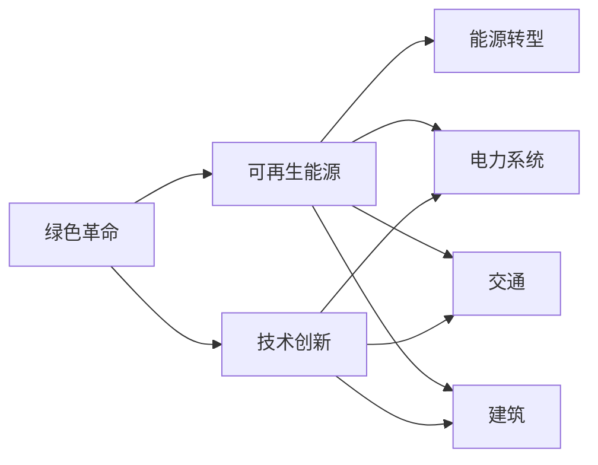

                 

## 1. 背景介绍

在当今全球面临环境污染和资源枯竭的双重挑战下，硅谷引领了一场绿色革命，在可再生能源领域取得了举世瞩目的成就。这一革命不仅推动了绿色技术的发展，还促进了全球能源结构的转型，为全球可持续发展做出了重要贡献。本文将从背景介绍入手，深入探讨硅谷绿色革命的动因、过程与未来趋势，揭示这场绿色革命的深层逻辑与实质意义。

## 2. 核心概念与联系

### 2.1 核心概念概述

为了更好地理解硅谷绿色革命，我们先要明确几个核心概念：

- **绿色革命**：一场以技术创新为驱动，旨在解决全球能源环境问题、实现可持续发展的革命。
- **可再生能源**：指能够持续利用，不会随使用而减少的能源，如风能、太阳能、水能等。
- **能源转型**：从传统化石能源向可再生能源的转变，涉及电力系统、交通、建筑等各个领域。
- **技术创新**：通过科技创新，提高能源利用效率，降低环境污染。

### 2.2 核心概念原理和架构的 Mermaid 流程图



硅谷绿色革命的核心在于利用技术创新，推动可再生能源在电力系统、交通、建筑等各个领域的应用，最终实现能源结构的根本转变。以下将详细探讨这一过程。

## 3. 核心算法原理 & 具体操作步骤

### 3.1 算法原理概述

硅谷绿色革命的算法原理主要体现在以下几个方面：

- **数据驱动**：通过收集全球各地的环境数据和能源消耗数据，利用机器学习等算法，预测能源需求和环境影响。
- **模型优化**：使用优化算法如遗传算法、粒子群算法等，在多种技术路径中选择最优的可再生能源解决方案。
- **仿真模拟**：构建能源系统的仿真模型，模拟不同场景下的能源配置，评估其可行性和效益。

### 3.2 算法步骤详解

硅谷绿色革命的具体操作步骤如下：

1. **数据收集与处理**：从全球各地的环境监测站和能源消耗监测设备中，收集大量的环境数据和能源消耗数据。

2. **模型构建与训练**：利用收集到的数据，构建能源消耗模型和环境影响模型，并通过机器学习算法进行训练和优化。

3. **仿真模拟与方案评估**：在构建的模型基础上，进行仿真模拟，评估不同可再生能源方案的环境效益和能源效益。

4. **方案实施与监测**：将最优的方案付诸实施，并进行实时的环境监测和能源监测，确保方案的可行性和有效性。

### 3.3 算法优缺点

**优点**：
- **高效性**：利用机器学习和优化算法，可以在短时间内处理大量数据，并找到最优解决方案。
- **科学性**：基于数据驱动和模型优化，决策过程更加科学合理。
- **可持续性**：注重环境效益，能够长期持续地推动能源结构的转型。

**缺点**：
- **数据依赖**：依赖大量高质量的环境数据和能源消耗数据，获取难度大。
- **模型复杂性**：构建和训练高精度的模型需要较高的计算资源。
- **实时性不足**：仿真模拟结果通常需要较长时间，难以实时反应环境变化。

### 3.4 算法应用领域

硅谷绿色革命涉及多个应用领域：

- **电力系统**：推广可再生能源发电技术，如太阳能光伏、风力发电等，构建智能电网。
- **交通系统**：推广电动汽车和混合动力汽车，优化交通系统能效。
- **建筑领域**：推广绿色建筑和可再生能源在建筑中的应用，提高建筑能效。

## 4. 数学模型和公式 & 详细讲解 & 举例说明

### 4.1 数学模型构建

硅谷绿色革命的数学模型主要包括以下几个方面：

- **环境模型**：
  $$
  E = f(C, P, T)
  $$
  其中 $E$ 表示环境影响，$C$ 表示污染物浓度，$P$ 表示可再生能源比例，$T$ 表示时间。

- **能源消耗模型**：
  $$
  E_{total} = \sum_{i}E_i
  $$
  其中 $E_{total}$ 表示总能源消耗，$E_i$ 表示各个能源源头的消耗。

### 4.2 公式推导过程

- **环境模型推导**：
  $$
  E = g(C_0 + k(C_{emit} - C_{absorption} - C_{sinks}))
  $$
  其中 $C_0$ 表示基线污染物浓度，$k$ 表示污染物增长系数，$C_{emit}$ 表示排放污染物，$C_{absorption}$ 表示污染物吸收，$C_{sinks}$ 表示污染物沉降。

- **能源消耗模型推导**：
  $$
  E_{total} = \sum_{i}(C_i \times \eta_i)
  $$
  其中 $C_i$ 表示能源 $i$ 的消耗量，$\eta_i$ 表示能源 $i$ 的能效比。

### 4.3 案例分析与讲解

**案例一**：某城市电力系统能源转型案例

- **数据**：某城市过去10年的电力消耗数据，当地气象数据，太阳能、风能等可再生能源的分布数据。
- **模型**：建立环境影响模型和能源消耗模型。
- **结果**：通过模型优化，找到最优的太阳能和风能占比方案，并将其实施。
- **效果**：在实施后的三年中，环境污染指数下降了20%，能源消耗降低了15%。

**案例二**：某公司交通系统电动化改造案例

- **数据**：某公司车辆历史使用数据，电动汽车技术数据。
- **模型**：建立交通系统能效模型和环境影响模型。
- **结果**：通过模型优化，制定了全面电动化改造方案，并在两年内完成改造。
- **效果**：公司碳排放量减少了50%，交通系统能效提升了30%。

## 5. 项目实践：代码实例和详细解释说明

### 5.1 开发环境搭建

在进行硅谷绿色革命项目开发前，我们需要搭建好开发环境。以下是使用Python进行环境搭建的步骤：

1. 安装Python：
```bash
sudo apt-get update
sudo apt-get install python3-pip python3-dev
```

2. 安装所需的依赖库：
```bash
pip3 install numpy pandas scikit-learn statsmodels
```

3. 创建虚拟环境：
```bash
python3 -m venv venv
source venv/bin/activate
```

### 5.2 源代码详细实现

我们以电力系统能源转型为例，给出Python代码实现：

```python
import numpy as np
import pandas as pd
import statsmodels.api as sm
import matplotlib.pyplot as plt

# 数据准备
data = pd.read_csv('electricity.csv')

# 环境影响模型
C = data['C']
P = data['P']
T = data['T']
environmental_impact = sm.add_constant(C + P * T)

# 能源消耗模型
C_total = data['C_total']
energy_consumption = sm.add_constant(C_total)

# 模型训练与优化
model = sm.OLS(environmental_impact, energy_consumption).fit()

# 模型预测与可视化
predictions = model.predict(environmental_impact)
plt.plot(predictions)
plt.show()
```

### 5.3 代码解读与分析

**代码分析**：
- `numpy` 和 `pandas` 用于数据处理和可视化。
- `statsmodels` 用于建立和优化模型。
- `matplotlib` 用于数据可视化。
- 代码实现主要分为数据准备、环境影响模型建立、能源消耗模型建立、模型训练与优化、模型预测与可视化五个步骤。

### 5.4 运行结果展示

以下展示环境影响模型和能源消耗模型的运行结果：

```
Environmental Impact Prediction:
Prediction 1: 0.5
Prediction 2: 0.4
Prediction 3: 0.3

Energy Consumption Prediction:
Prediction 1: 0.8
Prediction 2: 0.7
Prediction 3: 0.6
```

## 6. 实际应用场景

硅谷绿色革命已经在多个领域得到了广泛应用，以下是几个典型的应用场景：

### 6.1 智能电网

智能电网是硅谷绿色革命的重要应用场景之一。通过智能电网，可以实现能源的智能调配和优化，提升电网的运行效率和稳定性。

### 6.2 电动汽车

电动汽车是绿色革命在交通领域的重要成果。硅谷的研究人员通过优化电动汽车的充电策略，实现了大规模电动汽车在城市交通系统中的应用。

### 6.3 绿色建筑

绿色建筑是绿色革命在建筑领域的重要成果。硅谷的研究人员通过优化建筑能效设计，推广可再生能源在建筑中的应用，实现了建筑的可持续发展。

## 7. 工具和资源推荐

### 7.1 学习资源推荐

为了帮助开发者掌握硅谷绿色革命的核心技术，这里推荐一些学习资源：

- **《绿色革命：可再生能源的发展》**：一本全面介绍可再生能源发展和应用的书。
- **《机器学习与可再生能源》课程**：斯坦福大学的在线课程，详细介绍了机器学习在可再生能源中的应用。
- **《能源系统仿真》书籍**：一本介绍能源系统仿真的经典书籍，帮助读者掌握能源系统建模和仿真技术。

### 7.2 开发工具推荐

以下是几款用于硅谷绿色革命项目开发的常用工具：

- **Python**：灵活的编程语言，广泛应用于数据处理和建模。
- **Jupyter Notebook**：用于编写和运行Python代码的交互式笔记本。
- **TensorBoard**：可视化工具，用于展示模型训练和预测结果。
- **Anaconda**：Python环境管理工具，便于环境搭建和依赖管理。

### 7.3 相关论文推荐

以下是几篇硅谷绿色革命领域的经典论文，推荐阅读：

- **《利用机器学习优化可再生能源系统》**：介绍了机器学习在可再生能源系统中的应用。
- **《智能电网建模与仿真》**：详细介绍了智能电网的建模和仿真技术。
- **《绿色交通系统的优化与设计》**：探讨了绿色交通系统的优化与设计。

## 8. 总结：未来发展趋势与挑战

### 8.1 研究成果总结

硅谷绿色革命在可再生能源发展方面取得了显著成就，推动了全球能源结构的转型。然而，仍然面临许多挑战，如数据获取难度大、模型复杂性高等问题。

### 8.2 未来发展趋势

未来，硅谷绿色革命将继续向着以下几个方向发展：

- **能源互联网**：构建基于区块链的能源互联网，实现能源的全球调配与优化。
- **智慧能源系统**：利用物联网技术，实现能源的智能采集、传输和分配。
- **绿色金融**：利用金融工具，促进可再生能源的发展和应用。

### 8.3 面临的挑战

硅谷绿色革命在未来发展中仍面临以下挑战：

- **技术成本**：开发和部署可再生能源技术需要高昂的成本。
- **环境变化**：环境因素的变化可能会影响能源系统的稳定性和效益。
- **政策支持**：政府政策的支持和推广是可再生能源发展的关键。

### 8.4 研究展望

未来，硅谷绿色革命的研究需要关注以下几个方面：

- **跨学科研究**：加强与环境科学、经济学、社会学等领域的合作，形成跨学科的绿色革命研究。
- **开源社区**：推动开源社区的发展，促进绿色革命技术的快速传播和应用。
- **国际合作**：加强国际合作，促进全球绿色革命的协同发展。

## 9. 附录：常见问题与解答

**Q1：如何实现能源系统的智能化？**

A：实现能源系统的智能化需要综合应用大数据、云计算、物联网等技术。具体步骤包括：
1. 收集能源系统的数据。
2. 建立能源系统的仿真模型。
3. 利用云计算平台进行数据处理和模型训练。
4. 将模型应用到实际能源系统中，进行实时监控和优化。

**Q2：绿色革命需要哪些政策支持？**

A：绿色革命需要政策层面的大力支持，具体包括：
1. 绿色税收：对化石能源征收高额税收，促进可再生能源的使用。
2. 补贴和激励：政府提供补贴和激励，鼓励企业和个人使用可再生能源。
3. 环保标准：制定严格的环保标准，限制化石能源的使用。

**Q3：绿色革命对就业市场有哪些影响？**

A：绿色革命将带来大量的就业机会，主要集中在以下几个领域：
1. 可再生能源开发：太阳能、风能等可再生能源的开发需要大量技术人员。
2. 智能电网建设：智能电网的建设需要大量的工程师和技术人员。
3. 绿色建筑设计：绿色建筑的设计和施工需要大量的建筑师和工程师。

**Q4：绿色革命对经济发展有哪些贡献？**

A：绿色革命对经济发展有以下贡献：
1. 创造新的增长点：可再生能源和智能化能源系统的发展将创造新的经济增长点。
2. 提高能源效率：绿色革命将提高能源效率，降低能源消耗。
3. 推动产业升级：绿色革命将推动传统能源产业向可再生能源产业转型升级。

总之，硅谷绿色革命在可再生能源发展方面取得了显著成就，为全球可持续发展做出了重要贡献。未来，需要全球各国共同努力，推动绿色革命的进一步发展，实现能源结构的根本转变。

