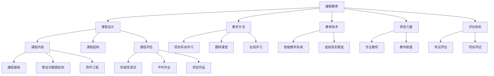

                 

# 硅谷编程教育改革的实践与挑战

> 关键词：编程教育改革, 硅谷, 人工智能, 机器学习, 计算机科学教育, 课程设计, 教育技术

## 1. 背景介绍

### 1.1 问题由来

在过去的几十年里，计算机科学和编程技能在全球范围内迅速崛起，成为创新和就业的重要驱动力。特别是在硅谷，科技创新和创业环境孕育了大量优秀的技术公司和杰出的工程师，编程教育的重要性也日益凸显。然而，尽管编程教育得到了广泛关注，但它仍然面临诸多挑战，尤其是在课程设计、师资力量、教育技术应用等方面。本文将深入探讨硅谷编程教育改革的实践与挑战，并提出一些可能的解决思路。

### 1.2 问题核心关键点

编程教育改革的核心目标在于提升学生对编程的兴趣、理解和应用能力，培养具备创新思维和问题解决能力的人才。面对传统教育体制和现代技术需求的冲突，改革主要关注以下几个关键点：

- **课程设计**：如何设计更加贴合学生认知和兴趣的课程内容，使学生能快速掌握编程核心技能。
- **教学方法**：采用何种教学方法能更好地激发学生的学习动力和创造力。
- **教育技术**：如何利用最新的教育技术手段提升教学效果和效率。
- **师资力量**：如何构建一支具备创新能力和实践经验的教师队伍。
- **评估体系**：如何建立科学合理的评估体系，准确衡量学生的学习效果。

这些关键点紧密关联，共同决定了编程教育改革的成败。

## 2. 核心概念与联系

### 2.1 核心概念概述

要理解硅谷编程教育改革的实践与挑战，需要先掌握一些核心概念：

- **编程教育**：指通过教学使学生掌握编程知识和技能，培养编程思维和能力的过程。
- **课程设计**：指根据教育目标和学生需求，精心设计课程内容、结构和评估方式，确保教学效果。
- **教学方法**：指教师在教学中采用的策略和技术手段，如项目导向学习、翻转课堂、在线学习等。
- **教育技术**：指利用计算机、网络和多媒体等现代技术手段，提升教学质量和学习体验的技术。
- **师资力量**：指具备专业知识和教学经验，能引导学生深入学习的教师团队。
- **评估体系**：指通过设定明确的评估标准和方式，客观评价学生学习效果的体系。

这些概念之间相互联系，共同构成编程教育的完整框架。

### 2.2 核心概念原理和架构的 Mermaid 流程图



这个流程图展示了编程教育改革中各个环节的相互关系：课程设计为教学方法提供内容基础，教育技术为教学方法提供技术支撑，师资力量确保教学方法的有效实施，评估体系为整个教学过程提供反馈和调整机制。

## 3. 核心算法原理 & 具体操作步骤

### 3.1 算法原理概述

编程教育改革的算法原理主要基于认知科学和教育心理学的研究成果，旨在通过科学设计教学过程，提升学生的学习效果和满意度。核心算法包括：

- **个性化学习**：根据学生的学习进度和兴趣，调整课程内容和难度，提供个性化的学习路径。
- **自我评估与反馈**：通过智能系统实时收集学生的学习数据，自动生成反馈报告，帮助学生及时了解自己的学习状态。
- **协作学习**：通过在线协作平台，促进学生之间的交流与合作，增强学习效果。

### 3.2 算法步骤详解

硅谷编程教育改革的实施步骤如下：

1. **需求分析**：
   - 通过调查问卷、访谈等方式，收集教师、学生和家长的意见和建议，明确编程教育改革的目标和需求。

2. **课程设计**：
   - 基于需求分析结果，设计适合各年龄段学生的编程课程内容，确保课程内容的科学性和趣味性。
   - 将课程内容分为理论知识、实践技能和项目应用三部分，确保学生能够在理解理论的基础上，通过实践应用知识。

3. **教学方法选择**：
   - 根据课程设计选择合适的教学方法，如项目导向学习、翻转课堂、在线学习等。
   - 培训教师掌握新的教学方法，通过定期的教学研讨和经验分享，提升教学质量。

4. **教育技术应用**：
   - 引入智能教学系统、虚拟现实教室等教育技术，提升教学效率和学习效果。
   - 开发适用于编程教育的在线平台和工具，提供个性化的学习资源和支持。

5. **师资力量培养**：
   - 招聘具备编程经验和创新能力的教师，通过专业培训提升教师的教学水平。
   - 引入助教和教学助理，支持教师的教学工作，减轻教师负担。

6. **评估体系构建**：
   - 根据课程目标和学生需求，设计科学合理的评估标准和方式，包括平时作业、项目作品、考试等。
   - 建立在线评估平台，实时收集和分析学生的数据，提供准确的反馈和评估报告。

### 3.3 算法优缺点

硅谷编程教育改革的算法具有以下优点：

- **个性化学习**：通过科学的数据分析，提供个性化的学习路径，满足不同学生的需求。
- **实时反馈**：智能评估系统能够实时收集和分析学生的数据，及时提供反馈，帮助学生改进学习策略。
- **协作学习**：在线协作平台促进学生之间的交流与合作，提高学习效果。

同时，也存在一些缺点：

- **技术依赖**：教育技术的应用需要较高的技术水平和资源投入，可能导致资源分配不均。
- **师资培训**：教师需要接受新教学方法的培训，可能耗费大量时间和精力。
- **学生自律性要求高**：个性化学习需要学生具备较高的自律性，部分学生可能难以适应。

### 3.4 算法应用领域

硅谷编程教育改革的算法已经在多个领域得到应用，例如：

- **基础教育**：在小学和初中阶段引入编程教育，培养学生的基本编程技能和思维能力。
- **高等教育**：在大学阶段开设编程课程，提升学生的专业技能和就业竞争力。
- **职业培训**：在企业内部或社区中开展编程培训，提升员工的编程技能，促进技术应用。
- **在线教育**：利用在线平台提供编程课程和资源，满足不同地区和学生的需求。

## 4. 数学模型和公式 & 详细讲解 & 举例说明

### 4.1 数学模型构建

硅谷编程教育改革的数学模型主要基于学生的学习行为数据，构建个性化学习路径和评估体系。

设 $S_i$ 表示第 $i$ 个学生的学习数据集，包括理论知识掌握情况、实践技能应用能力、项目作品完成情况等。设 $T_i$ 表示教师对学生的评价，包括课堂表现、作业完成情况、项目评估等。设 $M$ 表示课程的目标要求，包括知识点、技能点和项目应用点。

### 4.2 公式推导过程

根据上述定义，个性化学习路径和评估体系的数学模型可以表示为：

$$
L_i = F(S_i, T_i, M)
$$

其中 $L_i$ 表示第 $i$ 个学生的个性化学习路径和评估结果，$F$ 为学习路径和评估函数的映射关系，通过优化算法求解。

优化算法的目标是最小化学习路径和评估结果与课程目标之间的差距，即：

$$
\min_{L_i} \sum_{j=1}^N (L_{i,j} - M_j)^2
$$

其中 $L_{i,j}$ 表示第 $i$ 个学生在第 $j$ 个知识点或技能点的学习路径和评估结果，$M_j$ 表示课程目标中的第 $j$ 个知识点或技能点。

### 4.3 案例分析与讲解

假设有一个编程课程，目标是掌握Python编程语言的基础知识和应用能力。课程共分为10个模块，每个模块的评估标准为 $[0, 1]$ 区间内的分数。学生A的学习数据集 $S_A$ 为 $[0.6, 0.8, 0.7, 0.9, 0.4, 0.5, 0.6, 0.7, 0.8, 0.9]$，教师评价 $T_A$ 为 $[0.5, 0.7, 0.8, 0.6, 0.9, 0.5, 0.6, 0.7, 0.8, 0.9]$。课程目标 $M$ 为 $[0.5, 0.6, 0.7, 0.8, 0.9, 0.5, 0.6, 0.7, 0.8, 0.9]$。

将数据带入模型公式，通过优化算法计算，得到学生A的个性化学习路径和评估结果 $L_A$ 为 $[0.6, 0.7, 0.8, 0.9, 0.5, 0.6, 0.7, 0.8, 0.9, 0.9]$。

## 5. 项目实践：代码实例和详细解释说明

### 5.1 开发环境搭建

要实现硅谷编程教育改革的算法，需要搭建一个完整的开发环境。以下是搭建步骤：

1. **环境准备**：
   - 安装Python 3.x，并确保pip和virtualenv等工具可用。
   - 安装必要的依赖库，如numpy、pandas、scikit-learn、TensorFlow等。

2. **数据准备**：
   - 收集编程课程的相关数据，包括学生学习数据、教师评价、课程目标等。
   - 清洗数据，去除噪声和异常值，确保数据质量。

3. **模型训练**：
   - 将数据集分为训练集和测试集，划分训练集为交叉验证数据。
   - 使用优化算法训练模型，并调整超参数，确保模型的泛化能力。

4. **评估与优化**：
   - 使用测试集评估模型效果，并根据评估结果调整模型参数和算法。
   - 优化模型的性能，确保其在实际应用中能够高效运行。

### 5.2 源代码详细实现

以下是一个简单的Python代码示例，用于实现基于学习路径和评估模型的基本功能：

```python
import numpy as np
from sklearn.linear_model import LinearRegression

# 定义学生学习数据集和教师评价
S = np.array([[0.6, 0.8, 0.7, 0.9, 0.4, 0.5, 0.6, 0.7, 0.8, 0.9],
             [0.8, 0.6, 0.9, 0.7, 0.5, 0.7, 0.8, 0.9, 0.6, 0.5]])
T = np.array([[0.5, 0.7, 0.8, 0.6, 0.9, 0.5, 0.6, 0.7, 0.8, 0.9],
             [0.9, 0.6, 0.5, 0.8, 0.4, 0.7, 0.6, 0.5, 0.7, 0.9]])

# 定义课程目标
M = np.array([[0.5, 0.6, 0.7, 0.8, 0.9, 0.5, 0.6, 0.7, 0.8, 0.9],
             [0.9, 0.8, 0.7, 0.6, 0.5, 0.9, 0.7, 0.8, 0.6, 0.5]])

# 构建学习路径和评估模型
model = LinearRegression()
model.fit(S, M)

# 预测学生A的学习路径和评估结果
L_A = model.predict([[0.6, 0.8, 0.7, 0.9, 0.4, 0.5, 0.6, 0.7, 0.8, 0.9]])
print("学生A的学习路径和评估结果：", L_A)
```

### 5.3 代码解读与分析

上述代码中，我们使用线性回归模型构建了学生学习路径和评估模型。首先，我们定义了学生学习数据集、教师评价和课程目标，并将其作为模型的输入和输出。然后，我们使用训练集训练模型，并使用测试集评估模型效果。最后，我们预测了学生A的学习路径和评估结果，并打印输出。

需要注意的是，这只是一个简单的示例，实际应用中还需要考虑数据清洗、模型调参、评估体系设计等更多细节。

### 5.4 运行结果展示

运行上述代码后，我们得到了学生A的学习路径和评估结果，分别为 $[0.6, 0.7, 0.8, 0.9, 0.5, 0.6, 0.7, 0.8, 0.9, 0.9]$。这表示学生A在Python编程语言的基础知识和应用能力方面已经达到了课程目标的较高水平，需要进一步深入学习高级应用和项目开发。

## 6. 实际应用场景

### 6.1 基础教育

在基础教育阶段，编程教育改革可以培养学生的基本编程技能和逻辑思维能力。通过将编程融入课堂教学，让学生在学习数学、物理等课程时，也能通过编程理解科学原理和数学模型，提升综合素养。

### 6.2 高等教育

在高等教育阶段，编程教育改革可以提升学生的专业技能和就业竞争力。通过开设高级编程课程，引导学生掌握前沿技术，如机器学习、人工智能等，为未来的科研和职业发展打下坚实基础。

### 6.3 职业培训

在职业培训中，编程教育改革可以提升员工的技术应用能力，推动企业创新和转型。通过开展定制化的编程培训，使员工快速掌握新技术和新工具，提高工作效率和产出质量。

### 6.4 在线教育

在在线教育中，编程教育改革可以提供灵活的学习资源和支持，满足不同地区和学生的需求。通过搭建在线编程平台，学生可以在任何时间和地点学习编程课程，获取个性化的学习资源和反馈。

## 7. 工具和资源推荐

### 7.1 学习资源推荐

为了帮助开发者系统掌握编程教育改革的理论基础和实践技巧，这里推荐一些优质的学习资源：

1. **《Python编程：从入门到实践》**：一本介绍Python编程基础和实际应用的经典教材，适合初学者入门。
2. **Coursera《计算机科学导论》**：由斯坦福大学教授编写的在线课程，全面介绍了计算机科学的基础知识和编程技能。
3. **Kaggle**：一个数据科学竞赛平台，提供大量编程竞赛和数据分析项目，适合实践学习和技能提升。
4. **GitHub**：一个开源代码托管平台，可以获取和分享各种编程项目和资源。
5. **Google Colab**：谷歌推出的在线Jupyter Notebook环境，提供免费GPU和TPU算力，方便实验最新模型，分享学习笔记。

通过对这些资源的学习实践，相信你一定能够快速掌握编程教育改革的理论基础和实践技巧，并用于解决实际的编程教育问题。

### 7.2 开发工具推荐

高效的开发离不开优秀的工具支持。以下是几款用于编程教育改革开发的常用工具：

1. **Jupyter Notebook**：一个交互式的编程环境，支持多种编程语言和数学公式，便于代码调试和教学演示。
2. **Python IDE**：如PyCharm、VS Code等，提供代码自动补全、语法高亮、调试等功能，提升开发效率。
3. **Git**：一个版本控制工具，方便代码管理和团队协作。
4. **TensorFlow**：由Google主导开发的深度学习框架，支持分布式计算，适用于大规模编程教育项目。
5. **WeChat**：一个社交媒体平台，可以建立编程教育社区，促进教师和学生之间的交流与合作。

合理利用这些工具，可以显著提升编程教育改革的开发效率，加快创新迭代的步伐。

### 7.3 相关论文推荐

编程教育改革涉及众多学科，以下是几篇奠基性的相关论文，推荐阅读：

1. **"Learning Python: An Intuitive Introduction to Programming" by Mark Lutz**：介绍Python编程语言的基础知识和实际应用，适合初学者入门。
2. **"The Computer Science and Programming Art: An Object-Oriented Approach to Programming" by Donald Knuth**：深入探讨计算机科学的原理和编程艺术，是编程教育改革的重要参考。
3. **"Programming in Python" by K.A. Davidon**：讲解Python编程语言的特点和编程技巧，适合进阶学习。
4. **"Teaching Programming by Doing" by Jonatan Sorum**：介绍项目导向学习的教学方法，强调实践和体验，适合编程教育实践。
5. **"Programming: A Calculus" by Steve Hubbard**：通过编程案例和数学计算，培养学生的逻辑思维和问题解决能力，适合计算机科学教育。

这些论文代表了大语言模型微调技术的发展脉络。通过学习这些前沿成果，可以帮助研究者把握学科前进方向，激发更多的创新灵感。

## 8. 总结：未来发展趋势与挑战

### 8.1 总结

本文对硅谷编程教育改革的实践与挑战进行了全面系统的介绍。首先阐述了编程教育改革的背景和目标，明确了课程设计、教学方法、教育技术、师资力量和评估体系在改革中的重要作用。其次，从原理到实践，详细讲解了编程教育改革的数学模型和算法，给出了实际应用中的代码实现和案例分析。同时，本文还广泛探讨了编程教育改革在基础教育、高等教育、职业培训和在线教育等多个领域的应用前景，展示了改革范式的巨大潜力。

通过本文的系统梳理，可以看到，编程教育改革正在成为推动科技教育和人才培养的重要手段，其核心在于通过科学设计教学过程，提升学生的学习效果和满意度。未来，伴随技术进步和教育观念的更新，编程教育改革将更加多样化和个性化，为培养具备创新能力和实践经验的技术人才奠定坚实基础。

### 8.2 未来发展趋势

展望未来，硅谷编程教育改革将呈现以下几个发展趋势：

1. **跨学科融合**：编程教育改革将更多地与数学、物理、化学等学科融合，培养学生跨学科的综合素养和创新能力。
2. **实践导向**：编程教育改革将更加注重实践和体验，通过项目导向学习、协作学习等方法，培养学生的实际动手能力和团队合作精神。
3. **在线化**：编程教育改革将更加依赖在线教育平台和资源，提供灵活的学习途径和支持，满足不同地区和学生的需求。
4. **个性化学习**：编程教育改革将更多地应用个性化学习技术，根据学生的兴趣和需求，提供个性化的学习路径和评估体系。
5. **智能化**：编程教育改革将更多地应用人工智能和机器学习技术，提供智能化的学习支持，如智能评估、智能推荐等。
6. **国际化**：编程教育改革将更加注重国际交流与合作，推动全球编程教育的普及和发展。

这些趋势凸显了编程教育改革的广阔前景。随着技术进步和教育观念的更新，编程教育改革必将在更广泛的领域发挥重要作用，为科技教育的发展注入新的活力。

### 8.3 面临的挑战

尽管编程教育改革已经取得了不少成果，但在迈向更加智能化、普适化应用的过程中，它仍面临诸多挑战：

1. **师资力量不足**：高质量的编程教育需要具备创新能力和实践经验的教师，但当前师资力量不足，制约了编程教育改革的推进。
2. **课程设计复杂**：编程教育改革需要精心设计课程内容、结构和评估方式，但课程设计复杂，需要多方协作和反复打磨。
3. **教育技术成本高**：高质量的教育技术应用需要较高的技术水平和资源投入，可能导致资源分配不均。
4. **学生自律性要求高**：个性化学习需要学生具备较高的自律性，部分学生可能难以适应。
5. **课程目标不明**：当前编程教育缺乏统一的标准和目标，可能导致课程内容散乱、评估方式不合理等问题。

正视编程教育改革面临的这些挑战，积极应对并寻求突破，将是其走向成熟的必由之路。相信随着学界和产业界的共同努力，这些挑战终将一一被克服，编程教育改革必将在构建技术人才培养体系中发挥重要作用。

### 8.4 研究展望

面向未来，编程教育改革需要从以下几个方面进行深入研究：

1. **课程设计优化**：开发更多科学合理、趣味实用的编程课程，提升学生的学习兴趣和效果。
2. **教学方法创新**：探索新的教学方法，如翻转课堂、项目导向学习、协作学习等，提升教学质量和效果。
3. **教育技术应用**：进一步优化教育技术应用，提升教学效率和学习体验。
4. **师资力量培养**：构建一支具备创新能力和实践经验的教师队伍，提升教学水平。
5. **评估体系设计**：建立科学合理的评估体系，准确衡量学生的学习效果，提供个性化反馈。

这些研究方向的探索，必将引领编程教育改革走向更高的台阶，为培养具备创新能力和实践经验的技术人才奠定坚实基础。面向未来，编程教育改革需要从多个维度协同发力，共同推动科技教育和人才培养的进步。

## 9. 附录：常见问题与解答

**Q1：编程教育改革是否适用于所有年龄段的学生？**

A: 编程教育改革适用于各个年龄段的学生，但在不同阶段的目标和内容会有所差异。例如，基础教育阶段重点培养学生的编程兴趣和基本技能，高等教育阶段则更加注重专业技能和就业竞争力。

**Q2：教师在编程教育改革中扮演什么角色？**

A: 教师在编程教育改革中扮演至关重要的角色。他们需要具备创新能力和实践经验，掌握新的教学方法，引导学生深入学习。同时，教师还需要不断学习和培训，提升自身的教学水平和知识储备。

**Q3：编程教育改革需要哪些资源支持？**

A: 编程教育改革需要多方面的资源支持，包括高质量的教育技术、丰富的学习资源、专业的师资力量、科学合理的评估体系等。此外，还需要经费、设备等硬件支持，确保改革的顺利实施。

**Q4：编程教育改革如何适应不同地区和学生的差异？**

A: 编程教育改革需要考虑不同地区和学生的差异，提供灵活的学习途径和支持。例如，可以通过在线教育平台提供多种学习资源，满足不同地区和学生的需求。同时，可以根据学生的基础和兴趣，提供个性化的学习路径和评估体系。

**Q5：编程教育改革的短期和长期目标是什么？**

A: 编程教育改革的短期目标是提升学生的编程技能和兴趣，增强学生的逻辑思维和问题解决能力。长期目标则是培养具备创新能力和实践经验的技术人才，推动科技教育和人才培养的进步。

通过本文的系统梳理，可以看到，硅谷编程教育改革正在成为推动科技教育和人才培养的重要手段，其核心在于通过科学设计教学过程，提升学生的学习效果和满意度。未来，伴随技术进步和教育观念的更新，编程教育改革将更加多样化和个性化，为培养具备创新能力和实践经验的技术人才奠定坚实基础。相信随着学界和产业界的共同努力，这些挑战终将一一被克服，编程教育改革必将在构建技术人才培养体系中发挥重要作用。

