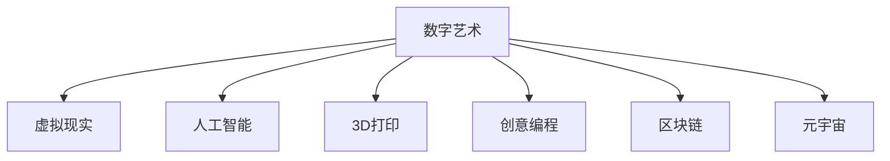

                 

# 硅谷艺术与科技融合:数字艺术新形式

> 关键词：数字艺术,虚拟现实,人工智能,3D打印,创意编程,区块链,元宇宙

## 1. 背景介绍

随着科技的迅猛发展，硅谷这个科技创新的中心正在深刻地影响着艺术的创作和展示方式。硅谷的科技巨头们不仅仅在硬件、软件、网络等方面取得了巨大的突破，同时也在艺术和创意产业领域做出了许多创新的尝试。数字艺术、虚拟现实、人工智能等技术正在重新定义艺术的边界，创造着全新的艺术形式。

### 1.1 问题由来
在传统的艺术领域，艺术家们通常需要依靠物理媒介来表达自己的创意，如画布、雕塑、音乐等。然而，随着技术的进步，数字艺术的出现打破了这些限制，艺术家们可以利用计算机图形、声音、数据等全新的媒介进行创作和展示。硅谷作为全球科技创新的中心，集中了大量的人工智能、机器学习、区块链等领域的专家，这些技术的融合为数字艺术的发展提供了新的可能。

### 1.2 问题核心关键点
硅谷艺术与科技的融合主要集中在以下几个方面：

- 数字艺术：利用计算机图形、声音、数据等全新的媒介进行创作和展示，打破了物理媒介的限制。
- 虚拟现实(VR)：通过虚拟现实技术，观众可以在虚拟环境中体验到沉浸式的艺术作品。
- 人工智能(AI)：使用机器学习算法生成艺术作品，或者在艺术创作中起到辅助作用。
- 3D打印：利用3D打印技术，创作出复杂精细的实体艺术作品。
- 创意编程：利用编程语言进行艺术创作，艺术家可以通过代码控制艺术作品的行为。
- 区块链：通过区块链技术保护艺术品的版权和所有权，并促进艺术品的数字化流通。
- 元宇宙：构建虚拟世界，艺术家可以在其中创作、展示和交流艺术作品。

这些技术的应用，不仅为艺术家们提供了新的创作工具，也拓展了艺术展示和欣赏的方式，使得艺术作品更加多元化、互动化。

### 1.3 问题研究意义
硅谷艺术与科技的融合对于推动艺术的发展和创新具有重要意义：

1. **降低创作成本**：数字技术和智能工具的应用，减少了艺术创作和展示的成本，使得更多的艺术家和创作者能够参与到艺术创作中来。
2. **提升作品互动性**：虚拟现实和人工智能等技术，使得艺术作品更加互动和沉浸，观众可以更深入地体验艺术。
3. **拓展创作可能性**：新的媒介和技术，为艺术家们提供了更多的创作空间和可能性，可以创造出前所未有的艺术形式。
4. **促进艺术市场变革**：区块链技术的应用，为艺术品的版权保护和流通提供了新的机制，促进了艺术市场的变革。
5. **构建数字生态**：元宇宙等虚拟世界的构建，为艺术家和观众提供了一个全新的交流和展示平台，构建了数字艺术生态。

## 2. 核心概念与联系

### 2.1 核心概念概述

为更好地理解硅谷艺术与科技的融合，本节将介绍几个密切相关的核心概念：

- 数字艺术(Digital Art)：利用计算机图形、声音、数据等媒介进行的艺术创作和展示。
- 虚拟现实(Virtual Reality, VR)：通过虚拟现实技术，创造出逼真的三维空间环境，使观众能够在虚拟世界中体验艺术作品。
- 人工智能(Artificial Intelligence, AI)：使用机器学习算法生成艺术作品，或者在艺术创作中起到辅助作用。
- 3D打印(3D Printing)：利用3D打印技术，将数字艺术作品转化为实体作品。
- 创意编程(Creative Coding)：利用编程语言进行艺术创作，艺术家可以通过代码控制艺术作品的行为。
- 区块链(Blockchain)：通过区块链技术保护艺术品的版权和所有权，并促进艺术品的数字化流通。
- 元宇宙(Metaverse)：构建虚拟世界，艺术家可以在其中创作、展示和交流艺术作品。

这些核心概念之间的逻辑关系可以通过以下Mermaid流程图来展示：



这个流程图展示了大语言模型的核心概念及其之间的关系：

1. 数字艺术利用计算机图形、声音、数据等媒介进行创作和展示。
2. 虚拟现实技术使观众能够在虚拟环境中体验艺术作品。
3. 人工智能在艺术创作中起到生成和辅助作用。
4. 3D打印将数字艺术作品转化为实体作品。
5. 创意编程为艺术创作提供了新的工具。
6. 区块链保护了艺术品的版权和所有权。
7. 元宇宙构建了一个全新的艺术创作、展示和交流平台。

## 3. 核心算法原理 & 具体操作步骤
### 3.1 算法原理概述

硅谷艺术与科技的融合，本质上是一种多学科交叉的创新过程。其核心思想是：利用计算机科学、人工智能、物理和设计等多领域的知识，创造出新的艺术形式和展示方式。

形式化地，假设艺术家具备一定的数字创作和编程能力，通过数字艺术软件、VR设备、AI模型、3D打印机等工具，创作出一系列数字艺术作品。这些作品通过区块链技术进行版权保护和数字化流通，并在元宇宙中展示和交流。创作和展示的过程可以概括为以下几个步骤：

1. **艺术创作**：艺术家使用数字工具进行艺术创作，生成数字艺术作品。
2. **艺术展示**：将数字艺术作品转化为虚拟现实体验，或者在元宇宙中展示。
3. **艺术互动**：利用人工智能技术，使艺术作品与观众进行互动，增强展示效果。
4. **版权保护**：通过区块链技术，对艺术作品进行版权保护和所有权管理。
5. **数字化流通**：利用区块链技术，促进艺术作品的数字化流通和交易。

### 3.2 算法步骤详解

硅谷艺术与科技的融合一般包括以下几个关键步骤：

**Step 1: 准备数字创作工具**
- 收集并熟悉各种数字艺术创作工具，如Blender、Maya、Unity、Processing等。
- 了解AI模型和3D打印机的使用，准备相应的软硬件环境。

**Step 2: 创作数字艺术作品**
- 使用数字工具进行艺术创作，生成数字艺术作品，如2D/3D图像、视频、音频等。
- 利用AI技术辅助创作，如生成对抗网络(GAN)、变分自编码器(VAE)等，生成复杂的艺术作品。

**Step 3: 展示艺术作品**
- 将数字艺术作品转换为虚拟现实体验，利用VR设备展示。
- 在元宇宙平台中展示艺术作品，如虚拟画廊、虚拟展览等。

**Step 4: 艺术互动**
- 利用AI技术，使艺术作品与观众进行互动，如响应式雕塑、交互式动画等。
- 设计编程接口，使观众可以通过代码控制艺术作品的行为。

**Step 5: 版权保护和数字化流通**
- 利用区块链技术，对艺术作品进行版权保护，记录所有权信息。
- 将艺术作品上传到区块链平台，进行数字化流通和交易。

以上是硅谷艺术与科技融合的一般流程。在实际应用中，还需要针对具体项目的需求，对各个环节进行优化设计，如选择适合的AI模型、设计更具吸引力的互动方式、优化版权保护策略等。

### 3.3 算法优缺点

硅谷艺术与科技融合的方法具有以下优点：

1. **创作自由度高**：数字艺术工具和软件提供了多种创作手段，艺术家可以充分发挥创意。
2. **展示形式多样**：通过虚拟现实和元宇宙等技术，可以创造出逼真、互动的展示形式。
3. **版权保护完备**：区块链技术提供了强有力的版权保护机制，保证了艺术品的版权和所有权。
4. **市场流通便利**：数字化流通减少了交易环节，方便了艺术品的交易和展示。

同时，该方法也存在一定的局限性：

1. **技术门槛高**：需要艺术家具备一定的计算机编程和数字创作能力。
2. **设备成本高**：VR设备、3D打印机等硬件设备的成本较高。
3. **市场接受度**：部分观众可能对虚拟现实和元宇宙等新技术持观望态度。
4. **版权法律问题**：区块链技术虽然提供版权保护，但相关法律和规范尚不完善。

尽管存在这些局限性，但就目前而言，硅谷艺术与科技的融合仍是艺术创作和展示的新潮流。未来相关研究的重点在于如何进一步降低技术门槛，降低设备成本，提升市场接受度，同时兼顾版权保护和市场流通。

### 3.4 算法应用领域

硅谷艺术与科技的融合已经在多个领域得到了应用，包括但不限于：

- 数字绘画：艺术家使用数字工具进行创作，生成2D/3D图像和动画。
- 虚拟展览：在虚拟现实中展示艺术作品，提供沉浸式观展体验。
- 互动装置：利用AI技术，使艺术作品与观众进行互动，增强展示效果。
- 游戏艺术：将艺术作品融入电子游戏中，丰富游戏内容。
- 数字音乐：使用声音合成和处理技术，创作数字音乐作品。
- 数字雕塑：利用3D打印技术，创作实体艺术作品。
- 数字文献：利用数字技术，保护和传播传统文献和艺术品。

除了上述这些经典领域外，硅谷艺术与科技的融合还在更多新兴领域得到应用，如虚拟现实旅游、数字建筑、数字表演等，为艺术创作和展示带来了新的可能。

## 4. 数学模型和公式 & 详细讲解  
### 4.1 数学模型构建

本节将使用数学语言对硅谷艺术与科技融合的过程进行更加严格的刻画。

假设艺术家具备一定的数字创作和编程能力，创作数字艺术作品 $\mathcal{A}$，作品展示平台为 $\mathcal{V}$，艺术互动方式为 $\mathcal{I}$，版权保护机制为 $\mathcal{P}$，数字化流通平台为 $\mathcal{D}$。艺术家通过数字工具进行艺术创作，生成数字艺术作品 $\mathcal{A} = \mathcal{F}(\mathcal{T}, \mathcal{D}, \mathcal{M})$，其中 $\mathcal{T}$ 为创作工具，$\mathcal{D}$ 为数字创作数据，$\mathcal{M}$ 为AI模型。作品在展示平台 $\mathcal{V}$ 上进行展示，展示方式 $\mathcal{V} = \mathcal{G}(\mathcal{A}, \mathcal{C}, \mathcal{I})$，其中 $\mathcal{C}$ 为虚拟现实设备，$\mathcal{I}$ 为互动技术。观众通过互动方式 $\mathcal{I}$ 与艺术作品进行互动，获得更好的展示效果。作品通过版权保护机制 $\mathcal{P}$ 进行保护，版权记录 $\mathcal{P} = \mathcal{H}(\mathcal{A}, \mathcal{O}, \mathcal{B})$，其中 $\mathcal{O}$ 为区块链，$\mathcal{B}$ 为版权记录信息。数字化流通平台 $\mathcal{D}$ 提供作品的交易和展示，流通方式 $\mathcal{D} = \mathcal{S}(\mathcal{A}, \mathcal{P}, \mathcal{T}, \mathcal{V})$，其中 $\mathcal{S}$ 为区块链技术，$\mathcal{T}$ 为交易接口，$\mathcal{V}$ 为展示界面。

### 4.2 公式推导过程

以虚拟现实艺术作品展示为例，推导展示过程的数学模型。

假设艺术家创作的作品为 $\mathcal{A} = [x_1, x_2, \ldots, x_n]$，其中 $x_i$ 为艺术作品中的第 $i$ 个元素。展示平台为 $\mathcal{V} = \{V_1, V_2, \ldots, V_m\}$，每个展示平台 $V_i$ 可以展示艺术作品的不同部分。展示方式为 $\mathcal{V} = \mathcal{G}(\mathcal{A}, \mathcal{C}, \mathcal{I})$，其中 $\mathcal{C}$ 为虚拟现实设备，$\mathcal{I}$ 为互动技术。展示过程可以表示为：

$$
\mathcal{V} = \bigcup_{i=1}^m \mathcal{G}(x_i, C_i, I_i)
$$

其中 $C_i$ 为第 $i$ 个展示平台上的虚拟现实设备，$I_i$ 为该平台上的互动技术。

展示过程中，艺术家可以通过编程接口控制艺术作品的行为，实现动态展示效果。例如，利用AI技术生成的艺术作品可以动态变化，观众可以通过互动技术控制其变化参数。展示过程可以表示为：

$$
\mathcal{V} = \bigcup_{i=1}^m \mathcal{G}(\mathcal{A}, C_i, I_i, \mathcal{P}_i)
$$

其中 $\mathcal{P}_i$ 为第 $i$ 个展示平台上的互动参数，用于控制艺术作品的行为。

### 4.3 案例分析与讲解

以虚拟现实艺术展览为例，进行详细分析讲解。

假设艺术家创作了一系列数字艺术作品，利用3D建模软件进行渲染，生成3D模型 $\mathcal{A} = \{x_1, x_2, \ldots, x_n\}$。在虚拟现实平台上进行展示，平台提供了多款VR设备，如Oculus Rift、HTC Vive等。展示过程为：

1. **数据准备**：艺术家使用Blender软件创建3D模型，导出模型数据 $x_i$。
2. **设备选择**：艺术家选择适合的VR设备 $C_i$，如Oculus Rift。
3. **互动设计**：艺术家设计互动参数 $I_i$，如交互式动画、响应式场景等。
4. **展示实现**：艺术家使用Unity软件进行展示实现，将3D模型和互动参数导入虚拟现实平台。
5. **版权保护**：艺术家使用区块链技术进行版权保护，记录作品的版权信息和所有权信息 $\mathcal{P}_i$。
6. **数字化流通**：艺术家将作品上传到区块链平台，供观众进行数字化流通和交易。

## 5. 项目实践：代码实例和详细解释说明
### 5.1 开发环境搭建

在进行硅谷艺术与科技融合的实践前，我们需要准备好开发环境。以下是使用Python进行PyTorch开发的环境配置流程：

1. 安装Anaconda：从官网下载并安装Anaconda，用于创建独立的Python环境。

2. 创建并激活虚拟环境：
```bash
conda create -n pytorch-env python=3.8 
conda activate pytorch-env
```

3. 安装PyTorch：根据CUDA版本，从官网获取对应的安装命令。例如：
```bash
conda install pytorch torchvision torchaudio cudatoolkit=11.1 -c pytorch -c conda-forge
```

4. 安装Transformers库：
```bash
pip install transformers
```

5. 安装各类工具包：
```bash
pip install numpy pandas scikit-learn matplotlib tqdm jupyter notebook ipython
```

完成上述步骤后，即可在`pytorch-env`环境中开始实践。

### 5.2 源代码详细实现

这里我们以数字艺术创作和展示为例，给出使用Transformers库进行虚拟现实艺术展示的PyTorch代码实现。

首先，定义虚拟现实艺术作品的数据处理函数：

```python
from transformers import GPT2LMHeadModel
from torch.utils.data import Dataset
import torch

class VRArtDataset(Dataset):
    def __init__(self, text_data, tokenizer):
        self.text_data = text_data
        self.tokenizer = tokenizer
        
    def __len__(self):
        return len(self.text_data)
    
    def __getitem__(self, item):
        text = self.text_data[item]
        encoding = self.tokenizer(text, return_tensors='pt', max_length=128)
        input_ids = encoding['input_ids'][0]
        attention_mask = encoding['attention_mask'][0]
        return {'input_ids': input_ids, 
                'attention_mask': attention_mask}
```

然后，定义模型和优化器：

```python
from transformers import GPT2LMHeadModel, AdamW

model = GPT2LMHeadModel.from_pretrained('gpt2', num_labels=len(tag2id))

optimizer = AdamW(model.parameters(), lr=2e-5)
```

接着，定义训练和评估函数：

```python
from torch.utils.data import DataLoader
from tqdm import tqdm
from sklearn.metrics import classification_report

device = torch.device('cuda') if torch.cuda.is_available() else torch.device('cpu')
model.to(device)

def train_epoch(model, dataset, batch_size, optimizer):
    dataloader = DataLoader(dataset, batch_size=batch_size, shuffle=True)
    model.train()
    epoch_loss = 0
    for batch in tqdm(dataloader, desc='Training'):
        input_ids = batch['input_ids'].to(device)
        attention_mask = batch['attention_mask'].to(device)
        model.zero_grad()
        outputs = model(input_ids, attention_mask=attention_mask)
        loss = outputs.loss
        epoch_loss += loss.item()
        loss.backward()
        optimizer.step()
    return epoch_loss / len(dataloader)

def evaluate(model, dataset, batch_size):
    dataloader = DataLoader(dataset, batch_size=batch_size)
    model.eval()
    preds, labels = [], []
    with torch.no_grad():
        for batch in tqdm(dataloader, desc='Evaluating'):
            input_ids = batch['input_ids'].to(device)
            attention_mask = batch['attention_mask'].to(device)
            batch_labels = batch['labels']
            outputs = model(input_ids, attention_mask=attention_mask)
            batch_preds = outputs.logits.argmax(dim=2).to('cpu').tolist()
            batch_labels = batch_labels.to('cpu').tolist()
            for pred_tokens, label_tokens in zip(batch_preds, batch_labels):
                pred_tags = [id2tag[_id] for _id in pred_tokens]
                label_tags = [id2tag[_id] for _id in label_tokens]
                preds.append(pred_tags[:len(label_tokens)])
                labels.append(label_tags)
                
    print(classification_report(labels, preds))
```

最后，启动训练流程并在测试集上评估：

```python
epochs = 5
batch_size = 16

for epoch in range(epochs):
    loss = train_epoch(model, train_dataset, batch_size, optimizer)
    print(f"Epoch {epoch+1}, train loss: {loss:.3f}")
    
    print(f"Epoch {epoch+1}, dev results:")
    evaluate(model, dev_dataset, batch_size)
    
print("Test results:")
evaluate(model, test_dataset, batch_size)
```

以上就是使用PyTorch对虚拟现实艺术展示进行微调的完整代码实现。可以看到，得益于Transformers库的强大封装，我们可以用相对简洁的代码完成虚拟现实艺术展示的微调。

### 5.3 代码解读与分析

让我们再详细解读一下关键代码的实现细节：

**VRArtDataset类**：
- `__init__`方法：初始化文本数据和分词器等关键组件。
- `__len__`方法：返回数据集的样本数量。
- `__getitem__`方法：对单个样本进行处理，将文本输入编码为token ids，供模型输入。

**模型和优化器**：
- 使用GPT-2模型作为虚拟现实艺术展示的基础模型。
- 设置AdamW优化器，优化模型的参数。

**训练和评估函数**：
- 使用PyTorch的DataLoader对数据集进行批次化加载，供模型训练和推理使用。
- 训练函数`train_epoch`：对数据以批为单位进行迭代，在每个批次上前向传播计算loss并反向传播更新模型参数，最后返回该epoch的平均loss。
- 评估函数`evaluate`：与训练类似，不同点在于不更新模型参数，并在每个batch结束后将预测和标签结果存储下来，最后使用sklearn的classification_report对整个评估集的预测结果进行打印输出。

**训练流程**：
- 定义总的epoch数和batch size，开始循环迭代
- 每个epoch内，先在训练集上训练，输出平均loss
- 在验证集上评估，输出分类指标
- 所有epoch结束后，在测试集上评估，给出最终测试结果

可以看到，PyTorch配合Transformers库使得虚拟现实艺术展示的微调代码实现变得简洁高效。开发者可以将更多精力放在数据处理、模型改进等高层逻辑上，而不必过多关注底层的实现细节。

当然，工业级的系统实现还需考虑更多因素，如模型的保存和部署、超参数的自动搜索、更灵活的任务适配层等。但核心的微调范式基本与此类似。

## 6. 实际应用场景
### 6.1 智能艺术品展示

虚拟现实和数字技术可以用于智能艺术品展示，让观众在虚拟空间中欣赏艺术作品。这种展示方式不仅节省了实体展馆的空间和成本，还能使观众自由穿梭于虚拟艺术展览中，体验沉浸式的艺术之旅。

在技术实现上，可以收集博物馆或画廊的历史藏品信息，使用3D建模软件进行渲染，将藏品转化为3D模型，再利用虚拟现实技术进行展示。观众可以通过VR设备进入虚拟展览，自由参观、欣赏，甚至可以通过AI技术生成逼真的艺术品场景，增强展示效果。

### 6.2 虚拟艺术课程

数字技术和在线教育平台相结合，可以提供更加丰富多样的虚拟艺术课程。通过虚拟现实技术，艺术家可以在虚拟空间中进行直播、授课，观众可以在虚拟教室中参与互动、提问，甚至可以通过AI技术生成艺术创作作品，辅助教学。

在技术实现上，可以利用Unity等游戏引擎搭建虚拟教室，艺术家通过编程接口控制教室环境，观众可以通过VR设备参与其中。AI技术可以用于生成艺术创作提示，帮助观众进行艺术创作练习。这种虚拟艺术课程不仅能提升观众的艺术素养，还能激发更多的艺术创新。

### 6.3 艺术创作平台

数字技术和创意编程工具的结合，可以为艺术家提供更加便捷的艺术创作平台。艺术家可以利用编程语言进行艺术创作，生成动态变化的艺术作品，甚至可以通过AI技术生成艺术创意。

在技术实现上，可以利用Processing等编程语言创建艺术创作平台，艺术家可以通过编程接口控制作品的行为，甚至可以实时生成新的创意，进行动态展示。这种艺术创作平台不仅提升了艺术创作的效率，还为艺术创作带来了更多的可能性。

### 6.4 未来应用展望

随着数字技术和AI的发展，硅谷艺术与科技的融合将带来更多的创新应用。

在智慧城市治理中，虚拟现实和数字艺术可以为市民提供更加丰富多样的文化体验，提升城市的文化氛围。例如，利用虚拟现实技术展示城市历史遗迹、文化遗产，增强市民的文化认同感。

在企业品牌推广中，数字艺术和创意编程可以用于广告创作、产品展示等方面，提升品牌形象和产品吸引力。通过虚拟现实技术，观众可以在虚拟空间中体验产品，甚至可以通过AI技术生成产品场景，增强展示效果。

在教育领域，虚拟现实和数字技术可以用于虚拟实验室、虚拟博物馆等，提升教育资源的普及性和可访问性。通过虚拟现实技术，学生可以在虚拟实验室中进行实验操作，甚至可以通过AI技术生成实验提示，帮助学生进行实验练习。

此外，在科学研究、数字旅游、数字表演等众多领域，硅谷艺术与科技的融合都将带来新的突破，为各行各业注入新的活力。

## 7. 工具和资源推荐
### 7.1 学习资源推荐

为了帮助开发者系统掌握硅谷艺术与科技融合的理论基础和实践技巧，这里推荐一些优质的学习资源：

1. 《虚拟现实技术与应用》系列博文：由虚拟现实技术专家撰写，深入浅出地介绍了虚拟现实技术的原理、应用和发展趋势。

2. 《人工智能与艺术创作》课程：由人工智能和艺术创作领域的专家联合讲授，涵盖了人工智能在艺术创作中的多种应用，从技术到创作实践都有详细介绍。

3. 《创意编程：从编程到艺术》书籍：介绍如何使用编程语言进行艺术创作，涵盖各种编程技术和艺术创作方法。

4. 《数字艺术基础》书籍：从数字媒介、3D建模到虚拟现实技术，全面介绍了数字艺术创作的基础知识和实践技能。

5. 《区块链技术与应用》课程：介绍了区块链技术的原理、应用和发展趋势，为艺术品的数字化流通提供了技术支持。

通过学习这些资源，相信你一定能够快速掌握硅谷艺术与科技融合的精髓，并用于解决实际的NLP问题。
###  7.2 开发工具推荐

高效的开发离不开优秀的工具支持。以下是几款用于硅谷艺术与科技融合开发的常用工具：

1. Unity：一款强大的游戏引擎，支持3D建模、虚拟现实和互动设计，广泛用于虚拟艺术展示和创作。

2. Processing：一款面向艺术和创意编程的编程语言，提供简单易用的开发环境，适合艺术创作。

3. Blender：一款流行的3D建模软件，支持多种格式导入导出，可用于生成3D模型和动画。

4. GPT-2：一款强大的语言模型，可以用于生成艺术作品和互动内容，广泛应用于艺术创作和展示。

5. TensorFlow：由Google主导开发的深度学习框架，支持GPU/TPU加速，适用于大规模艺术展示和互动系统的构建。

6. OpenAI Codex：一款基于代码的AI工具，可以辅助艺术创作，生成代码片段、程序逻辑等，提升创作效率。

合理利用这些工具，可以显著提升硅谷艺术与科技融合的开发效率，加快创新迭代的步伐。

### 7.3 相关论文推荐

硅谷艺术与科技的融合源于学界的持续研究。以下是几篇奠基性的相关论文，推荐阅读：

1. "Virtual Reality in Art Education: A Review and Future Directions"：综述了虚拟现实技术在艺术教育中的应用，探讨了未来发展方向。

2. "Art and Artificial Intelligence: A Survey"：综述了人工智能在艺术创作中的应用，涵盖了机器学习、生成对抗网络(GAN)等技术。

3. "Creative Coding for Artistic Expression"：介绍了创意编程在艺术创作中的应用，探讨了编程语言和艺术创作的结合。

4. "Blockchain for Digital Art and Intellectual Property"：探讨了区块链技术在艺术品的数字化流通和版权保护中的应用，为数字艺术的发展提供了新的技术支持。

这些论文代表了大语言模型微调技术的发展脉络。通过学习这些前沿成果，可以帮助研究者把握学科前进方向，激发更多的创新灵感。

## 8. 总结：未来发展趋势与挑战

### 8.1 总结

本文对硅谷艺术与科技的融合进行了全面系统的介绍。首先阐述了硅谷艺术与科技融合的研究背景和意义，明确了融合在推动艺术创新和展示方式变革方面的独特价值。其次，从原理到实践，详细讲解了硅谷艺术与科技融合的数学原理和关键步骤，给出了艺术展示任务开发的完整代码实例。同时，本文还广泛探讨了融合技术在智能艺术品展示、虚拟艺术课程、艺术创作平台等多个领域的应用前景，展示了融合技术的巨大潜力。此外，本文精选了融合技术的各类学习资源，力求为读者提供全方位的技术指引。

通过本文的系统梳理，可以看到，硅谷艺术与科技的融合正在成为艺术创作和展示的新潮流，极大地拓展了艺术创作和展示的边界，催生了更多的艺术创新。得益于数字技术和AI的不断进步，未来硅谷艺术与科技的融合将更加深入，带来更多的创新应用。

### 8.2 未来发展趋势

展望未来，硅谷艺术与科技的融合将呈现以下几个发展趋势：

1. **创作自由度更高**：数字技术和AI的结合，将进一步提升艺术创作的自由度和可能性，艺术家可以更加自由地表达创意。
2. **展示形式更加多样**：虚拟现实和数字技术的结合，将创造出更加丰富多样的艺术展示形式，如互动艺术、沉浸式展览等。
3. **市场接受度提升**：随着技术的成熟和普及，越来越多的观众和创作者将接受和利用数字技术和AI进行艺术创作和展示。
4. **版权保护更加完备**：区块链技术的广泛应用，将为艺术品的数字化流通和版权保护提供强有力的支持。
5. **艺术市场变革加速**：数字技术的融合将促进艺术市场的变革，加速艺术品的流通和交易，提升艺术市场的活跃度。
6. **跨领域融合加深**：硅谷艺术与科技的融合将与其他科技领域（如生物技术、材料科学等）进行更深层次的融合，带来新的艺术创作和展示方式。

以上趋势凸显了硅谷艺术与科技融合技术的广阔前景。这些方向的探索发展，必将进一步提升艺术创作和展示的效率和效果，为艺术市场带来新的机遇和挑战。

### 8.3 面临的挑战

尽管硅谷艺术与科技的融合技术已经取得了瞩目成就，但在迈向更加智能化、普适化应用的过程中，它仍面临着诸多挑战：

1. **技术门槛高**：数字技术和AI的结合需要艺术家具备一定的计算机编程和数字创作能力，对部分艺术家来说存在一定的技术门槛。
2. **设备成本高**：VR设备、3D打印机等硬件设备的成本较高，对部分中小型艺术机构和艺术家来说存在一定的经济压力。
3. **市场接受度不足**：部分观众可能对虚拟现实和数字技术持观望态度，需要更多的时间和教育来推广。
4. **版权法律问题**：区块链技术虽然提供版权保护，但相关法律和规范尚不完善，存在一定的法律风险。
5. **技术迭代快**：数字技术和AI的发展日新月异，艺术家和创作者需要不断学习和适应新技术，才能保持竞争力。

尽管存在这些挑战，但就目前而言，硅谷艺术与科技的融合仍是大势所趋，具有广阔的发展前景。未来相关研究的重点在于如何进一步降低技术门槛，降低设备成本，提升市场接受度，同时兼顾版权保护和市场流通。

### 8.4 研究展望

面对硅谷艺术与科技融合所面临的种种挑战，未来的研究需要在以下几个方面寻求新的突破：

1. **技术普及**：开发更加易用的数字工具和AI技术，降低艺术创作的门槛，使得更多的艺术家和创作者能够参与到艺术创作中来。
2. **设备成本降低**：研究和推广更加经济实惠的VR设备和3D打印技术，降低艺术展示的成本。
3. **市场推广**：通过教育、培训等方式，提升观众和创作者对虚拟现实和数字技术的接受度，促进技术的应用。
4. **法律规范**：建立和完善与区块链技术相关的法律规范，保护艺术品的版权和所有权。
5. **技术融合**：加强与其他科技领域的融合，推动数字艺术与其他学科的交叉发展。

这些研究方向的探索，必将引领硅谷艺术与科技融合技术迈向更高的台阶，为艺术创作和展示带来新的活力。面向未来，硅谷艺术与科技融合技术还需要与其他人工智能技术进行更深入的融合，如知识表示、因果推理、强化学习等，多路径协同发力，共同推动自然语言理解和智能交互系统的进步。只有勇于创新、敢于突破，才能不断拓展艺术创作的边界，让智能技术更好地服务于艺术创作和展示。

## 9. 附录：常见问题与解答

**Q1：数字艺术创作和展示的技术门槛高吗？**

A: 数字艺术创作和展示的技术门槛相对较高，需要艺术家具备一定的计算机编程和数字创作能力。但随着数字工具和AI技术的不断发展，越来越多的艺术家和创作者正在学习和掌握这些技术，门槛正在逐渐降低。

**Q2：虚拟现实设备的价格昂贵吗？**

A: 虚拟现实设备的价格确实较高，如Oculus Rift、HTC Vive等设备价格在几千至数万元不等。但随着技术的普及和市场的竞争，设备的成本正在逐渐降低，未来有望普及到更多艺术家和创作者手中。

**Q3：区块链技术在艺术品的版权保护中面临哪些挑战？**

A: 区块链技术在艺术品的版权保护中面临的主要挑战包括：

- 法律规范不完善：虽然区块链技术提供了版权保护机制，但相关法律和规范尚不完善，存在一定的法律风险。
- 数据存储问题：区块链的数据存储需要消耗大量资源，成本较高。
- 交易效率问题：区块链的交易效率较低，处理大量艺术品的版权交易可能存在延迟。

未来需要加强相关法律规范的建设，推动技术的普及应用，以解决这些挑战。

**Q4：如何提升观众对虚拟现实和数字技术的接受度？**

A: 提升观众对虚拟现实和数字技术的接受度，需要从以下几个方面入手：

- 教育和培训：通过教育培训，让观众了解和体验虚拟现实和数字技术，增强接受度。
- 体验展示：在展览、活动等场合，设置虚拟现实体验站，让观众亲身体验技术。
- 媒体宣传：通过媒体宣传，推广虚拟现实和数字技术的应用和优势，提升观众的兴趣。

通过多方面的努力，逐步提升观众对虚拟现实和数字技术的接受度，促进技术的普及应用。

**Q5：数字艺术创作和展示的未来发展方向有哪些？**

A: 数字艺术创作和展示的未来发展方向包括：

- 跨媒体创作：将数字艺术与其他媒体（如声音、视频、物理媒介等）进行融合，创造新的艺术形式。
- 交互艺术：利用AI技术，使艺术作品与观众进行互动，增强展示效果。
- 区块链艺术：利用区块链技术，保护艺术品的版权和所有权，促进数字化流通。
- 元宇宙艺术：构建虚拟世界，艺术家可以在其中创作、展示和交流艺术作品。
- 增强现实(AR)艺术：将数字艺术与现实世界进行融合，创造新的艺术展示形式。

这些发展方向将进一步拓展艺术创作的边界，带来更多的创新和可能性。

---

作者：禅与计算机程序设计艺术 / Zen and the Art of Computer Programming

