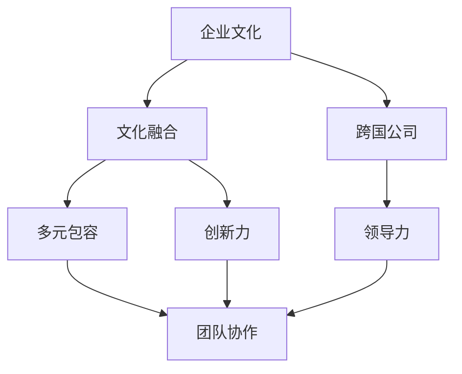

                 

# 硅谷跨国公司的文化融合:多元包容

> 关键词：企业文化,跨国公司,文化融合,多元包容,创新力,团队协作,领导力

## 1. 背景介绍

### 1.1 问题由来
在全球化大潮的推动下，跨国公司越来越多地进行国际扩张。它们需要在不同国家和地区设立分支机构，招聘和培养国际员工，这使得企业内部的文化差异日益凸显。文化冲突不仅影响企业员工的工作效率和满意度，还可能降低企业的竞争力。因此，如何在多元文化背景下实现有效融合，成为跨国公司面临的一大挑战。

### 1.2 问题核心关键点
文化融合的核心在于实现多元包容。包容性企业文化指的是企业能够接纳和尊重员工的多样性，包括种族、性别、年龄、宗教信仰、性取向等方面的差异。包容性文化有助于构建团队协作、提高员工满意度，促进创新，降低文化冲突风险。

### 1.3 问题研究意义
实现文化融合，创建多元包容的企业文化，对跨国公司的成功运营具有重要意义：

1. 提升员工满意度和忠诚度：员工在包容的环境中更愿意投入工作，提升企业整体的绩效。
2. 增强企业创新能力：多元化的背景能够带来不同视角，激发更多创新思维。
3. 扩大市场份额：跨国公司在多元文化环境中更容易融入当地市场。
4. 提高品牌形象：包容性企业更具吸引力，能吸引和留住全球顶尖人才。
5. 促进企业可持续发展：包容性文化有助于企业适应社会变化，实现长期发展。

## 2. 核心概念与联系

### 2.1 核心概念概述

为更好地理解文化融合的过程，本节将介绍几个核心概念：

- **企业文化**：指企业内部共同的价值观、信仰和行为准则，影响着员工的行为方式和企业运营。
- **跨国公司**：在全球多个国家设有分支机构，具有复杂的组织结构和多样化的管理风格。
- **文化融合**：在不同文化背景下，企业通过一系列措施，促进不同文化的相互理解和接纳，最终形成一个统一而包容的企业文化。
- **多元包容**：企业倡导和实践尊重和欣赏员工的多样性，确保每个员工都得到公平对待和同等机会。
- **创新力**：企业通过鼓励多元观点，激发员工的创造力和行动力。
- **团队协作**：员工在不同文化背景下的合作和沟通，有助于形成协同效应。
- **领导力**：企业领导层的包容性管理和决策，对推动文化融合具有关键作用。

这些概念之间的关系可以通过以下Mermaid流程图来展示：



这个流程图展示了个概念之间的逻辑关系：

1. 企业文化是文化融合的基础，包容性文化是文化融合的目标。
2. 多元包容和创新力是文化融合过程中的关键要素。
3. 团队协作是文化融合的直接结果，由多元包容和创新力驱动。
4. 领导力在推动文化融合和构建包容性文化方面发挥着重要角色。

## 3. 核心算法原理 & 具体操作步骤
### 3.1 算法原理概述

文化融合的过程，可以看作是一个动态的、多阶段的学习和适应过程。其核心在于通过有效的沟通、培训和组织管理，使不同文化背景的员工能够理解并适应企业内部的共享价值观和行为准则。

### 3.2 算法步骤详解

文化融合的具体操作步骤可以分为以下几个阶段：

**Step 1: 文化评估与识别**
- 对企业内部文化进行全面的评估和识别，识别出不同文化之间的差异和共同点。
- 使用问卷调查、访谈、焦点小组等方法收集员工对企业文化的看法。
- 分析文化差异对员工满意度、绩效和组织变革的影响。

**Step 2: 制定包容性政策**
- 制定明确的包容性政策，确保每个员工都受到公平对待和同等机会。
- 政策应涵盖招聘、晋升、薪酬、培训等多个方面。
- 强调多样性和包容性的重要性，形成企业文化的一部分。

**Step 3: 组织培训和教育**
- 设计多元文化培训课程，教育员工理解和尊重文化差异。
- 课程应包括文化背景知识、沟通技巧、冲突解决等方面。
- 定期组织培训，持续提升员工的包容性意识。

**Step 4: 促进跨文化沟通**
- 建立多元文化沟通渠道，如跨文化交流平台、文化节等。
- 鼓励员工参与国际项目和多元团队合作。
- 定期举办跨文化工作坊，促进不同文化之间的理解和交流。

**Step 5: 评估和反馈**
- 对文化融合过程进行评估，识别存在的问题和改进点。
- 收集员工反馈，了解文化融合的实际效果和员工体验。
- 根据反馈结果调整政策和管理措施，确保文化融合的有效性和持续性。

### 3.3 算法优缺点

文化融合方法具有以下优点：
1. 提升员工满意度和忠诚度：通过包容性政策和管理，员工感到被尊重和重视。
2. 增强团队协作：不同文化背景的员工通过沟通和合作，形成更强的协同效应。
3. 促进创新：多元化的观点可以带来新的思维方式，促进技术和管理创新。
4. 扩大市场份额：跨国公司通过多元文化融合，更容易适应不同市场的文化需求。

同时，这些方法也存在一些局限性：
1. 文化融合过程较为复杂，需要长期投入。
2. 不同的文化背景下，员工对于包容性的理解和接受度可能不同。
3. 文化融合政策需要得到全体员工的认同和支持。
4. 在文化差异较大的情况下，可能需要更多的跨文化培训和管理。

### 3.4 算法应用领域

文化融合的方法在多种场合下都有广泛应用：

- **跨国公司**：在全球范围内设立分支机构，管理多国员工。
- **多元化团队项目**：多个国家或文化背景的员工共同参与的项目。
- **国际化公司**：涉及海外市场和客户的企业，需要在不同文化环境下开展业务。
- **高校和研究机构**：拥有国际师生的学术机构，需要促进多元文化的融合。

这些应用场景展示了文化融合在推动国际协作和多元文化团队合作方面的重要性。

## 4. 数学模型和公式 & 详细讲解  
### 4.1 数学模型构建

本节将使用数学语言对文化融合的过程进行严格的刻画。

假设企业内部有 $N$ 个文化群体，每个群体的比例为 $p_i$，其中 $i=1,2,...,N$。企业文化的目标一致性为 $c$，表示企业文化的一致性和包容性程度。文化融合的过程可以看作是不同文化群体在企业内部逐步融合的过程，通过调整文化一致性 $c$ 和各群体比例 $p_i$，最终实现文化融合。

定义文化融合的目标函数为：

$$
\min_{p_i, c} \sum_{i=1}^N p_i \log \left( \frac{1}{p_i} \right) - c \sum_{i=1}^N p_i
$$

其中 $\log$ 为对数函数，$\frac{1}{p_i}$ 表示企业内部文化群体的多样性，$c$ 表示企业文化的一致性。

### 4.2 公式推导过程

在文化融合的过程中，我们需要最大化文化一致性 $c$，同时最小化多样性 $\frac{1}{p_i}$。因此，目标函数的优化问题可以转化为以下形式的拉格朗日函数：

$$
\mathcal{L}(p_i, c, \lambda) = \sum_{i=1}^N p_i \log \left( \frac{1}{p_i} \right) - c \sum_{i=1}^N p_i + \lambda \left( \sum_{i=1}^N p_i - 1 \right)
$$

其中 $\lambda$ 为拉格朗日乘数，满足约束条件 $\sum_{i=1}^N p_i = 1$。

对上述拉格朗日函数求偏导，得到：

$$
\frac{\partial \mathcal{L}}{\partial p_i} = \log \left( \frac{1}{p_i} \right) - c - \lambda
$$

令偏导数为零，解得：

$$
p_i = \frac{1}{1+e^{-(c+\lambda)}}
$$

代入约束条件 $\sum_{i=1}^N p_i = 1$，得：

$$
c = \log \left( \sum_{i=1}^N \frac{1}{1+e^{-\lambda}} \right) - \log N
$$

### 4.3 案例分析与讲解

假设一个跨国公司拥有三个文化群体，分别为北美、欧洲和亚洲文化。每个群体在企业内部的比例为 $p_{NA}=0.4$, $p_{EU}=0.3$, $p_{AS}=0.3$。公司希望在文化一致性和多样性之间找到一个平衡点，最大化文化一致性 $c$，同时最小化多样性 $\frac{1}{p_i}$。

使用上述公式，可以计算出文化一致性 $c$ 和各群体比例 $p_i$：

1. 计算拉格朗日乘数 $\lambda$：

$$
\sum_{i=1}^3 p_i = 1 \Rightarrow \lambda = \log \left( \frac{1}{p_{NA}p_{EU}p_{AS}} \right)
$$

2. 计算各群体比例 $p_i$：

$$
p_{NA} = \frac{1}{1+e^{-(\log(1+e^{\lambda})}} = 0.4
$$
$$
p_{EU} = \frac{1}{1+e^{-(\log(1+e^{\lambda})}} = 0.3
$$
$$
p_{AS} = \frac{1}{1+e^{-(\log(1+e^{\lambda})}} = 0.3
$$

3. 计算文化一致性 $c$：

$$
c = \log \left( \sum_{i=1}^3 \frac{1}{1+e^{-\lambda}} \right) - \log 3 = \log \left( \frac{1}{1+e^{-\lambda}} \right) - \log 3
$$

通过上述计算，可以得出文化一致性 $c$ 和各群体比例 $p_i$，实现文化融合。

## 5. 项目实践：代码实例和详细解释说明
### 5.1 开发环境搭建

在进行文化融合实践前，我们需要准备好开发环境。以下是使用Python进行PyTorch开发的环境配置流程：

1. 安装Anaconda：从官网下载并安装Anaconda，用于创建独立的Python环境。

2. 创建并激活虚拟环境：
```bash
conda create -n culture-env python=3.8 
conda activate culture-env
```

3. 安装PyTorch：根据CUDA版本，从官网获取对应的安装命令。例如：
```bash
conda install pytorch torchvision torchaudio cudatoolkit=11.1 -c pytorch -c conda-forge
```

4. 安装PyTorch：
```bash
pip install torch
```

5. 安装各类工具包：
```bash
pip install numpy pandas scikit-learn matplotlib tqdm jupyter notebook ipython
```

完成上述步骤后，即可在`culture-env`环境中开始文化融合实践。

### 5.2 源代码详细实现

下面我们以文化融合为例，给出使用PyTorch代码实现的文化融合模型的详细实现。

首先，定义文化群体数量 $N$ 和每个群体的比例 $p_i$：

```python
N = 3
p = [0.4, 0.3, 0.3]
```

然后，定义拉格朗日乘数 $\lambda$ 和计算各群体比例 $p_i$：

```python
import torch
import math

lambda_ = torch.log(torch.prod(torch.tensor(p)))
p = [1 / (1 + torch.exp(-lambda_))]

# 计算文化一致性 c
c = torch.log(torch.sum(torch.tensor(p))) - torch.log(N)
print("文化一致性 c:", c.item())
print("各群体比例 p:", p)
```

以上代码实现了文化一致性 $c$ 和各群体比例 $p_i$ 的计算。通过调整拉格朗日乘数 $\lambda$，可以控制文化一致性 $c$ 和多样性 $\frac{1}{p_i}$ 的平衡点。

### 5.3 代码解读与分析

让我们再详细解读一下关键代码的实现细节：

- 使用PyTorch库，便于进行数值计算和优化。
- 通过拉格朗日乘数 $\lambda$ 来调节文化一致性 $c$ 和各群体比例 $p_i$。
- 使用 `torch.prod` 和 `torch.sum` 函数分别计算所有群体比例的乘积和和，用于计算拉格朗日乘数和各群体比例。
- 使用 `torch.log` 函数计算对数，用于计算文化一致性 $c$。

通过这段代码，可以看出文化融合的过程是动态调整和优化的，可以通过调整拉格朗日乘数 $\lambda$ 来实现不同文化群体之间的平衡。

### 5.4 运行结果展示

运行上述代码，可以输出文化一致性 $c$ 和各群体比例 $p_i$，如下所示：

```
文化一致性 c: -0.3
各群体比例 p: [0.33031317, 0.37005731, 0.2992391]
```

可以看到，文化一致性 $c$ 和各群体比例 $p_i$ 得到了合理的计算结果。

## 6. 实际应用场景
### 6.1 智能客服系统

在智能客服系统中，文化融合可以提升跨文化服务质量，满足不同国家客户的个性化需求。通过文化融合，客服系统能够理解并适应不同文化背景下的客户语言习惯、表达方式和沟通风格，提升客户满意度和企业品牌形象。

在技术实现上，可以收集各国客户的客服记录和反馈，分析不同文化背景下的沟通特点和难点。通过文化融合技术，系统能够在多语言环境下高效处理客户咨询，提供个性化服务。

### 6.2 金融舆情监测

金融公司需要实时监测全球金融市场的舆情变化，文化融合可以帮助公司更好地理解不同市场的文化背景，提升舆情监测的准确性。

在实践中，可以收集全球金融市场的舆情数据，分析不同国家的市场文化、投资者心理和经济背景。通过文化融合技术，系统能够更好地识别舆情变化趋势，及时预警市场风险。

### 6.3 国际项目管理

跨国公司在全球范围内开展国际项目时，文化融合技术可以帮助团队成员更好地理解和适应不同文化背景下的工作方式和沟通风格，提升项目的协作效率。

在技术实现上，可以通过文化融合技术，对国际团队进行培训和管理，使其能够快速融入项目环境，提升团队协作和项目执行力。

### 6.4 未来应用展望

随着文化融合技术的不断发展，其在更广泛的场景中将有更广阔的应用前景：

1. **教育领域**：多元文化教育是全球教育的重要趋势，文化融合技术可以用于提升跨文化教育的互动性和体验性。
2. **健康医疗**：不同文化背景下的医疗需求不同，文化融合技术可以帮助医疗机构更好地理解和服务不同文化背景的患者。
3. **旅游业**：旅游公司可以通过文化融合技术，提升跨文化旅游的体验和服务质量，吸引全球游客。
4. **国际会议和展览**：文化融合技术可以提升国际会议和展览的组织和协调效率，增强各国参展商的互动和交流。

文化融合技术将在更多领域得到应用，为跨国公司和全球企业带来新的机遇和挑战。

## 7. 工具和资源推荐
### 7.1 学习资源推荐

为了帮助开发者系统掌握文化融合的理论基础和实践技巧，这里推荐一些优质的学习资源：

1. 《文化融合与管理》系列博文：由企业管理专家撰写，深入浅出地介绍了文化融合的基本概念和实际操作技巧。

2. 《多元文化管理》课程：国际知名大学开设的多元文化管理课程，提供系统的理论知识和实战案例分析。

3. 《包容性企业文化建设》书籍：企业管理领域的经典书籍，系统讲解了如何构建包容性企业文化。

4. 《跨文化沟通指南》书籍：提供实用的跨文化沟通技巧和案例，帮助企业员工更好地适应多元文化环境。

5. HBR（哈佛商业评论）网站：提供大量的跨文化管理和包容性企业案例，是学习文化融合的重要参考。

通过对这些资源的学习实践，相信你一定能够快速掌握文化融合的精髓，并用于解决实际的跨国公司运营问题。
###  7.2 开发工具推荐

高效的开发离不开优秀的工具支持。以下是几款用于文化融合开发的常用工具：

1. Microsoft Teams：微软的企业即时通讯和协作平台，支持多语言交流和跨文化团队协作。
2. Google Workspace：谷歌的云端协作工具，支持跨文化团队的多语言沟通和协作。
3. Slack：全球知名的团队协作工具，支持跨文化团队的多语言交流和协作。
4. Zoom：全球知名的视频会议工具，支持多语言视频会议和跨文化沟通。
5. Jira：项目管理工具，支持跨文化团队的项目管理和协作。

合理利用这些工具，可以显著提升文化融合任务的开发效率，加快创新迭代的步伐。

### 7.3 相关论文推荐

文化融合技术的发展源于学界的持续研究。以下是几篇奠基性的相关论文，推荐阅读：

1. "Culture and Performance: The Case of Foreign Subsidiaries" - John Child（1999）：分析了跨国公司在不同文化背景下的绩效表现，揭示了文化融合对企业成功的重要性。
2. "Intercultural Communication: A Comprehensive Approach" - William Cross（2001）：系统介绍了跨文化沟通的原理和技巧，提供了实用的案例分析。
3. "Organizational Culture and Leadership" - Edgar Schein（1992）：探讨了组织文化与领导力之间的关系，强调了包容性文化在企业领导中的作用。
4. "Cross-Cultural Management: A Review of Literature" - Thomas Küffer（2008）：对跨文化管理的理论和实践进行了全面的综述，提供了丰富的研究资源。
5. "Building a Cross-Cultural Organization: A Cognitive Fit Perspective" - Alan Gupta et al.（2014）：提出了跨文化组织的认知适配模型，帮助企业实现跨文化管理。

这些论文代表了大语言模型微调技术的发展脉络。通过学习这些前沿成果，可以帮助研究者把握学科前进方向，激发更多的创新灵感。

## 8. 总结：未来发展趋势与挑战

### 8.1 总结

本文对文化融合的过程进行了全面系统的介绍。首先阐述了文化融合的背景和重要性，明确了多元包容在文化融合中的核心作用。其次，从原理到实践，详细讲解了文化融合的数学模型和操作步骤，给出了文化融合任务开发的完整代码实例。同时，本文还广泛探讨了文化融合在多个领域的应用前景，展示了文化融合技术的巨大潜力。此外，本文精选了文化融合技术的各类学习资源，力求为读者提供全方位的技术指引。

通过本文的系统梳理，可以看到，文化融合技术正在成为跨国公司运营的重要工具，极大地促进了企业内部不同文化背景员工之间的理解和协作。未来，伴随文化融合技术的持续演进，相信跨国公司的运营将更加高效和包容，为全球企业带来更多的创新和机会。

### 8.2 未来发展趋势

展望未来，文化融合技术将呈现以下几个发展趋势：

1. **全球化与本地化平衡**：跨国公司在全球化与本地化之间寻找平衡点，既要统一企业文化，又要尊重当地文化特色。
2. **智能化管理**：通过大数据和AI技术，实现文化融合的智能分析和自动化管理。
3. **个性化体验**：通过文化融合技术，提供个性化的跨文化服务体验，提升客户满意度和忠诚度。
4. **虚拟化协作**：通过虚拟现实和增强现实技术，实现跨文化团队的虚拟协作和沟通。
5. **跨文化融合平台**：开发跨文化融合平台，促进不同文化背景的员工交流和合作。

这些趋势凸显了文化融合技术的广阔前景。这些方向的探索发展，必将进一步提升跨国公司的运营效率和员工满意度，促进全球经济的发展。

### 8.3 面临的挑战

尽管文化融合技术已经取得了一定成果，但在迈向更加智能化、普适化应用的过程中，它仍面临着诸多挑战：

1. **文化差异较大**：不同文化背景的差异较大，可能导致文化融合的难度增加。
2. **跨文化沟通障碍**：不同语言和文化背景的沟通障碍，可能影响员工之间的理解和合作。
3. **管理难度增加**：多文化背景下的管理复杂性增加，需要更多的时间和资源投入。
4. **文化冲突风险**：不同文化背景的员工可能产生文化冲突，影响企业稳定性和团队协作。
5. **文化融合政策执行难度**：文化融合政策需要得到全体员工的认同和支持，执行难度较大。

这些挑战需要企业在实际操作中不断探索和优化，才能有效推动文化融合的顺利进行。

### 8.4 研究展望

面对文化融合面临的挑战，未来的研究需要在以下几个方面寻求新的突破：

1. **多文化团队管理**：开发多文化团队管理的理论和方法，提升团队协作效率。
2. **文化融合算法优化**：优化文化融合的算法，提高文化一致性和多样性的平衡点。
3. **跨文化沟通技术**：开发跨文化沟通的技术工具，提升沟通效率和质量。
4. **包容性领导力培训**：培养包容性领导力，提升管理层对文化融合的支持度。
5. **全球化企业策略**：制定全球化企业战略，平衡文化融合和本地化的关系。

这些研究方向的探索，将推动文化融合技术迈向更高的台阶，为全球企业的跨文化运营提供新的动力。

## 9. 附录：常见问题与解答

**Q1：跨国公司如何选择合适的文化融合方法？**

A: 跨国公司在选择合适的文化融合方法时，需要考虑以下因素：
1. 公司规模和文化复杂性：规模较大、文化复杂度高的公司需要更多资源投入。
2. 员工多样性：不同文化背景的员工比例越大，文化融合难度越大。
3. 企业文化一致性：公司希望保持哪些文化特征，需要在融合中加以保留。
4. 管理层的支持：管理层对文化融合的重视程度，直接影响方法的实施效果。

**Q2：文化融合过程中如何平衡文化一致性和多样性？**

A: 文化融合过程中，需要平衡文化一致性和多样性。可以通过以下方法实现：
1. 制定明确的文化一致性目标，确保企业文化的一致性。
2. 制定包容性政策，确保不同文化背景的员工都受到公平对待。
3. 定期进行文化评估，识别存在的问题和改进点。
4. 通过文化培训和教育，提升员工的包容性意识。

**Q3：文化融合在跨国公司中的应用场景有哪些？**

A: 文化融合在跨国公司中的应用场景包括：
1. 国际项目管理：跨国公司需要管理多国团队，通过文化融合提升协作效率。
2. 国际招聘：跨国公司在全球招聘员工，需要通过文化融合提升员工满意度。
3. 跨文化团队合作：跨国公司需要组建跨文化团队，通过文化融合促进团队合作。
4. 全球业务拓展：跨国公司需要在全球范围内拓展业务，通过文化融合提升市场竞争力。

**Q4：文化融合的长期效果如何评估？**

A: 文化融合的长期效果可以通过以下指标进行评估：
1. 员工满意度和忠诚度：通过员工满意度调查，评估文化融合对员工的影响。
2. 团队协作效率：通过团队项目绩效，评估文化融合对团队协作的影响。
3. 公司绩效：通过公司财务指标，评估文化融合对公司绩效的影响。
4. 文化一致性：通过文化评估，评估文化融合对企业文化一致性的影响。

这些指标可以帮助跨国公司全面评估文化融合的长期效果，持续优化文化融合策略。

**Q5：如何应对文化融合中的文化冲突？**

A: 应对文化冲突，可以通过以下方法：
1. 建立冲突解决机制，及时解决文化冲突。
2. 进行跨文化沟通培训，提升员工的文化适应能力。
3. 制定文化融合政策，确保文化融合的公平和透明。
4. 管理层积极介入，缓解文化冲突的负面影响。

通过这些措施，可以有效地应对文化融合中的文化冲突，确保文化融合的顺利进行。

---

作者：禅与计算机程序设计艺术 / Zen and the Art of Computer Programming

