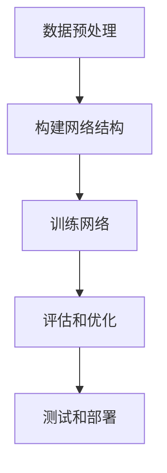
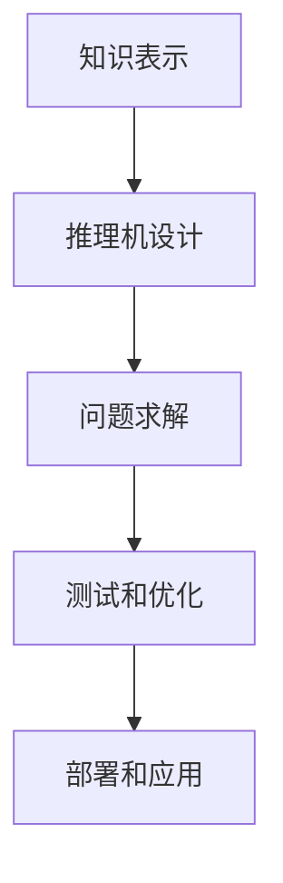

                 

### 文章标题

### Title

#### 《连接主义与行为主义的挑战》

#### Challenges between Connectionism and Behaviorism

本文旨在探讨连接主义和 行为主义在人工智能领域的挑战与争议，通过分析其理论基础、应用场景和未来发展，揭示两种学派在人工智能发展过程中的互动与冲突。

In this article, we aim to explore the challenges and debates between connectionism and behaviorism in the field of artificial intelligence. By analyzing their theoretical foundations, application scenarios, and future development, we aim to reveal the interactions and conflicts between these two schools of thought in the process of AI development.

### 引言 Introduction

连接主义和行为主义是人工智能领域的两大主要学派，分别基于神经科学和认知心理学的研究，对人工智能的发展产生了深远影响。连接主义强调神经网络和信息处理的过程，主张通过模拟人脑神经元之间的连接和交互来实现智能；而行为主义则关注人工智能的行为表现，主张通过设计算法和规则来实现特定任务。

Connectionism and behaviorism are the two major schools of thought in the field of artificial intelligence, based on the research of neuroscience and cognitive psychology, which have had a profound impact on the development of AI. Connectionism emphasizes the process of neural networks and information processing, advocating for the realization of intelligence by simulating the connections and interactions between neurons in the human brain. On the other hand, behaviorism focuses on the behavioral performance of AI, advocating for the realization of specific tasks through the design of algorithms and rules.

在过去的几十年里，连接主义和行为主义在人工智能领域相互竞争、相互借鉴，推动了人工智能的快速发展。然而，随着深度学习和强化学习等新技术的兴起，两种学派之间的争议也逐渐显现，本文将对此进行深入探讨。

Over the past few decades, connectionism and behaviorism have competed and learned from each other in the field of AI, driving its rapid development. However, with the emergence of new technologies such as deep learning and reinforcement learning, the controversies between the two schools have also become increasingly apparent, which will be thoroughly discussed in this article.

### 背景介绍 Background Introduction

#### Background Introduction

#### 连接主义 Connectionism

连接主义（Connectionism）起源于20世纪80年代，其理论基础是人工神经网络（Artificial Neural Networks，ANNs）。人工神经网络是由大量简单的计算单元（神经元）通过加权连接构成的网络，这些神经元可以模拟人脑神经元的工作方式。连接主义认为，智能是通过神经元之间的连接和相互作用来实现的，网络的学习过程是通过调整这些连接的权重来实现的。

The connectionism originated in the 1980s, with its theoretical foundation being Artificial Neural Networks (ANNs). An Artificial Neural Network consists of a large number of simple computational units (neurons) connected by weighted connections, which can simulate the working manner of neurons in the human brain. Connectionism believes that intelligence is achieved through the connections and interactions between neurons in the network, and the learning process of the network is realized by adjusting the weights of these connections.

#### 行为主义 Behaviorism

行为主义（Behaviorism）则起源于20世纪30年代，其理论基础是基于刺激-反应（stimulus-response）模型。行为主义主张，行为是由外部刺激引起的，可以通过设计适当的刺激和反应规则来控制行为。在人工智能领域，行为主义通过设计规则和算法来实现特定任务，如专家系统和逻辑编程。

Behaviorism originated in the 1930s, with its theoretical foundation being the stimulus-response model. Behaviorism argues that behavior is caused by external stimuli, and behavior can be controlled by designing appropriate stimuli and response rules. In the field of AI, behaviorism designs rules and algorithms to achieve specific tasks, such as expert systems and logic programming.

#### 两种学派的关系 The Relationship between the Two Schools

连接主义和行为主义在人工智能的发展过程中既有竞争又有合作。连接主义通过模拟人脑神经元之间的连接和交互，试图实现类似于人类的智能；而行为主义则通过设计规则和算法，实现特定任务的高效执行。两者在人工智能的不同领域和应用场景中都有各自的优势和局限。

Connectionism and behaviorism have both competition and cooperation in the development of AI. Connectionism attempts to achieve human-like intelligence by simulating the connections and interactions between neurons in the human brain, while behaviorism achieves efficient execution of specific tasks through the design of rules and algorithms. Both schools have their advantages and limitations in different fields and application scenarios of AI.

### 核心概念与联系 Core Concepts and Connections

#### Core Concepts and Connections

#### 1. 连接主义的主要观点 Main Ideas of Connectionism

连接主义的主要观点可以概括为以下几点：

1. **神经网络模拟人脑**：连接主义认为，人脑是由大量简单的神经元通过复杂的连接构成的，神经网络可以模拟人脑的工作方式。

2. **权重调整实现学习**：神经网络通过不断调整神经元之间的连接权重来学习，这种学习过程可以模拟人脑的学习机制。

3. **分布式表示**：连接主义主张，知识不是存储在单个神经元中，而是分布在神经网络中的多个神经元中，这种分布式表示有助于提高系统的鲁棒性和泛化能力。

1. **Neural Networks Simulate the Human Brain**: Connectionism believes that the human brain is composed of a large number of simple neurons interconnected in a complex manner, and neural networks can simulate the working manner of the human brain.

2. **Weight Adjustment for Learning**: Neural networks learn by continuously adjusting the weights of connections between neurons, which simulates the learning mechanism of the human brain.

3. **Distributed Representation**: Connectionism advocates that knowledge is not stored in a single neuron but distributed across multiple neurons in the neural network, which helps improve the robustness and generalization ability of the system.

#### 2. 行为主义的主要观点 Main Ideas of Behaviorism

行为主义的主要观点可以概括为以下几点：

1. **刺激-反应模型**：行为主义主张，行为是由外部刺激引起的，可以通过设计适当的刺激和反应规则来控制行为。

2. **规则和算法实现任务**：行为主义通过设计规则和算法来实现特定任务，如专家系统通过规则推理来解决复杂问题。

3. **任务导向**：行为主义强调，人工智能应该致力于解决实际应用中的具体问题，而不是追求模拟人类智能。

1. **Stimulus-Response Model**: Behaviorism argues that behavior is caused by external stimuli, and behavior can be controlled by designing appropriate stimuli and response rules.

2. **Rules and Algorithms for Task Completion**: Behaviorism achieves specific tasks through the design of rules and algorithms, such as expert systems using rule-based reasoning to solve complex problems.

3. **Task-Oriented**: Behaviorism emphasizes that AI should focus on solving specific problems in practical applications rather than striving to simulate human intelligence.

#### 3. 两种学派的关系 The Relationship between the Two Schools

连接主义和行为主义在人工智能的发展过程中既有竞争又有合作。

1. **竞争**：连接主义主张通过模拟人脑来实现智能，而行为主义主张通过设计规则和算法来实现智能，两者在理论上存在一定的对立。

2. **合作**：在实际应用中，连接主义和行为主义可以相互补充。例如，连接主义可以通过神经网络来提取特征，而行为主义可以通过规则和算法来处理这些特征，从而实现更高效的智能系统。

1. **Competition**: Connectionism advocates for achieving intelligence by simulating the human brain, while behaviorism advocates for achieving intelligence by designing rules and algorithms, which lead to some theoretical opposition between the two schools.

2. **Cooperation**: In practical applications, connectionism and behaviorism can complement each other. For example, connectionism can use neural networks to extract features, while behaviorism can process these features using rules and algorithms to achieve more efficient intelligent systems.

### 核心算法原理 & 具体操作步骤 Core Algorithm Principles and Specific Operational Steps

#### Core Algorithm Principles and Specific Operational Steps

#### 连接主义 Core Algorithms of Connectionism

连接主义的核心算法包括人工神经网络（ANNs）、深度学习（Deep Learning）和生成对抗网络（Generative Adversarial Networks，GANs）。

1. **人工神经网络（ANNs）**：人工神经网络由大量简单的神经元通过加权连接构成，通过调整连接权重来学习。具体操作步骤如下：

   - **初始化**：随机初始化网络结构和连接权重。
   - **前向传播**：将输入数据传递到网络的每一层，通过激活函数计算输出。
   - **反向传播**：计算输出误差，通过反向传播算法更新连接权重。
   - **迭代训练**：重复前向传播和反向传播的过程，直到网络性能达到预期。

   **Initialization**: Randomly initialize the network structure and connection weights.
   - **Forward Propagation**: Pass the input data through each layer of the network and compute the output using activation functions.
   - **Backpropagation**: Calculate the output error and update the connection weights using the backpropagation algorithm.
   - **Iterative Training**: Repeat the forward propagation and backpropagation processes until the network performance meets the expected criteria.

2. **深度学习（Deep Learning）**：深度学习是人工神经网络的一种扩展，通过堆叠多层神经网络来实现更复杂的特征提取和模式识别。具体操作步骤如下：

   - **数据预处理**：对输入数据进行归一化、去噪等预处理。
   - **构建网络结构**：设计合适的网络架构，如卷积神经网络（CNNs）或循环神经网络（RNNs）。
   - **训练网络**：使用大量训练数据对网络进行训练，通过反向传播算法调整连接权重。
   - **评估和优化**：使用验证数据集评估网络性能，通过调整网络结构和超参数来优化性能。

   **Data Preprocessing**: Normalize and denoise the input data.
   - **Constructing the Network Structure**: Design an appropriate network architecture, such as Convolutional Neural Networks (CNNs) or Recurrent Neural Networks (RNNs).
   - **Training the Network**: Train the network using a large amount of training data, and adjust the connection weights using the backpropagation algorithm.
   - **Evaluation and Optimization**: Evaluate the network performance using a validation dataset, and optimize the performance by adjusting the network structure and hyperparameters.

3. **生成对抗网络（GANs）**：生成对抗网络由生成器和判别器两个神经网络组成，通过对抗训练来实现生成高质量数据。具体操作步骤如下：

   - **初始化**：随机初始化生成器和判别器的网络结构和连接权重。
   - **生成器训练**：生成器尝试生成与真实数据相似的数据，判别器判断生成数据的质量。
   - **判别器训练**：判别器尝试区分真实数据和生成数据。
   - **迭代训练**：重复生成器和判别器的训练过程，直到生成器生成的数据质量达到预期。

   **Initialization**: Randomly initialize the network structure and connection weights of the generator and the discriminator.
   - **Training the Generator**: The generator tries to generate data similar to the real data, while the discriminator judges the quality of the generated data.
   - **Training the Discriminator**: The discriminator tries to differentiate between real data and generated data.
   - **Iterative Training**: Repeat the training process of the generator and the discriminator until the generated data quality meets the expected criteria.

#### 行为主义 Core Algorithms of Behaviorism

行为主义的核心算法包括专家系统（Expert Systems）、逻辑编程（Logic Programming）和计划（Planning）。

1. **专家系统（Expert Systems）**：专家系统是一种基于规则的智能系统，通过大量规则库和推理机来解决复杂问题。具体操作步骤如下：

   - **知识表示**：将专家知识转化为规则库，如产生式规则或框架表示。
   - **推理机设计**：设计合理的推理机，如正向推理或反向推理。
   - **问题求解**：使用推理机根据规则库解决具体问题。

   **Knowledge Representation**: Convert expert knowledge into rule bases, such as production rules or frame representations.
   - **Reasoning Machine Design**: Design a reasonable reasoning machine, such as forward reasoning or backward reasoning.
   - **Problem Solving**: Use the reasoning machine to solve specific problems based on the rule bases.

2. **逻辑编程（Logic Programming）**：逻辑编程是一种基于逻辑的编程范式，通过编写逻辑程序来解决问题。具体操作步骤如下：

   - **编写逻辑程序**：使用逻辑编程语言，如Prolog，编写问题求解程序。
   - **解析和执行**：解析逻辑程序，根据逻辑推理规则执行程序。
   - **查询和验证**：使用逻辑查询语言查询程序结果，并验证结果的正确性。

   **Writing Logical Programs**: Use logical programming languages, such as Prolog, to write problem-solving programs.
   - **Parsing and Execution**: Parse the logical programs and execute them based on logical reasoning rules.
   - **Querying and Verification**: Use logical query languages to query the results of the programs and verify the correctness of the results.

3. **计划（Planning）**：计划是一种基于规则和算法的智能行为，通过规划步骤实现目标。具体操作步骤如下：

   - **目标表示**：将目标转化为规划问题的目标图。
   - **约束处理**：处理规划过程中的约束和冲突。
   - **搜索算法**：使用合适的搜索算法，如A*算法或状态空间搜索。
   - **计划生成**：生成实现目标的步骤序列。

   **Objective Representation**: Convert the objectives into a planning problem's goal graph.
   - **Constraint Handling**: Handle constraints and conflicts during the planning process.
   - **Search Algorithms**: Use appropriate search algorithms, such as A* or state-space search.
   - **Plan Generation**: Generate a sequence of steps to achieve the objectives.

### 数学模型和公式 Mathematical Models and Formulas

#### Mathematical Models and Formulas

#### 连接主义 Mathematical Models of Connectionism

连接主义中的数学模型主要涉及神经网络的学习算法、损失函数和优化方法。

1. **学习算法**：神经网络的学习算法通常基于梯度下降（Gradient Descent）和其变种，如随机梯度下降（Stochastic Gradient Descent，SGD）和Adam优化器。以下是一个简单的梯度下降算法的公式：

   $$ w_{new} = w_{old} - \alpha \cdot \nabla_w J(w) $$

   其中，$w$是网络的权重，$J(w)$是损失函数，$\alpha$是学习率。

   **Learning Algorithm**: The learning algorithms of neural networks are usually based on gradient descent and its variants, such as stochastic gradient descent (SGD) and Adam optimizer. The following is a simple formula of gradient descent:

   $$ w_{new} = w_{old} - \alpha \cdot \nabla_w J(w) $$

   Where $w$ is the weight of the network, $J(w)$ is the loss function, and $\alpha$ is the learning rate.

2. **损失函数**：损失函数是衡量网络输出与真实标签之间差异的函数，常用的损失函数有均方误差（Mean Squared Error，MSE）和交叉熵（Cross-Entropy）。以下是一个MSE的公式：

   $$ MSE = \frac{1}{m} \sum_{i=1}^{m} (y_i - \hat{y}_i)^2 $$

   其中，$y_i$是真实标签，$\hat{y}_i$是网络输出的预测值，$m$是样本数量。

   **Loss Function**: The loss function measures the difference between the network's output and the true labels. Common loss functions include Mean Squared Error (MSE) and Cross-Entropy. The following is a formula for MSE:

   $$ MSE = \frac{1}{m} \sum_{i=1}^{m} (y_i - \hat{y}_i)^2 $$

   Where $y_i$ is the true label, $\hat{y}_i$ is the predicted value of the network's output, and $m$ is the number of samples.

3. **优化方法**：优化方法是调整网络权重以最小化损失函数的过程。常用的优化方法有动量（Momentum）和自适应学习率（AdaGrad、Adam）。以下是一个AdaGrad的公式：

   $$ \Delta w = \frac{\eta \cdot \nabla J(w)}{\sqrt{I_t + \epsilon}} $$

   其中，$\eta$是学习率，$I_t$是历史梯度平方和，$\epsilon$是常数以避免除以零。

   **Optimization Methods**: Optimization methods are the processes of adjusting network weights to minimize the loss function. Common optimization methods include Momentum and Adaptive Learning Rate (AdaGrad, Adam). The following is a formula for AdaGrad:

   $$ \Delta w = \frac{\eta \cdot \nabla J(w)}{\sqrt{I_t + \epsilon}} $$

   Where $\eta$ is the learning rate, $I_t$ is the sum of the squared gradients over time, and $\epsilon$ is a constant to avoid division by zero.

#### 行为主义 Mathematical Models of Behaviorism

行为主义中的数学模型主要涉及逻辑推理、概率论和决策论。

1. **逻辑推理**：逻辑推理是行为主义的核心，常用的推理方法有命题逻辑、谓词逻辑和归纳推理。以下是一个命题逻辑的推理规则：

   - **命题逻辑**（Conjunction, Disjunction, Negation）：
     - **合取**（Conjunction）：$p \land q$ 表示 $p$ 和 $q$ 都为真。
     - **析取**（Disjunction）：$p \lor q$ 表示 $p$ 或 $q$ 为真。
     - **否定**（Negation）：$\neg p$ 表示 $p$ 为假。

     **Propositional Logic** (Conjunction, Disjunction, Negation):
     - **Conjunction**: $p \land q$ means that both $p$ and $q$ are true.
     - **Disjunction**: $p \lor q$ means that either $p$ or $q$ is true.
     - **Negation**: $\neg p$ means that $p$ is false.

   - **谓词逻辑**（Predicate Logic）：
     - **存在性量词**（Existential Quantifier）：$\exists x P(x)$ 表示存在一个 $x$ 使得 $P(x)$ 为真。
     - **全称性量词**（Universal Quantifier）：$\forall x P(x)$ 表示对于所有的 $x$，$P(x)$ 都为真。

     **Predicate Logic**:
     - **Existential Quantifier**: $\exists x P(x)$ means that there exists an $x$ such that $P(x)$ is true.
     - **Universal Quantifier**: $\forall x P(x)$ means that for all $x$, $P(x)$ is true.

   - **归纳推理**（Inductive Reasoning）：
     - **归纳一般化**（Generalization）：从具体的实例中推断出一般性的结论。
     - **归纳特殊化**（Specialization）：从一般性的结论推断出具体的实例。

     **Inductive Reasoning**:
     - **Inductive Generalization**: Derive general conclusions from specific instances.
     - **Inductive Specialization**: Derive specific instances from general conclusions.

2. **概率论**：概率论是行为主义中的另一个重要工具，用于表示不确定性和不确定性推理。以下是一些基本的概率论公式：

   - **条件概率**（Conditional Probability）：$P(A|B) = \frac{P(A \cap B)}{P(B)}$，表示在事件 $B$ 发生的条件下，事件 $A$ 发生的概率。
   - **贝叶斯定理**（Bayes' Theorem）：$P(A|B) = \frac{P(B|A) \cdot P(A)}{P(B)}$，用于在已知某些条件下，计算某个事件发生的概率。
   - **全概率公式**（Total Probability）：$P(A) = \sum_{i=1}^{n} P(A|B_i) \cdot P(B_i)$，用于计算某个事件的总概率。

     **Probability Theory**:
     - **Conditional Probability**: $P(A|B) = \frac{P(A \cap B)}{P(B)}$, which represents the probability of event $A$ occurring given that event $B$ has occurred.
     - **Bayes' Theorem**: $P(A|B) = \frac{P(B|A) \cdot P(A)}{P(B)}$, used to calculate the probability of an event given some conditions.
     - **Total Probability**: $P(A) = \sum_{i=1}^{n} P(A|B_i) \cdot P(B_i)$, used to calculate the total probability of an event.

3. **决策论**：决策论用于处理不确定性和风险，以下是一些基本的决策论公式：

   - **期望效用**（Expected Utility）：$EU = \sum_{i=1}^{n} u(i) \cdot p(i)$，表示在给定概率分布下，各个可能结果的效用乘以概率的总和。
   - **期望收益**（Expected Return）：$ER = \sum_{i=1}^{n} r(i) \cdot p(i)$，表示在给定概率分布下，各个可能结果的收益乘以概率的总和。
   - **风险规避**（Risk Aversion）：$\lambda$ 用于表示个体对风险的偏好程度，$\lambda > 1$ 表示更偏好风险规避。

     **Decision Theory**:
     - **Expected Utility**: $EU = \sum_{i=1}^{n} u(i) \cdot p(i)$, representing the sum of the utilities of each possible outcome weighted by their probabilities.
     - **Expected Return**: $ER = \sum_{i=1}^{n} r(i) \cdot p(i)$, representing the sum of the returns of each possible outcome weighted by their probabilities.
     - **Risk Aversion**: $\lambda$ is used to represent an individual's preference for risk, with $\lambda > 1$ indicating a higher degree of risk aversion.

### 项目实践 Project Practice

#### Project Practice

#### 1. 连接主义项目实践：手写数字识别 Handwritten Digit Recognition

在本项目中，我们将使用卷积神经网络（Convolutional Neural Network，CNN）来识别手写数字。以下是项目的基本步骤：

1. **数据预处理**：首先，我们需要获取手写数字数据集，如MNIST数据集。然后，对数据进行归一化和标准化处理，以便神经网络可以更好地学习。

2. **构建网络结构**：设计一个简单的卷积神经网络，包括卷积层、池化层和全连接层。使用合适的激活函数和正则化方法，如Dropout，来提高网络性能。

3. **训练网络**：使用训练数据集对网络进行训练，调整网络权重以最小化损失函数。在此过程中，我们可以使用学习率调整和批量归一化等技术来提高训练效率。

4. **评估和优化**：使用验证数据集评估网络性能，并根据评估结果调整网络结构和超参数，如学习率和批量大小。

5. **测试和部署**：使用测试数据集对网络进行测试，评估识别准确率。如果性能满足要求，可以将网络部署到实际应用中。

#### 2. 行为主义项目实践：逻辑编程游戏机器人 Logic Programming Game Robot

在本项目中，我们使用逻辑编程来设计一个机器人，使其能够在游戏中进行策略决策。以下是项目的基本步骤：

1. **知识表示**：将游戏状态和策略规则转化为逻辑程序，使用Prolog语言表示。

2. **推理机设计**：设计一个推理机，用于根据游戏状态和规则进行推理，生成可行的策略。

3. **问题求解**：使用推理机解决具体问题，如确定下一步行动。

4. **测试和优化**：测试机器人在不同游戏状态下的表现，并根据测试结果优化逻辑程序和推理机。

5. **部署和应用**：将机器人部署到实际游戏中，观察其表现并不断优化。

### 实际应用场景 Practical Application Scenarios

#### Practical Application Scenarios

#### 1. 连接主义的应用场景 Application Scenarios of Connectionism

连接主义在许多实际应用场景中具有广泛的应用，以下是一些典型的例子：

1. **计算机视觉**：连接主义算法在图像分类、目标检测、图像分割等任务中具有出色的性能。例如，卷积神经网络（CNNs）在人脸识别、医学图像分析等领域得到了广泛应用。

2. **自然语言处理**：连接主义在语言模型、机器翻译、文本分类等方面取得了显著成果。例如，基于循环神经网络（RNNs）和长短期记忆网络（LSTMs）的语言模型在语音识别和机器翻译中得到了广泛应用。

3. **语音识别**：连接主义算法在语音识别任务中表现出色，如深度神经网络（DNNs）和卷积神经网络（CNNs）在语音识别中得到了广泛应用。

4. **强化学习**：连接主义在强化学习任务中也有广泛应用，如深度强化学习（Deep Reinforcement Learning）在自动驾驶、游戏AI等领域取得了显著成果。

#### 2. 行为主义的应用场景 Application Scenarios of Behaviorism

行为主义在许多实际应用场景中也具有广泛的应用，以下是一些典型的例子：

1. **专家系统**：专家系统在医疗诊断、金融分析、法律咨询等领域得到了广泛应用。例如，基于规则推理的专家系统在诊断疾病和提供投资建议方面表现出色。

2. **逻辑编程**：逻辑编程在自动化推理、智能搜索、知识图谱构建等领域具有广泛应用。例如，Prolog语言在自然语言处理和自动化推理中得到了广泛应用。

3. **计划系统**：计划系统在物流调度、生产排程、自动化控制等领域具有广泛应用。例如，基于状态空间搜索的计划系统在调度优化和控制优化中取得了显著成果。

4. **自动化测试**：行为主义在自动化测试领域具有广泛应用，如基于规则的测试方法和基于模型检查的测试方法在软件质量保证中发挥了重要作用。

### 工具和资源推荐 Tools and Resources Recommendations

#### Tools and Resources Recommendations

#### 1. 学习资源推荐 Learning Resources Recommendations

1. **书籍**：
   - 《神经网络与深度学习》（Neural Networks and Deep Learning）——邱锡鹏
   - 《Python机器学习》（Python Machine Learning）——Sebastian Raschka
   - 《深度学习》（Deep Learning）——Ian Goodfellow、Yoshua Bengio和Aaron Courville

2. **在线课程**：
   - 吴恩达的《深度学习专项课程》（Deep Learning Specialization）——Coursera
   - 斯坦福大学的《神经网络与深度学习》（CS231n: Convolutional Neural Networks for Visual Recognition）——Stanford University

3. **博客和论文**：
   - 官方文档和博客：TensorFlow、PyTorch、Keras等
   - 知名学者的博客：Hugo Larochelle、Yoshua Bengio等

#### 2. 开发工具框架推荐 Development Tools and Framework Recommendations

1. **编程语言**：
   - Python：因其丰富的库和框架而成为人工智能开发的主要语言。
   - R：在统计分析和机器学习领域具有广泛应用。

2. **深度学习框架**：
   - TensorFlow：由Google开发，是当前最流行的深度学习框架之一。
   - PyTorch：由Facebook开发，具有灵活性和易用性。
   - Keras：是一个高层次的神经网络API，可以与TensorFlow和Theano兼容。

3. **工具和库**：
   - NumPy：用于数值计算的库。
   - Pandas：用于数据处理和分析的库。
   - Matplotlib、Seaborn：用于数据可视化的库。

#### 3. 相关论文著作推荐 Related Papers and Books Recommendations

1. **论文**：
   - “Backpropagation” —— Paul Werbos（1974）
   - “Learning representations by back-propagating errors” —— David E. Rumelhart, Geoffrey E. Hinton and Ronald J. Williams（1986）
   - “A learning algorithm for continually running fully recurrent neural networks” —— Jürgen Schmidhuber（1987）

2. **书籍**：
   - 《人工神经网络：一种现代的方法》（Artificial Neural Networks: A Modern Approach）——Simon Haykin
   - 《深度学习》（Deep Learning）——Ian Goodfellow、Yoshua Bengio和Aaron Courville
   - 《机器学习：概率视角》（Machine Learning: A Probabilistic Perspective）——Kevin P. Murphy

### 总结 Summary

#### Summary

本文从连接主义和行为主义的理论基础、核心算法、应用场景等方面进行了深入探讨，揭示了两种学派在人工智能领域中的挑战与争议。连接主义通过模拟人脑神经元之间的连接和交互，实现智能；而行为主义则通过设计规则和算法，实现特定任务。在未来的发展中，连接主义和行为主义将继续相互竞争、相互借鉴，推动人工智能的进步。

In summary, this article has conducted an in-depth exploration of the theoretical foundations, core algorithms, and application scenarios of connectionism and behaviorism. It reveals the challenges and controversies between these two schools of thought in the field of artificial intelligence. Connectionism aims to achieve intelligence by simulating the connections and interactions between neurons in the human brain, while behaviorism achieves specific tasks through the design of rules and algorithms. In the future development, connectionism and behaviorism will continue to compete and learn from each other, driving the progress of artificial intelligence.

### 附录：常见问题与解答 Appendix: Frequently Asked Questions and Answers

#### Appendix: Frequently Asked Questions and Answers

**1. 连接主义和行为主义有什么区别？**

连接主义和行为主义在人工智能领域的理论基础和应用方式上存在显著差异。连接主义强调通过模拟人脑神经元之间的连接和交互来实现智能，而行为主义则主张通过设计规则和算法来实现特定任务。简而言之，连接主义更注重模拟人类智能的机制，而行为主义更注重实现具体任务。

**What are the differences between connectionism and behaviorism?**

Connectionism emphasizes simulating the mechanisms of human intelligence through simulating the connections and interactions between neurons in the human brain, while behaviorism focuses on achieving specific tasks through the design of rules and algorithms. In summary, connectionism is more concerned with simulating the mechanisms of human intelligence, while behaviorism is more focused on achieving specific tasks.

**2. 连接主义和行为主义哪个更有效？**

连接主义和行为主义各有优势，其有效性取决于具体应用场景。连接主义在处理复杂任务、图像识别、自然语言处理等方面表现出色，而行为主义在实现具体任务、专家系统、逻辑编程等方面具有优势。因此，没有绝对的优劣之分，应根据实际需求选择合适的学派。

**Which is more effective, connectionism or behaviorism?**

Connectionism and behaviorism each have their advantages, and their effectiveness depends on the specific application scenario. Connectionism excels in handling complex tasks, image recognition, and natural language processing, while behaviorism is advantageous in achieving specific tasks, expert systems, and logic programming. Therefore, there is no absolute superiority or inferiority, and the appropriate school should be chosen based on actual needs.

**3. 连接主义和行为主义哪个更有前景？**

连接主义和行为主义在人工智能领域都拥有广阔的发展前景。随着深度学习、生成对抗网络等新技术的不断进步，连接主义在模拟人类智能方面有望取得更大突破；而行为主义在实现具体任务、优化算法和系统设计等方面仍有很大潜力。因此，两种学派都有望在未来的发展中发挥重要作用。

**Which has more potential prospects, connectionism or behaviorism?**

Both connectionism and behaviorism have broad prospects in the field of artificial intelligence. With the continuous advancement of new technologies such as deep learning and generative adversarial networks, connectionism is expected to make greater breakthroughs in simulating human intelligence. Meanwhile, behaviorism still has significant potential in achieving specific tasks, optimizing algorithms, and system design. Therefore, both schools are expected to play important roles in the future development of AI.

### 扩展阅读 & 参考资料 Extended Reading & Reference Materials

#### Extended Reading & Reference Materials

1. **《人工神经网络：一种现代的方法》（Artificial Neural Networks: A Modern Approach）**——Simon Haykin
   - 本书是人工神经网络领域的经典著作，详细介绍了人工神经网络的原理、算法和应用。

2. **《深度学习》（Deep Learning）**——Ian Goodfellow、Yoshua Bengio和Aaron Courville
   - 本书是深度学习领域的权威著作，全面介绍了深度学习的原理、算法和应用。

3. **《机器学习：概率视角》（Machine Learning: A Probabilistic Perspective）**——Kevin P. Murphy
   - 本书从概率视角介绍了机器学习的基本概念、算法和应用。

4. **《人工智能：一种现代的方法》（Artificial Intelligence: A Modern Approach）**——Stuart J. Russell和Peter Norvig
   - 本书是人工智能领域的经典教材，全面介绍了人工智能的基本理论、算法和应用。

5. **《行为主义与认知心理学》（Behaviorism and Cognition Psychology）**——John P. O'Donnell
   - 本书详细介绍了行为主义和认知心理学的理论基础、研究方法和应用。

6. **《连接主义与认知科学》（Connectionism and Cognitive Science）**——Stephen Grossberg和Gail M. L. Kenet
   - 本书探讨了连接主义在认知科学领域的应用，以及连接主义与认知心理学的联系。

7. **《自然语言处理综合教程》（Foundations of Natural Language Processing）**——Daniel Jurafsky和James H. Martin
   - 本书是自然语言处理领域的经典教材，全面介绍了自然语言处理的基本理论、算法和应用。

8. **《计算机视觉：算法与应用》（Computer Vision: Algorithms and Applications）**——Richard S.zeliski和Peter N. Belhumeur
   - 本书详细介绍了计算机视觉的基本算法和应用。

9. **《语音识别与合成》（Speech Recognition and Synthesis）**——Hermann Baumann和Gerhard Rigoll
   - 本书全面介绍了语音识别与合成的理论基础、算法和应用。

10. **《强化学习：原理与算法》（Reinforcement Learning: An Introduction）**——Richard S. Sutton和Barto Andre
    - 本书是强化学习领域的权威著作，详细介绍了强化学习的原理、算法和应用。

