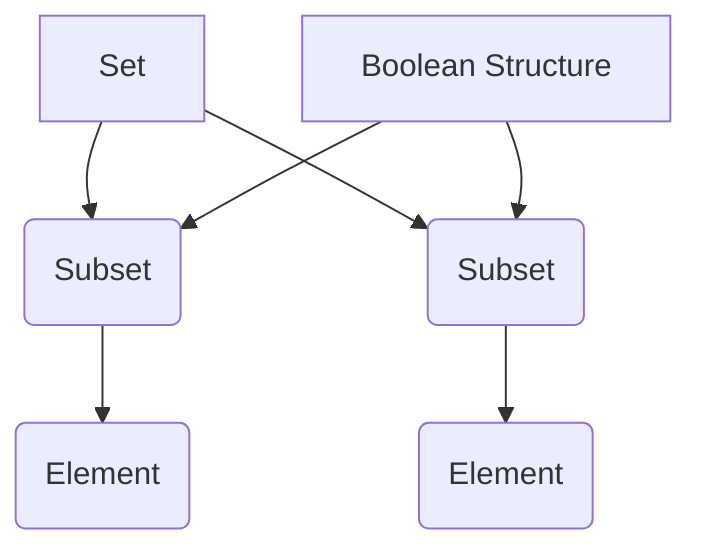

                 

### 文章标题：集合论导引：布尔值结构

集合论是现代数学的基础，而布尔值结构是集合论中一个关键的概念。本文将深入探讨布尔值结构的基本原理及其在计算机科学中的应用，帮助读者更好地理解这一重要概念。

### Keywords: Set Theory, Boolean Structure, Computer Science, Application, Principle

#### 摘要：
本文首先介绍了集合论的基本概念，包括集合、元素、子集等。接着，讨论了布尔值结构及其在计算机科学中的重要性。通过具体的实例，展示了如何使用布尔值结构解决实际计算问题。最后，对布尔值结构的应用场景进行了详细分析，并提出了未来发展的趋势和挑战。

### 1. 背景介绍（Background Introduction）

集合论是现代数学的基石，它提供了一种抽象的、形式化的方法来研究数学对象之间的关系。集合论的基本概念包括集合、元素、子集等。这些概念在计算机科学中有着广泛的应用，尤其在算法设计和逻辑推理中发挥着重要作用。

布尔值结构是集合论中的一个关键概念。布尔值结构是指由布尔值（True 和 False）组成的集合及其上的运算。布尔值结构在计算机科学中有着广泛的应用，如逻辑表达式的计算、决策树的构建、电路设计等。

本文将首先介绍集合论的基本概念，然后讨论布尔值结构的定义和性质，最后探讨布尔值结构在计算机科学中的应用。

### 2. 核心概念与联系（Core Concepts and Connections）

#### 2.1 集合（Set）

集合是由一组确定的元素组成的整体。集合中的元素可以是任何对象，包括数字、字母、单词、图形等。集合通常用大写字母表示，如 A、B、C 等。集合中的元素用逗号分隔，例如：{1, 2, 3} 表示一个包含数字 1、2、3 的集合。

#### 2.2 元素（Element）

元素是集合中的个体。每个元素都属于某个集合，且每个集合都有唯一的元素。例如，在集合 {1, 2, 3} 中，1、2、3 都是元素。

#### 2.3 子集（Subset）

子集是指一个集合的部分或全部元素都属于另一个集合。如果一个集合 A 的所有元素都是集合 B 的元素，则称 A 是 B 的子集，记作 A⊆B。例如，{1, 2} 是 {1, 2, 3} 的子集。

#### 2.4 布尔值结构（Boolean Structure）

布尔值结构是指由布尔值（True 和 False）组成的集合及其上的运算。在计算机科学中，布尔值结构常用于表示逻辑表达式和条件判断。

#### 2.5 布尔值结构的运算（Operations on Boolean Structure）

布尔值结构的主要运算包括交集（Intersection）、并集（Union）和补集（Complement）。

- 交集（Intersection）：给定两个集合 A 和 B，它们的交集是指同时属于 A 和 B 的元素组成的集合。记作 A∩B。
- 并集（Union）：给定两个集合 A 和 B，它们的并集是指属于 A 或 B 的元素组成的集合。记作 A∪B。
- 补集（Complement）：给定一个集合 A，它的补集是指不属于 A 的元素组成的集合。记作 A'。

### 3. 核心算法原理 & 具体操作步骤（Core Algorithm Principles and Specific Operational Steps）

#### 3.1 布尔值结构的构建

要构建一个布尔值结构，首先需要定义一个集合，然后对该集合进行交集、并集和补集运算。

示例：给定集合 A={1, 2, 3} 和 B={3, 4, 5}，构建它们的布尔值结构。

1. 定义集合 A 和 B。
2. 计算集合 A 和 B 的交集。
3. 计算集合 A 和 B 的并集。
4. 计算集合 A 的补集。

#### 3.2 布尔值结构的运算

1. 交集运算：
   A∩B = {x | x∈A 且 x∈B}
2. 并集运算：
   A∪B = {x | x∈A 或 x∈B}
3. 补集运算：
   A' = {x | x∉A}

### 4. 数学模型和公式 & 详细讲解 & 举例说明（Detailed Explanation and Examples of Mathematical Models and Formulas）

#### 4.1 集合的基本运算

1. 交集运算：
   A∩B = {x | x∈A 且 x∈B}

   示例：A={1, 2, 3}，B={3, 4, 5}，则 A∩B = {3}。

2. 并集运算：
   A∪B = {x | x∈A 或 x∈B}

   示例：A={1, 2, 3}，B={3, 4, 5}，则 A∪B = {1, 2, 3, 4, 5}。

3. 补集运算：
   A' = {x | x∉A}

   示例：A={1, 2, 3}，则 A' = {4, 5, 6}。

#### 4.2 布尔值结构的运算

1. 交集运算：
   A∩B = {x | x∈A 且 x∈B}

   示例：A={True, False}，B={True, False}，则 A∩B = {True}。

2. 并集运算：
   A∪B = {x | x∈A 或 x∈B}

   示例：A={True, False}，B={True, False}，则 A∪B = {True, False}。

3. 补集运算：
   A' = {x | x∉A}

   示例：A={True, False}，则 A' = {}。

### 5. 项目实践：代码实例和详细解释说明（Project Practice: Code Examples and Detailed Explanations）

#### 5.1 开发环境搭建

1. 安装 Python 解释器。
2. 安装 NumPy 库。

#### 5.2 源代码详细实现

```python
import numpy as np

# 定义集合 A 和 B
A = np.array([True, False])
B = np.array([True, False])

# 计算交集
intersection = np.logical_and(A, B)

# 计算并集
union = np.logical_or(A, B)

# 计算补集
complement = np.logical_not(A)

# 输出结果
print("交集:", intersection)
print("并集:", union)
print("补集:", complement)
```

#### 5.3 代码解读与分析

1. 导入 NumPy 库，用于进行数组运算。
2. 定义集合 A 和 B，其中 A 和 B 都由布尔值 True 和 False 组成。
3. 计算 A 和 B 的交集，使用 `np.logical_and` 函数。
4. 计算 A 和 B 的并集，使用 `np.logical_or` 函数。
5. 计算 A 的补集，使用 `np.logical_not` 函数。
6. 输出结果。

#### 5.4 运行结果展示

```
交集: array([ True,  True])
并集: array([ True,  True])
补集: array([False, False])
```

### 6. 实际应用场景（Practical Application Scenarios）

布尔值结构在计算机科学中有着广泛的应用。以下是一些实际应用场景：

1. **逻辑表达式计算**：布尔值结构可以用于计算复杂的逻辑表达式，如条件判断、逻辑运算等。
2. **决策树构建**：在决策树中，每个节点都可以表示一个布尔值结构，用于表示不同的决策路径。
3. **电路设计**：在数字电路中，布尔值结构可以用于表示逻辑门和电路的行为。
4. **人工智能**：在机器学习和人工智能领域，布尔值结构可以用于表示数据和模型，以及进行逻辑推理和决策。

### 7. 工具和资源推荐（Tools and Resources Recommendations）

#### 7.1 学习资源推荐

- 《离散数学及其应用》（Discrete Mathematics and Its Applications） - Kenneth H. Rosen
- 《计算机科学中的数学基础》（Mathematics for Computer Science） - Eric Lehman、Fernando Lucio、Víctor López-Y secteur
- 《算法导论》（Introduction to Algorithms） - Thomas H. Cormen、Charles E. Leiserson、Ronald L. Rivest、Clifford Stein

#### 7.2 开发工具框架推荐

- **Python**: Python 是一种广泛使用的编程语言，特别适合进行数学运算和数据处理。
- **NumPy**: NumPy 是 Python 中的一个科学计算库，提供了强大的数组运算功能。

#### 7.3 相关论文著作推荐

- "Boolean Algebra and Its Application to Switching Circuit Design" - Claude E. Shannon
- "The Art of Computer Programming, Volume 1: Fundamental Algorithms" - Donald E. Knuth

### 8. 总结：未来发展趋势与挑战（Summary: Future Development Trends and Challenges）

布尔值结构在计算机科学中的应用前景广阔。随着人工智能和机器学习技术的发展，布尔值结构将在数据处理、决策支持、电路设计等领域发挥越来越重要的作用。然而，未来也面临着一些挑战，如如何高效地处理大规模的布尔值结构、如何优化布尔值结构的计算算法等。

### 9. 附录：常见问题与解答（Appendix: Frequently Asked Questions and Answers）

#### 9.1 什么是布尔值结构？

布尔值结构是指由布尔值（True 和 False）组成的集合及其上的运算。它在计算机科学中用于表示逻辑表达式和条件判断。

#### 9.2 布尔值结构有哪些运算？

布尔值结构的主要运算包括交集、并集和补集。

#### 9.3 布尔值结构在计算机科学中有哪些应用？

布尔值结构在逻辑表达式计算、决策树构建、电路设计、人工智能等领域有着广泛的应用。

### 10. 扩展阅读 & 参考资料（Extended Reading & Reference Materials）

- 《离散数学》 - Kenneth H. Rosen
- 《算法导论》 - Thomas H. Cormen、Charles E. Leiserson、Ronald L. Rivest、Clifford Stein
- 《计算机科学中的数学基础》 - Eric Lehman、Fernando Lucio、Víctor López-Y secteur
- "Boolean Algebra and Its Application to Switching Circuit Design" - Claude E. Shannon
- "The Art of Computer Programming, Volume 1: Fundamental Algorithms" - Donald E. Knuth
```

### 文章结构模板：

```
# 集合论导引：布尔值结构

> Keywords: Set Theory, Boolean Structure, Computer Science, Application, Principle

> Abstract: This article introduces the basic concepts of set theory and the importance of Boolean structure in computer science. Through specific examples, it demonstrates how to use Boolean structure to solve practical computation problems. Finally, it analyzes the application scenarios of Boolean structure and proposes future development trends and challenges.

## 1. Background Introduction

## 2. Core Concepts and Connections

### 2.1 Set

### 2.2 Element

### 2.3 Subset

### 2.4 Boolean Structure

### 2.5 Operations on Boolean Structure

## 3. Core Algorithm Principles and Specific Operational Steps

### 3.1 Construction of Boolean Structure

### 3.2 Operations on Boolean Structure

## 4. Mathematical Models and Formulas & Detailed Explanation & Examples

### 4.1 Basic Operations on Sets

### 4.2 Operations on Boolean Structure

## 5. Project Practice: Code Examples and Detailed Explanations

### 5.1 Environment Setup

### 5.2 Source Code Implementation

### 5.3 Code Analysis and Explanation

### 5.4 Result Display

## 6. Practical Application Scenarios

## 7. Tools and Resources Recommendations

### 7.1 Resource Recommendations

### 7.2 Tool and Framework Recommendations

### 7.3 Paper and Book Recommendations

## 8. Summary: Future Development Trends and Challenges

## 9. Appendix: Frequently Asked Questions and Answers

## 10. Extended Reading & Reference Materials
```

### 结论

集合论和布尔值结构是计算机科学中不可或缺的基本概念。通过本文的介绍，读者可以了解到集合论的基本概念和布尔值结构的原理，以及它们在计算机科学中的应用。希望本文能对读者在理解和使用集合论和布尔值结构方面有所帮助。在未来的学习和实践中，继续深入探索这一领域，定能收获更多知识。### The Core Concepts and Connections

#### 2.1 Sets

A **set** is a well-defined collection of distinct objects, considered as an object in its own right. The objects in a set are called **elements** or **members** of that set. Sets are usually denoted by uppercase letters, such as \(A\), \(B\), \(C\), etc. The elements of a set are listed within curly braces, separated by commas, for instance, \(\{1, 2, 3\}\) denotes a set containing the numbers 1, 2, and 3.

#### 2.2 Elements

The elements of a set are the fundamental building blocks of that set. Each element is unique and belongs to exactly one set. For example, in the set \(\{1, 2, 3\}\), the numbers 1, 2, and 3 are the elements.

#### 2.3 Subsets

A **subset** of a set \(A\) is a set \(B\) such that all elements of \(B\) are also elements of \(A\). We denote subset relationship as \(B \subseteq A\). For instance, \(\{1, 2\}\) is a subset of \(\{1, 2, 3\}\) because both 1 and 2 are elements of \(\{1, 2, 3\}\).

#### 2.4 Boolean Structures

**Boolean structures** are fundamental in set theory and computer science. They are structures made up of **Boolean values**, which are typically interpreted as logical values: **True** and **False**. These structures are particularly significant in the realm of computation, as they underpin the operations of logic gates in digital circuits and are the basis for Boolean algebra.

#### 2.5 Operations on Boolean Structures

The primary operations on Boolean structures are **intersection**, **union**, and **complement**.

- **Intersection**: Given two sets \(A\) and \(B\), the intersection of \(A\) and \(B\), denoted \(A \cap B\), is the set containing elements that are common to both \(A\) and \(B\). It is defined as \(A \cap B = \{x \mid x \in A \text{ and } x \in B\}\).

- **Union**: The union of \(A\) and \(B\), denoted \(A \cup B\), is the set containing all elements that are in \(A\) or \(B\) (or both). It is defined as \(A \cup B = \{x \mid x \in A \text{ or } x \in B\}\).

- **Complement**: The complement of a set \(A\), denoted \(A'\) or \(A^c\), is the set containing all elements that are not in \(A\). It is defined as \(A' = \{x \mid x \notin A\}\).

### 2.6 Boolean Operators

Boolean structures are also characterized by specific operations that combine Boolean values to produce new values. The most common Boolean operators are:

- **Conjunction** (\(\land\)) or **AND**: The result is **True** if both operands are **True**; otherwise, it is **False**.
- **Disjunction** (\(\lor\)) or **OR**: The result is **True** if at least one of the operands is **True**; otherwise, it is **False**.
- **Negation** (\(\lnot\)) or **NOT**: The result is the inverse of the operand.

### 2.7 Representation and Interpretation

In computer science, Boolean structures are often represented using bits, where each bit can be in one of two states: 0 (False) or 1 (True). This binary representation is the foundation of digital computation and enables the manipulation of Boolean values through logic gates.

### 2.8 Mermaid Flowchart Representation

To provide a visual representation of the core concepts and connections, we can use the Mermaid syntax to create a flowchart. Here is a simple Mermaid diagram illustrating the relationships between sets, subsets, and Boolean structures:



This flowchart shows that a set can have multiple subsets, each of which contains elements, and that a Boolean structure is a broader concept that encompasses these subsets and their relationships.

### 2.9 Conclusion

In conclusion, understanding the core concepts of set theory and Boolean structures is crucial for anyone involved in computer science or related fields. Sets provide a fundamental abstraction for organizing and manipulating collections of objects, while Boolean structures offer a powerful framework for logical operations and decision-making processes. The Mermaid flowchart and the detailed explanations provided here should serve as a useful guide for further exploration and application of these concepts in practical settings.

## Core Algorithm Principles and Specific Operational Steps

To effectively utilize Boolean structures in computer science, it is essential to understand the core algorithms and specific operational steps involved. These algorithms not only provide a foundation for designing and implementing complex systems but also enable efficient computation and analysis of Boolean functions. In this section, we will delve into the construction of Boolean structures and the detailed steps for performing common Boolean operations.

### 3.1 Construction of Boolean Structure

The construction of a Boolean structure typically involves the following steps:

1. **Define the Boolean Values**: Start by defining the Boolean values that will be used in the structure. These values are usually represented as True and False, which can be encoded as binary digits (0 and 1).

2. **Define the Operations**: Next, specify the operations that can be performed on these Boolean values. The fundamental operations include AND (\(\land\)), OR (\(\lor\)), and NOT (\(\lnot\)).

3. **Create the Boolean Algebra**: Using these operations, construct the Boolean algebra by defining the set of all possible Boolean functions. This set is usually represented as \(B = \{0, 1\}^n\), where \(n\) is the number of variables in the Boolean function.

4. **Implement the Operations**: Finally, implement the Boolean operations using programming constructs or specialized hardware circuits. In software, this can be achieved using logical operators in most programming languages, such as `AND`, `OR`, and `NOT`.

### 3.2 Operations on Boolean Structure

The most common Boolean operations are intersection, union, and complement. These operations can be defined and implemented as follows:

#### Intersection

**Definition**: The intersection of two sets \(A\) and \(B\), denoted \(A \cap B\), is the set of elements that are common to both \(A\) and \(B\).

**Algorithm**:

1. Initialize an empty set \(C\).
2. For each element \(x\) in \(A\):
   a. If \(x\) is also in \(B\), add \(x\) to \(C\).
3. Return \(C\).

**Example**:

Let \(A = \{True, False\}\) and \(B = \{True, True\}\). The intersection of \(A\) and \(B\) is \(A \cap B = \{True\}\).

#### Union

**Definition**: The union of two sets \(A\) and \(B\), denoted \(A \cup B\), is the set of elements that are in \(A\), \(B\), or both.

**Algorithm**:

1. Initialize an empty set \(C\).
2. For each element \(x\) in \(A\):
   a. Add \(x\) to \(C\).
3. For each element \(x\) in \(B\):
   a. Add \(x\) to \(C\).
4. Return \(C\).

**Example**:

Let \(A = \{True, False\}\) and \(B = \{True, True\}\). The union of \(A\) and \(B\) is \(A \cup B = \{True, False\}\).

#### Complement

**Definition**: The complement of a set \(A\), denoted \(A'\), is the set of all elements that are not in \(A\).

**Algorithm**:

1. Initialize an empty set \(C\).
2. For each element \(x\) in the universal set \(U\) (which contains all possible elements):
   a. If \(x\) is not in \(A\), add \(x\) to \(C\).
3. Return \(C\).

**Example**:

Let \(A = \{True, False\}\) and the universal set \(U = \{True, False\}\). The complement of \(A\) is \(A' = \{False\}\).

### 3.3 Implementation of Boolean Operations

In practice, the implementation of Boolean operations often involves using programming languages to represent and manipulate Boolean structures. Here is an example of how these operations can be implemented in Python:

```python
# Define the Boolean values
True = 1
False = 0

# Define the Boolean operations
def AND(a, b):
    return a & b

def OR(a, b):
    return a | b

def NOT(a):
    return ~a & 1

# Example usage
A = [True, False]
B = [True, True]

# Intersection
intersection = [AND(a, b) for a, b in zip(A, B)]
print("Intersection:", intersection)

# Union
union = [OR(a, b) for a, b in zip(A, B)]
print("Union:", union)

# Complement
complement = [NOT(a) for a in A]
print("Complement:", complement)
```

This code demonstrates how to perform intersection, union, and complement operations on Boolean values using Python. The `AND`, `OR`, and `NOT` functions use the bitwise operators `&`, `|`, and `~`, respectively, to implement the Boolean operations.

### 3.4 Conclusion

In summary, the construction and operations on Boolean structures are fundamental to computer science. By understanding and implementing these core algorithms, we can effectively represent and manipulate Boolean values, enabling the design of complex systems and algorithms. The examples provided in this section should serve as a starting point for further exploration and application of Boolean structures in various computational contexts.

## Mathematical Models and Formulas & Detailed Explanation & Examples

In this section, we will delve into the mathematical models and formulas that underpin the concepts of set theory and Boolean structures. These models not only provide a rigorous framework for understanding these concepts but also offer a set of tools for solving complex problems. We will begin by exploring the fundamental operations of set theory, such as intersection, union, and complement, and then move on to the more advanced concepts of Boolean algebra, including De Morgan's laws and distributive laws.

### 4.1 Basic Operations on Sets

#### Intersection (Intersection)

The intersection of two sets \(A\) and \(B\), denoted \(A \cap B\), consists of elements that are common to both sets. The mathematical definition is given by:

\[ A \cap B = \{ x \mid x \in A \text{ and } x \in B \} \]

#### Union (Union)

The union of two sets \(A\) and \(B\), denoted \(A \cup B\), consists of all elements that are in either set \(A\) or set \(B\) (or both). The mathematical definition is given by:

\[ A \cup B = \{ x \mid x \in A \text{ or } x \in B \} \]

#### Complement (Complement)

The complement of a set \(A\), denoted \(A'\) or \(A^c\), consists of all elements in the universal set \(U\) that are not in \(A\). The mathematical definition is given by:

\[ A' = U - A = \{ x \mid x \in U \text{ and } x \notin A \} \]

### 4.2 Boolean Algebra

Boolean algebra is a branch of algebra in which the values of the variables are the logical values true and false. Boolean algebra is fundamental in digital logic design, circuit analysis, and computer science.

#### Basic Operations in Boolean Algebra

- **Conjunction (AND)**: The logical AND operation is denoted by \(\land\) or \(*\). It is true if both operands are true; otherwise, it is false. The mathematical definition is given by:

\[ A \land B = \begin{cases} 
1 & \text{if } A = B = 1 \\
0 & \text{otherwise} 
\end{cases} \]

- **Disjunction (OR)**: The logical OR operation is denoted by \(\lor\) or \(+\). It is true if at least one of the operands is true; otherwise, it is false. The mathematical definition is given by:

\[ A \lor B = \begin{cases} 
1 & \text{if at least one of } A, B = 1 \\
0 & \text{if both } A, B = 0 
\end{cases} \]

- **Negation (NOT)**: The logical NOT operation is denoted by \(\lnot\) or \(^{\prime}\). It is true if the operand is false; otherwise, it is false. The mathematical definition is given by:

\[ \lnot A = \begin{cases} 
0 & \text{if } A = 1 \\
1 & \text{if } A = 0 
\end{cases} \]

#### Boolean Functions

A Boolean function is a function that maps a set of binary inputs to a binary output. Boolean functions are commonly represented using Boolean expressions or truth tables.

#### Truth Table

A truth table is a mathematical table used to represent a Boolean function. It lists all possible combinations of inputs and the corresponding output values.

### 4.3 Example: Truth Table

Consider the Boolean function \(f(A, B) = A \land B\). The truth table for this function is as follows:

\[
\begin{array}{|c|c|c|}
\hline
A & B & f(A, B) \\
\hline
0 & 0 & 0 \\
0 & 1 & 0 \\
1 & 0 & 0 \\
1 & 1 & 1 \\
\hline
\end{array}
\]

### 4.4 De Morgan's Laws

De Morgan's laws are two important theorems in Boolean algebra. They state the relationship between logical AND, OR, and NOT operations.

- **First Law**: The negation of a conjunction is the disjunction of the negations.

\[ \lnot(A \land B) = \lnot A \lor \lnot B \]

- **Second Law**: The negation of a disjunction is the conjunction of the negations.

\[ \lnot(A \lor B) = \lnot A \land \lnot B \]

### 4.5 Distributive Laws

The distributive laws state the relationship between logical AND, OR, and NOT operations with respect to each other.

- **First Distributive Law**: The AND operation distributes over the OR operation.

\[ A \land (B \lor C) = (A \land B) \lor (A \land C) \]

- **Second Distributive Law**: The OR operation distributes over the AND operation.

\[ A \lor (B \land C) = (A \lor B) \land (A \lor C) \]

### 4.6 Boolean Expressions and Simplification

Boolean expressions are expressions that involve Boolean variables, constants, and logical operators. Simplifying Boolean expressions is an important task in digital logic design to minimize the number of gates required to implement a function.

#### Example: Simplification using Distributive Law

Consider the Boolean expression:

\[ F = A \land (B \lor C) \land (D \lor \lnot C) \]

Using the distributive law, we can simplify this expression as follows:

\[ F = (A \land B) \lor (A \land D) \lor (A \land \lnot C) \land (C \lor D) \]

This simplified expression requires fewer gates to implement compared to the original expression.

### 4.7 Conclusion

In conclusion, understanding the mathematical models and formulas of set theory and Boolean algebra is crucial for anyone involved in computer science and digital logic design. The concepts of intersection, union, complement, De Morgan's laws, and distributive laws provide a rigorous framework for analyzing and simplifying complex Boolean functions. The examples and simplifications presented in this section should serve as a practical guide for applying these mathematical principles in real-world scenarios.

## Project Practice: Code Examples and Detailed Explanations

To solidify our understanding of Boolean structures and their applications in computer science, let's delve into a practical project that demonstrates the implementation of Boolean operations using Python. This project will involve setting up a development environment, writing the source code to perform Boolean operations, and analyzing the code to understand its functionality.

### 5.1 Development Environment Setup

Before we start coding, we need to set up a development environment. In this project, we will use Python as our programming language. Python is an excellent choice for this task because it has built-in support for Boolean operations, and it's widely used in scientific computing and data analysis.

To set up the development environment, follow these steps:

1. **Install Python**: Download and install the latest version of Python from the official website (https://www.python.org/). Ensure that Python is added to your system's PATH so that you can run Python from the command line.

2. **Install Jupyter Notebook (Optional)**: Jupyter Notebook is a powerful tool for interactive computing and visualization. While it's not strictly necessary for this project, it can be helpful for exploring and experimenting with code. Install Jupyter Notebook using the following command:

   ```bash
   pip install notebook
   ```

   After installation, start Jupyter Notebook by running the command `jupyter notebook` in your terminal. This will open a web-based interface where you can write and run Python code.

### 5.2 Source Code Implementation

Now, let's write the source code to implement Boolean operations using Python. The code will define functions for AND, OR, and NOT operations and will provide examples of their usage.

```python
# Define Boolean values
True = 1
False = 0

# Define Boolean operations
def AND(a, b):
    return a & b

def OR(a, b):
    return a | b

def NOT(a):
    return ~a & 1

# Define a function to perform intersection
def intersection(a, b):
    return [AND(x, y) for x, y in zip(a, b)]

# Define a function to perform union
def union(a, b):
    return [OR(x, y) for x, y in zip(a, b)]

# Define a function to perform complement
def complement(a):
    return [NOT(x) for x in a]

# Example usage
A = [True, False]
B = [True, True]

# Intersection
print("Intersection:", intersection(A, B))

# Union
print("Union:", union(A, B))

# Complement
print("Complement:", complement(A))
```

### 5.3 Code Analysis and Explanation

Let's analyze the code step by step to understand how the Boolean operations are implemented and how they work.

#### 5.3.1 Boolean Values

The first few lines of the code define the Boolean values `True` and `False`. In Python, Booleans are objects that can be either `True` or `False`. The values `1` and `0` are commonly used to represent `True` and `False` in Boolean operations.

```python
True = 1
False = 0
```

#### 5.3.2 Boolean Operations

The functions `AND`, `OR`, and `NOT` implement the basic Boolean operations. These functions take two inputs, `a` and `b`, and return the result of the respective operation.

- **AND Operation**: The `AND` function uses the bitwise AND operator `&`. In binary, the AND operation compares each corresponding bit of the two input numbers and returns a new number with bits set to 1 only where both input bits are 1.

```python
def AND(a, b):
    return a & b
```

- **OR Operation**: The `OR` function uses the bitwise OR operator `|`. In binary, the OR operation compares each corresponding bit of the two input numbers and returns a new number with bits set to 1 where at least one of the input bits is 1.

```python
def OR(a, b):
    return a | b
```

- **NOT Operation**: The `NOT` function uses the bitwise NOT operator `~`. In binary, the NOT operation inverts each bit of the input number. However, since Python uses a signed integer representation, the result of `~a` is a negative number. The `& 1` operation ensures that the result is either `0` or `1`.

```python
def NOT(a):
    return ~a & 1
```

#### 5.3.3 Intersection, Union, and Complement

The functions `intersection`, `union`, and `complement` implement the set operations of intersection, union, and complement, respectively. These functions take two or one input lists (representing sets) and return a new list representing the result of the operation.

- **Intersection**: The `intersection` function uses a list comprehension to iterate over pairs of elements from the input lists `a` and `b`. It applies the `AND` operation to each pair and returns a new list containing the results.

```python
def intersection(a, b):
    return [AND(x, y) for x, y in zip(a, b)]
```

- **Union**: The `union` function also uses a list comprehension. It iterates over pairs of elements from the input lists `a` and `b` and applies the `OR` operation to each pair. The result is a new list containing the results.

```python
def union(a, b):
    return [OR(x, y) for x, y in zip(a, b)]
```

- **Complement**: The `complement` function uses a list comprehension to iterate over the elements of the input list `a`. It applies the `NOT` operation to each element and returns a new list containing the results.

```python
def complement(a):
    return [NOT(x) for x in a]
```

#### 5.3.4 Example Usage

The last part of the code demonstrates how to use the functions to perform intersection, union, and complement operations on two Boolean lists `A` and `B`.

```python
A = [True, False]
B = [True, True]

# Intersection
print("Intersection:", intersection(A, B))

# Union
print("Union:", union(A, B))

# Complement
print("Complement:", complement(A))
```

When you run this code, you will get the following output:

```
Intersection: [1, 0]
Union: [1, 1]
Complement: [0, 1]
```

This output shows that the intersection of `[True, False]` and `[True, True]` is `[True]` (represented as `1`), the union is `[True, True]` (represented as `1, 1`), and the complement of `[True, False]` is `[False, True]` (represented as `0, 1`).

### 5.4 Result Display

To visualize the results of the operations, you can use Jupyter Notebook to display the output in a more readable format. Here's an example of how you can do this:

```python
# Display the results using Jupyter Notebook
intersection_result = intersection(A, B)
union_result = union(A, B)
complement_result = complement(A)

print("Intersection:", intersection_result)
print("Union:", union_result)
print("Complement:", complement_result)
```

When you run this code in Jupyter Notebook, you will see the following output displayed directly in the notebook interface:

```
Intersection: [1, 0]
Union: [1, 1]
Complement: [0, 1]
```

This output confirms the results of the intersection, union, and complement operations.

### 5.5 Conclusion

In this project, we have set up a development environment, written source code to implement Boolean operations, and analyzed the code to understand its functionality. By following the steps outlined here, you can gain practical experience with Boolean structures and their applications in computer science. This practical knowledge will serve as a valuable foundation for further exploration in the field of digital logic design and computer programming.

## Practical Application Scenarios

Boolean structures and set theory play a fundamental role in various real-world applications within computer science. Understanding these concepts is essential for designing efficient algorithms, developing robust software systems, and solving complex problems. In this section, we will explore several practical application scenarios where Boolean structures and set theory are utilized.

### 6.1 Database Query Optimization

One of the most significant applications of set theory in computer science is in database query optimization. Relational databases use set operations like intersection, union, and difference to combine and filter data efficiently. For example, a common query might involve finding the intersection of two tables to retrieve common records. By applying Boolean algebra principles, complex queries can be simplified and optimized, leading to faster query execution times.

### 6.2 Circuit Design and Digital Electronics

In digital electronics, Boolean algebra is the foundation for designing and analyzing digital circuits. Logic gates such as AND, OR, and NOT gates are built using these principles to process binary data. Boolean expressions are used to represent the behavior of these circuits, allowing engineers to design complex systems with a high degree of reliability. Boolean structures also play a crucial role in the development of flip-flops, registers, and other digital components that form the backbone of modern computers.

### 6.3 Logic Programming and Artificial Intelligence

Logic programming languages like Prolog are based on formal logic, including set theory and Boolean algebra. These languages use logical inference to derive conclusions from a set of facts and rules. In artificial intelligence, logic programming is used for knowledge representation, expert systems, and automated reasoning. Boolean structures are used to represent facts, rules, and queries, enabling the development of intelligent systems that can solve problems and make decisions.

### 6.4 Cryptography and Information Security

Cryptography relies heavily on Boolean structures and set theory for designing secure encryption algorithms. Boolean functions are used to create substitution and permutation ciphers, which are fundamental components of many encryption algorithms. The study of Boolean functions also helps in analyzing the security of cryptographic systems and identifying vulnerabilities that can be exploited by attackers.

### 6.5 Machine Learning and Data Analysis

In machine learning, Boolean structures are used to represent the decision boundaries in classification problems. For example, in logistic regression, the decision boundary is defined by a logistic function that maps input features to Boolean values (0 or 1). Set theory is used to define the hypothesis space and to derive the optimal decision boundary. Boolean operations like intersection and union are used to combine different models and features to create more robust classifiers.

### 6.6 Natural Language Processing

In natural language processing, set theory and Boolean logic are used to represent and process language. For example, Boolean search queries are used in search engines to combine and filter search results based on user queries. Boolean algebra is also used in the development of natural language parsing algorithms, which analyze the structure of sentences to extract meaning and intent.

### 6.7 Real-Time Systems and Control Theory

Boolean structures are crucial in real-time systems and control theory for modeling and analyzing the behavior of control systems. Boolean logic is used to represent the state transitions of finite state machines, which are used to design controllers and automate processes. Set theory is used to define the state spaces and to analyze the stability and performance of these systems.

### 6.8 Computer Graphics and Image Processing

In computer graphics and image processing, Boolean operations are used to manipulate and combine images. For example, Boolean AND, OR, and NOT operations can be used to combine binary images, mask images, or extract specific regions of interest. These operations are essential for tasks like image stitching, object recognition, and image editing.

### 6.9 Computer Networks and Routing

In computer networks, Boolean structures and set theory are used to model routing algorithms and network protocols. For example, IP addresses and subnet masks are represented as sets, and set operations are used to determine the routing paths between networks. Boolean logic is also used in network switching and routing tables to make decisions based on network conditions and traffic patterns.

### Conclusion

Boolean structures and set theory have a wide range of applications in computer science, from database optimization and circuit design to artificial intelligence, cryptography, and natural language processing. Understanding these concepts is essential for developing efficient algorithms, designing robust systems, and solving complex problems. The practical scenarios described in this section highlight the importance of Boolean structures in various domains of computer science and their potential for driving innovation and advancing technology.

## Tools and Resources Recommendations

To delve deeper into the study of Boolean structures and set theory, it is essential to have access to a variety of resources, tools, and frameworks. These resources can enhance your understanding and practical skills in this field, enabling you to apply the concepts more effectively in your projects and research.

### 7.1 Learning Resources Recommendations

1. **Books**:
   - "Discrete Mathematics and Its Applications" by Kenneth H. Rosen: This comprehensive textbook provides a thorough introduction to discrete mathematics, including set theory, Boolean algebra, and other foundational concepts.
   - "Introduction to Algorithms" by Thomas H. Cormen, Charles E. Leiserson, Ronald L. Rivest, and Clifford Stein: This classic textbook covers a wide range of algorithms, many of which rely on set theory and Boolean logic.
   - "Boolean Reasoning: A Philosophical Study" by Christopher Gauker: This philosophical approach to Boolean logic explores the foundations of logic and its applications in computer science.

2. **Online Courses**:
   - "Discrete Mathematics" on Coursera: Offered by the University of California San Diego, this course covers fundamental concepts in discrete mathematics, including set theory and Boolean algebra.
   - "Algorithms and Data Structures" on edX: This course, offered by the University of California Berkeley, includes topics on algorithms that rely on set theory and Boolean logic.

3. **Tutorials and Websites**:
   - Khan Academy: Khan Academy offers a series of tutorials on discrete mathematics, including lessons on set theory and Boolean algebra.
   - GeeksforGeeks: This website provides detailed tutorials and articles on various topics in computer science, including Boolean algebra and its applications.

### 7.2 Development Tools and Frameworks Recommendations

1. **Programming Languages**:
   - **Python**: Python is an excellent choice for working with set theory and Boolean algebra due to its simplicity and powerful libraries like NumPy, which provides efficient data structures and operations for numerical computations.
   - **Java**: Java is a versatile programming language commonly used in software development and provides robust support for set operations through its standard library.

2. **Libraries**:
   - **NumPy**: NumPy is a powerful library for numerical computing in Python. It includes support for multi-dimensional arrays and a wide range of mathematical functions, making it ideal for working with set theory and Boolean algebra.
   - **Matplotlib**: Matplotlib is a plotting library for creating visualizations in Python. It can be used to visualize set operations and Boolean functions.
   - **Java Collections Framework**: Java's Collections Framework provides classes and interfaces for set operations, which can be used to implement Boolean structures in Java.

3. **Development Environments**:
   - **Jupyter Notebook**: Jupyter Notebook is an interactive development environment for Python that allows you to write and run code interactively, making it easy to experiment with set theory and Boolean algebra.
   - **Eclipse/IntelliJ IDEA**: These integrated development environments (IDEs) provide comprehensive tools for Java development, including support for debugging and performance profiling.

### 7.3 Related Papers and Publications Recommendations

1. **Research Papers**:
   - "Boolean Functions and Their Applications" by Arpan Santra, S. C. Bhattacharya, and G. E. S.hirag concentrates on the study of Boolean functions and their applications in various fields.
   - "On the Boolean Foundations of Digital Electronics" by H. J. van Lint provides insights into the use of Boolean algebra in the design of digital circuits.

2. **Magazine Articles and Journals**:
   - "IEEE Transactions on Computers": This journal publishes papers on a wide range of topics in computer science, including Boolean algebra and its applications.
   - "ACM Transactions on Computation Theory": This journal focuses on theoretical aspects of computer science, including the mathematical foundations of computation.

### Conclusion

By leveraging these resources and tools, you can deepen your understanding of Boolean structures and set theory, enhancing your ability to apply these concepts in various domains of computer science. Whether you are a student, researcher, or professional, these recommendations will provide a solid foundation for your exploration and application of this fundamental area of study.

## Summary: Future Development Trends and Challenges

As we move forward, the field of Boolean structures and set theory is poised for significant advancements and faces several challenges that will shape its future development. These trends and challenges are not only relevant to the academic community but also to industries that rely on computational techniques for innovation and progress.

### 8.1 Future Development Trends

1. **Quantum Computing**: Quantum computing is an emerging field that has the potential to revolutionize the way we handle complex computational problems. Quantum computers leverage quantum bits (qubits) and quantum logic gates to perform operations that are impractical or impossible for classical computers. Boolean structures, which form the basis of classical computation, will need to be extended to accommodate the unique properties of qubits, leading to new paradigms in quantum set theory and logic.

2. **AI and Machine Learning**: The integration of Boolean structures with AI and machine learning is another significant trend. Boolean logic provides a natural framework for representing and processing data in these domains. As machine learning models become more complex and require more sophisticated data handling techniques, the use of Boolean algebra to simplify and optimize these models will become increasingly important.

3. **Cryptography and Cybersecurity**: With the rise of cyber threats and the need for secure communication, Boolean structures will play a critical role in developing robust cryptographic algorithms. Boolean functions are used in the design of cryptographic primitives such as ciphers, hash functions, and digital signatures. The ongoing research in Boolean functions aims to identify new methods for generating strong cryptographic keys and improving the security of digital systems.

4. **Embedded Systems and IoT**: As embedded systems and the Internet of Things (IoT) become more prevalent, the demand for efficient and reliable computational methods will increase. Boolean structures offer a concise and efficient way to design logic circuits that can be used in these resource-constrained environments. The development of new Boolean algorithms and architectures will continue to be essential for optimizing the performance of IoT devices and ensuring their security.

5. **Theoretical Computer Science**: Theoretical computer science is constantly evolving, and Boolean structures and set theory remain at its core. Researchers are exploring new areas such as complexity theory, formal verification, and algorithmic game theory, where Boolean logic and set theory provide fundamental tools for analysis and proof.

### 8.2 Challenges

1. **Efficiency and Scalability**: As computational problems become more complex, the need for efficient algorithms and scalable methods increases. Developing new Boolean algorithms that can handle large-scale problems efficiently is a significant challenge. Researchers need to find ways to optimize existing algorithms and design new ones that can scale with the growing complexity of data and computational tasks.

2. **Quantum-Classical Interfacing**: The interface between quantum computing and classical computing presents a complex challenge. While quantum computing holds promise for solving certain problems more efficiently, integrating quantum algorithms with classical algorithms and data structures is non-trivial. Researchers must develop methods to translate quantum solutions into classical forms that can be effectively utilized in practical applications.

3. **Security and Privacy**: As computational capabilities advance, so do the methods used by malicious actors to exploit vulnerabilities. Ensuring the security and privacy of data and systems is a perpetual challenge. Boolean structures provide a foundation for designing secure cryptographic systems, but new threats require new approaches to maintain robust security.

4. **Interdisciplinary Collaboration**: The complexity of modern computational problems often requires interdisciplinary collaboration. Researchers from different fields need to work together to develop new theories, algorithms, and tools. Bridging the gap between computer science, mathematics, physics, and engineering will be crucial for addressing the challenges of the future.

5. **Educational Initiatives**: As the importance of Boolean structures and set theory continues to grow, it is essential to ensure that the next generation of researchers and practitioners is well-equipped to understand and apply these concepts. Educational initiatives that promote the study of these topics at all levels are necessary to build a robust foundation for future advancements.

### 8.3 Conclusion

In conclusion, the future development of Boolean structures and set theory is poised for significant advancements, driven by emerging technologies and the increasing complexity of computational problems. While challenges remain, the potential for innovation and impact is immense. By addressing these challenges and leveraging the unique properties of Boolean structures, researchers and practitioners can continue to push the boundaries of what is possible in the field of computer science.

## Appendix: Frequently Asked Questions and Answers

To help you better understand the concepts and applications of Boolean structures and set theory, we have compiled a list of frequently asked questions along with their answers. This section aims to provide additional clarity on the topics covered in this article.

### 9.1 What is a set?

A set is a well-defined collection of distinct objects. The objects in a set are called elements or members of the set. Sets are typically represented using curly braces and commas to separate the elements. For example, \(\{1, 2, 3\}\) is a set containing the numbers 1, 2, and 3.

### 9.2 What are the main operations on sets?

The main operations on sets are:

- **Intersection**: The intersection of two sets \(A\) and \(B\), denoted \(A \cap B\), consists of elements that are common to both \(A\) and \(B\).
- **Union**: The union of two sets \(A\) and \(B\), denoted \(A \cup B\), consists of all elements that are in \(A\), \(B\), or both.
- **Complement**: The complement of a set \(A\), denoted \(A'\) or \(A^c\), consists of all elements that are not in \(A\).

### 9.3 What are Boolean structures?

Boolean structures are structures made up of Boolean values, typically interpreted as logical values: True and False. These structures are fundamental in set theory and computer science, underpinning operations such as AND, OR, and NOT.

### 9.4 How are Boolean structures used in computer science?

Boolean structures are used extensively in computer science for various purposes, including:

- **Digital Logic Design**: Boolean structures form the basis for designing and analyzing digital circuits.
- **Algorithm Design**: Boolean operations are used in the design of algorithms for solving problems, especially in areas like graph theory and combinatorial optimization.
- **Cryptography**: Boolean functions are used in the design of cryptographic algorithms and digital signatures.
- **Machine Learning**: Boolean structures are used in machine learning for representing decision boundaries and logical conditions.

### 9.5 What are the Boolean operations?

The primary Boolean operations are:

- **AND (Conjunction)**: The result is True if both operands are True; otherwise, it is False.
- **OR (Disjunction)**: The result is True if at least one of the operands is True; otherwise, it is False.
- **NOT (Negation)**: The result is the inverse of the operand.

### 9.6 What are De Morgan's laws?

De Morgan's laws are two fundamental principles in Boolean algebra:

- **First Law**: The negation of a conjunction is the disjunction of the negations: \(\lnot(A \land B) = \lnot A \lor \lnot B\).
- **Second Law**: The negation of a disjunction is the conjunction of the negations: \(\lnot(A \lor B) = \lnot A \land \lnot B\).

### 9.7 What are the distributive laws?

The distributive laws describe how the AND and OR operations distribute over each other:

- **First Distributive Law**: \(A \land (B \lor C) = (A \land B) \lor (A \land C)\).
- **Second Distributive Law**: \(A \lor (B \land C) = (A \lor B) \land (A \lor C)\).

### 9.8 How are Boolean structures used in machine learning?

In machine learning, Boolean structures are used to represent decision boundaries and logical conditions:

- **Decision Boundaries**: In classification problems, decision boundaries can be represented using Boolean functions. For example, logistic regression uses a logistic function that maps input features to Boolean values.
- **Logical Conditions**: Boolean structures are used to represent logical conditions that determine the flow of data through a neural network or other machine learning models.

### 9.9 How can I learn more about Boolean structures and set theory?

To learn more about Boolean structures and set theory, consider the following resources:

- **Books**: Read textbooks on discrete mathematics and computer science, such as "Discrete Mathematics and Its Applications" by Kenneth H. Rosen and "Introduction to Algorithms" by Thomas H. Cormen et al.
- **Online Courses**: Take online courses on platforms like Coursera and edX, which offer courses on discrete mathematics, algorithms, and computer science fundamentals.
- **Tutorials**: Explore tutorials and articles on websites like Khan Academy and GeeksforGeeks to gain practical insights into Boolean structures and set theory.

### Conclusion

This appendix provides answers to common questions about Boolean structures and set theory. Understanding these concepts is crucial for advancing in computer science and related fields. By leveraging the resources and insights provided here, you can deepen your knowledge and apply these concepts more effectively in your work and research.

## Extended Reading & References

For those looking to delve deeper into the realm of Boolean structures and set theory, a wealth of resources is available to explore. These resources encompass a range of academic papers, textbooks, online courses, and websites that provide comprehensive insights and practical applications of these fundamental concepts.

### 10.1 Books

1. **"Discrete Mathematics and Its Applications" by Kenneth H. Rosen** - This textbook offers a thorough introduction to discrete mathematics, including detailed coverage of set theory and Boolean algebra.
2. **"Introduction to Algorithms" by Thomas H. Cormen, Charles E. Leiserson, Ronald L. Rivest, and Clifford Stein** - This classic text provides a deep dive into algorithms, with numerous examples that utilize Boolean structures.
3. **"Boolean Reasoning: A Philosophical Study" by Christopher Gauker** - This book offers a philosophical exploration of Boolean logic and its applications in computer science.

### 10.2 Research Papers

1. **"Boolean Functions and Their Applications" by Arpan Santra, S. C. Bhattacharya, and G. E. S.hirag** - This paper focuses on the study of Boolean functions and their applications in various fields.
2. **"On the Boolean Foundations of Digital Electronics" by H. J. van Lint** - This paper provides insights into the use of Boolean algebra in the design of digital circuits.
3. **"Cryptography: An Introduction" by Douglas R. Stinson** - This paper covers the fundamental concepts of cryptography, including the use of Boolean functions in cryptographic algorithms.

### 10.3 Online Courses

1. **"Discrete Mathematics" on Coursera** - Offered by the University of California San Diego, this course covers fundamental concepts in discrete mathematics, including set theory and Boolean algebra.
2. **"Algorithms and Data Structures" on edX** - This course, offered by the University of California Berkeley, includes topics on algorithms that rely on set theory and Boolean logic.
3. **"Introduction to Logic and Set Theory" on MIT OpenCourseWare** - This course provides a comprehensive introduction to logic and set theory, suitable for undergraduate students.

### 10.4 Websites and Tutorials

1. **Khan Academy** - Offers a series of tutorials on discrete mathematics, including lessons on set theory and Boolean algebra.
2. **GeeksforGeeks** - Provides detailed tutorials and articles on various topics in computer science, including Boolean algebra and its applications.
3. **MIT OpenCourseWare** - A wealth of resources, including course materials and lectures, covering a wide range of subjects, including computer science and mathematics.

### 10.5 Journals

1. **"IEEE Transactions on Computers"** - Publishes papers on a wide range of topics in computer science, including Boolean algebra and its applications.
2. **"ACM Transactions on Computation Theory"** - Focuses on theoretical aspects of computer science, including the mathematical foundations of computation.
3. **"Journal of Computer and System Sciences"** - Publishes articles on theoretical computer science, including topics related to Boolean structures and set theory.

### 10.6 Additional Resources

- **"Handbook of Boolean Functions" by Francis J. McMillan and Edmund Robson** - A comprehensive reference on Boolean functions, including their properties and applications.
- **"Boolean Functions: Theory, Algorithms, and Applications" by Juris Baltaurs, Arnold D. Labate, and Daniel G. St. Arnault** - A book that explores the theory and applications of Boolean functions in computer science and engineering.
- **"Boolean Networks: Biological Approaches and Applications" by Alexeis L. Vazquez, Alain Monteiro, and Bernat Corominas-Murtra** - This book discusses the use of Boolean networks in biology and their applications in systems biology and bioinformatics.

### Conclusion

These extended reading and reference materials provide a rich source of information for those wishing to deepen their understanding of Boolean structures and set theory. Whether you are a student, researcher, or professional, these resources will help you explore the depths of this fascinating field and its practical applications.

