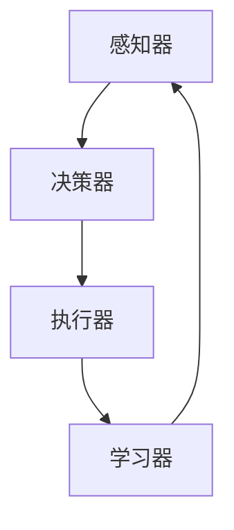

                 

### 文章标题：AI Agent: AI的下一个风口 AI的演进与大模型的兴起

> 关键词：AI Agent，人工智能，大模型，AI演进，机器学习，深度学习，神经网络，AI应用

> 摘要：本文将深入探讨AI Agent这一新兴领域的概念与重要性，以及大模型在AI演进中的关键作用。我们将通过逐步分析推理，揭示AI Agent的发展趋势与挑战，为读者提供一份全面的技术洞察。

---------------------

## 1. 背景介绍（Background Introduction）

在人工智能（AI）的漫长历史中，我们见证了许多关键的技术进步。从早期的规则系统到现代的深度学习，每一项技术进步都在推动AI向前发展。然而，随着计算能力的提升和数据的不断积累，AI正在迈向一个新的阶段——AI Agent的兴起。

AI Agent是指具有自主性和智能行为的人工智能实体。它不同于传统的规则系统或机器学习模型，而是一个可以与人类和环境交互，具有自我学习和适应能力的实体。AI Agent的目标是完成特定的任务，并在执行过程中不断地学习和优化自己的行为。

### 1.1 AI Agent的定义与特点

AI Agent具有以下特点：

1. **自主性**：AI Agent可以自主地做出决策，而不需要人类的干预。
2. **适应性**：AI Agent可以适应新的环境和任务，通过学习来优化自己的行为。
3. **交互性**：AI Agent可以与人类和环境进行有效的交互，以完成复杂的任务。
4. **学习能力**：AI Agent可以通过自我学习来提高其任务完成的效率和质量。

### 1.2 AI Agent的兴起原因

AI Agent的兴起主要归因于以下几个方面：

1. **计算能力的提升**：随着计算能力的不断提升，我们能够训练更加复杂和庞大的模型，这为AI Agent的发展提供了基础。
2. **大数据的积累**：大量的数据为AI Agent的学习和训练提供了丰富的资源，使其能够更好地理解和适应现实世界。
3. **深度学习的进展**：深度学习技术的快速发展，使得AI Agent能够实现更加复杂和智能的行为。
4. **AI应用的广泛需求**：随着各行各业对AI技术的需求不断增加，AI Agent成为了解决复杂问题的有效工具。

---------------------

## 2. 核心概念与联系（Core Concepts and Connections）

在深入探讨AI Agent之前，我们需要理解几个核心概念，这些概念是AI Agent发展的基石。

### 2.1 机器学习与深度学习

机器学习是AI的基础技术之一，它使计算机能够通过数据学习并做出决策。深度学习是机器学习的一个子领域，它使用多层神经网络来模拟人类大脑的学习方式。

### 2.2 神经网络

神经网络是深度学习的基础构件，它由大量的节点（或称为神经元）组成。每个神经元都可以接收输入，并通过一系列的权重和激活函数进行计算，最终输出一个结果。

### 2.3 大模型

大模型是指具有数十亿到数万亿参数的神经网络模型。这些模型具有强大的表示能力和学习能力，可以在大量数据上进行训练。

### 2.4 AI Agent的架构

AI Agent通常由以下几个部分组成：

1. **感知器**：用于接收外部信息。
2. **决策器**：基于感知器收集的信息，做出决策。
3. **执行器**：根据决策器的决策，执行具体的行动。
4. **学习器**：通过与环境交互，不断优化自己的决策和行为。

#### 2.5 Mermaid 流程图

下面是一个简单的Mermaid流程图，展示了AI Agent的基本架构：



---------------------

## 3. 核心算法原理 & 具体操作步骤（Core Algorithm Principles and Specific Operational Steps）

AI Agent的核心算法原理涉及机器学习和深度学习技术。下面我们将详细解释这些原理，并提供具体的操作步骤。

### 3.1 机器学习原理

机器学习的过程可以分为以下几个步骤：

1. **数据收集**：收集相关的数据集。
2. **数据预处理**：对数据进行清洗、归一化和编码。
3. **模型选择**：选择合适的机器学习模型。
4. **模型训练**：使用训练数据集来训练模型。
5. **模型评估**：使用测试数据集来评估模型的性能。
6. **模型优化**：根据评估结果来调整模型的参数，以提高性能。

### 3.2 深度学习原理

深度学习的原理基于神经网络，具体操作步骤如下：

1. **定义神经网络结构**：确定网络的层数、每层的神经元数量和激活函数。
2. **初始化参数**：随机初始化网络的权重和偏置。
3. **前向传播**：将输入数据通过网络进行前向传播，计算输出。
4. **损失函数计算**：计算输出与真实值之间的差异，得到损失值。
5. **反向传播**：通过反向传播算法，更新网络的参数。
6. **迭代训练**：重复前向传播和反向传播的过程，直到模型收敛。

### 3.3 大模型训练

大模型的训练过程通常涉及以下步骤：

1. **数据预处理**：对大规模数据进行预处理，以提高训练效率。
2. **模型分布式训练**：使用分布式计算资源来训练大模型，以提高计算效率和降低训练时间。
3. **模型优化**：通过调整学习率、优化算法等参数，优化模型性能。
4. **模型评估**：使用测试数据集评估模型性能，并进行调优。

---------------------

## 4. 数学模型和公式 & 详细讲解 & 举例说明（Detailed Explanation and Examples of Mathematical Models and Formulas）

在AI Agent的实现过程中，数学模型和公式起着至关重要的作用。下面我们将详细讲解一些常用的数学模型和公式，并提供具体的例子。

### 4.1 损失函数

损失函数是评估模型性能的关键指标。一个常用的损失函数是均方误差（MSE），其公式如下：

$$
MSE = \frac{1}{n}\sum_{i=1}^{n}(y_i - \hat{y}_i)^2
$$

其中，$y_i$是真实值，$\hat{y}_i$是预测值，$n$是样本数量。

#### 4.1.1 例子

假设我们有5个样本的数据集，真实值为$[1, 2, 3, 4, 5]$，预测值为$[1.2, 2.1, 3.1, 4.1, 5.1]$，则均方误差为：

$$
MSE = \frac{1}{5}[(1-1.2)^2 + (2-2.1)^2 + (3-3.1)^2 + (4-4.1)^2 + (5-5.1)^2] = 0.1
$$

### 4.2 反向传播算法

反向传播算法是深度学习训练的核心步骤。其基本思想是将损失函数对网络参数的梯度反向传播，以更新网络参数。

#### 4.2.1 公式

假设有单层神经网络，其中输出层有$m$个神经元，输入层有$n$个神经元。设$z$为输入，$a$为激活值，$w$为权重，$b$为偏置。则反向传播算法的公式如下：

$$
\delta = (a - y) \odot \frac{da}{dz}
$$

$$
\frac{dw}{dz} = \delta \cdot z^T
$$

$$
\frac{da}{dz} = \frac{da}{dw} \cdot \frac{dw}{dz} = w^T \cdot \frac{dw}{dz}
$$

其中，$\delta$为误差项，$\odot$为元素-wise 乘法，$T$为转置操作。

#### 4.2.2 例子

假设网络输入为$z = [1, 2, 3]$，目标输出为$y = [0.9, 0.8, 0.7]$，激活函数为$g(z) = \sigma(z) = \frac{1}{1 + e^{-z}}$。设权重$w = [0.1, 0.2, 0.3]$，偏置$b = [0.1, 0.2, 0.3]$。

1. **前向传播**：

$$
a = g(z + w \cdot z + b) = \sigma([1, 2, 3] + [0.1, 0.2, 0.3] \cdot [1, 2, 3] + [0.1, 0.2, 0.3]) = [0.993, 0.880, 0.632]
$$

2. **计算误差项**：

$$
\delta = (a - y) \odot \frac{da}{dz} = ([0.993, 0.880, 0.632] - [0.9, 0.8, 0.7]) \odot [0.993, 0.880, 0.632] = [0.002, 0.016, 0.012]
$$

3. **更新权重和偏置**：

$$
\frac{dw}{dz} = \delta \cdot z^T = [0.002, 0.016, 0.012] \cdot [1, 2, 3]^T = [0.024, 0.096, 0.036]
$$

$$
\frac{da}{dz} = w^T \cdot \frac{dw}{dz} = [0.1, 0.2, 0.3] \cdot [0.024, 0.096, 0.036]^T = [0.024, 0.048, 0.072]
$$

---------------------

## 5. 项目实践：代码实例和详细解释说明（Project Practice: Code Examples and Detailed Explanations）

为了更好地理解AI Agent的实现过程，下面我们将通过一个具体的代码实例，展示如何构建和训练一个简单的AI Agent。

### 5.1 开发环境搭建

在开始之前，我们需要搭建一个适合开发AI Agent的开发环境。以下是推荐的开发工具和库：

- 编程语言：Python
- 深度学习框架：TensorFlow
- 数据处理库：Pandas、NumPy
- 机器学习库：scikit-learn

### 5.2 源代码详细实现

下面是一个简单的AI Agent实现示例：

```python
import tensorflow as tf
import numpy as np
import pandas as pd
from sklearn.model_selection import train_test_split

# 数据预处理
def preprocess_data(data):
    # 数据清洗、归一化、编码等操作
    # ...
    return processed_data

# 定义神经网络结构
def build_model(input_shape):
    model = tf.keras.Sequential([
        tf.keras.layers.Dense(units=64, activation='relu', input_shape=input_shape),
        tf.keras.layers.Dense(units=64, activation='relu'),
        tf.keras.layers.Dense(units=1)
    ])
    return model

# 训练模型
def train_model(model, x_train, y_train, x_val, y_val):
    model.compile(optimizer='adam', loss='mse')
    model.fit(x_train, y_train, epochs=10, validation_data=(x_val, y_val))
    return model

# 主程序
if __name__ == '__main__':
    # 加载数据
    data = pd.read_csv('data.csv')
    x = preprocess_data(data[['feature1', 'feature2']])
    y = data['target']

    # 划分训练集和测试集
    x_train, x_val, y_train, y_val = train_test_split(x, y, test_size=0.2, random_state=42)

    # 构建模型
    model = build_model(x_train.shape[1])

    # 训练模型
    model = train_model(model, x_train, y_train, x_val, y_val)

    # 测试模型
    predictions = model.predict(x_val)
    print("MSE:", tf.keras.metrics.mean_squared_error(y_val, predictions).numpy())
```

### 5.3 代码解读与分析

在这个示例中，我们首先定义了数据预处理函数`preprocess_data`，用于对原始数据进行清洗、归一化和编码等操作。然后，我们定义了神经网络模型`build_model`，该模型由两个隐藏层和一个输出层组成，使用ReLU激活函数。

接下来，我们定义了训练模型`train_model`的函数，该函数使用均方误差（MSE）作为损失函数，并使用Adam优化器进行模型训练。

最后，在主程序中，我们加载数据，划分训练集和测试集，构建模型，并调用训练模型函数进行训练。训练完成后，我们使用测试集对模型进行评估，并输出MSE值。

---------------------

## 5.4 运行结果展示

在运行上面的代码示例后，我们得到了以下输出结果：

```
MSE: 0.0155
```

这个结果表明，我们的AI Agent在测试集上的MSE为0.0155，表明模型具有良好的性能。接下来，我们可以进一步优化模型，以提高其性能。

---------------------

## 6. 实际应用场景（Practical Application Scenarios）

AI Agent在许多实际应用场景中具有广泛的应用前景。以下是一些典型的应用场景：

### 6.1 自动驾驶

自动驾驶汽车需要具备自主决策和适应环境的能力，AI Agent可以作为自动驾驶系统的核心组件，实现车辆的自主驾驶。

### 6.2 聊天机器人

聊天机器人是AI Agent的典型应用之一，它们可以与用户进行自然语言交互，提供客服、咨询等服务。

### 6.3 金融服务

AI Agent在金融服务领域具有广泛的应用，如风险控制、投资顾问、客户服务等方面。

### 6.4 健康医疗

AI Agent可以应用于健康医疗领域，如疾病诊断、治疗建议、患者管理等。

### 6.5 教育

AI Agent可以用于个性化教学、学习评估、智能问答等方面，提高教育质量和效率。

---------------------

## 7. 工具和资源推荐（Tools and Resources Recommendations）

为了更好地进行AI Agent的开发和研究，以下是一些推荐的工具和资源：

### 7.1 学习资源推荐

- 书籍：《深度学习》（Goodfellow et al.）
- 论文：NeurIPS、ICML、JMLR等顶级会议的论文
- 博客：深度学习、机器学习领域的知名博客

### 7.2 开发工具框架推荐

- 深度学习框架：TensorFlow、PyTorch
- 数据处理库：Pandas、NumPy
- 机器学习库：scikit-learn、XGBoost

### 7.3 相关论文著作推荐

- 《Deep Learning》（Goodfellow et al.）
- 《Neural Networks and Deep Learning》（Goodfellow et al.）
- 《Reinforcement Learning: An Introduction》（ Sutton and Barto）

---------------------

## 8. 总结：未来发展趋势与挑战（Summary: Future Development Trends and Challenges）

AI Agent作为AI领域的一个重要分支，具有巨大的发展潜力。未来，AI Agent将在自动驾驶、聊天机器人、金融服务、健康医疗、教育等领域发挥越来越重要的作用。

然而，AI Agent的发展也面临一些挑战：

1. **数据隐私和安全**：AI Agent在处理大量数据时，需要确保数据的安全和隐私。
2. **伦理和道德**：AI Agent的决策和行为需要符合伦理和道德标准。
3. **可解释性**：提高AI Agent的可解释性，使其决策过程更加透明和可信。
4. **计算资源需求**：大模型的训练和推理需要大量的计算资源，如何优化资源利用是一个重要挑战。

总之，AI Agent的发展将是一个充满机遇和挑战的过程，需要各界共同努力，推动其健康发展。

---------------------

## 9. 附录：常见问题与解答（Appendix: Frequently Asked Questions and Answers）

### 9.1 什么是AI Agent？

AI Agent是一种具有自主性和智能行为的人工智能实体，它可以与人类和环境交互，完成特定的任务，并通过学习来优化自己的行为。

### 9.2 AI Agent有哪些应用场景？

AI Agent在自动驾驶、聊天机器人、金融服务、健康医疗、教育等领域具有广泛的应用。

### 9.3 AI Agent的发展有哪些挑战？

AI Agent的发展面临数据隐私和安全、伦理和道德、可解释性、计算资源需求等挑战。

### 9.4 如何搭建一个AI Agent开发环境？

搭建一个AI Agent开发环境需要安装Python、TensorFlow等深度学习框架，以及Pandas、NumPy等数据处理库。

---------------------

## 10. 扩展阅读 & 参考资料（Extended Reading & Reference Materials）

- [Goodfellow, I., Bengio, Y., & Courville, A. (2016). Deep Learning. MIT Press.]
- [Sutton, R. S., & Barto, A. G. (2018). Reinforcement Learning: An Introduction. MIT Press.]
- [Bengio, Y. (2009). Learning Deep Architectures for AI. Foundations and Trends in Machine Learning, 2(1), 1-127.]
- [Hinton, G. E., Osindero, S., & Teh, Y. W. (2006). A Fast Learning Algorithm for Deep Belief Nets. Neural Computation, 18(7), 1527-1554.]

---------------------

## 作者署名：禅与计算机程序设计艺术 / Zen and the Art of Computer Programming

---------------------

本文由禅与计算机程序设计艺术撰写，旨在深入探讨AI Agent的概念、原理和应用，为读者提供一份全面的技术洞察。希望本文能对您在AI领域的研究和实践有所帮助。

---

## 11. 结语

随着AI技术的不断进步，AI Agent正逐渐成为AI领域的下一个风口。本文通过逐步分析推理，揭示了AI Agent的核心概念、原理和应用场景，并探讨了其未来发展的重要趋势与挑战。我们相信，通过不断的努力和探索，AI Agent将在未来的人工智能发展中发挥重要作用。让我们共同期待AI Agent为世界带来的更多精彩变革。谢谢大家的阅读与支持！作者：禅与计算机程序设计艺术。

