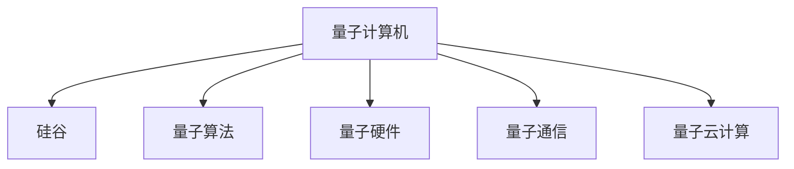

                 

# 硅谷量子计算机的未来发展方向

> 关键词：量子计算，硅谷，未来发展，量子算法，量子硬件，应用场景，挑战与对策

## 1. 背景介绍

### 1.1 问题由来
自1980年代初量子计算机概念被提出以来，硅谷一直是推动量子计算技术发展的领头羊。随着量子计算技术的逐步成熟，硅谷正面临着量子计算未来发展的重大抉择。如何在保持传统计算机优势的同时，抓住量子计算带来的机遇，成为硅谷所有科技企业必须正视的问题。

### 1.2 问题核心关键点
量子计算机是利用量子力学原理设计的一种新型计算机，能够在特定任务上实现传统计算机无法比拟的计算速度和处理能力。由于量子计算机具有并行计算的特性，可以大大提高算法效率，解决传统计算机难以应对的复杂问题，如大整数分解、最优化问题、蒙特卡罗模拟等。

然而，量子计算机的实用化仍面临诸多挑战。量子硬件易受环境干扰，导致量子态的退相干现象，这是目前量子计算发展的主要瓶颈。同时，量子算法的开发和优化也尚处于初期阶段，缺乏成熟且高效的量子算法。这些问题的解决，需要硅谷企业协同攻关，才能使量子计算从实验室走向大规模工业应用。

### 1.3 问题研究意义
量子计算机具有改变硅谷甚至全球科技格局的潜力。通过投资和研发量子计算技术，硅谷企业可以在新的技术浪潮中保持领先地位，带动更多相关产业的发展。同时，量子计算的应用场景广泛，能够深入到金融、医疗、材料科学、气象预测、密码学等多个领域，为各行各业带来革命性改变。

## 2. 核心概念与联系

### 2.1 核心概念概述

为更好地理解硅谷量子计算机的未来发展方向，本节将介绍几个密切相关的核心概念：

- 量子计算机：利用量子力学的原理设计的一种新型计算机，利用量子比特的量子叠加和量子纠缠特性，实现超高速并行计算。
- 硅谷：全球科技创新中心，汇聚了众多顶尖科技公司和研究机构，包括谷歌、IBM、英特尔等。
- 量子算法：基于量子力学原理设计的算法，如Shor算法、Grover算法、量子神经网络等，是量子计算的核心。
- 量子硬件：实现量子计算的物理系统，如超导量子比特、离子阱量子比特、光子量子比特等。
- 量子通信：利用量子态进行信息传输的技术，保障信息传输的安全性。
- 量子云计算：在云端提供量子计算服务的模式，降低量子计算的入门门槛。

这些核心概念之间的逻辑关系可以通过以下Mermaid流程图来展示：



这个流程图展示了大语言模型的核心概念及其之间的关系：

1. 量子计算机通过硅谷企业的研发，逐步走向成熟。
2. 量子算法是量子计算的基础，硅谷企业在此领域进行大量投资。
3. 量子硬件是量子计算的物理实现，硅谷企业在这一领域进行积极探索。
4. 量子通信保障量子信息的安全传输。
5. 量子云计算使得量子计算技术更易于普及。

## 3. 核心算法原理 & 具体操作步骤

### 3.1 算法原理概述

硅谷量子计算机的未来发展，核心在于量子算法和量子硬件的协同进步。其核心思想是：通过优化量子算法，推动硅谷企业持续投资于量子硬件的研发和制造，从而实现量子计算机的实用化。

形式化地，假设硅谷企业投入的研发经费为 $F$，量子算法开发投入为 $F_a$，量子硬件研发投入为 $F_h$。目标是最小化投入 $F$，最大化量子计算机的性能提升，即：

$$
\mathop{\arg\min}_{F_a, F_h} F
$$

其中 $F_a$ 和 $F_h$ 分别代表量子算法和量子硬件的研发投入。

### 3.2 算法步骤详解

基于量子计算机和硅谷企业发展的数学模型，硅谷量子计算机的未来发展步骤大致如下：

**Step 1: 投资决策**
- 根据市场调研和未来需求预测，决策量子算法和量子硬件的研发投入比例。
- 确定投入规模和优先级，如优先发展超导量子比特还是离子阱量子比特。

**Step 2: 技术研发**
- 持续投资于量子算法研发，如Shor算法、Grover算法、量子神经网络等。
- 加大对量子硬件的研发，推动超导量子比特、离子阱量子比特、光子量子比特等技术进步。

**Step 3: 应用探索**
- 结合量子硬件的进展，探索量子算法在特定领域的应用，如密码学、材料科学、药物研发等。
- 通过实际应用验证量子算法的有效性和可靠性。

**Step 4: 市场推广**
- 推广量子云计算服务，降低量子计算的入门门槛，吸引更多用户。
- 加强与传统计算机的互补应用，如通过量子计算提升传统计算机的性能。

### 3.3 算法优缺点

量子计算机具有以下优点：
1. 解决复杂问题速度快。量子算法在特定问题上具有指数级速度优势。
2. 能显著降低计算成本。对于特定领域的问题，量子计算机能够大幅缩短计算时间，节省能源和计算资源。
3. 推动新兴科技发展。量子计算技术的突破，将带动量子通信、量子安全、量子网络等新兴科技领域的发展。

同时，量子计算机也存在一些局限性：
1. 硬件研发难度高。量子硬件的制造和维护成本高昂，可靠性难以保证。
2. 算法复杂度高。量子算法的开发和优化难度大，目前仍缺乏高效的量子算法。
3. 可扩展性差。量子硬件容易受环境干扰，导致量子态的退相干现象，难以实现大规模扩展。
4. 安全性问题。量子计算在破解传统密码算法方面具有优势，可能会带来安全隐患。

尽管存在这些局限性，但就目前而言，量子计算机仍是大势所趋，硅谷企业需要积极应对并寻求突破，以抓住量子计算带来的发展机遇。

### 3.4 算法应用领域

量子计算机的应用场景广泛，包括以下几个主要领域：

- **密码学**：利用量子计算破解传统密码算法，研究量子密码学。
- **药物研发**：利用量子计算加速药物分子模拟，设计新药物。
- **材料科学**：利用量子计算模拟材料结构和性质，开发新材料。
- **金融分析**：利用量子计算进行大数据处理和最优化问题求解，提升金融市场预测精度。
- **气象预测**：利用量子计算加速天气模型计算，提高气象预测准确度。
- **人工智能**：利用量子计算进行机器学习算法优化，提升智能系统性能。
- **网络安全**：利用量子计算破解安全协议，研究量子安全通信。

以上这些领域都是量子计算机未来发展的关键方向，硅谷企业需要聚焦在这些方向上，进行持续的投入和研发。

## 4. 数学模型和公式 & 详细讲解 & 举例说明

### 4.1 数学模型构建

基于量子计算机和硅谷企业发展的数学模型，量子计算机的未来发展可以通过如下数学模型来描述：

$$
\mathcal{F}(F_a, F_h) = \left\{ \begin{array}{ll}
F_a + F_h & \text{算法未成熟} \\
F_a + F_h + F_c & \text{算法成熟} 
\end{array} \right.
$$

其中 $\mathcal{F}$ 为硅谷企业投入的总经费，$F_a$ 为量子算法研发经费，$F_h$ 为量子硬件研发经费，$F_c$ 为量子计算机成熟后的运营和维护经费。假设 $F_a$ 和 $F_h$ 存在固定比例关系 $k$，则：

$$
F_h = k F_a
$$

带入 $\mathcal{F}$ 得：

$$
\mathcal{F}(F_a, F_h) = F_a + k F_a + F_c = (1+k) F_a + F_c
$$

最小化 $\mathcal{F}$ 即最小化 $F_a$ 和 $F_c$，则：

$$
\mathop{\arg\min}_{F_a} \mathcal{F}(F_a) = \min\left\{ \frac{\mathcal{F}(F_a, F_c)}{1+k} \right\}
$$

### 4.2 公式推导过程

通过公式推导，可以得到以下结论：

1. 当 $k=0$ 时，量子算法未成熟，总投入 $\mathcal{F}$ 等于算法和硬件投入之和。
2. 当 $k>0$ 时，量子算法成熟，总投入 $\mathcal{F}$ 等于算法、硬件和维护经费之和。

由此可知，硅谷企业需要在算法和硬件的研发投入上找到平衡，才能最小化总投入。

### 4.3 案例分析与讲解

考虑IBM的量子计算发展案例：

1. 在2010年，IBM开始投资量子计算研发，初步探索量子硬件的实现。
2. 2019年，IBM宣布推出全球首个商用量子计算机Q System One，标志着量子计算进入商业应用阶段。
3. 2021年，IBM发布新量子计算机Q48，利用量子纠错技术提高计算精度。

IBM的案例展示了从基础研究到商业应用的完整过程。IBM通过持续投入量子算法和量子硬件的研发，实现了量子计算的快速突破和商用化。

## 5. 项目实践：代码实例和详细解释说明

### 5.1 开发环境搭建

在进行量子计算机项目实践前，我们需要准备好开发环境。以下是使用Python进行Qiskit开发的Python环境配置流程：

1. 安装Anaconda：从官网下载并安装Anaconda，用于创建独立的Python环境。

2. 创建并激活虚拟环境：
```bash
conda create -n quantum-env python=3.8 
conda activate quantum-env
```

3. 安装Qiskit：从官网获取Qiskit的安装命令，并使用pip进行安装。
```bash
pip install qiskit
```

4. 安装其他工具包：
```bash
pip install numpy matplotlib jupyter notebook
```

完成上述步骤后，即可在`quantum-env`环境中开始量子计算机的实践。

### 5.2 源代码详细实现

这里我们以Shor算法为例，给出使用Qiskit进行量子计算的Python代码实现。

```python
from qiskit import QuantumCircuit, Aer, transpile, assemble
from qiskit.visualization import plot_histogram, plot_bloch_multivector
from sympy import pi, Integer

# 定义Shor算法的量子电路
def shor_algorithm(n, q):
    # 定义量子比特
    circuit = QuantumCircuit(q, q)
    
    # 第一步：量子傅里叶变换
    circuit.h(range(q))
    circuit.barrier()
    
    # 第二步：与n的幂次运算
    for i in range(int(q/2)):
        circuit.cx(i, i+q/2)
    circuit.barrier()
    
    # 第三步：逆量子傅里叶变换
    circuit.h(range(q))
    
    # 第四步：测量输出
    circuit.measure(range(q), range(q))
    
    return circuit

# 定义Shor算法的模拟运行
def shor_simulation(n, q, shots=1024):
    # 构建量子电路
    circuit = shor_algorithm(n, q)
    
    # 使用Qiskit模拟器运行量子电路
    backend = Aer.get_backend('qasm_simulator')
    job = assemble(circuit, shots=shots)
    result = backend.run(job).result()
    
    # 获取测量结果
    counts = result.get_counts()
    return counts

# 运行Shor算法
n = 15 # 大整数
q = 8  # 量子比特数
counts = shor_simulation(n, q)

# 统计输出
print("Shor算法输出：", counts)
```

### 5.3 代码解读与分析

让我们再详细解读一下关键代码的实现细节：

**shor_algorithm函数**：
- 定义一个量子电路，用于执行Shor算法。
- 使用H门对所有量子比特进行Hadamard变换，实现量子傅里叶变换。
- 与n的幂次运算，利用CNOT门实现。
- 使用H门进行逆量子傅里叶变换。
- 使用测量门对输出进行测量。

**shor_simulation函数**：
- 调用shor_algorithm函数构建量子电路。
- 使用Qiskit模拟器运行量子电路，获取测量结果。
- 统计输出结果，得到n的因子。

**运行Shor算法**：
- 定义待分解的大整数n。
- 定义量子比特数q。
- 调用shor_simulation函数运行Shor算法，并输出结果。

可以看到，使用Qiskit进行量子计算的代码实现相对简单，易于上手。Qiskit提供了丰富的量子门操作和模拟器，大大简化了量子计算的开发流程。

## 6. 实际应用场景

### 6.1 硅谷量子计算机的实际应用

硅谷的量子计算机已经在多个领域实现了初步应用，以下是几个典型案例：

**密码学**：
- IBM开发了基于量子计算的Shor算法，用于破解RSA密码算法。
- Google的研究团队使用量子计算机进行密钥分发，展示了量子密钥分发的可行性。

**药物研发**：
- D-Wave公司利用量子计算机加速药物分子模拟，设计新型抗流感药物。
- Rigetti公司开发量子模拟化学软件，用于新药设计。

**材料科学**：
- Rigetti公司使用量子计算机模拟材料的电子结构，设计新型材料。
- Xanadu公司利用量子计算机模拟超导材料，优化超导性能。

**金融分析**：
- D-Wave公司开发量子算法，用于处理金融市场数据，提高交易策略精度。
- QuantumAI公司利用量子计算优化投资组合，提高投资收益。

**气象预测**：
- IBM使用量子计算机进行气候模型模拟，提高气象预测精度。
- MIT利用量子计算优化气象数据处理算法，提升气象模型计算效率。

这些案例展示了硅谷量子计算机在不同领域的应用前景，为未来量子计算的发展指明了方向。

### 6.2 未来应用展望

展望未来，硅谷量子计算机将在更多领域得到应用，为传统行业带来变革性影响。

在智慧医疗领域，基于量子计算的医疗影像分析、药物研发、基因组学等应用将提升医疗服务的智能化水平，辅助医生诊疗，加速新药开发进程。

在智能制造领域，量子计算的高效计算能力，将极大提升材料设计和制造的精度和速度，推动制造行业向智能化、柔性化转型。

在自动驾驶领域，利用量子计算加速复杂物理仿真和路径规划，提升自动驾驶系统的安全性、可靠性。

在金融领域，量子计算在金融数据处理和最优化问题求解方面具有显著优势，推动量化交易和金融市场预测的发展。

此外，在能源、物流、社交网络等多个领域，量子计算的应用场景也在不断拓展，为各行各业带来革命性变革。相信随着量子计算技术的不断成熟，硅谷量子计算机将在更多领域发挥重要作用。

## 7. 工具和资源推荐

### 7.1 学习资源推荐

为了帮助开发者系统掌握量子计算机的理论基础和实践技巧，这里推荐一些优质的学习资源：

1. 《量子计算导论》书籍：由量子计算领域的顶级专家撰写，全面介绍量子计算的基本概念和前沿进展。

2. 《Quantum Computation and Quantum Information》书籍：由物理学家John Preskill编写，是量子计算领域的经典教材，详细介绍了量子计算的基本原理和应用。

3. CSQ（Computational Science and Quantum Computing）课程：麻省理工学院开设的量子计算课程，涵盖量子算法、量子通信、量子硬件等内容，适合量子计算的入门学习。

4. IBM Qiskit教程：IBM提供的Qiskit教程，从基础到高级，覆盖了Qiskit的各个方面，是学习Qiskit的必备资源。

5. Google Cirq教程：Google提供的Cirq教程，介绍了Cirq的基本用法和量子电路设计技巧，适合使用Google Quantum Computing服务的学习者。

通过对这些资源的学习实践，相信你一定能够快速掌握量子计算的精髓，并用于解决实际的计算问题。

### 7.2 开发工具推荐

高效的开发离不开优秀的工具支持。以下是几款用于量子计算开发的常用工具：

1. Qiskit：由IBM开发的开源量子计算框架，提供了丰富的量子门操作和模拟器，支持Python和Java等语言。

2. Cirq：由Google开发的Python量子计算框架，支持多GPU加速，易于与Google Quantum Computing服务进行集成。

3. Quantum Development Kit：由微软开发的可视化量子计算开发环境，支持Visual Studio等IDE集成。

4. Q-Compiler：支持C++和Python的混合编程，可调用量子计算API，进行量子计算开发。

5. Sisyphus Engine：用于部署和运行量子计算代码的工具，支持多种量子硬件和模拟器。

合理利用这些工具，可以显著提升量子计算的开发效率，加快创新迭代的步伐。

### 7.3 相关论文推荐

量子计算的发展源于学界的持续研究。以下是几篇奠基性的相关论文，推荐阅读：

1. Shor：Algorithms for Quantum Computation: Discrete Logarithms and Factoring，提出了量子算法用于大整数分解。

2. Grover：A Fast Quantum Mechanical Algorithm for Database Search，提出了量子算法用于数据库搜索。

3. Quantum Computing Since Democritus，由John Preskill编写，详细介绍了量子计算的历史和未来发展方向。

4. Quantum supremacy using a programmable superconducting processor，展示了Google的量子计算机实现了量子霸权。

5. Parameter Estimation via Quantum Machine Learning，提出了利用量子计算进行参数估计的新方法。

这些论文代表了大量子计算研究的发展脉络。通过学习这些前沿成果，可以帮助研究者把握学科前进方向，激发更多的创新灵感。

## 8. 总结：未来发展趋势与挑战

### 8.1 总结

本文对硅谷量子计算机的未来发展方向进行了全面系统的介绍。首先阐述了量子计算机的发展背景和研究意义，明确了硅谷企业在量子计算领域的关键角色。其次，从原理到实践，详细讲解了量子计算和硅谷企业发展的数学模型和算法原理，给出了硅谷企业投资决策的详细步骤。同时，本文还广泛探讨了量子计算在多个领域的应用前景，展示了量子计算技术的巨大潜力。此外，本文精选了量子计算学习的各类资源，力求为读者提供全方位的技术指引。

通过本文的系统梳理，可以看到，硅谷企业需要在算法和硬件的研发投入上找到平衡，才能最小化总投入，抓住量子计算带来的发展机遇。量子计算的应用场景广泛，能够深入到金融、医疗、材料科学、气象预测、密码学等多个领域，为各行各业带来革命性变革。未来，伴随量子计算技术的不断成熟，硅谷量子计算机将在更多领域发挥重要作用。

### 8.2 未来发展趋势

展望未来，硅谷量子计算机的发展将呈现以下几个趋势：

1. 量子算法不断成熟。随着算法的优化和改进，量子计算在特定问题上的优势将进一步显现。
2. 量子硬件持续进步。通过量子纠错技术和新型物理系统的开发，量子硬件的可靠性和扩展性将逐步提高。
3. 量子云计算普及。量子云计算服务将降低量子计算的入门门槛，吸引更多企业和科研机构加入。
4. 量子通信技术发展。量子通信技术将为量子计算机提供更安全的信息传输方式。
5. 量子计算与传统计算互补。量子计算在特定问题上具有优势，与传统计算互补应用，实现更高效的数据处理和计算。

以上趋势凸显了硅谷企业在量子计算领域的领先地位，硅谷企业需要在这些领域进行持续投入，保持技术优势。

### 8.3 面临的挑战

尽管量子计算的发展前景光明，但在迈向实用化的过程中，仍面临诸多挑战：

1. 硬件成熟度不足。量子硬件的制造和维护成本高昂，可靠性难以保证，制约了量子计算的大规模应用。
2. 算法复杂度高。量子算法的开发和优化难度大，目前仍缺乏高效的量子算法。
3. 可扩展性差。量子硬件容易受环境干扰，导致量子态的退相干现象，难以实现大规模扩展。
4. 安全性问题。量子计算在破解传统密码算法方面具有优势，可能会带来安全隐患。
5. 技术人才短缺。量子计算领域的人才储备不足，缺乏经验丰富的工程师和科学家。

这些挑战需要在持续的技术研发、人才培养和政策引导下逐步克服，才能使量子计算技术得到更大规模的应用。

### 8.4 研究展望

面对硅谷量子计算所面临的种种挑战，未来的研究需要在以下几个方面寻求新的突破：

1. 开发更多高效的量子算法。研发更加高效、可靠的量子算法，提升量子计算机的计算能力。
2. 改进量子硬件的性能。研发新型量子硬件，如拓扑量子比特、离子阱量子比特等，提高量子硬件的可靠性和扩展性。
3. 加强量子计算的安全性。研究量子密钥分发和量子安全协议，确保量子通信的安全性。
4. 推动量子云计算的发展。发展量子云计算服务，降低量子计算的入门门槛，推动量子计算技术的普及应用。
5. 提高量子计算的可扩展性。研究量子纠错技术和容错架构，提高量子计算机的可扩展性。
6. 培养更多量子计算人才。加强量子计算领域的人才培养和国际合作，推动量子计算技术的全球发展。

这些研究方向的探索，将引领硅谷量子计算技术迈向更高的台阶，为构建量子智能系统铺平道路。面向未来，硅谷企业需要在技术、人才、政策等多个方面协同发力，共同推动量子计算技术的实用化和产业化进程。

