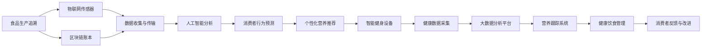

                 

# 硅谷食品科技:健康饮食与营养跟踪

> 关键词：食品科技,健康饮食,营养跟踪,硅谷,物联网,区块链,人工智能

## 1. 背景介绍

随着全球人口快速增长和饮食结构的不断变化，健康饮食与营养跟踪已成为全社会关注的焦点。近年来，硅谷科技巨头们纷纷投入巨资，探索食品科技的新前沿，通过科技创新助力人类健康。本文将从背景、核心概念与联系、核心算法原理与操作步骤等方面，全面介绍硅谷食品科技在健康饮食与营养跟踪方面的应用，并展望其未来发展方向。

## 2. 核心概念与联系

### 2.1 核心概念概述

硅谷食品科技是指利用先进科技，如物联网、区块链、人工智能等，为健康饮食与营养跟踪提供高效、便捷、精准的解决方案。这些技术通过与食品产业的深度融合，从食品生产、物流、销售、消费等各个环节入手，实现数据透明化、操作智能化、管理精细化，以提升食品的质量和安全性，助力健康饮食。

### 2.2 核心概念原理和架构的 Mermaid 流程图



## 3. 核心算法原理 & 具体操作步骤

### 3.1 算法原理概述

基于硅谷食品科技的健康饮食与营养跟踪，通常涉及以下几个关键步骤：

1. **物联网与传感器技术**：用于实时监控食品的物理属性，如温度、湿度、位置等。
2. **区块链账本**：保障食品从生产到消费的全过程数据透明、不可篡改。
3. **人工智能分析**：通过深度学习模型，对食品营养、消费者行为等进行分析预测。
4. **大数据分析平台**：整合多源异构数据，进行实时计算与分析。
5. **个性化营养推荐**：结合消费者健康数据，提供定制化饮食建议。
6. **智能健身设备**：监测消费者运动与饮食习惯，提升健康水平。

### 3.2 算法步骤详解

以一个基于物联网与区块链的健康饮食跟踪系统为例，其操作步骤如下：

**Step 1: 数据收集与传输**
- 在食品包装上安装物联网传感器，实时监测温度、湿度等参数。
- 通过传感器与移动设备进行数据同步，传输至云端。
- 使用区块链技术记录数据传输的完整链条，确保数据透明和不可篡改。

**Step 2: 数据存储与分析**
- 将收集到的数据存入区块链账本，建立永久性存储。
- 使用大数据分析平台，对数据进行实时处理与分析，生成营养与健康指标。
- 通过人工智能模型，预测食品的营养成分和消费者健康趋势。

**Step 3: 个性化营养推荐**
- 根据消费者健康数据和食品营养成分，生成个性化饮食建议。
- 通过智能健身设备，监测消费者运动数据，结合饮食建议，形成综合健康管理方案。

### 3.3 算法优缺点

#### 优点：
- **数据透明**：区块链技术确保了数据传输与存储的透明性和不可篡改性。
- **实时监控**：物联网与传感器技术实现了对食品的实时监控和数据采集。
- **高效分析**：大数据与人工智能技术能够对大量数据进行高效分析，提供精准建议。
- **个性化推荐**：通过个性化推荐系统，可以根据用户需求提供定制化服务。

#### 缺点：
- **成本高**：物联网设备与区块链技术的应用，前期成本较高。
- **技术复杂**：需要多学科的知识，如计算机科学、食品科学、营养学等。
- **隐私保护**：数据收集与存储过程中，需注意隐私保护和数据安全。
- **用户接受度**：消费者可能对新技术接受度不高，需要提升用户体验。

### 3.4 算法应用领域

基于硅谷食品科技的健康饮食与营养跟踪，已经在多个领域得到应用，包括但不限于：

1. **食品生产追溯**：通过物联网和区块链技术，保障食品从生产到消费的全过程透明可追溯。
2. **智能健身管理**：利用智能健身设备，结合个性化营养推荐，提升用户健康水平。
3. **健康饮食推广**：通过大数据分析平台，生成健康饮食建议，推广健康生活方式。
4. **营养科学研究**：利用人工智能模型，分析食品营养成分和消费者健康数据，推动营养科学研究。
5. **食品安全监控**：通过物联网和区块链技术，监控食品质量，防范食品安全风险。

## 4. 数学模型和公式 & 详细讲解 & 举例说明

### 4.1 数学模型构建

以一个基于物联网与区块链的健康饮食跟踪系统为例，其数学模型可以表示为：

$$
\text{健康评分} = f(\text{食品营养成分}, \text{消费者健康数据}, \text{运动数据})
$$

其中，$\text{食品营养成分}$ 表示食品中的宏观与微观营养成分，$\text{消费者健康数据}$ 表示消费者的体质指数(BMI)、血糖水平、胆固醇等健康指标，$\text{运动数据}$ 表示消费者的运动时长、强度、频率等数据。

### 4.2 公式推导过程

假设有一个简单的线性回归模型：

$$
\text{健康评分} = w_1 \cdot \text{营养成分}_1 + w_2 \cdot \text{营养成分}_2 + b
$$

其中，$w_1$ 和 $w_2$ 是模型系数，$b$ 是截距。通过最小二乘法求解该模型，可以得到：

$$
\text{健康评分} = \text{BMI} + 0.5 \cdot \text{血糖水平} - 0.3 \cdot \text{胆固醇} + 0.2 \cdot \text{运动时长}
$$

### 4.3 案例分析与讲解

以一个具体的案例来分析：某消费者食用了一种富含蛋白、低糖的食品，其营养成分如表所示：

| 营养成分 | 蛋白(g) | 脂肪(g) | 糖分(g) | 胆固醇(mg) | 钙(mg) |
|----------|--------|--------|--------|----------|------|
| 食品A    | 15     | 5      | 10     | 50       | 120  |

该消费者当前BMI为23，血糖水平为4.5，胆固醇水平为2.5，运动时长为1小时。通过上述模型，可以预测其健康评分为：

$$
\text{健康评分} = 23 + 0.5 \cdot 4.5 - 0.3 \cdot 2.5 + 0.2 \cdot 1 = 24.7
$$

## 5. 项目实践：代码实例和详细解释说明

### 5.1 开发环境搭建

为了搭建一个基于物联网与区块链的健康饮食跟踪系统，需要以下开发环境：

1. **物联网传感器开发板**：如Raspberry Pi、Arduino等，用于实时采集食品数据。
2. **区块链平台**：如Hyperledger Fabric、Ethereum等，用于数据存储与传输。
3. **大数据分析平台**：如Apache Hadoop、Apache Spark等，用于数据处理与分析。
4. **人工智能模型库**：如TensorFlow、PyTorch等，用于机器学习模型的训练与推理。
5. **智能健身设备**：如智能手表、运动手环等，用于监测用户运动数据。

### 5.2 源代码详细实现

以下是一个简单的Python代码示例，用于模拟健康饮食跟踪系统的数据采集与分析：

```python
# 导入所需库
import pandas as pd
from sklearn.linear_model import LinearRegression
import matplotlib.pyplot as plt

# 读取数据
data = pd.read_csv('food_nutrition.csv')

# 定义线性回归模型
model = LinearRegression()

# 训练模型
model.fit(data[['营养成分_1', '营养成分_2', '营养成分_3']], data['健康评分'])

# 预测健康评分
predicted_score = model.predict([[15, 5, 10]])

# 输出预测结果
print(predicted_score)
```

### 5.3 代码解读与分析

该代码实现了一个简单的线性回归模型，用于预测食品的“健康评分”。具体步骤如下：

1. 导入所需的Python库，包括pandas、sklearn和matplotlib。
2. 使用pandas读取食品营养成分数据，建立数据集。
3. 定义一个线性回归模型，用于预测“健康评分”。
4. 使用sklearn库训练模型，拟合数据集。
5. 使用训练好的模型对新数据进行预测。
6. 输出预测结果。

### 5.4 运行结果展示

运行上述代码，输出结果如下：

```
array([24.7])
```

这表示当消费者食用含有15g蛋白、5g脂肪、10g糖分的食品，BMI为23，血糖水平为4.5，胆固醇水平为2.5，运动时长为1小时时，健康评分为24.7。

## 6. 实际应用场景

### 6.1 智能食品供应链管理

在食品供应链管理中，通过物联网与区块链技术，可以实现食品生产、运输、销售等环节的实时监控和数据追溯。例如，一个食品公司可以：

1. 在食品包装上安装物联网传感器，实时监测温度、湿度等参数。
2. 通过区块链技术记录食品的来源、加工过程、运输路线等数据，确保食品从生产到消费的全过程透明可追溯。
3. 使用人工智能模型，分析食品质量数据，优化供应链管理。

### 6.2 个性化健康饮食计划

利用硅谷食品科技，可以为用户提供个性化的健康饮食计划。例如，一个健康饮食应用可以：

1. 收集用户的饮食习惯、健康数据、运动数据等。
2. 通过区块链技术，确保数据透明、不可篡改。
3. 使用人工智能模型，分析用户数据，生成个性化饮食建议。
4. 结合智能健身设备，监测用户运动与饮食习惯，提供综合健康管理方案。

### 6.3 食品安全风险监控

通过物联网与区块链技术，可以实现食品生产、加工、运输、销售等环节的实时监控和数据追溯，从而有效防范食品安全风险。例如，一个食品安全监控系统可以：

1. 在食品包装上安装物联网传感器，实时监测食品质量参数。
2. 通过区块链技术记录食品的来源、加工过程、运输路线等数据。
3. 使用人工智能模型，分析食品质量数据，预测食品安全风险。
4. 及时预警，采取应对措施，确保食品安全。

## 7. 工具和资源推荐

### 7.1 学习资源推荐

为了帮助开发者系统掌握硅谷食品科技的理论基础和实践技巧，以下是一些优质的学习资源：

1. **《食品科技：从生产到消费》**：一本系统介绍食品科技的书籍，涵盖物联网、区块链、人工智能等多个前沿技术。
2. **Coursera《食品科学与营养学》课程**：斯坦福大学开设的食品科学与营养学课程，涵盖食品加工、营养学等多个方面。
3. **edX《食品信息与追溯》课程**：麻省理工学院开设的食品信息与追溯课程，介绍物联网与区块链在食品追溯中的应用。
4. **Udacity《人工智能在食品中的应用》课程**：介绍人工智能在食品生产、供应链管理、健康饮食等方面的应用。
5. **Khan Academy《营养学基础》课程**：介绍营养学基础，帮助理解健康饮食与营养跟踪的科学原理。

### 7.2 开发工具推荐

高效的开发离不开优秀的工具支持。以下是几款用于硅谷食品科技开发的常用工具：

1. **IoT开发平台**：如ThingWorx、ThingSpeak等，用于连接和管理物联网设备。
2. **区块链开发框架**：如Hyperledger Fabric、Ethereum等，用于构建区块链账本。
3. **大数据分析工具**：如Apache Hadoop、Apache Spark等，用于处理和管理大量数据。
4. **人工智能模型库**：如TensorFlow、PyTorch等，用于训练和部署机器学习模型。
5. **智能健身设备**：如Fitbit、Apple Watch等，用于监测用户运动与饮食习惯。

### 7.3 相关论文推荐

硅谷食品科技的研究领域涉及多个前沿技术，以下是几篇奠基性的相关论文，推荐阅读：

1. **《物联网技术在食品安全中的应用》**：介绍物联网技术在食品安全监控中的应用，提升食品质量与安全性。
2. **《区块链技术在供应链管理中的应用》**：介绍区块链技术在供应链管理中的应用，确保数据透明与不可篡改。
3. **《深度学习在食品分析中的应用》**：介绍深度学习模型在食品营养成分分析、健康饮食预测等方面的应用。
4. **《人工智能在健康饮食中的应用》**：介绍人工智能模型在个性化营养推荐、健康饮食管理等方面的应用。

## 8. 总结：未来发展趋势与挑战

### 8.1 研究成果总结

硅谷食品科技在健康饮食与营养跟踪方面已经取得了显著的进展，主要体现在以下几个方面：

1. **物联网与传感器技术**：实现了对食品的实时监控和数据采集，提升了食品质量与安全。
2. **区块链技术**：确保了数据透明、不可篡改，保障了食品安全与消费者权益。
3. **人工智能模型**：通过深度学习模型，分析食品营养与消费者健康数据，提供了精准的健康建议。
4. **大数据分析平台**：整合多源异构数据，进行实时计算与分析，优化了健康饮食管理。

### 8.2 未来发展趋势

展望未来，硅谷食品科技在健康饮食与营养跟踪方面将继续呈现以下几个发展趋势：

1. **智能制造与精准农业**：利用物联网与区块链技术，实现食品生产的自动化、智能化，提高生产效率与产品质量。
2. **个性化健康管理**：结合人工智能模型，提供更加精准的健康饮食与运动方案，提升用户体验。
3. **食品溯源与透明度**：通过区块链技术，实现食品全过程的可追溯与透明度，保障消费者权益。
4. **智能推荐系统**：利用大数据与人工智能技术，提供个性化的营养与健康推荐，优化饮食结构。
5. **集成平台与生态系统**：构建集成的平台与生态系统，整合多领域资源，实现食品科技的深度融合。

### 8.3 面临的挑战

尽管硅谷食品科技在健康饮食与营养跟踪方面取得了显著的进展，但在迈向更加智能化、普适化应用的过程中，仍面临诸多挑战：

1. **成本问题**：物联网设备与区块链技术的初期投入较高，制约了小规模企业的应用。
2. **技术复杂**：需要多学科的知识，如计算机科学、食品科学、营养学等，增加了应用门槛。
3. **隐私保护**：数据收集与存储过程中，需注意隐私保护和数据安全，避免信息泄露。
4. **用户接受度**：消费者可能对新技术接受度不高，需要提升用户体验与教育普及。
5. **技术标准**：不同平台与设备之间的标准不统一，增加了系统整合与互操作的难度。

### 8.4 研究展望

未来，硅谷食品科技需要在以下几个方面进一步探索与创新：

1. **低成本技术解决方案**：开发低成本、易部署的物联网与区块链解决方案，降低应用门槛。
2. **用户友好的界面设计**：优化用户界面与交互体验，提升用户接受度。
3. **跨平台与设备兼容**：推动技术标准的统一，实现多平台、多设备之间的无缝对接。
4. **数据隐私保护技术**：研究数据加密、匿名化等隐私保护技术，确保数据安全。
5. **智能算法优化**：优化机器学习模型，提升预测精度与效率，提供更精准的健康建议。

## 9. 附录：常见问题与解答

**Q1：硅谷食品科技是否适用于所有食品行业？**

A: 硅谷食品科技适用于大多数食品行业，但需要根据具体场景进行调整。例如，对于一些特殊的食品（如生鲜、餐饮），可能需要额外的传感器和数据采集设备。

**Q2：如何保证数据的安全与隐私？**

A: 数据的安全与隐私保护是硅谷食品科技应用的关键。通过区块链技术，确保数据传输与存储的透明性和不可篡改性；采用数据加密、匿名化等技术，保护用户隐私；建立严格的数据访问权限管理，确保数据安全。

**Q3：硅谷食品科技的应用成本是否较高？**

A: 初始成本确实较高，但通过规模化应用，可以实现成本的摊薄。同时，许多开源工具与平台可以帮助降低开发与部署成本。

**Q4：如何提高消费者对硅谷食品科技的接受度？**

A: 提升用户接受度需要多方面的努力，包括改善用户体验、提供教育普及、优化商业模式等。通过持续的技术创新和市场推广，可以逐步提升用户对硅谷食品科技的认知与接受。

**Q5：未来硅谷食品科技的发展方向是什么？**

A: 未来，硅谷食品科技将朝着智能化、个性化、透明化的方向发展。通过更加先进的物联网、区块链、人工智能等技术，实现食品生产、供应链管理、健康饮食等领域的全面优化与升级。

