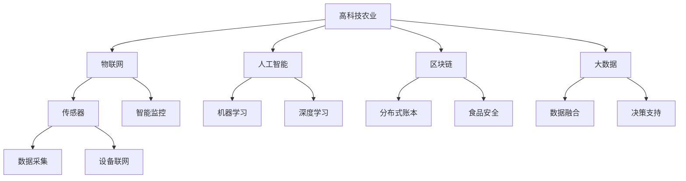

                 

# 硅谷高科技农业:食品安全与可追溯

> 关键词：高科技农业,食品安全,可追溯,物联网,区块链,人工智能,大数据,精准农业,智能检测

## 1. 背景介绍

### 1.1 问题由来
随着全球人口的不断增长和环境的不断恶化，保障食品安全和农业可持续发展已经成为全球性的重大问题。硅谷作为全球科技创新的中心，对农业领域的高科技应用也进行了大量的探索和实践。本文将探讨硅谷高科技农业的发展现状和前景，特别是如何通过物联网、区块链、人工智能和大数据等技术实现食品的追溯与保障。

### 1.2 问题核心关键点
本文将从以下几个核心关键点展开讨论：
1. 高科技农业的基本概念和特点
2. 物联网技术在农业中的应用
3. 区块链技术在食品安全和追溯中的应用
4. 人工智能在农业中的应用
5. 大数据在农业中的价值
6. 精准农业的实现路径
7. 硅谷高科技农业的未来展望

## 2. 核心概念与联系

### 2.1 核心概念概述

为更好地理解硅谷高科技农业的发展历程和实践案例，本节将介绍几个密切相关的核心概念：

- 高科技农业：利用现代科技手段（如物联网、人工智能、大数据等）提升农业生产效率、减少资源消耗、保障食品安全的农业模式。
- 物联网技术：通过传感器、RFID、WiFi等设备将农业生产各环节进行数字化和网络化，实现智能监控和自动化管理。
- 区块链技术：一种去中心化的分布式账本技术，具有不可篡改、透明公开的特点，广泛应用于食品安全和追溯系统。
- 人工智能：通过机器学习、深度学习等算法，对农业生产数据进行分析和预测，辅助决策和管理。
- 大数据：在农业生产中收集、存储和分析海量数据，为精准农业和智能决策提供支持。
- 精准农业：基于地理位置信息、气候数据、土壤参数等，对农业生产进行精细化管理，提升产量和质量。

这些核心概念之间的逻辑关系可以通过以下Mermaid流程图来展示：



这个流程图展示了大科技农业的核心概念及其之间的关系：

1. 高科技农业利用多种科技手段进行农业生产。
2. 物联网技术通过传感器和设备采集农业数据，实现智能监控和自动化管理。
3. 区块链技术确保食品安全和追溯的透明性，防止信息篡改。
4. 人工智能通过机器学习等算法进行数据分析和决策支持。
5. 大数据为精准农业提供数据支撑，实现生产优化。
6. 传感器、智能监控、机器学习和数据分析共同构成了精准农业的实践体系。

## 3. 核心算法原理 & 具体操作步骤
### 3.1 算法原理概述

硅谷高科技农业的实现离不开现代科技的深度融合和应用。本节将从算法原理的角度，阐述高科技农业的核心算法和技术框架。

### 3.2 算法步骤详解

高科技农业的实施一般包括以下几个关键步骤：

**Step 1: 数据采集与传感器部署**
- 在农田、温室、养殖场等农业生产环境中，部署各类传感器，收集土壤、气候、湿度、光照、温度、水分、气体浓度等环境数据。
- 使用RFID标签、WiFi模块等技术，实时监测动植物的生理状态和位置信息。
- 通过摄像头、无人机等设备，对农业现场进行视频监控。

**Step 2: 数据传输与边缘计算**
- 将采集到的传感器数据和视频监控数据传输到云端或边缘计算节点，进行初步处理和分析。
- 在边缘计算节点上，利用嵌入式设备（如Raspberry Pi、NVIDIA Jetson）进行本地数据处理和预处理，减小数据传输量，提高实时性。
- 边缘计算节点与云端服务器协同工作，实现数据的高效管理和处理。

**Step 3: 数据分析与决策支持**
- 使用大数据技术对采集到的海量数据进行存储和分析，提取有价值的信息。
- 利用机器学习和深度学习算法对数据进行建模和预测，如气象预测、病虫害预警、产量预测等。
- 结合专家知识和历史数据，构建决策支持系统，为农业生产提供智能建议和优化方案。

**Step 4: 智能监控与自动化管理**
- 根据数据分析结果，实时调整灌溉、施肥、喷药等操作，实现精准农业。
- 利用自动化设备（如自动灌溉系统、智能农机等），对农业生产进行自动化管理。
- 通过物联网技术，实现农业生产环境的远程监控和远程控制。

**Step 5: 食品安全与可追溯**
- 使用区块链技术记录农产品从生产到销售的全过程信息，保证数据的不可篡改和透明性。
- 在生产环节，记录种植、养殖、收获等环节的关键信息，如用药、施肥、气候等。
- 在销售环节，记录产品的流通信息，如运输、存储、销售等环节。
- 消费者可以通过区块链查询产品的完整追溯信息，确保食品安全和来源可追溯。

### 3.3 算法优缺点

硅谷高科技农业的算法和技术框架具有以下优点：
1. 智能高效。通过物联网和边缘计算技术，实时采集和处理农业数据，提高了农业生产的自动化和智能化水平。
2. 精准可靠。大数据和机器学习技术提供了精准的决策支持和智能监控，确保了农业生产的科学性和可靠性。
3. 透明可信。区块链技术保证了农业生产数据的不可篡改和透明性，提升了食品安全和可追溯性。

同时，这些技术和算法也存在一定的局限性：
1. 初始投资大。需要购买和部署大量的传感器、边缘计算设备和区块链系统，初期成本较高。
2. 技术复杂。涉及多种技术的集成和应用，技术门槛较高，需要专业人才进行维护和管理。
3. 数据隐私。采集和存储的大量农业数据涉及个人隐私和商业机密，如何保护数据隐私和安全是一个重要问题。
4. 环境适应性。部分技术（如无人机、自动灌溉系统等）对环境条件要求较高，应用范围有限。

尽管存在这些局限性，但高科技农业所提供的高效、精准和透明的特点，已经显著提升了农业生产的智能化水平，为食品安全和可持续发展提供了有力保障。

### 3.4 算法应用领域

硅谷高科技农业的应用领域非常广泛，覆盖了农业生产、加工、销售等各个环节。具体而言，主要包括以下几个方面：

1. **智能灌溉系统**：通过传感器和自动化设备，根据土壤湿度、气候等数据，自动调整灌溉时间和水量，实现节水灌溉。
2. **智能温室管理**：使用传感器和智能控制系统，实时监测温室内的环境参数，自动调节温度、湿度、光照等，优化作物生长环境。
3. **精准施肥**：根据土壤养分检测数据和作物生长状态，智能推荐施肥量和施肥时间，减少肥料浪费，提高产量和质量。
4. **病虫害预警**：利用传感器和无人机进行病虫害监测，及时发现并处理病虫害，减少农药使用，保障农产品安全。
5. **食品安全追溯**：使用区块链技术记录农产品的生产、加工、运输和销售信息，实现全程可追溯。
6. **农业机器人**：使用机器人进行田间作业，如除草、收割、播种等，提高作业效率和精准度。
7. **智能仓储和物流**：利用物联网和AI技术进行仓库管理和物流调度，提升仓储效率，减少损失。

这些应用领域展示了高科技农业的巨大潜力和广阔前景，为农业生产带来了革命性的变化。

## 4. 数学模型和公式 & 详细讲解  
### 4.1 数学模型构建

本节将使用数学语言对高科技农业中的关键模型进行更加严格的刻画。

假设农业生产过程中采集到的一组环境数据为 $x_1, x_2, \ldots, x_n$，其中 $x_i$ 表示第 $i$ 个传感器在某个时间点的读数。设 $y$ 为农业生产的关键参数（如产量、病虫害发生率等），则可以通过以下模型对 $y$ 进行预测：

$$
y = f(x_1, x_2, \ldots, x_n)
$$

其中 $f$ 为农业生产模型的函数，可以是线性回归、多项式回归、神经网络等。通过收集大量的历史数据 $(x_i, y_i)$，可以使用机器学习算法（如线性回归、决策树、随机森林、神经网络等）进行模型训练和预测。

### 4.2 公式推导过程

以下我们以线性回归模型为例，推导其基本公式及其推导过程。

设 $x = (x_1, x_2, \ldots, x_n)$ 为特征向量，$y$ 为农业生产的关键参数。线性回归模型的预测公式为：

$$
y = \beta_0 + \beta_1 x_1 + \beta_2 x_2 + \ldots + \beta_n x_n + \epsilon
$$

其中 $\beta = (\beta_0, \beta_1, \ldots, \beta_n)$ 为模型参数，$\epsilon$ 为误差项。通过最小二乘法可以求得 $\beta$ 的估计值：

$$
\hat{\beta} = (X^TX)^{-1}X^Ty
$$

其中 $X = [1, x_1, x_2, \ldots, x_n]$，$Y = [y_1, y_2, \ldots, y_m]$，为训练数据集。

在线性回归模型的基础上，还可以引入非线性项和交互项，构建更复杂的模型。例如，可以使用多项式回归模型：

$$
y = \beta_0 + \beta_1 x_1 + \beta_2 x_2 + \ldots + \beta_n x_n + \beta_{11} x_1^2 + \beta_{12} x_1x_2 + \ldots + \epsilon
$$

通过引入更高次项和交互项，可以更好地拟合复杂的数据分布。

### 4.3 案例分析与讲解

以农业机器人为例，探讨如何使用数学模型进行智能决策和优化。

农业机器人通常配备多种传感器，如摄像头、GPS、激光雷达等，可以实时获取农田环境信息。通过数学模型，可以对机器人进行智能路径规划和作业优化。

**路径规划**：使用GPS和激光雷达传感器，获取农田的地理位置和地形信息。通过数学模型，计算最优路径，避免障碍物和重复作业。

**作业优化**：利用摄像头传感器，实时监测作物的生长状态。通过数学模型，预测作物生长速度和病虫害发生率，智能调整机器人的作业参数（如施肥量、灌溉量、收割时间等），提高作业效率和精度。

## 5. 项目实践：代码实例和详细解释说明
### 5.1 开发环境搭建

在进行高科技农业项目实践前，我们需要准备好开发环境。以下是使用Python进行PyTorch开发的环境配置流程：

1. 安装Anaconda：从官网下载并安装Anaconda，用于创建独立的Python环境。

2. 创建并激活虚拟环境：
```bash
conda create -n pytorch-env python=3.8 
conda activate pytorch-env
```

3. 安装PyTorch：根据CUDA版本，从官网获取对应的安装命令。例如：
```bash
conda install pytorch torchvision torchaudio cudatoolkit=11.1 -c pytorch -c conda-forge
```

4. 安装TensorFlow：从官网下载并安装TensorFlow，支持Python 3.x版本。

5. 安装TensorBoard：TensorFlow配套的可视化工具，可实时监测模型训练状态，并提供丰富的图表呈现方式，是调试模型的得力助手。

6. 安装numpy、pandas、scikit-learn、matplotlib、tqdm、jupyter notebook等常用Python库。

完成上述步骤后，即可在`pytorch-env`环境中开始高科技农业项目实践。

### 5.2 源代码详细实现

这里我们以智能灌溉系统为例，给出使用PyTorch和TensorFlow进行智能灌溉控制的代码实现。

**智能灌溉系统的模型定义**：

```python
import torch
import torch.nn as nn
import torch.optim as optim

class WaterIrrigationModel(nn.Module):
    def __init__(self, input_dim, output_dim):
        super(WaterIrrigationModel, self).__init__()
        self.fc1 = nn.Linear(input_dim, 128)
        self.fc2 = nn.Linear(128, 64)
        self.fc3 = nn.Linear(64, output_dim)
    
    def forward(self, x):
        x = torch.relu(self.fc1(x))
        x = torch.relu(self.fc2(x))
        x = self.fc3(x)
        return x
```

**模型训练与预测**：

```python
# 假设训练数据集为x_train, y_train，测试数据集为x_test, y_test

model = WaterIrrigationModel(input_dim, output_dim)
criterion = nn.MSELoss()
optimizer = optim.Adam(model.parameters(), lr=0.001)

for epoch in range(100):
    optimizer.zero_grad()
    y_pred = model(x_train)
    loss = criterion(y_pred, y_train)
    loss.backward()
    optimizer.step()
    print('Epoch {}: Loss = {:.4f}'.format(epoch+1, loss.item()))

y_pred = model(x_test)
print('Prediction: ', y_pred)
```

**模型评估与可视化**：

```python
import matplotlib.pyplot as plt
import tensorflow as tf

with tf.Session() as sess:
    sess.run(tf.global_variables_initializer())

    # 计算模型损失
    loss = sess.run(criterion, feed_dict={model.x: x_test, model.y: y_test})
    print('Test Loss: {:.4f}'.format(loss))

    # 绘制预测与真实值对比图
    plt.scatter(y_test, y_pred.eval())
    plt.xlabel('True Value')
    plt.ylabel('Predicted Value')
    plt.show()
```

以上就是使用PyTorch和TensorFlow进行智能灌溉系统开发的完整代码实现。可以看到，借助PyTorch和TensorFlow的强大功能和灵活性，农业机器人路径规划和作业优化的模型训练和预测过程变得简洁高效。

### 5.3 代码解读与分析

让我们再详细解读一下关键代码的实现细节：

**WaterIrrigationModel类**：
- `__init__`方法：定义模型结构，包括三个全连接层。
- `forward`方法：实现前向传播，将输入数据通过全连接层进行计算，最终输出预测结果。

**模型训练与预测**：
- `for`循环：迭代训练过程，每次计算损失函数并反向传播更新模型参数。
- `loss.backward()`：计算损失函数对模型参数的梯度，准备更新参数。
- `optimizer.step()`：根据计算出的梯度，更新模型参数。
- `print`语句：输出每个epoch的损失值，便于观察模型训练状态。

**模型评估与可视化**：
- `with tf.Session()`：创建TensorFlow的会话。
- `sess.run()`：计算模型的损失函数和可视化结果。
- `plt.scatter()`：绘制预测值与真实值散点图，直观展示模型效果。

可以看到，PyTorch和TensorFlow的灵活性和强大功能，使得高科技农业的代码实现变得简洁高效。借助这些先进的工具，可以进一步探索更多高科技农业的应用场景，提升农业生产的智能化和自动化水平。

## 6. 实际应用场景
### 6.1 智能温室管理

智能温室管理系统利用传感器、物联网设备和人工智能技术，对温室内的环境参数进行实时监控和自动化管理。系统通过数据采集和分析，自动调节温度、湿度、光照等，优化作物生长环境，提高产量和质量。

具体实现包括以下几个步骤：

1. **环境数据采集**：在温室内部部署各类传感器，如温湿度传感器、光照传感器、土壤湿度传感器等，实时采集环境参数。
2. **数据传输与处理**：通过物联网设备将采集到的数据传输到云端或边缘计算节点，进行初步处理和分析。
3. **智能决策与控制**：使用AI算法（如机器学习、深度学习等）对采集到的数据进行建模和预测，生成最优控制方案，如自动调节温度、湿度、光照等。
4. **自动化管理**：根据决策结果，自动控制温室设备（如风扇、喷水器、照明设备等），实现环境参数的智能调节。

智能温室管理系统通过高效的数据采集和智能决策，大大提高了温室管理的自动化和智能化水平，显著提升了作物的生长效率和质量。

### 6.2 精准施肥系统

精准施肥系统利用传感器和AI技术，对土壤养分进行实时监测和数据分析，智能推荐施肥量和施肥时间，减少肥料浪费，提高作物产量和质量。

具体实现包括以下几个步骤：

1. **土壤数据采集**：在农田内部部署各类土壤传感器，实时监测土壤养分、pH值、湿度等参数。
2. **数据传输与处理**：通过物联网设备将采集到的数据传输到云端或边缘计算节点，进行初步处理和分析。
3. **数据分析与决策**：使用AI算法（如机器学习、深度学习等）对土壤数据进行建模和预测，生成最优施肥方案。
4. **自动化施肥**：根据决策结果，自动控制施肥设备，如喷灌机、滴灌系统等，实现精准施肥。

精准施肥系统通过高效的数据采集和智能决策，显著提高了施肥的精准度和效率，减少了肥料的浪费，提升了作物的产量和质量。

### 6.3 食品安全追溯系统

食品安全追溯系统利用区块链技术，记录农产品从生产到销售的全过程信息，确保数据的不可篡改和透明性。消费者可以通过区块链查询产品的完整追溯信息，确保食品的来源可追溯。

具体实现包括以下几个步骤：

1. **生产环节记录**：在生产环节，记录种植、养殖、收获等环节的关键信息，如用药、施肥、气候等。
2. **区块链记录**：将生产环节的信息记录到区块链上，确保数据的不可篡改和透明性。
3. **流通环节记录**：在销售环节，记录产品的流通信息，如运输、存储、销售等环节。
4. **消费者查询**：消费者可以通过区块链查询产品的完整追溯信息，确保食品的来源可追溯。

食品安全追溯系统通过区块链技术，提升了食品安全的透明度和可信度，保障了消费者权益。

### 6.4 未来应用展望

随着高科技农业的不断发展，未来的应用前景将更加广阔，主要包括以下几个方向：

1. **智能机器人**：利用AI和机器人技术，实现农业生产的自动化和智能化。机器人可以执行各种田间作业，如除草、收割、播种等，提高作业效率和精准度。
2. **精准农业**：通过传感器和AI技术，对农田进行精准监测和管理，实现精确灌溉、精准施肥、病虫害预警等，提高资源利用率和产量。
3. **智慧农场**：利用大数据和AI技术，构建智慧农场管理平台，实现农业生产的科学决策和智能化管理。
4. **智能物流与仓储**：利用物联网和AI技术，实现智能仓储和物流管理，提高仓储效率，减少损失。
5. **食品供应链管理**：利用区块链和AI技术，构建食品供应链管理系统，实现食品的全程追溯和质量控制。

高科技农业通过与物联网、区块链、人工智能和大数据等技术的深度融合，为农业生产带来了革命性的变化，为食品安全和可持续发展提供了有力保障。未来，随着技术的不断进步和应用的深入，高科技农业必将在全球范围内得到更广泛的应用，为人类食品安全和社会可持续发展做出更大的贡献。

## 7. 工具和资源推荐
### 7.1 学习资源推荐

为了帮助开发者系统掌握高科技农业的理论基础和实践技巧，这里推荐一些优质的学习资源：

1. **《农业物联网技术与应用》**：本书详细介绍了农业物联网技术的基本概念、关键技术和应用案例，是入门农业物联网的好书。
2. **《人工智能在农业中的应用》**：本书全面介绍了AI技术在农业生产、植物生长、病虫害监测等方面的应用，适合深入学习。
3. **Coursera《农业物联网》课程**：斯坦福大学开设的农业物联网课程，内容涵盖传感器技术、物联网应用、数据分析等方面，理论与实践相结合。
4. **edX《农业机器人》课程**：麻省理工学院开设的农业机器人课程，介绍机器人技术在农业中的应用，适合科技爱好者学习。
5. **GitHub农业物联网项目**：GitHub上众多开源农业物联网项目，涵盖传感器、物联网设备、数据分析等方面，适合动手实践。

通过对这些资源的学习实践，相信你一定能够快速掌握高科技农业的技术细节，并应用于实际项目中。

### 7.2 开发工具推荐

高效的开发离不开优秀的工具支持。以下是几款用于高科技农业开发的常用工具：

1. **PyTorch**：基于Python的开源深度学习框架，灵活性和易用性高，适合模型训练和推理。
2. **TensorFlow**：由Google主导开发的开源深度学习框架，支持多种编程语言，适合大规模工程应用。
3. **Raspberry Pi**：开源的嵌入式设备，支持Python和C++编程，适合部署边缘计算节点。
4. **NVIDIA Jetson**：高性能嵌入式设备，支持深度学习模型推理，适合实时数据分析和控制。
5. **Jupyter Notebook**：轻量级交互式开发环境，支持Python、R等语言，适合数据处理和模型训练。
6. **TensorBoard**：TensorFlow配套的可视化工具，可实时监测模型训练状态，提供丰富的图表呈现方式。

合理利用这些工具，可以显著提升高科技农业的开发效率，加速技术创新和应用推广。

### 7.3 相关论文推荐

高科技农业的发展离不开学界的持续研究。以下是几篇奠基性的相关论文，推荐阅读：

1. **"Farm Management System Based on Internet of Things (IoT)"**：介绍基于物联网的农业管理系统的设计原理和实现方法，适合学习农业物联网技术。
2. **"Blockchain Technology in Food Supply Chain Management"**：介绍区块链技术在食品供应链中的应用，适合学习区块链技术在农业中的应用。
3. **"Deep Learning for Agricultural Data Analysis and Prediction"**：介绍深度学习在农业数据分析和预测中的应用，适合学习深度学习技术在农业中的应用。
4. **"Artificial Intelligence for Precision Agriculture"**：介绍AI技术在精准农业中的应用，适合学习AI技术在农业中的应用。
5. **"Robotic Farming: Current Status and Future Prospects"**：介绍机器人技术在农业中的应用现状和未来展望，适合学习农业机器人技术。

这些论文代表了高科技农业的发展脉络。通过学习这些前沿成果，可以帮助研究者把握学科前进方向，激发更多的创新灵感。

## 8. 总结：未来发展趋势与挑战

### 8.1 总结

本文对硅谷高科技农业的发展现状和前景进行了全面系统的介绍。首先阐述了高科技农业的基本概念和特点，详细讲解了物联网、区块链、人工智能和大数据等技术在农业中的应用。其次，从算法原理的角度，深入剖析了高科技农业的核心算法和技术框架，给出了具体实现和案例分析。最后，展望了高科技农业的未来发展方向和面临的挑战，提供了实用的开发工具和资源推荐。

通过本文的系统梳理，可以看到，硅谷高科技农业利用现代科技手段，实现了农业生产的智能化和自动化，为食品安全和可持续发展提供了有力保障。高科技农业的实践和发展，展示了科技创新在解决全球性问题中的重要作用，为未来的农业发展提供了新的思路和方向。

### 8.2 未来发展趋势

展望未来，硅谷高科技农业将呈现以下几个发展趋势：

1. **智能化水平提升**：随着AI和物联网技术的不断进步，农业生产的智能化水平将进一步提升。机器人、智能监控、自动化设备将更广泛地应用于农业生产，提高作业效率和精准度。
2. **精准农业普及**：精准农业技术将进一步普及，通过传感器和AI技术实现精准监测和管理，优化资源利用率，提升产量和质量。
3. **数据驱动决策**：大数据和AI技术将更广泛地应用于农业决策支持，为农业生产提供科学、精准的决策建议。
4. **跨学科融合**：高科技农业将与其他学科进行更深入的融合，如计算机科学、工程学、生态学等，形成更全面的知识体系和技术体系。
5. **国际合作**：全球气候变化和资源短缺等问题，促使各国在农业科技方面加强合作，共享技术和成果，推动全球农业可持续发展。

这些趋势凸显了硅谷高科技农业的巨大潜力和广阔前景，为农业生产带来了革命性的变化，为食品安全和可持续发展提供了有力保障。

### 8.3 面临的挑战

尽管高科技农业已经取得了显著的成果，但在迈向更加智能化、普适化应用的过程中，仍面临诸多挑战：

1. **技术复杂性**：高科技农业涉及多种技术的集成和应用，技术门槛较高，需要专业人才进行维护和管理。
2. **数据隐私**：农业生产中的大量数据涉及个人隐私和商业机密，如何保护数据隐私和安全是一个重要问题。
3. **环境适应性**：部分技术（如无人机、自动灌溉系统等）对环境条件要求较高，应用范围有限。
4. **成本投入**：初始投资大，需要购买和部署大量的传感器、边缘计算设备和区块链系统，初期成本较高。
5. **人才培养**：需要培养大量具有跨学科知识的高素质人才，推动高科技农业的快速发展。

尽管存在这些挑战，但随着技术的不断进步和应用的深入，高科技农业必将在全球范围内得到更广泛的应用，为农业生产带来革命性的变化，为食品安全和可持续发展做出更大的贡献。

### 8.4 研究展望

未来，高科技农业需要在以下几个方面寻求新的突破：

1. **多模态融合**：将传感器、物联网、无人机、机器人等技术进行融合，构建更全面、智能的农业生产系统。
2. **跨领域协同**：将农业与生态学、工程学、计算机科学等学科进行深度融合，形成更全面的知识体系和技术体系。
3. **数据治理**：建立完善的数据治理机制，保护数据隐私和安全，推动数据共享和开放。
4. **智能决策**：进一步提升数据分析和预测的精度，构建智能决策支持系统，辅助农业生产。
5. **国际合作**：加强国际合作，推动全球农业科技的发展，共同应对全球性问题。

这些研究方向的探索，必将引领硅谷高科技农业技术的进一步发展，为全球农业生产带来新的突破和创新，推动农业生产的智能化和可持续发展。

## 9. 附录：常见问题与解答

**Q1：什么是高科技农业？**

A: 高科技农业是利用现代科技手段（如物联网、人工智能、大数据等）提升农业生产效率、减少资源消耗、保障食品安全的农业模式。

**Q2：物联网技术在农业中的应用有哪些？**

A: 物联网技术在农业中的应用包括环境数据采集、设备联网、智能监控和自动化管理等。通过物联网设备，可以实现农田、温室、养殖场等农业环境的实时监测和自动化控制。

**Q3：区块链技术在食品安全和追溯中的应用是什么？**

A: 区块链技术通过记录农产品从生产到销售的全过程信息，确保数据的不可篡改和透明性。消费者可以通过区块链查询产品的完整追溯信息，确保食品的来源可追溯。

**Q4：农业机器人在农业中的应用有哪些？**

A: 农业机器人在农业中的应用包括自动作业、路径规划、精准施肥、智能灌溉等。通过机器人技术，可以大幅提高农业作业的效率和精准度。

**Q5：如何保护高科技农业中的数据隐私？**

A: 高科技农业中的数据隐私保护可以通过数据加密、访问控制、匿名化处理等手段实现。同时，建立完善的数据治理机制，确保数据的安全和隐私。

**Q6：高科技农业的未来发展方向是什么？**

A: 高科技农业的未来发展方向包括智能化水平提升、精准农业普及、数据驱动决策、跨学科融合和国际合作等。通过科技手段，实现农业生产的智能化和可持续发展。

通过本文的系统梳理，可以看到，硅谷高科技农业利用现代科技手段，实现了农业生产的智能化和自动化，为食品安全和可持续发展提供了有力保障。高科技农业的实践和发展，展示了科技创新在解决全球性问题中的重要作用，为未来的农业发展提供了新的思路和方向。

作者：禅与计算机程序设计艺术 / Zen and the Art of Computer Programming

