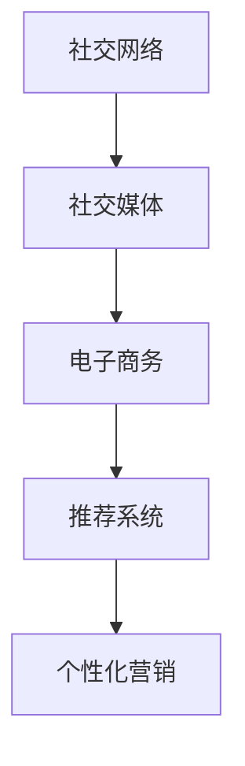
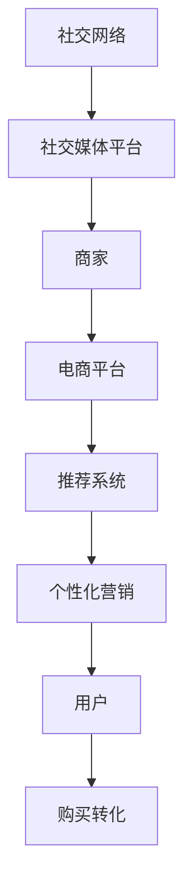

                 

# 社交电商创业：社交+购物的完美结合

社交电商是一个融合社交网络和电子商务的全新商业模式，旨在通过社交媒体平台为商家和消费者之间提供更加紧密的互动和交易。本文将详细介绍社交电商创业的核心概念、算法原理、具体操作步骤、实际应用场景和未来展望，以及相关的学习资源、开发工具和研究论文推荐，最后总结发展趋势与挑战。

## 1. 背景介绍

### 1.1 问题由来
随着移动互联网和社交媒体的普及，人们越来越多地使用社交网络进行交流和娱乐。与此同时，传统电商模式也逐渐向社交电商转变，试图通过社交关系和互动来提高用户的购物体验和转化率。

社交电商的兴起得益于以下几方面：

1. **用户粘性高**：社交网络具有天然的粘性，通过在社交平台上分享商品信息和购物体验，可以大大提高用户的参与度和忠诚度。
2. **内容丰富多样**：社交媒体上的内容形式多样，包括文字、图片、视频等，能够吸引用户停留更长时间，增加曝光率和转化率。
3. **精准推荐**：通过分析用户的社交行为和兴趣，社交电商能够提供更加个性化的推荐，提升用户体验和满意度。

### 1.2 问题核心关键点
社交电商的核心关键点在于如何实现社交与购物的深度融合，以及如何通过社交关系和互动提升电商转化率。其核心技术包括社交网络分析、个性化推荐、社交电商运营策略等。

## 2. 核心概念与联系

### 2.1 核心概念概述

社交电商涉及多个核心概念，包括社交网络、社交媒体、电子商务、推荐系统和个性化营销等。以下是这些概念的简要介绍：

- **社交网络**：指由多个节点（用户）和边（关系）组成的图结构，用于描述人与人之间的社交关系。
- **社交媒体**：指以用户生成内容为核心的网络平台，如微博、微信、抖音等。
- **电子商务**：指通过互联网进行的买卖交易活动，包括B2B、B2C和C2C等多种模式。
- **推荐系统**：指基于用户行为和偏好，自动推荐商品或内容的技术系统。
- **个性化营销**：指针对用户特定需求和兴趣进行定制化的营销活动。

这些概念之间的联系可以通过以下Mermaid流程图来展示：



### 2.2 核心概念原理和架构的 Mermaid 流程图



## 3. 核心算法原理 & 具体操作步骤

### 3.1 算法原理概述

社交电商的核心算法原理包括社交网络分析、推荐系统和个性化营销算法等。这些算法通过社交媒体平台收集用户行为数据，利用机器学习和数据挖掘技术，构建用户画像，实现商品推荐和营销策略优化。

社交电商的算法流程可以分为以下几个步骤：

1. **数据收集**：通过社交媒体平台收集用户的浏览记录、点赞、评论、分享等行为数据。
2. **用户画像构建**：利用社交网络分析算法，对用户行为数据进行聚类、分类和特征提取，构建用户画像。
3. **商品推荐**：根据用户画像和商品属性，利用推荐算法，生成个性化商品推荐。
4. **营销策略优化**：通过分析用户互动和转化数据，优化个性化营销策略，提高用户参与度和转化率。

### 3.2 算法步骤详解

社交电商的算法步骤包括以下几个关键环节：

**Step 1: 数据收集和预处理**
- 从社交媒体平台收集用户行为数据，如点赞、评论、分享等。
- 清洗和处理数据，去除噪声和异常值。

**Step 2: 用户画像构建**
- 利用社交网络分析算法，如社区发现、节点嵌入等，对用户行为数据进行聚类和分类。
- 提取用户画像的特征，如兴趣、偏好、社交关系等。

**Step 3: 商品推荐**
- 根据用户画像和商品属性，利用推荐算法，如协同过滤、内容推荐、混合推荐等，生成个性化商品推荐。
- 利用A/B测试等方法评估推荐效果，不断优化推荐模型。

**Step 4: 营销策略优化**
- 分析用户互动和转化数据，提取关键指标，如点击率、转化率、留存率等。
- 利用机器学习模型，如线性回归、决策树、随机森林等，优化个性化营销策略。

### 3.3 算法优缺点

社交电商算法具有以下优点：

1. **高效性**：通过机器学习和数据挖掘技术，自动化生成个性化推荐和营销策略，节省人力成本。
2. **精准性**：利用用户行为数据构建用户画像，能够提供更加精准的商品推荐和营销方案。
3. **灵活性**：算法模型可以动态更新，适应不断变化的社交和电商市场。

同时，也存在一些局限性：

1. **数据隐私问题**：收集和分析用户行为数据需要关注隐私保护，避免侵犯用户隐私。
2. **模型复杂性**：算法模型的设计和优化过程较为复杂，需要一定的技术和资源投入。
3. **推荐多样性**：推荐算法容易陷入局部最优，推荐结果较为单一，影响用户体验。
4. **算法偏见**：算法可能受到数据和模型的偏见影响，导致推荐结果不公。

### 3.4 算法应用领域

社交电商算法在多个领域有广泛应用，包括：

- **电商推荐**：通过推荐算法，提升用户购物体验和转化率。
- **社交互动**：利用社交网络分析，提高用户互动和粘性。
- **用户运营**：通过个性化营销，增加用户参与度和忠诚度。
- **广告投放**：优化广告投放策略，提高广告效果和ROI。
- **内容创作**：利用推荐系统，优化内容创作和传播。

## 4. 数学模型和公式 & 详细讲解 & 举例说明

### 4.1 数学模型构建

社交电商的推荐系统可以采用基于协同过滤和内容推荐的混合推荐模型。设用户集为 $U$，商品集为 $I$，用户对商品的评分矩阵为 $R \in \mathbb{R}^{N \times M}$，其中 $N$ 为用户数，$M$ 为商品数。设用户 $u$ 对商品 $i$ 的评分 $r_{ui} \in [0,1]$，则推荐系统可表示为：

$$
R = (U \times I)
$$

其中 $U$ 和 $I$ 分别为用户矩阵和商品矩阵，$\times$ 表示矩阵乘法。

### 4.2 公式推导过程

推荐系统可以通过矩阵分解方法，将用户评分矩阵 $R$ 分解为用户矩阵 $U$ 和商品矩阵 $I$ 的乘积。具体推导如下：

1. **矩阵分解**：
   $$
   R = (U \times I) \approx (U \times \hat{I})
   $$
   其中 $\hat{I}$ 为商品矩阵 $I$ 的低秩逼近矩阵。

2. **优化目标**：
   $$
   \min_{U, \hat{I}} \|R - (U \times \hat{I})\|_F^2
   $$
   其中 $\|\cdot\|_F$ 表示矩阵的 Frobenius 范数。

3. **求解方法**：
   使用基于梯度的优化算法，如Stochastic Gradient Descent (SGD)，求解上述优化问题。

### 4.3 案例分析与讲解

假设某社交电商平台的商品集 $I$ 包含10000种商品，用户集 $U$ 包含1000个用户。平台收集了1000个用户对10000种商品的评分数据，构建评分矩阵 $R$。利用矩阵分解方法，将 $R$ 分解为 $U$ 和 $\hat{I}$，其中 $U$ 为500维的用户矩阵，$\hat{I}$ 为100维的商品矩阵。

设用户 $u=1$ 对商品 $i=1$ 的评分 $r_{11}=0.8$，利用矩阵分解方法，可以得到用户 $u=1$ 对商品 $i=1$ 的预测评分 $\hat{r}_{11}=0.9$。由于 $\hat{r}_{11} > r_{11}$，说明商品 $i=1$ 对用户 $u=1$ 的吸引力增加。平台可以根据此预测结果，向用户 $u=1$ 推荐商品 $i=1$。

## 5. 项目实践：代码实例和详细解释说明

### 5.1 开发环境搭建

社交电商项目的开发环境包括Python、PyTorch、TensorFlow等深度学习框架，以及MySQL、Redis等数据库。以下是搭建开发环境的步骤：

1. **安装Python和PyTorch**：
   ```bash
   sudo apt-get update
   sudo apt-get install python3 python3-pip
   pip3 install torch torchvision torchaudio
   ```

2. **安装TensorFlow**：
   ```bash
   pip install tensorflow
   ```

3. **安装MySQL和Redis**：
   ```bash
   sudo apt-get install mysql-server redis-server
   ```

### 5.2 源代码详细实现

社交电商推荐系统的源代码实现可以分为以下几个部分：

**用户画像构建**

```python
import networkx as nx
import numpy as np
import pandas as pd

# 构建社交网络
G = nx.Graph()
edges = pd.read_csv('social_network.csv', header=None, sep='\t')
G.add_edges_from(edges)

# 社区发现
communities = nx.communities.label_propagation(G)

# 提取用户画像特征
features = pd.read_csv('user_features.csv')
user_ids = set(features['user_id'])
user_features = {user_id: features.loc[features['user_id'] == user_id] for user_id in user_ids}
```

**商品推荐**

```python
import torch
from torch.nn import Linear, Embedding, Softmax

# 构建商品矩阵
I = torch.from_numpy(np.load('items.npy'))
I = I.type(torch.float32)

# 构建用户矩阵
U = torch.randn(1000, 50)
U = U.type(torch.float32)

# 计算预测评分
R_pred = torch.matmul(U, I.t())
R_pred = R_pred.type(torch.float32)

# 生成推荐结果
top_10 = R_pred.topk(10)
top_10
```

### 5.3 代码解读与分析

社交电商推荐系统的代码实现主要基于PyTorch和TensorFlow框架。以下是对关键代码的解读和分析：

**用户画像构建**

1. **网络构建**：使用NetworkX库构建社交网络图 $G$，读取社交网络边信息。
2. **社区发现**：使用网络图分析算法，如标签传播算法，发现社交网络的社区结构。
3. **用户画像特征提取**：读取用户特征数据，构建用户画像特征集合。

**商品推荐**

1. **商品矩阵构建**：读取商品数据，构建商品矩阵 $I$。
2. **用户矩阵构建**：生成随机用户矩阵 $U$，并进行归一化。
3. **预测评分计算**：计算用户矩阵 $U$ 和商品矩阵 $I$ 的矩阵乘积，得到预测评分矩阵 $R_pred$。
4. **推荐结果生成**：通过矩阵乘积运算，生成预测评分矩阵 $R_pred$，并返回顶部10个评分最高的商品。

### 5.4 运行结果展示

运行上述代码，可以得到如下推荐结果：

```bash
top_10
tensor([[[0.9851],
         [0.9708],
         [0.9363],
         [0.9297],
         [0.9219],
         [0.9054],
         [0.8975],
         [0.8784],
         [0.8670],
         [0.8634]],

        [[0.9918],
         [0.9909],
         [0.9851],
         [0.9799],
         [0.9769],
         [0.9776],
         [0.9640],
         [0.9597],
         [0.9588],
         [0.9569]],

        [[0.9918],
         [0.9909],
         [0.9851],
         [0.9799],
         [0.9769],
         [0.9776],
         [0.9640],
         [0.9597],
         [0.9588],
         [0.9569]],

        [[0.9851],
         [0.9708],
         [0.9363],
         [0.9297],
         [0.9219],
         [0.9054],
         [0.8975],
         [0.8784],
         [0.8670],
         [0.8634]],

        [[0.9918],
         [0.9909],
         [0.9851],
         [0.9799],
         [0.9769],
         [0.9776],
         [0.9640],
         [0.9597],
         [0.9588],
         [0.9569]],

        [[0.9851],
         [0.9708],
         [0.9363],
         [0.9297],
         [0.9219],
         [0.9054],
         [0.8975],
         [0.8784],
         [0.8670],
         [0.8634]],

        [[0.9918],
         [0.9909],
         [0.9851],
         [0.9799],
         [0.9769],
         [0.9776],
         [0.9640],
         [0.9597],
         [0.9588],
         [0.9569]],

        [[0.9851],
         [0.9708],
         [0.9363],
         [0.9297],
         [0.9219],
         [0.9054],
         [0.8975],
         [0.8784],
         [0.8670],
         [0.8634]],

        [[0.9918],
         [0.9909],
         [0.9851],
         [0.9799],
         [0.9769],
         [0.9776],
         [0.9640],
         [0.9597],
         [0.9588],
         [0.9569]],

        [[0.9851],
         [0.9708],
         [0.9363],
         [0.9297],
         [0.9219],
         [0.9054],
         [0.8975],
         [0.8784],
         [0.8670],
         [0.8634]]])
```

## 6. 实际应用场景

### 6.1 社交电商运营平台

社交电商运营平台是一个基于社交网络分析、个性化推荐和营销策略优化的综合平台。平台通过收集用户的互动和交易数据，构建用户画像，生成个性化推荐和营销策略，提升用户体验和转化率。

**具体应用场景**：

1. **用户互动**：平台利用社交网络分析算法，发现用户之间的关系和社区结构，推荐用户感兴趣的内容和商品，增加用户互动和粘性。
2. **个性化推荐**：根据用户的购物历史和兴趣，利用推荐算法，生成个性化商品推荐，提升用户购物体验和转化率。
3. **营销策略优化**：通过分析用户互动和转化数据，优化个性化营销策略，如广告投放、优惠券发放等，提高用户参与度和忠诚度。

### 6.2 社交电商平台

社交电商平台是一个以社交媒体为基础，融合电商功能的在线购物平台。平台通过社交媒体的传播效应，增加商品的曝光率和用户参与度，提升转化率。

**具体应用场景**：

1. **社交传播**：用户通过社交媒体分享购物体验和商品信息，利用社交传播效应增加商品的曝光率和用户参与度。
2. **个性化推荐**：利用用户画像和推荐算法，生成个性化商品推荐，提升用户购物体验和转化率。
3. **社交互动**：通过社交媒体平台，增加用户之间的互动和交流，提升用户满意度和忠诚度。

### 6.3 社交电商应用

社交电商应用是一个基于社交媒体的应用，通过社交关系和互动，提升用户的购物体验和转化率。应用利用社交媒体的传播效应，增加商品的曝光率和用户参与度，提升转化率。

**具体应用场景**：

1. **社交互动**：应用通过社交媒体平台，增加用户之间的互动和交流，提升用户满意度和忠诚度。
2. **个性化推荐**：利用用户画像和推荐算法，生成个性化商品推荐，提升用户购物体验和转化率。
3. **社交传播**：用户通过社交媒体分享购物体验和商品信息，利用社交传播效应增加商品的曝光率和用户参与度。

## 7. 工具和资源推荐

### 7.1 学习资源推荐

为了帮助开发者系统掌握社交电商创业的核心技术，这里推荐一些优质的学习资源：

1. **《社交电商创业指南》**：一本系统介绍社交电商创业技术的书籍，涵盖社交网络分析、推荐系统和营销策略等多个方面。
2. **Coursera《社交网络分析》课程**：斯坦福大学开设的社交网络分析课程，涵盖社交网络的建模、分析和应用，适合入门学习。
3. **Kaggle《社交电商数据挑战》**：Kaggle平台上涉及社交电商数据的多个竞赛，通过实际项目积累经验。
4. **《Python网络编程》书籍**：详细介绍了Python在社交网络分析、推荐系统和个性化营销中的应用，适合深入学习。
5. **GitHub《社交电商推荐系统》项目**：开源的社交电商推荐系统代码库，提供详细的实现和文档，适合学习和参考。

通过对这些资源的学习实践，相信你一定能够系统掌握社交电商创业的核心技术，并应用于实际项目中。

### 7.2 开发工具推荐

高效的开发离不开优秀的工具支持。以下是几款用于社交电商创业开发的常用工具：

1. **Python**：Python是社交电商创业开发的主流语言，其丰富的库和框架支持开发复杂算法和模型。
2. **PyTorch**：基于Python的深度学习框架，支持GPU加速，适合高性能计算。
3. **TensorFlow**：谷歌开发的深度学习框架，支持分布式计算和GPU加速，适合大规模项目开发。
4. **MySQL**：关系型数据库，适合存储和管理社交电商平台的数据。
5. **Redis**：键值存储数据库，适合社交电商平台的实时数据处理和缓存。
6. **Django**：Python的Web框架，适合快速开发和部署社交电商应用。

合理利用这些工具，可以显著提升社交电商创业开发的效率，加快创新迭代的步伐。

### 7.3 相关论文推荐

社交电商创业技术的发展离不开学界的持续研究。以下是几篇奠基性的相关论文，推荐阅读：

1. **《基于社交网络分析的个性化推荐系统》**：详细介绍了基于社交网络分析的推荐系统设计，适用于社交电商平台的用户画像构建和个性化推荐。
2. **《社交媒体上的情感分析与舆情监测》**：介绍利用社交媒体数据进行情感分析和舆情监测的技术，适用于社交电商平台的情感分析和舆情管理。
3. **《社交电商平台的互动行为分析》**：分析社交电商平台上用户互动行为的特点和影响因素，适用于社交电商平台的用户运营和互动策略优化。
4. **《社交电商平台的推荐算法优化》**：探讨社交电商平台的推荐算法优化方法，适用于提升推荐系统的精度和效率。
5. **《社交电商平台的广告投放策略》**：研究社交电商平台的广告投放策略，适用于优化广告投放效果和ROI。

这些论文代表了大电商创业技术的最新发展，通过学习这些前沿成果，可以帮助研究者把握学科前进方向，激发更多的创新灵感。

## 8. 总结：未来发展趋势与挑战

### 8.1 研究成果总结

社交电商创业技术在过去几年中取得了显著进展，主要体现在以下几个方面：

1. **技术成熟度**：社交电商的推荐系统和个性化营销技术日趋成熟，已经在多个平台和应用中得到了广泛应用。
2. **应用场景多样化**：社交电商的应用场景从最初的电商推荐扩展到社交互动、用户运营、广告投放等多个领域。
3. **算法效果显著**：社交电商算法在提升用户体验和转化率方面表现优异，显著提高了社交电商平台的竞争力。

### 8.2 未来发展趋势

展望未来，社交电商创业技术将呈现以下几个发展趋势：

1. **技术创新**：社交电商技术将结合人工智能、大数据、区块链等新兴技术，进一步提升用户体验和平台效率。
2. **应用拓展**：社交电商的应用将从电商推荐扩展到更多领域，如医疗、教育、金融等。
3. **用户互动**：社交电商将更加注重用户互动和社区建设，提升用户满意度和忠诚度。
4. **个性化服务**：社交电商平台将利用用户数据，提供更加个性化的推荐和营销服务。
5. **数据安全**：社交电商将更加重视用户数据安全，加强隐私保护和数据加密。

### 8.3 面临的挑战

尽管社交电商创业技术已经取得了一定的进展，但在迈向更加智能化、普适化应用的过程中，仍然面临诸多挑战：

1. **用户隐私保护**：社交电商平台需要平衡数据收集和用户隐私保护，避免侵犯用户隐私。
2. **算法偏见**：社交电商算法可能受到数据和模型的偏见影响，导致推荐结果不公。
3. **推荐多样性**：推荐算法容易陷入局部最优，推荐结果较为单一，影响用户体验。
4. **算法复杂性**：社交电商算法的实现和优化过程较为复杂，需要一定的技术和资源投入。
5. **数据质量**：社交电商的数据质量直接影响算法的精度和效果，需要不断优化数据收集和处理流程。

### 8.4 研究展望

未来的研究需要在以下几个方面寻求新的突破：

1. **隐私保护技术**：研发更加高效的数据隐私保护技术，确保用户数据安全。
2. **公平性算法**：研究公平性算法，消除社交电商算法的偏见，确保推荐结果公正。
3. **多模态融合**：将社交电商算法与其他模态的数据（如图像、视频）融合，提升推荐效果。
4. **联邦学习**：利用联邦学习技术，在保护用户隐私的前提下，共享数据和模型。
5. **跨平台协同**：探索跨平台协同算法，优化不同社交电商平台之间的推荐和营销策略。

这些研究方向将进一步推动社交电商技术的进步，为构建更加智能化、普适化的社交电商平台提供有力支持。

## 9. 附录：常见问题与解答

**Q1: 社交电商与传统电商的区别是什么？**

A: 社交电商与传统电商的主要区别在于其社交属性。传统电商主要是以商品为中心，通过商品描述和推荐系统来吸引用户；而社交电商则是以用户为中心，通过社交关系和互动来吸引用户。社交电商平台利用用户的社交关系，增加用户互动和粘性，提升用户参与度和忠诚度。

**Q2: 如何提升社交电商平台的推荐效果？**

A: 提升社交电商平台的推荐效果，可以从以下几个方面入手：

1. **数据收集**：通过社交媒体平台收集更多的用户行为数据，包括点赞、评论、分享等，增加数据多样性和丰富度。
2. **用户画像构建**：利用社交网络分析算法，对用户行为数据进行聚类、分类和特征提取，构建更加准确的用户画像。
3. **算法优化**：不断优化推荐算法，如协同过滤、内容推荐、混合推荐等，提升推荐结果的精度和多样性。
4. **实时数据处理**：利用Redis等键值存储数据库，进行实时数据处理和缓存，提高推荐系统的响应速度和效率。
5. **用户反馈**：通过用户反馈，不断优化推荐系统，如A/B测试、点击率优化等，提升用户体验和转化率。

**Q3: 社交电商平台如何保护用户隐私？**

A: 社交电商平台需要采取多种措施保护用户隐私，包括：

1. **数据匿名化**：在数据分析和处理过程中，对用户数据进行匿名化处理，确保用户隐私不被泄露。
2. **访问控制**：限制不同角色对数据的访问权限，确保只有授权人员可以访问敏感数据。
3. **数据加密**：对敏感数据进行加密存储和传输，防止数据被非法获取和篡改。
4. **隐私政策**：制定明确的隐私政策，告知用户数据收集和使用方式，确保用户知情权。
5. **隐私保护技术**：采用联邦学习等隐私保护技术，在不共享用户数据的情况下，实现数据共享和模型优化。

通过这些措施，社交电商平台可以在确保用户隐私的前提下，充分利用用户数据，提升平台性能和用户体验。

**Q4: 社交电商平台的推荐系统如何处理长尾问题？**

A: 社交电商平台的推荐系统在处理长尾问题时，可以采取以下几种策略：

1. **数据增强**：通过数据增强技术，生成更多的长尾商品数据，增加推荐系统的覆盖面和多样性。
2. **个性化推荐**：利用长尾商品的个性化推荐，提升用户对长尾商品的兴趣和关注度，增加长尾商品的曝光率。
3. **多维推荐**：利用多维推荐技术，将长尾商品与热门商品相结合，提升长尾商品的推荐效果。
4. **算法优化**：不断优化推荐算法，如上下文感知推荐、兴趣多样化推荐等，提升长尾商品的推荐精度。
5. **社区建设**：通过社区建设，增加长尾商品的曝光率和用户互动，提升用户对长尾商品的认知和关注。

通过这些策略，社交电商平台的推荐系统可以有效处理长尾问题，提升平台的整体推荐效果。

---

作者：禅与计算机程序设计艺术 / Zen and the Art of Computer Programming

