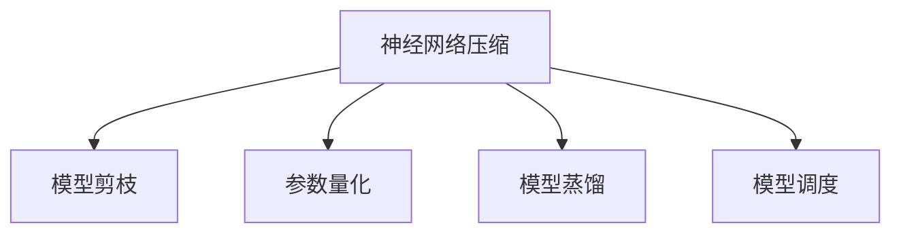

                 

# 神经网络压缩：移动设备上的深度学习

> 关键词：神经网络压缩,深度学习,移动设备,模型压缩,模型优化,模型加速,量化,剪枝,模型蒸馏,模型调度

## 1. 背景介绍

随着深度学习技术在各行各业中的广泛应用，越来越多的移动设备、嵌入式设备、IoT设备等资源受限的设备也开始部署深度学习模型。这些设备通常具有低能耗、小体积、低成本等特点，但计算能力有限，难以直接运行高参数、高计算量的深度学习模型。因此，神经网络压缩技术应运而生，旨在将高参数的深度学习模型压缩到资源受限的设备上，同时尽可能保持模型的性能，满足实际应用的需求。

神经网络压缩技术的发展，经历了从手动剪枝、参数量化到模型蒸馏等多个阶段。从最初的通过手动分析优化模型结构，到目前利用自动化工具进行模型压缩，技术的进步极大地降低了模型压缩的难度和复杂度。现代神经网络压缩技术已经能够高效地将深度学习模型压缩到计算能力有限的设备上，满足了广泛的应用需求。

## 2. 核心概念与联系

### 2.1 核心概念概述

为更好地理解神经网络压缩技术，本节将介绍几个密切相关的核心概念：

- 神经网络压缩(Neural Network Compression)：指通过一系列技术手段，将高参数的深度学习模型压缩到低参数、低计算量的形式，以便在资源受限的设备上运行。常见的压缩方法包括剪枝、量化、模型蒸馏等。

- 模型剪枝(Pruning)：指通过移除神经网络中的冗余连接或参数，减少模型的复杂度和计算量，以达到压缩模型大小的目的。剪枝分为结构剪枝和参数剪枝两种方法。

- 参数量化(Quantization)：指将高精度浮点数参数转化为低精度的整数或定点数，减小模型的存储空间和计算复杂度。参数量化通常分为对称量化和非对称量化，分别适用于静态和动态量化场景。

- 模型蒸馏(Distillation)：指利用性能更好的“教师模型”指导性能较差的“学生模型”，通过知识迁移的方式提升学生模型的性能。蒸馏分为单向蒸馏和双向蒸馏，以及基于蒸馏的模型压缩技术，如教师学生蒸馏等。

- 模型调度(Scheduling)：指根据不同场景下的计算资源和任务需求，动态调整模型的运行模式，包括模型分区、子集采样等技术，优化模型的推理速度和能耗。

这些核心概念之间的逻辑关系可以通过以下Mermaid流程图来展示：



这个流程图展示了几类神经网络压缩技术及其之间的关系：

1. 神经网络压缩通过多种技术手段，减小模型大小和计算复杂度，使得高参数模型能够在资源受限的设备上运行。
2. 模型剪枝通过移除冗余连接和参数，减小模型复杂度，保留关键部分进行训练。
3. 参数量化通过降低参数精度，减小模型存储空间和计算量。
4. 模型蒸馏通过知识迁移，提升模型性能，达到压缩的效果。
5. 模型调度通过调整模型的运行模式，优化推理速度和能耗。

这些概念共同构成了神经网络压缩技术的核心框架，使得深度学习模型能够在各种资源受限的设备上得到高效应用。通过理解这些核心概念，我们可以更好地把握神经网络压缩的工作原理和优化方向。

## 3. 核心算法原理 & 具体操作步骤

### 3.1 算法原理概述

神经网络压缩技术的核心思想是通过一系列压缩方法，将高参数、高计算量的深度学习模型转化为低参数、低计算量的形式。常用的压缩方法包括模型剪枝、参数量化、模型蒸馏等，下面将逐一介绍其原理。

### 3.2 算法步骤详解

#### 3.2.1 模型剪枝

模型剪枝的流程大致如下：

1. **参数评估**：计算每个参数的权重值及其对模型输出的贡献。
2. **冗余参数筛选**：根据评估结果，移除低权重、低贡献的参数。
3. **剪枝后训练**：对剪枝后的模型进行重新训练，保留关键参数。

以结构剪枝为例，常用的方法包括Zhang等人提出的“网络剪枝算法”，其步骤如下：

- **初始化模型**：假设原始模型结构为 $G$，包含 $N$ 个参数。
- **计算参数重要性**：对模型进行前向传播，计算每个参数对模型输出的贡献。
- **选择剪枝顺序**：根据参数的重要性从大到小排序。
- **移除冗余参数**：从重要性最低的参数开始，逐步剪枝，直到模型大小达到目标。
- **剪枝后训练**：对剪枝后的模型重新训练，保留关键参数。

#### 3.2.2 参数量化

参数量化通过将高精度浮点数参数转化为低精度的整数或定点数，减小模型的存储空间和计算量。量化分为静态和动态两种方式：

- **静态量化**：在模型训练完成后，对模型参数进行量化。例如，使用4位定点数代替32位浮点数。
- **动态量化**：在模型推理阶段，根据输入数据动态调整参数精度。例如，对输入数据范围较小的参数使用8位定点数，范围较大的参数使用16位定点数。

#### 3.2.3 模型蒸馏

模型蒸馏通过知识迁移的方式，将教师模型的知识迁移到学生模型上，提升学生模型的性能。蒸馏的流程大致如下：

1. **选择教师模型**：选择性能较好的模型作为教师模型。
2. **训练学生模型**：利用教师模型对学生模型进行训练，学生模型学习教师模型的知识。
3. **微调学生模型**：对学生模型进行微调，使其能够适应特定的应用场景。

以单向蒸馏为例，常用的方法包括Hinton等人提出的“知识蒸馏”方法，其步骤如下：

- **初始化教师模型和学生模型**：假设教师模型为 $G_t$，学生模型为 $G_s$。
- **计算教师模型的输出**：对输入数据进行前向传播，计算教师模型的输出。
- **计算教师模型的目标输出**：根据教师模型的输出，生成学生模型的目标输出。
- **训练学生模型**：利用教师模型的输出作为目标输出，对学生模型进行训练。
- **微调学生模型**：对学生模型进行微调，使其能够适应特定的应用场景。

#### 3.2.4 模型调度

模型调度通过调整模型的运行模式，优化推理速度和能耗。常见的调度技术包括：

- **模型分区**：将模型按照功能分区，只运行部分区域，以减小计算量。
- **子集采样**：从模型中选择一部分参数进行推理，以减少计算量。
- **动态图优化**：利用动态图优化技术，动态生成计算图，减小推理开销。

### 3.3 算法优缺点

#### 3.3.1 模型剪枝

**优点**：

- 减少模型参数和计算量，减小模型存储空间和推理速度。
- 能够显著降低模型复杂度，提高模型训练和推理效率。
- 无需额外训练，可以通过手工剪枝或自动化工具实现。

**缺点**：

- 剪枝过程容易引入精度损失，影响模型性能。
- 剪枝结果可能因手动或算法设计不当而不可靠。
- 大规模模型的剪枝复杂度较高，需要高级算法支持。

#### 3.3.2 参数量化

**优点**：

- 减小模型存储空间和计算量，提高模型运行效率。
- 能够兼容多种设备平台，适配不同计算能力。
- 量化过程对模型结构影响较小，保留模型性能。

**缺点**：

- 精度损失较大，可能导致模型性能下降。
- 量化方法选择不当可能影响模型稳定性。
- 量化过程需要额外训练，计算复杂度较高。

#### 3.3.3 模型蒸馏

**优点**：

- 能够提升模型性能，减小模型复杂度。
- 蒸馏过程不需要额外训练，计算开销较小。
- 蒸馏方法适用于多种模型压缩任务。

**缺点**：

- 蒸馏结果可能因教师模型选择不当而不可靠。
- 蒸馏过程可能引入额外的推理开销。
- 蒸馏结果可能因知识迁移不当而降低模型性能。

#### 3.3.4 模型调度

**优点**：

- 能够优化推理速度和能耗，提高模型运行效率。
- 调度过程灵活，可以根据资源需求调整模型运行模式。
- 调度方法简单易行，不需要额外训练。

**缺点**：

- 调度过程可能引入额外的推理开销。
- 调度方法可能因设备平台不同而不可通用。
- 调度结果可能因资源需求变化而需要不断调整。

### 3.4 算法应用领域

神经网络压缩技术在多个领域得到了广泛应用，包括但不限于：

- **移动设备**：如智能手机、平板电脑、可穿戴设备等。通过压缩高参数模型，这些设备能够实现高效计算和智能应用。
- **嵌入式设备**：如智能家居、物联网设备等。通过压缩高参数模型，这些设备能够实时处理数据和提供智能服务。
- **工业控制**：如自动化生产线、智能监控设备等。通过压缩高参数模型，这些设备能够高效处理大量数据，实现自动化控制。
- **汽车电子**：如自动驾驶、车载导航等。通过压缩高参数模型，这些设备能够实现智能决策和精准控制。
- **医疗健康**：如智能诊断、远程医疗等。通过压缩高参数模型，这些设备能够高效处理医疗数据，提供智能医疗服务。

## 4. 数学模型和公式 & 详细讲解 & 举例说明

### 4.1 数学模型构建

假设原始深度学习模型为 $G_{\theta}(x)$，其中 $\theta$ 为模型参数，$x$ 为输入数据。

- **模型剪枝**：假设剪枝后的模型为 $G'_{\theta'}(x)$，其中 $\theta'$ 为剪枝后保留的参数。
- **参数量化**：假设量化后的模型为 $G''_{\theta''}(x)$，其中 $\theta''$ 为量化后的参数。
- **模型蒸馏**：假设蒸馏后的模型为 $G'''_{\theta'''}(x)$，其中 $\theta'''$ 为蒸馏后的参数。

### 4.2 公式推导过程

#### 4.2.1 模型剪枝

以结构剪枝为例，假设原始模型包含 $N$ 个参数，剪枝后保留 $M$ 个参数。则剪枝后的模型参数矩阵为 $\theta'$，可以通过以下公式计算：

$$
\theta' = \theta_{topM}
$$

其中 $\theta_{topM}$ 表示原始模型参数矩阵 $\theta$ 中前 $M$ 个元素组成的子矩阵。

#### 4.2.2 参数量化

以对称量化为例，假设原始模型参数为 $w$，量化后的参数为 $\hat{w}$。则量化公式为：

$$
\hat{w} = \frac{w}{q}
$$

其中 $q$ 为量化位宽，例如 $q=8$ 表示8位定点数。

#### 4.2.3 模型蒸馏

以单向蒸馏为例，假设教师模型为 $G_t(x)$，学生模型为 $G_s(x)$。则蒸馏公式为：

$$
G_s(x) = G_s(x, G_t(x))
$$

其中 $G_s(x, G_t(x))$ 表示学生模型在教师模型输出 $G_t(x)$ 的指导下进行推理。

### 4.3 案例分析与讲解

#### 4.3.1 剪枝案例

以ResNet为例，假设原始ResNet模型包含1000个卷积核，通过剪枝保留500个卷积核。则剪枝后的模型为：

- **剪枝过程**：对原始ResNet模型进行前向传播，计算每个卷积核对模型输出的贡献。选择重要性最高的500个卷积核进行保留，其余500个卷积核进行删除。
- **剪枝后训练**：对剪枝后的模型进行重新训练，保留关键卷积核。

#### 4.3.2 量化案例

以MobileNet为例，假设原始MobileNet模型参数为32位浮点数，量化后的参数为8位定点数。则量化过程如下：

- **量化过程**：对原始MobileNet模型进行前向传播，计算每个参数的权重值。选择参数值范围较小的参数进行8位定点量化，选择参数值范围较大的参数进行16位定点量化。
- **量化后训练**：对量化后的模型进行重新训练，保留关键参数。

#### 4.3.3 蒸馏案例

以ResNet蒸馏为例，假设原始ResNet模型为教师模型，学生模型为小尺寸ResNet模型。则蒸馏过程如下：

- **教师模型**：对原始ResNet模型进行训练，生成教师模型。
- **学生模型**：利用教师模型对学生模型进行训练，学生模型学习教师模型的知识。
- **微调学生模型**：对学生模型进行微调，使其能够适应特定的应用场景。

## 5. 项目实践：代码实例和详细解释说明

### 5.1 开发环境搭建

在进行神经网络压缩实践前，我们需要准备好开发环境。以下是使用Python进行TensorFlow开发的环境配置流程：

1. 安装Anaconda：从官网下载并安装Anaconda，用于创建独立的Python环境。

2. 创建并激活虚拟环境：
```bash
conda create -n tensorflow-env python=3.8 
conda activate tensorflow-env
```

3. 安装TensorFlow：根据CUDA版本，从官网获取对应的安装命令。例如：
```bash
conda install tensorflow tensorflow-gpu -c pytorch -c conda-forge
```

4. 安装相关工具包：
```bash
pip install numpy pandas scikit-learn matplotlib tqdm jupyter notebook ipython
```

完成上述步骤后，即可在`tensorflow-env`环境中开始神经网络压缩实践。

### 5.2 源代码详细实现

这里我们以MobileNet为示例，给出使用TensorFlow对MobileNet模型进行参数量化的PyTorch代码实现。

```python
import tensorflow as tf
from tensorflow.keras.applications import MobileNetV2
from tensorflow.keras.optimizers import Adam
from tensorflow.keras.callbacks import EarlyStopping
from tensorflow.keras.layers import GlobalAveragePooling2D, Dense

# 加载MobileNetV2模型
base_model = MobileNetV2(include_top=False, input_shape=(224, 224, 3), weights='imagenet')

# 冻结模型层
for layer in base_model.layers:
    layer.trainable = False

# 添加全连接层
x = base_model.output
x = GlobalAveragePooling2D()(x)
x = Dense(1024, activation='relu')(x)
predictions = Dense(10, activation='softmax')(x)

# 重新训练模型
model = tf.keras.models.Model(inputs=base_model.input, outputs=predictions)

# 配置优化器和回调
optimizer = Adam(learning_rate=1e-4)
early_stopping = EarlyStopping(patience=5, restore_best_weights=True)

# 编译模型
model.compile(optimizer=optimizer, loss='sparse_categorical_crossentropy', metrics=['accuracy'])

# 训练模型
model.fit(train_data, epochs=10, callbacks=[early_stopping])

# 量化模型
quantized_model = tf.quantization.quantize(model, full_integer_quantization=True)

# 保存量化模型
tf.saved_model.save(quantized_model, 'quantized_model')
```

### 5.3 代码解读与分析

让我们再详细解读一下关键代码的实现细节：

**MobileNet量化过程**：
- 首先，使用Keras加载MobileNetV2模型，并将其冻结。
- 然后，在模型顶层添加全连接层，用于输出类别概率。
- 配置优化器和EarlyStopping回调，用于监控模型性能，避免过拟合。
- 编译模型，并设置损失函数和优化器。
- 对模型进行训练，并在验证集上监控模型性能。
- 最后，使用TensorFlow的量化工具对模型进行量化，保存量化后的模型。

## 6. 实际应用场景

### 6.1 移动设备

神经网络压缩技术在移动设备上有着广泛的应用，例如：

- **智能手机**：通过压缩高参数模型，使得智能手机能够实现高效计算和智能应用。例如，在智能拍照、人脸识别、视频编解码等应用中，神经网络压缩技术可以显著降低计算量和能耗，提高应用响应速度。
- **可穿戴设备**：如智能手表、智能眼镜等。通过压缩高参数模型，这些设备能够实时处理数据和提供智能服务。例如，智能手表可以通过压缩模型进行语音识别、健康监测、运动分析等。
- **车载系统**：通过压缩高参数模型，车载系统能够实现智能驾驶、导航、娱乐等功能。例如，车载系统可以通过压缩模型进行自动驾驶、路况识别、语音交互等。

### 6.2 嵌入式设备

神经网络压缩技术在嵌入式设备上也有着广泛的应用，例如：

- **物联网设备**：如智能家居、智能安防设备等。通过压缩高参数模型，这些设备能够实时处理数据和提供智能服务。例如，智能家居设备可以通过压缩模型进行语音识别、环境监测、智能控制等。
- **工业设备**：如自动化生产线、智能监控设备等。通过压缩高参数模型，这些设备能够高效处理大量数据，实现自动化控制。例如，智能监控设备可以通过压缩模型进行图像识别、异常检测、预警等。

### 6.3 医疗健康

神经网络压缩技术在医疗健康领域也有着广泛的应用，例如：

- **智能诊断**：通过压缩高参数模型，智能诊断设备能够高效处理医疗数据，提供智能诊断服务。例如，智能影像设备可以通过压缩模型进行图像识别、病变分析、病理诊断等。
- **远程医疗**：通过压缩高参数模型，远程医疗设备能够实时处理数据和提供智能服务。例如，远程医疗设备可以通过压缩模型进行远程会诊、健康监测、远程手术等。

## 7. 工具和资源推荐

### 7.1 学习资源推荐

为了帮助开发者系统掌握神经网络压缩的理论基础和实践技巧，这里推荐一些优质的学习资源：

1. 《深度学习模型压缩与量化》书籍：全面介绍了深度学习模型的压缩、量化、蒸馏等技术，并提供了大量实践案例。
2. CS231n《深度卷积神经网络》课程：斯坦福大学开设的经典课程，详细讲解了卷积神经网络的压缩技术，适合初学者学习。
3. 《TensorFlow Model Optimization》白皮书：TensorFlow官方发布的模型优化手册，涵盖模型压缩、量化、蒸馏等多种优化方法。
4. 《Neural Network Compression》课程：由国际知名专家授课，系统讲解了神经网络压缩的各个方面，适合进阶学习。
5. Weights & Biases：模型训练的实验跟踪工具，可以记录和可视化模型训练过程中的各项指标，方便对比和调优。

### 7.2 开发工具推荐

高效的开发离不开优秀的工具支持。以下是几款用于神经网络压缩开发的常用工具：

1. TensorFlow：由Google主导开发的开源深度学习框架，生产部署方便，适合大规模工程应用。
2. PyTorch：基于Python的开源深度学习框架，灵活动态的计算图，适合快速迭代研究。
3. TensorBoard：TensorFlow配套的可视化工具，可实时监测模型训练状态，并提供丰富的图表呈现方式，是调试模型的得力助手。
4. Weights & Biases：模型训练的实验跟踪工具，可以记录和可视化模型训练过程中的各项指标，方便对比和调优。
5. NVIDIA Magma：高性能计算框架，支持TensorFlow、PyTorch等多种深度学习框架，适用于GPU加速计算。

### 7.3 相关论文推荐

神经网络压缩技术的发展源于学界的持续研究。以下是几篇奠基性的相关论文，推荐阅读：

1. “Pruning Neural Networks by L1-Regularized Group-Sparse Learning”：提出L1正则化方法进行结构剪枝，压缩模型大小。
2. “SqueezeNet: AlexNet-level accuracy with 50x fewer parameters and <0.5MB model size”：提出SqueezeNet模型，利用深度可分离卷积实现模型压缩。
3. “Knowledge Distillation”：提出知识蒸馏方法，通过教师模型指导学生模型，提升模型性能。
4. “Quantization and Quantization-Aware Training”：提出参数量化技术，减小模型存储空间和计算量。
5. “Model Scheduling: Run Deep Learning Models Smartly”：提出模型调度方法，优化推理速度和能耗。

这些论文代表了大模型压缩技术的发展脉络。通过学习这些前沿成果，可以帮助研究者把握学科前进方向，激发更多的创新灵感。

## 8. 总结：未来发展趋势与挑战

### 8.1 总结

本文对神经网络压缩技术进行了全面系统的介绍。首先阐述了神经网络压缩的背景和意义，明确了模型压缩在资源受限设备上应用的重要性。其次，从原理到实践，详细讲解了模型剪枝、参数量化、模型蒸馏等核心压缩方法的数学原理和操作步骤，给出了神经网络压缩任务开发的完整代码实例。同时，本文还广泛探讨了神经网络压缩技术在移动设备、嵌入式设备、医疗健康等多个领域的应用前景，展示了压缩技术的巨大潜力。此外，本文精选了模型压缩技术的各类学习资源，力求为读者提供全方位的技术指引。

通过本文的系统梳理，可以看到，神经网络压缩技术通过一系列压缩方法，将高参数的深度学习模型压缩到低参数、低计算量的形式，使得深度学习模型能够在资源受限的设备上运行。未来，伴随深度学习技术的发展，神经网络压缩技术将面临更多的挑战和机遇，需要我们共同努力，推动这一技术的不断进步。

### 8.2 未来发展趋势

展望未来，神经网络压缩技术将呈现以下几个发展趋势：

1. **自动化压缩技术**：未来的神经网络压缩技术将更加自动化，压缩过程不需要人工干预，能够自动生成最优压缩策略。例如，利用AI辅助剪枝、量化等过程，实现智能优化。
2. **多目标优化**：未来的神经网络压缩技术将同时考虑模型性能、计算效率、能耗等多个目标，实现综合优化。例如，通过多目标优化算法，选择最优的压缩方法组合。
3. **动态压缩**：未来的神经网络压缩技术将具备动态适应能力，根据不同场景下的计算资源和任务需求，动态调整模型结构。例如，动态调整模型分区、子集采样等参数。
4. **跨平台优化**：未来的神经网络压缩技术将兼容多种计算平台，适配不同设备类型和计算能力。例如，支持CPU、GPU、TPU等多种硬件平台。
5. **异构融合**：未来的神经网络压缩技术将与异构计算、边缘计算等技术结合，实现更为高效的计算和推理。例如，利用GPU与FPGA结合的异构计算架构。
6. **跨领域应用**：未来的神经网络压缩技术将广泛应用于更多领域，如智慧医疗、智能制造、智能交通等。例如，医疗设备可以通过压缩模型实现智能诊断和远程会诊。

以上趋势凸显了神经网络压缩技术的广阔前景。这些方向的探索发展，必将进一步提升深度学习模型的应用效率，满足更多实际需求。

### 8.3 面临的挑战

尽管神经网络压缩技术已经取得了瞩目成就，但在迈向更加智能化、普适化应用的过程中，它仍面临着诸多挑战：

1. **精度损失问题**：模型压缩过程中不可避免的精度损失，可能影响模型性能。如何平衡压缩效果和模型精度，是未来的研究重点。
2. **计算复杂度**：模型压缩过程需要大量计算资源，如何降低计算复杂度，提高压缩效率，是未来的研究方向。
3. **模型泛化能力**：压缩后的模型在多种场景下是否能保持优异性能，是模型压缩的重要挑战。如何提高模型的泛化能力，增强模型适应性，是未来的研究方向。
4. **跨平台兼容性**：模型压缩技术需要兼容多种平台，如何实现跨平台优化，是未来的研究重点。
5. **实时性要求**：移动设备和嵌入式设备对模型的实时性要求较高，如何在保证性能的同时，实现快速推理，是未来的研究方向。
6. **安全性保障**：压缩后的模型能否保证数据和模型安全，是模型压缩的重要挑战。如何加强模型安全性，避免安全漏洞，是未来的研究方向。

### 8.4 研究展望

面对神经网络压缩所面临的种种挑战，未来的研究需要在以下几个方面寻求新的突破：

1. **跨模态压缩**：将符号化的先验知识与神经网络模型结合，实现跨模态数据的压缩和融合。例如，结合图像、语音、文本等多种模态数据进行综合压缩。
2. **跨平台优化**：实现跨平台、跨设备的压缩和推理优化，提高模型的兼容性和适用性。例如，利用分布式计算、边缘计算等技术，优化模型推理速度和资源利用率。
3. **实时性优化**：通过模型分区、动态图优化等技术，实现高效的模型推理，满足实时性要求。例如，利用动态图优化技术，动态生成计算图，减小推理开销。
4. **安全性保障**：通过模型加密、安全传输等技术，保障模型和数据的安全性。例如，利用区块链技术，实现模型的透明性和可追溯性。
5. **自动化优化**：利用自动化算法和工具，实现智能化的模型压缩和优化。例如，利用AI辅助剪枝、量化等过程，实现智能优化。
6. **跨领域应用**：将模型压缩技术应用于更多领域，如智慧医疗、智能制造、智能交通等。例如，医疗设备可以通过压缩模型实现智能诊断和远程会诊。

这些研究方向将引领神经网络压缩技术迈向更高的台阶，为深度学习模型的应用提供更高效、更安全、更智能的解决方案。

## 9. 附录：常见问题与解答

**Q1：神经网络压缩是否适用于所有深度学习模型？**

A: 神经网络压缩技术适用于绝大多数深度学习模型，包括卷积神经网络、循环神经网络、生成对抗网络等。但在特定的模型结构中，某些参数或层可能难以压缩或剪枝，需要针对性地进行优化。

**Q2：如何平衡模型压缩与性能的关系？**

A: 模型压缩与性能的平衡是神经网络压缩中的核心问题。通常，可以通过以下方法平衡模型压缩与性能：
- **参数剪枝**：通过剪枝低权重、低贡献的参数，减少模型大小和计算量。
- **量化技术**：通过降低参数精度，减小模型存储空间和计算量。
- **知识蒸馏**：通过知识迁移，提升模型性能，减小模型大小。
- **模型调度**：通过调整模型的运行模式，优化推理速度和能耗。

**Q3：神经网络压缩是否会影响模型的训练效果？**

A: 神经网络压缩过程可能会引入一定程度的模型参数扰动，影响模型的训练效果。为了避免这个问题，通常会在压缩前后对模型进行微调，以恢复部分损失的性能。

**Q4：如何实现高效的神经网络压缩？**

A: 高效的神经网络压缩需要综合考虑多个因素：
- **选择合适的方法**：根据具体模型和应用场景，选择合适的压缩方法。
- **优化超参数**：对压缩过程中的超参数进行优化，例如，选择合适的剪枝比例、量化位宽等。
- **模型微调**：在压缩前后对模型进行微调，以恢复部分损失的性能。
- **模型分区**：根据不同场景下的计算资源和任务需求，动态调整模型的运行模式。
- **硬件加速**：利用GPU、TPU等高性能计算资源，加速模型压缩和推理过程。

**Q5：神经网络压缩技术的发展方向是什么？**

A: 神经网络压缩技术的发展方向包括：
- **自动化压缩**：通过AI辅助压缩过程，实现智能优化。
- **多目标优化**：同时考虑模型性能、计算效率、能耗等多个目标，实现综合优化。
- **跨平台优化**：实现跨平台、跨设备的压缩和推理优化，提高模型的兼容性和适用性。
- **实时性优化**：通过模型分区、动态图优化等技术，实现高效的模型推理，满足实时性要求。
- **安全性保障**：通过模型加密、安全传输等技术，保障模型和数据的安全性。
- **跨模态压缩**：将符号化的先验知识与神经网络模型结合，实现跨模态数据的压缩和融合。
- **跨领域应用**：将模型压缩技术应用于更多领域，如智慧医疗、智能制造、智能交通等。

这些研究方向将引领神经网络压缩技术迈向更高的台阶，为深度学习模型的应用提供更高效、更安全、更智能的解决方案。

