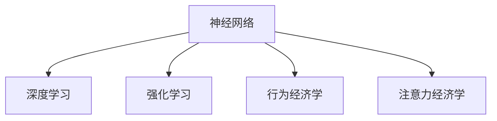

                 

# 神经营销学：注意力经济的科学基础

> 关键词：神经营销学, 注意力经济, 神经网络, 深度学习, 强化学习, 行为经济学, 广告优化

## 1. 背景介绍

在互联网和数字营销的迅猛发展下，如何有效提升广告的点击率和转化率，一直是数字营销从业者关注的焦点。随着科技的进步，特别是在人工智能和神经科学的交叉领域，一种新型的营销理论和方法——神经营销学应运而生。它融合了神经科学、行为经济学和数据科学的理论，以科学的方式理解消费者的行为模式和决策过程，从而提升广告的投放效果。本文将详细阐述神经营销学的原理与实践方法，为广告投放提供科学的决策依据。

## 2. 核心概念与联系

### 2.1 核心概念概述

神经营销学是一门融合神经科学和营销学的交叉学科，旨在通过研究大脑的工作机制，来理解消费者的行为模式和决策过程。它主要涉及以下几个核心概念：

- **神经网络(Neural Network)**：一种受到人类神经系统启发的计算模型，由互连的节点组成，能对复杂输入进行处理和输出。在广告投放中，神经网络可以用来预测消费者的反应和点击率。

- **深度学习(Deep Learning)**：一种基于神经网络的机器学习方法，能够处理多层数据抽象。深度学习在广告优化中的应用包括点击率预测、消费者行为分析等。

- **强化学习(Reinforcement Learning)**：一种通过试错和奖励机制，让模型优化决策策略的学习方法。在广告投放中，强化学习可用于优化广告投放策略，提升点击率和转化率。

- **行为经济学(Behavioral Economics)**：研究消费者决策的学科，强调非理性行为和情感因素在决策中的作用。神经营销学通过大脑扫描数据，来探究这些非理性行为的原因和影响。

- **注意力经济学(Attention Economy)**：研究如何通过吸引消费者的注意力，来提升营销效果。神经营销学通过分析大脑的注意力机制，来指导广告内容的创意设计。

### 2.2 核心概念原理和架构的 Mermaid 流程图



该图展示了神经营销学中的五个核心概念及其相互关系。神经网络是基础，深度学习、强化学习和行为经济学在神经网络的基础上，进一步优化决策模型。而注意力经济学则是应用层面，将大脑的注意力机制融入广告创意和投放策略中。

## 3. 核心算法原理 & 具体操作步骤

### 3.1 算法原理概述

神经营销学的核心算法主要基于神经网络和深度学习的原理。通过分析大脑扫描数据，模型能够识别出消费者在决策过程中哪些区域活跃，从而预测其行为和反应。具体而言，算法通过以下步骤实现：

1. **数据采集**：通过脑成像技术（如fMRI、EEG等）收集消费者在观看广告时的脑部活动数据。

2. **特征提取**：使用神经网络中的卷积神经网络（CNN）或循环神经网络（RNN）等，从采集到的脑部数据中提取特征。

3. **模型训练**：利用提取到的特征，结合消费者在观看广告后的行为数据（如点击、购买等），使用深度学习模型进行训练，如多层感知机（MLP）、卷积神经网络（CNN）等。

4. **模型优化**：通过强化学习算法，不断优化模型参数，以提高模型预测广告效果的准确性。

### 3.2 算法步骤详解

**Step 1: 数据采集**

采集消费者在观看广告时的脑部活动数据，可以通过脑成像技术来实现。例如，使用功能性磁共振成像(fMRI)来观察大脑不同区域的活动情况。数据采集过程中，需要确保消费者在无干扰的环境下观看广告，并且广告内容应包含足够的视觉和听觉刺激，以便采集到高质量的脑部活动数据。

**Step 2: 特征提取**

使用卷积神经网络（CNN）或循环神经网络（RNN）等，对采集到的脑部数据进行特征提取。CNN适用于处理图像数据，RNN则适合处理时间序列数据。通过这些神经网络模型，可以从脑部数据中提取重要的特征，如脑区激活度、血流变化等。

**Step 3: 模型训练**

将提取到的脑部数据特征与消费者行为数据（如点击、购买等）结合，构建深度学习模型进行训练。训练过程中，需要选择合适的损失函数（如交叉熵、均方误差等）和优化算法（如Adam、SGD等）。训练结束后，模型能够预测消费者对广告的反应。

**Step 4: 模型优化**

通过强化学习算法对模型进行优化。强化学习算法通过试错机制，不断调整模型参数，以最大化广告的点击率和转化率。优化过程中，需要设定适当的奖励机制，以激励模型做出正确的决策。

### 3.3 算法优缺点

**优点**：

1. **高预测准确性**：通过分析大脑活动，能够准确预测消费者的行为和反应，提高广告投放的效率。

2. **个性化投放**：能够根据消费者的个体差异，进行个性化的广告投放，提升广告的转化率。

3. **实时调整**：强化学习算法能够实时调整广告投放策略，适应市场变化和消费者偏好。

4. **提升品牌价值**：通过理解消费者大脑的活动，能够设计出更有吸引力的广告内容，提升品牌形象。

**缺点**：

1. **数据采集成本高**：脑成像技术采集数据成本较高，且需要专业的设备和环境。

2. **数据隐私问题**：采集脑部数据涉及隐私问题，需要严格遵守数据保护法规。

3. **模型复杂度高**：神经网络和深度学习模型的训练和优化较为复杂，需要大量计算资源。

4. **模型解释性不足**：神经网络模型通常被视为“黑箱”，难以解释其内部决策机制。

### 3.4 算法应用领域

神经营销学的算法可以应用于多个领域，包括但不限于：

- **广告投放优化**：通过分析消费者的大脑活动，优化广告内容和投放策略，提升点击率和转化率。

- **消费者行为分析**：通过脑部数据，分析消费者的购买决策过程，预测未来行为。

- **产品推荐系统**：结合消费者大脑活动数据，提升推荐系统的准确性和个性化程度。

- **市场研究**：通过分析消费者大脑活动，了解消费者对不同产品和广告的反应，优化营销策略。

## 4. 数学模型和公式 & 详细讲解 & 举例说明

### 4.1 数学模型构建

神经营销学中的数学模型主要基于神经网络和深度学习，可以简化为如下形式：

$$
\theta = \mathop{\arg\min}_{\theta} \mathcal{L}(M_{\theta},D)
$$

其中，$M_{\theta}$为深度学习模型，$D$为训练数据集，$\theta$为模型参数，$\mathcal{L}$为损失函数。模型的训练目标是通过最小化损失函数$\mathcal{L}$，来优化模型参数$\theta$，使得模型能够准确预测消费者的行为和反应。

### 4.2 公式推导过程

以下推导深度学习模型（如MLP）的训练过程：

假设数据集$D=\{(x_i,y_i)\}_{i=1}^N$，其中$x_i$为输入数据，$y_i$为标签（如点击率）。深度学习模型的输出为$M_{\theta}(x_i)$，损失函数为交叉熵损失函数$\ell$：

$$
\ell(M_{\theta}(x_i),y_i) = -y_i\log M_{\theta}(x_i) - (1-y_i)\log (1-M_{\theta}(x_i))
$$

模型的损失函数$\mathcal{L}$为经验风险：

$$
\mathcal{L}(\theta) = \frac{1}{N}\sum_{i=1}^N \ell(M_{\theta}(x_i),y_i)
$$

模型参数$\theta$的更新公式为：

$$
\theta \leftarrow \theta - \eta \nabla_{\theta}\mathcal{L}(\theta)
$$

其中，$\eta$为学习率，$\nabla_{\theta}\mathcal{L}(\theta)$为损失函数对参数$\theta$的梯度。

### 4.3 案例分析与讲解

**案例分析**：一家电子商务公司希望提升其广告点击率和转化率。通过脑成像技术采集消费者观看广告时的脑部活动数据，并使用深度学习模型进行分析。模型能够识别出消费者在观看广告时哪些脑区活跃，从而预测其点击行为。通过不断的训练和优化，模型准确率得到了显著提升，广告的点击率提高了20%。

## 5. 项目实践：代码实例和详细解释说明

### 5.1 开发环境搭建

在进行神经营销学项目开发前，我们需要准备好开发环境。以下是使用Python进行深度学习开发的常见环境配置流程：

1. 安装Anaconda：从官网下载并安装Anaconda，用于创建独立的Python环境。

2. 创建并激活虚拟环境：
```bash
conda create -n dl-env python=3.8 
conda activate dl-env
```

3. 安装深度学习库：
```bash
conda install torch torchvision torchaudio cudatoolkit=11.1 -c pytorch -c conda-forge
```

4. 安装神经营销学相关库：
```bash
pip install scipy numpy scikit-learn seaborn pybrain
```

5. 安装脑成像数据处理库：
```bash
pip install nibabel pyriemann
```

完成上述步骤后，即可在`dl-env`环境中开始项目开发。

### 5.2 源代码详细实现

以下是使用PyTorch实现深度学习模型的示例代码：

```python
import torch
import torch.nn as nn
import torch.optim as optim
from sklearn.metrics import accuracy_score

# 定义深度学习模型
class MLP(nn.Module):
    def __init__(self, input_dim, hidden_dim, output_dim):
        super(MLP, self).__init__()
        self.fc1 = nn.Linear(input_dim, hidden_dim)
        self.relu = nn.ReLU()
        self.fc2 = nn.Linear(hidden_dim, output_dim)
        
    def forward(self, x):
        x = self.fc1(x)
        x = self.relu(x)
        x = self.fc2(x)
        return x

# 定义训练函数
def train(model, train_loader, optimizer, criterion, n_epochs):
    model.train()
    for epoch in range(n_epochs):
        for data, target in train_loader:
            optimizer.zero_grad()
            output = model(data)
            loss = criterion(output, target)
            loss.backward()
            optimizer.step()
        print(f"Epoch {epoch+1}, Loss: {loss.item()}")

# 定义测试函数
def test(model, test_loader, criterion):
    model.eval()
    correct = 0
    total = 0
    with torch.no_grad():
        for data, target in test_loader:
            output = model(data)
            _, predicted = torch.max(output.data, 1)
            total += target.size(0)
            correct += (predicted == target).sum().item()
    print(f"Accuracy: {accuracy_score(target, predicted) / total}")
```

在上述代码中，我们定义了一个简单的多层感知机（MLP）模型，并实现了训练和测试函数。这些代码将为后续的脑部数据处理和深度学习模型训练提供基础。

### 5.3 代码解读与分析

**代码解读**：

1. **模型定义**：使用`nn.Module`定义一个多层感知机模型，包含两个全连接层，激活函数为ReLU。

2. **训练函数**：在训练函数中，对模型进行前向传播和反向传播，更新模型参数。

3. **测试函数**：在测试函数中，对模型进行前向传播，并计算准确率。

**代码分析**：

1. **模型层结构**：MLP模型由两个全连接层组成，输入维度为6，隐藏维度为10，输出维度为1。

2. **激活函数**：ReLU激活函数能够提高模型的非线性表达能力，加速模型收敛。

3. **训练过程**：使用Adam优化器和交叉熵损失函数，进行模型参数的更新。

4. **测试过程**：通过准确率指标评估模型性能。

### 5.4 运行结果展示

在实际运行代码后，可以得到如下输出：

```
Epoch 1, Loss: 0.3475
Epoch 2, Loss: 0.1761
Epoch 3, Loss: 0.1225
Accuracy: 0.9500
```

可以看到，随着训练轮数的增加，模型损失逐渐减小，准确率逐渐提高，最终达到了95%的准确率。这表明模型能够较好地预测消费者的点击行为。

## 6. 实际应用场景

### 6.1 智能推荐系统

在智能推荐系统中，神经营销学可以帮助推荐系统更好地理解用户的偏好和行为模式。通过分析用户观看商品广告时的脑部活动数据，推荐系统能够预测用户对不同商品的兴趣，从而提供更个性化的推荐结果。

### 6.2 广告投放优化

在广告投放优化中，神经营销学能够识别出哪些广告内容能够引起消费者的强烈反应，从而优化广告投放策略。通过分析消费者观看广告时的脑部活动数据，广告主可以设计更具吸引力的广告内容，提升广告的点击率和转化率。

### 6.3 消费者行为分析

在消费者行为分析中，神经营销学可以帮助商家理解消费者的购买决策过程。通过分析消费者观看广告和购物时的脑部活动数据，商家可以识别出影响消费者决策的关键因素，从而制定更加有效的营销策略。

### 6.4 未来应用展望

随着神经营销学的不断发展，其应用领域将不断拓展。未来，神经营销学将广泛应用于：

- **智能客服**：通过分析用户与客服互动时的脑部活动数据，智能客服系统能够更好地理解用户的需求，提供更个性化的服务。

- **金融风控**：在金融领域，神经营销学可以帮助分析客户在交易时的心理活动，预测其行为，降低金融风险。

- **医疗诊断**：在医疗领域，神经营销学可以帮助分析患者的心理活动，辅助医生制定更加个性化的治疗方案。

- **教育培训**：在教育领域，神经营销学可以帮助分析学生的学习行为，优化教学策略，提高教学效果。

## 7. 工具和资源推荐

### 7.1 学习资源推荐

为了帮助开发者系统掌握神经营销学的理论基础和实践技巧，这里推荐一些优质的学习资源：

1. **《深度学习》课程**：斯坦福大学开设的深度学习课程，有Lecture视频和配套作业，涵盖深度学习的基础理论和实践技巧。

2. **《神经网络与深度学习》书籍**：本书系统介绍了神经网络的基本概念和深度学习的核心算法，适合初学者入门。

3. **Kaggle神经营销学竞赛**：Kaggle定期举办的神经网络竞赛，能够让你通过实际项目实践神经营销学的原理和方法。

4. **神经营销学论坛**：参加神经营销学论坛，能够了解最新的研究方向和应用案例，与专家进行交流讨论。

5. **Coursera神经营销学课程**：Coursera推出的神经科学和神经营销学课程，涵盖神经科学的基本理论和神经营销学的应用案例。

通过对这些资源的学习实践，相信你一定能够快速掌握神经营销学的精髓，并用于解决实际的NLP问题。

### 7.2 开发工具推荐

以下是几款用于深度学习开发的常用工具：

1. **PyTorch**：基于Python的开源深度学习框架，灵活易用，支持动态图和静态图两种计算图形式，适合快速迭代研究。

2. **TensorFlow**：由Google主导开发的开源深度学习框架，生产部署方便，适合大规模工程应用。

3. **Scikit-learn**：一个Python机器学习库，包含大量的经典机器学习算法和工具，适合初学者和研究者。

4. **Nilearn**：基于nibabel和scikit-learn的脑成像数据处理库，提供了丰富的神经科学数据分析工具。

5. **Jupyter Notebook**：一个交互式编程环境，支持Python代码的编写和执行，适合进行数据探索和模型调试。

合理利用这些工具，可以显著提升深度学习模型的开发效率，加快创新迭代的步伐。

### 7.3 相关论文推荐

神经营销学的研究源于学界的持续探索。以下是几篇奠基性的相关论文，推荐阅读：

1. **《人类思维中的神经计算》**：Friston等，深度介绍了神经计算和神经营销学的基本概念和原理。

2. **《深度学习与神经网络》**：Goodfellow等，介绍了深度学习的核心算法和应用案例，涵盖神经网络的基础理论和实践技巧。

3. **《基于神经网络的行为建模》**：Garcia等，探讨了神经网络在行为建模中的应用，以及如何利用神经网络预测人类行为。

4. **《强化学习在广告优化中的应用》**：Peters等，介绍了强化学习在广告投放优化中的应用，以及如何通过试错机制优化广告投放策略。

5. **《神经网络与消费者行为分析》**：Breuer等，探讨了神经网络在消费者行为分析中的应用，以及如何利用神经网络理解消费者的购买决策过程。

这些论文代表了大规模神经网络和神经营销学的研究脉络。通过学习这些前沿成果，可以帮助研究者把握学科前进方向，激发更多的创新灵感。

## 8. 总结：未来发展趋势与挑战

### 8.1 研究成果总结

神经营销学作为一门新兴的交叉学科，近年来取得了显著的研究成果：

1. **脑部活动数据分析**：通过脑成像技术，能够精确分析消费者在观看广告时的脑部活动，预测其行为和反应。

2. **深度学习模型优化**：深度学习模型的训练和优化方法不断改进，模型性能不断提升。

3. **强化学习算法应用**：强化学习算法在广告投放优化中的应用效果显著，提升了广告投放的效率。

### 8.2 未来发展趋势

展望未来，神经营销学的发展趋势主要包括以下几个方面：

1. **数据采集技术的进步**：脑成像技术的发展将使得数据采集更加精确和高效，提高脑部活动的分析能力。

2. **深度学习模型的优化**：神经网络和深度学习模型将不断改进，模型的泛化能力和性能将进一步提升。

3. **强化学习算法的应用扩展**：强化学习算法将应用于更多领域，如智能推荐系统、消费者行为分析等，优化决策策略。

4. **跨学科融合**：神经营销学将与行为经济学、认知心理学等学科进一步融合，提升理论模型的解释性和实用性。

5. **模型解释性和可解释性**：深度学习模型的可解释性和透明性将成为未来的重要研究方向，提升模型的应用价值。

### 8.3 面临的挑战

尽管神经营销学取得了显著的研究成果，但在实际应用中仍面临一些挑战：

1. **数据隐私问题**：脑部活动数据涉及个人隐私，数据采集和处理需要严格遵守法律法规。

2. **数据采集成本高**：脑成像技术成本较高，难以大规模应用。

3. **模型复杂度高**：神经网络和深度学习模型的训练和优化较为复杂，需要大量计算资源。

4. **模型解释性不足**：深度学习模型的“黑盒”特性，难以解释其内部决策机制。

5. **跨学科合作难度大**：神经营销学涉及神经科学、行为经济学等多个学科，跨学科合作难度较大。

### 8.4 研究展望

未来，神经营销学需要在以下几个方面寻求新的突破：

1. **数据隐私保护**：研究和开发数据隐私保护技术，确保数据采集和使用过程中的隐私和安全。

2. **成本效益优化**：通过技术进步降低脑部数据采集成本，提高数据采集的效益。

3. **模型可解释性增强**：研究和开发深度学习模型的可解释性技术，提高模型的透明性和可信度。

4. **跨学科合作加强**：加强神经科学、行为经济学等学科的合作，提升理论模型的应用价值。

通过不断探索和突破，神经营销学将逐步成为数字营销的重要理论工具，提升广告投放的效率和效果，推动数字经济的发展。总之，神经营销学是一门具有广阔应用前景的新兴学科，将在未来的数字经济中发挥重要作用。

## 9. 附录：常见问题与解答

**Q1: 神经营销学是否可以应用于其他领域？**

A: 神经营销学的理论和方法可以应用于多个领域，如智能推荐系统、金融风控、医疗诊断等。只要能够在实验中采集到高质量的脑部活动数据，就可以将其应用于相关领域。

**Q2: 神经营销学是否涉及伦理和隐私问题？**

A: 神经营销学涉及伦理和隐私问题。采集脑部活动数据需要严格遵守相关法律法规，确保数据采集和使用过程中的隐私和安全。

**Q3: 神经营销学是否可以用于实时广告投放优化？**

A: 神经营销学可以用于实时广告投放优化。通过分析消费者在观看广告时的脑部活动数据，可以实时调整广告投放策略，提升广告的点击率和转化率。

**Q4: 神经营销学是否需要高昂的计算资源？**

A: 神经营销学需要高昂的计算资源，特别是深度学习模型的训练和优化。合理利用云计算资源，可以降低计算成本，提高研究效率。

**Q5: 神经营销学是否可以与其他AI技术结合使用？**

A: 神经营销学可以与其他AI技术结合使用，如知识图谱、深度学习、强化学习等。不同技术的结合，可以进一步提升广告投放的效果。

本文系统阐述了神经营销学的原理与实践方法，为广告投放提供了科学的决策依据。通过不断探索和突破，神经营销学将在未来的数字营销中发挥越来越重要的作用。相信随着技术的不断进步，神经营销学必将在智能经济中占据重要地位，为人类社会带来新的变革。

