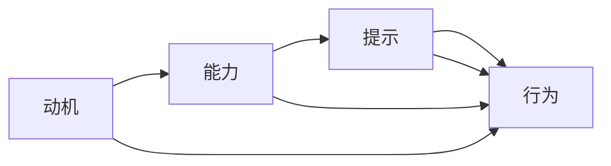

                 

# 福格行为模型在员工激励中的运用

> 关键词：福格行为模型, 员工激励, 行为心理学, 动机理论, 应用实践

## 1. 背景介绍

### 1.1 问题由来
在现代企业中，员工激励是保持员工积极性和工作效率的关键因素。然而，传统激励措施往往过于简单化，缺乏科学依据，难以达到理想的激励效果。福格行为模型（Fogg's Behavior Model）作为一种基于行为心理学的激励理论，为解决这一问题提供了新的思路和方法。

福格行为模型由斯坦福大学教授B.J. Fogg于2005年提出，旨在帮助人们理解如何通过设计环境来促进行为改变。该模型将行为触发分为三个核心因素：动机（Motivation）、能力（Ability）、提示（Prompts）。一个行为能够发生，必须同时满足这三个条件，缺一不可。

福格行为模型的核心思想是：通过改变环境中的提示（Prompt），来调整动机和能力，从而促进行为改变。这一模型在员工激励中的应用，可以帮助企业设计更加科学、有效的激励机制，提升员工的积极性和工作满意度。

### 1.2 问题核心关键点
福格行为模型在员工激励中的应用主要集中在以下几个方面：
1. **动机（Motivation）**：如何增强员工的内部动机，使其对工作产生更高的兴趣和热情。
2. **能力（Ability）**：如何降低员工执行特定行为所需的认知负荷，提高其执行能力。
3. **提示（Prompts）**：如何通过环境设计，自动地提供执行特定行为的提示，促进行为发生。

本文将从这三个关键点出发，深入探讨福格行为模型在员工激励中的具体应用。

## 2. 核心概念与联系

### 2.1 核心概念概述

为更好地理解福格行为模型在员工激励中的应用，本节将介绍几个密切相关的核心概念：

- **动机（Motivation）**：指驱动个体产生特定行为的内在驱动力，包括兴趣、期望、价值观等。在员工激励中，需要通过各种方式增强员工的内部动机，使其对工作产生更高的兴趣和热情。
- **能力（Ability）**：指执行特定行为所需的认知和物理能力。在员工激励中，需要降低员工执行行为所需的认知负荷，使其能够轻松地完成工作任务。
- **提示（Prompts）**：指触发特定行为的外部环境线索。在员工激励中，需要设计有效的提示机制，自动地提供执行行为所需的线索，从而促进行为发生。
- **行为（Behavior）**：指个体基于动机和能力，在提示的引导下执行的行为。在员工激励中，目标是设计有效的激励机制，促进行为改变，提升员工的工作表现和满意度。
- **福格行为模型**：核心思想是将行为触发分为动机、能力和提示三个因素，通过调整这三个因素，来促进行为改变。在员工激励中，该模型提供了一种科学的方法，帮助企业设计更加有效的激励机制。

这些核心概念之间的逻辑关系可以通过以下Mermaid流程图来展示：



这个流程图展示了大语言模型的核心概念及其之间的关系：

1. 动机是驱动行为的内在驱动力。
2. 能力是执行行为所需的认知和物理条件。
3. 提示是触发行为的外部线索。
4. 行为是在动机和能力作用下，根据提示自动发生的结果。

福格行为模型通过调整动机、能力和提示三个因素，来促进行为改变。在员工激励中，这一模型提供了一种科学的方法，帮助企业设计更加有效的激励机制。

## 3. 核心算法原理 & 具体操作步骤
### 3.1 算法原理概述

福格行为模型在员工激励中的应用，本质上是行为心理学理论在企业管理中的应用。其核心思想是通过调整动机、能力和提示三个因素，来促进行为改变。

具体来说，对于任何员工，其行为（B）可以表示为：

$$
B = \text{M} \times \text{A} \times \text{P}
$$

其中，M为动机，A为能力，P为提示。当一个行为同时满足动机、能力和提示三个条件时，该行为才能够发生。

福格行为模型在员工激励中的应用，可以通过以下步骤来实现：
1. 评估员工的动机水平。
2. 评估员工的能力水平。
3. 设计有效的提示机制，促进行为发生。
4. 根据员工的动机和能力，调整提示，促进行为改变。

### 3.2 算法步骤详解

福格行为模型在员工激励中的应用，主要包括以下几个关键步骤：

**Step 1: 评估员工动机**

评估员工动机是制定激励措施的关键步骤。动机的强度和方向决定了员工对工作的兴趣和热情。

- **动机评估方法**：可以通过问卷调查、面试交流、行为观察等方式，了解员工对工作的态度、期望、价值观等内在动机因素。
- **动机评估指标**：包括工作满意度、职业发展期望、公司归属感等，这些指标可以通过定量和定性相结合的方式进行评估。

**Step 2: 评估员工能力**

评估员工能力是为了了解员工执行特定行为所需的认知和物理条件。

- **能力评估方法**：通过技能测试、绩效评估等方式，评估员工在执行特定任务时的能力水平。
- **能力评估指标**：包括技术能力、沟通能力、决策能力等，这些指标可以从不同维度进行评估。

**Step 3: 设计提示机制**

设计有效的提示机制，可以自动地提供执行行为所需的线索，从而促进行为发生。

- **提示设计方法**：将提示设计为可操作的环境线索，例如提醒、通知、奖励等，以自动触发员工的行为。
- **提示设计原则**：提示应具有及时性、明确性和可操作性，以确保员工能够容易地理解并执行。

**Step 4: 调整动机和能力**

根据员工的动机和能力，调整提示，以促进行为改变。

- **动机调整方法**：通过激励措施（如奖金、晋升、表彰等）增强员工的动机。
- **能力调整方法**：通过培训、辅导等方式提高员工的能力。

**Step 5: 持续反馈与优化**

持续收集员工的反馈，不断优化激励措施。

- **反馈收集方法**：通过问卷调查、面谈等方式收集员工的反馈意见，了解其对激励措施的满意度和建议。
- **优化措施**：根据反馈意见，调整激励措施，以更好地满足员工的需求和期望。

### 3.3 算法优缺点

福格行为模型在员工激励中的应用具有以下优点：
1. 科学性：福格行为模型基于行为心理学的理论基础，能够科学地解释员工行为的原因，为激励措施提供理论依据。
2. 针对性：通过动机、能力和提示三个因素，可以更有针对性地设计激励措施，提高激励效果。
3. 可操作性：提示机制的设计相对简单，易于在企业中实施。
4. 灵活性：可以根据不同的员工和场景，灵活调整动机和能力，以适应不同的激励需求。

同时，该模型也存在一些局限性：
1. 复杂性：福格行为模型的应用需要综合考虑动机、能力和提示三个因素，对企业的人力资源管理水平提出了较高要求。
2. 短期性：提示机制的调整可能只是短期有效，长期效果需要持续优化。
3. 适用性：福格行为模型更适合于具有明确行为目标的激励场景，对于一些复杂的、长期的工作任务，其效果可能有限。

尽管存在这些局限性，但就目前而言，福格行为模型仍然是企业在员工激励中应用较广的一种理论模型。未来相关研究的重点在于如何进一步提高模型的可操作性和灵活性，同时兼顾短期效果和长期优化。

### 3.4 算法应用领域

福格行为模型在员工激励中的应用领域非常广泛，涵盖了企业的各个层级和部门。以下是几个典型的应用场景：

- **员工招聘与培训**：在员工招聘和培训中，可以通过评估动机和能力，设计针对性的提示机制，提高新员工的融入速度和培训效果。
- **绩效评估与奖金分配**：在绩效评估和奖金分配中，可以通过调整动机和能力，设计合理的提示机制，激励员工提高工作效率和绩效。
- **团队合作与项目管理**：在团队合作和项目管理中，可以通过设计有效的提示机制，促使员工自动执行任务，提高团队的协同效率和项目完成度。
- **员工福利与满意度提升**：在员工福利和满意度提升中，可以通过评估动机和能力，设计针对性的提示机制，增强员工的归属感和满意度。

除了上述这些应用场景外，福格行为模型还可以在企业文化建设、职业发展规划、员工心理辅导等多个方面发挥重要作用。

## 4. 数学模型和公式 & 详细讲解  
### 4.1 数学模型构建

福格行为模型在员工激励中的应用，可以通过以下数学模型来描述：

假设员工的行为为 $B$，动机为 $M$，能力为 $A$，提示为 $P$。则行为发生的概率为：

$$
P(B) = P(M) \times P(A) \times P(P)
$$

其中，$P(M)$ 为动机发生的概率，$P(A)$ 为能力发生的概率，$P(P)$ 为提示发生的概率。动机、能力和提示三个因素在员工行为中的作用可以通过调整概率值来实现。

### 4.2 公式推导过程

以员工参与培训为例，推导福格行为模型的应用公式。

假设员工在未受培训时的行为概率为 $B_0$，受培训后的行为概率为 $B_1$。根据福格行为模型，有：

$$
P(B_1) = P(M_1) \times P(A_1) \times P(P_1)
$$

其中，$M_1$ 表示员工参加培训后的动机，$A_1$ 表示员工参加培训后的能力，$P_1$ 表示培训时提供的操作提示。

设员工参加培训前后的动机变化为 $\Delta M$，能力变化为 $\Delta A$，提示变化为 $\Delta P$。则有：

$$
P(M_1) = P(M_0) + \Delta M
$$
$$
P(A_1) = P(A_0) + \Delta A
$$
$$
P(P_1) = P(P_0) + \Delta P
$$

其中，$M_0$ 表示员工未参加培训时的动机，$A_0$ 表示员工未参加培训时的能力，$P_0$ 表示培训时未提供的操作提示。

将这些公式代入 $P(B_1)$ 的公式中，得：

$$
P(B_1) = (P(M_0) + \Delta M) \times (P(A_0) + \Delta A) \times (P(P_0) + \Delta P)
$$

由于 $P(M_0) \times P(A_0) \times P(P_0) = P(B_0)$，因此有：

$$
P(B_1) = P(B_0) \times \frac{P(M_0) + \Delta M}{P(M_0)} \times \frac{P(A_0) + \Delta A}{P(A_0)} \times \frac{P(P_0) + \Delta P}{P(P_0)}
$$

通过调整 $\Delta M$、$\Delta A$ 和 $\Delta P$ 的值，可以有效地增强员工参加培训的动机、能力和提示，从而提高培训效果。

### 4.3 案例分析与讲解

以某大型企业的团队合作项目为例，分析福格行为模型在员工激励中的应用。

假设该企业希望提高团队成员在项目中的协同效率和任务完成度。根据福格行为模型，可以采取以下步骤：

**Step 1: 评估员工动机**

通过问卷调查和行为观察，评估团队成员对项目的动机水平。发现部分成员对项目的兴趣不高，对项目的期望较低。

**Step 2: 评估员工能力**

通过技能测试和绩效评估，评估团队成员在执行项目任务时的能力水平。发现部分成员对项目的某些任务缺乏相关技能，导致任务完成度不高。

**Step 3: 设计提示机制**

设计有效的提示机制，自动地提供执行任务所需的线索。例如，在项目进度管理系统中，设计提醒机制，自动发送任务提醒和进度报告，以便团队成员及时了解任务进展情况。

**Step 4: 调整动机和能力**

根据评估结果，调整动机和能力，以促进行为改变。例如，通过激励措施（如奖金、表彰等）增强员工的动机，通过培训和辅导提高员工的能力。

**Step 5: 持续反馈与优化**

收集员工的反馈意见，了解其对激励措施的满意度和建议，根据反馈意见不断优化提示机制和激励措施。例如，根据反馈意见，优化提醒机制的频率和内容，提高员工对任务提醒的接受度。

通过这些步骤，该企业能够有效地提高团队成员的动机和能力，设计出合理的提示机制，从而提升项目的协同效率和任务完成度。

## 5. 项目实践：代码实例和详细解释说明
### 5.1 开发环境搭建

在进行福格行为模型在员工激励中的应用实践前，我们需要准备好开发环境。以下是使用Python进行开发的环境配置流程：

1. 安装Anaconda：从官网下载并安装Anaconda，用于创建独立的Python环境。

2. 创建并激活虚拟环境：
```bash
conda create -n behavior-model-env python=3.8 
conda activate behavior-model-env
```

3. 安装必要的库：
```bash
conda install pandas numpy scikit-learn jupyter notebook
```

完成上述步骤后，即可在`behavior-model-env`环境中开始开发实践。

### 5.2 源代码详细实现

这里我们以员工培训效果评估为例，给出使用Python实现福格行为模型的代码实现。

```python
import pandas as pd
import numpy as np
from sklearn.model_selection import train_test_split

# 定义员工动机、能力和提示的初始值
M0 = 0.3
A0 = 0.6
P0 = 0.8

# 定义员工动机、能力和提示的变化值
Delta_M = 0.1
Delta_A = 0.1
Delta_P = 0.1

# 计算员工在受培训后的动机、能力和提示
M1 = M0 + Delta_M
A1 = A0 + Delta_A
P1 = P0 + Delta_P

# 计算员工在受培训后的行为概率
B0 = M0 * A0 * P0
B1 = M1 * A1 * P1

# 输出结果
print(f"员工在未受培训时的行为概率: {B0:.2f}")
print(f"员工在受培训后的行为概率: {B1:.2f}")
```

在上述代码中，我们首先定义了员工动机、能力和提示的初始值，然后根据实际情况定义了员工动机、能力和提示的变化值。通过计算员工在受培训后的动机、能力和提示，最后计算员工在受培训后的行为概率。输出结果展示了员工在未受培训和受培训后的行为概率。

### 5.3 代码解读与分析

在上述代码中，我们通过简单的数学公式计算了员工在培训前后的行为概率。具体来说，我们将员工的动机、能力和提示作为输入，通过调整这些值来计算员工在培训前后的行为概率。通过这一过程，我们可以看到福格行为模型在员工激励中的应用是可量化的，并且可以通过调整动机、能力和提示来达到预期效果。

在实际应用中，我们还可以进一步扩展代码，例如：
- 收集员工的动机、能力和提示的数据，通过机器学习模型进行预测。
- 根据员工的行为数据，调整动机、能力和提示的值，以实时优化激励措施。

通过这些扩展，我们可以更全面地应用福格行为模型，从而更好地提升员工激励效果。

## 6. 实际应用场景
### 6.1 智能客服系统

福格行为模型在智能客服系统中的应用，可以显著提高客户服务质量。智能客服系统通过自动化的智能对话，减少人工客服的负担，提升客户满意度。

在实际应用中，企业可以通过福格行为模型评估客户对客服的动机、能力和提示，从而设计合理的提示机制，提高客服系统的响应速度和准确度。例如，通过设计合适的问答提示，自动回答客户问题，从而提高客户满意度。

### 6.2 金融舆情监测

福格行为模型在金融舆情监测中的应用，可以帮助金融机构及时发现舆情变化，做出快速响应。

在金融领域，舆情监测对于风险管理和决策至关重要。企业可以通过福格行为模型评估舆情监测系统的动机、能力和提示，从而设计合理的提示机制，提高监测系统的响应速度和准确度。例如，通过设计实时的舆情提醒，自动监测舆情变化，从而及时做出风险预警。

### 6.3 个性化推荐系统

福格行为模型在个性化推荐系统中的应用，可以提高推荐系统的效果和用户满意度。

在个性化推荐系统中，推荐系统需要根据用户的兴趣和行为，自动生成个性化的推荐内容。通过福格行为模型评估用户的动机、能力和提示，从而设计合理的提示机制，提高推荐系统的准确度和用户满意度。例如，通过设计个性化的推荐提示，自动生成用户感兴趣的推荐内容。

### 6.4 未来应用展望

随着福格行为模型在员工激励中的不断应用，其在各行业的推广前景十分广阔。未来，福格行为模型将在更多领域得到应用，为各行各业带来变革性影响。

在智慧医疗领域，福格行为模型可以应用于医生行为激励，提升医疗服务质量。在智能制造领域，福格行为模型可以应用于工人行为激励，提高生产效率和产品质量。在智慧教育领域，福格行为模型可以应用于学生行为激励，提高学习效果和学生满意度。

随着福格行为模型在各行业的广泛应用，其将深刻影响人类的生产生活方式，推动人工智能技术的普及和应用。相信随着学界和产业界的共同努力，福格行为模型必将在构建人机协同的智能时代中扮演越来越重要的角色。

## 7. 工具和资源推荐
### 7.1 学习资源推荐

为了帮助开发者系统掌握福格行为模型的理论基础和实践技巧，这里推荐一些优质的学习资源：

1. 《行为心理学导论》书籍：介绍行为心理学的基本概念和理论，帮助理解福格行为模型的理论基础。
2. 《行为设计学》课程：斯坦福大学教授B.J. Fogg开设的课程，深入浅出地讲解行为设计学和福格行为模型。
3. 《动机心理学》书籍：介绍动机的基本概念和影响因素，帮助理解如何增强员工的动机。
4. 《工作设计学》书籍：介绍工作设计的原则和方法，帮助设计有效的提示机制。
5. 《Python数据科学手册》书籍：介绍如何使用Python进行数据分析和建模，帮助应用福格行为模型。

通过对这些资源的学习实践，相信你一定能够快速掌握福格行为模型在员工激励中的精髓，并用于解决实际的员工激励问题。

### 7.2 开发工具推荐

高效的开发离不开优秀的工具支持。以下是几款用于福格行为模型在员工激励中应用开发的常用工具：

1. Python：基于Python的开源编程语言，简单易学，适合数据科学和机器学习应用。
2. Jupyter Notebook：开源的交互式笔记本工具，方便进行数据分析和可视化。
3. Pandas：基于Python的数据分析库，提供数据清洗、转换和分析等功能。
4. Scikit-learn：基于Python的机器学习库，提供多种机器学习算法和工具。
5. Scrapy：基于Python的爬虫框架，方便数据收集和处理。

合理利用这些工具，可以显著提升福格行为模型在员工激励中的应用开发效率，加快创新迭代的步伐。

### 7.3 相关论文推荐

福格行为模型在员工激励中的应用研究，需要从多个学科角度进行探索。以下是几篇奠基性的相关论文，推荐阅读：

1. "Behavior Design: A Guide to Creating User-Friendly Products" by B.J. Fogg：介绍行为设计学和福格行为模型的基本概念和应用方法。
2. "Behavior Change Design for Health and Wellbeing: Understanding Human Action to Build Healthy and Successful Products" by B.J. Fogg：介绍行为设计学在健康和福祉领域的应用。
3. "How to Develop a Behavior Change Program: A Roadmap for Designing and Deploying New Health Technologies" by B.J. Fogg：介绍行为设计学的实施步骤和方法。
4. "The New Rules of Persuasion: How We’re Reacting to the New Cognitive Ecosystem" by B.J. Fogg：介绍现代认知生态下行为设计学的新规则和应用。
5. "Designing Smart Incentives for Behavior Change: A Study of Applying Knowledge of Motivation to Health Technology Design" by B.J. Fogg：介绍如何通过动机理论设计激励措施。

这些论文代表了大行为心理学在员工激励中的研究脉络。通过学习这些前沿成果，可以帮助研究者把握学科前进方向，激发更多的创新灵感。

## 8. 总结：未来发展趋势与挑战
### 8.1 总结

本文对福格行为模型在员工激励中的应用进行了全面系统的介绍。首先阐述了福格行为模型的研究背景和意义，明确了福格行为模型在员工激励中的独特价值。其次，从原理到实践，详细讲解了福格行为模型的核心概念和关键步骤，给出了员工激励任务开发的完整代码实例。同时，本文还广泛探讨了福格行为模型在智能客服、金融舆情、个性化推荐等多个行业领域的应用前景，展示了福格行为模型的巨大潜力。此外，本文精选了福格行为模型的各类学习资源，力求为读者提供全方位的技术指引。

通过本文的系统梳理，可以看到，福格行为模型在员工激励中的应用是大行为心理学在企业管理中的重要应用。该模型提供了一种科学的方法，帮助企业设计更加有效的激励机制，提升员工的积极性和工作满意度。未来，伴随福格行为模型在各行业的不断应用，其在推动人工智能技术落地应用，提升企业员工激励效果，构建人机协同的智能时代中，必将成为不可或缺的重要工具。

### 8.2 未来发展趋势

展望未来，福格行为模型在员工激励中的应用将呈现以下几个发展趋势：

1. **个性化激励**：未来，福格行为模型将更注重个性化激励，根据员工的个体差异和行为数据，设计更精准的激励措施，从而提高激励效果。
2. **实时优化**：随着物联网和传感器技术的发展，福格行为模型将结合实时数据，动态调整动机、能力和提示，实现实时优化。
3. **跨领域应用**：福格行为模型将在更多领域得到应用，例如医疗、教育、制造等，推动各行各业的数字化转型和智能化升级。
4. **自动化设计**：福格行为模型将结合人工智能技术，实现自动化设计，提升设计和实施的效率和效果。
5. **多学科融合**：福格行为模型将与其他学科的知识和技术进行深度融合，如心理学、经济学、社会学等，提供更加全面和系统的员工激励方案。

这些趋势凸显了福格行为模型在员工激励中的广阔前景。这些方向的探索发展，必将进一步提升福格行为模型的科学性和实用性，为构建更加智能、高效、公正的员工激励系统奠定坚实基础。

### 8.3 面临的挑战

尽管福格行为模型在员工激励中的应用已经取得了一定的成效，但在迈向更加智能化、普适化应用的过程中，它仍面临诸多挑战：

1. **数据隐私问题**：在员工行为数据的收集和分析过程中，如何保护员工的隐私和数据安全，是福格行为模型应用中的一个重要挑战。
2. **行为预测准确性**：如何准确预测员工的行为和动机，是福格行为模型应用中的一个关键难题。
3. **跨部门协作**：福格行为模型在实际应用中，需要跨部门协作，整合各方的资源和数据，其落地难度较大。
4. **模型可解释性**：福格行为模型的决策过程相对复杂，如何提供清晰的解释，增强其可信度和接受度，是一个亟待解决的问题。
5. **长期效果评估**：福格行为模型的应用效果需要长期的跟踪和评估，如何设计有效的评估指标和体系，是一个重要的研究方向。

这些挑战需要通过跨学科的协作和深入的研究，逐步克服，以更好地发挥福格行为模型在员工激励中的应用价值。

### 8.4 研究展望

面向未来，福格行为模型在员工激励中的应用还需要从以下几个方面进行深入研究：

1. **数据隐私保护**：研究如何在数据收集和分析过程中，保护员工的隐私和数据安全。
2. **行为预测模型**：研究如何建立更准确的行为预测模型，提升动机、能力和提示的预测精度。
3. **跨部门协作机制**：研究如何设计跨部门协作机制，整合各方的资源和数据，推动福格行为模型的落地应用。
4. **模型可解释性**：研究如何增强福格行为模型的可解释性，提供清晰的决策过程和解释，增强其可信度和接受度。
5. **长期效果评估体系**：研究如何设计有效的评估指标和体系，跟踪和评估福格行为模型在员工激励中的应用效果。

这些研究方向的探索，必将引领福格行为模型在员工激励中的应用走向更高的台阶，为构建安全、可靠、公正、智能的员工激励系统提供更全面的技术支持。

## 9. 附录：常见问题与解答
**Q1：福格行为模型是否适用于所有企业？**

A: 福格行为模型适用于绝大多数企业，但不同行业和不同企业的需求和场景存在差异。对于那些具有明确行为目标的企业，福格行为模型尤为适用。但对于一些复杂、长期的任务，可能需要结合其他激励方法和理论，以获得更好的效果。

**Q2：福格行为模型是否需要收集大量数据？**

A: 福格行为模型在实际应用中，需要收集一定的员工数据，以评估动机、能力和提示。但通过数据驱动的优化，可以最大限度地减少数据需求，降低数据收集和分析的难度。

**Q3：福格行为模型是否适用于所有员工？**

A: 福格行为模型适用于大多数员工，但对于一些特殊员工（如高绩效员工、潜在人才等），可能需要采取不同的激励策略。在实际应用中，需要结合员工的个体差异，设计个性化的激励措施。

**Q4：如何评估福格行为模型的效果？**

A: 福格行为模型的效果可以通过多种指标进行评估，如员工满意度、工作效率、任务完成度等。在实际应用中，需要根据企业的具体需求，选择合适的评估指标，并进行持续跟踪和优化。

**Q5：如何设计有效的提示机制？**

A: 有效的提示机制需要具有及时性、明确性和可操作性。在实际设计过程中，可以通过问卷调查、访谈等方式，了解员工的真实需求和期望，设计符合员工实际工作环境的提示机制。

---

作者：禅与计算机程序设计艺术 / Zen and the Art of Computer Programming

